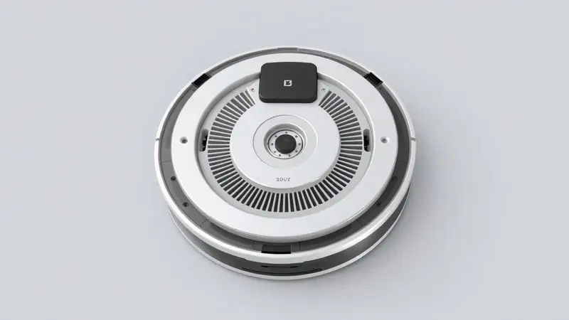
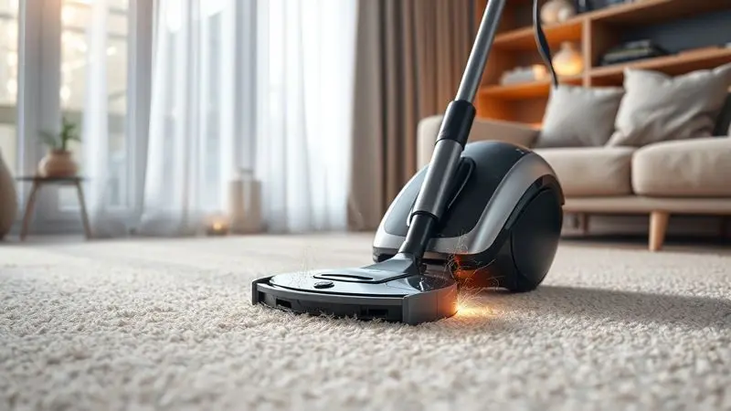
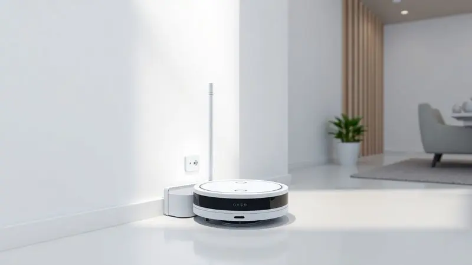

Lidar com o acúmulo constante de pelos é um desafio diário para quem divide a casa com cães ou gatos. Aquela sensação de varrer hoje e encontrar novos pelos amanhã, a poeira que se mistura aos fios nos cantos, a preocupação com alérgenos que afetam sua respiração...

É um ciclo sem fim. Mas imagine acordar e encontrar seu chão limpo, sem precisar passar o fim de semana com a vassoura na mão. Imagine chegar do trabalho e sua casa estar impecável, como se tivesse tido uma faxineira particular enquanto você estava fora.

É essa transformação que os melhores robôs aspiradores para pet oferecem em 2025, não apenas como eletrodomésticos, mas como aliados que devolvem seu tempo e trazem paz de espírito.

Neste guia, exploramos os modelos que realmente entendem o que significa viver com animais, focando naquilo que importa: limpeza profunda que você pode confiar e praticidade que se adapta à sua rotina.

<SummaryList products={frontmatter.top_products} />

## Melhores Robôs Aspiradores para quem tem Pet para Comprar em 2025

Se você convive com pets, sabe que a sujeira deles tem personalidade própria. Pelos que grudam em tudo, migalhas espalhadas após o lanche, areia da caixinha que vaza pelo chão.

Um bom robô aspirador para pet não é apenas um eletrodoméstico inteligente, é um membro silencioso da família que trabalha nos bastidores para manter o ambiente saudável e acolhedor para todos, incluindo seus animais de estimação.

### 1. Robô Aspirador Ropo Smart Pet

<ProductBox 
  title={frontmatter.top_products[0].title} 
  image={frontmatter.top_products[0].image} 
  link={frontmatter.top_products[0].link} 
/>

Imagine realizar duas tarefas ao mesmo tempo, sem esforço. O Ropo Smart Pet faz exatamente isso, combinando aspiração e passagem de pano em uma única operação.

Sua tecnologia ajusta automaticamente o fluxo de água, enquanto a escova central em formato V trabalha como uma garra que captura pelos presos em tapetes e frestas.

O diferencial está nos detalhes: o filtro HEPA não apenas limpa o chão, mas purifica o ar que sua família respira, retendo aqueles alérgenos finos que tanto afetam quem tem sensibilidade.

Controlá-lo é tão simples quanto pedir ao seu assistente de voz ou configurar uma rotina no aplicativo, criando uma limpeza personalizada que se adapta aos horários em que seus pets estão mais tranquilos.

<CaixaProsContras>

**Prós:**

- Limpeza 2 em 1 (aspiração e passagem de pano).

- Eficiente na remoção de pelos de pet.

- Sistema de filtragem avançado com filtro HEPA.

- Controle por aplicativo e compatibilidade com assistentes de voz.

**Contras:**

- Pode ser um pouco barulhento durante a operação.

- A capacidade da lixeira padrão é menor comparada a outros modelos.

</CaixaProsContras>

### 2. DREAME D10 Plus Gen 2 Robô Aspirador e Mopa

<ProductBox 
  title={frontmatter.top_products[1].title} 
  image={frontmatter.top_products[1].image} 
  link={frontmatter.top_products[1].link} 
/>

Para quem vive em espaços maiores e precisa de cobertura completa, o Dreame D10 Plus Gen 2 se apresenta como uma solução quase autônoma. Com sucção equivalente a 6000 Pa, imagine a força necessária para desalojar pelos profundamente encravados em carpetes.

Mas o verdadeiro luxo está na base que armazena sujeira por até 90 dias, poupando você daquela tarefa nada agradável de esvaziar o reservatório a cada dois dias.

Nos momentos em que seus pets estão brincando e espalhando petiscos pelo chão, sua bateria de longa duração garante que todos os cômodos sejam cobertos sem interrupções, enquanto o mapeamento inteligente evita aquelas áreas esquecidas atrás do sofá.

<CaixaProsContras>

**Prós:**

- Potente sucção de 6000 Pa, ideal para pelos de pets.

- Mapeamento inteligente que cobre toda a casa.

- Coleta automática de poeira por até 90 dias.

- Bateria com longa autonomia de até 285 minutos.

**Contras:**

- Função mopa é mais básica e pode não ser suficiente para limpezas profundas.

- Pode se enroscar em cabos e objetos pequenos no chão.

</CaixaProsContras>

### 3. Robô Aspirador Liectroux XR500 Pro 3 em 1

<ProductBox 
  title={frontmatter.top_products[2].title} 
  image={frontmatter.top_products[2].image} 
  link={frontmatter.top_products[2].link} 
/>

Alguns robôs apenas limpam, outros entendem a arquitetura da sua casa. O Liectroux XR500 Pro pertence ao segundo grupo, com navegação a laser que cria um mapa preciso dos seus ambientes.

Quando encontra um carpete, automaticamente aumenta a potência, como se soubesse que ali os pelos dos seus pets adoram se acumular.

O controle por voz em português adiciona uma camada de praticidade que faz sentido no dia a dia, permitindo que você inicie uma limpeza rápida enquanto prepara o jantar, sem precisar recorrer ao celular.

É a inteligência que antecipa suas necessidades, adaptando-se às diferentes superfícies da sua casa.

<CaixaProsContras>

**Prós:**

- Função 3 em 1 (varrição, aspiração e passar pano)

- Reconhecimento automático de carpetes para limpeza otimizada

- Mapeamento inteligente e navegação a laser

- Controle por aplicativo e compatibilidade com assistentes de voz

**Contras:**

- Conexão Wi-Fi pode ser sensível a interferências

- Sem opção para limpeza em áreas externas

</CaixaProsContras>

### 4. Aspirador de Pó Robô Velds, 3 em 1

<ProductBox 
  title={frontmatter.top_products[3].title} 
  image={frontmatter.top_products[3].image} 
  link={frontmatter.top_products[3].link} 
/>

Precisão é a palavra-chave quando falamos do Velds 3 em 1. Graças à tecnologia LiDAR, ele não apenas evita obstáculos, mas memoriza a disposição dos seus móveis, otimizando cada trajeto como um estrategista da limpeza.

Essa inteligência resulta em eficiência: em vez de passar três vezes no mesmo lugar e ignorar outro canto, ele cobre cada centímetro quadrado com economia de movimento e energia.

Para quem tem tapetes espalhados pela casa, a potência ajustável garante que tanto os pisos frios quanto as superfícies têxteis recebam a atenção necessária, capturando desde pelos soltos até aquela poeira fina que se acumula com o tempo.

<CaixaProsContras>

**Prós:**

- Função 3 em 1 (varre, aspira e passa pano)

- Navegação inteligente com mapeamento LiDAR

- Controle via aplicativo e assistentes de voz

- Potência de sucção ajustável para diferentes superfícies

**Contras:**

- Pode ser um pouco barulhento na potência máxima

- O preço pode ser superior a modelos básicos

</CaixaProsContras>

### 5. DREAME D9 Max Gen 2 Robô Aspirador de Pó e Passa Pano

<ProductBox 
  title={frontmatter.top_products[4].title} 
  image={frontmatter.top_products[4].image} 
  link={frontmatter.top_products[4].link} 
/>

Seus pets adoram descansar no carpete da sala? O DREAME D9 Max Gen 2 entende essa dinâmica. Com 6000Pa de sucção, ele remove não apenas os pelos visíveis, mas também aquela sujeira quase imperceptível que se acumula nas fibras.

O mapeamento a laser 360° funciona como os olhos do robô, garantindo que cada canto frequentado pelos seus animais seja coberto, criando rotas lógicas em vez de movimentos aleatórios.

A função de passar pano serve como um complemento para aqueles dias em que suas patinhas trouxeram um pouco de terra do jardim ou deixaram marcas de água pelo chão, oferecindo uma limpeza mais completa sem exigir que você pegue o pano.

<CaixaProsContras>

**Prós:**

- Potência de sucção alta (6.000Pa), eficiente na remoção de sujeira e pelos.

- Navegação inteligente a laser, garantindo cobertura otimizada.

- Longa autonomia da bateria (até 285 minutos).

- Compatível com controle por voz e aplicativo.

**Contras:**

- A função mop é limitada a limpezas leves.

- Detecção de objetos pode ser ineficaz para itens pequenos.

</CaixaProsContras>

### 6. Aspirador Robô EZS E10

<ProductBox 
  title={frontmatter.top_products[5].title} 
  image={frontmatter.top_products[5].image} 
  link={frontmatter.top_products[5].link} 
/>

Para quem valoriza personalização, o EZS E10 oferece controle preciso sobre onde e quando a limpeza acontece.

Através do aplicativo, você pode definir zonas proibidas (como o cantinho onde seu gato come) e selecionar cômodos específicos para limpeza extra após uma sessão de brincadeira mais agitada.

A navegação a laser não apenas evita obstáculos, mas aprende com o ambiente, embora alguns usuários notem que ele refaz o mapa com frequência.

Com autonomia para limpar áreas amplas em uma única carga, ele é ideal para quem vive em apartamentos ou casas com espaço generoso onde os pets circulam livremente.

<CaixaProsContras>

**Prós:**

- Potência de sucção alta, excelente para pelos de animais.

- Navegação a laser que evita obstáculos e mapeia a casa eficientemente.

- Controle via aplicativo com funcionalidades avançadas.

- Boa autonomia, cobrindo áreas amplas sem necessidade de recarga.

**Contras:**

- Problemas relatados com a identificação do robô no aplicativo.

- O robô gera novos mapas a cada vez que é utilizado.

</CaixaProsContras>

### 7. Kärcher Robô Aspirador de Pó RCV 2

<ProductBox 
  title={frontmatter.top_products[6].title} 
  image={frontmatter.top_products[6].image} 
  link={frontmatter.top_products[6].link} 
/>

Versatilidade define o Kärcher RCV 2. Em dias secos, ele aspira pelos e poeira. Quando há necessidade de uma limpeza mais completa, alterna para o modo úmido, lidando com pequenas manchas e respingos.

Essa adaptabilidade é especialmente útil para quem tem pets que derrubam água ou trazem umidade das patas.

O controle via aplicativo ou controle remoto oferece flexibilidade, permitindo que você o acione rapidamente quando nota que seus animais espalharam areia da caixinha ou trouxeram folhas do passeio.

A navegação por giroscópio pode não ser a mais avançada tecnologicamente, mas cumpre seu papel com eficiência comprovada.

<CaixaProsContras>

**Prós:**

- Potência de sucção forte para pelos e sujeira

- Vários modos de limpeza disponíveis

- Navegação inteligente com sensores

- Controle fácil via aplicativo ou controle remoto

**Contras:**

- Tempo de carregamento um pouco longo

- Conectividade limitada a frequência 2.4GHz

</CaixaProsContras>

### 8. Robot Aspirador de pelos animais WAP ROBOT W90

<ProductBox 
  title={frontmatter.top_products[7].title} 
  image={frontmatter.top_products[7].image} 
  link={frontmatter.top_products[7].link} 
/>

Móveis baixos, espaços estreitos, cantos difíceis... Se sua casa tem áreas de acesso complicado onde os pelos dos seus pets adoram se acumular, o WAP ROBOT W90 é especialista em penetração.

Com apenas 8cm de altura, ele alcança debaixo da cama, do sofá e de armários, lugares que normalmente acumulam poeira e fios que a vassoura convencional não alcança.

Sua funcionalidade 3 em 1 oferece uma abordagem completa para limpezas de manutenção, ideal para manter o ambiente sob controle entre faxinas mais profundas.

A autonomia pode parecer modesta comparada a outros modelos, mas é mais que suficiente para apartamentos menores onde os pets têm seu território bem definido.

<CaixaProsContras>

**Prós:**

- Design compacto que alcança áreas restritas.

- Autonomia de até 1 hora e 40 minutos.

- Eficiente na coleta de pelos de animais.

- Três funções em um só aparelho: varre, aspira e passa pano.

**Contras:**

- Reservatório pequeno pode precisar ser esvaziado com frequência.

- Função "passa pano" é mais adequada para limpezas leves.

</CaixaProsContras>

### 9. iRobot Roomba J7+

O pesadelo de todo dono de pet: o robô espalhando acidentes pelo chão. O Roomba J7+ elimina esse medo com tecnologia de visão que reconhece e evita fezes, algo que parece simples, mas representa uma tranqüilidade inestimável.

Somado a isso, a base de limpeza automática significa que por até 60 dias você não precisa se preocupar em esvaziar o reservatório, tornando a manutenção quase inexistente.

Esse é o investimento para quem prioriza conveniência absoluta e tecnologia de ponta, permitindo que você viaje pelo fim de semana sem se preocupar com a limpeza da casa, sabendo que seu robô cuidará de tudo e ainda se manterá limpo sozinho.

<CaixaProsContras>

**Prós:**

- Tecnologia avançada de navegação que evita obstáculos.

- Sistema de esvaziamento automático que facilita a manutenção.

- Mapeamento inteligente para limpeza personalizada.

- Forte poder de sucção ideal para pelos de animais.

**Contras:**

- Preço elevado em comparação a outros modelos.

- Pode ser um pouco barulhento durante a operação.

</CaixaProsContras>

### 10. Aspirador de Pó Robô Electrolux ERB30

<ProductBox 
  title={frontmatter.top_products[9].title} 
  image={frontmatter.top_products[9].image} 
  link={frontmatter.top_products[9].link} 
/>

Às vezes, simplicidade é sofisticação. O Electrolux ERB30 oferece o essencial sem complicações: varre, aspira e passa pano seco em um design tão fino que desliza sob praticamente qualquer mobília.

Para quem não deseja se conectar com aplicativos ou integrar com assistentes de voz, o controle remoto providencia toda a operação necessária.

Sua autonomia generosa permite sessões prolongadas de limpeza, perfeito para quando você está fora por várias horas e deseja retornar a uma casa limpa. É a opção para quem busca resultados consistentes sem a curva de aprendizado de tecnologias mais complexas.

<CaixaProsContras>

**Prós:**

- Função 3 em 1: varre, aspira e passa pano seco.

- Design ultra slim que alcança áreas difíceis.

- Sensores que evitam quedas e colisões.

- Boa autonomia de até 2h20.

**Contras:**

- Sem conectividade Wi-Fi ou controle por aplicativo.

- O pano é apenas para passar seco, não substitui limpeza úmida.

</CaixaProsContras>

## Critérios Essenciais para Robôs Aspiradores Pet

Escolher o robô certo vai além de comparar especificações técnicas. Pense no que realmente importa na sua rotina com pets. A potência de sucção determina se ele será capaz de remover aqueles pelos teimosos que se embrenham nos tapetes ou se limitará à superfície.

O sistema de filtragem faz a diferença entre apenas recolher sujeira e realmente melhorar a qualidade do ar que sua família respira, especialmente importante se alguém tem alergias.

A autonomia define se ele conseguirá limpar toda a sua casa enquanto você trabalha ou se exigirá intervenções no meio do processo.

Recursos de programação transformam o robô de um eletrodoméstico reativo em um parceiro proativo que conhece seus horários e se adapta à presença dos seus animais.

Por fim, escovas específicas para pelos de pet são como ferramentas especializadas, garantindo que cada limpeza seja eficaz onde mais importa.

## Potência e Autonomia: Fatores Chave Contra Pelos

Pense na potência como a determinação do seu robô. Um modelo com sucção robusta não apenas recolhe os pelos soltos, mas desafia aqueles embrenhados nas fibras dos carpetes onde seus pets adoram descansar. A autonomia, por sua vez, é sobre liberdade.

Liberdade para ele trabalhar enquanto você cuida de outras coisas, cobrindo desde o corredor onde seu cachorro corre após o banho até o quarto onde seu gato solta pelos durante o sono.

Juntos, esses fatores criam uma experiência sem interrupções, onde você não precisa ficar monitorando o nível da bateria ou se perguntando se determinada área foi realmente limpa. É a combinação que transforma uma ferramenta em um verdadeiro assistente.

## Funcionalidades Extras: Base Autolimpante e Passa Pano

Algumas funcionalidades parecem luxo até você experimentá-las. A base autolimpante é uma dessas: imagine nunca mais precisar se preocupar com aquela nuvem de poeira que sobe ao esvaziar o reservatório.

Mais do que conveniência, é higiene, especialmente importante em lares com pets onde os alérgenos são uma preocupação constante.

A função de passar pano complementa a aspiração, lidando com aquelas marcas de patinhas úmidas, respingos de água ou pequenas manchas que sempre aparecem na vida com animais.

Não substitui uma limpeza profunda com esfregão, mas certamente mantém o chão visivelmente mais limpo entre uma faxina e outra, reduzindo a frequência com que você precisa pegar no pesado.

## Conclusão

Viver com pets é uma experiência rica em afeto e companheirismo, mas também vem com seus desafios práticos.

Os robôs aspiradores modernos para quem tem animais evoluíram de curiosidades tecnológicas para soluções genuínamente inteligentes que entendem a dinâmica dos lares com pets.

Eles não apenas limpam pelos, mas oferecem paz de espírito ao reduzir alérgenos, devolvem tempo ao automatizar uma tarefa recorrente e adaptam-se aos ritmos da sua casa.

Seja priorizando a potência para carpetes cheios de pelos, a autonomia para espaços amplos, ou conveniências como bases autolimpantes, existe um modelo que se encaixa na sua realidade.

O verdadeiro luxo não está na tecnologia em si, mas na liberdade de desfrutar mais momentos com seus animais, sabendo que a limpeza está sendo cuidada nos bastidores.

Escolha aquele que não apenas limpa sua casa, mas simplifica sua vida, permitindo que você foque no que realmente importa: a alegria de compartilhar seu lar com seus companheiros de quatro patas.

## Perguntas Frequentes

A experiência com robôs aspiradores em lares com pets gera dúvidas comuns, especialmente para quem está considerando esse investimento pela primeira vez.

Uma preocupação frequente é sobre eficácia: será que esses dispositivos realmente dão conta dos pelos que meus animais soltam?

A resposta está nos modelos específicos para pets, que combinam escovas especializadas com potência ajustada para diferentes superfícies, incluindo aqueles tapetes onde os fios adoram se esconder.

Outra questão importante envolve autonomia e praticidade. Muitos se perguntam se precisarão ficar monitorando o robô ou se ele conseguirá trabalhar de forma independente.

A realidade atual mostra que a maioria dos modelos consegue cobrir áreas médias em uma única carga, com a vantagem adicional de muitos retornarem automaticamente à base para recarregar quando necessário, criando um ciclo contínuo de limpeza.

Por fim, a integração com a rotina familiar merece atenção.

Os aplicativos de controle não são apenas gadgets tecnológicos, mas ferramentas que permitem programar limpezas para horários em que seus pets estão mais tranquilos ou quando você está fora, criando uma harmonia entre tecnologia e convivência.

São essas pequenas inteligências que transformam um eletrodoméstico em um parceiro verdadeiramente útil no dia a dia com animais.