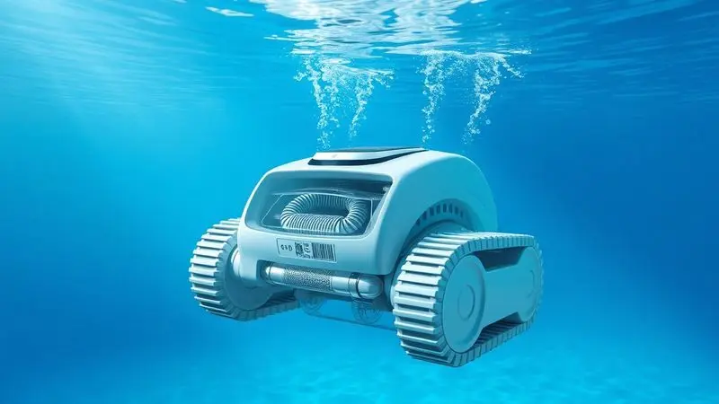
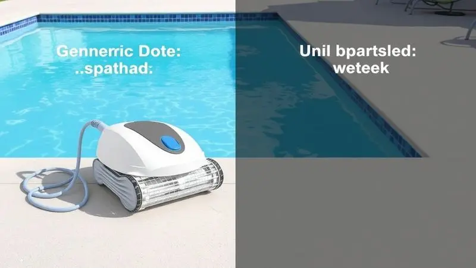
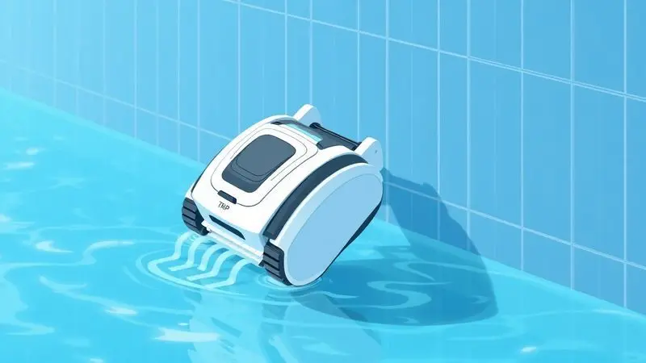

Manter a piscina sempre limpa e cristalina é essencial para o lazer e a saúde, mas a tarefa manual pode ser exaustiva e demorada.

Com o avanço da tecnologia, os robôs para limpeza de piscinas tornaram-se aliados indispensáveis para proprietários de casas e gestores de clubes ou condomínios.

Estes equipamentos inteligentes automatizam todo o processo, desde a sucção de detritos até a escovação das paredes, garantindo eficiência sem esforço humano.

Neste guia completo, analisamos os melhores modelos de 2025, cobrindo desde opções residenciais compactas até potentes máquinas comerciais, para ajudar você a encontrar a solução ideal para o seu espaço.

<SummaryList products={frontmatter.top_products} />

## Os Melhores Robôs para Limpeza de Piscinas do Mercado

Os robôs para limpeza de piscinas são ferramentas essenciais tanto para ambientes comerciais quanto residenciais. Eles otimizam o tempo e garantem uma limpeza eficiente, permitindo que você aproveite sua piscina sem preocupações.

### 1. RB7

<ProductBox 
  title={frontmatter.top_products[0].title} 
  image={frontmatter.top_products[0].image} 
  link={frontmatter.top_products[0].link} 
/>

Imagine um robô que faz tudo sozinho, sem você precisar se preocupar se algum cantinho ficou de fora. O RB7 da Sodramar oferece exatamente essa sensação de tranquilidade para piscinas de até 12 metros.

A tecnologia CleverClean™ dele faz a mágica: navega de maneira inteligente, cobrindo 100% da área como se tivesse um mapa da sua piscina na memória.

Em apenas 2 horas, ele aspira, escova e sobe pelas paredes, enquanto seu sistema de filtragem avançado captura desde poeira fina até sujeiras mais pesadas. A operação é tão simples quanto colocar na água e pressionar um botão.

Se o investimento inicial pode parecer significativo, pense no tempo que você ganha para relaxar na própria piscina, em vez de limpá-la.

<CaixaProsContras>

**Prós:**

- Limpeza eficiente em toda a piscina

- Tecnologia de navegação inteligente

- Ciclo rápido de limpeza

- Sistema de filtragem avançado

**Contras:**

- Preço relativamente elevado

- Limitação para piscinas maiores que 12 metros

</CaixaProsContras>

### 2. LIBERTY

<ProductBox 
  title={frontmatter.top_products[1].title} 
  image={frontmatter.top_products[1].image} 
  link={frontmatter.top_products[1].link} 
/>

Para quem odeia se enrolar em cabos e quer liberdade total, o Liberty chega como uma solução sem amarras. Este robô sem fio da Sodramar funciona com bateria recarregável, limpando piscinas de até 10 metros em cerca de 2 horas e meia.

A experiência é libertadora: você simplesmente coloca ele na água, aperta um botão e ele faz o trabalho enquanto você faz o seu. Os filtros de alta capacidade retêm sujeiras e micropartículas, garantindo uma água mais pura. Sua única limitação?

Para piscinas maiores ou extremamente sujas, você precisará recarregar a bateria. Mas para uso regular, a autonomia é suficiente para manter tudo limpo por uma semana inteira.

<CaixaProsContras>

**Prós:**

- Funciona sem fio, oferecendo maior liberdade de movimento.

- Limpa eficazmente pisos e paredes da piscina.

- Filtros de alta capacidade para retenção de sujeira.

- Fácil operação com apenas um botão.

**Contras:**

- A necessidade de recarga pode ser inconveniente para piscinas grandes.

- A eficácia na limpeza da linha d'água pode variar entre os modelos.

</CaixaProsContras>

### 3. RB2

<ProductBox 
  title={frontmatter.top_products[2].title} 
  image={frontmatter.top_products[2].image} 
  link={frontmatter.top_products[2].link} 
/>

Você busca eficiência sem complicações para sua piscina residencial? O RB2 da Sodramar pode ser a resposta. Projetado para piscinas de até 12 metros, ele oferece limpeza automática completa: aspiração, escovação e remoção de sujeiras finas e grossas.

As escovas que giram em alta velocidade combinadas com o sistema de dupla filtragem criam uma equipe poderosa que retém quatro vezes mais impurezas que filtros convencionais. Em aproximadamente 2 horas, ele faz um escaneamento completo, limpando fundo e paredes.

Embora não suba paredes como modelos mais avançados, seu design garante uma operação eficiente para quem busca praticidade no dia a dia. A proteção IP68 do motor é o selo de segurança que tranquiliza qualquer proprietário.

<CaixaProsContras>

**Prós:**

- Limpeza automátizada eficiente para piscinas residenciais.

- Sistema de dupla filtragem que retém muitas impurezas.

- Escovação em alta velocidade para melhor limpeza.

- Ciclo de limpeza rápido (cerca de 2 horas).

**Contras:**

- Não sobe as paredes como alguns modelos superiores.

- Indicado apenas para piscinas de até 12 metros.

</CaixaProsContras>

### 4. RB6

<ProductBox 
  title={frontmatter.top_products[3].title} 
  image={frontmatter.top_products[3].image} 
  link={frontmatter.top_products[3].link} 
/>

Quando praticidade e consciência ecológica se encontram, temos o RB6 da Sodramar. Para piscinas de até 12 metros, este robô oferece uma operação que começa com um simples toque de botão e se estende por até 3 horas de limpeza ininterrupta.

O que realmente diferencia o RB6 é sua filosofia: ele não desperdiça água nem utiliza produtos químicos, tornando-se uma escolha sustentável que beneficia tanto sua piscina quanto o meio ambiente.

O sistema de filtragem interna retém detritos mantendo a qualidade da água, enquanto a garantia de 2 anos oferece tranquilidade adicional.

O investimento inicial pode levantar sobrancelhas, mas a combinação de eficiência, compromisso ecológico e garantia robusta transforma esse gasto em economia a longo prazo.

<CaixaProsContras>

**Prós:**

- Limpeza eficiente do fundo e das paredes da piscina.

- Sistema ecológico que não desperdiça água nem produtos químicos.

- Fácil manuseio com operação por botão.

- Garantia de 2 anos para maior tranquilidade.

**Contras:**

- Preço pode ser considerado elevado para alguns usuários.

- Escovas brancas não são cobertas pela garantia.

</CaixaProsContras>

### 5. RB4i

<ProductBox 
  title={frontmatter.top_products[4].title} 
  image={frontmatter.top_products[4].image} 
  link={frontmatter.top_products[4].link} 
/>

Se você gosta de tecnologia no controle de tudo na sua vida, o RB4i vai conquistar seu coração.

Este robô da Sodramar para piscinas de até 15 metros traz o controle via aplicativo de smartphone, permitindo que você direcione o equipamento ou escolha entre funções pré-definidas como limpeza rápida ou pesada, tudo com um toque na tela do seu celular.

Em até 2 horas e 30 minutos, suas escovas que giram duas vezes mais rápido que a esteira garantem que paredes e piso fiquem impecáveis. Assim como o RB6, ele opera sem desperdício de água ou produtos químicos.

A curva de aprendizado pode ser leve para quem está acostumado com métodos tradicionais, mas se você valoriza tecnologia e eficiência, o RB4i entrega uma experiência que faz você sentir que está na frente do seu tempo.

<CaixaProsContras>

**Prós:**

- Controle via aplicativo para maior conveniência.

- Escovação eficiente em ciclos programáveis.

- Funciona sem desperdício de água e produtos químicos.

- Ideal para piscinas de vários tamanhos.

**Contras:**

- Pode ser complicado para quem prefere métodos tradicionais.

- Requer um entendimento inicial das funções disponíveis.

</CaixaProsContras>

### 6. Wave 100

<ProductBox 
  title={frontmatter.top_products[5].title} 
  image={frontmatter.top_products[5].image} 
  link={frontmatter.top_products[5].link} 
/>

Para piscinas que são verdadeiros espaços de lazer, de até 25 metros, o Robô Wave 100 da Sodramar chega com a precisão de um cirurgião. Seu sistema giroscópico realiza um escaneamento meticuloso, garantindo que nenhuma área fique de fora em até 4 horas de limpeza.

Os três níveis de filtração (fina, ultrafina e multicamada) trabalham em conjunto para manter a água com a transparência de um cristal. A operação é simples: coloque na água, acione o botão e pronto. Ele ainda vem com um carrinho para transporte, facilitando seu manejo.

A ausência de produtos químicos e o não desperdício de água fazem dele uma escolha ecológica inteligente, enquanto a garantia de 2 anos é o abraço de segurança que você precisa para investir com confiança.

<CaixaProsContras>

**Prós:**

- Limpeza eficiente em até 4 horas.

- Sistema giroscópico para escaneamento preciso.

- Três níveis de filtração disponíveis.

- Opção ecológica por não usar produtos químicos.

**Contras:**

- Limitação a piscinas de até 25 metros.

- Pode exigir manutenção regular para desempenho ideal.

</CaixaProsContras>

### 7. 2×2

<ProductBox 
  title={frontmatter.top_products[6].title} 
  image={frontmatter.top_products[6].image} 
  link={frontmatter.top_products[6].link} 
/>

Quando sua piscina é um gigante de até 40 metros, você precisa de um robô que pense grande. O Wave 2x2 da Sodramar (também conhecido como 2×2) é especificamente projetado para essa missão.

Com dupla ação de escovação e um sistema de filtragem ultrafino, ele remove sujeiras, algas e bactérias como um verdadeiro especialista. A navegação inteligente baseada em giroscópio garante que fundo e paredes sejam minuciosamente cobertos.

A operação completamente autônoma oferece ciclos ajustáveis de 4, 6 ou 8 horas, adaptando-se às necessidades específicas da sua piscina.

Embora sua garantia de 90 dias seja mais curta que a de outros modelos, os usuários costumam considerar este equipamento um investimento valioso que mantém a qualidade da água e higiene em níveis profissionais.

<CaixaProsContras>

**Prós:**

- Limpeza eficiente em piscinas grandes.

- Sistema de escovação ativa que remove sujeiras difíceis.

- Operação autônoma simplificada.

- Garantia suporta a confiança na qualidade do produto.

**Contras:**

- Garantia limitada a 90 dias.

- Pode ter uma curva de aprendizado inicial para manuseio.

</CaixaProsContras>

### 8. Fluidra MX6 Elite Zodiac

<ProductBox 
  title={frontmatter.top_products[7].title} 
  image={frontmatter.top_products[7].image} 
  link={frontmatter.top_products[7].link} 
/>

Às vezes, você precisa de um profissional para um trabalho profissional. O Fluidra MX6 Elite Zodiac é exatamente isso: um limpador de piscina de sucção projetado para quem leva a limpeza a sério.

Com escovas ciclônicas que esfregam e removem detritos com uma potência impressionante, ele alcança pisos, paredes e linha d'água com facilidade. A tecnologia de Navegação X-Drive é seu segredo para cobertura completa, eliminando áreas não limpas.

É importante notar: este é um produto destinado a profissionais de piscinas, o que significa instalação e manutenção especializadas.

Essa exclusividade, contudo, garante um suporte técnico que o consumidor comum normalmente não teria acesso, tornando-o ideal para quem precisa de resultados impecáveis e não tem tempo para meias medidas.

<CaixaProsContras>

**Prós:**

- Sução ciclônica potente que remove detritos finos.

- Escovação ativa para limpeza eficaz de superfícies.

- Tecnologia de navegação que cobre toda a piscina.

- Design compacto e eficiente em energia.

**Contras:**

- Exclusivo para instalação por profissionais.

- Manutenção pode ser mais complicada para usuários finais.

</CaixaProsContras>

### 9. Aiper Seagull Pro

<ProductBox 
  title={frontmatter.top_products[8].title} 
  image={frontmatter.top_products[8].image} 
  link={frontmatter.top_products[8].link} 
/>

A liberdade de movimento sem cabos prendendo seu robô é um sonho que o Aiper Seagull Pro torna realidade. Este limpa-piscinas sem fio é eficaz na remoção de detritos maiores como folhas e galhos, e limpa satisfatoriamente as paredes da piscina.

A ausência de fios significa que você pode movê-lo facilmente e armazená-lo sem se preocupar com enrolamentos. No entanto, a realidade da bateria precisa ser considerada: alguns usuários relatam que a autonomia diminui significativamente após algumas semanas de uso.

Além disso, sua capacidade de filtração é considerada básica, não sendo ideal para capturar partículas menores.

Se seu principal problema são detritos grandes e você valoriza a mobilidade, ele pode ser uma boa opção, mas para sujeira fina, você pode precisar de um complemento.

<CaixaProsContras>

**Prós:**

- Design sem fio que proporciona mobilidade.

- Eficiente na remoção de detritos grandes.

- Limpeza de paredes da piscina.

- Fácil operação para manutenção diária.

**Contras:**

- Duração da bateria pode ser insatisfatória.

- Capacidade de filtração limitada para sujeira fina.

</CaixaProsContras>

### 10. Aquaplus Komeco KORP 30

<ProductBox 
  title={frontmatter.top_products[9].title} 
  image={frontmatter.top_products[9].image} 
  link={frontmatter.top_products[9].link} 
/>

Para aqueles que buscam uma solução prática para limpezas rápidas em piscinas de até 50m², o AquaPlus Komeco KORP 30 oferece exatamente o que promete. Com cerca de 50 minutos de autonomia, ele é perfeito para uma faxina eficaz quando você precisa de resultados rápidos.

Sua versatilidade brilha na compatibilidade com diferentes acabamentos: alvenaria, vinil ou fibra de vidro, ele se adapta. O motor duplo de alta performance e o acionamento por único botão transformam a limpeza em uma tarefa simples.

Sim, seu desempenho nas paredes pode variar dependendo do revestimento, mas sua eficiência na remoção de areia e folhas do fundo compensa essa limitação, tornando-o uma escolha prática para quem precisa de praticidade acima de perfeição.

<CaixaProsContras>

**Prós:**

- Limpeza eficiente em piscinas até 50m².

- Compatível com vários tipos de acabamentos.

- Bateria com autonomia de 50 minutos.

- Fácil manuseio com um único botão de acionamento.

**Contras:**

- Desempenho variável nas paredes dependendo do revestimento.

- Necessita de carregamento após cerca de 50 minutos de uso.

</CaixaProsContras>

## Como Funciona um Robô Aspirador de Piscina?

Depois de conhecer tantas opções, você deve estar se perguntando: mas como essas maravilhas da tecnologia realmente funcionam?

A magia começa com um sistema de sucção inteligente que coleta folhas, sujeira e outros resíduos tanto do fundo quanto das paredes da sua piscina.

As escovas rotativas não apenas varrem, mas desintegram sujeira mais grudenta, enquanto sensores mapeiam o ambiente para garantir que cada centímetro seja coberto. A melhor parte?

Muitos modelos podem ser programados para operar nos horários que você escolher, garantindo que sua piscina esteja sempre pronta para o mergulho, sem que você precise supervisionar ou lembrar de ligá-los.

## Como Escolher o Melhor Robô para Limpar Piscina

Agora que você conhece as opções, como decidir qual robô é o seu parceiro ideal?

A resposta está em quatro pilares básicos: o tamanho da área a ser limpa, o tipo de sujeira que sua piscina acumula, a eficiência energética do equipamento e recursos extras que fazem diferença no seu dia a dia, como controle remoto e programação automática.

Avaliar esses aspectos não é apenas uma questão técnica, é sobre garantir que sua experiência com a piscina seja sempre de prazer, nunca de trabalho.

### Para Piscinas Grandes, Escolha Modelos com Cabo de Pelo Menos 25m

Se sua piscina é daquelas que impressiona pelo tamanho, seu robô precisa ter alcance proporcional. Modelos com cabos de pelo menos 25 metros oferecem a liberdade necessária para que o equipamento chegue a todos os recantos sem que você precise ficar reposicionando.

Um cabo mais longo não é apenas uma questão de medida, é sobre economia de tempo e esforço. Combine isso com uma capacidade de sucção robusta e métodos de limpeza eficientes, e você terá a garantia de que cada metro quadrado da sua piscina receberá a atenção que merece.

### Tem Piscinas de Vinil ou Fibra? Escolhas um Modelo Compatível com o Revestimento

O material da sua piscina é como a pele do seu lar aquático, e precisa ser tratado com cuidado específico. Para piscinas de vinil, você precisa de um robô gentil, com superfícies suaves que limpem sem arranhar ou danificar.

Já para piscinas de fibra, escovas mais robustas podem remover detritos com eficiência sem riscos.

Verificar a compatibilidade não é burocracia, é proteção: garante que sua piscina mantenha sua beleza original enquanto recebe a limpeza que precisa para ser sempre convidativa.

### Para Limpeza Completa, Verifique se o Robô Alcança Fundo, Paredes e Linha d'Água

Uma limpeza verdadeiramente completa é aquela que não deixa cantinhos esquecidos. Ao escolher seu robô, verifique se ele alcança o fundo, as paredes e especialmente a linha d'água, onde resíduos costumam se acumular e criar aquela borda indesejada.

Modelos que não cobrem essas três áreas podem parecer econômicos no início, mas no longo prazo transformam a manutenção da sua piscina em um trabalho mais trabalhoso.

A verdadeira economia está em escolher um equipamento que faça tudo de uma vez, deixando sua água com aquela transparência que faz você querer mergulhar imediatamente.

### Para Piscinas Coletivas, Escolha Robôs com Alto Fluxo de Sucção

Piscinas coletivas têm uma dinâmica diferente: mais pessoas, mais uso, mais sujeira. Para esse cenário, você precisa de um robô com alto fluxo de sucção, projetado para lidar com a quantidade maior de detritos que naturalmente se acumula.

Um bom sistema de filtragem é essencial, mas recursos como escaneamento inteligente e programação automática são o que transformam a manutenção de um fardo em uma rotina eficiente. O resultado?

Uma piscina sempre limpa e cristalina, otimizando não apenas a qualidade da água, mas também seus recursos e tempo.

### Para Piscinas Residenciais, Prefira Modelos com Agendamento ou Bateria de Longa Duração

Para a piscina da sua casa, a palavra-chave é conveniência. Modelos com função de agendamento permitem que você programe a limpeza para os horários mais convenientes, talvez enquanto você trabalha ou dorme.

Baterias de longa duração garantem que o robô complete seu ciclo sem interrupções, economizando energia e seu tempo de atenção.

Essas características podem parecer pequenos detalhes, mas são elas que transformam o robô de limpeza em um verdadeiro parceiro silencioso, mantendo tudo perfeito enquanto você vive sua vida.

## Com Fio vs. Sem Fio: Qual Tecnologia é Melhor?

Uma das dúvidas mais comuns ao escolher um robô limpa-piscinas é sobre a tecnologia: com fio ou sem fio? Cada uma tem sua personalidade.

Os modelos com fio geralmente oferecem maior potência e eficiência contínua, sem pausas para recarga, mas pedem um planejamento cuidadoso sobre o posicionamento do cabo.

Já os sem fio oferecem a liberdade de movimento que muitos sonham, são mais fáceis de armazenar, mas sua autonomia pode ser um limite em piscinas maiores.

A escolha não é sobre qual é melhor, mas sobre qual combina com seu estilo de vida e as características específicas do seu espaço aquático.

## Autonomia da Bateria: Quanto Tempo é o Suficiente?

A autonomia da bateria não é apenas um número numa ficha técnica, é a garantia de paz. A maioria dos modelos eficientes oferece entre 1,5 a 3 horas de operação contínua, tempo suficiente para cobrir piscinas de tamanho médio completamente.

Para piscinas maiores, buscar robôs com autonomia superior ou funcionalidades de recarga rápida faz diferença. Mas lembre-se: a eficiência real também depende da frequência de uso e do tipo de sujeira que sua piscina acumula.

Avaliar essas variáveis é o que transforma uma especificação técnica em uma escolha inteligente que realmente funciona para você.

## Limpeza de Paredes e Linha D'água: É Necessário?

Absolutamente sim. As paredes e principalmente a linha d'água são como as áreas de alto tráfego da sua piscina, onde sujeira, algas e detritos se acumulam mais rapidamente.

Negligenciar essas áreas não é apenas uma questão estética de ver uma borda suja, mas afeta diretamente a qualidade da água e a segurança do ambiente.

Alguns robôs podem não focar especificamente nessas partes, mas a manutenção regular, seja manual ou com equipamentos apropriados, é o que garante que sua piscina não seja apenas um espaço bonito, mas um ambiente saudável onde cada mergulho é puro prazer.

## Perguntas Frequentes sobre Robôs para Limpar Piscina

Os robôs para limpar piscinas são soluções práticas e eficientes para manutenção. Eles economizam tempo e esforço, mantendo a água limpa e saudável. Além disso, muitos modelos têm recursos avançados, como programação e conectividade via smartphone.

### O Robô Aspirador de Piscina Limpa Sozinho ou Precisa de Supervisão?

A beleza desses equipamentos está justamente na autonomia. Eles são projetados para trabalhar sozinhos, usando sensores para mapear a piscina e detectar sujeira, ajustando sua trajetória conforme necessário. Você pode literalmente ligar e esquecer.

Claro, uma verificação periódica é sempre recomendada para garantir que não ficou preso em algum obstáculo, e remover folhas grandes antes da limpeza ajuda na eficiência.

Mas no geral, eles operam como verdadeiros parceiros independentes, deixando sua piscina sempre pronta para o lazer.

### Como Limpar o Robô Aspirador de Piscina?

Cuidar do seu robô é cuidar da sua piscina. O processo é simples: desligue o aparelho, retire-o da água, remova a tampa e lave os filtros com água corrente para eliminar a sujeira acumulada.

Inspecione as escovas e, se necessário, use uma escova macia para remover detritos persistentes. Após a limpeza, monte tudo novamente e verifique se não há obstruções.

Esta rotina não só melhora a eficiência do seu robô, mas também prolonga sua vida útil, garantindo que ele continue sendo seu aliado confiável por muitos verões.

### O Robô para Limpar Piscina Substitui a Limpeza Manual?

Em grande parte sim, mas com nuances importantes. Os robôs oferecem uma limpeza automática e eficaz que cobre a grande maioria das necessidades diárias e semanais.

No entanto, para situações específicas como remoção de folhas grandes ou sujeira acumulada em áreas particularmente difíceis, um toque humano ainda pode ser necessário.

A combinação ideal é ver o robô como seu principal responsável pela manutenção, enquanto você reserva seus esforços para aquelas correções pontuais que fazem toda a diferença. Juntos, garantem uma piscina que é sempre um convite ao mergulho.

### Qual modelo de robô é ideal para o tamanho e o tipo da minha piscina?

Esta é a pergunta que define tudo. Para piscinas menores, modelos compactos com potência moderada podem ser suficientes, enquanto piscinas grandes ou de formato irregular exigem robôs mais robustos com navegação avançada.

O tipo de água também importa: se sua piscina é de água salgada, é fundamental escolher um robô projetado para lidar com a corrosividade desse ambiente.

Avaliar essas características não é apenas técnico, é pessoal: é sobre encontrar o equipamento que se adapta perfeitamente ao seu espaço e ao seu estilo de vida, garantindo anos de limpeza eficiente sem complicações.

## Conclusão

Escolher o robô limpa-piscinas ideal é muito mais que comparar especificações técnicas, é sobre encontrar um parceiro que transforme a manutenção da sua piscina de uma tarefa cansativa em uma experiência de tranquilidade.

Dos modelos compactos para áreas residenciais aos robustos equipamentos para piscinas comerciais, cada opção oferece uma combinação única de tecnologia, eficiência e conveniência.

A verdadeira sabedoria está em entender suas necessidades específicas: o tamanho do seu espaço, o tipo de sujeira que você enfrenta, e como você quer viver sua relação com sua piscina.

Hoje, a tecnologia já avançou ao ponto onde você pode literalmente apertar um botão e ver a mágica acontecer, deixando mais tempo para o que realmente importa: aproveitar momentos inesquecíveis com família e amigos em águas cristalinas.

Qual será o robô que vai se tornar o guardião silencioso da sua piscina?