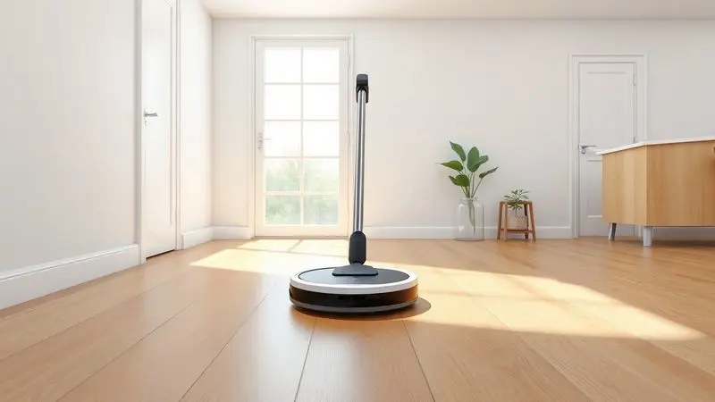
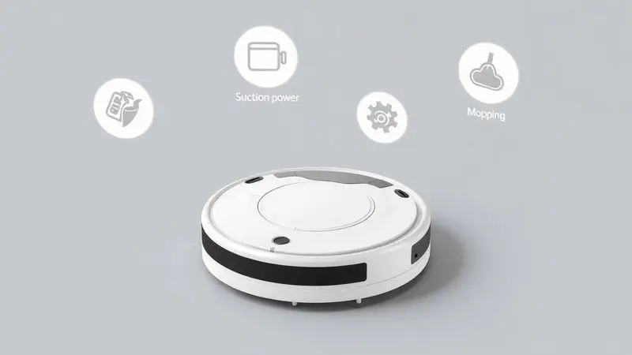
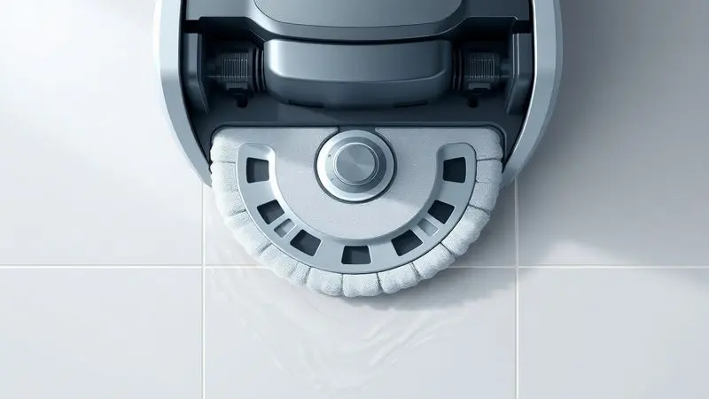
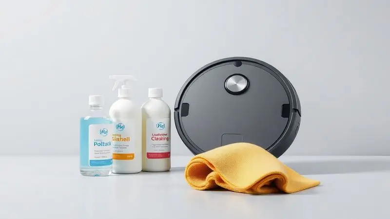

Imagine chegar em casa e encontrar todos os pisos impecáveis, sem que você precise sequer pensar em pegar um aspirador.

Essa é a promessa que os robôs aspiradores Xiaomi cumprem todos os dias, transformando a manutenção doméstica de uma tarefa cansativa em um simples toque no celular.

O segredo está na diversidade: a marca oferece desde opções acessíveis para apartamentos compactos até verdadeiros centros de comando inteligentes, com bases que esvaziam, lavam e secam, praticamente sozinhos.

Neste guia, vamos desvendar 11 modelos que se destacam em 2025, mostrando exatamente qual deles tem a combinação certa de potência, inteligência e facilidade para se tornar seu aliado perfeito na limpeza.

<SummaryList products={frontmatter.top_products} />

## Melhores robôs aspiradores da Xiaomi

Mais do que máquinas, esses robôs são como assistentes pessoais para sua casa. Eles aprendem o layout dos seus cômodos, desviam de obstáculos que você nem percebe e trabalham silenciosamente enquanto você cuida da sua vida.

A escolha certa, porém, depende de um equilíbrio entre o que você precisa e o que está disposto a investir. Vamos conhecer os protagonistas dessa revolução doméstica.

### 1. Xiaomi Robot Vacuum E10

<ProductBox 
  title={frontmatter.top_products[0].title} 
  image={frontmatter.top_products[0].image} 
  link={frontmatter.top_products[0].link} 
/>

O campeão do custo-benefício para quem está começando. O E10 é a porta de entrada para a automação da limpeza, perfeito para apartamentos pequenos ou quem quer entender como um robô pode simplificar o dia a dia.

Seu motor de 4000 Pa remove poeira e migalhas com eficiência, enquanto o tanque de água eletrônico permite escolher entre três níveis de umidade para o pano, adaptando-se a pisos de cerâmica ou madeira.

Ele navega usando um giroscópio inteligente, otimizando seu trajeto para evitar bater em móveis e, com seus 110 minutos de bateria, consegue finalizar a limpeza de boa parte dos ambientes comuns antes de voltar para a base sozinho.

É compacto o suficiente para passar sob a maioria dos sofás e camas.

<CaixaProsContras>

**Prós:**

- Boa potência de sucção para limpezas diárias.

- Função de esfregar com ajuste do fluxo de água.

- Facilidade no controle remoto pelo aplicativo.

- Design compacto que alcança áreas difíceis.

**Contras:**

- Performance comprometida em tapetes altos.

- Dificuldades em ambientes muito complexos.

</CaixaProsContras>

### 2. Xiaomi S40

<ProductBox 
  title={frontmatter.top_products[1].title} 
  image={frontmatter.top_products[1].image} 
  link={frontmatter.top_products[1].link} 
/>

Para quem precisa de autonomia acima de tudo. Se o E10 é econômico, o S40 leva a potência a outro patamar, com 10.000 Pa de sucção. Essa força extra é ideal para quem tem pets ou áreas maiores para cobrir.

A grande estrela aqui é a bateria, capaz de durar até 180 minutos em uma única carga, permitindo que ele limpe apartamentos inteiros ou casas maiores sem pausas.

Sua navegação a laser LDS mapeia cada canto do ambiente com uma precisão cirúrgica, evitando quedas e colisões.

O acessório para passar pano está incluído, mas fica a dica: ele é do tipo fixo, sem rotação, então é mais indicado para manutenção e brilho do que para a remoção de manchas mais difíceis.

<CaixaProsContras>

**Prós:**

- Boa potência de sucção de 10.000 Pa.

- Navegação a laser eficiente.

- Bateria com duração de até 180 minutos.

- Funcionalidade de mop incluída.

**Contras:**

- Mop não rotativo, o que pode limitar a eficácia na limpeza.

- Não possui recursos avançados, como auto-esvaziamento.

</CaixaProsContras>

### 3. Xiaomi S40 Pro

<ProductBox 
  title={frontmatter.top_products[2].title} 
  image={frontmatter.top_products[2].image} 
  link={frontmatter.top_products[2].link} 
/>

O recém-chegado de 2025 que trouxe um trunfo inovador: um braço mecânico. Se a limpeza de cantos e beiradas sempre foi o ponto fraco dos robôs, o S40 Pro chegou para resolver isso.

Seu braço extensível literalmente estica o pano para alcançar a sujeira escondida atrás do pé da mesa ou no encontro da parede.

Combinado com uma sucção brutal de 15.000 Pa e a já consagrada navegação a laser LDS, ele promete uma limpeza completa que poucos conseguem igualar.

O controle por voz com Alexa ou Google Assistant é a cereja do bolo, transformando o ato de limpar em um simples comando falado.

<CaixaProsContras>

**Prós:**

- Potência de sucção de até 15.000 Pa.

- Braço mecânico extensível para limpeza de cantos.

- Navegação inteligente com mapeamento preciso.

- Compatibilidade com controle por voz.

**Contras:**

- Não é o robô aspirador mais barato disponível.

- Pode requerer algum tempo de adaptação ao uso do aplicativo.

</CaixaProsContras>

### 4. Xiaomi Robot Vacuum X10

<ProductBox 
  title={frontmatter.top_products[3].title} 
  image={frontmatter.top_products[3].image} 
  link={frontmatter.top_products[3].link} 
/>

O escolhido dos tutores de pets. Com sua potência de 4000 Pa, ele é especialmente eficaz em capturar pelos de animais que se espalham pela casa. O verdadeiro diferencial, porém, está na sua estação de auto-esvaziamento.

Após cada limpeza, o robô retorna à base e todo o pó aspirado é automaticamente sugado para um saco selado, que pode armazenar sujeira de mais de 60 sessões. Isso significa que você só precisará se preocupar em trocar esse saco uma vez a cada dois meses, em média.

A navegação LDS funciona até no escuro, e sua bateria de longa duração mantém ele em ação por mais de 180 minutos.

<CaixaProsContras>

**Prós:**

- Poderosa sucção de até 4000Pa.

- Mapeamento preciso com tecnologia LDS.

- Estação de auto-esvaziamento prática.

- Longa duração da bateria (até 180 minutos).

**Contras:**

- A função de passar pano pode não ser suficiente para manchas difíceis.

- Pode ter uma curva de aprendizado para usuários menos tecnológicos.

</CaixaProsContras>

### 5. Xiaomi Robot Vacuum X10 Plus

<ProductBox 
  title={frontmatter.top_products[4].title} 
  image={frontmatter.top_products[4].image} 
  link={frontmatter.top_products[4].link} 
/>

A evolução do conceito de automação total. O X10 Plus não só esvazia sozinho, como também cuida da sua parte úmida.

Sua estação de acoplamento é uma multitarefa: em apenas 10 segundos, esvazia o pó, lava os panos de limpeza usados e recarrega o tanque de água do robô com líquido fresco.

Enquanto isso, o sistema S-Cross AI com navegação a laser cria um mapa detalhado da sua casa, permitindo que você crie zonas proibidas virtualmente (como o cantinho do cachorro ou um tapete delicado) diretamente pelo aplicativo.

É para quem não quer ter trabalho algum depois que a limpeza acaba.

<CaixaProsContras>

**Prós:**

- Potência de sucção impressionante (4000Pa).

- Estação de acoplamento com auto-limpeza e auto-esvaziamento.

- Navegação inteligente com reconhecimento de obstáculos.

- Boa autonomia da bateria (até 120 minutos).

**Contras:**

- Pode precisar de recarga em áreas muito amplas.

- Preço mais elevado em comparação com modelos simples.

</CaixaProsContras>

### 6. Xiaomi Robot Vacuum X20 Plus

<ProductBox 
  title={frontmatter.top_products[5].title} 
  image={frontmatter.top_products[5].image} 
  link={frontmatter.top_products[5].link} 
/>

Imagine um robô que, além de limpar, também lava e seca seus próprios panos. O X20 Plus faz exatamente isso.

Sua estação base é uma pequena lavanderia automática: ela esvazia o pó em 10 segundos, lava os esfregões rotativos com água limpa e depois os seca com ar quente, evitando mofo e mau cheiro.

Com 6000 Pa de sucção e a navegação LDS, ele é um destruidor de sujeira em pisos duros e tapetes de pelo baixo. Apenas fique atento em carpetes mais altos, já que você precisará usar o aplicativo para marcar manualmente onde não quer que o pano úmido atue.

<CaixaProsContras>

**Prós:**

- Estação base multifuncional com auto-esvaziamento e lavagem/secagem de esfregões.

- Forte poder de sucção (6000 Pa).

- Esfregões rotativos para uma limpeza eficaz.

- Navegação a laser LDS precisa e desvio de obstáculos avançado.

**Contras:**

- Pode ter desempenho inferior em carpetes em comparação com superfícies lisas.

- Falta um sensor de detecção de carpete integrado, exigindo marcação manual no aplicativo.

</CaixaProsContras>

### 7. Xiaomi Robot Vacuum X20 Pro

<ProductBox 
  title={frontmatter.top_products[6].title} 
  image={frontmatter.top_products[6].image} 
  link={frontmatter.top_products[6].link} 
/>

O cérebro da operação. O X20 Pro une uma potência formidável de 7000 Pa a uma inteligência notável. Seu sistema de mopping é tão esperto que, ao detectar um carpete, levanta automaticamente as almofadas de esfregão para não molhá-lo.

A navegação TrueMapping 2.0 LiDAR cria mapas extremamente detalhados, e a base automática gerencia tanto o pó quanto o reabastecimento de água. Ele é para quem busca o máximo em desempenho e conveniência sem chegar ao topo absoluto da linha (e do preço).

<CaixaProsContras>

**Prós:**

- Potência de sucção impressionante de 7000Pa.

- Navegação inteligente com mapeamento preciso.

- Função de mopping eficiente com autoajuste para carpetes.

- Base automática que facilita a manutenção.

**Contras:**

- Pode agarrar cabos e pequenos objetos durante a limpeza.

- Falta algumas funcionalidades extras encontradas em modelos premium.

</CaixaProsContras>

### 8. Xiaomi Robot Vacuum X20 Max

<ProductBox 
  title={frontmatter.top_products[7].title} 
  image={frontmatter.top_products[7].image} 
  link={frontmatter.top_products[7].link} 
/>

A potência personificada. Com 8000 Pa, o X20 Max tem a sucção mais forte desta lista, conquistando até os carpetes mais embaraçados com facilidade. Seu braço extensor de mopa garante que os cantos das paredes não sejam negligenciados.

A estação de limpeza automática completa o pacote, cuidando da lavagem e secagem. Ele sacrifica alguns dos reconhecimentos de IA mais avançados em troca de um foco absoluto em poder de limpeza e uma relação custo-benefício atraente para quem prioriza resultados brutos.

<CaixaProsContras>

**Prós:**

- Potência de sucção de 8000 Pa para limpeza profunda.

- Navegação eficiente com tecnologia a laser.

- Braço extensor de mopa para melhor acesso a cantos.

- Estação que realiza autolimpeza e manutenção das mopas.

**Contras:**

- Não possui recursos avançados de reconhecimento de objetos por IA.

- Desempenho ligeiramente abaixo da média em evasão de obstáculos.

</CaixaProsContras>

### 9. Xiaomi Vacuum S10

<ProductBox 
  title={frontmatter.top_products[8].title} 
  image={frontmatter.top_products[8].image} 
  link={frontmatter.top_products[8].link} 
/>

O equilíbrio perfeito entre aspiração e pano úmido em um pacote acessível. O S10 faz as duas funções muito bem, com seus 4000 Pa e tanque de água integrado.

Sua navegação a laser LDS garante rotas eficientes, e os 130 minutos de bateria são mais do que suficientes para a maioria dos apartamentos.

A única concessão é o compartimento de pó de 0,3L, que pode exigir que você o esvazie com um pouco mais de frequência, um pequeno preço a pagar por tanta praticidade.

<CaixaProsContras>

**Prós:**

- Navegação eficiente com laser LDS

- Potência de sucção alta (4000 Pa)

- Limpeza com pano úmido disponível

- Controle remoto via aplicativo

**Contras:**

- Capacidade do compartimento de poeira de 0,3 L

- Autonomia moderada de 130 minutos

</CaixaProsContras>

### 10. Xiaomi Robot Vacuum S20+

<ProductBox 
  title={frontmatter.top_products[9].title} 
  image={frontmatter.top_products[9].image} 
  link={frontmatter.top_products[9].link} 
/>

O especialista em pisos duros com um toque de sofisticação. O S20+ combina sucção poderosa (6000 Pa) com dois mops rotativos que trabalham em conjunto para esfregar o chão.

A navegação a laser LDS planeja o caminho mais inteligente, e o controle por aplicativo e voz oferece total comando à distância.

A ausência do auto-esvaziamento significa que você ainda terá essa tarefa manual, mas, considerando o pacote tecnológico que ele oferece, é uma troca que vale a pena para muitos.

<CaixaProsContras>

**Prós:**

- Potente motor com 6000Pa de sucção.

- Navegação a laser LDS para mapeamento eficiente.

- Função de passar pano com mops rotativos.

- Compatibilidade com aplicativo e assistentes de voz.

**Contras:**

- Pressão do mop pode não ser suficiente para manchas difíceis.

- Falta sistema de esvaziamento automático.

</CaixaProsContras>

### 11. Xiaomi Mi Robot Vacuum MOP 2C

<ProductBox 
  title={frontmatter.top_products[10].title} 
  image={frontmatter.top_products[10].image} 
  link={frontmatter.top_products[10].link} 
/>

O mestre da personalização. O MOP 2C utiliza navegação visual dinâmica para não apenas mapear, mas entender o ambiente, permitindo que você crie zonas de limpeza personalizadas no aplicativo com facilidade.

Seu tanque de água com três níveis de umidade lhe dá controle total sobre o quanto molhar o pano. Com 2200 Pa, tem potência robusta para a maioria das situações, mas sua verdadeira vocação são casas com pisos duros e muitos detalhes para serem considerados na limpeza.

<CaixaProsContras>

**Prós:**

- Função 2 em 1: aspiração e passar pano

- Navegação inteligente e mapeamento eficiente

- Potência de sucção robusta para vários tipos de piso

- Controle remoto pelo aplicativo e assistentes de voz

**Contras:**

- Desempenho pode ser inferior em carpetes finos

- Exige manutenção regular como qualquer robô aspirador

</CaixaProsContras>

## Comprar um robô aspirador vale a pena?

A resposta vai muito além de um simples sim ou não. Comprar um robô aspirador vale a pena se você valoriza seu tempo e paz de espírito. Pense naquelas meia hora diária que você gasta varrendo ou passando o aspirador manual.

Agora imagine esse tempo reinvestido em um hobby, em descanso ou em qualidade de vida com a família. Para casas com pets, crianças ou simplesmente uma rotina agitada, esses dispositivos não são luxo, são ferramentas de sanidade mental.

Eles mantêm o piso livre de pó e pelos diariamente, criando um ambiente mais saudável sem exigir esforço constante. Claro, não substituem uma limpeza pesada anual, mas eliminam completamente a necessidade da faxina superficial do dia a dia.

## Como saber se o robô aspirador é bom?

Um bom robô aspirador não é definido apenas por números altos. É aquele que você esquece que existe. Para descobrir isso antes de comprar, observe como ele lida com o mundo real. Tem sucção suficiente para pegar areia e pelos de pet no carpete?

A bateria dura para cobrir sua sala, corredor e quartos sem pedir ajuda? E, mais importante, ele é inteligente o bastante para não ficar preso atrás do pé da cadeira ou tentar subir no tapete felpudo?

Um sistema de navegação preciso (como o LDS) e um aplicativo que permita criar barreiras virtuais são sinais de um robô que trabalha para você, e não o contrário.

## Como escolher o robô aspirador mais adequado para mim?

A escolha é um quebra-cabeça onde suas necessidades se encaixam com os recursos certos. Comece olhando para sua casa: é um apartamento de 50m² ou uma casa com dois andares? Os pisos são majoritariamente frios ou tem muitos carpetes? Tem animais que soltam pelo?

Suas respostas direcionam a potência de sucção necessária, o tipo de navegação e a importância de funções como auto-esvaziamento.

Depois, olhe para você mesmo: prefere configurar uma vez no aplicativo e nunca mais tocar, ou não se importa em esvaziar um depósito a cada few dias para economizar? Sua tolerância à interação define o nível de automação que vale o investimento.

### Potência de Sucção

Pense na potência de sucção como a confiança que você tem no robô. Para apartamentos com piso liso e pouca sujeira, 2000 a 4000 Pa são mais do que suficientes.

Agora, se você tem carpete, pets de pelo longo ou crianças que espalham migalhas, procure modelos a partir de 6000 Pa. Essa força extra é a garantia de que a sujeira será capturada na primeira passada, sem deixar rastros.

Muitos modelos, inclusive, oferecem modos de economia que reduzem a potência (e o ruído) para limpezas rápidas, usando toda a força apenas quando realmente necessário.

### Eficiência do MOP

A função de passar pano é um divisor de águas. Não se trata apenas de umedecer o chão, mas de realmente remover aquelas marcas de sapato e respingos de comida que a aspirração não alcança.

A eficiência está nos detalhes: mops rotativos esfregam ativamente, braços extensores alcançam cantos, e tanques de água eletrônicos controlam a umidade para não encharcar a madeira.

Se você tem predominantemente pisos frios (cerâmica, porcelanato), essa função pode cortar pela metade sua necessidade de passar pano manualmente.

### Bateria

A bateria é a perna do seu robô. Um robô com pouca autonomia é como um ajudante que desmaia no meio do serviço, deixando você para terminar o trabalho. Procure por modelos que, em teoria, cubram toda a sua área útil em uma única carga, com uma margem de segurança.

A mágica acontece com os que têm recarga automática: eles voltam sozinhos para a base quando a bateria está baixa, recarregam e, se necessário, retomam a limpeza exatamente de onde pararam. É essa capacidade que transforma o robô em um verdadeiro trabalhador autônomo.

### Recursos adicionais

São esses recursos que transformam um eletrodoméstico em um assistente inteligente. O aplicativo que permite agendar limpezas para quando você está no trabalho. O controle por voz que liga o robô enquanto suas mãos estão ocupadas na pia.

O mapeamento que aprende o layout da sua casa e permite que você diga "limpe apenas a cozinha". Ou a base de auto-esvaziamento que elimina sua última tarefa manual por semanas. Cada um deles é um degrau a mais em direção a uma casa que realmente cuida de si mesma.

## Dicas para usar seu robô aspirador que passa pano

Para extrair o máximo do seu novo aliado, trate-o como um colega de trabalho. Prepare o terreno antes: recolha brinquedos, cabos soltos e meias do chão.

Use os recursos de mapeamento para criar zonas de exclusão virtuais em áreas delicadas, como um tapete persa ou o canto da bagunça do cachorro. Programe a limpeza para os horários em que a casa está vazia, assim ele trabalha sem interrupções.

E faça a manutenção simples: lave os filtros periodicamente e limpe os sensores com um pano seco. Esses pequenos cuidados garantem que a parceria dure anos.

## Quais produtos usar no pano do robô aspirador?

A regra de ouro é: menos é mais. O ideal é usar apenas água limpa no tanque do robô. Produtos de limpeza, mesmo os ditos "adequados para robôs", podem criar resíduos que entopem os sistemas de bombeamento e, com o tempo, danificam componentes internos.

Para o brilho extra, prefira panos de microfibra de qualidade, que são super absorventes e coletam a sujeira por atração estática.

Se você realmente insistir em um produto, dilua muito bem uma quantidade mínima de detergente neutro em água, mas saiba que isso aumenta o risco de manutenção necessária no longo prazo.

## FAQ — Principais Dúvidas sobre os Robôs Aspiradores Xiaomi

Posso controlar com a voz? Sim, a maioria dos modelos é compatível com Alexa e Google Assistant. Basta conectar a conta do aplicativo Mi Home ao seu assistente e comandos como "Alexa, ligar o aspirador" funcionam perfeitamente.

Ele vai cair da escada? Praticamente impossível nos modelos com navegação a laser (LDS) ou giroscópio. Eles possuem sensores infravermelhos que detectam desníveis e mudam de direção antes de chegar perto do degrau.

Preciso limpar a escova sempre? Sim, mas não diariamente. A cada poucas semanas, corte os fios de cabelo e pelos que se enrolam nas pontas da escova principal. Essa rápida manutenção garante a sucção máxima e prolonga a vida do acessório.

E se minha internet cair? O robô continuará funcionando normalmente nos modos padrão que você programou anteriormente. Apenas o controle remoto em tempo real pelo aplicativo e as atualizações de status ficarão suspensas até a conexão voltar.

Funciona com tapetes escuros? Sim, mas modelos com sensores ópticos podem ter mais dificuldade em detectar tapetes muito escuros ou com padrões que confundem o sensor de queda.

Em caso de dúvida, consulte as especificações do modelo ou crie uma zona de exclusão no aplicativo para evitar a área.

## Conclusão

Escolher um robô aspirador Xiaomi é, no fundo, decidir qual tipo de liberdade você deseja conquistar.

Seja a liberdade de não se curvar mais para passar o aspirador depois de um dia longo, a liberdade de não se preocupar com pelos de pet espalhados pelo sofá, ou a liberdade simples de gastar seu tempo com o que realmente importa.

Dos modelos básicos como o E10, que assumem as tarefas diárias sem alarde, aos gigantes como o X10 Plus, que praticamente eliminam sua participação no processo, há um robô perfeito para cada realidade.

A pergunta não é mais se você precisa de um, mas qual deles será o primeiro passo para transformar sua casa em um lugar que se mantém limpo, praticamente sozinho, todos os dias.