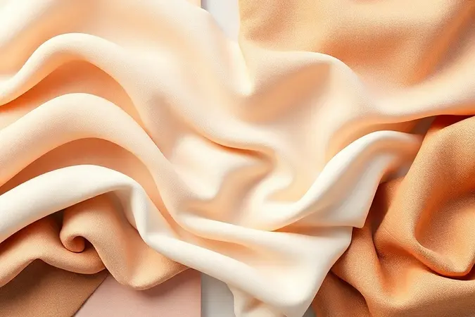

Escolher o tecido ideal para sua roupa de cama é como selecionar o pano de fundo para um terço da sua vida. Afinal, é onde você recarrega as energias.

Com tantas opções prometendo conforto absoluto, desde o clássico algodão até o indulgente luxo da seda, como saber qual realmente vai transformar suas noites?

Neste guia, vamos além das especificações técnicas para explorar como cada tecido se sente na sua pele, regula sua temperatura e se adapta ao seu estilo de vida.

Analisamos durabilidade, maciez e respirabilidade através da lente do conforto genuíno, para que você encontre não apenas um tecido, mas a sensação de lar que sua cama merece.

<SummaryList products={frontmatter.top_products} />

## Principais Tipos de Tecidos para Roupa de Cama

O mundo dos tecidos para cama vai muito além de escolher entre "macio" ou "durável". Cada material tem uma personalidade distinta que responde às suas necessidades mais íntimas.

Enquanto alguns abraçam você com calor nos invernos rigorosos, outros oferecem um frescor revigorante nas noites de verão. Conhecer essa variedade é o primeiro passo para transformar seu quarto em um santuário personalizado do sono.

### 1. Percal

<ProductBox 
  title={frontmatter.top_products[0].title} 
  image={frontmatter.top_products[0].image} 
  link={frontmatter.top_products[0].link} 
/>

Pense no percal como aquele jeans premium que você ama: confiável, durável e confortável o dia todo. Sua tecelagem firme cria uma superfície notavelmente lisa que desliza suavemente sobre sua pele, sem aquele acabamento áspero de alguns tecidos básicos.

A maioria é feita de algodão, mas o verdadeiro diferencial está na qualidade. O percal 100% algodão é como respirar através do tecido, ideal para quem acorda aquecido.

Existem versões mistas com poliéster que praticamente dispensam o ferro de passar, uma dádiva para rotinas agitadas.

Quando você encontrar o "percal egípcio", saiba que está diante do algodão de fibras extra-longas. A sensação é de nuvem, mas sem a fragilidade.

Embora a contagem de fios seja importante (valores mais altos geralmente significam maior durabilidade e maciez), o que realmente importa é como o tecido se comporta no seu dia a dia.

Não espere o opulento brilho da seda, mas sim um companheiro leal que oferece o equilíbrio perfeito entre qualidade acessível e conforto consistente.

<CaixaProsContras>

**Prós:**

- Excelente respirabilidade e conforto.

- Grande durabilidade e facilidade de manutenção.

- Variedade de opções, incluindo orgânicos.

- Boa relação custo-benefício.

**Contras:**

- Pode não ser tão luxuoso quanto outros tecidos premium.

- A variação na contagem de fios pode gerar confusão sobre a qualidade.

</CaixaProsContras>

### 2. Cetim

<ProductBox 
  title={frontmatter.top_products[1].title} 
  image={frontmatter.top_products[1].image} 
  link={frontmatter.top_products[1].link} 
/>

O cetim é o vestido de gala dos tecidos para cama. Seu brilho luminoso e superfície sedosa transformam qualquer quarto em um quarto de hotel cinco estrelas.

Originalmente sinônimo de seda pura, hoje ele aparece frequentemente em versões mais acessíveis de poliéster, mantendo o visual luxuoso sem o preço proibitivo. O toque é suave, quase líquido, e o caimento elegante faz as roupas de cama parecerem mais leves e fluidas.

Essa suavidade, no entanto, tem seu preço. O cetim pode ser menos amigável com seus movimentos noturnos, escorregando facilmente, e nem sempre oferece a mesma respirabilidade de tecidos naturais.

Mas para noites especiais ou quando você quer adicionar um toque de glamour ao seu espaço, ele entrega instantaneamente.

<CaixaProsContras>

**Prós:**

- Superfície lisa e brilho atraente.

- Caimento leve e elegante.

- Opções mais acessíveis em poliéster.

- Facilidade de cuidado em versões sintéticas.

**Contras:**

- Menor respirabilidade em alguns casos.

- Maior propensão a danos como puxões.

</CaixaProsContras>

### 3. Seda

<ProductBox 
  title={frontmatter.top_products[2].title} 
  image={frontmatter.top_products[2].image} 
  link={frontmatter.top_products[2].link} 
/>

Imagine dormir envolto em um segundo pele, que regula sua temperatura com precisão quase intuitiva. A seda faz exatamente isso. Nos dias frios, ela retém calor suavemente. Nas noites abafadas, ela libera um frescor que parece sair do próprio tecido.

Para quem tem pele sensível ou alergias, ela é um refúgio, pois repele naturalmente ácaros e não irrita.

A seda de amoreira é a rainha dessa categoria, com fibras tão longas que criam um brilho profundo e uma durabilidade impressionante. Sim, o preço faz você pensar duas vezes. Mas considere como um investimento em sono de qualidade que dura anos.

A manutenção exige cuidado, como lavagem delicada, mas cada noite de conforto supremo justifica o ritual extra.

<CaixaProsContras>

**Prós:**

- Sensação de luxo e conforto superior

- Regulação eficaz da temperatura

- Hipoalergênica, ideal para peles sensíveis

- Durabilidade e resistência ao desgaste

**Contras:**

- Preço mais elevado em comparação com outros tecidos

- Requer cuidados especiais na lavagem e secagem

</CaixaProsContras>

### 4. Algodão

<ProductBox 
  title={frontmatter.top_products[3].title} 
  image={frontmatter.top_products[3].image} 
  link={frontmatter.top_products[3].link} 
/>

O algodão é como aquele amigo confiável que nunca te decepciona. Sua popularidade tem uma razão simples de ser.

Entre as variedades, o algodão egípcio reina supremo, com fibras longas que criam uma maciez quase impossível de igualar e uma durabilidade que desafia o tempo. Ele tem essa capacidade mágica de se adaptar: fresquinho no verão, aconchegante no inverno.

Se você procura algo similar em qualidade, o algodão Pima oferece a mesma sensação luxuosa. E se o seu coração bate pela sustentabilidade, o algodão orgânico apresenta uma alternativa limpa, cultivada sem produtos químicos agressivos.

A versão tradicional pode ser menos durável, mas cumpre bem seu papel para orçamentos mais apertados.

<CaixaProsContras>

**Prós:**

- Maciez e conforto excepcionais.

- Variedades que atendem diferentes necessidades (luxo ou sustentabilidade).

- Regulação térmica eficiente.

- Hipoalergênico, ideal para peles sensíveis.

**Contras:**

- O algodão egípcio pode ser mais caro.

- O algodão tradicional tem menor durabilidade.

</CaixaProsContras>

### 5. Microfibra

<ProductBox 
  title={frontmatter.top_products[4].title} 
  image={frontmatter.top_products[4].image} 
  link={frontmatter.top_products[4].link} 
/>

Se engenheiros tivessem criado um tecido especificamente para o conforto moderno, seria a microfibra. Suas fibras são tão finas que você precisa imaginar algo cem vezes mais fino que um fio de cabelo.

O resultado é uma densidade que traduz em uma macidez sedosa que convida para abraços prolongados. É absurdamente durável, mantendo seu aspecto novo lavagem após lavagem.

A praticidade é seu maior trunfo. Seca quase enquanto você pisca, não amassa, e é perfeita para quem abomina passar roupa. Algumas pessoas podem sentir que ela retém mais calor que o algodão.

Mas para quem prioriza toque suave aliado a manutenção zero, ela representa o equilíbrio ideal.

<CaixaProsContras>

**Prós:**

- Toque extremamente suave e aconchegante.

- Leveza ideal para produtos como colchas e mantas.

- Alta durabilidade e resistência à deformação.

- Fácil manutenção; seca rapidamente e não amassa.

**Contras:**

- Pode reter calor e ser menos respirável em comparação com o algodão.

- Requer cuidados especiais na lavagem para evitar desgaste.

</CaixaProsContras>

### 6. Poliéster

<ProductBox 
  title={frontmatter.top_products[5].title} 
  image={frontmatter.top_products[5].image} 
  link={frontmatter.top_products[5].link} 
/>

Para quem precisa que a vida simplesmente funcione, o poliéster aparece como o herói da praticidade.

Ele é o tecido que quase desafia o desgaste, mantém as cores vibrantes como no primeiro dia e, melhor de tudo, não exige que você o assista no varal antes de usá-lo novamente. Secagem rápida e resistência a rugas fazem dele o melhor amigo de famílias agitadas.

Esse desempenho vem com uma troca. Ele não respira como o algodão, o que pode fazer você sentir mais calor em noites abafadas. Com o tempo, pode desenvolver pequenas bolinhas.

Mas seu custo-benefício e durabilidade incomparável fazem dele uma escolha racional para uso diário intensivo.

<CaixaProsContras>

**Prós:**

- Alta durabilidade e resistência a desgaste.

- Baixa manutenção, seca rapidamente.

- Boa retenção de cores e estampas.

- Custo acessível em comparação a tecidos naturais.

**Contras:**

- Baixa respirabilidade, podendo causar calor.

- Tendência à formação de bolinhas com o tempo.

</CaixaProsContras>

### 7. Malha

<ProductBox 
  title={frontmatter.top_products[6].title} 
  image={frontmatter.top_products[6].image} 
  link={frontmatter.top_products[6].link} 
/>

Envolver-se em malha é como vestir sua camiseta favorita mais macia para dormir. A malha 100% algodão é respirável e gentil com peles sensíveis, uma opção antialérgica que combina suavidade com durabilidade real.

A versão fio penteado leva isso a outro nível, resistindo à formação das temidas bolinhas que surgem em tecidos mais frágeis.

Para climas quentes, a malha piquet é uma revelação. Sua trama mais aberta permite que o ar circule livremente, mantendo você fresco mesmo nas noites mais abafadas. O visual é clássico e descontraído.

Não espere que ela substitua um cobertor grosso no inverno, mas para leveza e conforto respirável, ela é imbatível.

<CaixaProsContras>

**Prós:**

- Toque macio e confortável.

- Boa respirabilidade, ideal para climas quentes.

- Antialérgica, segura para peles sensíveis.

- Alta durabilidade e resistência.

**Contras:**

- Pode não ser ideal para climas frios.

- Algumas versões podem ser menos sofisticadas em visual.

</CaixaProsContras>

### 8. Lã

<ProductBox 
  title={frontmatter.top_products[7].title} 
  image={frontmatter.top_products[7].image} 
  link={frontmatter.top_products[7].link} 
/>

Quando o frio aperita e você busca o abraço mais aconchegante possível, a lã natural responde. Sua capacidade de isolar térmico é lendária, mas o verdadeiro milagre é como ela respira enquanto mantém você aquecido.

Ela gerencia a umidade como nenhum outro tecido, absorvendo sem ficar pesada e úmida.

Para o contato direto com a pele, a lã Merino é a escolha perfeita, macia ao ponto de desafiar o estereótipo de coceira. Suas propriedades antibacterianas são um bônus para quem sofre com alergias.

Sim, o investimento é maior que em opções sintéticas, mas a durabilidade e o conforto genuíno transformam cada centavo em noites de sono reconfortantes por anos.

<CaixaProsContras>

**Prós:**

- Isolamento térmico excelente.

- Respirabilidade que mantém o conforto.

- Propriedades antibacterianas benéficas.

- Variedade de tipos, como a macia lã Merino.

**Contras:**

- Pode ser mais cara do que outras opções sintéticas.

- A escolha do tipo de lã requer atenção para o nível de maciez desejado.

</CaixaProsContras>

### 9. Jacquard

<ProductBox 
  title={frontmatter.top_products[8].title} 
  image={frontmatter.top_products[8].image} 
  link={frontmatter.top_products[8].link} 
/>

O jacquard é para quem acredita que beleza e funcionalidade podem andar juntas. Sua técnica de tecelagem cria padrões intrincados que nascem do próprio tecido, não são apenas estampados. Isso dá profundidade e textura que você pode sentir com os dedos.

O resultado é uma durabilidade impressionante, pois os padrões são parte estrutural, não apenas decorativa.

Ele oferece versatilidade nos materiais, podendo ser feito de algodão, seda ou poliéster, cada um mudando sutilmente a experiência. O algodão pode amarrotar mais, enquanto misturas com poliéster mantêm a aparência impecável com menos esforço.

Se você quer adicionar um elemento de design tátil e visualmente rico ao seu quarto, sem abrir mão da praticidade, ele é uma escolha inteligente.

<CaixaProsContras>

**Prós:**

- Padrões intrincados que acrescentam elegância.

- Alta durabilidade e resistência ao desgaste.

- Versatilidade na escolha de fibras, proporcionando diferentes texturas.

- Conforto e sofisticação ao ambiente.

**Contras:**

- O algodão pode amassar com mais facilidade.

- Pode exigir cuidados especiais dependendo da fibra escolhida.

</CaixaProsContras>

### 10. Cetim de algodão

<ProductBox 
  title={frontmatter.top_products[9].title} 
  image={frontmatter.top_products[9].image} 
  link={frontmatter.top_products[9].link} 
/>

E se você pudesse pegar o conforto respirável do algodão e vesti-lo com os trajes de luxo do cetim? É exatamente isso que o cetim de algodão oferece.

A superfície tem aquele brilho sutil e sedoso que confere sofisticação instantânea, enquanto o interior mantém todas as qualidades termorreguladoras do algodão puro.

A qualidade varia muito com a contagem de fios. Busque valores entre 300 e 500 para uma experiência premium que combina conforto real com elegância visual. É fácil de cuidar, mantém as cores vivas e oferece um meio-termo perfeito entre o prático e o luxuoso.

Para quem não quer escolher entre conforto e estilo, ele apresenta a solução.

<CaixaProsContras>

**Prós:**

- Toque suave e luxuoso.

- Brilho sutil que acrescenta elegância.

- Boa respirabilidade em climas quentes.

- Fácil manutenção e durabilidade.

**Contras:**

- Pode ter respirabilidade limitada em algumas versões.

- O preço pode ser mais elevado comparado a outros tecidos.

</CaixaProsContras>

### 11. Fio Penteado

<ProductBox 
  title={frontmatter.top_products[10].title} 
  image={frontmatter.top_products[10].image} 
  link={frontmatter.top_products[10].link} 
/>

É comum ouvir sobre "fio penteado" como um diferencial de qualidade, mas o que isso realmente significa para o seu sono? O processo de penteagem elimina as fibras curtas e impurezas, deixando apenas as mais longas e resistentes.

O resultado é um tecido mais uniforme, incrivelmente macio e, crucialmente, resistente à formação de bolinhas.

Essa durabilidade extra e maciez consistente explicam o custo mais elevado em relação ao fio cardado comum.

Pense nisso como investir em uma base sólida: as cores se mantêm vibrantes por mais tempo, o toque não degrada com lavagens repetidas, e você ganha paz de espírito sabendo que seu enxoval vai manter sua qualidade original.

Para quem valoriza detalhes que fazem diferença no longo prazo, é uma escolha que se paga em conforto duradouro.

<CaixaProsContras>

**Prós:**

- Alta maciez e suavidade ao toque.

- Maior resistência e durabilidade.

- Menor formação de bolinhas (pilling).

- Cores mais vibrantes e duradouras.

**Contras:**

- Custo mais elevado em relação ao fio cardado.

- Pode não ser necessário para quem busca apenas simplicidade.

</CaixaProsContras>

## Entre os tipos de tecidos, qual o melhor para roupa de cama?

Essa pergunta tem uma resposta tão única quanto sua impressão digital do sono. Não existe "melhor" universal, apenas o "melhor para você". O algodão oferece uma confiabilidade respirável que funciona para a maioria.

O linho surpreende com sua frescura e elegância envelhecida. A seda canta para quem busca regulação térmica perfeita e hipoalergenicidade.

O verdadeiro segredo está em alinhar o tecido com seu clima local, sua sensibilidade térmica pessoal (você é mais quente ou mais frio ao dormir?) e, claro, seu orçamento.

### Quais são as roupas de cama?

Roupas de cama formam o ecossistema completo do seu sono. São muito mais que proteção para o colchão.

Cada peça, dos lençóis que tocam sua pele às fronhas que abraçam seu travesseiro, dos cobertores que pesam conforto na medida certa aos edredons que flutuam leveza, trabalha em harmonia para criar um microclima ideal.

Os materiais escolhidos para cada uma dessas camadas (algodão para lençóis, talvez lã para cobertores em climas frios, microfibra para edredons fáceis de lavar) dialogam entre si, criando não apenas conforto físico, mas também uma estética que transforma seu quarto em um reflexo do seu lar.

### Onde comprar enxoval na internet?

A internet democratizou o acesso a enxovais de qualidade, permitindo comparar tecidos, ler experiências reais de outros consumidores e descobrir marcas especializadas que talvez nem existissem fisicamente perto de você.

Grandes marketplaces como Amazon e Mercado Livre oferecem variedade e conveniência. Lojas especializadas em cama, mesa e banho trazem curadoria e expertise. Marcas diretas ao consumidor muitas vezes oferecem qualidade premium com preços mais justos.

O segredo está em usar esse poder de escolha com sabedoria: verifique avaliações detalhadas, fotos reais postadas por compradores, políticas de troca transparentes e, quando possível, solicite amostras de tecido antes de decidir por conjuntos maiores.

## Conclusão

Escolher o tecido ideal para sua roupa de cama é uma jornada de autoconhecimento tanto quanto é uma decisão prática. Não se trata apenas de listar especificações técnicas, mas de imaginar como cada fibra vai se comportar nas suas noites mais tranquilas ou mais agitadas.

O algodão promete conforto familiar e duradouro. A seda oferece um abraço de luxo que respira com você. A microfibra cuida dos detalhes para que você não precise se preocupar. A lã aquece com inteligência natural.

Cada material conta uma história diferente sobre descanso.

Agora que você conhece as personalidades desses tecidos, pode fazer muito mais que uma simples compra. Você pode projetar uma experiência de sono. Comece identificando sua necessidade principal: é frescor, aconchego, hipoalergenicidade ou praticidade?

Depois, permita-se sentir os tecidos, literal ou figurativamente, através de amostras e descrições detalhadas. Por fim, lembre-se que o melhor investimento é aquele que transforma sua cama em um destino que você anseia encontrar todas as noites.

Suas próximas noites de sono agradecem pela atenção aos detalhes.