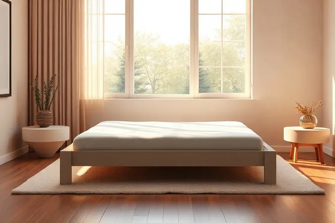
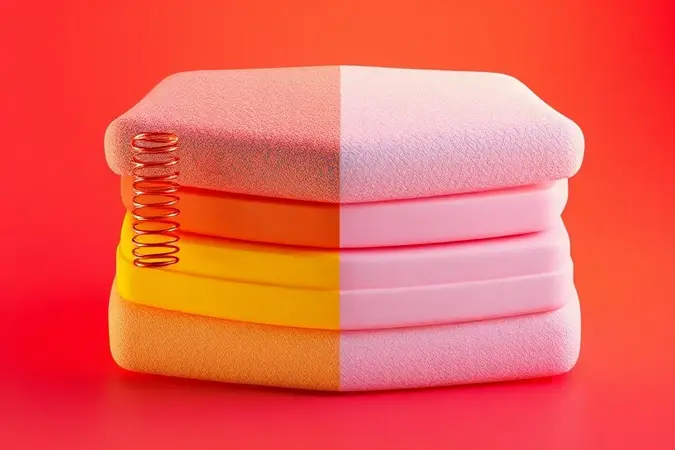
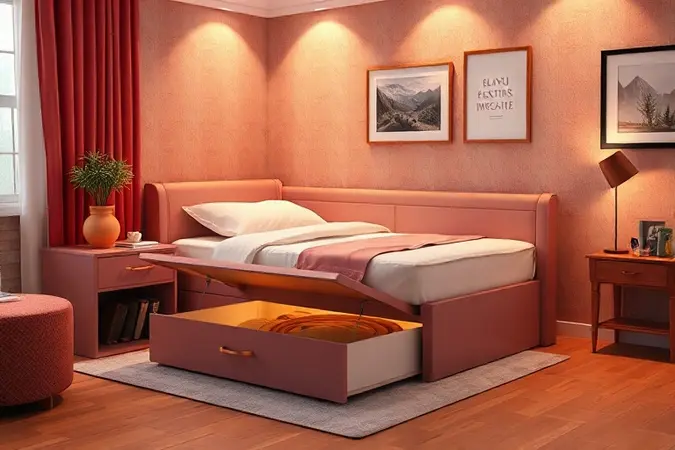

Escolher a melhor cama box solteiro é um dos investimentos mais inteligentes que você pode fazer na sua saúde e qualidade de vida. Mais do que um móvel, essa peça define o cenário onde suas noites se transformam em descanso verdadeiro.

Para crianças que crescem rápido, adolescentes que precisam de um espaço para estudar e relaxar, ou adultos que buscam conforto ortopédico, a cama certa faz toda a diferença. O desafio?

Com tantas opções de molas, espumas e funcionalidades extras, como encontrar a que combina com seu estilo de vida, espaço disponível e orçamento?

É justamente para simplificar essa busca que preparamos esta análise detalhada das 13 melhores camas box solteiro de 2025, avaliando não apenas especificações técnicas, mas o impacto real que cada modelo terá no seu dia a dia.

<SummaryList products={frontmatter.top_products} />

## As 13 Melhores Camas Box Solteiro para o seu Quarto

Antes de mergulharmos nos detalhes, lembre-se: o que funciona para um quarto espaçoso pode não ser ideal para um ambiente compacto. Da mesma forma, quem recebe visitas frequentes tem necessidades diferentes de quem prioriza armazenamento.

Nossa seleção abrange desde bases simples e elegantes até verdadeiras estações multimodais de descanso, todas avaliadas sob três pilares fundamentais: conforto que acolhe seu corpo, durabilidade que respeita seu investimento e funcionalidade que simplifica sua rotina.

### 1. Cama Box Base Ortobom Universal Courano

<ProductBox 
  title={frontmatter.top_products[0].title} 
  image={frontmatter.top_products[0].image} 
  link={frontmatter.top_products[0].link} 
/>

Pense na estrutura que você deseja para o seu colchão: robusta, estável e com um visual que não passa despercebido.

A Base Ortobom Universal Courano atende justamente esses pontos, com um revestimento em Courano que imita o couro e adiciona um ar de sofisticação ao ambiente.

Sua madeira resistente garante segurança para suportar até 150 kg, enquanto os pés fixos mantêm tudo no lugar sem oscilações indesejadas.

A verdadeira versatilidade aparece quando você descobre que pode optar por versões com baú ou cama auxiliar integrada, transformando uma simples base em uma solução completa para otimizar seu espaço.

E aqui vai um detalhe importante: embora a garantia formal seja de três meses, muitos usuários relatam uma durabilidade que ultrapassa em muito esse período, o que demonstra a qualidade da construção. Basta lembrar que o colchão é vendido separadamente.

<CaixaProsContras>

**Prós:**

- Estrutura resistente e robusta.

- Revestimento elegante em Courano.

- Suporta até 150 kg.

- Opção de modelos com baú ou cama auxiliar.

**Contras:**

- Garantia de apenas três meses.

- Não inclui colchão na compra.

</CaixaProsContras>

### 2. Cama Box Baú Ortobom Camurça

<ProductBox 
  title={frontmatter.top_products[1].title} 
  image={frontmatter.top_products[1].image} 
  link={frontmatter.top_products[1].link} 
/>

Se o seu desafio é unir elegância e organização em um só objeto, essa cama tem sua resposta. O revestimento em camurça oferece um toque visual sofisticado e agradável, enquanto a madeira de reflorestamento proporciona resistência duradoura.

O grande trunfo, porém, está escondido: um amplo baú interno que é um alívio para quartos pequenos.

Imagine guardar todas as roupas de cama sazonais, travesseiros extras e até aqueles cobertores pesados de inverno em um espaço próprio e acessível.

O sistema de abertura com pistões hidráulicos faz toda a diferença na prática, abrindo e fechando com uma suavidade que não exige esforço.

A montagem, mais elaborada, é o pequeno preço a pagar por tanta funcionalidade, e contar com ajuda profissional garante que tudo fique perfeito.

<CaixaProsContras>

**Prós:**

- Design sofisticado em camurça.

- Amplo espaço de armazenamento no baú.

- Estrutura resistente e durável.

- Sistema de abertura fácil com pistões hidráulicos.

**Contras:**

- A montagem pode ser desafiadora para iniciantes.

- Não inclui colchão ou acessórios decorativos.

</CaixaProsContras>

### 3. Cama Box Castor Si Poli Azul

<ProductBox 
  title={frontmatter.top_products[2].title} 
  image={frontmatter.top_products[2].image} 
  link={frontmatter.top_products[2].link} 
/>

Aqui está uma opção que entende que conforto e mobilidade podem andar juntos. Suas dimensões padrão se encaixam como uma luva na maioria dos quartos, enquanto a estrutura interna de madeira reflorestada garante a resistência necessária para anos de uso.

O revestimento em tecido é o detalhe que transforma, oferecendo uma sensação macia ao toque.

O que realmente chama a atenção é a liberdade de escolha: você pode optar por pés fixos para máxima estabilidade ou por rodízios que transformam a limpeza em uma tarefa fácil. Movimentar a cama para aspirar ou reorganizar o quarto deixa de ser um trabalho pesado.

Apesar do peso considerável, que pode ser um obstáculo em espaços muito apertados, a sensação de qualidade e solidez ao tocar o produto compensa completamente.

<CaixaProsContras>

**Prós:**

- Estrutura robusta e durável.

- Revestimento suave e elegante.

- Opção de pés com rodízios para fácil movimentação.

- Suporta até 120 kg, ideal para diferentes usuários.

**Contras:**

- Pode ser pesada para manuseio em espaços reduzidos.

- Altura não ajustável entre os modelos disponíveis.

</CaixaProsContras>

### 4. Cama Box Base Castor Si Poli Black

<ProductBox 
  title={frontmatter.top_products[3].title} 
  image={frontmatter.top_products[3].image} 
  link={frontmatter.top_products[3].link} 
/>

Versatilidade com um toque de discrição: essa é a proposta da Base Castor Si Poli Black. Seu revestimento em tecido poliéster preto funciona como uma tela neutra, combinando com praticamente qualquer estilo de decoração sem chamar atenção para si mesma.

A estrutura de pinus e eucalipto é a garantia silenciosa de uma base que não vai ceder com o tempo.

Ela cumpre seu papel principal com maestria, oferecendo suporte ideal para vários tipos de colchões que você já possa ter ou pretenda adquirir. A opção por diferentes alturas (23cm ou 27cm) é um mimo para quem quer ajustar a estética do ambiente.

O único ponto de cautela fica na garantia curta do tecido, algo a ponderar se a durabilidade visual for uma prioridade absoluta.

<CaixaProsContras>

**Prós:**

- Estrutura resistente em madeira de pinus e eucalipto.

- Revestimento em tecido poliéster fácil de limpar.

- Compatível com vários modelos de colchões.

- Disponível em diferentes alturas para atender diversas necessidades.

**Contras:**

- Garantia do tecido é curta (3 meses).

- Pode não atender a quem busca opções premium.

</CaixaProsContras>

### 5. Cama Box Base com 2 camas Auxiliares Paropas

<ProductBox 
  title={frontmatter.top_products[4].title} 
  image={frontmatter.top_products[4].image} 
  link={frontmatter.top_products[4].link} 
/>

Para quem vive com a incerteza de quando as visitas vão chegar, essa cama é um verdadeiro salva-vidas. A estrutura em madeira reflorestada oferece uma base sólida, mas a verdadeira magia acontece quando você desliza as duas camas auxiliares retráteis.

Elas se escondem discretamente, mantendo o quarto organizado, e surgem exatamente quando você precisa, sem ocupar um centímetro extra de espaço permanente.

O design em tecido matelassê não é apenas bonito, é prático, facilitando a limpeza de respingos ou poeira. A possibilidade de escolher entre várias cores permite que a cama se integre perfeitamente ao seu projeto decorativo.

A altura total de 43 cm, mais elevada, é uma característica que exige uma rápida avaliação do espaço, mas para quem valoriza a função acima de tudo, é um detalhe facilmente absorvido.

<CaixaProsContras>

**Prós:**

- Estrutura resistente em madeira reflorestada

- Design elegante e fácil de limpar

- Camas auxiliares retráteis para economia de espaço

- Oferecida em várias opções de cores

**Contras:**

- Altura total pode ser alta para alguns usuários

- O suporte de peso da cama auxiliar é limitado a 80 kg

</CaixaProsContras>

### 6. Cama Box Ortobom Revolution c/ Auxiliar

<ProductBox 
  title={frontmatter.top_products[5].title} 
  image={frontmatter.top_products[5].image} 
  link={frontmatter.top_products[5].link} 
/>

Esta cama resolve um quebra-cabeça comum: como ter uma cama extra sem transformar seu quarto em um depósito? A solução da Ortobom Revolution é engenhosa e prática.

A cama auxiliar, equipada com rodízios, desliza para fora com facilidade quando a casa enche, e volta para seu lugar discreto sob a principal quando as visitas vão embora, mantendo a praticidade do dia a dia.

A estrutura reforçada em madeira não é apenas uma promessa, é a segurança de que tudo permanecerá firme. O revestimento em Courano contribui para uma estética limpa e fácil de cuidar, enquanto o suporte de 150 kg garante que o conforto não será um problema.

Basta verificar se as dimensões menores da cama auxiliar atendem às suas necessidades de hospedagem.

<CaixaProsContras>

**Prós:**

- Estrutura reforçada que garante durabilidade.

- Revestimento fácil de limpar.

- Cama auxiliar prática para acomodar visitas.

- Suporta um bom peso, offering suporte confiável.

**Contras:**

- A cama auxiliar é menor e pode limitá-lo em alguns casos.

- Pode ser necessária atenção ao verificar as dimensões para o transporte.

</CaixaProsContras>

### 7. Cama Box Baú Ortobom Courano Preto

<ProductBox 
  title={frontmatter.top_products[6].title} 
  image={frontmatter.top_products[6].image} 
  link={frontmatter.top_products[6].link} 
/>

Organização com estilo: essa cama prova que funcionalidade pode ser sinônimo de elegância. O revestimento em courano preto adiciona um toque contemporâneo e sofisticado, mas o verdadeiro tesouro está dentro.

O amplo baú de armazenamento, com sistema basculante suavizado por amortecedores, é a resposta para manter a casa em ordem sem sacrificar a beleza do ambiente.

Abrir o baú para guardar edredons ou trocar a roupa de cama se torna uma tarefa simples e sem esforço. A estrutura robusta, capaz de suportar 150 kg, transmite confiança.

Apenas fique atento à profundidade do baú em alguns lotes, que pode limitar itens muito volumosos, um pequeno ajuste na forma de organizar que não diminui a utilidade incrível deste recurso.

<CaixaProsContras>

**Prós:**

- Amplo espaço de armazenamento

- Sistema de abertura facilitado com amortecedores

- Estrutura robusta em madeira

- Estilo elegante com revestimento em courano preto

**Contras:**

- Profundidade interna do baú pode ser limitada em alguns modelos

- Peso máximo suportado pode não atender a todos os usuários

</CaixaProsContras>

### 8. Cama Box Base Castor Poli C/ Gavetas

<ProductBox 
  title={frontmatter.top_products[7].title} 
  image={frontmatter.top_products[7].image} 
  link={frontmatter.top_products[7].link} 
/>

Esta base entende que o espaço ao redor da cama é precioso. Em vez de adicionar móveis extras, ela traz a solução de armazenamento na sua própria estrutura.

As duas gavetas espaçosas são um convite para organizar tudo que precisa estar por perto: lençóis, fronhas, até mesmo livros ou itens pessoais, liberando espaço no armário e mantendo o quarto visualmente limpo.

Disponível em diversas cores de tecido poliéster, ela se adapta à sua paleta de cores sem exigir compromissos estéticos.

A estrutura de madeira garante a resistência, mas a flexibilidade de tamanhos (solteiro, viúva ou casal) e alturas ajustáveis a tornam uma candidata versátil para diversos layouts de quarto. A montagem é o passo necessário para desfrutar de tanta praticidade.

<CaixaProsContras>

**Prós:**

- Estrutura resistente de madeira

- Revestimento em tecido poliéster disponível em várias cores

- Gavetas espaçosas para armazenamento

- Diferentes tamanhos e alturas para se adequar ao espaço

**Contras:**

- Altura total pode variar, exigindo atenção no espaço disponível

- Necessita de montagem por parte do usuário

</CaixaProsContras>

### 9. Cama Box Baú Ortobom com cama auxiliar

<ProductBox 
  title={frontmatter.top_products[8].title} 
  image={frontmatter.top_products[8].image} 
  link={frontmatter.top_products[8].link} 
/>

Por que escolher entre armazenar e hospedar quando você pode ter os dois? Este modelo é a epítome da multifuncionalidade para espaços inteligentes.

O baú interno resolve o eterno problema de onde guardar coisas, enquanto a cama auxiliar embutida espera pacientemente pela próxima visita, como um seguro de conveniência que não ocupa espaço visível.

A estrutura em madeira tratada é a base para essa dupla função, oferecendo a durabilidade necessária para suportar diferentes usos. A variedade de opções de colchões, de espuma a molas ensacadas, permite que você personalize o conforto de acordo com sua preferência.

A única ressalva é o manuseio, que por conta do design complexo pode ser menos ágil do que o de uma cama convencional, uma troca justa por tanta utilidade concentrada.

<CaixaProsContras>

**Prós:**

- Oferece espaço de armazenamento interno.

- Inclui cama auxiliar para acomodar visitas.

- Estrutura robusta e durável.

- Disponível em diferentes opções de colchões.

**Contras:**

- Pode ser difícil de mover devido ao tamanho.

- Requer atenção ao escolher a densidade do colchão.

</CaixaProsContras>

### 10. Cama Box Herval com cama auxiliar

<ProductBox 
  title={frontmatter.top_products[9].title} 
  image={frontmatter.top_products[9].image} 
  link={frontmatter.top_products[9].link} 
/>

Se a sua rotina oscila entre dias tranquilos e fins de semana movimentados com família e amigos, esta cama fala sua língua. Concebida para ser uma solução completa, ela oferece o conforto de uma cama principal de qualidade com a praticidade de uma auxiliar sempre à mão.

A estrutura de eucalipto reflorestado é o alicerce que garante que essa parceria dure por muitos anos.

Modelos como a Bicama Box Solteirão Herval Ness levam a experiência adiante, com colchões de molas ensacadas e rodízios na cama auxiliar que facilitam arrastá-la para qualquer lugar necessário.

Embora algumas versões possam ter um suporte ligeiramente diferente das bases tradicionais, o equilíbrio entre conforto diário e funcionalidade ocasional é cuidadosamente mantido, oferecendo exatamente o que situações híbridas demandam.

<CaixaProsContras>

**Prós:**

- Funcionalidade com cama auxiliar embutida

- Estrutura robusta em madeira de eucalipto

- Variedade de modelos e tamanhos

- Conforto adequado para uso diário e ocasional

**Contras:**

- Algumas versões podem ter suporte menos robusto

- Pode exigir mais espaço para acomodar a cama auxiliar

</CaixaProsContras>

### 11. Cama Box Solteiro Colchão Molas Qatar

<ProductBox 
  title={frontmatter.top_products[10].title} 
  image={frontmatter.top_products[10].image} 
  link={frontmatter.top_products[10].link} 
/>

Para quem acredita que investir em sono é investir em qualidade de vida, a Qatar apresenta um caso convincente. As molas MaxForce Pro são o coração deste modelo, proporcionando um suporte firme e preciso que se adapta às suas curvas sem perder a estrutura.

O tratamento antiácaro e antifúngico do revestimento não é um detalhe técnico, é a promessa de um ambiente mais saudável para suas horas de descanso.

Com capacidade para suportar até 200kg, ela oferece uma margem de segurança generosa, proporcionando tranquilidade. A opção pela versão baú adiciona uma camada extra de utilidade inteligente.

Sim, o investimento inicial pode ser superior ao de modelos básicos, mas quando você considera a combinação de tecnologia, suporte robusto e possíveis anos de sono reparador, o valor se espalha por muitas noites bem dormidas.

<CaixaProsContras>

**Prós:**

- Molas de alta qualidade que garantem conforto e suporte.

- Tratamento antiácaro e antifúngico no revestimento.

- Disponível em diferentes opções, como cama box baú.

- Suporte de peso elevado, ideal para diversas configurações.

**Contras:**

- O investimento inicial pode ser mais alto em comparação a modelos básicos.

- Pode ter uma altura maior, o que não agrada todos os usuários.

</CaixaProsContras>

### 12. Cama Box Hellen City Pillow Top Molas Ensacadas

<ProductBox 
  title={frontmatter.top_products[11].title} 
  image={frontmatter.top_products[11].image} 
  link={frontmatter.top_products[11].link} 
/>

Imagine um colchão que isola os seus movimentos, como se você estivesse dormindo em uma ilha de conforto particular. É essa experiência que as molas ensacadas individualmente da Hellen City proporcionam, minimizando a transferência de movimento de forma eficaz.

A camada adicional de pillow top é o abraço aconchegante que recebe seu corpo, adicionando uma suavidade que torna o adormecer um verdadeiro prazer.

A ventilação proporcionada pelo tecido sintético ajuda a manter uma temperatura agradável durante a noite. O suporte é calculado para atender a maioria das necessidades, embora a altura total dos modelos baú exija uma verificação do espaço disponível no seu quarto.

Em resumo, é uma escolha para quem prioriza um conforto refinado e tecnologias que realmente impactam a qualidade do sono.

<CaixaProsContras>

**Prós:**

- Molas ensacadas que reduzem a transferência de movimento.

- Camada adicional de pillow top para maior conforto.

- Excelente suporte e ventilação.

- Disponível em diferentes tamanhos e com opção baú.

**Contras:**

- Altura total elevada em modelos baú.

- Pode não ser ideal para quem prefere colchões mais firmes.

</CaixaProsContras>

### 13. Conjugado Union Ortopedic Solteiro Ortobom

<ProductBox 
  title={frontmatter.top_products[12].title} 
  image={frontmatter.top_products[12].image} 
  link={frontmatter.top_products[12].link} 
/>

Praticidade em sua forma mais pura. Este produto elimina a dúvida de compatibilidade entre base e colchão, pois ambos nasceram juntos.

Ideal para espaços limitados, suas dimensões compactas se encaixam onde outras camas não conseguem, sem abrir mão de um suporte ortopédico genuíno proporcionado pela espuma D28.

O tecido Viscopoli com tratamento antialérgico é um cuidado silencioso com sua saúde, enquanto a certificação do Inmetro atesta a segurança e qualidade da construção. A firmeza característica é uma escolha deliberada, focada no alinhamento postural.

Se você se enquadra no limite de peso e busca uma solução integrada que valorize um sono estruturado e saudável, este conjugado se apresenta como uma opção direta e eficiente.

<CaixaProsContras>

**Prós:**

- Praticidade com colchão e base integrados.

- Estrutura ortopédica que proporciona bom suporte.

- Tecido antialérgico e hipoalergênico.

- Certificado pelo Inmetro, garantindo qualidade.

**Contras:**

- O conforto pode ser considerado firme para alguns usuários.

- Limitado a usuários de até 80 kg.

</CaixaProsContras>

## O que é uma base de cama box de solteiro?

Pense na base de cama box como o alicerce do seu sono. Mais do que uma prateleira para o colchão, é uma estrutura projetada para oferecer suporte firme, estabilidade e durabilidade.

Construídas geralmente em madeira ou materiais compostos robustos, essas bases criam uma fundação plana que prolonga a vida útil do seu colchão, evitando deformações.

Sua altura mais baixa em relação às camas tradicionais traz uma estética moderna e facilita a entrada e saída, especialmente para crianças ou idosos.

Muitos modelos incorporam sistemas de ventilação na estrutura, um detalhe inteligente que permite a circulação de ar sob o colchão, combatendo a umidade e o mofo.

Essa combinação de apoio sólido, design prático e cuidado com a manutenção faz da cama box uma campeã de vendas para quartos compactos e para quem valoriza soluções inteligentes de decoração.

## Critérios Essenciais para Sua Cama Box

Transformar especificações técnicas em critérios de escolha inteligentes é a chave para não se arrepender da compra. Comece pelo coração do sistema: o colchão.

Molas oferecem um suporte mais firme e arejado, enquanto espumas, especialmente as de memória, abraçam o corpo e aliviam pontos de pressão de forma única. A densidade da espuma não é apenas um número, é o que define se você afundará ou será sustentado durante a noite.

Olhe além do visual da estrutura. O material precisa ser resistente a pragas e ao desgaste do tempo. Meça seu espaço com cuidado: uma cama que se torna um obstáculo no quarto prejudica a circulação e a sensação de bem-estar.

Por fim, uma garantia generosa não é apenas um papel, é a confiança que a marca deposita no próprio produto, um forte indicador de que você pode dormir tranquilo sabendo que seu investimento está protegido.

## Tipos de Cama Box: Molas vs Espuma

Esta é uma das decisões mais pessoais que você tomará na busca pela cama perfeita, pois define a sensação que terá ao deitar todas as noites.

As molas, sejam ensacadas ou bonnell, criam uma superfície reativa e com excelente circulação de ar, ideal para quem transpira mais ou prefere uma sensação de "flutuação" firme.

Do outro lado, as espumas, das tradicionais às de memória, trabalham de forma diferente. Elas cedem ao calor e peso do corpo, moldando-se às suas formas para distribuir a pressão de maneira uniforme. Algumas oferecem a sensação reconfortante de estar sendo "abraçado".

A escolha vai além de frio versus quente: trata-se de como seu corpo pede para ser recebido após um longo dia. Ouça sua necessidade de conforto e, se possível, teste antes de decidir.

## Funcionalidades Extras: Baú e Cama Auxiliar

Em um mundo onde cada metro quadrado conta, essas funcionalidades transformam uma simples cama em um centro de utilidades. O baú embutido é o aliado secreto da organização, um espaço oculto onde você pode esconder a bagunça sem comprometer a estética do quarto.

É perfeito para quem mora em apartamentos pequenos ou simplesmente quer manter uma atmosfera minimalista e livre de desordem.

A cama auxiliar, por sua vez, é a cortesia transformada em mobília. Em vez de desdobrar um colchão desconfortável no chão quando recebe amigos ou familiares, você oferece um lugar digno para dormir com praticidade.

Essas características não são meros adicionais, são soluções reais para necessidades reais, elevando sua cama de um objeto de descanso para uma peça central de uma vida doméstica mais fluida e preparada.

## Perguntas Frequentes

As dúvidas mais comuns giram em torno de como garantir que a escolha seja a certa. O tamanho é o primeiro ponto: além das medidas padrão, considere o espaço para caminhar ao redor da cama. Sobre a firmeza, não existe "melhor", existe o "melhor para você".

Pessoas com dores nas costas podem preferir suporte firme, enquanto outras buscam o acolhimento macio.

A vida útil da cama está diretamente ligada à qualidade da estrutura e do material do colchão. Investir em componentes robustos é investir em anos de bom sono.

Por fim, o revestimento influencia muito mais do que a aparência, afetando a respirabilidade, a facilidade de limpeza e até mesmo a alergenicidade. São detalhes que, juntos, compõem a experiência completa do seu descanso.

## Conclusão

Escolher a cama box solteiro ideal é um exercício de autoconhecimento que vai além de comparar preços e materiais. É sobre entender o ritmo da sua vida, o espaço que você habita e a forma como seu corpo pede descanso.

Dentre as 13 opções que analisamos, desde a Base Ortobom Universal com sua elegância atemporal até o Conjugado Union com sua praticidade integrada, existe um modelo que se encaixa perfeitamente na sua realidade.

Lembre-se que uma boa cama é um investimento de longo prazo na sua saúde e bem-estar. As noites bem dormidas se traduzem em dias mais produtivos, mais energia e uma postura corporal mais saudável.

Seja qual for sua prioridade, organização com baú, hospitalidade com cama auxiliar, ou suporte ortopédico de alta performance, o importante é que sua escolha reflita aquilo que realmente vai fazer diferença na sua rotina.

Agora, com todas as informações em mãos, você está pronto para transformar seu quarto em um verdadeiro santuário do descanso. Boa escolha e boas noites de sono!