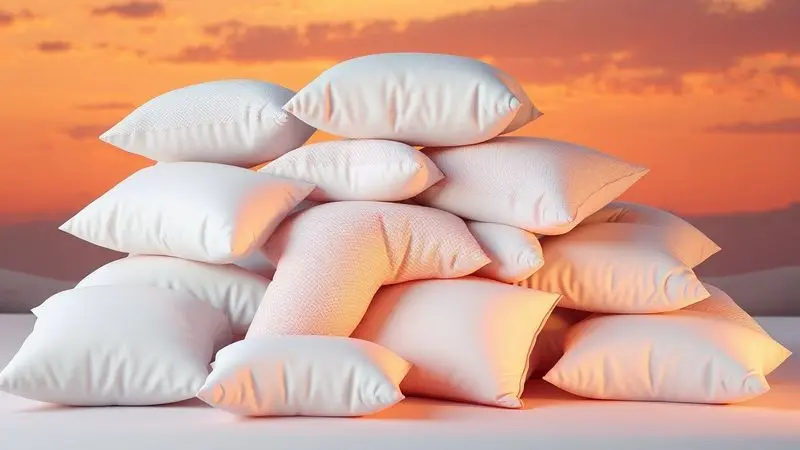

Dormir bem vai além de fechar os olhos à noite. É um investimento direto na sua saúde, produtividade e qualidade de vida. E nessa equação, o colchão não é apenas um objeto.

É o protagonista que vai determinar se você acorda revigorado ou mais cansado do que quando foi para a cama. Em 2025, as opções são tão sofisticadas que escolher pode parecer complicado.

Este guia vai além de um simples ranking. É um mapa de navegação para você encontrar o parceiro perfeito para suas noites, considerando desde o alívio de dores nas costas até a regulação perfeita da temperatura.

Vamos transformar dados técnicos em benefícios reais que você pode sentir na sua pele.

<SummaryList products={frontmatter.top_products} />

## Quais os Melhores Colchões de 2025? Confira o Ranking

O "melhor" colchão em 2025 não existe de forma universal. Ele é aquele que conversa com o seu corpo, seu biotipo e o seu jeito de dormir. Para uns, será o abraço terapêutico de uma espuma viscoelástica. Para outros, a sustentação inteligente das molas ensacadas.

A boa notícia? Nunca houve tanta tecnologia para garantir que você encontre a sua combinação ideal de conforto e suporte.

### 1. Power Sleep BF Colchões

<ProductBox 
  title={frontmatter.top_products[0].title} 
  image={frontmatter.top_products[0].image} 
  link={frontmatter.top_products[0].link} 
/>

Imagina aquele dia que você volta para casa com as costas travadas e precisa de um abraço firme que alinhe sua coluna? O Power Sleep da BF Colchões se oferece para isso.

Ele combina a estabilidade das molas ensacadas com o aconchego da espuma D33 para criar um suporte que não te deixa na mão. Essa dupla dinâmica também tem um segredo para casais. Reduz quase magicamente a sensação de movimento quando alguém se vira na cama.

O toque final fica por conta do pillow top com a famosa espuma da NASA. Ela não é apenas um nome bonito. É uma tecnologia que se molda aos seus contornos, distribuindo o peso e dando um descanso especial para ombros e quadril.

E para quem vive em guerra contra espirros e coceiras, ele ainda oferece uma defesa extra: um tratamento hipoalergênico que mantém ácaros e bactérias bem longe da sua zona de conforto. Ideal para quem busca firmeza acolhedora sem um investimento desproporcional.

<CaixaProsContras>

**Prós:**

- Excelente custo-benefício.

- Molas ensacadas individualmente que reduzem o movimento.

- Pillow top com espuma viscoelástica para maior conforto.

- Hipoalergênico, ideal para alérgicos.

**Contras:**

- Pode não ser ideal para indivíduos de biotipo endomorfo.

- Firmeza pode ser excessiva para alguns usuários que preferem colchões mais macios.

</CaixaProsContras>

### 2. Zissou

<ProductBox 
  title={frontmatter.top_products[1].title} 
  image={frontmatter.top_products[1].image} 
  link={frontmatter.top_products[1].link} 
/>

Se o calor noturno é seu inimigo, o Zissou G3 de 2025 pode ser seu melhor aliado. Este modelo nasceu para quem exige não apenas conforto, mas também uma experiência de sono fresca.

A combinação de viscoelástico com gel e látex gera uma ventilação tão eficiente que você quase esquece que está deitado em um colchão.

As molas ensacadas trabalham de forma independente, oferecendo zonas de apoio que parecem ter sido programadas especialmente para o formato do seu corpo.

A linha Coral, com suas versões macia e firme, é um convite para personalização. A tecnologia Visco-Fresh trabalha nos bastidores para dissipar o calor corporal, transformando cada noite em um respiro de frescor.

Sabe aquele teste de 100 dias para realmente sentir se o colchão é para você? Aqui ele vem com a garantia de devolução do dinheiro, uma segurança que permite você se entregar ao relaxamento sem pressa.

<CaixaProsContras>

**Prós:**

- Composição com materiais de alta qualidade para maior conforto.

- Ventilação eficaz, evitando o acúmulo de calor.

- Variedade de modelos adaptados a diferentes preferências de sono.

- Experiência de 100 dias com devolução do dinheiro.

**Contras:**

- O preço pode ser superior em relação a marcas mais básicas.

- Pode não ser a melhor opção se você busca um colchão extremamente firme.

</CaixaProsContras>

### 3. Liberty Ortobom

<ProductBox 
  title={frontmatter.top_products[2].title} 
  image={frontmatter.top_products[2].image} 
  link={frontmatter.top_products[2].link} 
/>

Para quem deseja que seu conforto também faça bem ao planeta, o Liberty da Ortobom oferece uma solução consciente. Seu conforto intermediário (classificado como 6 em uma escala de maciez) é construído sobre bases sustentáveis.

O revestimento utiliza tecnologia Oceancare, transformando garrafas PET em um tecido que acolhe seu sono.

As molas ensacadas garantem que os movimentos do seu parceiro não se transformem em ondulações que percorrem toda a cama. Essa independência de movimento é um alívio silencioso que melhora a qualidade do sono a dois.

Disponível em vários tamanhos, ele se adapta ao seu espaço e ao seu estilo de vida. A sensação de firmeza? Como muitas coisas boas na vida, é pessoal. Por isso, experimentar antes é o maior conselho que podemos dar.

<CaixaProsContras>

**Prós:**

- Conforto com tecnologia de molas ensacadas

- Revestimento sustentável com materiais reciclados

- Disponível em diversos tamanhos

- Experiência de sono tranquila e revigorante

**Contras:**

- A percepção de firmeza pode ser subjetiva

- Alguns usuários relatam desconforto após uso prolongado

</CaixaProsContras>

### 4. Colchão Tempur Sensation Elite

<ProductBox 
  title={frontmatter.top_products[3].title} 
  image={frontmatter.top_products[3].image} 
  link={frontmatter.top_products[3].link} 
/>

Algumas noites parecem exigir um abraço. O Tempur Sensation Elite entrega exatamente essa sensação, unindo ciência e conforto.

A espuma viscoelástica original, desenvolvida para astronautas, aqui trabalha para você, adaptando-se milimetricamente ao seu corpo e distribuindo o peso de forma terapêutica.

Para quem dorme de lado, essa adaptação é especialmente mágica, alinhando coluna e aliviando a pressão sobre os ombros.

O isolamento de movimento é quase absoluto, ideal para casais cujos ritmos de sono são diferentes. A construção robusta promete anos de apoio consistente. Porém, essa experiência premium requer um investimento condizente.

E se você é daqueles que vive "pegando fogo" à noite, vale considerar que o abraço da viscoelástica pode reter um pouco mais de calor.

<CaixaProsContras>

**Prós:**

- Conforto e alívio de pressão excepcionais.

- Bom suporte para quem dorme de lado.
. Excelente absorção de movimento, ideal para casais.

- Durabilidade e construção robusta.

**Contras:**

- Preço elevado, típico de colchões de luxo.

- Peso considerável, dificultando o manuseio.

</CaixaProsContras>

### 5. Colchão Americanflex D45 Clinoflex Bambu

<ProductBox 
  title={frontmatter.top_products[4].title} 
  image={frontmatter.top_products[4].image} 
  link={frontmatter.top_products[4].link} 
/>

Para quem precisa de um suporte que não ceda, que mantenha a coluna alinhada sem flacidez, o Americanflex D45 Clinoflex Bambu é uma fortaleza de conforto.

Sua espuma com densidade D45 foi projetada para suportar pesos entre 101 kg e 150 kg com uma estrutura firme e resiliente. Não é apenas resistência, é inteligência de suporte.

A superfície, feita com um tecido Jacquardlasse que mescla viscose de bambu e algodão, é um carinho para a pele. Sua respirabilidade ajuda a regular a temperatura corporal, criando um microclima agradável.

O pillow top acrescenta uma camada extra de suavidade, como um travesseiro integrado ao colchão. Com certificações do INMETRO e do INER, ele oferece segurança não apenas para seu corpo, mas também para sua tranquilidade.

<CaixaProsContras>

**Prós:**

- Conforto firme, ideal para biótipos mais pesados.

- Tecido suave que ajuda na temperatura corporal.
1 Pillow Top que aumenta o conforto.

- Certificações que garantem qualidade e segurança.

**Contras:**

- Pode ser considerado firme demais para quem prefere colchões macios.

- Variedade de tamanhos limitada em comparação com outras marcas.

</CaixaProsContras>

### 6. Ziman Master

<ProductBox 
  title={frontmatter.top_products[5].title} 
  image={frontmatter.top_products[5].image} 
  link={frontmatter.top_products[5].link} 
/>

Estabilidade é o conceito central do Ziman Master. Se você já se cansou daquela sensação de balanço ao se virar em um colchão de molas tradicionais, aqui a experiência é diferente.

A base de espuma HR de alta densidade trabalha em parceria com o pillow top de látex natural para criar uma superfície sólida e acolhedora, capaz de suportar até 150 kg por pessoa.

O resultado? Um conforto intermediário que se recusa a balançar, oferecendo uma sensação de segurança. O látex natural não apenas contribui para essa firmeza, mas também age como um regulador natural de temperatura.

Ele pode não ter a adaptação ultra-rápida de algumas espumas viscoelásticas, mas compensa com um suporte consistente e estável, perfeito para quem dorme de lado e busca alívio sem afundamento excessivo.

<CaixaProsContras>

**Prós:**

- Conforto intermediário que atende diferentes biótipos.

- Látex natural ajuda a regular a temperatura.

- Boa resistência ao peso e alta durabilidade.

- Estabilidade sem balanço durante o sono.

**Contras:**

- Pode não moldar rapidamente ao corpo para alguns usuários.

- Preço pode ser um fator a considerar para quem busca opções mais baratas.

</CaixaProsContras>

### 7. Guldi Original Firme

<ProductBox 
  title={frontmatter.top_products[6].title} 
  image={frontmatter.top_products[6].image} 
  link={frontmatter.top_products[6].link} 
/>

O híbrido Guldi Original Firme é para quem não quer escolher entre a adaptabilidade das espumas e a sustentação clássica das molas. Ele combina ambos os mundos em um colchão de 25 cm que suporta até 120 kg por pessoa.

Disponível nas versões firme e macia, ele oferece a chance de selecionar o toque que mais combina com você.

Seus usuários frequentemente elogiam um detalhe crucial para a harmonia conjugal: ele isola movimentos com eficiência notável. O acabamento reforçado promete resistência, enquanto a garantia de 5 anos fala por sua durabilidade.

E se ainda houver dúvida, você tem 100 noites para vivenciar o sono que ele oferece ao seu lado e decidir se é amor à primeira vista.

<CaixaProsContras>

**Prós:**

- Combinação de materiais que proporciona bom suporte e conforto

- Eficaz no bloqueio de movimento, ideal para casais

- Bom acabamento e resistência

- Garantia de 5 anos e 100 noites de teste

**Contras:**

- Embalagem inicial pode ser melhorada

- O tecido pode acumular bolinhas com o tempo

</CaixaProsContras>

### 8. Restonic Magnifique Hotelaria

<ProductBox 
  title={frontmatter.top_products[7].title} 
  image={frontmatter.top_products[7].image} 
  link={frontmatter.top_products[7].link} 
/>

Já se perguntou como consegue dormir tão bem nos melhores hotéis? Parte do segredo pode estar no Restonic Magnifique Hotelaria, desenhado para oferecer o luxo da hospitalidade em casa.

Seu sistema de molejo Miracoil é especialista em fornecer estabilidade lateral, minimizando aquela sensação de rolar para o centro da cama.

O pillow top duplo é um convite ao conforto, acrescentando camadas de maciez sem sacrificar a firmeza estrutural. Com capacidade para suportar até 180 kg por pessoa, ele acolhe diferentes biotipos com elegância.

O design robusto e a construção dupla face são investimentos em longevidade. É a experiência de sono premium que você pode instalar no seu quarto.

<CaixaProsContras>

**Prós:**

- Conforto excepcional com pillow top duplo.

- Sistema de molejo resistente que reduz movimentação lateral.

- Suporta até 180 kg por pessoa, atendendo vários biotipos.

- Construção dupla face que aumenta a durabilidade.

**Contras:**

- Pode ser considerado mais pesado em comparação a colchões comuns.

- O design pode não agradar todos os estilos decorativos.

</CaixaProsContras>

### 9. Colchão Molas Ensacadas com pillow Certificado Wave BF Colchões

<ProductBox 
  title={frontmatter.top_products[8].title} 
  image={frontmatter.top_products[8].image} 
  link={frontmatter.top_products[8].link} 
/>

Para quem procura o equilíbrio clássico, o colchão Wave da BF Colchões oferece a harmonia entre adaptação e suporte.

Suas molas ensacadas individuais são pequenos agentes de conforto, trabalhando em conjunto para se ajustar aos seus contornos enquanto minimizam a transferência de movimento.

A camada de pillow top, feita com espuma Maxflowing, é o toque final que transforma suporte em aconchego. Esse não é um colchão radicalmente macio ou excessivamente duro. Ele ocupa o ponto ideal do intermediário, reconfortante e estruturado.

Com selo do INMETRO e tratamento antimicrobiano no tecido, ele cuida da sua qualidade de sono e da sua saúde, oferecendo proteção extra para quem convive com alergias.

<CaixaProsContras>

**Prós:**

- Molas ensacadas proporcionam excelente adaptação ao corpo.

- Pillow top oferece um toque macio e confortável.

- Certificações de qualidade garantem durabilidade e segurança.

- Tratamento antimicrobiano é ótimo para alérgicos.

**Contras:**

- Conforto intermediário pode não agradar a todos os perfis de sono.

- Pode ser considerado mais pesado em comparação a outros modelos.

</CaixaProsContras>

### 10. Tempur Sensation

<ProductBox 
  title={frontmatter.top_products[9].title} 
  image={frontmatter.top_products[9].image} 
  link={frontmatter.top_products[9].link} 
/>

O Tempur Sensation é uma experiência enganadora (no bom sentido). Ele oferece a sensação de suporte e leveza que você associa a um colchão de molas, mas sem uma única mola em sua composição.

O que ele tem é uma tecnologia de espuma que proporciona liberdade de movimento quase irrestrita, ideal para quem muda de posição várias vezes durante a noite.

É como se o colchão se adaptasse aos seus giros e voltas, oferecendo suporte ajustado onde você precisa e flexibilidade onde você deseja. O isolamento de movimento é outro ponto forte, preservando o sono do seu parceiro.

Se você busca um colchão que pareça levíssimo, mas que trabalhe muito para manter sua coluna alinhada, esta linha contínua sendo uma referência de durabilidade e inovação.

<CaixaProsContras>

**Prós:**

- Conforto personalizado que se adapta ao corpo.

- Liberdade de movimento durante o sono.

- Boa durabilidade e qualidade de materiais.

- Isolamento de movimento, ideal para casais.

**Contras:**

- Pode não ser a melhor escolha para quem prefere colchões rígidos.

- A sensação de leveza pode não agradar todos os usuários.

</CaixaProsContras>

### 11. Restonic Ergo Ultra

<ProductBox 
  title={frontmatter.top_products[10].title} 
  image={frontmatter.top_products[10].image} 
  link={frontmatter.top_products[10].link} 
/>

Imagine desabar na cama e ser recebido por uma nuvem macia que ainda assim oferece suporte preciso. Esta é a proposta do Restonic Ergo Ultra.

A dupla infalível de látex 100% natural (importado da Bélgica) e espuma Ultracel com gel cria uma experiência de conforto acolhedora e refrescante.

As células abertas da espuma garantem circulação de ar, mantendo a frescura durante toda a noite. Com 20 cm de espessura e capacidade para suportar até 165 kg por pessoa, ele é versátil para camas tradicionais ou articuladas. A maciez é realmente marcante.

Se você busca um colchão que se adapte à fisiologia da cama articulada sem molejos tradicionais, encontrará aqui um descanso de qualidade diferente.

<CaixaProsContras>

**Prós:**

- Conforto excepcional com combinação de látex e espuma Ultracel

- Suporte adequado para até 165 kg por pessoa

- Ideal para camas articuladas e tradicionais

- Alta durabilidade dos materiais utilizados

**Contras:**

- Pode ser considerado muito macio para quem prefere colchões mais firmes

- Sem opções de molejo, o que pode não agradar a todos

</CaixaProsContras>

### 12. Colchão Emma Original

<ProductBox 
  title={frontmatter.top_products[11].title} 
  image={frontmatter.top_products[11].image} 
  link={frontmatter.top_products[11].link} 
/>

Popular por um motivo: equilíbrio. O Emma Original é aquele amigo confiável que nunca te deixa na mão.

Sua construção multicamadas, com espuma Airgocell® e viscoelástica, atua como um time de apoio ao seu corpo, adaptando-se aos seus contornos e aliviando pontos de pressão com uma firmeza média-firme que atende bem a várias posições de sono.

A respirabilidade é sua aliada contra o calor noturno. O isolamento de movimento é eficiente, garantindo que a reviravolta do parceiro não se transforme em um tsunami na sua metade da cama.

E o suporte de borda é real: você pode sentar na beiuda sem a sensação de que vai escorregar. A garantia de 10 anos e o teste de 100 noites são o aperto de mão que confirma a qualidade duradoura deste investimento.

<CaixaProsContras>

**Prós:**

- Boa adaptação ao contorno do corpo.

- Excelente controle de temperatura.

- Isolamento de movimento eficaz.

- Garantia de 10 anos e 100 noites de teste.

**Contras:**

- Preço um pouco acima da média comparado a colchões convencionais.

- Algumas versões podem ser híbridas, o que pode confundir o consumidor.

</CaixaProsContras>

### 13. Colchão Ortobom Molas SuperPocket Freedom

<ProductBox 
  title={frontmatter.top_products[12].title} 
  image={frontmatter.top_products[12].image} 
  link={frontmatter.top_products[12].link} 
/>

Para quem busca tecnologia avançada em cada camada, o Ortobom Molas SuperPocket Freedom é um laboratório de conforto.

As molas SuperPocket trabalham individualmente para um suporte personalizado, enquanto a espuma viscoelástica atua como um terapêuta noturno, aliviando pontos de pressão e melhorando a circulação.

O revestimento com Aloe Vera e Íons de Prata vai além do conforto tátil, oferecendo propriedades antibacterianas que cuidam do ambiente onde você passa um terço da sua vida. Outro conforto: a manutenção simplificada. Ele não precisa ser virado, facilitando sua rotina.

Com 32 cm de altura, sua robustez é visível e garante suporte, mas pode demandar uma cama compatível ou lençóis específicos.

<CaixaProsContras>

**Prós:**

- Molas SuperPocket para suporte anatômico.

- Espuma viscoelástica que alivia pressão e melhora a circulação.

- Revestimento com tecnologia avançada (Aloe Vera, Íons de Prata).

- Não precisa ser virado, facilitando a manutenção.

**Contras:**

- Altura de 32 cm pode não ser ideal para camas baixas.

- Pode exigir um investimento maior inicialmente.

</CaixaProsContras>

### 14. Colchão Herval Imperatore Eco Bamboo

<ProductBox 
  title={frontmatter.top_products[13].title} 
  image={frontmatter.top_products[13].image} 
  link={frontmatter.top_products[13].link} 
/>

A frescura natural do bambu encontra a tecnologia moderna neste colchão que pensa na sua saúde e no seu conforto. As molas ensacadas adaptam-se ao seu corpo, enquanto a espuma viscoelástica (aquela da NASA) trabalha na distribuição inteligente do peso.

O revestimento em viscose de bambu é um diferencial sensorial. Ele é respirável, naturalmente resistente a bactérias e fungos, e mantém uma temperatura agradável em qualquer estação.

A tecnologia One Side elimina a necessidade de virar o colchão, tornando a manutenção mais simples. Design moderno e funcionalidade se unem para criar um investimento em noites de sono que respeitam seu corpo e o meio ambiente.

<CaixaProsContras>

**Prós:**

- Molas ensacadas que oferecem suporte personalizado.

- Espuma viscoelástica que alivia pontos de pressão.

- Revestimento respirável em bambu que combate bactérias.

- Design moderno e sofisticado.

**Contras:**

- Não é possível virar o colchão, limitando opções de uso.

- Pode não ser a melhor opção para quem prefere colchões mais firmes.

</CaixaProsContras>

## Como escolher um bom colchão?

Escolher um colchão é como encontrar um parceiro para dançar. Ambos precisam estar em sintonia. O primeiro passo é entender sua lingu corporal: como você dorme? De lado, de costas, de bruços? Sua posição de sono define o tipo de suporte que sua coluna precisa.

Em seguida, sinta o material. Espuma viscoelástica é o abraço que se adapta, perfeito para quem busca alívio de pressão. Molas ensacadas oferecem sustentação firme e excelente ventilação. Látex natural une conforto e frescor. Não tenha pressa.

Deite, role, simule sua posição favorita. O que é conforto para alguém pode ser desconforto para você.

Considere o tamanho do seu espaço e das suas necessidades. Um colchão individual precisa atender apenas você. Um de casal precisa harmonizar dois corpos diferentes. Por fim, olhe para o futuro: verifique a garantia e a durabilidade prometida.

Um bom colchão é um investimento de longo prazo na sua saúde, não uma despesa mensal.

## Quais As Melhores Marcas De Colchão Em 2025? (Emma, Colchão Ortobom, Luuna)

Em 2025, algumas marcas se destacam não apenas por oferecer produtos, mas por criar experiências distintas de sono. A Emma conquista pela excelência no equilíbrio.

Seus colchões são como mestres em ergonomia, oferecendo a combinação certa de suporte e conforto que alivia dores e convida ao relaxamento profundo.

Ortobom é a tradição brasileira que se renova. Com uma longa história no mercado, a marca mantém a confiança ao oferecer uma gama variada. Do mais firme ao mais macio, sempre com a durabilidade como promessa cumprida.

Já a Luuna se especializa em um superpoder: o resfriamento. Para quem sofre com noites quentes, seus colchões com tecnologia de controle térmico são um oásis de frescor.

Cada uma tem sua personalidade. Cabe a você identificar qual delas conversa com o seu corpo e com as suas noites.

## Qual o Colchão Ideal Para Quem Tem Dores Nas Costas?

Para quem carrega o peso do dia nas costas e procura alívio durante a noite, a escolha do colchão é terapêutica. O objetivo não é nem muito firme, nem muito macio, mas o equilíbrio que mantém sua coluna alinhada sem criar novos pontos de pressão.

Colchões com espuma viscoelástica ou látex são campeões neste quesito. Eles têm a inteligência de se moldar aos seus contornos, oferecendo apoio personalizado para a curvatura natural da sua coluna.

A tecnologia de molensensacadas também pode ser uma aliada, distribuindo o peso de forma uniforme.

Mais importante que a tecnologia é a garantia de que o colchão manterá suas promessas ao longo dos anos. Procure por marcas que ofereçam garantias robustas e avaliações consistentes de usuários que, como você, buscam o fim das dores.

## Qual o Colchão Ideal Para Quem Sofre De Alergias?

Se seu sono é interrompido por espirros, coceiras ou congestão, seu colchão pode ser mais que um móvel. Pode ser um foco de alérgenos. A escolha certa pode transformar seu quarto em um santuário respiratório.

Priorize materiais naturalmente resistentes, como látex 100% natural ou espumas com tratamentos específicos antiácaro e antimicrobianos. Muitos modelos hoje incluem capas removíveis e laváveis, uma barreira física inteligente contra ácaros e poeira.

Evite superfícies sintéticas e acolchoados tradicionais que se tornam verdadeiros depósitos de alérgenos.

Lembre-se: o colchão é parte de um ecossistema. Mantenha o ambiente ventilado, use protetores impermeáveis e limpos, e considere a troca periódica. Seu corpo agradece a cada respiração tranquila durante a noite.

## O Que Um Bom Colchão Deve Ter?

Um bom colchão deve ser mais que uma superfície para deitar. Deve ser um sistema de suporte inteligente que:

1. Converse com sua coluna, mantendo-a alinhada em sua posição natural de repouso.

2. Respire com você, com materiais que permitam circulação de ar e evitem o acúmulo de calor e umidade.

3. Respeite seu tempo, com uma densidade e construção que garantam durabilidade real, não apenas prometida.

4. Entenda sua vida, seja você solteiro, casado, com movimentos agitados ou sono tranquilo.

5. Ofereça confiança, com garantias claras e um histórico de qualidade que justifique o investimento.

## Qual o Melhor, Colchão De Espuma Ou De Molas Ensacadas?

Esta é a batalha clássica, mas a resposta é: depende do que seu corpo pede.

Os colchões de espuma, especialmente os viscoelásticos, são mestres em adaptação. Eles envolvem seu corpo, aliviam pontos de pressão (ótimo para quem dorme de lado) e isolam completamente o movimento. São como um abraço personalizado que se renova a cada noite.

Os colchões de molasensacadas são especialistas em sustentação firme e ventilação. Sua estrutura permite que o ar circule, evitando a sensação de abafamento.

As molas independentes criam zonas de conforto específicas e reduzem drasticamente a transferência de movimento, uma benção para casais.

Pergunte a si mesmo: você busca aconchego personalizado ou sustentação estruturada? A resposta guiará sua escolha.

## Qual É A Melhor Densidade De Colchão?

A densidade não é apenas um número. É a medida de quanto suporte o colchão pode oferecer sem ceder demais. Para a maioria dos adultos, a faixa de 30 a 40 kg/m³ é o terreno do equilíbrio, oferecendo conforto sem perda de sustentação.

Se você tem um biotipo mais pesado, sofre com dores nas costas ou simplesmente prefere uma sensação mais firme, densidades acima de 40 kg/m³ oferecerão a estrutura robusta que você busca. Mas densidade não é tudo. O material e a construção são igualmente importantes.

Pense na densidade como um dos ingredientes da receita do sono perfeito, não a receita completa.

## Como Cuidar Do Seu Colchão Corretamente?

Seu colchão é um investimento que merece carinho. Comece protegendo-o com uma capa à prova de líquidos e ácaros, uma armadura invisível contra acidentes e alérgenos. Evite pular ou se sentar com impacto nas bordas, gestos que podem comprometer a integridade interna.

A cada três meses, dê uma nova perspectiva ao seu colchão girando-o de cabeça para os pés (a menos que o modelo seja One Side). A aspiração regular remove poeira e partículas que se acumulam nas fibras. Manchas?

Limpe imediatamente com um pano úmido e sabão neutro, sem produtos químicos agressivos. Esses pequenos rituais prolongam a vida e a qualidade do seu refúgio noturno.

## Quais são os riscos de comprar um colchão usado?

A economia inicial de comprar um colchão usado pode custar caro à sua saúde e ao seu sono. O maior risco é invisível: ácaros, fungos e bactérias que se instalam profundamente nos materiais, desencadeando alergias e problemas respiratórios.

A estrutura também é uma incógnita. Molas cansadas, espumas deformadas ou densidade comprometida podem sabotar seu alinhamento postural, transformando a noite em uma fonte de novas dores.

Sem garantia e sem saber o histórico real de uso, você está adquirindo um problema potencial, não uma solução. Seu sono e sua coluna merecem um começo limpo e confiável.

## Como escolher o travesseiro certo para você?

O travesseiro é o parceiro perfeito do colchão, e sua escolha é igualmente pessoal. Tudo começa com sua posição ao dormir.

Dorme de lado? Você precisa de um travesseiro mais alto e firme para preencher o espaço entre ombro e cabeça, mantendo a coluna reta. Dorme de barriga para baixo? Escolha um modelo bem baixo e macio, para não forçar o pescoço. Dorme de costas?

Um travesseiro de altura média oferece o suporte ideal.

O material define a sensação. Viscoelástica se adapta, penas são moldáveis, látex é firme e respirável. Teste, sinta, imagine acordar com ele. Um travesseiro errado pode arruinar até o melhor dos colchões. Um travesseiro certo multiplica o seu conforto.

## Conclusão

Escolher o melhor colchão em 2025 não é sobre encontrar um campeão universal. É sobre descobrir o parceiro perfeito para o seu sono único.

Seu corpo, seu biotipo, sua maneira de dormir e até seu termostato pessoal são variáveis que transformam dados técnicos em experiências completamente diferentes.

Desta jornada pelos principais modelos, leve consigo uma certeza: nunca houve tanta tecnologia dedicada ao seu descanso.

Seja o abraço terapêutico da viscoelástica do Tempur, a estabilidade sem balanço do Ziman, a frescura inteligente do Zissou ou o equilíbrio confiável da Emma, existe um colchão criado para transformar suas noites.

Avalie suas verdadeiras necessidades. Considere o investimento como um compromisso com sua saúde a longo prazo. E lembre-se: a melhor prova é sentir. Uma boa loja, um período de teste ou uma política de devolução generosa são seus aliados nessa decisão tão pessoal.

Sua nova noite de sono te espera. Basta encontrar a superfície certa para descansar.