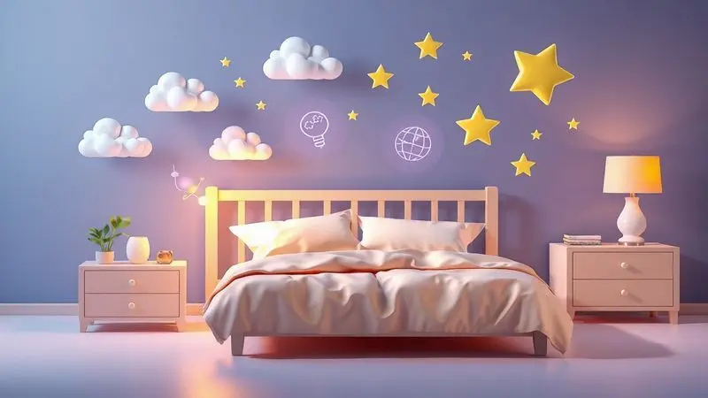
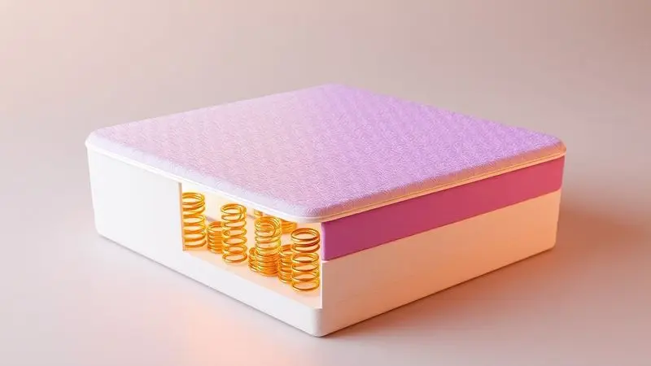
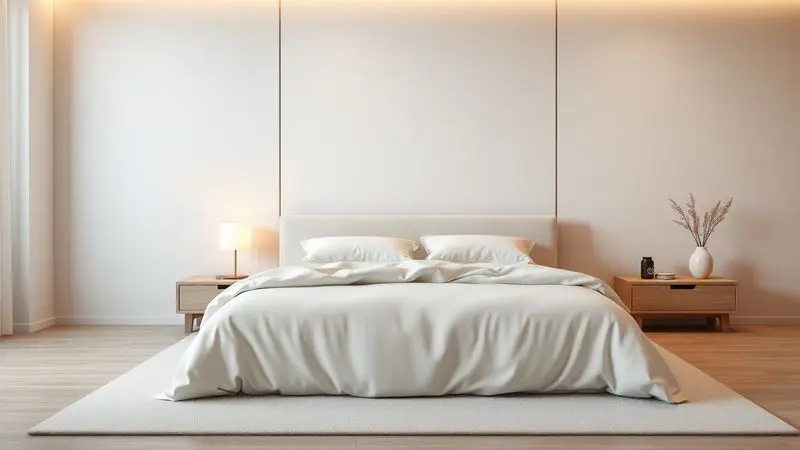

Escolher o colchão ideal vai muito além de um simples móvel para o quarto. É sobre investir em um terço da sua vida, aquelas preciosas horas em que seu corpo se repara, sua mente se reorganiza e sua energia se renova.

Com o mercado repleto de opções que vão desde as tradicionais molas até as mais modernas espavas magnéticas, a decisão pode parecer um labirinto.

Para guiar você nessa jornada, mergulhamos nas principais marcas e modelos de 2025, criando um ranking com 13 opções que realmente valem seu investimento.

Mais do que especificações técnicas, vamos explorar a experiência de sono que cada uma oferece, além de desvendar conceitos essenciais sobre densidade, tamanhos e tipos de conforto. Prepare-se para descobrir o caminho para o descanso que você merece.

<SummaryList products={frontmatter.top_products} />

## Confira os 13 melhores colchões para comprar em 2025

### 1. Colchão Herval Molas Ensacadas MasterPocket Eruditto c/ Massagem

<ProductBox 
  title={frontmatter.top_products[0].title} 
  image={frontmatter.top_products[0].image} 
  link={frontmatter.top_products[0].link} 
/>

Imagine terminar um dia intenso e, em vez de apenas deitar, receber um convite para relaxar. O Herval MasterPocket Eruditto transforma sua cama em um spa pessoal.

Suas molas ensacadas agem como dedos individuais, sustentando cada curva do seu corpo de forma personalizada, enquanto isolam completamente seus movimentos dos do seu parceiro.

O Euro Pillow que o acompanha é como um travesseiro embutido, adicionando uma nuvem de maciez logo na superfície.

O verdadeiro diferencial, porém, está no controle remoto. Com um toque, você ativa a função de vibro massagem, que trabalha suavemente a musculatura para dissolver a tensão acumulada.

E para quem preza pela saúde, o tratamento antiácaro e antifungo cria uma barreira invisível, garantindo que seu refúgio noturno seja também um ambiente seguro. É para quem entende que dormir bem é um ritual que merece tecnologia a seu favor.

<CaixaProsContras>

**Prós:**

- Molas ensacadas para suporte personalizado.

- Função de massagem vibratória levemente relaxante.

- Tratamento antiácaro e antifungo.

- Conforto equilibrado entre maciez e firmeza.

**Contras:**

- Pode exigir cuidados especiais na limpeza.

- A tecnologia de massagem pode não agradar a todos.

</CaixaProsContras>

### 2. Colchão Castor Molas Pocket Gold Star SLX Light Stress Oxygen New Double Face

<ProductBox 
  title={frontmatter.top_products[1].title} 
  image={frontmatter.top_products[1].image} 
  link={frontmatter.top_products[1].link} 
/>

Para quem carrega o peso do dia não apenas nos ombros, mas em forma de estresse acumulado, este colchão da Castor oferece uma proposta diferente. Ele vai além do conforto físico, abordando o bem-estar de forma integral.

A tecnologia Light Stress age dissipando a carga eletrostática do corpo, enquanto o tecido Aria 3D funciona como uma respiração constante, mantendo a temperatura sempre amena, sem aqueles picos de calor no meio da noite.

A construção com molas Pocket garante que seu corpo encontre o suporte exato onde precisa, e a opção double face é um trunfo para a durabilidade. Você pode alternar os lados periodicamente, como se tivesse dois colchões em um.

Sim, o nome é complexo, mas por trás dele está uma engenharia pensada para noites verdadeiramente renovadoras.

<CaixaProsContras>

**Prós:**

- Tecnologia de molas Pocket para suporte ideal.

- Tecido que ajuda a controlar estresse e melhora a circulação.

- Ventilação constante com o sistema Aria 3D.

- Opção double face que aumenta a vida útil do colchão.

**Contras:**

- Nomes diferentes para o mesmo modelo podem causar confusão.

- Não é o colchão mais acessível do mercado.

</CaixaProsContras>

### 3. Colchão Probel de Espuma D33/d28 Pró Magnífico Foam c/ Massagem

<ProductBox 
  title={frontmatter.top_products[2].title} 
  image={frontmatter.top_products[2].image} 
  link={frontmatter.top_products[2].link} 
/>

Aqui, a firmeza encontra o relaxamento. O Probel Pró Magnífico é para quem precisa de um suporte robusto, mas não abre mão do alívio imediato.

As camadas de espuma D33 e D28 trabalham juntas como uma fundação sólida que mantém sua postura alinhada, enquanto o Pillow Top Europeu recebe seu corpo com uma maciez acolhedora.

A função de vibro massagem integrada é o destaque. Após um dia em pé ou sentado, ela oferece aquele alívio muscular direcionado que prepara seu corpo para um sono profundo.

Com certificação do Inmetro e tratamentos que mantêm ácaros e fungos longe, ele é uma escolha segura para quem busca um colchão durável com um plus terapêutico.

<CaixaProsContras>

**Prós:**

- Tecnologia de vibro massagem para relaxamento.

- Tratamento antiácaro e antifungo.

- Conforto firme com camadas de espuma D28 e D33.

- Certificação do Inmetro garantindo qualidade.

**Contras:**

- Verifique a disponibilidade, pois alguns modelos podem estar fora de linha.

- Pode não ser ideal para quem prefere colchões macios.

</CaixaProsContras>

### 4. Colchão Sealy Molas LFK Royal Comfort Plus

<ProductBox 
  title={frontmatter.top_products[3].title} 
  image={frontmatter.top_products[3].image} 
  link={frontmatter.top_products[3].link} 
/>

O Sealy Royal Comfort Plus é como um colchão sob medida que se adapta dinamicamente a você. As molas LFK não são estáticas, elas respondem individualmente à sua posição, oferecendo suporte personalizado para os ombros, quadris e lombar.

Enquanto isso, as camadas de espuma Hipersoft Gel trabalham para dissipar o calor, garantindo que você não acorde no meio da noite se revirando por causa do abafamento.

O Pillow Top é o toque final de conforto, uma camada extra que torna a superfície convidativa desde o primeiro contato.

Com 40 cm de altura, ele impõe presença no quarto e exige um pouco mais de esforço na hora de trocar os lençóis, mas em troca oferece uma experiência de sono elevada em todos os sentidos.

<CaixaProsContras>

**Prós:**

- Sistema de molas LFK que oferece ótimo suporte.

- Camadas de espuma que regulam a temperatura.

- Pillow Top para maior conforto e suavidade.

- Durabilidade e estabilidade com tecido antiácaro.

**Contras:**

- Altura de 40 cm pode ser excessiva para alguns usuários.

- Pode não ser a melhor opção para quem prefere colchões mais firmes.

</CaixaProsContras>

### 5. Colchão Magnético Anjos de Molas Ensacadas Commodite Magnético c/ massagem

<ProductBox 
  title={frontmatter.top_products[4].title} 
  image={frontmatter.top_products[4].image} 
  link={frontmatter.top_products[4].link} 
/>

Este colchão da Anjos aposta em uma abordagem holística para o descanso. As molas ensacadas garantem o suporte estrutural e o isolamento de movimento que todo casal deseja.

Já as pastilhas magnéticas integradas prometem um efeito terapêutico adicional, buscando equilibrar a energia corporal e aliviar pequenas dores.

O sistema de vibro massagem com 8 cápsulas e controle remoto permite personalizar sua experiência de relaxamento. Você pode escolher a intensidade e o padrão que melhor atende sua necessidade naquele dia.

É um colchão que pede um período de adaptação, especialmente para quem nunca usou tecnologias magnéticas, mas para quem busca ir além do convencional, pode ser uma revelação.

<CaixaProsContras>

**Prós:**

- Molas ensacadas que evitam a transferência de movimento.

- Camada Pillow Top para maior conforto.

- Sistema de vibro massagem com controle remoto.

- Tratamento antiácaro e antifungo.

**Contras:**

- Sistema de massagem pode levar tempo para se acostumar.

- O peso do colchão pode ser um desafio na hora de movimentar.

</CaixaProsContras>

### 6. Colchão Herval Molas Ensacadas MasterPocket Extra Comfort

<ProductBox 
  title={frontmatter.top_products[5].title} 
  image={frontmatter.top_products[5].image} 
  link={frontmatter.top_products[5].link} 
/>

O Extra Comfort cumpre o que promete no nome. É a escolha segura para quem busca o equilíbrio perfeito entre tecnologia comprovada e conforto imediato.

O sistema MasterPocket de molas ensacadas é um clássico por um motivo: ele funciona magnificamente para distribuir o peso e minimizar a sensação de movimento, criando uma ilha de tranquilidade para cada pessoa na cama.

As camadas adicionais de conforto e o revestimento com tratamentos antiácaro transformam a cama em um refúgio saudável.

Se você precisa de um suporte acima de 150 kg, talvez precise olhar outras opções, mas para a grande maioria dos dorminhocos, este Herval oferece uma base durável e acolhedora para incontáveis noites de descanso.

<CaixaProsContras>

**Prós:**

- Molas ensacadas que isolam movimentos.

- Camadas adicionais para maior conforto.

- Revestimento antiácaro e antialérgico.

- Boa durabilidade e suporte.

**Contras:**

- Variedade de suportes pode não atender a todos.

- Modelos podem variar em especificações.

</CaixaProsContras>

### 7. Colchão Castor de Molas Pocket Gold Star Niponpedic Magnético c/ Massagem

<ProductBox 
  title={frontmatter.top_products[6].title} 
  image={frontmatter.top_products[6].image} 
  link={frontmatter.top_products[6].link} 
/>

Este é o colchão que não mede esforços para oferecer uma experiência premium.

As molas Pocket garantem suporte cirúrgico, as pastilhas magnéticas buscam promover equilíbrio, e o sistema de massagem integrada oferece variedade de intensidades para diferentes necessidades.

As camadas de espumas especiais, como o Visco Gel, têm a missão de dissipar calor e aliviar pontos de pressão com precisão.

Tudo isso vem envolvido em tratamentos antialérgicos que zelam pela pureza do seu ambiente de sono. Naturalmente, essa combinação de tecnologias tem um preço.

Mas se você enxerga seu colchão como um investimento de longo prazo na sua saúde e bem-estar, o Castor Niponpedic se apresenta como uma das opções mais completas do mercado.

<CaixaProsContras>

**Prós:**

- Tecnologia Pocket® que oferece suporte individual.

- Pastilhas magnéticas que podem aliviar dores.

- Sistema de massagem com controle de intensidade.

- Tratamentos antialérgicos e antiácaros.

**Contras:**

- Preço geralmente mais alto em comparação a colchões comuns.

- Limitação na escolha do tamanho disponível.

</CaixaProsContras>

### 8. Colchão Orthocrin Molas Ensacadas MasterPocket Exception

<ProductBox 
  title={frontmatter.top_products[7].title} 
  image={frontmatter.top_products[7].image} 
  link={frontmatter.top_products[7].link} 
/>

O Orthocrin Exception tem uma proposta interessante: conforto inteligente. Suas molas ensacadas e camadas de espuma HR Gel e Hipersoft trabalham para oferecer uma sensação macia que, no entanto, não deixa de dar suporte.

Eles acertam no ponto crucial de aliviar a tensão muscular sem permitir que seu corpo afunde em uma posição desalinhada.

O revestimento em malha Purotex é um diferencial silencioso mas importante. Ao usar probióticos naturais, ele cria um ambiente hostil para ácaros e alérgenos, o que é uma bênção para quem sofre com alergias respiratórias.

A altura elevada pode ser um pequeno obstáculo logístico, mas para quem passa a noite inteira nele, o conforto compensa.

<CaixaProsContras>

**Prós:**

- Tecnologia de molas ensacadas que oferece suporte individualizado.

- Camadas de espuma que proporcionam conforto e aliviam a tensão muscular.

- Revestimento com tecnologia Purotex que reduz alérgenos.

- Disponível em diversos tamanhos.

**Contras:**

- Altura do colchão pode ser um desafio para algumas pessoas.

- Pode não ser a melhor opção para quem prefere colchões mais firmes.

</CaixaProsContras>

### 9. Colchão Ortobom de Espuma D33 Self Vácuo

<ProductBox 
  title={frontmatter.top_products[8].title} 
  image={frontmatter.top_products[8].image} 
  link={frontmatter.top_products[8].link} 
/>

Praticidade é a palavra-chave aqui. O Ortobom D33 Self Vácuo chega em uma embalagem compacta que facilita enormemente o transporte e a entrega, especialmente para apartamentos com elevadores apertados ou muitas escadas.

Mas não se engane pela embalagem prática, a densidade D33 de 33 kg/m³ oferece uma firmeza sólida, ideal para quem pesa entre 80 e 100 kg e precisa de um suporte que mantenha a coluna em posição neutra.

Os tratamentos antialérgicos incorporados são outro trunfo, oferecendo proteção adicional em um produto que já se destaca pelo custo-benefício.

A durabilidade varia com os cuidados, mas como ponto de partida para quem busca um colchão firme, prático e que não complica na hora de chegar em casa, é uma opção mais do que válida.

<CaixaProsContras>

**Prós:**

- Boa densidade que oferece suporte firme.

- Facilita o transporte devido à embalagem a vácuo.

- Tratamentos antialérgicos que beneficiam usuários sensíveis.

- Conforto intermediário a extra firme.

**Contras:**

- A durabilidade pode variar bastante dependendo dos cuidados.

- Pode ser considerado um pouco rígido para quem prefere colchões mais macios.

</CaixaProsContras>

### 10. Colchão Herval de Molas Ensacadas Elegant

<ProductBox 
  title={frontmatter.top_products[9].title} 
  image={frontmatter.top_products[9].image} 
  link={frontmatter.top_products[9].link} 
/>

O Elegant justifica seu nome em cada detalhe. As molas ensacadas trabalham para um suporte personalizado, enquanto a espuma viscoelástica (aquela mesma tecnologia da NASA) age sobre os pontos de pressão, aliviando ombros e quadris como se fosse uma massagem passiva.

O resultado é uma sensação de flutuação suave que não compromete a estabilidade.

O revestimento em Cashmere é o toque de luxo. Além do toque suave e aveludado, ele tem propriedades termorreguladoras, ajudando a manter a temperatura ideal durante toda a noite. É um produto premium, e o preço reflete isso.

Mas se você busca investir em um colchão que é sinônimo de conforto refinado e durabilidade, o Herval Elegant é um candidato forte.

<CaixaProsContras>

**Prós:**

- Molas ensacadas que reduzem a transferência de movimento.

- Camada de Pillow Top para maior maciez.

- Espuma viscoelástica que alivia pontos de pressão.

- Tecido em Cashmere com propriedades termorreguladoras.

**Contras:**

- Preço pode ser mais elevado em relação a modelos básicos.

- Pode exigir cuidados especiais na manutenção.

</CaixaProsContras>

### 11. Colchão Castor de Molas Pocket Kingdom Skin Double Face

<ProductBox 
  title={frontmatter.top_products[10].title} 
  image={frontmatter.top_products[10].image} 
  link={frontmatter.top_products[10].link} 
/>

Robusto, versátil e com um cuidado extra para a pele. O Castor Kingdom Skin aposta em uma construção firme com molas Pocket que oferecem suporte anatômico.

A grande inovação está no revestimento tratado com Aloe Vera, que promete um toque suave e propriedades benéficas durante o contato prolongado da noite.

Ser reversível (double face) é um trunfo de durabilidade, permitindo que você gire o colchão periodicamente para um desgaste uniforme. A capacidade de suporte de até 150 kg por pessoa o torna adequado para a maioria dos casais.

Se seu perfil é de quem busca firmeza acima de tudo e valoriza detalhes que agregam bem-estar, este modelo merece sua atenção.

<CaixaProsContras>

**Prós:**

- Tecnologia de molas ensacadas que adapta ao corpo.

- Revestimento com Aloe Vera que traz benefícios à pele.

- Modelo reversível aumentando a durabilidade.

- Suporte elevado de peso de até 150 kg por pessoa.

**Contras:**

- Pode ser considerado firme demais para quem prefere colchões mais macios.

- Tamanhos maiores podem ser mais difíceis de encontrar.

</CaixaProsContras>

### 12. Colchão Anjos de Molas Pocket Impressione Visco Látex Euro Pillow

<ProductBox 
  title={frontmatter.top_products[11].title} 
  image={frontmatter.top_products[11].image} 
  link={frontmatter.top_products[11].link} 
/>

Este colchão da Anjos busca o equilíbrio perfeito. As molas ensacadas dão a estrutura de suporte, a espuma viscoelástica se molda para aliviar a pressão, e o látex acrescenta uma resiliência natural que combate afundamentos.

Juntas, elas criam uma superfície que acolhe sem engolir, que sustenta sem pressionar.

A camada Euro Pillow é a cereja do bolo, oferecendo um acabamento nivelado e extremamente macio que dispensa aquele degrau visual do Pillow Top tradicional. O revestimento respirável e hipoalergênico completa o pacote de conforto e saúde.

O peso considerável é um sinal da construção robusta, mas certifique-se de ter ajuda na hora de movê-lo.

<CaixaProsContras>

**Prós:**

- Conforto personalizado com molas ensacadas.

- Alívio de pressão com espuma viscoelástica.

- Camada Euro Pillow para maior aconchego.

- Revestimento respirável e hipoalergênico.

**Contras:**

- Peso elevado pode dificultar movimentação.

- Preço pode ser um pouco mais alto em comparação a modelos simples.

</CaixaProsContras>

### 13. Colchão Emma Original

<ProductBox 
  title={frontmatter.top_products[12].title} 
  image={frontmatter.top_products[12].image} 
  link={frontmatter.top_products[12].link} 
/>

O Emma Original é a prova de que a simplicidade inteligente funciona. Sem molas, ele cria seu suporte através de camadas estratégicas de espuma.

A Airgocell® garante ventilação e alívio inicial, enquanto a espuma viscoelástica de memória se encarrega de moldar-se perfeitamente aos seus contornos, aliviando pontos de pressão nos ombros e lombar.

Para casais, a independência de movimento é excepcional. A capa removível e lavável resolve a eterna questão da higienização, e a generosa garantia de 10 anos fala volumes sobre a confiança da marca no produto.

Pessoas acima de 100 kg podem achar a firmeza um pouco aquém, e há um odor temporário após a abertura, mas para a maioria, ele representa um equilíbrio brilhante entre conforto, praticidade e durabilidade.

<CaixaProsContras>

**Prós:**

- Conforto excepcional com múltiplas camadas de espuma.

- Excelente independência de movimento para casais.

- Capa removível e lavável para fácil manutenção.

- Garantia de 10 anos que assegura qualidade e durabilidade.

**Contras:**

- Firmeza pode não ser suficiente para pessoas mais pesadas.

- Pode haver um leve odor inicial após o desembalamento.

</CaixaProsContras>

Agora que você conhece as principais opções do mercado, é hora de destrinchar os conceitos que transformam uma compra informada em uma escolha certeira.

Porque entender o 'porquê' por trás de cada tecnologia é o que realmente faz a diferença na sua busca pelo sono perfeito.

## Como escolher um bom colchão?

Pense no seu colchão como o parceiro mais importante da sua noite. A primeira pergunta a fazer é: como você dorme? De lado, precisa de mais maciez nos ombros e quadris. De costas ou bruços, demanda mais firmeza para manter a coluna alinhada.

Materiais como a espuma viscoelástica abraçam seus contornos, enquanto as molas ensacadas oferecem uma sustentação mais estruturada e ventilada.

Nunca subestime o poder do teste pessoal. Deitar-se por alguns minutos na loja pode revelar mais do que horas de pesquisa online. Sinta como o colchão recebe seu corpo, se há pontos de pressão, se a temperatura parece agradável.

E não ignore os detalhes burocráticos, uma boa garantia e uma política de devolução clara são seu seguro contra arrependimentos.

## Qual o melhor colchão de 2025?

A resposta honesta é: depende do que seu corpo pede. Em 2025, as espumas viscoelásticas e de látex continuam reinando pelo conforto adaptativo que oferecem.

Já os colchões híbridos, que casam a sustentação das molas com o aconchego da espuma, conquistam cada vez mais espaço por entregarem o melhor dos dois mundos.

O 'melhor' será aquele que conversa com sua necessidade específica de firmeza, que se adapta ao seu peso e tipo de sono, e que cabe no seu orçamento sem sacrificar a durabilidade.

Por isso, considerar suas preferências pessoais e, sempre que possível, testar fisicamente, é o passo mais importante da sua jornada.

## Diferenças entre PillowTop, OrtoPillow e EuroPillow

Esses três tipos de acabamento definem muito da primeira sensação ao deitar. O PillowTop é a camada extra de maciez costurada no topo, visivelmente mais alta, oferecendo um alívio imediato da pressão.

O OrtoPillow é seu oposto conceitual, focado em oferecer suporte ortopédico extra, sendo mais firme para quem precisa de sustentação reforçada para a coluna.

O EuroPillow, por sua vez, é o meio-termo elegante. Ele traz uma camada adicional de conforto, mas com um acabamento nivelado e sutil, sem a costura aparente do PillowTop. A escolha entre eles é puramente sobre qual sensação inicial você busca ao se entregar ao colchão.

## Tabela de Adequação de Densidade de Colchão de Espuma

A densidade é o segredo da durabilidade e do suporte. Para quem tem peso leve, densidades entre 20 e 28 kg/m³ oferecem conforto sem afundar excessivamente.

O intervalo de 28 a 33 kg/m³ é a zona ideal para a maioria das pessoas (60 a 90 kg), equilibrando firmeza e aconchego.

Se você está acima de 90 kg, procure densidades superiores a 33 kg/m³. Essa firmeza extra não é sobre rigidez, é sobre garantir que o colchão mantenha sua capacidade de suporte e forma por anos, evitando que você 'afunde' no produto antes da hora.

## Como escolher entre colchão de molas e de espuma?

É o dilema clássico, e a resposta está no seu estilo de sono.

Os colchões de molas, especialmente os de bolso (pocket), oferecem uma sensação mais tradicional, com firmeza consistente e excelente ventilação, ideais para quem sente calor à noite ou prefere uma superfície mais reativa.

Os colchões de espuma, particularmente os de memória, são mestres em se moldar. Eles aliviam pontos de pressão com precisão, são mais silenciosos e geralmente mais leves de manusear.

Pense no que você valoriza mais, a sustentação estruturada e arejada das molas ou o abraço personalizado e adaptativo da espuma.

## Vantagens da mola ensacada

Imagine ter milhares de minissuportes trabalhando de forma independente sob você. É isso que as molas ensacadas oferecem.

Como cada mola age por conta própria, o movimento de uma pessoa praticamente não se transmite para o outro lado da cama, um benefício inestimável para casais com padrões de sono diferentes.

Além do isolamento de movimento, esse sistema oferece um suporte anatômico superior, adaptando-se aos contornos do corpo de forma precisa. E os espaços entre as molas criam canais naturais de ventilação, mantendo o colchão fresco durante toda a noite.

## O que significa a densidade da espuma?

Em termos simples, densidade é quanto material existe em um determinado volume, medido em kg/m³. Não confunda com firmeza, embora estejam relacionadas. Uma espuma de alta densidade (acima de 30 kg/m³) significa mais matéria-prima de qualidade por metro cúbico.

Isso se traduz em um colchão que se molda melhor ao seu corpo, distribui a pressão de forma mais uniforme e, principalmente, resiste ao desgaste do tempo.

Espumas de baixa densidade podem ser tentadoras pelo preço, mas muitas vezes sacrificam a capacidade de manter sua forma e suporte a médio prazo.

## Qual é o tamanho padrão de um colchão de casal?

O padrão brasileiro mais comum para um colchão de casal é 138 cm de largura por 188 cm de comprimento. É espaço suficiente para duas pessoas dormirem confortavelmente sem se sentirem apertadas.

Para quem deseja mais liberdade de movimento, o king size oferece 193 cm de largura por 203 cm de comprimento, transformando a cama em um verdadeiro oásis.

Na hora da escolha, meça seu quarto, considere o tamanho da cama base e pense no conforto a longo prazo. Um centímetro a mais de largura pode ser a diferença entre uma noite de sono contido e uma de total liberdade.

## Com que frequência devo trocar meu colchão?

A regra geral é considerar a troca a cada 7 a 10 anos. Mas seu corpo é o melhor indicador.

Se você começa a acordar com dores que não tinha antes, se sente que está 'afundando' demais no meio, ou se o colchão parece ter perdido sua firmeza característica, é um sinal claro.

Colchões acumulam naturalmente ácaros, poeira e células mortas da pele ao longo dos anos, mesmo com limpeza regular. Um colchão de alta qualidade pode estender esse prazo, enquanto opções mais básicas podem pedir renovação mais cedo.

Ouvir as necessidades do seu corpo e observar os sinais de desgaste é a estratégia mais sábia.

## Conclusão

Escolher um colchão é uma das decisões mais pessoais e importantes que fazemos para nosso bem-estar.

Mais do que comparar especificações técnicas ou seguir rankings, trata-se de encontrar aquele que se torna uma extensão do seu descanso, que entende suas dores e celebra seu relaxamento.

Ao longo deste guia, você viu desde colchões que funcionam como spas noturnos até opções práticas que chegam em caixas compactas.

Aprendeu que densidade é sobre durabilidade, que molas ensacadas são sobre paz conjugal, e que o melhor modelo é aquele que dialoga com seu corpo único.

Agora, com as informações em mãos, você não está mais apenas comprando um colchão. Está investindo em milhares de noites de recuperação, em acordares revigorados, em um santuário pessoal onde um terço da sua vida se renova.

Vá em frente, teste, sinta, e escolha a base perfeita para as suas melhores noites pela frente. Seu futuro eu, bem descansado, agradecerá.