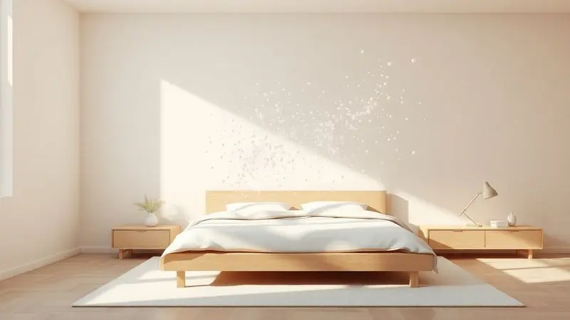

Encontrar o colchão perfeito é o primeiro passo para uma vida mais saudável e produtiva.

Com as constantes inovações na indústria, as tendências de colchões em 2026 prometem elevar o padrão de descanso com o uso de espumas tecnológicas, sistemas de massagem integrados e suporte ortopédico avançado.

Se você está em busca de uma noite de sono revigorante, este guia completo apresenta os melhores modelos do mercado atual e as principais novidades para o próximo ano.

Analisamos as marcas mais confiáveis e as tecnologias de ponta para ajudar você a decidir qual investimento trará o máximo de conforto para o seu dia a dia.

<SummaryList products={frontmatter.top_products} />

## Melhores Colchões de 2026: Tendências e Destaques

Em 2026, a indústria de colchões promete inovações que priorizam conforto e saúde. Materiais sustentáveis, tecnologia de regulação de temperatura e suporte personalizado são algumas das tendências que estão moldando as escolhas dos consumidores.

### 1. Colchão Molas Ensacadas Castor Kingdom

<ProductBox 
  title={frontmatter.top_products[0].title} 
  image={frontmatter.top_products[0].image} 
  link={frontmatter.top_products[0].link} 
/>

Imagine deitar em uma cama onde seus movimentos não acordam ninguém. Essa é a promessa do Castor Kingdom com suas molas ensacadas individualmente, criando zonas de conforto independentes que transformam o compartilhamento da cama em um ato de respeito mútuo.

A firmeza equilibrada oferece suporte enquanto a espuma viscoelástica se molda ao seu corpo, como se memorizasse seus pontos de pressão para aliviá-los.

O segredo do frescor está no tratamento com Aloe Vera no tecido, que transforma a superfície em um lençol terapêutico que acalma a pele.

E quando você pensa que já viu tudo, descobre que o design Double Face duplica a vida útil, como ter dois colchões em um só investimento.

<CaixaProsContras>

**Prós:**

- Tecnologia de molas ensacadas que minimiza a transferência de movimento.

- Conforto adaptável com opções de espuma viscoelástica.

- Tratamento com Aloe Vera que proporciona frescor e benefícios para a pele.

- Design Double Face que prolonga a vida útil do colchão.

**Contras:**

- Garantias variáveis podem gerar incerteza sobre a cobertura.

- O peso suportado por pessoa pode ser visto como uma limitação para alguns biotipos.

</CaixaProsContras>

### 2. Colchão Magnético com Massagem Castor Niponpedic Molas Pocket G. Star

<ProductBox 
  title={frontmatter.top_products[1].title} 
  image={frontmatter.top_products[1].image} 
  link={frontmatter.top_products[1].link} 
/>

Para quem busca transformar o sono em uma sessão de bem-estar, este colchão oferece terapia completa sem sair do quarto.

As molas pocket se adaptam individualmente ao seu corpo, enquanto as pastilhas magnéticas e de infravermelho promovem uma sensação de leveza circulatória que começa na superfície e permeia todo o organismo.

Mas o verdadeiro luxo vem da função de massagem integrada. Com mais de 20 opções, você personaliza seu relaxamento noturno, escolhendo entre vibrações suaves que desfazem a tensão do dia e movimentos mais profundos que preparam seus músculos para o repouso completo.

<CaixaProsContras>

**Prós:**

- Tecnologia de molas pocket proporciona conforto individual.

- Massagem integrada com diversas opções.

- Benefícios potenciais para saúde, como melhora na circulação.

- Materiais de alta qualidade e duráveis.

**Contras:**

- Contraindicado para portadores de marcapasso.

- Pode ser considerado excessivo para quem busca apenas um colchão comum.

</CaixaProsContras>

### 3. Colchão Molas Ensacadas Anjos Impressione

<ProductBox 
  title={frontmatter.top_products[2].title} 
  image={frontmatter.top_products[2].image} 
  link={frontmatter.top_products[2].link} 
/>

Com 42 cm de altura, este colchão não apenas eleva sua cama, mas eleva o conceito de conforto.

As molas ensacadas criam um suporte homogêneo que faz você esquecer que está compartilhando o espaço, enquanto o Euro Pillow adiciona uma camada de maciez que recebe seu corpo como uma nuvem estruturada.

O toque sedoso vem do tratamento com Argan no revestimento, uma experiência tátil que antecipa o relaxamento. Camadas de Visco Gel e Látex trabalham em conjunto para oferecer adaptabilidade inteligente, suportando até 180 kg por pessoa sem perder a suavidade.

<CaixaProsContras>

**Prós:**

- Molas ensacadas que reduzem a transferência de movimento.

- Euro Pillow que adiciona uma camada extra de conforto.

- Revestimento com tratamento de Argan para toque sedoso.

- Suporta até 180 kg por pessoa.

**Contras:**

- O peso do colchão pode dificultar seu manuseio.

- Preço pode ser um pouco elevado para algumas pessoas.

</CaixaProsContras>

### 4. Colchão Magnético com Massagem Anjos Commodite

<ProductBox 
  title={frontmatter.top_products[3].title} 
  image={frontmatter.top_products[3].image} 
  link={frontmatter.top_products[3].link} 
/>

Se você sente que o estresse do dia se acumula nos seus ombros e costas, este colchão oferece uma solução integrada.

O sistema de massagem vibratória trabalha enquanto você descansa, aliviando tensões musculares e melhorando a circulação como uma terapia noturna silenciosa.

A tecnologia magnética promove um aumento natural de oxigênio no sangue, transformando seu sono em um processo de recuperação ativa.

Combinado com o Pillow Top Europeu e espuma viscoelástica, cria um ecossistema de conforto que cuida tanto do seu bem-estar físico quanto da sua saúde circulatória.

<CaixaProsContras>

**Prós:**

- Sistema de massagem que promove relaxamento e alívio de tensões.

- Tecnologia magnética que pode beneficiar a circulação sanguínea.

- Conforto garantido com materiais de qualidade como espuma viscoelástica.

- Tratamentos antiácaro e antifungo no revestimento.

**Contras:**

- Pode ser mais pesado devido à tecnologia que integra.

- A dependência da energia elétrica para funcionamento da massagem.

</CaixaProsContras>

### 5. Colchão com Vibro Massagem Molas Ensacadas Masterpocket Liverpoll Ultra Gel New Euro Pillow - Probel

<ProductBox 
  title={frontmatter.top_products[4].title} 
  image={frontmatter.top_products[4].image} 
  link={frontmatter.top_products[4].link} 
/>

Para quem dorme quente mas não abre mão do conforto, a tecnologia Ultra Gel dissipa o calor mantendo você fresco durante toda a noite.

As molas ensacadas individualmente oferecem suporte ajustado que respeita a movimentação do casal, enquanto a função de vibro massagem controlada remotamente adiciona um toque de spa ao seu ritual noturno.

A firmeza elevada funciona como uma base sólida para quem precisa de suporte extra na coluna, transformando cada noite em uma sessão de alinhamento postural natural.

O tratamento antiácaro e antifungo completa o pacote, criando um ambiente saudável onde o único foco é o sono profundo.

<CaixaProsContras>

**Prós:**

- Molas ensacadas para suporte individualizado.

- Tecnologia Ultra Gel para conforto térmico.

- Função de vibro massagem com controle remoto.

- Tratamento antiácaro e antifungo.

**Contras:**

- Firmeza elevada pode não agradar a todos.

- Pode ser considerado volumoso em comparação a colchões mais finos.

</CaixaProsContras>

### 6. Colchão Molas Ensacadas Herval Selarón C1725

<ProductBox 
  title={frontmatter.top_products[5].title} 
  image={frontmatter.top_products[5].image} 
  link={frontmatter.top_products[5].link} 
/>

A sustentabilidade encontra o conforto neste colchão que usa Ecolátex como material principal, oferecendo uma escolha consciente sem abrir mão da qualidade.

Com 38 cm de altura e capacidade para 170 kg, ele proporciona um suporte robusto que se mantém consistente ano após ano.

As molas ensacadas trabalham em silêncio para minimizar a transferência de movimento, enquanto as camadas de espuma de alta densidade se adaptam ao contorno do seu corpo como uma segunda pele ortopédica.

O revestimento em tecido malha com tratamento antiácaro e antifungo transforma a superfície em um santuário higiênico para seu descanso.

<CaixaProsContras>

**Prós:**

- Molas ensacadas que minimizam o movimento durante o sono.

- Camadas de espuma que se adaptam bem ao corpo.

- Revestimento com tratamento antiácaro e antifungo.

- Material sustentável (Ecolátex) e certificações de qualidade.

**Contras:**

- Não é o modelo mais acessível do mercado.

- A necessidade de girar o colchão periodicamente pode ser um inconveniente para alguns usuários.

</CaixaProsContras>

### 7. Colchão Molas Maxspring Herval Roma C1756 com Massagem

<ProductBox 
  title={frontmatter.top_products[6].title} 
  image={frontmatter.top_products[6].image} 
  link={frontmatter.top_products[6].link} 
/>

O luxo encontra a praticidade neste colchão que elimina a necessidade de virá-lo graças ao Pillow Top One Side, simplificando sua manutenção enquanto oferece conforto premium.

O sistema de massagem embutido permite ajustes personalizados de ritmo e intensidade, transformando seus minutos antes do sono em uma sessão de relaxamento sob medida.

As molas Maxspring criam uma base de suporte uniforme que distribui o peso de forma equilibrada, combinadas com espumas de alta densidade que oferecem firmeza sem rigidez.

O resultado é uma experiência de sono que cuida do seu corpo enquanto simplifica sua rotina de cuidados com o colchão.

<CaixaProsContras>

**Prós:**

- Sistema de massagem ajustável para relaxamento personalizado

- Estrutura de molas Maxspring para conforto uniforme

- Pillow Top One Side para fácil manutenção

- Design moderno e atraente

**Contras:**

- Peso superior a colchões convencionais

- Pode ser mais caro em comparação a modelos básicos

</CaixaProsContras>

### 8. Colchão Molas Ensacadas Ortobom Gold Ultra

<ProductBox 
  title={frontmatter.top_products[7].title} 
  image={frontmatter.top_products[7].image} 
  link={frontmatter.top_products[7].link} 
/>

As molas ensacadas Superpocket criam zonas de conforto independentes que se adaptam à curvatura única do seu corpo, enquanto a espuma Viscogel nas densidades D45 e D60 oferece um equilíbrio perfeito entre adaptabilidade e suporte.

O resultado é uma sensação de flutuação controlada que alivia pontos de pressão sem comprometer a postura.

O revestimento com Malha Belga Super Soft e tratamento antiácaro e antifungo cria uma barreira protetora contra alérgenos, ideal para quem busca noites de respiração livre.

O Pillow Top Europeu adiciona uma camada extra de aconchego que transforma o simples ato de deitar em um ritual de conforto.

<CaixaProsContras>

**Prós:**

- Conforto individualizado com molas ensacadas.

- Camada de espuma Viscogel que se adapta ao corpo.

- Tratamento antiácaro e antifungo.

- Design elegante com revestimento de alta qualidade.

**Contras:**

- O preço pode ser elevado para alguns consumidores.

- Pode ser considerado excessivamente macio por quem prefere firmeza.

</CaixaProsContras>

### 9. Colchão Molas Ensacadas MasterPocket Orthotel Superluxo + Base CRC Suede Clean - Ortobom

<ProductBox 
  title={frontmatter.top_products[8].title} 
  image={frontmatter.top_products[8].image} 
  link={frontmatter.top_products[8].link} 
/>

Este conjunto completo oferece uma experiência de sono estruturada desde a base.

O colchão com molas ensacadas e camada de espuma D33 de alta resiliência promete durabilidade que acompanha seus anos de descanso, enquanto o tratamento com Aloe Vera mantém a superfície livre de ácaros e fungos de forma natural.

A firmeza extra funciona como uma escolha estratégica para quem busca suporte máximo, especialmente útil para quem prefere sensação de estabilidade durante o sono.

A base CRC Suede Clean completa o conjunto com uma montagem simples e estética que transforma seu quarto em um ambiente integrado de descanso.

<CaixaProsContras>

**Prós:**

- Sistema de molas ensacadas que se adapta bem ao corpo.

- Camada de espuma D33, garantindo resistência.

- Tratamento com Aloe Vera, antibacteriano e antiácaro.

- Montagem simples e estética atraente da base.

**Contras:**

- Firmeza extra pode não agradar a todos.

- Pode ser considerado um pouco pesado para movimentar.

</CaixaProsContras>

### 10. Colchão Molas Ensacadas Ortobom Freedom

<ProductBox 
  title={frontmatter.top_products[9].title} 
  image={frontmatter.top_products[9].image} 
  link={frontmatter.top_products[9].link} 
/>

A liberdade de movimento encontra o conforto personalizado neste colchão onde cada mola ensacada trabalha independentemente para se adaptar ao seu contorno específico.

Essa tecnologia minimiza a transferência de movimento de forma tão eficiente que você quase esquece que compartilha a cama.

O pillow top com espuma viscoelástica adiciona uma camada de maciez inteligente que alivia pontos de pressão, enquanto os tratamentos com Aloe Vera e íons de prata no tecido criam uma superfície antimicrobiana que cuida da sua saúde durante o sono.

Disponível em diversos tamanhos, oferece flexibilidade para diferentes espaços e necessidades.

<CaixaProsContras>

**Prós:**

- Molas ensacadas reduzem a transferência de movimento.

- Pillow top oferece maior conforto.

- Tratamentos no tecido melhoram as propriedades antimicrobianas.

- Disponível em diversos tamanhos.

**Contras:**

- Para quem prefere colchões mais firmes, pode parecer um pouco macio.

- A variedade de preços pode ser ampla dependendo da loja.

</CaixaProsContras>

### 11. Castor - Gold Star Vitagel Max

<ProductBox 
  title={frontmatter.top_products[10].title} 
  image={frontmatter.top_products[10].image} 
  link={frontmatter.top_products[10].link} 
/>

A dissipação inteligente de calor através da espuma Fresh Comfort Gel transforma noites abafadas em momentos de frescor constante. O sistema de molas ensacadas Pocket® cria uma adaptação superior ao corpo que parece entender seus movimentos antes mesmo que você os faça.

Com opções de pillow top que variam entre "One Face" e "Euro Pillow", oferece personalização para diferentes preferências de conforto. Disponível em diversos tamanhos, do solteiro ao king size, adapta-se ao seu espaço e às suas necessidades de compartilhamento.

<CaixaProsContras>

**Prós:**

- Tecnologia de molas ensacadas que melhora a adaptabilidade.

- Espuma com gel que ajuda na regulação térmica.

- Disponível em vários tamanhos.

- Variações de pillow top para maior conforto.

**Contras:**

- A garantia dos materiais pode variar conforme o modelo.

- Pode ser considerado um investimento maior, mas a qualidade compensa.

</CaixaProsContras>

### 12. Herval - Poseidon Plus (MasterPocket C1654)

<ProductBox 
  title={frontmatter.top_products[11].title} 
  image={frontmatter.top_products[11].image} 
  link={frontmatter.top_products[11].link} 
/>

O Pillow Top Americano deste colchão recebe seu corpo como um abraço inicial que antecipa o conforto da noite inteira.

As molas ensacadas individualmente trabalham em harmonia para oferecer suporte ideal enquanto minimizam qualquer transferência de movimento, criando ilhas de descanso independentes.

A espuma viscoelástica D45 proporciona um toque suave que se adapta progressivamente ao seu corpo, enquanto o revestimento em malha com tratamento antiácaro mantém o ambiente respirável e saudável.

Com capacidade para até 150 kg, oferece robustez sem sacrificar a suavidade.

<CaixaProsContras>

**Prós:**

- Sistema de molas ensacadas para melhor suporte.

- Camada de espuma viscoelástica para conforto adicional.

- Revestimento em malha com tratamento antiácaro.

- Design elegante e moderno.

**Contras:**

- Não é reversível, exigindo apenas girar.

- Pode não ser ideal para quem prefere colchões mais firmes.

</CaixaProsContras>

### 13. Emma Original – Opção premium

<ProductBox 
  title={frontmatter.top_products[12].title} 
  image={frontmatter.top_products[12].image} 
  link={frontmatter.top_products[12].link} 
/>

A combinação de Airgocell® e espuma de memória cria um acolchoamento que parece conversar com seu corpo, ajustando-se dinamicamente aos seus pontos de pressão.

Com cerca de 25 cm de espessura, oferece conforto suficiente para aliviar tensões enquanto mantém o suporte necessário para o alinhamento postural.

O isolamento de movimento eficiente transforma a cama compartilhada em dois espaços independentes de descanso, onde os movimentos de um não interferem no sono do outro.

O período de teste de 100 noites e 10 anos de garantia demonstram a confiança da marca em oferecer não apenas um produto, mas uma experiência de sono duradoura.

<CaixaProsContras>

**Prós:**

- Excelente adaptação ao corpo, aliviando pontos de pressão.

- Ótimo isolamento de movimento, ideal para casais.

- Materiais de alta qualidade e durabilidade.

- Relação qualidade/preço impressionante.

**Contras:**

- Algumas pessoas podem achar o colchão um pouco firme demais.

- O apoio nas bordas pode ser limitado, causando um afundamento ao sentar.

</CaixaProsContras>

## Quais são as melhores marcas de colchão

Quando você busca confiança em um colchão, certas marcas se tornam referências por entregarem consistentemente qualidade e inovação. A Tempur-Pedic revolucionou o mercado com sua tecnologia de memória que abraça o corpo como uma segunda pele inteligente.

A Sealy domina a arte dos híbridos, combinando a resiliência das molas com o aconchego da espuma em equilíbrio perfeito.

A Simmons, através da linha Beautyrest, transforma a inovação em experiência sensorial, enquanto a Emma conquista pelo custo-benefício que não economiza em conforto.

Cada uma dessas marcas escreveu sua história através de noites bem dormidas, oferecendo caminhos distintos para o mesmo destino: o sono reparador.

## Colchão 2026 e colchão box

Os colchões box representam a evolução prática do descanso em 2026, unindo estrutura sólida e funcionalidade inteligente.

Mais do que uma base, eles atuam como sistemas integrados que distribuem o peso de forma uniforme, promovendo um alinhamento natural da coluna desde o primeiro contato.

A combinação com materiais inovadores como espuma viscoelástica e látex cria uma respirabilidade adaptativa que regula a temperatura enquanto oferece suporte personalizado.

Essa simbiose entre design moderno e funcionalidade transforma o quarto em um espaço organizado onde a limpeza se simplifica e o armazenamento se otimiza.

O resultado é uma experiência de sono que começa na estética do ambiente e termina na qualidade do repouso, oferecendo conforto que se integra harmoniosamente ao seu estilo de vida.

## Diferença entre o tamanho dos colchões

Escolher o tamanho do colchão é como definir os limites do seu território de descanso. O solteiro oferece economia de espaço ideal para quartos compactos ou para quem dorme sozinho, enquanto o casal cria o compartilhamento essencial para a intimidade noturna.

O queen expande essa experiência, oferecendo centímetros extras que transformam o virar na cama em um movimento livre de restrições.

Já o king estabelece um reinado de espaço generoso, perfeito para quem precisa de liberdade total de movimento ou para famílias que compartilham momentos de aconchego.

Além dos tamanhos padrão, as opções personalizadas atendem necessidades específicas, provando que o conforto também se mede pela adequação perfeita ao seu espaço e estilo de vida.

## Qual é o melhor colchão para a coluna?

Se sua coluna pudesse escolher um colchão, ela pediria um parceiro que entendesse sua curvatura natural.

Os modelos com espuma viscoelástica funcionam como um mapa de alívio, adaptando-se aos pontos de pressão e promovendo um alinhamento que começa na superfície e se estende à postura completa.

Os híbridos oferecem o melhor dos dois mundos: a firmeza estrutural das molas combinada com a adaptabilidade reconfortante da espuma.

A chave está na firmeza adequada ao seu peso e posição de dormir, criando uma base que suporta sem pressionar, acolhe sem afundar.

Um colchão que cuida da sua coluna não apenas previne dores, mas transforma cada noite em uma sessão de recuperação postural silenciosa, onde você acorda realinhado física e energeticamente.

## Como escolher entre colchão de molas e de espuma?

Esta escolha define o diálogo entre seu corpo e a superfície onde ele descansa. Os colchões de molas conversam através da firmeza estrutural e da ventilação natural, ideais para quem busca frescor constante durante a noite.

Eles se tornam aliados dos casais ao minimizar a transferência de movimento, criando zonas de independência dentro do compartilhamento.

Já a espuma estabelece uma comunicação mais íntima, moldando-se ao seu contorno como uma impressão tridimensional do seu corpo.

Se você busca alívio personalizado de pontos de pressão e um acolhimento que parece feito sob medida, a espuma oferece esse abraço ortopédico que transforma o sono em uma experiência de reconexão corporal.

## Qual a desvantagem do colchão de mola?

As molas carregam uma história de durabilidade limitada, onde o tempo pode transformar o suporte inicial em desconforto progressivo.

A transferência de movimento se torna um diálogo involuntário entre parceiros, onde cada virar na cama vira uma mensagem sentida do outro lado.

Comparados aos materiais modernos como a espuma viscoelástica, podem oferecer menos eficiência no alívio de pressões específicas.

Ainda assim, sua acessibilidade financeira e a variedade disponível mantêm essas opções relevantes para quem busca uma entrada no mundo do conforto estruturado, lembrando que mesmo na simplicidade existe espaço para noites bem dormidas.

## O que significa a densidade da espuma?

A densidade da espuma é a promessa escrita na física do material: quanto mais alto o número, mais duradoura será a conversa entre seu corpo e o colchão.

Espumas de alta densidade oferecem resistência que se mantém consistente através dos anos, adaptando-se ao seu contorno enquanto mantêm a integridade estrutural.

Essa característica se traduz diretamente em conforto que não desiste com o tempo e suporte que não cede sob pressão.

Escolher a densidade correta é como selecionar o material da fundação do seu descanso, garantindo que o investimento em sono se mantenha firme noite após noite, ano após ano.

## Com que frequência devo trocar meu colchão?

A cada 7 a 10 anos, seu colchão merece uma avaliação honesta sobre sua capacidade de continuar oferecendo o conforto que você merece.

Com o tempo, acumula não apenas ácaros e poeira, mas também a memória do desgaste que pode se manifestar como afundamentos imperceptíveis à primeira vista, mas sentidos pelo seu corpo.

Sinais como dificuldade para encontrar posição confortável, acordar com dores inexplicáveis ou simplesmente a sensação de que o descanso não está mais revigorando são convites para renovar esse espaço fundamental.

Trocar o colchão não é apenas substituir um objeto, é renovar o pacto com seu próprio bem-estar noturno.

## Como Conservar o Colchão Limpo de Maneira Fácil

Conservar seu colchão começa com um protetor que age como um escudo invisível contra manchas e acúmulos. Aspirar mensalmente remove não apenas poeira, mas também microorganismos que se instalam nas fibras, transformando a limpeza em um ritual de saúde.

Derramamentos tratados imediatamente com água morna e sabão neutro impedem que acidentes se tornam marcas permanentes.

O segredo final está na aeração semestral, onde algumas horas em um espaço seco renovam o ar interno e dissipam odores, como se o colchão respirasse fundo antes de retomar seu trabalho noturno.

Esses cuidados simples são a linguagem do respeito com o objeto que guarda um terço da sua vida.

## Quanto custa um bom Colchão?

O preço de um bom colchão reflete o investimento em um terço da sua vida que você passa dormindo.

Modelos com tecnologia avançada como molas ensacadas e espumas adaptativas normalmente ocupam faixas superiores, não por luxo, mas pela complexidade de engenharia que oferece conforto personalizado e durabilidade comprovada.

Essa despesa inicial se transforma em economia de saúde a longo prazo, prevenindo dores posturais e garantindo sono de qualidade que reverbera na sua produtividade diária.

As garantias estendidas que acompanham esses produtos são testemunhos da confiança do fabricante em oferecer não apenas um artigo, mas uma parceria de anos com seu descanso.

## Conclusão

Escolher o colchão ideal é uma jornada que vai além da comparação de especificações técnicas. É sobre encontrar o parceiro noturno que entende seu corpo, respeita seus movimentos e transforma o simples ato de deitar em um ritual de recuperação completa.

As tendências de 2026 mostram que o futuro do descanso une tecnologia inteligente com cuidado personalizado, oferecendo desde terapias magnéticas integradas até regulação térmica adaptativa.

Cada modelo apresentado aqui representa uma filosofia diferente de conforto, desde o suporte firme que alinha sua coluna até o abraço suave que dissolve as tensões do dia.

Seja você um casal em busca de independência de movimento, alguém com necessidades específicas de suporte ou apenas uma pessoa que valoriza noites verdadeiramente revigorantes, existe um colchão que fala sua língua do conforto.

Lembre-se que este investimento acompanhará suas noites pelos próximos anos, influenciando não apenas a qualidade do seu sono, mas sua energia diária, sua postura e seu bem-estar geral.

A decisão final deve equilibrar suas necessidades físicas, seu orçamento e a promessa de um despertar renovado, dia após dia. Seu próximo colchão não é apenas um móvel, é a fundação do seu descanso.