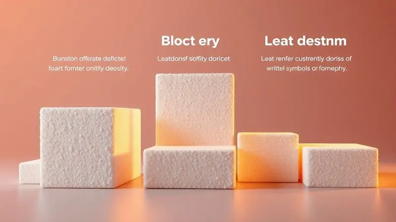
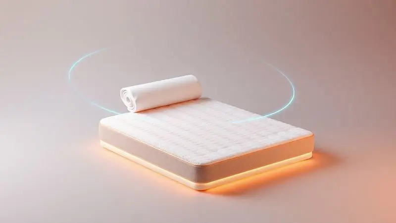
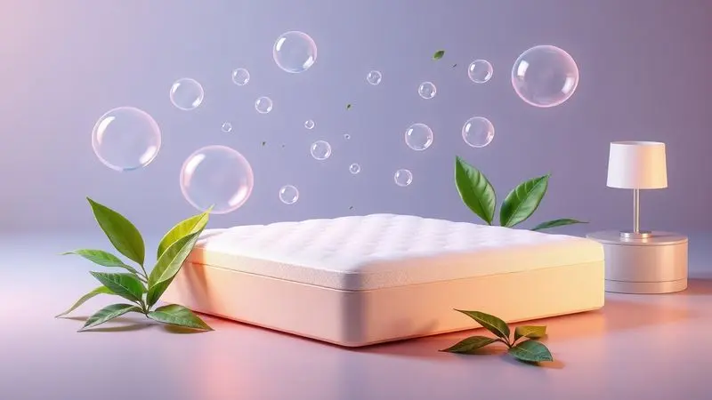
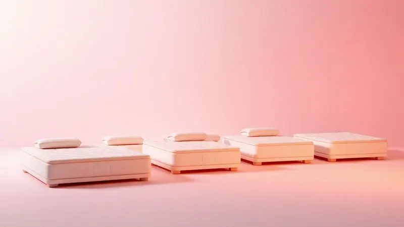

Encontrar o colchão certo vai além de simplesmente comprar um produto. É sobre transformar suas noites e acordar verdadeiramente renovado.

Imagine a sensação de deitar em uma superfície que parece ter sido moldada exatamente para seu corpo, onde as dores desaparecem e cada movimento é um convite ao relaxamento profundo.

Neste guia completo, vamos juntos explorar os 12 colchões que podem fazer essa experiência se tornar realidade em 2025.

Seja você alguém que precisa de um suporte firme para a coluna ou busca o abraço macio de uma noite de sono tranquila, preparamos um ranking minucioso para ajudar você a encontrar seu parceiro perfeito de descanso.

<SummaryList products={frontmatter.top_products} />

## Quais os 12 melhores colchões de espuma para comprar em 2025

Antes de mergulharmos nas opções, lembre-se que o melhor colchão é aquele que dialoga com seu corpo, respeitando suas necessidades únicas. Essas doze escolhas representam diferentes conversas sobre conforto, suporte e bem-estar.

### 1. Colchão Castor Black e White AIR

<ProductBox 
  title={frontmatter.top_products[0].title} 
  image={frontmatter.top_products[0].image} 
  link={frontmatter.top_products[0].link} 
/>

Imagine poder escolher entre dois níveis de aconchego em um só produto. O Castor Black e White AIR oferece exatamente isso com sua tecnologia "Double Face", permitindo que você inverta o colchão e descubra uma nova sensação quando quiser.

Disponível nas densidades D33 e D45, ele se adapta às suas mudanças de preferência ao longo dos anos, como se estivesse sempre renovando seu compromisso com seu descanso.

A malha 3D no revestimento trabalha silenciosamente durante a noite para que você nunca precise pensar em umidade ou calor, apenas em relaxar.

Se você precisa de um suporte mais robusto para suas costas, essa firmeza extra se transforma em uma sensação de segurança, como se sua coluna estivesse sendo cuidadosamente sustentada.

<CaixaProsContras>

**Prós:**

- Tecnologia Double Face que aumenta a durabilidade.

- Opções de densidade (D33 e D45) que atendem diferentes preferências.

- Malha 3D que auxilia na ventilação e controle de umidade.

- Conforto firme, ideal para suporte da coluna.

**Contras:**

- Pode ser considerado firme demais para quem prefere colchões mais macios.

- Algumas variações podem ser menos acessíveis online.

</CaixaProsContras>

### 2. Colchão Castor SR Victory

<ProductBox 
  title={frontmatter.top_products[1].title} 
  image={frontmatter.top_products[1].image} 
  link={frontmatter.top_products[1].link} 
/>

Para quem compartilha a cama, acordar com cada movimento do parceiro pode parecer uma dança noturna indesejada.

O Castor SR Victory traz a elegância das Olimpíadas de Tóquio para seu quarto com um sistema de molas ensacadas individualmente que funciona como um protocolo diplomático para o sono: cada pessoa mantém seu território de conforto sem invadir o do outro.

Desenvolvido em parceria com a DOW®, ele combina a firmeza anatômica com o toque acolhedor das espumas D28 e D18, enquanto o revestimento "easy breathing" garante que o único calor que você sentirá seja o do cobertor, não do colchão.

Pense nele como um investimento que protege tanto seu descanso quanto seu relacionamento.

<CaixaProsContras>

**Prós:**

- Sistema de molas ensacadas que proporciona suporte anatômico.

- Revestimento ventilado para conforto térmico.

- Várias opções de tamanhos disponíveis.

- Garantia estendida em diversos componentes.

**Contras:**

- Suporte máximo de peso pode limitar alguns usuários.

- Pode não ser ideal para quem prefere colchões muito macios.

</CaixaProsContras>

### 3. Colchão Castor Sleep Max

<ProductBox 
  title={frontmatter.top_products[2].title} 
  image={frontmatter.top_products[2].image} 
  link={frontmatter.top_products[2].link} 
/>

Você já se perguntou como seria dormir em uma superfície que parece conhecer seus pontos de tensão?

O Castor Sleep Max oferece essa experiência personalizada através de diferentes densidades de espuma (D28, D33 e D45) que funcionam como um menu de conforto: escolha o nível de suporte que seu corpo pede hoje.

Muitos modelos trazem a flexibilidade do design "Double Face", prolongando a vida útil como se o tempo não passasse sobre ele.

E para aqueles que desejam dormir com tranquilidade absoluta, o tratamento antiácaro e antifungo cria uma barreira invisível de proteção, enquanto certificações como ISO 9001 e selo INMETRO garantem que essa paz vem com padrões rigorosos de qualidade.

<CaixaProsContras>

**Prós:**

- Diversidade de densidades para diferentes perfis de usuário.

- Design "Double Face" para maior durabilidade.

- Tratamento antiácaro e antifungo para higiene.

- Certificações que garantem qualidade e segurança.

**Contras:**

- A firmeza pode não ser ideal para quem prefere colchões mais macios.

- Disponibilidade de tamanhos dependendo da loja.

</CaixaProsContras>

### 4. Colchão Orthocrin Royal Saúde Plus

<ProductBox 
  title={frontmatter.top_products[3].title} 
  image={frontmatter.top_products[3].image} 
  link={frontmatter.top_products[3].link} 
/>

Se sua coluna pudesse falar, ela pediria por um aliado noturno que compreende sua necessidade de alinhamento perfeito. O Orthocrin Royal Saúde Plus responde a esse chamado com uma construção que prioriza a saúde postural através das densidades D33 e D45.

A espuma Pro Espuma garante pureza, livre de materiais indesejados, enquanto o tecido em Jacquard com fio de bambu natural proporciona uma sensação de frescor que parece acariciar sua pele.

Imagine deitar em uma superfície que não apenas suporta seu corpo, mas também o protege de alergias e ácaros, criando um santuário noturno onde sua única preocupação deve ser sonhar.

<CaixaProsContras>

**Prós:**

- Boa durabilidade com materiais de alta qualidade.

- Suporte firme ideal para alinhamento da coluna.

- Tecido em bambu natural que traz frescor e maciez.

- Propriedades antialérgicas e antiácaro para um sono saudável.

**Contras:**

- O colchão pode ser considerado firme demais para quem prefere uma sensação mais macia.

- Algumas versões podem não ser as mais acessíveis em comparação a outras marcas.

</CaixaProsContras>

### 5. Colchão Probel Guarda Costas

<ProductBox 
  title={frontmatter.top_products[4].title} 
  image={frontmatter.top_products[4].image} 
  link={frontmatter.top_products[4].link} 
/>

Às vezes, o que precisamos é de um guardião noturno que conhece todos os segredos do conforto brasileiro.

O Probel Guarda Costas acumula anos de experiência popular em diferentes densidades (D23, D33 e D45) que se adaptam como um bom par de sapatos: quanto mais você usa, mais personalizado fica.

Para quem busca um abraço extra, as opções com Pillow Top adicionam uma camada de aconchego que parece um acolhimento gentil.

Com capacidade para suportar até 150 kg por pessoa e muitos modelos dupla face, ele oferece a robustez de um companheiro leal que promete estar ali noite após noite, ano após ano.

<CaixaProsContras>

**Prós:**

- Conforto personalizável com diferentes níveis de firmeza

- Suporte de peso robusto, ideal para diversas necessidades

- Muitos modelos possuem tecnologia de molas ensacadas

- Durabilidade garantida com opções dupla face

**Contras:**

- Algumas variações podem ter capacidade de peso reduzida

- O número de opções pode ser confuso na hora da compra

</CaixaProsContras>

### 6. Colchão Ortobom Airtech 150

<ProductBox 
  title={frontmatter.top_products[5].title} 
  image={frontmatter.top_products[5].image} 
  link={frontmatter.top_products[5].link} 
/>

Respirar bem durante o sono não se trata apenas dos pulmões, mas também do colchão que permite ao seu corpo "respirar" conforto.

O Ortobom Airtech 150 utiliza espuma D45 de alta densidade para oferecer um suporte que parece um alicerce seguro, especialmente projetado para quem precisa de maior capacidade de carga (até 140 kg por pessoa).

A tecnologia Airtech funciona como um sistema de ventilação pessoal, mantendo a superfície fresca mesmo nas noites mais quentes.

Combine isso com o tratamento antiácaro e antifungo, e você terá não apenas um lugar para dormir, mas um ambiente cuidadosamente preparado para sua saúde noturna.

<CaixaProsContras>

**Prós:**

- Confeccionado com espuma D45 de alta densidade.

- Tecnologia Airtech para melhor respirabilidade.

- Tratamento antiácaro e antifungo.

- Boa capacidade de suporte de peso.

**Contras:**

- Diversas opções podem dificultar a escolha ideal.

- Alguns modelos podem ter preços mais altos em comparação a concorrentes.

</CaixaProsContras>

### 7. Colchão Probel ProDormir Plus Black

<ProductBox 
  title={frontmatter.top_products[6].title} 
  image={frontmatter.top_products[6].image} 
  link={frontmatter.top_products[6].link} 
/>

Para quem dorme de lado, a noite pode se transformar em uma busca constante por uma posição que não sobrecarregue ombros e quadris. O Probel ProDormir Plus Black entende essa jornada, oferecendo um equilíbrio calculado entre maciez e suporte através das molas Prolastic.

Com capacidade para até 120 kg, ele se adapta à pressão do seu corpo como um parceiro de dança experiente, guiando seus movimentos sem tropeços.

O tratamento antiácaro, antifungo e antialérgico funciona como um escudo invisível, permitindo que você se concentre apenas no sono, não em possíveis reações alérgicas.

E para casais, a redução na transferência de movimento significa que vocês podem dormir juntos, mas sonhar separadamente.

<CaixaProsContras>

**Prós:**

- Conforto firme ideal para suporte ortopédico.

- Tratamento antiácaro e antifungo, ótimo para alérgicos.

- Excelente adaptação à pressão do corpo.

- Não transfere movimentos, ótimo para casais.

**Contras:**

- Pode ser um pouco mais pesado, dificultando a movimentação.

- Algumas mudanças nas especificações podem ocorrer conforme o lote.

</CaixaProsContras>

### 8. Colchão Paropas Resiste Double Face

<ProductBox 
  title={frontmatter.top_products[7].title} 
  image={frontmatter.top_products[7].image} 
  link={frontmatter.top_products[7].link} 
/>

Algumas situações demandam resistência digna de hotéis: visita frequente de parentes, crianças que transformam a cama em playground, ou simplesmente a vontade de investir em algo que realmente dure.

O Paropas Resiste Double Face atende a essa demanda com espuma D45 que suporta até 200 kg por pessoa, uma verdadeira fortaleza de descanso.

O design double face funciona como ter dois colchões pelo preço de um, enquanto o pillow top europeu adiciona uma camada de luxo acessível. Sim, como qualquer produto robusto, ele requer cuidados, mas quando tratado com respeito, oferece anos de serviço leal.

<CaixaProsContras>

**Prós:**

- Construção com espuma D45 para firmeza e resistência

- Design double face que prolonga a vida útil

- Camada de pillow top para maior conforto

- Tratamento antiácaro e antifungo para um ambiente mais seguro

**Contras:**

- Relatos de deformação e descostura em uso contínuo

- Requer cuidados especiais na manutenção para evitar problemas

</CaixaProsContras>

### 9. Colchão Probel ProDormir Advanced

<ProductBox 
  title={frontmatter.top_products[8].title} 
  image={frontmatter.top_products[8].image} 
  link={frontmatter.top_products[8].link} 
/>

Escolher a firmeza perfeita não precisa ser um jogo de adivinhação. O Probel ProDormir Advanced apresenta suas opções de densidade (D20, D23, D28 e D33) como um cardápio de conforto, onde você pode selecionar exatamente o que seu corpo pede.

Para adultos que buscam suporte adequado, as versões D28 e D33 suportam até 110 kg por pessoa, funcionando como uma base confiável para suas noites.

O tratamento antialérgico e antiácaro transforma o simples ato de deitar em uma declaração de cuidado com sua saúde, enquanto as variadas alturas e dimensões garantem que ele se encaixe perfeitamente no seu espaço e no seu estilo de vida.

<CaixaProsContras>

**Prós:**

- Disponibilidade em várias densidades para atender diferentes preferências.

- Tratamento antialérgico e antiácaro.

- Boa capacidade de suporte de peso.

- Opções variadas de tamanhos e alturas.

**Contras:**

- Alguns modelos não possuem pillow top ou outros atributos avançados.

- A variedade de opções pode ser confusa para quem não sabe qual densidade escolher.

</CaixaProsContras>

### 10. Colchão Emma Basics D28

<ProductBox 
  title={frontmatter.top_products[9].title} 
  image={frontmatter.top_products[9].image} 
  link={frontmatter.top_products[9].link} 
/>

E se você descobrisse que acessibilidade não precisa significar comprometer qualidade? O Emma Basics D28 prova esse ponto com uma proposta simples mas eficaz: firmeza D28 que promove postura correta sem sacrificar o conforto.

Muitos usuários relatam a experiência surpreendente de um colchão que se molda levemente ao corpo, como se estivesse aprendendo seus contornos a cada noite.

O tratamento hipoalergênico e antiácaro oferece tranquilidade, enquanto a garantia de 5 anos com 100 noites de teste funciona como um aperto de mãos honesto da marca: "Experimente, temos confiança de que você vai amar".

<CaixaProsContras>

**Prós:**

- Boa firmeza que ajuda na postura.

- Conforto que se adapta ao corpo sem afundar.

- Tratamento hipoalergênico e antiácaro.

- Garantia de 5 anos com 100 noites de teste.

**Contras:**

- Modelo mais básico comparado a outras opções da Emma.

- Pode não agradar quem prefere colchões mais macios.

</CaixaProsContras>

### 11. Colchão Casal BF Colchões D45 Extra Firme

<ProductBox 
  title={frontmatter.top_products[10].title} 
  image={frontmatter.top_products[10].image} 
  link={frontmatter.top_products[10].link} 
/>

Para algumas pessoas, firmeza não é apenas uma preferência, é uma necessidade médica. O Casal BF Colchões D45 Extra Firme atende a essa demanda com uma construção ortopédica que funciona como um terapeuta noturno para sua coluna.

Com capacidade para até 150 kg por pessoa e espuma D45 certificada, ele oferece o suporte robusto que muitos buscam para alívio de dores. O tecido em poliéster tratado hipoalergenicamente adiciona uma camada de proteção para alérgicos, criando um ambiente seguro.

É verdade que para pessoas mais leves (entre 50 a 80 kg) essa firmeza pode parecer excessiva, mas para quem precisa dela, é como encontrar finalmente o alicerce que faltava.

<CaixaProsContras>

**Prós:**

- Altamente firme, ideal para suporte ortopédico.

- Feito com espuma D45, proporcionando durabilidade.

- Tecido hipoalergênico, bom para alérgicos.

- Suporta até 150 kg por pessoa.

**Contras:**

- Pode ser muito firme para pessoas com peso abaixo de 80 kg.

- A sensação de firmeza pode não agradar a todos os usuários.

</CaixaProsContras>

### 12. Colchão Fort Casal D33

<ProductBox 
  title={frontmatter.top_products[11].title} 
  image={frontmatter.top_products[11].image} 
  link={frontmatter.top_products[11].link} 
/>

O equilíbrio perfeito entre firmeza e conforto muitas vezes parece um mito, até você conhecer o Fort Casal D33. Com densidade D33 e capacidade para suportar até 150 kg por pessoa, ele oferece a robustez necessária sem sacrificar o aconchego.

Suas dimensões generosas (138x188 cm) proporcionam espaço para respirar e se mover, enquanto a espuma de poliuretano de alta qualidade trabalha para distribuir seu peso uniformemente.

O revestimento em poliéster bordado não apenas embeleza seu quarto, mas muitas vezes inclui tratamentos antiácaro e antialérgico que transformam o sono em um ritual de autocuidado.

<CaixaProsContras>

**Prós:**

- Alta durabilidade e resistência.

- Boa relação custo-benefício.

- Conforto equilibrado entre firmeza e maciez.

- Opções com tratamentos antiácaro e antialérgico.

**Contras:**

- Pode ser um pouco firme para quem prefere colchões mais macios.

- Altura pode variar entre modelos, o que pode não agradar a todos.

</CaixaProsContras>

## Saiba tudo sobre colchões de espuma

Agora que você conhece os principais candidatos a melhorar suas noites, vamos entender o que faz dos colchões de espuma aliados tão poderosos do descanso.

Mais do que simples superfícies para dormir, eles são parceiros que se adaptam ao seu corpo, aliviando pontos de pressão e convidando você a um relaxamento profundo.

De viscoelástica a látex, cada tipo de espuma conta uma história diferente sobre conforto, e compreender essa linguagem é a chave para fazer a escolha certa.

### Melhores Marcas de Colchão de Espuma

Confiar em uma marca é como escolher um guia para sua jornada noturna. A Tempur-Pedic revolucionou o mercado com sua espuma viscoelástica que parece ter memória do seu corpo. A Nectar conquistou corações com garantias generosas que falam mais alto que qualquer slogan.

Zinus e Emma mostram que inovação e custo-benefício podem dançar juntos, enquanto a Simmons mantém uma tradição de durabilidade que atravessa gerações. Cada uma traz uma filosofia única sobre o que significa verdadeiramente descansar.

## Como Escolher a Densidade Certa para Você

Escolher a densidade do seu colchão é como sintonizar um instrumento musical: quando está no tom certo, tudo soa harmonioso. Em geral, densidades maiores oferecem mais suporte e durabilidade, como um abraço firme que promete estar ali amanhã.

Densidades menores trazem maciez que convida ao afundamento suave, como um convite para esquecer o mundo. Sua escolha depende do diálogo entre seu peso, suas preferências pessoais e as histórias que seu corpo conta todas as manhãs.

### Tabela de Adequação de Densidade de Colchão de Espuma

Pense na densidade como um tradutor entre seu corpo e o conforto. Colchões com densidade entre 20 a 28 kg/m³ são como conversas suaves com pessoas mais leves, oferecendo suporte sem rigidez.

Acima de 30 kg/m³, a conversa se torna mais estruturada, ideal para indivíduos que precisam de firmeza para sentir-se sustentados.

Sua posição de sono também dita o ritmo dessa conversa: quem dorme de lado pode preferir densidade média para acolher ombros e quadris, enquanto quem dorme de costas busca a clareza de um suporte mais definido.

### D28 vs D33 vs D45: Qual Firmeza é a Ideal?

Imagine que D28, D33 e D45 são três tipos diferentes de abraço noturno. O D28 é o abraço macio que envolve sem apertar, perfeito para quem gosta de sentir-se aconchegado ou possui peso mais leve.

O D33 é o abraço equilibrado que suporta sem sufocar, uma escolha versátil que agrada à maioria. O D45 é o abraço firme que segura com segurança, especialmente valioso para quem enfrenta dores nas costas e precisa de apoio extra.

Seu peso, preferências pessoais e necessidades específicas serão os melhores conselheiros nessa decisão.

## Colchão a Vácuo: Praticidade na Entrega e Montagem

Lembra daquela vez que quase desistiu de comprar um colchão só de imaginar como faria para subir as escadas? Os colchões a vácuo chegaram para transformar essa história.

Comprimidos em embalagens compactas, eles viajam até sua casa como mensageiros discretos, expandindo-se apenas quando chegam ao destino final.

Essa praticidade reduz custos logísticos e protege o produto durante o transporte, mas o verdadeiro segredo está em escolher modelos feitos com materiais de qualidade que garantem que essa magia não seja passageira, mas sim o começo de anos de conforto.

## Tratamentos Antialérgicos: Durma Sem Preocupações

Acordar espirrando ou com coceiras pode roubar a paz de qualquer manhã. Colchões com tratamentos antialérgicos funcionam como guardiões silenciosos que trabalham enquanto você dorme, inibindo ácaros, fungos e bactérias para criar um ambiente de sono saudável.

Muitos modelos oferecem capas removíveis que podem ser lavadas, transformando a manutenção em um ritual simples de autocuidado.

Escolher um colchão antialérgico é mais do que prevenir reações, é garantir que suas únicas preocupações noturnas sejam com os sonhos, não com a saúde.

## Diferença entre o tamanho dos colchões

Escolher o tamanho do colchão é como desenhar os limites do seu território noturno. Solteiro (88x188 cm) oferece espaço suficiente para uma pessoa se movimentar com liberdade. Casal (138x188 cm) cria um campo neutro onde dois corpos podem coexistir confortavelmente.

Queen (158x198 cm) e King (193x203 cm) são declarações de luxo, oferecendo tanto espaço que você pode esquecer que compartilha a cama.

A escolha certa equilibra o conforto pessoal com a harmonia do espaço disponível, criando um refúgio que respeita tanto seu corpo quanto seu ambiente.

## Perguntas Frequentes

Na jornada para encontrar o colchão perfeito, algumas perguntas surgem como faróis que iluminam o caminho. Vamos responder às que mais importam para sua decisão final.

### Qual é o melhor colchão para a coluna?

Se sua coluna pudesse escolher, ela pediria por um parceiro que compreende sua arquitetura única. O melhor colchão para a coluna é aquele que oferece suporte à sua curvatura natural enquanto distribui seu peso como um equilibrista experiente.

Materiais como espuma de memória ou látex adaptam-se ao seu corpo em tempo real, criando um mapa personalizado de conforto. Firmeza média a firme geralmente funciona melhor, mantendo o alinhamento sem rigidez excessiva.

Testar pessoalmente é o segredo, pois apenas seu corpo pode confirmar qual conversa noturna fará mais sentido para suas costas.

## Conclusão

Escolher o colchão ideal é uma das decisões mais pessoais que você pode tomar pelo seu bem-estar. Não se trata apenas de comprar um produto, mas de selecionar o parceiro que acompanhará um terço da sua vida, influenciando suas manhãs, sua energia e sua saúde.

Dos 12 modelos que exploramos, cada um conta uma história diferente sobre conforto, suporte e durabilidade. Alguns prometem firmeza que transforma noites de dor em descanso reparador, outros oferecem aconchego que parece um abraço constante.

Lembre-se que densidades, tratamentos antialérgicos e tecnologias como o vácuo são ferramentas, mas a verdadeira magia acontece quando essas ferramentas se conectam com suas necessidades específicas.

Agora, com essas informações em mãos, você está preparado para transformar sua busca em uma escolha consciente. Escute seu corpo, considere seu espaço e permita-se investir no descanso que você merece. Suas melhores noites estão esperando por você.