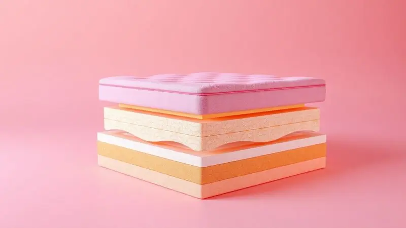
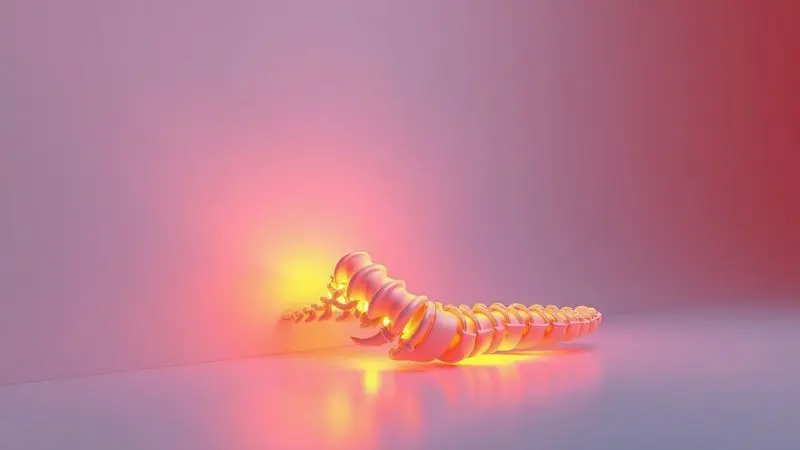

Escolher o colchão certo é o primeiro passo para uma vida sem dores nas costas e noites verdadeiramente reparadoras.

O colchão ortopédico, conhecido por oferecer um suporte mais firme e alinhamento postural, evoluiu muito nos últimos anos, integrando tecnologias de espuma de alta densidade e molas ensacadas.

Se você busca melhorar sua saúde lombar ou simplesmente prefere uma superfície mais estável, este guia completo traz uma análise detalhada das melhores opções de 2025.

Vamos explorar desde modelos tradicionais até as inovações a vácuo, ajudando você a decidir qual investimento vale a pena para o seu bem-estar.

<SummaryList products={frontmatter.top_products} />

## Os 8 Melhores Colchões Ortopédicos para comprar em 2025 [Atualizado]

Em 2025, escolher o colchão ortopédico certo é essencial para garantir uma boa noite de sono e saúde postural. Vamos conferir os melhores modelos disponíveis no mercado para atender às suas necessidades.

### 1. Colchão Casal Firme Espuma D33 Antialérgico

<ProductBox 
  title={frontmatter.top_products[0].title} 
  image={frontmatter.top_products[0].image} 
  link={frontmatter.top_products[0].link} 
/>

Imagine acordar sem aquela rigidez nas costas que parece te acompanhar o dia inteiro. O colchão casal firme com espuma D33 oferece exatamente isso: um suporte sólido.

A densidade de 33 kg/m³ cria uma base confiável para quem pesa entre 71 e 100 kg, mantendo sua coluna perfeitamente alinhada durante toda a noite e dissipando os primeiros sinais de dor.

Mas esse modelo vai além do alívio postural. Ele traz um tratamento antialérgico que atua como um escudo invisível contra ácaros e fungos, transformando seu quarto em um verdadeiro santuário do sono.

Para quem sofre com alergias, significa respirar melhor e acordar mais revigorado. E com a opção dupla face, você tem a durabilidade estendida, quase como ter dois colchões em um. É a escolha clássica que entrega o essencial sem complicações.

<CaixaProsContras>

**Prós:**

- Excelente suporte ortopédico.

- Tratamento antialérgico eficaz.

- Durabilidade destacada, com modelos dupla face.

- Conforto adaptável a diferentes biotipos.

**Contras:**

- Pode ser bastante firme para algumas pessoas.

- Limitação de peso máximo recomendado para uso.

</CaixaProsContras>

### 2. Colchão Queen Luuna Support

<ProductBox 
  title={frontmatter.top_products[1].title} 
  image={frontmatter.top_products[1].image} 
  link={frontmatter.top_products[1].link} 
/>

E se seu colchão soubesse se ajustar ao seu corpo a cada movimento? O Queen Luuna Support tira essa ideia do campo da imaginação. Com firmeza 8/10, ele equilibra estabilidade e acolhimento com sua espuma Active Support, que responde ao seu peso de forma inteligente.

O resultado é um alinhamento que parece feito sob medida, aliviando a pressão nos ombros e na lombar de maneira natural.

Enquanto isso, a tecnologia Air Flow trabalha nos bastidores, criando uma corrente de ar interna que mantém a superfície fresca. Você para de revirar na cama tentando encontrar um ponto mais 'arejado'.

E o melhor: você tem 100 noites para fazer esse teste drive do sono na sua própria casa. Se não se apaixonar, é só devolver.

<CaixaProsContras>

**Prós:**

- Excelente suporte ortopédico que alivia dores nas costas.

- Tecnologia de adaptação ao corpo para maior conforto.

- Capa lavável e acabamento premium.

- Oferece 100 noites de teste e 10 anos de garantia.

**Contras:**

- Altura do colchão pode ser considerada baixa por alguns.

- Conforto pode variar conforme o biotipo do usuário.

</CaixaProsContras>

### 3. Colchão Casal de espuma D28 Emma Basics

<ProductBox 
  title={frontmatter.top_products[2].title} 
  image={frontmatter.top_products[2].image} 
  link={frontmatter.top_products[2].link} 
/>

Quando o objetivo é um investimento certeiro e sem surpresas, o Emma Basics é o parceiro ideal. Sua espuma D28 de 17 cm de altura oferece aquele suporte firme que você procura, especialmente se tem peso médio e prefere uma cama que não 'afunda' no meio da noite.

Por baixo desse conforto seguro, uma capa hipoalergênica trabalha silenciosamente, mantendo ácaros e alérgenos bem longe do seu espaço de descanso. E a marca coloca a mão no fogo pelo produto: 5 anos de garantia e 100 noites de teste.

É a segurança de saber que, mesmo após a compra, você tem uma rede de apoio se algo não sair exatamente como planejou.

<CaixaProsContras>

**Prós:**

- Tecnologia alemã que garante conforto e suporte adequado.

- Hipoalergênico e antiácaros para um sono mais saudável.

- Durabilidade garantida com 5 anos de garantia.

- Período de teste de 100 noites para garantir satisfação.

**Contras:**

- A densidade D28 pode não ser ideal para pessoas acima de 80 kg.

- Não possui recursos avançados como outros modelos da linha Emma.

</CaixaProsContras>

### 4. Colchão Queen Ortopédico a Vácuo Premium

<ProductBox 
  title={frontmatter.top_products[3].title} 
  image={frontmatter.top_products[3].image} 
  link={frontmatter.top_products[3].link} 
/>

A revolução do conforto que chega em uma caixa. Esse colchão queen ortopédico a vácuo elimina a maior dor de cabeça da troca de colchão: o transporte. Ele vem compactado, facilitando o manuseio por escadas e portas estreitas.

Mas não se engane pela praticidade; dentro da embalagem está uma espuma projetada para aliviar pontos de pressão e abraçar a curvatura natural da sua coluna.

Disponível em densidades como D33 ou D45, ele permite que você escolha a firmeza exata que seu corpo pede.

É o equilíbrio perfeito entre tecnologia de entrega e desempenho ortopédico, com um revestimento hipoalergênico que zela pela qualidade do seu sono todas as noites.

<CaixaProsContras>

**Prós:**

- Excelente suporte ortopédico para a coluna.

- Conforto intermediário-firme, ideal para diferentes perfis de sono.

- Embalagem a vácuo facilita o transporte e manuseio.

- Revestimento hipoalergênico que proporciona um ambiente saudável.

**Contras:**

- Pode ser considerado mais caro em comparação com colchões básicos.

- O nível de firmeza pode não agradar a todos os gostos.

</CaixaProsContras>

### 5. Colchão Casal Premium Molas Ensacadas

<ProductBox 
  title={frontmatter.top_products[4].title} 
  image={frontmatter.top_products[4].image} 
  link={frontmatter.top_products[4].link} 
/>

Você já deu um pulo na cama e viu seu parceiro levantar no susto? As molas ensacadas desse colchão premium foram projetadas para acabar com isso. Cada mola age de forma independente, isolando os movimentos.

Enquanto um se vira, o outro continua imerso no próprio sono, sem perturbações.

É a tecnologia ideal para casais com ritmos diferentes, combinada com uma densidade de espuma (D33 a D45) que promove firmeza sem sacrificar o aconchego.

Muitos modelos ainda incluem um pillow top, uma camada extra de maciez que recebe seu corpo como um abraço, aliviando os pontos de tensão nos quadris e ombros.

<CaixaProsContras>

**Prós:**

- Molas ensacadas que oferecem independência de movimentos.

- Disponível em diferentes densidades de espuma para atender preferências variadas.

- Muitas opções com pillow top para maior conforto.

- Suporte de peso adequado para casais.

**Contras:**

- Pode ter um preço mais alto em comparação a colchões mais simples.

- A alta densidade pode ser muito firme para quem prefere modelos mais macios.

</CaixaProsContras>

### 6. Colchão Queen Emma Duo Comfort

<ProductBox 
  title={frontmatter.top_products[5].title} 
  image={frontmatter.top_products[5].image} 
  link={frontmatter.top_products[5].link} 
/>

E quando duas pessoas dividem a cama, mas não dividem a mesma opinião sobre firmeza? O Emma Duo Comfort resolve esse dilema doméstico com uma engenhoca simples e brilhante: a tecnologia Dupla Face 2 em 1. Um lado é mais macio; o outro, mais firme.

Cada um escolhe o seu e vira o colchão no seu canto. Fim da discussão.

Ele suporta até 260 kg, garantindo robustez, e sua capa removível e lavável torna a manutenção da higiene uma tarefa simples. É a solução prática para casais que valorizam o conforto individual sem abrir mão de compartilhar o mesmo espaço.

<CaixaProsContras>

**Prós:**

- Tecnologia "Dupla Face 2 em 1" para diferentes níveis de conforto.

- Capa removível e hipoalergênica.

- Suporte robusto, aguentando até 260 kg.

- Boa relação custo-benefício em comparação a modelos similares.

**Contras:**

- Pode não atender quem prefere um único nível de firmeza.

- Design simples, sem recursos adicionais sofisticados.

</CaixaProsContras>

### 7. Luuna Essential Casal Extra Firme e Ortopédico

<ProductBox 
  title={frontmatter.top_products[6].title} 
  image={frontmatter.top_products[6].image} 
  link={frontmatter.top_products[6].link} 
/>

Para quem não negocia quando o assunto é firmeza, o Luuna Essential é a resposta definitiva. Com classificação 9/10, ele é praticamente uma tábua aconchegante.

Essa solidez proporciona um suporte inabalável para a coluna, ideal para quem dorme de costas ou barriga e sente que colchões comuns 'cedem demais'.

A espuma D28 de alta densidade garante que essa firmeza será duradoura. E a tecnologia Aircell® cuida para que, mesmo com tanta estabilidade, o calor não se acumule, mantendo uma ventilação consistente.

São 100 noites para você confirmar se essa é, de fato, a base sólida que seu corpo precisa para descansar de verdade.

<CaixaProsContras>

**Prós:**

- Excelente suporte ortopédico.

- Firmeza extra, ideal para quem prefere colchões duros.

- Tecnologia Aircell® melhora a ventilação.

- Garantia de 36 meses e teste de 100 noites.

**Contras:**

- Pode ser muito firme para algumas pessoas.

- Não é hipoalergênico.

</CaixaProsContras>

### 8. Ortobom Conjugado Union Solteiro Ortopedic

<ProductBox 
  title={frontmatter.top_products[7].title} 
  image={frontmatter.top_products[7].image} 
  link={frontmatter.top_products[7].link} 
/>

Nem todo mundo precisa de um colchão queen. Para quem dorme sozinho e valoriza o espaço do próprio quarto, o Ortobom Union oferece uma solução focada e eficiente.

Sua construção com espuma D28 e base de madeira Eucalipto Domus cria uma plataforma firme que respeita o alinhamento da sua coluna, noite após noite.

O tratamento antialérgico é outro trunfo, assegurando que seu cantinho do sono esteja sempre protegido. Disponível em medidas variadas, ele se adapta a diferentes ambientes, provando que qualidade ortopédica não é exclusividade dos modelos grandes.

<CaixaProsContras>

**Prós:**

- Conforto firme que promove bom alinhamento da coluna.

- Tratamento antialérgico e antiácaro.

- Estrutura resistente em madeira Eucalipto Domus.

- Diversas opções de medidas, adaptando-se a vários ambientes.

**Contras:**

- Suporte máximo pode não ser ideal para pessoas muito pesadas.

- Garantia de apenas 3 meses pode ser considerada curta.

</CaixaProsContras>

## O que é um colchão ortopédico?

Mais do que um simples colchão, trata-se de uma ferramenta para a saúde. Um colchão ortopédico é projetado para fazer o que seu corpo espera, mas nem sempre recebe: suporte adequado.

Ele atua como um alinhador postural passivo, distribuindo seu peso de forma inteligente para aliviar os pontos de pressão nos ombros, quadris e lombar. Utilizando materiais como espuma viscoelástica ou látex, ele se molda às suas curvas, não o contrário. O resultado?

Um sono que não apenas descansa, mas também corrige. É o primeiro passo para acordar sem aquela sensação de que passou a noite em uma batalha.

## Benefícios de usar um colchão ortopédico

Acordar livre da dor não é luxo, é necessidade. E é exatamente isso que um bom colchão ortopédico entrega.

Pense nele como um investimento direto no seu bem-estar diário: ele promove o alinhamento correto da coluna, reduzindo gradualmente as dores nas costas e no pescoço que você talvez já tenha aceitado como normais.

A variedade de níveis de firmeza significa que você não precisa se adaptar a um padrão. O colchão se adapta a você. E com materiais de alta qualidade, essa parceria é duradoura. São anos de noites tranquilas, de descanso profundo, de energia renovada pela manhã.

Em última análise, escolher um colchão ortopédico é escolher acordar melhor todos os dias.

## Melhor colchão ortopédico para coluna

Qual é o melhor colchão para a sua coluna? A resposta está na combinação de três elementos: firmeza que sustenta, materiais que duram e a capacidade de aliviar a pressão exatamente onde dói.

Não existe uma fórmula única, mas sim um equilíbrio que deve atender às necessidades específicas do seu corpo e do seu modo de dormir.

### Selo ICA: a chancela da qualidade

Diante de tantas opções, como ter certeza de que está levando um produto realmente bom para casa? O Selo ICA (Instituto de Certificação e Acreditação) serve como esse farol de confiança. Ele não é concedido por acaso.

Para obtê-lo, o colchão passa por testes rigorosos que medem sua resistência, conforto e, principalmente, sua capacidade de oferecer suporte adequado.

Escolher um modelo com esse selo é simplificar a decisão. É saber que especialistas já validaram a qualidade do produto, garantindo que ele cumprirá a promessa de um sono saudável. É um atalho seguro em um mar de informações.

## Firmeza e Densidade: Como Escolher a Espuma Certa?

A espuma é a alma do colchão, e entender sua densidade é a chave para não errar. Pense na firmeza como o nível de apoio: se você dorme de costas ou de bruços, precisa de uma base mais sólida para evitar que a lombar afunde.

Se dorme de lado, um toque mais gentil nos ombros e quadris faz toda diferença para a circulação.

Já a densidade fala sobre durabilidade. Uma espuma de alta densidade (como D33 ou superior) não só oferece suporte consistente, como também resiste ao desgaste do tempo, mantendo suas propriedades por anos. A dica de ouro? Sempre que possível, teste.

Sinta como seu corpo responde ao diferente apoio. Esse teste prático é o mapa mais confiável para encontrar o seu ponto ideal de conforto.

## Garantia e Período de Teste: O Que Considerar

Imagine comprar um sofá sem sentar nele. Parece absurdo, não? Com um colchão, a lógica é a mesma. O período de teste, que varia de 30 a 100 noites, é seu direito de experimentar o produto na rotina real.

É o tempo necessário para o seu corpo se adaptar e para você perceber se aquele realmente é o suporte dos seus sonhos.

A garantia, por sua vez, é o termômetro da confiança do fabricante. Entre 5 e 10 anos, ela sinaliza uma aposta na durabilidade do material. Priorize marcas que ofereçam políticas transparentes de devolução durante o teste.

Essa segurança transforma uma compra de alto valor em uma decisão tranquila, sem medo de arrependimento.

## Dicas práticas para prolongar a vida útil do seu colchão ortopédico

Um colchão de qualidade é um investimento. E como todo bom investimento, merece cuidados. Comece protegendo-o com uma capa específica. Ela age como uma barreira contra suor, manchas e poeira, mantendo o núcleo do colchão intacto.

A cada três meses, vire-o (de cabeceira para os pés e vice-versa). Esse simples hábito garante um desgaste uniforme, prevenindo que o corpo forme aquela depressão indesejada no meio da cama.

Evite pula-pula ou sentar-se abruptamente nas bordas, para não sobrecarregar as molas ou a espuma.

E não subestime a limpeza: aspirar a superfície e arejar o ambiente regularmente afasta a umidade e os ácaros, prolongando significativamente a vida útil do seu parceiro de sono.

## Perguntas Frequentes

As dúvidas são naturais quando o assunto é um investimento para anos. Quanto tempo dura um colchão ortopédico? Em média, de 8 a 10 anos, mas esse prazo pode se estender com os cuidados certos. E a firmeza? Ela é subjetiva.

O que é confortável para uma pessoa pode ser muito rígido para outra, por isso o período de teste é tão valioso. Por fim, e a ventilação?

Modelos com tecnologias de fluxo de ar garantem que o calor não fique retido, proporcionando uma temperatura constante e agradável durante toda a noite, essencial para um sono profundo e ininterrupto.

## Conclusão

Escolher seu colchão ortopédico é, acima de tudo, uma escolha por você. Pelas manhãs mais leves, pelas dores que deixam de existir, pelo descanso que realmente renova.

Dos tradicionais de espuma D33 aos inovadores com tecnologia dupla face ou a vácuo, cada modelo deste guia oferece um caminho diferente para o mesmo destino: uma vida noturna melhor.

Lembre-se de que seu peso, sua posição para dormir e suas necessidades pessoais de conforto são a bússola. Use as informações sobre densidade, firmeza, garantias e períodos de teste a seu favor. São elas que transformam a ansiedade da compra em confiança.

Pesquise, pondere e, sempre que possível, experimente. Seu futuro eu, descansado e sem dores, agradece.