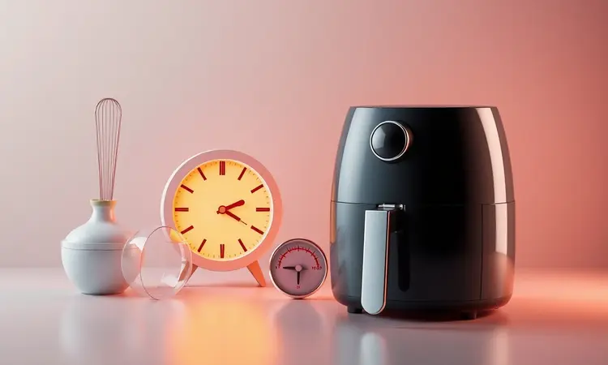
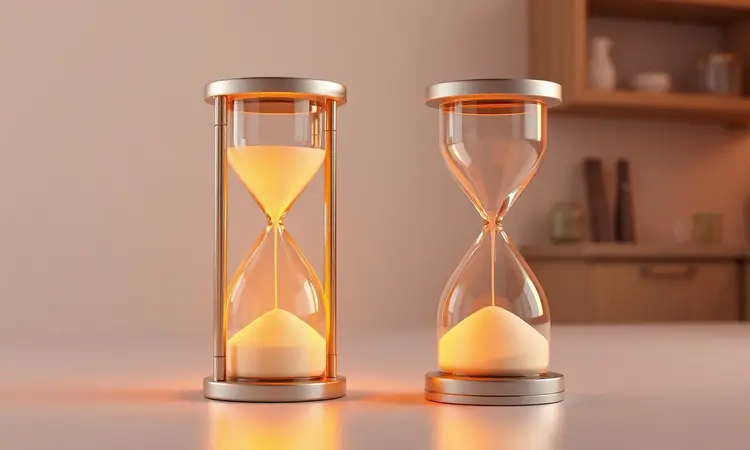

As fritadeiras elétricas sem óleo tornaram-se itens indispensáveis na cozinha moderna, prometendo praticidade e uma alimentação mais saudável.

No entanto, com tantas opções disponíveis no mercado, surge a dúvida: quais são as melhores marcas de air fryer e qual modelo realmente entrega o que promete?

Neste guia completo, analisamos as gigantes do setor, desde a tradição da Philips Walita até a excelente relação custo-benefício da Mondial e Philco.

Vamos explorar as características técnicas, durabilidade e o desempenho real de cada fabricante para ajudar você a escolher a air fryer ideal para sua rotina em 2025.

<SummaryList products={frontmatter.top_products} />

## Melhores marcas de air fryer e principais modelos

### 1. Electrolux Oven EAF90

<ProductBox 
  title={frontmatter.top_products[0].title} 
  image={frontmatter.top_products[0].image} 
  link={frontmatter.top_products[0].link} 
/>

Se sua família tem entre quatro e seis pessoas, a Electrolux Oven EAF90 é a escolha que combina espaço generoso com inteligência.

Com seus 12 litros de capacidade, ela permite preparar o almoço ou jantar de todos de uma vez, eliminando aquela espera por lotes sucessivos.

Imagine ter cinco funções de cozimento à sua disposição: fritar a ar, grelhar, aquecer, desidratar e até o modo rotisserie para um frango assado perfeito.

O painel digital simplifica tudo com mais de 10 programas pré-configurados, enquanto a tecnologia Cyclonic Airflow garante que cada pedaço de batata fique igualmente crocante, sem pontos frios. E a melhor parte? Você não precisa esperar o pré-aquecimento.

Basta colocar os alimentos e iniciar, com a promessa de usar até 90% menos gordura que uma fritadeira tradicional.

<CaixaProsContras>

**Prós:**

- Versatilidade com múltiplas funções de cozimento.

- Grande capacidade, ideal para famílias.

- Tecnologia que promove cozimento uniforme e saudável.

- Design compacto que se encaixa em cozinhas menores.

**Contras:**

- Display digital suscetível a arranhões.

- Pode não ser a opção mais econômica disponível.

</CaixaProsContras>

### 2. Mondial AFON-12L-BI

<ProductBox 
  title={frontmatter.top_products[1].title} 
  image={frontmatter.top_products[1].image} 
  link={frontmatter.top_products[1].link} 
/>

Para quem deseja um aparelho que seja tanto air fryer quanto forno convencional, a Mondial AFON-12L-BI oferece essa dupla personalidade.

Com capacidade total de 12 litros (sendo 5 litros apenas no cesto da fritadeira), ela permite que você asse um bolo enquanto frita batatas, tudo simultaneamente. É a solução perfeita para quem tem pouco espaço mas não abre mão de versatilidade.

Com potência de 2000W (127V) ou 2200W (220V), o aquecimento é quase instantâneo. O timer de 90 minutos com aviso sonoro evita que você se distraia e queime o jantar, enquanto as três assadeiras antiaderentes que acompanham facilitam múltiplos preparos.

A limpeza é tranquila graças ao revestimento Duraflon, mas reserve um bom espaço na bancada.

<CaixaProsContras>

**Prós:**

- Versatilidade como air fryer e forno.

- Capacidade generosa para preparar várias porções.

- Painel digital com funções práticas.

- Acessórios inclusos que facilitam o uso.

**Contras:**

- Ocupa um espaço considerável na cozinha.

- Pode ter uma curva de aprendizado para usuários iniciantes.

</CaixaProsContras>

### 3. WAP Barbecue Digital

<ProductBox 
  title={frontmatter.top_products[2].title} 
  image={frontmatter.top_products[2].image} 
  link={frontmatter.top_products[2].link} 
/>

Se você sente falta do sabor de churrasco mas não tem espaço para uma churrasqueira, a WAP Barbecue Digital resolve isso com elegância.

Este modelo horizontal de 10 litros não é apenas uma air fryer: são 12 modos de preparo que incluem uma função especial que simula o sabor defumado do churrasco.

A tecnologia de circulação de ar em 360° garante cozimento uniforme, enquanto o sistema Smokeless reduz significativamente a fumaça, permitindo usar dentro de casa sem preocupações.

Os acessórios antiaderentes facilitam a limpeza, mas prepare-se: este é um aparelho robusto que pede um lugar fixo na sua bancada.

<CaixaProsContras>

**Prós:**

- Multifuncionalidade com 12 modos de preparo.

- Quebra da fumaça com tecnologia Smokeless.

- Design moderno e robusto.

- Fácil limpeza dos acessórios.

**Contras:**

- Tamanho grande que exige espaço fixo.

- O painel digital pode requerer aprendizado.

</CaixaProsContras>

### 4. Oster OFRT780

<ProductBox 
  title={frontmatter.top_products[3].title} 
  image={frontmatter.top_products[3].image} 
  link={frontmatter.top_products[3].link} 
/>

A Oster OFRT780 é para quem busca um aliado versátil na cozinha. Com 12 litros de capacidade e 1800W de potência, ela funciona como fritadeira, forno e desidratador.

São nove funções pré-programadas que vão desde frituras sem óleo até desidratação de frutas para snacks saudáveis.

A tecnologia de rotação 360° assegura que cada pedaço receba calor igualmente, enquanto o display digital mantém você no controle. A limpeza demanda alguma atenção, mas seguindo as instruções do manual, você mantém o aparelho como novo por anos.

E o melhor: até 99,5% menos óleo comparado às fritadeiras tradicionais.

<CaixaProsContras>

**Prós:**

- Multifuncionalidade (fritar, assar e desidratar)

- Tecnologia de cozimento uniforme

- Design moderno com display digital

- Alta capacidade ideal para famílias

**Contras:**

- Limpeza pode ser um pouco trabalhosa

- Cuidado necessário para evitar ferrugem em modelos anteriores

</CaixaProsContras>

### 5. Philips Walita RI9252/91

<ProductBox 
  title={frontmatter.top_products[4].title} 
  image={frontmatter.top_products[4].image} 
  link={frontmatter.top_products[4].link} 
/>

A tradição da Philips se faz presente na Walita RI9252/91, que entrega resultados profissionais mesmo em mãos de iniciantes. Com a tecnologia Rapid Air, os alimentos ficam crocantes por fora e macios por dentro, usando até 90% menos gordura.

Para famílias pequenas ou médias, seus 4.1 litros de capacidade são suficientes para 0.8 kg de alimentos.

O display digital sensível ao toque e as sete predefinições transformam preparos complexos em operações de um toque. A função "Manter Aquecido" é um salvador de jantares, mantendo tudo quente por 30 minutos.

E quando a bagunça é inevitável, as peças removíveis vão direto para a lava-louças.

<CaixaProsContras>

**Prós:**

- Tecnologia Rapid Air para cozimento mais saudável.

- Display digital com várias predefinições.

- Função "Manter Aquecido" por até 30 minutos.

- Peças removíveis fáceis de limpar.

**Contras:**

- Capacidade pode ser limitada para famílias maiores.

- Ajustes de temperatura em incrementos de 25 graus podem não atender receitas mais específicas.

</CaixaProsContras>

### 6. Philco PFR2200P

<ProductBox 
  title={frontmatter.top_products[5].title} 
  image={frontmatter.top_products[5].image} 
  link={frontmatter.top_products[5].link} 
/>

A Philco PFR2200P é a escolha para quem não quer meio-termo: ou vai tudo ou não vai. Com capacidade de 12 litros, ela é uma fritadeira, forno, grelhador e desidratador em um único aparelho.

O painel digital touch screen permite ajustes precisos entre 80°C e 200°C, com timer de até 90 minutos.

A porta frontal transparente é um diferencial que poucos oferecem: você acompanha o processo sem interromper o cozimento. As nove funções pré-programadas cobrem desde batatas fritas até assados elaborados.

Sim, ocupa espaço, mas substitui vários eletrodomésticos de uma vez.

<CaixaProsContras>

**Prós:**

- Versátil: permite fritar, assar, grelhar e desidratar.

- Grande capacidade de 12 litros, ideal para porções maiores.

- Painel digital intuitivo facilita o uso.

- Design moderno com porta frontal para visualização dos alimentos.

**Contras:**

- O preço pode ser mais alto em comparação a outras fritadeiras simples.

- Pode ocupar mais espaço na bancada devido ao seu tamanho.

</CaixaProsContras>

### 7. Elgin Start Fry

<ProductBox 
  title={frontmatter.top_products[6].title} 
  image={frontmatter.top_products[6].image} 
  link={frontmatter.top_products[6].link} 
/>

Para apartamentos pequenos ou quem cozinha sozinho, a Elgin Start Fry oferece o essencial sem complicações. Com 3,5 litros e 1400W, ela reduz o uso de óleo em até 80% usando circulação de ar quente.

Os controles mecânicos são tão intuitivos que você nem precisa ler o manual.

Ajuste a temperatura entre 80°C e 200°C, programe o timer de 60 minutos e pronto. A grelha antiaderente removível limpa com um pano úmido, e o design compacto some na bancada quando não está em uso.

A bandeja fixa pode limitar algumas receitas, mas para o dia a dia, é mais que suficiente.

<CaixaProsContras>

**Prós:**

- Cozinha alimentos de forma mais saudável com até 80% menos gordura.

- Fácil de usar com controle mecânico intuitivo.

- Design compacto e leve, ótimo para espaços pequenos.

- Grelha antiaderente que facilita a limpeza.

**Contras:**

- Bandeja pode limitar o movimento dos alimentos durante o cozimento.

- Nível de ruído pode ser perceptível durante o uso.

</CaixaProsContras>

### 8. Britânia BFR2100P

<ProductBox 
  title={frontmatter.top_products[7].title} 
  image={frontmatter.top_products[7].image} 
  link={frontmatter.top_products[7].link} 
/>

Quando a família é grande e o apetite também, a Britânia BFR2100P chega com seus 12 litros para resolver o problema. Mais que uma air fryer, é um mini forno elétrico que frita, assa, desidrata e reaquece.

O painel digital touch com nove funções pré-programadas transforma receitas complexas em operações simples.

Ajuste preciso entre 80°C e 200°C, timer de 90 minutos e iluminação interna para monitorar sem abrir. A limpeza demanda atenção pelo tamanho, mas o acabamento antiaderente ajuda. É para quem não quer negociar espaço ou versatilidade.

<CaixaProsContras>

**Prós:**

- Grande capacidade de 12 litros, ideal para várias porções.

- Versatilidade com múltiplas funções (fritar, assar, desidratar).

- Painel digital intuitivo com funções pré-programadas.

- Design moderno com iluminação interna para monitoramento.

**Contras:**

- Pode ser um pouco mais complicada para limpar por conta do tamanho.

- A potência de 1800W pode aumentar o consumo de energia.

</CaixaProsContras>

### 9. Air fryer Midea 4L

<ProductBox 
  title={frontmatter.top_products[8].title} 
  image={frontmatter.top_products[8].image} 
  link={frontmatter.top_products[8].link} 
/>

Para casais ou pequenas famílias que buscam eficiência sem gastar muito, a Midea 4L equilibra tudo. Com 1500W de potência, aquece rápido para quando a fome aperta depois do trabalho.

A tecnologia DualCyclone garante que cada batata fique crocante por igual, sem necessidade de óleo.

Controle de temperatura entre 80°C e 200°C, timer de 60 minutos e bandeja removível que vai direto para a lava-louças. Os botões podem parecer frágeis para mãos mais fortes, e as laterais esquentam durante o uso, mas pelo preço e desempenho, é difícil encontrar melhor.

<CaixaProsContras>

**Prós:**

- Capacidade adequada para pequenos grupos.

- Potência eficiente para cozimento rápido.

- Tecnologia DualCyclone para resultados crocantes.

- Facilidade de limpeza com peças removíveis.

**Contras:**

- Botões podem parecer frágeis.

- Laterais podem aquecer durante o uso.

</CaixaProsContras>

### 10. Cadence FRT515

<ProductBox 
  title={frontmatter.top_products[9].title} 
  image={frontmatter.top_products[9].image} 
  link={frontmatter.top_products[9].link} 
/>

Se você mora sozinho ou em casal e busca praticidade acima de tudo, a Cadence FRT515 é a resposta. Com apenas 3 litros, é compacta mas poderosa: 1250W que preparam refeições rápidas com eficiência.

Controle de temperatura entre 90°C e 200°C, timer de 60 minutos e luz indicadora para não perder o ponto.

A tecnologia de convecção entrega crocância sem óleo, enquanto o cesto removível com revestimento antiaderente limpa em segundos. O consumo pode ser um pouco elevado em uso intensivo, mas para refeições diárias, é uma companheira discreta e eficiente.

<CaixaProsContras>

**Prós:**

- Capacidade ideal para pequenas refeições.

- Cozimento rápido e eficiente com 1250W.

- Função descongelar disponível.

- Design compacto e moderno.

**Contras:**

- O consumo de energia pode ser maior em uso intenso.

- Limitada a porções menores devido à sua capacidade de 3 litros.

</CaixaProsContras>

### 11. Black & Decker 5L

<ProductBox 
  title={frontmatter.top_products[10].title} 
  image={frontmatter.top_products[10].image} 
  link={frontmatter.top_products[10].link} 
/>

Para quem inicia no mundo das air fryers mas não quer começar pelo básico, a Black & Decker 5L oferece o equilíbrio perfeito.

Capacidade suficiente para famílias pequenas (cerca de 5 litros), tecnologia de convecção rápida para resultados crocantes e controles intuitivos que qualquer um domina.

Temperatura ajustável entre 80°C e 200°C, timer de até 60 minutos e cesta removível que simplifica a limpeza. Para refeições maiores, pode ser necessário preparar em lotes, mas a versatilidade compensa.

É a porta de entrada para uma culinária mais saudável sem complicações.

<CaixaProsContras>

**Prós:**

- Culinária mais saudável com pouco óleo.

- Fácil de usar e limpar devido a cestas removíveis.

- Boa capacidade para famílias pequenas.

- Controle preciso de temperatura e timer.

**Contras:**

- Capacidade pode ser limitada para grandes famílias.

- Pode exigir cozinhar em lotes para refeições maiores.

</CaixaProsContras>

### 12. EOS Chef Gourmet 6.2L Digital

<ProductBox 
  title={frontmatter.top_products[11].title} 
  image={frontmatter.top_products[11].image} 
  link={frontmatter.top_products[11].link} 
/>

A EOS Chef Gourmet 6.2L Digital é para quem gosta de tecnologia na cozinha. Com seus 6,2 litros, atende famílias pequenas e médias, mas o verdadeiro diferencial está na tecnologia 5 em 1: fritar, descongelar, desidratar, reaquecer e funcionar como forno.

Painel touchscreen com 10 funções pré-programadas e visor interno iluminado permitem acompanhar o cozimento sem abrir. A potência de 1500W garante eficiência, embora alguns preparos possam demorar um pouco mais.

O cabo poderia ser mais longo, mas isso é detalhe diante da versatilidade oferecida.

<CaixaProsContras>

**Prós:**

- Capacidade generosa de 6,2 litros.

- Tecnologia versátil com múltiplas funções.

- Painel touchscreen intuitivo e fácil de usar.

- Visor interno que facilita o monitoramento do cozimento.

**Contras:**

- O tempo de preparo pode ser um pouco maior comparado a outras air fryers.

- O cabo elétrico pode ser considerado curto por alguns usuários.

</CaixaProsContras>

### 13. Suggar Lightfry Inox 4 Litros

<ProductBox 
  title={frontmatter.top_products[12].title} 
  image={frontmatter.top_products[12].image} 
  link={frontmatter.top_products[12].link} 
/>

A Suggar Lightfry Inox 4 Litros é o investimento que dura. Com capacidade para famílias menores, oferece construção em aço inoxidável que não enferruja e mantém a aparência como nova por anos.

Controle de temperatura entre 80°C e 200°C, timer de 60 minutos e cesto antiaderente removível.

Alguns usuários mencionam a necessidade de uma "cura" inicial com óleo, um pequeno ritual que garante desempenho ótimo. Não é a mais barata, mas quando você pega nas peças e sente a qualidade, entende que está pagando por durabilidade, não apenas por funcionalidade.

<CaixaProsContras>

**Prós:**

- Grande capacidade de 4 litros ideal para famílias.

- Cozinha alimentos de maneira saudável, sem óleo.

- Fácil de limpar devido ao cesto antiaderente removível.

- Controle preciso de temperatura e timer para diferentes receitas.

**Contras:**

- Não é a opção mais barata do mercado, mas oferece bom custo-benefício pela qualidade.

- A necessidade de fazer um "cura" inicial com óleo pode ser um incômodo para alguns usuários.

</CaixaProsContras>

### 14. Mallory Masterchef 12 L

<ProductBox 
  title={frontmatter.top_products[13].title} 
  image={frontmatter.top_products[13].image} 
  link={frontmatter.top_products[13].link} 
/>

A Mallory Masterchef 12L é a escolha para quem cozinha em quantidade. Com 12 litros e 1700W, prepara refeições para famílias grandes ou congelados para a semana toda.

Sistema de circulação de ar em 360° garante crocância uniforme, enquanto o painel digital touch simplifica o controle.

Para quantidades realmente grandes, pode ser necessário fazer em lotes, mas a capacidade já resolve a maioria das situações domésticas. Não acompanha espeto para assados, mas isso é fácil de resolver com acessórios universais.

<CaixaProsContras>

**Prós:**

- Capacidade grande de 12 litros

- Multifuncionalidade (fritar, assar e desidratar)

- Painel digital fácil de usar

- Cozimento uniforme com tecnologia de circulação de ar

**Contras:**

- Pode necessitar de mais de um lote para grandes quantidades

- Não acompanha espeto para assados

</CaixaProsContras>

Agora que você conhece as principais opções do mercado, como decidir qual é a certa para sua cozinha? Vamos aos fatores que realmente importam na hora da escolha.

## Como escolher a Air Fryer ideal: Fatores essenciais

### 1. Capacidade (Litros)

Pense em quantas pessoas você cozinha regularmente. Para solteiros ou casais, modelos de 2 a 4 litros são mais que suficientes e ocupam menos espaço. Famílias de três a quatro pessoas encontram equilíbrio em modelos de 5 a 6 litros.

Já famílias maiores ou quem gosta de preparar porções extras para congelar devem considerar os modelos de 10 a 12 litros. Lembre-se: capacidade maior também significa maior consumo de energia e mais espaço na bancada.

### 2. Potência (Watts)

A potência determina a velocidade do cozimento. Modelos entre 1200W e 1500W são eficientes para o uso diário, aquecem rápido sem exagerar no consumo.

Já os modelos acima de 1700W são ideais para quem precisa de preparos mais rápidos ou para famílias grandes que preparam quantidades maiores. Potência maior geralmente significa crocância mais uniforme, especialmente em alimentos como batatas fritas e empanados.

### 3. Recursos e Funções Adicionais

Algumas air fryers são especialistas em fazer uma coisa bem, outras são verdadeiras centrais culinárias. Funções como desidratar são perfeitas para quem faz snacks saudáveis caseiros. O modo rotisserie transforma frangos em assados perfeitos.

Programação digital com presets elimina adivinhações: selecione "batatas fritas" e o aparelho ajusta tempo e temperatura automaticamente. Cada função extra amplia suas possibilidades na cozinha.

### 4. Design e Material

Observe além da estética. Acabamentos em inox mantêm a aparência nova por mais tempo e são mais resistentes à corrosão. Modelos com porta frontal transparente permitem monitorar o cozimento sem perder calor.

Controles bem posicionados facilitam o uso, especialmente com as mãos ocupadas ou molhadas. E pense no espaço: modelos verticais ocupam menos área na bancada, enquanto horizontais oferecem mais capacidade.

### 5. Facilidade de Limpeza

Isso faz diferença no dia a dia. Peças removíveis que vão à lava-louças transformam uma tarefa chata em algo rápido. Revestimentos antiaderentes de qualidade evitam que alimentos grudem, mesmo em preparos mais desafiadores.

Alguns modelos têm sistemas de autolimpeza, mas na prática, um bom revestimento antiaderente e peças removíveis resolvem 95% dos casos.

### 6. Reputação da Marca e Suporte ao Cliente

Marcas estabelecidas oferecem não apenas produtos testados, mas também rede de assistência técnica e garantia que funcionam. Quando algo dá errado (e eventualmente dá), ter onde recorrer faz toda diferença.

Avaliações de outros usuários revelam problemas recorrentes que os manuais não mencionam. Investir em marcas com boa reputação é investir em tranquilidade.

## Qual marca de air fryer não enferruja?

A resistência à ferrugem depende diretamente dos materiais usados. Marcas como Philips, Electrolux e Britânia geralmente utilizam aço inoxidável ou revestimentos antiaderentes de alta qualidade que protegem contra a corrosão.

O inox é praticamente imune à ferrugem, enquanto bons revestimentos cerâmicos ou à base de titânio também oferecem excelente proteção.

Evite modelos com partes internas pintadas ou com acabamentos metálicos básicos, especialmente se você mora em regiões litorâneas com maior umidade.

## Qual a vida útil de uma air fryer?

Com cuidados adequados, uma boa air fryer dura de 5 a 10 anos. Marcas premium tendem a durar mais devido à qualidade dos componentes e materiais.

Para prolongar a vida útil, limpe após cada uso (especialmente resíduos gordurosos), não exceda a capacidade máxima e evite ciclos consecutivos muito longos que sobrecarreguem o motor e a resistência.

A maioria das falhas acontece não no "cozimento", mas nos componentes mecânicos como botões e fechaduras.

## Qual marca é melhor, Oster ou Electrolux?

A Oster brilha na durabilidade e simplicidade: modelos robustos que funcionam ano após ano com manutenção mínima. Já a Electrolux se destaca na tecnologia e eficiência, com funções inteligentes como pré-aquecimento automático e programas especializados.

Escolha Oster se você busca um trabalho confiável e direto, sem firulas. Opte pela Electrolux se valoriza inovação e está disposto a explorar todas as possibilidades que uma cozinha moderna oferece.

## Philips Walita ou Mondial: Qual Tecnologia Vence?

A Philips Walita oferece a experiência premium: tecnologia Rapid Air testada e aprovada, design pensado no usuário e durabilidade comprovada.

A Mondial entrega excelente custo-benefício: funcionalidades essenciais por um preço mais acessível, perfeita para quem quer experimentar sem investir muito. Se orçamento não é limitante e você busca o melhor desempenho, a Philips é a escolha.

Se você quer funcionalidade sólida por um preço justo, a Mondial atende perfeitamente.

## Diferenciais do Revestimento Redstone e Inox

O Redstone é especialista em distribuição uniforme de calor: alimentos ficam crocantes por igual, sem pontos mais queimados ou crus. É também bastante resistente a arranhões do uso diário.

O inox, além da estética moderna, oferece resistência máxima à corrosão e facilidade de limpeza extrema. Ambos são excelentes escolhas: Redstone para quem prioriza resultados culinários perfeitos, inox para quem valoriza durabilidade extrema e facilidade de manutenção.

## Qual é a melhor air fryer de 2025?

A resposta depende completamente do que você precisa. Para famílias grandes que cozinham muito, a Electrolux Oven EAF90 ou Britânia BFR2100P são imbatíveis. Casais ou solteiros encontram na Midea 4L ou Cadence FRT515 o equilíbrio perfeito.

Quem busca versatilidade máxima vai se encantar com a Philco PFR2200P ou WAP Barbecue Digital. E para quem quer a experiência premium com tecnologia consolidada, a Philips Walita RI9252/91 continua sendo referência.

## Conclusão

Escolher uma air fryer é mais que comparar especificações técnicas: é encontrar o parceiro certo para sua rotina na cozinha. Famílias grandes precisam de capacidade, solteiros valorizam praticidade, e os amantes da culinária exploram todas as funções extras.

As 14 opções apresentadas cobrem desde o básico eficiente até o sofisticado multifuncional.

Lembre-se que o melhor modelo não é necessariamente o mais caro ou cheio de funções, mas aquele que se encaixa no seu espaço, atende sua família e torna sua vida mais prática.

Seja para substituir a fritadeira tradicional, ampliar suas opções culinárias ou simplesmente comer de forma mais saudável sem abrir mão do sabor, existe uma air fryer perfeita para você.

Comece identificando sua necessidade principal: espaço na bancada, quantidade de comida, orçamento disponível. Depois, explore os modelos que se encaixam nesses critérios.

Em 2025, com tanta tecnologia disponível, cozinhar de forma mais inteligente e saudável nunca foi tão acessível. Qual será a sua escolha para transformar a cozinha?