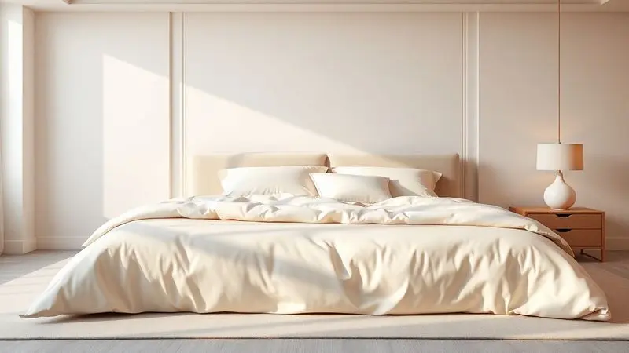

Escolher o colchão ideal é fundamental para garantir uma boa noite de sono e a saúde da coluna a longo prazo.

Com tantas opções no mercado brasileiro, desde modelos clássicos de molas ensacadas até espumas tecnológicas de memória, a dúvida sobre em qual fabricante confiar é cada vez mais comum.

Neste guia completo, analisamos as melhores marcas de colchão de 2025, destacando seus diferenciais tecnológicos, durabilidade e custo benefício.

Se você busca conforto absoluto ou suporte ortopédico específico, nosso ranking consolidado ajudará você a tomar a melhor decisão para o seu descanso e bem estar diário.

<SummaryList products={frontmatter.top_products} />

## As 9 Melhores Marcas de Colchão para Comprar em 2025

Neste guia, você encontrará uma seleção das melhores marcas de colchão de 2025, que oferecem conforto, suporte e durabilidade. A escolha certa pode transformar suas noites de sono em uma experiência muito mais agradável.

### 1. Tempur

<ProductBox 
  title={frontmatter.top_products[0].title} 
  image={frontmatter.top_products[0].image} 
  link={frontmatter.top_products[0].link} 
/>

Imagine deitar em uma nuvem que se molda exatamente ao contorno do seu corpo, aliviando cada ponto de pressão. É essa a experiência que a Tempur promete e entrega há décadas.

Seu material TEMPUR® viscoelástico oferece um abraço terapêutico, perfeito para quem busca um sono verdadeiramente reparador.

Modelos como o Tempur Pro Plus SmartCool Soft vão além, combinando esse conforto macio com uma tecnologia de refrigeração que mantém a temperatura ideal durante a noite, um alívio para quem costuma acordar sufocado.

É justo avisar que alguns usuários relatam uma sensação de "afundamento" característica do material, algo que pode não agradar a todos.

Mas se você prioriza o alívio de dores e um isolamento de movimento tão eficaz que seu parceiro pode se virar sem você notar, a durabilidade comprovada da marca e a variedade de níveis de firmeza fazem desse um investimento que vale cada centavo.

<CaixaProsContras>

**Prós:**

- Excelente alívio de pressão com material viscoelástico.

- Tecnologia de refrigeração disponível em vários modelos.

- Isolamento de movimento, ideal para casais.

- Variedade de níveis de firmeza para atender diferentes gostos.

**Contras:**

- Preço considerado alto em comparação com outras marcas.

- Sensação de “afundamento” que pode não agradar todos os usuários.

</CaixaProsContras>

### 2. Herval

<ProductBox 
  title={frontmatter.top_products[1].title} 
  image={frontmatter.top_products[1].image} 
  link={frontmatter.top_products[1].link} 
/>

Se você busca uma marca que oferece um leque amplo de opções, da firmeza clássica ao acolhimento moderno, a Herval é uma campeã de versatilidade.

Aqui, você encontra desde o modelo Cannes, com sua espuma D33 que oferece suporte ideal para até 100kg, até o Frontier, com sua tecnologia Double Face que permite inverter o lado para uma firmeza diferente.

Para os tradicionalistas que acreditam na eficácia das molas, opções como o Parma (com molas ensacadas) e o Istambul (com design Pillow Top que convida para o descanso) são destaques.

Um diferencial que vai além do conforto é o compromisso ambiental da marca, que utiliza a EcoSpuma®, uma espuma sustentável que prolonga a vida útil do produto.

Embora sua linha econômica possa não ser tão vasta, cada modelo Herval representa um investimento sólido em noites bem dormidas.

<CaixaProsContras>

**Prós:**

- Variedade de modelos para diferentes preferências de conforto.

- Uso de materiais sustentáveis como a EcoSpuma®.

- Modelos com tecnologias avançadas, como molas ensacadas.

- Disponibilidade em vários tamanhos.

**Contras:**

- Não tem uma linha econômica muito diversificada.

- Alguns modelos podem ser mais firmes, exigindo adaptação.

</CaixaProsContras>

### 3. Pikolin

<ProductBox 
  title={frontmatter.top_products[2].title} 
  image={frontmatter.top_products[2].image} 
  link={frontmatter.top_products[2].link} 
/>

Com uma história que começou em 1948 na Espanha, a Pikolin traz para o mercado brasileiro uma expertise que se traduz em tecnologia inteligente. Seus modelos são desenvolvidos para situações específicas.

Por exemplo, o Colchão Bold impressiona com seu sistema de molas Cross System, capaz de suportar até 250 kg por pessoa, enquanto seu tecido com fios de cobre trabalha para dissipar o calor do seu corpo.

Para quem sofre com alergias, a marca oferece soluções completas, incluindo protetores e capas impermeáveis.

É verdade que adentrar a linha premium da Pikolin pode significar um investimento mais elevado.

Mas pense nisso como comprar anos de tranquilidade: a qualidade dos materiais e a durabilidade oferecida justificam o valor, transformando seu quarto em um verdadeiro santuário do sono.

<CaixaProsContras>

**Prós:**

- Ampla variedade de modelos adaptados a diferentes necessidades.

- Tecnologia avançada com suporte para até 250 kg em alguns modelos.

- Opções específicas para alergias e conforto térmico.

- Período de teste de 30 dias com devolução garantida.

**Contras:**

- Algumas opções são mais caras em relação à concorrência.

- Os modelos mais básicos podem não ter o mesmo nível de sofisticação tecnológica.

</CaixaProsContras>

### 4. King Koil

<ProductBox 
  title={frontmatter.top_products[3].title} 
  image={frontmatter.top_products[3].image} 
  link={frontmatter.top_products[3].link} 
/>

A King Koil é sinônimo de tradição que evolui. Em 2025, a marca continua a inovar, como no modelo Spa King Koil.

Com uma altura generosa de 35 cm, ele aplica uma engenharia inteligente: molas ensacadas duplas que oferecem um suporte mais firme no centro (para alinhar perfeitamente sua coluna) e mais suaves nas extremidades (para um conforto que convida ao relaxamento total).

A tecnologia PureTex presente em muitos de seus modelos cria uma barreira protetora contra ácaros e fungos, ideal para quem tem sensibilidade respiratória.

Sim, você encontrará preços superiores aos de marcas mais simples. Essa diferença, porém, se materializa em cada noite de descanso profundo, graças aos materiais nobres utilizados, como o látex Talalay e o algodão de alta qualidade.

<CaixaProsContras>

**Prós:**

- Conforto excepcional graças à tecnologia de molas ensacadas.

- Materiais de alta qualidade, como algodão e látex Talalay.

- Proteção eficaz contra ácaros e fungos com a tecnologia PureTex.

- Diversidade de modelos para atender diferentes necessidades de conforto.

**Contras:**

- Preço pode ser mais elevado do que outros colchões no mercado.

- Alguns modelos podem ser pesados, dificultando o manuseio.

</CaixaProsContras>

### 5. Simmons

<ProductBox 
  title={frontmatter.top_products[4].title} 
  image={frontmatter.top_products[4].image} 
  link={frontmatter.top_products[4].link} 
/>

A simplicidade de uma boa noite de sono muitas vezes esconde uma tecnologia complexa, e a Simmons domina essa arte. Famosos pela tecnologia de molas ensacadas, seus colchões são projetados para oferecer suporte personalizado a cada parte do seu corpo.

O resultado prático? Movimentos praticamente isolados, fazendo com que os virar na cama do seu parceiro não sejam mais motivo para interromper seu sono.

Além da já consolidada durabilidade (que garante cerca de 8 a 10 anos de uso com qualidade), modelos como os da linha Beautyrest Black incorporam sistemas de resfriamento para neutralizar o calor corporal.

Embora os modelos topo de linha exijam um investimento considerável, eles recompensam com anos de conforto inabalável e saúde para sua coluna.

<CaixaProsContras>

**Prós:**

- Tecnologia de molas ensacadas para suporte personalizado.

- Variedade de modelos e níveis de firmeza.

- Boa durabilidade devido aos materiais de alta qualidade.

- Opções com tecnologia de resfriamento.

**Contras:**

- Modelos premium podem ser mais caros.

- Não são todos os modelos que atendem a quem dorme de lado com conforto.

</CaixaProsContras>

### 6. Otto're

Uma joia nacional que alia qualidade acessível a um design cativante.

A Otto're (ou Ott'ore Colchões) conquista pelo acolhimento imediato e pela variedade de linhas que atendem desde quem precisa de firmeza ortopédica (linhas como Origini) até quem deseja afundar em um conforto ultra plush (como a Sonnoplus).

Os relatos de clientes frequentemente mencionam uma melhora notável na qualidade do sono desde a primeira noite, elogiando a sensação de "estar num abraço".

Embora seu reconhecimento não tenha o mesmo peso global de gigantes internacionais, essa é justamente sua força: oferecer produtos de excelente acabamento e conforto a um custo benefício mais atraente, sem abrir mão da variedade de tamanhos, do solteiro ao king size.

<CaixaProsContras>

**Prós:**

- Variedade de modelos e níveis de conforto.

- Alta qualidade nos materiais utilizados.

- Design atraente e funcional.

- Opções para diferentes tamanhos de cama.

**Contras:**

- Menos reconhecimento no mercado comparado a marcas internacionais.

- Disponibilidade limitada em algumas regiões do Brasil.

</CaixaProsContras>

### 7. Emma

<ProductBox 
  title={frontmatter.top_products[6].title} 
  image={frontmatter.top_products[6].image} 
  link={frontmatter.top_products[6].link} 
/>

Inovar é colocar o cliente no centro da experiência, e a Emma faz isso com maestria. Campeã em prêmios internacionais como o do Good Housekeeping Institute, a marca transforma tecnologia em conforto tangível.

Seu sistema ThermoSync regula a temperatura de forma inteligente, enquanto o material AirGrid proporciona uma sensação de flutuação que alivia as articulações.

O maior ativo da Emma, porém, pode ser sua política de compra. Com 100 dias para testar o colchão no seu próprio quarto e uma devolução gratuita se não se apaixonar, ela remove o risco da compra.

Junte a isso 10 anos de garantia, e você tem uma proposta de segurança e confiança difícil de ignorar.

Alguns testes específicos podem apontar concorrentes com performance ligeiramente superior, mas para quem busca um pacote completo de conforto, tecnologia e tranquilidade na compra, a Emma é uma escolha excepcional.

<CaixaProsContras>

**Prós:**

- Modelos premiados e reconhecidos pela qualidade.

- Inovações tecnológicas que melhoram a experiência de sono.

- Política de 100 dias de teste e devolução gratuita.

- Boa variedade de opções para diferentes necessidades.

**Contras:**

- Desempenho inferior em alguns testes comparativos.

- Algumas opções podem ser mais caras do que outros colchões no mercado.

</CaixaProsContras>

### 8. Ortobom

<ProductBox 
  title={frontmatter.top_products[7].title} 
  image={frontmatter.top_products[7].image} 
  link={frontmatter.top_products[7].link} 
/>

Quando pensamos em colchões no Brasil, é quase impossível não pensar na Ortobom. Uma marca que se reinventa mantendo sua essência: qualidade acessível. Para os casais, o Freedom com suas molas SuperPocket é uma escolha certeira, minimizando a transferência de movimento.

Para quem dorme sozinho e busca suporte, o D33 Elegant combina a eficiência das molas ensacadas com o conforto da espuma D33.

A marca também atende quem precisa de firmeza extra, com opções como o D45 Physical ISO 150 e o Airtech 150, ambos focados no alinhamento postural. A grande variedade pode, à primeira vista, parecer confusa.

Mas é justamente esse o ponto: a Ortobom tem um modelo para quase todos os tipos de corpo e preferência de sono, tudo com a chancela de qualidade reconhecida pelo Inmetro.

<CaixaProsContras>

**Prós:**

- Variedade de modelos para diferentes necessidades.

- Tecnologia de molas ensacadas que isolam movimentos.

- Opções de espumas certificadas para conforto superior.

- Marcação de qualidade reconhecida pelo Inmetro.

**Contras:**

- A ampla gama pode gerar confusão na escolha do modelo ideal.

- Alguns opções podem ser mais pesadas para manuseio.

</CaixaProsContras>

### 9. Castor

<ProductBox 
  title={frontmatter.top_products[8].title} 
  image={frontmatter.top_products[8].image} 
  link={frontmatter.top_products[8].link} 
/>

Dormir bem enquanto faz bem para o planeta. Essa é a proposta da Castor, que em 2025 se destaca com sua linha sustentável Green Star®.

Modelos como o BioComfort Pocket® não apenas oferecem conforto através de tecnologias como molas Pocket e combinações híbridas, mas também carregam o orgulho de serem produzidos por uma marca neutra em carbono, que trabalha ativamente para reduzir emissões de CO₂.

Produtos como o Comfort Double Face D33 são práticos, firmes e de fácil instalação. Se sua preferência for por um colchão ultramacio que "engole" você, talvez a variedade da Castor não atenda perfeitamente.

No entanto, para quem valoriza a sustentabilidade sem abrir mão de tecnologias modernas e um suporte de qualidade, ela apresenta uma das propostas mais interessantes e conscientes do mercado.

<CaixaProsContras>

**Prós:**

- Linha sustentável com redução de emissões de CO₂.

- Variedade de tecnologias disponíveis, como molas Pocket e híbridas.

- Modelos firmes e práticos, como o Comfort Double Face D33.

- Certificações de qualidade, como o Certificado Pró-Espuma.

**Contras:**

- Pode faltar opções ultramacios para preferências específicas.

- A variedade pode ser confusa para quem busca simplicidade.

</CaixaProsContras>

## Como escolher um bom colchão?

Agora que você conhece as principais marcas, como transformar esse conhecimento na escolha certa? O segredo está em começar pelo seu corpo. Como você dorme? Pessoas que dormem de lado geralmente se beneficiam de colchões mais macios que acomodem o ombro e o quadril.

Quem dorme de costas ou de bruços precisa de mais firmeza para manter a coluna alinhada.

Os materiais também contam sua própria história. As espumas viscoelásticas, como as da Tempur, oferecem um contorno preciso que alivia a pressão.

Já os colchões de molas, como os da Simmons, normalmente proporcionam uma ventilação superior e uma sensação de "sustentação". Se tiver a oportunidade, deite no colchão na loja por pelo menos 10 minutos. Sinta como seu corpo responde.

Por fim, observe a garantia oferecida: ela é um termômetro da confiança que a fabricante tem na durabilidade do seu produto.

## Colchão Emma ou Ortobom?

Essa é uma dúvida comum, pois ambas oferecem excelente custo benefício, mas com abordagens distintas.

A Emma traz uma proposta mais moderna, focada em tecnologias de última geração, como regulação de temperatura e materiais responsivos, além de uma das políticas de teste mais generosas do mercado (100 dias). É a escolha para quem prioriza inovação e segurança na compra.

A Ortobom, por sua vez, é a força da tradição brasileira. Oferece uma variedade imensa de modelos, muitos com tecnologias consagradas como as molas ensacadas, a um preço geralmente mais acessível.

É a escolha para quem quer uma opção conhecida, confiável e que atenda necessidades específicas (como firmeza extra) sem complicações.

### Emma (Supply)

A Emma conquistou seu espaço ao transformar alta tecnologia em conforto palpável. A marca vai além da simples venda de um produto: oferece uma experiência de compra segura, com foco em sustentabilidade e no bem estar do cliente do início ao fim.

### Características do Produto Emma

O coração do colchão Emma é sua camada de espuma viscoelástica, que se adapta ao seu corpo para distribuir o peso de forma uniforme e eliminar pontos de pressão.

Abaixo dela, uma espuma de alta densidade garante a estabilidade e durabilidade que sustentam noites de sono ano após ano. O conjunto é projetado para respirar, ajudando a evitar o calor excessivo que atrapalha o descanso.

### Desafios e Limitações da Emma

Nenhuma marca é perfeita. Alguns usuários acham os colchões Emma mais firmes do que o esperado, especialmente nos primeiros dias, até que ocorra a adaptação completa do material.

Além disso, o portfólio da marca, embora de alta qualidade, é mais enxuto que o de concorrentes tradicionais. Para a maioria, porém, a combinação de materiais premium, tecnologia inteligente e a política de 100 dias de teste supera essas considerações.

### Sugestões e Alternativas: Pikolin e King Koil

Se você está entre a Emma e a Ortobom, mas quer expandir suas opções, vale olhar para a Pikolin e a King Koil. A Pikolin brilha em soluções técnicas, como suporte de alta capacidade e tecidos com propriedades termorreguladoras.

Já a King Koil é a mestra em conforto duradouro e design ergonômico, com um foco forte na saúde da coluna. Ambas apresentam propostas valiosas para quem quer investir em qualidade duradoura.

### Observações sobre competidores: Ortobom e a Estética Chamativa

Um ponto interessante da Ortobom, muitas vezes subestimado, é seu apelo visual. Em um quarto, o colchão é uma peça central. A marca entende isso e oferece designs modernos e acabamentos que não apenas prometem conforto, mas também complementam a decoração.

Para quem valoriza um ambiente harmonioso, essa combinação de funcionalidade e estilo pode ser o fator decisivo.

## Melhor marca de colchão queen

Para um colchão queen size, que é um dos tamanhos mais populares para casais, o equilíbrio entre espaço, conforto individual e suporte compartilhado é crucial.

Marcas como a Tempur e a Simmons são especialmente recomendadas nessa categoria por conta de suas tecnologias de isolamento de movimento. Imagine não ser acordado toda vez que seu parceiro se levanta para beber água.

Esse detalhe faz toda a diferença na qualidade do sono a dois.

A durabilidade também é um critério ainda mais importante aqui, já que o colchão será utilizado intensivamente. Investir em uma marca com garantia extensa e avaliações positivas de longo prazo dos consumidores é a estratégia mais inteligente.

## Melhor marca de colchão ortopédico

Quando falamos de colchão ortopédico, estamos falando de saúde. A melhor marca é aquela que oferece suporte preciso para manter a coluna em seu alinhamento natural durante o sono, aliviando a pressão nas articulações.

Geralmente, isso é alcançado através da combinação de materiais como espuma viscoelástica de alta densidade e látex, organizados em camadas que trabalham juntas.

### Colchão Ortopédico: descrição e tecnologia

Pense no colchão ortopédico como uma ferramenta terapêutica. Ele não é necessariamente "duro".

Em vez disso, é inteligente: usa camadas de diferentes densidades para oferecer firmeza onde seu corpo precisa (região lombar) e acomodação onde seus pontos de pressão exigem (ombros, quadris).

Tecnologias que melhoram a circulação de ar são incorporadas para garantir que o conforto térmico não seja negligenciado, contribuindo para um sono ininterrupto.

### Selo ICA: a chancela da qualidade

Em um mercado repleto de opções, o Selo ICA (Instituto de Certificação de Produtos) funciona como um farol de confiança. Quando você vê esse selo em um colchão, sabe que ele passou por testes rigorosos de durabilidade, conforto e segurança.

É uma garantia independente de que você não está apenas comprando um produto, mas fazendo um investimento validado na sua saúde e na qualidade das suas noites.

## Melhor marca de colchão king?

Para o majestoso king size, a experiência é sinônimo de espaço e liberdade absoluta.

A escolha da marca deve refletir esse propósito, priorizando modelos que não apenas preencham o espaço físico (193 cm x 203 cm, tipicamente), mas que também ofereçam um conforto uniforme em toda a sua extensão.

Marcas com expertise em tecnologias de grande porte, como os sistemas de molas duplas da King Koil ou as espumas de alta resiliência da Tempur, costumam se sair muito bem.

### Colchão King: qual as dimensões?

O colchão king é o território do descanso sem limites. Suas dimensões padrão no Brasil (193 cm de largura por 203 cm de comprimento) oferecem espaço mais que suficiente para duas pessoas se movimentarem sem perturbar uma à outra.

Antes de comprar, porém, meça não apenas o quarto, mas também a passagem das portas e escadas. Garantir que essa beleza chegará ao seu destino sem contratempos é o primeiro passo para noites tranquilas.

### Recomendações da Sleep Home

A orientação é clara: ouça seu corpo. Se você dorme de lado, precisa de um colchão que acolha seu ombro e quadril. Se dorme de costas, o suporte lombar é não negociável.

Marcas renomadas como Tempur e Simmons são consistentemente recomendadas por unirem conforto a uma durabilidade comprovada. E nunca subestime o valor de uma boa política de teste e uma garantia robusta.

Elas são seu seguro para garantir que seu palácio do sono permaneça confortável pelos próximos anos.

## Melhor marca de colchão magnético?

Os colchões magnéticos buscam ir além do descanso, promovendo benefícios adicionais como recuperação muscular e alívio de dores crônicas através da terapia com ímãs.

A "melhor" marca nesse nicho específico será aquela que, além de integrar os ímãs de forma eficaz, não negligencie os fundamentos de um bom colchão: suporte, conforto e durabilidade.

### Colchão como remédio?

Pense no seu sono como uma sessão de terapia noturna. Um colchão de qualidade age como um coadjuvante essencial nesse processo, ajudando a aliviar dores nas costas, melhorando a circulação e reduzindo os níveis de estresse.

Um descanso profundo e reparador é a base sobre a qual se constrói uma vida com mais disposição, foco e saúde. Escolher o colchão certo, portanto, não é um gasto, mas um dos investimentos mais sábios que você pode fazer no seu bem estar integral.

### Alternativas Confiáveis

Além das gigantes tradicionais, o mercado atual oferece alternativas que merecem sua atenção. Marcas como Emma e Zinus conquistaram legiões de fãs ao oferecer um equilíbrio excepcional entre custo e benefício.

A Sleep Number surpreende com sua tecnologia que permite ajustar a firmeza de cada lado da cama com o toque de um botão. Já a Saatva traz o luxo e a construção impecável de colchões de alto padrão para um patamar de preço mais acessível.

Explorar essas opções pode revelar a combinação perfeita de tecnologia, conforto e valor para seu sono.

## Melhores marcas de colchão de molas

Para quem prefere a sensação clássica de sustentação e a durabilidade lendária das molas, algumas marcas são referência absoluta.

Elas evoluíram muito do simples sistema Bonnel para tecnologias como molas ensacadas individuais, que trabalham de forma independente para oferecer suporte preciso e isolar movimentos.

### O cenário brasileiro

O Brasil vive um momento empolgante para quem busca um colchão. A consciência sobre a importância do sono para a saúde nunca foi tão alta, e as marcas estão respondendo com inovações impressionantes, desde materiais sustentáveis até smart beds que monitoram seu sono.

O crescimento das vendas online democratizou o acesso, permitindo que você tenha opções premium entregues na porta da sua casa, independentemente de onde more. É um cenário que coloca o poder da escolha, baseada em informação de qualidade, diretamente em suas mãos.

### Por que escolher a Simmons?

Escolher a Simmons é optar por uma herança de inovação focada em uma coisa: fazer você dormir melhor. Sua tecnologia de molas ensacadas é um clássico por um motivo: ela funciona.

Oferece suporte personalizado para cada parte do seu corpo enquanto praticamente cancela o movimento ao seu lado, um presente para qualquer casal.

Com décadas de pesquisa em conforto, materiais que regulam a temperatura e uma gama que vai do essencial ao luxuoso, a Simmons transforma o ato de deitar em uma experiência de descanso genuinamente superior.

## Conclusão

A jornada em busca do colchão perfeito é, no fundo, uma busca por mais qualidade de vida.

Cada marca que analisamos oferece uma promessa diferente: o abraço terapêutico da Tempur, a versatilidade confiável da Herval, a tecnologia inteligente da Emma, a tradição reinventada da Ortobom. Não existe uma resposta única, mas existe uma resposta certa para você.

Ela nasce da combinação entre como seu corpo dorme, o que seu orçamento permite e quais valores são importantes para você, seja inovação, sustentabilidade ou durabilidade clássica. Use este guia como um mapa. Experimente, quando possível.

Leve a sério as políticas de teste. Lembre-se que você não está apenas comprando um produto, está investindo em milhares de noites de descanso reparador.

Escolha a marca que fará você acordar todas as manhãs se sentindo verdadeiramente revigorado, pronto para abraçar o dia. Seu futuro eu, mais descansado e saudável, agradece.