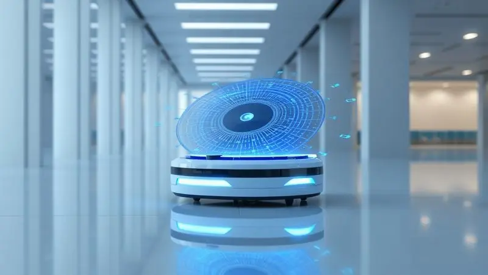

Imagine poder voltar para casa depois de um dia cansativo e encontrar a casa limpa, sem precisar tirar um minuto da sua rotativa. Essa é a promessa dos robôs aspiradores modernos, mas com tantas opções no mercado, como saber qual realmente vai cumprir o combinado?

Desde modelos que se contentam em recolher migalhas até verdadeiros assistentes domésticos que mapeiam a casa, passam pano e ainda cuidam da própria limpeza, fizemos a curadoria dos 12 que realmente valem seu investimento em 2025.

<SummaryList products={frontmatter.top_products} />

## Os 12 Melhores Robôs Aspiradores do Mercado

Se você já cansou de passar o aspirador nos fins de semana, essa lista é para você. Não se trata apenas de tecnologia, mas da liberdade de tempo que esses pequenos robôs podem devolver para o que realmente importa.

### 1. Samsung Jet Bot AI+

<ProductBox 
  title={frontmatter.top_products[0].title} 
  image={frontmatter.top_products[0].image} 
  link={frontmatter.top_products[0].link} 
/>

O que acontece quando você dá olhos e cérebro para um aspirador? Você tem o Jet Bot AI+. Mais do que seguir padrões aleatórios, ele realmente enxerga sua sala, diferenciando entre um brinquedo deixado no chão e uma meia esquecida.

Graças ao seu reconhecimento de objetos, ele circula ao redor do que não deve tocar e se concentra no que deve limpar.

A verdadeira mágica acontece na estação de autoesvaziamento. Você simplesmente esquece que existe um compartimento de pó, porque ele se cuida sozinho por meses a fio.

Imagine só programar a limpeza pela manha antes de sair e voltar para uma casa impecável, sem nenhum trabalho adicional.

<CaixaProsContras>

**Prós:**

- Tecnologia avançada de navegação e reconhecimento de objetos.

- Estação de autoesvaziamento que facilita a manutenção.

- Controle remoto via aplicativo inteligente.

- Boa eficiência na limpeza em diferentes tipos de pisos.

**Contras:**

- Preço pode ser considerado elevado.

- Pode ter dificuldades com pelos longos de animais.

</CaixaProsContras>

### 2. KaBuM! Smart 100

<ProductBox 
  title={frontmatter.top_products[1].title} 
  image={frontmatter.top_products[1].image} 
  link={frontmatter.top_products[1].link} 
/>

Se a ideia de configurar aplicativos e mapas complexos te dá arrepios, o Smart 100 chega como um alívio. Aperte um botão e ele sai limpando, sem exigir que você vire um engenheiro da NASA para operá-lo.

Com apenas 7,4cm de altura, ele esgueira-se sob o sofá e a cama, lugares onde a sujeira adora se esconder.

Por 95 minutos ele trabalha incansavelmente, cobrindo bons metros quadrados antes de precisar de uma recarga. A simplicidade tem seu preço, claro.

Ele não segue um plano inteligente, mas se você precisa de alguém para dar uma geral enquanto está fora, ele cumpre o papel com louvor.

<CaixaProsContras>

**Prós:**

- Ótimo custo-benefício para iniciantes.

- Simplicidade de uso com operação fácil.

- Design compacto que alcança locais difíceis.

- Boa eficiência na coleta de pelos e sujeira.

**Contras:**

- Navegação aleatória pode deixar áreas sem limpeza.

- Não retorna automaticamente para a base de carregamento.

</CaixaProsContras>

### 3. Samsung VR3M

<ProductBox 
  title={frontmatter.top_products[2].title} 
  image={frontmatter.top_products[2].image} 
  link={frontmatter.top_products[2].link} 
/>

Imagine um assistente que aspira e passa pano ao mesmo tempo, como se tivesse duas mãos. O VR3M faz exatamente isso. Enquanto uma parte cuida de sugar a poeira, outra deixa o piso levemente úmido e limpo.

Ele mapeia sua casa com precisão cirúrgica usando LiDAR, permitindo que você diga pelo celular 'limpa apenas a cozinha' enquanto prepara o jantar.

Com autonomia para três horas de trabalho contínuo, ele dá conta de apartamentos inteiros sem pedir licença para recarregar. É sim um investimento, mas pense no tempo que você ganha, que pode ser convertido em um bom filme ou em momentos com a família.

<CaixaProsContras>

**Prós:**

- Funcionalidade 2 em 1 (aspiração e passar pano)

- Mapeamento preciso com sensor LiDAR

- Controle fácil pelo aplicativo SmartThings

- Boa autonomia de até 180 minutos

**Contras:**

- Pode ser considerado caro para algumas pessoas

- Não é tão silencioso durante o funcionamento

</CaixaProsContras>

### 4. Xiaomi S10 Plus

<ProductBox 
  title={frontmatter.top_products[3].title} 
  image={frontmatter.top_products[3].image} 
  link={frontmatter.top_products[3].link} 
/>

Para quem busca limpeza úmida realmente eficaz, o S10 Plus chega com dois discos giratórios que não apenas molham, mas esfregam o chão. Com 4000Pa de sucção, ele não apenas recolhe pó, mas enfrenta migalhas e pequenos detritos que outros deixariam para trás.

A inteligência é outro ponto forte. Sensores 3D evitam que ele entre em carpetes durante a limpeza úmida, prevenindo acidentes. Por duas horas ele segue trabalhando, cobrindo espaços generosos.

Sim, cantos próximos a rodapés podem ser um desafio, mas o trabalho geral é impressionante.

<CaixaProsContras>

**Prós:**

- Limpeza úmida eficaz com mopas giratórios.

- Alta potência de sucção ajustável.

- Navegação precisa com sensores 3D.

- Boa autonomia da bateria para áreas maiores.

**Contras:**

- Dificuldade em limpar cantos e rodapés.

- Falta de uma estação de lavagem para os mopas.

</CaixaProsContras>

### 5. Xiaomi X10

<ProductBox 
  title={frontmatter.top_products[4].title} 
  image={frontmatter.top_products[4].image} 
  link={frontmatter.top_products[4].link} 
/>

Quando a mão livre total é o objetivo, o X10 entrega. Sua base não apenas recarrega, como suga toda a sujeira para um saco de 2,5 litros que você troca a cada mês ou mais.

Aspira e passa pano simultaneamente por 80 minutos, aprendendo o layout da sua casa com laser para nunca repetir caminhos desnecessários.

O controle pelo Mi Home permite agendar limpezas enquanto você trabalha, chegando em casa com os pisos brilhando. Em superfícies lisas, ele é um artista. Em carpetes mais grossos, o desempenho do pano diminui, mas a aspiração continua forte.

<CaixaProsContras>

**Prós:**

- Combinação de aspirador e mop em um só dispositivo.

- Navegação a laser para eficiente mapeamento da casa.

- Base de autodescarregamento para conveniência.

- Duração da bateria adequada para espaços amplos.

**Contras:**

- Desempenho de mopping pode ser insatisfatório em carpetes.

- Algumas unidades apresentaram falhas técnicas.

</CaixaProsContras>

### 6. KaBuM! Smart 700

<ProductBox 
  title={frontmatter.top_products[5].title} 
  image={frontmatter.top_products[5].image} 
  link={frontmatter.top_products[5].link} 
/>

Entre o básico e o premium existe um equilíbrio perfeito, e o Smart 700 o representa. Com mapeamento a laser, ele planeja rotas inteligentes em vez de andar em círculos.

Cinco modos de limpeza significam que seu piso de madeira e seu tapete recebem tratamentos diferentes, cada um com a intensidade adequada.

Comandos de voz tornam a operação quase mágica. 'Alexa, limpe a sala' e ele parte para o trabalho. Os 9,6cm de altura permitem que ele supere pequenos obstáculos, mas podem limitar o acesso sob alguns móveis mais baixos.

<CaixaProsContras>

**Prós:**

- Navegação inteligente com mapeamento a laser.

- Múltiplos modos de limpeza para diferentes necessidades.

- Função de passar pano que aumenta a eficiência.

- Controle via aplicativo e compatibilidade com assistentes de voz.

**Contras:**

- Altura pode limitar o acesso a espaços baixos.

- Nível de sucção poderia ser maior em modelos concorrentes.

</CaixaProsContras>

### 7. Xiaomi Vacuum S20

<ProductBox 
  title={frontmatter.top_products[6].title} 
  image={frontmatter.top_products[6].image} 
  link={frontmatter.top_products[6].link} 
/>

Potência é o sobrenome do S20. Com 5000Pa de sucção, ele enfrenta pelos de animais e sujeira acumulada sem hesitar.

O mapeamento a laser garante que cada centímetro quadrado seja coberto de forma sistemática, sem aquela sensação de que ele está apenas passeando pela casa.

A função de passar pano funciona bem para manutenção diária, deixando um leve brilho nos pisos. Para limpezas mais pesadas, você ainda precisará da mão humana, mas para o dia a dia, ele reduz drasticamente seu trabalho.

<CaixaProsContras>

**Prós:**

- Navegação a laser eficiente para mapeamento do ambiente.

- Potente sucção de até 5000Pa.

- Controle fácil via aplicativo Mi Home.

- Combinação de funções de aspiração e passar pano.

**Contras:**

- A função de passar pano é básica e não substitui uma limpeza manual profunda.

- É necessário esvaziar o compartimento de pó manualmente.

</CaixaProsContras>

### 8. WAP Robot W90

<ProductBox 
  title={frontmatter.top_products[7].title} 
  image={frontmatter.top_products[7].image} 
  link={frontmatter.top_products[7].link} 
/>

Às vezes tudo que você quer é um ajudante simples, sem firulas tecnológicas. O W90 chega como o funcionário dedicado que varre, aspira e passa pano sem reclamar. Com apenas 8cm de altura, ele chega onde outros não conseguem, sob camas e armários baixos.

Por 100 minutos ele segue seu trabalho, com sensores que previnem quedas e colisões. A ausência de aplicativo pode ser vista como uma limitação, mas também como uma libertação para quem não quer mais telas na vida.

<CaixaProsContras>

**Prós:**

- Função 3 em 1: varre, aspira e passa pano.

- Design compacto que alcança áreas difíceis.

- Autonomia adequada para limpezas rápidas.

- Sensores que evitam quedas e colisões.

**Contras:**

- Reservatório pequeno, necessitando esvaziamento frequente.

- Falta de conectividade e base de recarga automática.

</CaixaProsContras>

### 9. Liectroux XR500

<ProductBox 
  title={frontmatter.top_products[8].title} 
  image={frontmatter.top_products[8].image} 
  link={frontmatter.top_products[8].link} 
/>

Para quem não aceita meio-termo, o XR500 chega com 6500Pa de sucção, suficiente para levantar poeira entranhada em tapetes. Ele não apenas mapeia sua casa, como salva até cinco mapas diferentes, perfeito para quem tem mais de uma residência ou divisões bem definidas.

Aspirar e passar pano simultaneamente é sua especialidade, e o retorno automático à base quando a bateria está baixa elimina uma preocupação. Sim, o investimento é significativo, mas o retorno em qualidade de vida também é.

<CaixaProsContras>

**Prós:**

- Potência de sucção impressionante até 6500Pa.

- Navegação precisa com laser e capacidade de criar múltiplos mapas.

- Função dupla de aspirar e passar pano simultaneamente.

- Controle via aplicativo e integração com assistentes de voz.

**Contras:**

- O preço é um pouco elevado para quem busca opções mais econômicas.

- O tempo de carga pode ser longo em comparação com alguns concorrentes.

</CaixaProsContras>

### 10. Ropo Glass 3

<ProductBox 
  title={frontmatter.top_products[9].title} 
  image={frontmatter.top_products[9].image} 
  link={frontmatter.top_products[9].link} 
/>

Saúde em primeiro lugar. O Glass 3 traz uma lâmpada UV que esteriliza o chão enquanto limpa, eliminando ácaros, vírus e bactérias que nossos olhos não veem.

Com 2500Pa de sucção, ele lida bem com sujeira cotidiana enquanto o sistema Wet Clean PRO deixa os pisos levemente úmidos e frescos.

A navegação giroscópica funciona, mas sem salvar o mapeamento, ele pode se perder em espaços maiores. Ainda assim, para quem prioriza um ambiente verdadeiramente higienizado, ele é uma escolha inteligente.

<CaixaProsContras>

**Prós:**

- Esterilização UV inovadora para ambientes mais saudáveis.

- Potência de sucção elevada (até 2500Pa).

- Sistema Wet Clean PRO para passar pano eficazmente.

- Boa autonomia de até 180 minutos.

**Contras:**

- Não salva o mapeamento da casa, podendo afetar a eficiência.

- Pode apresentar problemas de conectividade com o aplicativo em redes específicas.

</CaixaProsContras>

### 11. Xiaomi Robot Vacuum X20+

<ProductBox 
  title={frontmatter.top_products[10].title} 
  image={frontmatter.top_products[10].image} 
  link={frontmatter.top_products[10].link} 
/>

O topo da linha da Xiaomi não brinca em serviço. Com 6000Pa de sucção, ele remove até detritos maiores sem esforço.

Mas a verdadeira estrela é a base inteligente que lava, seca os panos e coleta a poeira, transformando semanas de manutenção em um simples 'trocar o saco uma vez por mês'.

O mapeamento a laser é preciso, e a bateria dura três horas, cobrindo casas grandes sem problemas. Requer algum ajuste manual para detectar carpetes, mas uma vez configurado, trabalha como um profissional.

<CaixaProsContras>

**Prós:**

- Alta potência de sucção (6000Pa) para limpeza eficiente.

- Estação base inteligente que simplifica a manutenção.

- Controle via aplicativo com opções personalizáveis.

- Boa autonomia com até 180 minutos de operação.

**Contras:**

- Pode deixar bordas de carpetes um pouco úmidas.

- Não detecta automaticamente áreas carpetadas, exigindo configuração manual.

</CaixaProsContras>

### 12. Roborock Q7 Max

<ProductBox 
  title={frontmatter.top_products[11].title} 
  image={frontmatter.top_products[11].image} 
  link={frontmatter.top_products[11].link} 
/>

Precisão é a palavra-chave. Com mapeamento LiDAR 3D, o Q7 Max não apenas vê o ambiente, mas entende a profundidade dos objetos.

Os 4200Pa de sucção são mais que suficientes para a maioria das casas, e a função de esfregação com 30 níveis de água permite ajustar para cada tipo de piso.

A versão Max+ com base auto-esvaziante elimina completamente o contato com a sujeira. Em carpetes com muitos pelos, pode precisar de passadas extras, mas em pisos duros, ele é praticamente perfeito.

<CaixaProsContras>

**Prós:**

- Potente sucção de 4200Pa.

- Navegação LiDAR com mapeamento 3D.

- Versatilidade com função de esfregão.

- Base auto-esvaziante disponível na versão Max+.

**Contras:**

- Eficiência limitada em carpetes com pelos.

- Dificuldade em coletar sujeira em algumas situações.

</CaixaProsContras>

## Como escolher o melhor robô aspirador?

Olhar para números e especificações técnicas é importante, mas mais crucial é entender como cada característica se traduz no seu dia a dia.

Potência de sucção, por exemplo, não é apenas um número, mas a garantia de que a areia que seu cachorro traz para dentro não vai se acumular nos cantos.

Pense na autonomia como o tempo que você ganha para si mesmo. Quanto mais tempo o robô trabalha sozinho, menos você precisa se preocupar em recarregá-lo no meio da limpeza.

Conectividade inteligente significa controle total pelo celular, permitindo que você inicie uma limpeza quando perceber que esqueceu de ligar o robô ao sair de casa.

Mas o segredo está no equilíbrio. Não adianta escolher o modelo mais potente se ele não cabe sob seus móveis. Nem o mais inteligente se você não quer lidar com aplicativos complicados.

Observe os produtos que destacamos e pergunte-se: quais dessas funcionalidades realmente vão fazer diferença na minha rotina?

## Conclusão

Escolher um robô aspirador em 2025 é menos sobre comprar um eletrodoméstico e mais sobre adquirir tempo de qualidade.

Tempo que você não gastará empurrando um aspirador, mas que poderá investir em um hobby, em um momento com a família ou simplesmente descansando depois de um dia intenso.

Dos 12 modelos que analisamos, cada um tem sua personalidade. Alguns são tecnológicos e quase pensantes, como o Samsung Jet Bot AI+. Outros são práticos e diretos ao ponto, como o KaBuM! Smart 100.

Há os que se dedicam à saúde do seu lar, como o Ropo Glass 3 com sua esterilização UV, e os que prometem mão livre total, como o Xiaomi X20+ com sua base que faz tudo sozinha.

O segredo não está em encontrar o 'melhor' em termos absolutos, mas o melhor para a sua vida. Para sua casa com seus móveis, seu piso, seus animais de estimação e, principalmente, sua rotina.

Porque no final, o verdadeiro luxo que um robô aspirador oferece não é tecnologia, mas liberdade. Liberdade para viver em um espaço limpo sem que isso custe seu precioso tempo.

Qual deles vai se encaixar na sua vida? A resposta está menos nas especificações técnicas e mais em como você imagina seus próximos fins de semana: limpando a casa ou aproveitando-a?