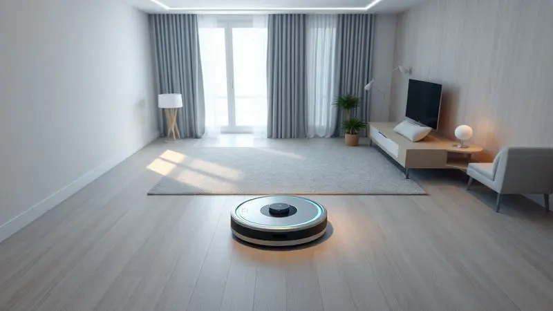
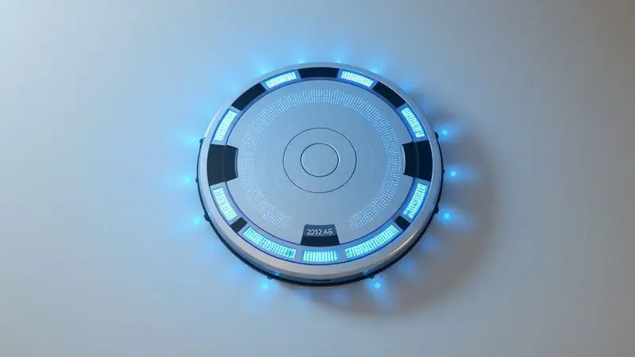
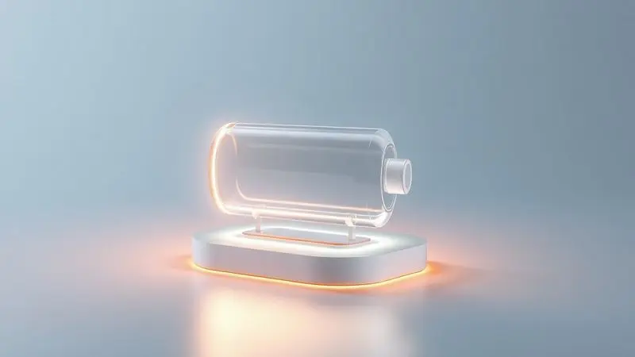
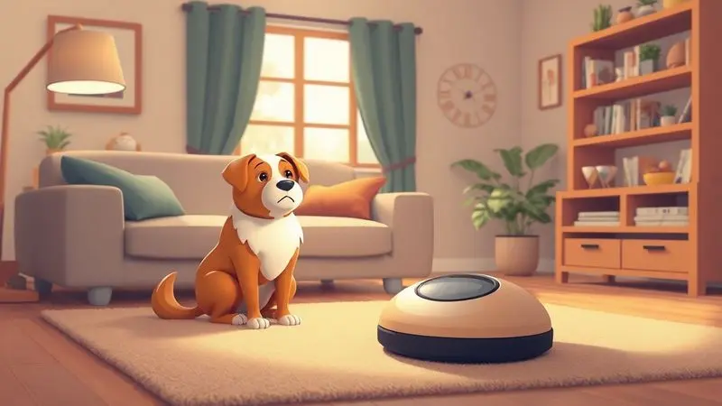

Ter a casa limpa sem esforço é o sonho de qualquer pessoa, e os robôs aspiradores tornaram isso uma realidade acessível.

Com o avanço da tecnologia, esses dispositivos deixaram de ser itens de luxo para se tornarem aliados indispensáveis na rotina doméstica, sendo capazes de aspirar, varrer e até passar pano de forma autônoma.

No entanto, com tantas opções de marcas consagradas como Wap, Xiaomi e Electrolux, escolher o modelo ideal pode ser um desafio.

Neste guia completo, analisamos os melhores aspiradores robô de 2025, destacando suas funcionalidades, potência e custo-benefício para ajudar você a encontrar o parceiro perfeito para a limpeza do seu lar.

<SummaryList products={frontmatter.top_products} />

## Melhores aspiradores robô para comprar online

Na hora de escolher um aspirador robô, é fundamental considerar a eficiência de limpeza, a autonomia da bateria e as funcionalidades adicionais. Modelos populares como Wap e Xiaomi oferecem boas opções para facilitar a rotina de limpeza.

### 1. Aspirador Robô XR500 – Liectroux

<ProductBox 
  title={frontmatter.top_products[0].title} 
  image={frontmatter.top_products[0].image} 
  link={frontmatter.top_products[0].link} 
/>

Imaginar um companheiro de limpeza que faz tudo sem que você precise nem pensar? O XR500 da Liectroux entrega exatamente isso com sua tecnologia 3 em 1, que executa varredura, aspiração e passagem de pano simultaneamente.

A verdadeira mágica acontece com a navegação a laser, que permite que ele mapeie cada cantinho da sua casa como um arquiteto digital, criando percursos inteligentes que garantem cobertura total.

Com seu motor que varia entre 4000 e 6500 Pa, a potência se adapta automaticamente conforme o piso, fazendo dos tapetes e pelos de animais alvos fáceis. A bateria de 2 horas dá conta tranquila de casas com até 230 m².

O controle via aplicativo e a integração com Alexa e Google Assistente fazem com que pedir uma limpeza seja tão simples quanto pedir música ou uma receita.

<CaixaProsContras>

**Prós:**

- Limpeza 3 em 1 (varre, aspira e passa pano)

- Tecnologia de navegação a laser para mapeamento eficiente

- Controle via aplicativo e assistentes de voz

- Alta potência de sucção adaptável a diferentes pisos

**Contras:**

- Preço mais elevado em comparação a modelos básicos

- Bateria pode não ser suficiente para casas muito grandes

</CaixaProsContras>

### 2. Aspirador Robô W 90 – Wap

<ProductBox 
  title={frontmatter.top_products[1].title} 
  image={frontmatter.top_products[1].image} 
  link={frontmatter.top_products[1].link} 
/>

Para quem busca uma solução simples que resolve 90% dos problemas de limpeza diária, o W 90 da Wap aparece como um parceiro discreto e eficiente.

Suas três funções combinadas cuidam da sujeira básica, enquanto os três modos de limpeza se adaptam ao que você precisa naquele momento.

Os sensores infravermelhos trabalham como protetores invisíveis, evitando quedas e colisões com seus móveis favoritos. Com apenas 8 cm de altura, ele desliza por debaixo daquela estante baixa onde sempre acumula poeira.

A autonomia entre 1h20 e 1h40 é suficiente para apartamentos e casas médias, permitindo que você se concentre em outras coisas enquanto ele cuida do piso.

<CaixaProsContras>

**Prós:**

- Três funções em um só aparelho (varre, aspira e passa pano).

- Sensores antiqueda e de colisão aumentam a segurança.

- Design compacto que alcança lugares difíceis.

- Boa autonomia de bateria para limpezas diárias.

**Contras:**

- A função passar pano pode necessitar de produtos adicionais para melhor eficácia.

- Não possui mapeamento inteligente, podendo falhar em algumas áreas durante a limpeza.

</CaixaProsContras>

### 3. Aspirador Robô Mars 30W – Multilaser

<ProductBox 
  title={frontmatter.top_products[2].title} 
  image={frontmatter.top_products[2].image} 
  link={frontmatter.top_products[2].link} 
/>

Vive com pets e quer uma solução que não exige curva de aprendizado tecnológico? O Mars 30W da Multilaser é como ter um limpador dedicado que simplesmente funciona.

Sua capacidade trifuncional atende pisos frios, madeira e tapetes baixos, enquanto as 2 horas de autonomia garantem que ele complete o serviço sem precisar de microgerenciamento.

O sistema anti-queda é seu seguro contra acidentes domésticos, e as escovas laterais asseguram que os cantos daquele corredor estreito também fiquem impecáveis.

Para lares com animais, essa simplicidade eficiente significa menos preocupação e mais tempo para os momentos importantes.

<CaixaProsContras>

**Prós:**

- Multifuncional: varre, aspira e passa pano.

- Boa autonomia de bateria.

- Sistema anti-queda para maior segurança.

- Ideal para casas com animais de estimação.

**Contras:**

- Sem mapeamento da casa.

- Falta de controle via aplicativo.

</CaixaProsContras>

### 4. Aspirador Robô – Electrolux

<ProductBox 
  title={frontmatter.top_products[3].title} 
  image={frontmatter.top_products[3].image} 
  link={frontmatter.top_products[3].link} 
/>

Às vezes, o que realmente importa é a durabilidade da limpeza, não apenas a velocidade. Com o ERB30 da Electrolux e suas 2h20min de autonomia, você consegue limpezas profundas que cobrem cada cômodo sem pressa.

Seu design compacto é especialista em alcançar aqueles espaços sob os móveis onde normalmente só chega a poeira do tempo.

A simplicidade do controle remoto transforma a operação em algo intuitivo, perfeito para quem valoriza praticidade sem complicações. É aquele tipo de ferramenta doméstica que você configura uma vez e depois esquece que está lá trabalhando por você.

<CaixaProsContras>

**Prós:**

- Boa autonomia de bateria

- Design compacto que alcança espaços baixos

- Fácil de usar com controle remoto

- Manutenção simples

**Contras:**

- Navegação sem mapeamento inteligente

- Ausência de app para controle remoto em alguns modelos

</CaixaProsContras>

### 5. Aspirador Robô W300 – WAP

<ProductBox 
  title={frontmatter.top_products[4].title} 
  image={frontmatter.top_products[4].image} 
  link={frontmatter.top_products[4].link} 
/>

Para famílias que lidam com alergias, a limpeza vai além da estética. O W300 da WAP entende isso com seu filtro HEPA que captura até 99,97% das partículas suspensas, transformando o ato de aspirar em um ato de cuidado com a saúde respiratória de todos em casa.

Os cinco modos de limpeza controlados por controle remoto fazem dele um verdadeiro especialista adaptativo, enquanto os sensores de segurança garantem que ele navegue sozinho sem criar situações de risco.

Com organização para o tempo de carregamento, ele se torna um aliado silencioso na busca por um ar mais puro.

<CaixaProsContras>

**Prós:**

- Sensores antiqueda e anticolisão que garantem segurança.

- Múltiplos modos de limpeza adaptáveis às necessidades.

- Filtro HEPA que ajuda a melhorar a qualidade do ar.

- Design compacto que facilita o acesso a diferentes ambientes.

**Contras:**

- O tempo de carregamento pode ser considerado longo para alguns usuários.

- Não possui agendador de horários para limpeza automática.

</CaixaProsContras>

### 6. Aspirador Robô 2C 40W – Xiaomi

<ProductBox 
  title={frontmatter.top_products[5].title} 
  image={frontmatter.top_products[5].image} 
  link={frontmatter.top_products[5].link} 
/>

Quando você quer tecnologia que parece do futuro, mas com preço do presente, o Mi Robot Vacuum-Mop 2C da Xiaomi é a resposta. Sua navegação visual dinâmica cria mapas inteligentes da sua casa que o fazem evitar obstáculos com a desenvoltura de quem conhece cada móvel.

Os 2.200 Pa de sucção lidam com a sujeira do dia a dia, enquanto a função de passar pano com controle de água em três níveis dá aquele acabamento extra que faz diferença.

O controle via app permite criar zonas específicas, como se você pudesse sinalizar mentalmente: "aqui precisa de mais atenção".

<CaixaProsContras>

**Prós:**

- Boa potência de sucção.

- Função de passar pano inclusa.

- Conectividade via aplicativo.

- Navegação inteligente e detecção de obstáculos.

**Contras:**

- Pode faltar algumas funcionalidades avançadas encontradas em modelos mais caros.

- Capacidade do reservatório de água é limitada.

</CaixaProsContras>

### 7. Aspirador Robô 1200 40W – Midea

<ProductBox 
  title={frontmatter.top_products[6].title} 
  image={frontmatter.top_products[6].image} 
  link={frontmatter.top_products[6].link} 
/>

Lidar com pelos de animais muitas vezes parece uma batalha perdida, mas o 1200 da Midea chega como reforço especializado.

Sua escova central é projetada especialmente para capturar cabelos e pelos sem embaraçar, enquanto o filtro HEPA retém 99.9% dos alérgenos que tanto incomodam.

A tecnologia Easy Climbing transforma pequenos obstáculos e desníveis em desafios a serem superados, não em barreiras.

Mesmo com uma potência que alguns podem achar modesta para espaços muito extensos, sua eficiência direcionada para problemas específicos faz dele um solucionador de verdadeiras dores domésticas.

<CaixaProsContras>

**Prós:**

- Excelente autonomia de até 100 minutos.

- Sistema eficaz contra pelos de animais.

- Sensores inteligentes para evitar acidentes.

- Filtro HEPA que captura alérgenos.

**Contras:**

- Potência poderia ser maior para ambientes extensos.

- Não possui algumas funções avançadas encontradas em modelos premium.

</CaixaProsContras>

### 8. Aspirador Robô Fast Clean Advanced 40W – Mondial

<ProductBox 
  title={frontmatter.top_products[7].title} 
  image={frontmatter.top_products[7].image} 
  link={frontmatter.top_products[7].link} 
/>

Em casas onde o espaço é precioso, cada centímetro conta. O Fast Clean Advanced da Mondial, com seus 8,5 cm de altura, parece ter sido projetado especificamente para aqueles espaços impossíveis sob camas baixas e móveis modernos.

O filtro HEPA que remove 99.5% dos ácaros trabalha em silêncio para melhorar sua qualidade de vida, enquanto o retorno automático à base significa que ele gerencia sua própria logística.

O tempo de recarga pode parecer longo, mas é o preço de ter um limpador que alcança onde outros nem tentam.

<CaixaProsContras>

**Prós:**

- Design compacto que alcança áreas difíceis.

- Várias funções em um único dispositivo.

- Filtro HEPA para limpeza eficiente do ar.

- Retorno automático à base de carregamento.

**Contras:**

- Tempo de recarga pode ser longo.

- Potência limitada em comparação com aspiradores tradicionais.

</CaixaProsContras>

### 9. Aspirador Robô Roomba 675 – iRobot

<ProductBox 
  title={frontmatter.top_products[8].title} 
  image={frontmatter.top_products[8].image} 
  link={frontmatter.top_products[8].link} 
/>

Há marcas que se tornam sinônimo de categoria, e a iRobot é uma delas no mundo dos robôs aspiradores. O Roomba 675 mantém essa tradição com sua limpeza de três estágios que funciona igualmente bem em carpetes e superfícies duras.

A tecnologia Dirt Detect™ é como dar olhos especiais ao robô, permitindo que ele identifique áreas que precisam de atenção extra. A integração com Alexa e Google Assistant faz com que pedir uma limpeza rápida seja tão natural quanto perguntar a previsão do tempo.

A navegação pode não ser a mais sofisticada, mas conhece seu ofício.

<CaixaProsContras>

**Prós:**

- Conectividade Wi-Fi e controle por voz.

- Limpeza eficiente em diferentes superfícies.

- Tecnologia Dirt Detect™ para áreas mais sujas.

- Compacto, permitindo acesso a espaços menores.

**Contras:**

- Navegação sem mapeamento inteligente.

- Requer manutenção regular de peças.

</CaixaProsContras>

### 10. Aspirador Robô 2000Pa – Eufy

<ProductBox 
  title={frontmatter.top_products[9].title} 
  image={frontmatter.top_products[9].image} 
  link={frontmatter.top_products[9].link} 
/>

Às vezes, a simplicidade inteligente é a melhor solução. A linha RoboVac da Eufy prova isso com modelos como o 11S MAX, que oferece 100 minutos de limpeza consistente em pisos duros, lidando bem com pelos de animais sem complicações desnecessárias.

Seu design fino é a chave para alcançar aqueles espaços que normalmente acumulam poeira esquecida. Para quem busca uma solução completa, modelos como o G10 Hybrid combinam aspiração e passagem de pano em um pacote coeso.

A ausência de Wi-Fi em alguns modelos não diminui sua eficácia, apenas mantém o foco no essencial.

<CaixaProsContras>

**Prós:**

- Poder de sucção eficiente de 2000Pa.

- Design fino que alcança lugares difíceis.

- Boa autonomia de até 100 minutos.

- Opções que combinam aspiração e passagens de pano.

**Contras:**

- Alguns modelos podem ser mais barulhentos em operação.

- A conectividade Wi-Fi não está disponível em todos os modelos.

</CaixaProsContras>

### 11. Aspirador Robô Mijia LDS S50 Geração 2 – Xiaomi

<ProductBox 
  title={frontmatter.top_products[10].title} 
  image={frontmatter.top_products[10].image} 
  link={frontmatter.top_products[10].link} 
/>

Quando a precisão é requisito fundamental, o Roborock S50 (também conhecido como Mijia LDS S50) mostra por que a navegação a laser ainda é padrão ouro.

Seu mapeamento em 360 graus faz com que ele conheça seu ambiente melhor do que você mesmo, planejando rotas que economizam tempo e bateria.

Os 2.000 Pa de sucção são mais do que suficientes para pisos duros, enquanto o modo turbo dá um empurrão extra nos carpetes. A função de passar pano com distribuição uniforme de água e a autonomia de 2,5 horas fazem dele um verdadeiro workhorse doméstico.

Só fique atento com superfícies muito escuras, onde seus sensores podem se confundir.

<CaixaProsContras>

**Prós:**

- Mapeamento e navegação inteligente

- Alto poder de sucção em pisos duros

- Função de passar pano integrada

- Boa autonomia de bateria

**Contras:**

- Desempenho médio em carpetes

- Pode ter problemas com superfícies escuras

</CaixaProsContras>

## O que é um aspirador robô?

Imagine um companheiro de casa silencioso que sabe exatamente onde andar, o que limpar e quando parar para recarregar.

Eis o conceito por trás dos aspiradores robô, dispositivos autônomos que transformam a tarefa tediosa de limpar pisos em algo que acontece quase magicamente enquanto você vive sua vida.

Equipados com sensores que funcionam como sentidos eletrônicos, eles navegam por seus ambientes identificando obstáculos, evitando quedas e mapeando o território.

Através de programações simples ou aplicativos intuitivos, você define quando quer que ele trabalhe, permitindo que acorde com a casa limpa ou volte do trabalho para pisos impecáveis.

Alguns modelos vão além, incorporando a função de passar pano para entregar uma limpeza completa. Em essência, são soluções modernas que devolvem tempo e energia para o que realmente importa.

## Como Funciona um Aspirador Robô

A magia acontece através de uma combinação de sensores, inteligência e mecânica precisa. Sensores infravermelhos ou a laser mapeam o ambiente, criando um mapa mental do espaço enquanto detectam obstáculos e desníveis.

Isso permite que o robô navegue como se tivesse memorizado cada móvel e parede.

Sistemas de escovas giram para deslocar a sujeira em direção ao centro, onde a sucção a captura e armazena em um reservatório. Quando a bateria começa a fraquejar, muitos modelos retornam automaticamente à base para recarregar, retomando a limpeza de onde pararam.

Controles via aplicativo transformam seu smartphone em um centro de comando, permitindo agendar limpezas, definir áreas específicas ou simplesmente monitorar o progresso. É automação doméstica em sua forma mais prática.

## Tipos de Aspiradores Robô

Diferentes necessidades exigem diferentes parceiros de limpeza. Os modelos básicos focam no essencial: varrer e aspirar com eficiência, perfeitos para quem quer praticidade sem distrações tecnológicas.

Os avançados incorporam mapeamento inteligente que memoriza o layout da sua casa, otimizando cada trajeto e garantindo que nenhum centímetro fique esquecido.

Para quem busca tudo em um só aparelho, os modelos com função de passar pano combinam limpeza seca e úmida em uma única passada.

Casas com animais de estimação encontram aliados especializados em modelos com sucção potente e escovas projetadas para capturar pelos sem embaraçar. A escolha certa começa entendendo não apenas seu espaço, mas sua rotina e prioridades.

## Como escolher o melhor aspirador robô

Escolher é mais sobre entender sua realidade do que sobre especificações técnicas. Comece identificando seus maiores incômodos: é a poeira que piora sua alergia? São os pelos do pet que invadem cada móvel? É aquela migalha do café da manhã que sempre some sob a mesa?

A potência de sucção deve corresponder às suas superfícies e tipo de sujeira. A autonomia da bateria precisa bater com o tamanho dos seus ambientes. Funcionalidades como programação e controle via app são luxos necessários ou distrações desnecessárias?

Cada característica precisa servir a um propósito concreto na sua vida. A melhor escolha é aquela que desaparece na rotina, trabalhando tão bem que você quase esquece que ela existe.

### Funções

Além da aspiração básica que todos oferecem, observe funções que resolvam problemas específicos. Sensores de sujeira que fazem o robô limpar mais intensamente em áreas problemáticas. Controle por aplicativo que permite criar paredes virtuais para áreas proibidas.

Adaptação automática a diferentes pisos que ajusta potência conforme a superfície. E claro, a combinação com passagem de pano para quem busca limpeza completa. Cada função extra deve traduzir em menos trabalho manual ou melhor resultado final.

### Bateria

Pense na bateria não como um número, mas como liberdade. De 60 a 120 minutos de operação significam diferentes coberturas: apartamentos compactos versus casas espaçosas.

A eficiência real depende do tipo de piso e da sujeira, mas modelos com retorno automático à base transformam limitações em autogestão.

O verdadeiro diferencial é quando o robô entende que precisa recarregar, volta sozinho e, se necessário, retoma exatamente de onde parou. É autonomia que realmente funciona a seu favor.

### Altura

Essa característica muitas vezes negligenciada define quais espaços serão realmente limpos. Entre 7 e 9 centímetros é a zona ideal para alcançar sob a maioria dos móveis modernos, aqueles lugares onde a poeira se acumula por meses.

Modelos mais altos podem oferecer capacidades técnicas adicionais, mas sacrificam acesso. A pergunta certa é: prefere um robô que limpa tudo, inclusive sob os móveis, ou um mais potente que limpa bem as áreas acessíveis?

### Capacidade do reservatório

Um reservatório maior significa menos interrupções para esvaziar, especialmente importante em casas grandes ou com pets que soltam muitos pelos. De 300ml a 600ml, a diferença pode ser entre esvaziar diariamente ou a cada dois ou três dias.

Modelos menores são mais compactos e leves, mas exigem atenção mais frequente. A escolha reflete sua preferência entre conveniência de manutenção e praticidade de armazenamento.

### Funções Extras

Aqui moram os diferenciais que transformam utensílios em assistentes pessoais. Agendamento que faz o robô limpar enquanto você trabalha. Integração com assistentes de voz que permite comandos por voz. Sensores que evitam quedas em escadas.

Funções de mop que combinam limpeza seca e úmida. Cada extra deve trazer uma camada adicional de automação que libera sua atenção para outras coisas.

## Qual a melhor marca de robô aspirador e passa pano?

Marcas não competem apenas em tecnologia, mas em filosofia. A Xiaomi representa a acessibilidade inteligente, oferecendo funcionalidades premium a preços que não assustam. É inovação democratizada.

A Wap é sinônimo de robustez que enfrenta superfícies desafiadoras sem hesitar. Já a iRobot com sua linha Roomba é sobre tradição e refinamento, com funções de navegação que são referência no setor.

Cada uma entende um tipo diferente de dono de casa. A melhor é aquela cuja abordagem combina com seu estilo de vida e expectativas.

## Melhor Robô aspirador e passa pano custo-benefício

Custo-benefício não significa o mais barato, mas o que entrega mais valor pelo investimento. Procure modelos que combinem as funções que você realmente usará com uma durabilidade que justifique o preço.

Controle via aplicativo que realmente facilita a vida, autonomia suficiente para cobrir seus espaços, e eficiência comprovada nas superfícies da sua casa. Avaliações de outros usuários são ouro, revelando como o produto performa no mundo real, não apenas no laboratório.

## Perguntas frequentes

As dúvidas mais comuns revelam preocupações reais que vão além das especificações técnicas. Aqui estão respostas para questões que realmente importam na hora da decisão.

### Qual é o melhor aspirador robô para quem tem animais?

Animais de estimação criam desafios específicos: pelos que se embaraçam, sujeira que gruda, e alérgenos que circulam. Procure modelos com escovas antiembaraçamento que não travam com fios de cabelo ou pelos.

Sucção potente (acima de 2000Pa) para capturar pelas escondidos nos carpetes. Filtro HEPA para reter alérgenos e melhorar a qualidade do ar. E autonomia suficiente para cobrir a área onde seus pets circulam mais.

Alguns modelos têm até modos específicos para pet hair. A escolha certa significa menos alergias, menos limpeza manual e mais tempo para brincar com seu companheiro.

### Aspirador robô é barulhento?

Os níveis variam tanto quanto os modelos. Entre 50 e 70 decibéis é o comum, equivalente a uma conversa normal ou um micro-ondas funcionando. Modelos mais avançados com tecnologia de redução de ruído são quase imperceptíveis, especialmente em horários noturnos.

Se o som for uma preocupação (para quem trabalha em casa ou tem bebês dormindo), verifique especificações de ruído e considere modelos que priorizam operação silenciosa. Muitos permitem agendar limpezas para quando você não está, resolvendo o problema pelo timing.

## Conclusão

Encontrar o melhor aspirador robô é uma jornada de autoconhecimento doméstico. Não se trata apenas de comparar especificações técnicas, mas de entender qual modelo compreende suas necessidades específicas e se integra naturalmente à sua rotina.

Os destaques estão bem distribuídos: o XR500 da Liectroux para quem busca tecnologia de ponta e automação completa, o Mars 30W da Multilaser para lares com pets que precisam de simplicidade eficiente, e o W300 da WAP para famílias que priorizam qualidade do ar e saúde respiratória.

Mas a verdadeira escolha começa quando você identifica qual dor doméstica mais pesa no seu dia a dia. É a poeira que piora suas alergias? Os pelos do pet que dominam cada superfície? Ou simplesmente o cansaço de sempre precisar lembrar de limpar?

Cada modelo analisado representa uma solução diferente para problemas reais.

A magia acontece quando encontramos aquele que parece ter sido projetado exatamente para nossa realidade particular, transformando uma tarefa repetitiva em um hábito automático que melhora nossa qualidade de vida quase sem percebermos.

O verdadeiro teste não está nas especificações, mas na sensação de chegar em casa e encontrar os pisos como você gostaria que estivessem, sem ter feito esforço nenhum. É essa liberdade que esses pequenos gigantes oferecem - mais tempo para o que realmente importa.