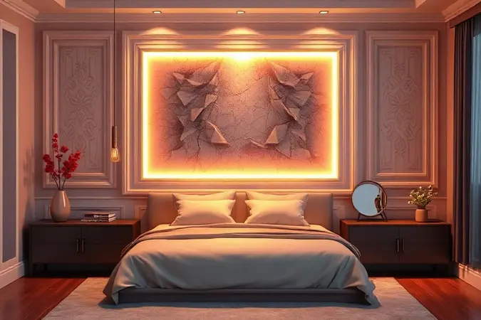
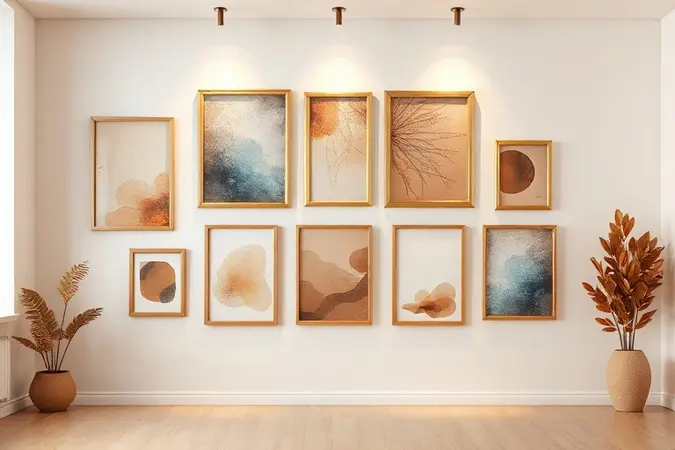
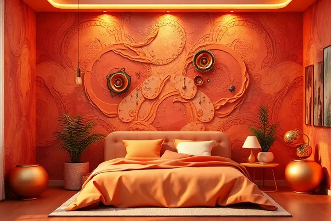

Você sente que seu quarto está sem personalidade, mesmo com móveis bonitos e organizados?

Às vezes, o segredo para transformar um ambiente de dormir em um verdadeiro refúgio está justamente naquele espaço vazio logo acima da cabeceira da cama, que deveria ser o ponto focal do cômodo, mas muitas vezes fica esquecido.

Imagine acordar todos os dias e seu primeiro olhar do dia encontrar não uma parede vazia, mas uma expressão genuína do que você ama, do que te inspira, do que te faz sentir em casa.

É nesse território que a magia acontece, e é por isso que reunimos aqui inspirações que vão desde soluções econômicas de DIY até projetos sofisticados de marcenaria, sempre com um olhar atento às proporções que harmonizam e às regras que garantem segurança.

Prepare-se para descobrir como transformar esse espaço em um retrato autêntico da sua personalidade.

<SummaryList products={frontmatter.top_products} />

## Por que a Parede em Cima da Cama é o Ponto Focal do Quarto?

Assim que você entra em um quarto, para onde seus olhos vão naturalmente? Provavelmente para a parede logo acima da cama, que se torna o palco principal do ambiente.

Esse não é apenas um ponto decorativo, mas o coração emocional do espaço, capaz de definir o clima antes mesmo que você pise no tapete. Pense nela como a moldura da sua vida de descanso, o cenário que te recebe ao final do dia e que dá as boas-vindas pela manhã.

Quando bem explorada, essa área pode transmitir aconchego, elegância ou minimalismo, servindo como uma tela em branco para que sua criatividade e gosto pessoal se expressem livremente, garantindo que cada detalhe do seu quarto conte uma história verdadeiramente sua.

## Como Planejar a Decoração: Regras de Proporção e Altura

Antes de começar a pendurar qualquer coisa, existe um segredo que separa uma decoração harmoniosa de uma que parece deslocada: a proporção. Já parou para pensar naquela distância que faz a arte respirar sem parecer que está flutuando no vácuo?

Normalmente, obras de arte ou prateleiras encontram seu ponto ideal entre 20 a 30 cm acima do cabeceira, criando uma relação visual que conecta os elementos sem sufocar o espaço.

É como encontrar o tom certo em uma música, nem muito agudo, nem muito grave, apenas perfeito para os olhos.

### 1. Composições de Quadros e Gallery Walls

<ProductBox 
  title={frontmatter.top_products[0].title} 
  image={frontmatter.top_products[0].image} 
  link={frontmatter.top_products[0].link} 
/>

Se você é do tipo que acredita que uma única imagem pode contar uma história, imagine o poder de várias delas trabalhando em harmonia.

Compor uma galeria na parede acima da cama é como criar um diário visual do que te move, seja através de quadros abstratos que provocam a imaginação, paisagens que transportam para outros lugares ou fotografias pessoais que guardam memórias afetivas.

A liberdade criativa aqui é total, permitindo combinar diferentes tamanhos e molduras em uma coreografia única. Uma única peça grande pode estabelecer um foco poderoso, enquanto múltiplas obras oferecem um ritmo dinâmico ao espaço.

O segredo está no equilíbrio do conjunto, mantendo aquela distância aconchegante da cabeceira que mencionamos, criando uma conexão visual que parece orgânica.

E para quem tem receio de comprometer a parede com furos, soluções como ganchos adesivos oferecem flexibilidade, ainda que limitem um pouco o jogo de posicionamento que os métodos tradicionais permitem.

### 2. Papéis de Parede: Texturas e Estampas Impactantes

<ProductBox 
  title={frontmatter.top_products[1].title} 
  image={frontmatter.top_products[1].image} 
  link={frontmatter.top_products[1].link} 
/>

Depois de explorar o mundo das molduras, que tal dar um passo além e vestir toda a parede com personalidade? Os papéis de parede contemporâneos são verdadeiras declarações de estilo, trazendo texturas que convidam ao toque e estampas que contam histórias.

Imagine acordar envolto por texturas naturais que imitam linho ou bambu, oferecendo um abraço visual aconchegante, ou sendo recebido por padrões geométricos que injetam um sopro de modernidade no ambiente.

Para quem busca uma atmosfera rústica com um toque urbano, as imitações de madeira e pedra criam camadas de profundidade que transformam completamente a percepção do espaço. E se você ama um ar nostálgico, os florais retrô estão tendo seu momento glorioso.

A instalação pode demandar um cuidado especial, é verdade, mas o resultado final, essa transformação radical do ambiente em um espaço que é exclusivamente seu, costuma valer cada minuto investido.

### 3. Espelhos para Ampliar e Iluminar o Ambiente

<ProductBox 
  title={frontmatter.top_products[2].title} 
  image={frontmatter.top_products[2].image} 
  link={frontmatter.top_products[2].link} 
/>

Se a ideia de modificar a superfície da parede não te atrai tanto, os espelhos oferecem uma solução elegante que vai além da estética.

Pense em como um espelho grande posicionado estrategicamente pode fazer um quarto pequeno parecer mais amplo, respirável, ao mesmo tempo que captura e multiplica a luz natural, banhando o ambiente em uma luminosidade suave.

Eles se tornam pontos focais sofisticados, especialmente quando escolhidos em formatos inusitados, como os redondos, ou emoldurados com detalhes que conversam com o resto da decoração.

Um conselho valioso do Feng Shui é evitar posicioná-lo de forma que reflita diretamente a cama, para não gerar desconforto durante o sono.

Quando usado com sabedoria, especialmente combinado com iluminação embutida que emite uma luz ambiente convidativa, o espelho se transforma em um aliado poderoso para criar um santuário de relaxamento.

### 4. Elementos Têxteis: Tapeçarias, Macramê e Tecidos

<ProductBox 
  title={frontmatter.top_products[3].title} 
  image={frontmatter.top_products[3].image} 
  link={frontmatter.top_products[3].link} 
/>

Para quem busca aquela sensação física de aconchego que ultrapassa o visual, os elementos têxteis são a resposta. Eles trazem para a parede a textura que seus dedos reconhecem, o calor que seu corpo sente.

Tapeçarias funcionam como quadros tácteis ou mesmo como cabeceiras alternativas, adicionando não só beleza visual, mas uma camada de conforto térmico que torna o ambiente genuinamente acolhedor.

Já o macramê, com seus nós artesanais e padrões intrincados, adiciona um charme boêmio e orgânico, perfeito para suspender plantas ou simplesmente como uma peça escultural.

Essas opções, sejam em algodão, linho ou fibras naturais, oferecem uma flexibilidade decorativa impressionante, moldando a estética do quarto enquanto criam uma atmosfera que parece literalmente te envolver em um abraço aconchegante e personalizado.

### 5. Prateleiras e Nichos: Beleza e Funcionalidade

<ProductBox 
  title={frontmatter.top_products[4].title} 
  image={frontmatter.top_products[4].image} 
  link={frontmatter.top_products[4].link} 
/>

E se a decoração também pudesse organizar sua vida? Prateleiras e nichos resolvem esse dilema com elegância, transformando a parede acima da cama em uma estante viva que exibe seus livros favoritos, objetos com significado e verdes que respiram vida no ambiente.

Desde prateleiras finas e discretas que emolduras parecem flutuar, até nichos em formatos lúdicos, como pequenas casinhas ou colmeias, que adicionam uma dose de charme e personalidade.

A instalação de modelos mais robustos exige atenção para garantir que tudo esteja seguro e estável, mas a recompensa é um espaço não apenas mais bonito, mas também mais funcional e verdadeiramente seu.

E quando iluminação embutida entra em cena, criando jogos de luz e sombra, a atmosfera do seu refúgio noturno atinge um novo patamar de aconchego.

### 6. Iluminação Estratégica com Arandelas e Pendentes

<ProductBox 
  title={frontmatter.top_products[5].title} 
  image={frontmatter.top_products[5].image} 
  link={frontmatter.top_products[5].link} 
/>

A luz certa tem o poder de reescrever a história de um ambiente. Iluminação estratégica não serve apenas para enxergar, mas para sentir.

Arandelas fixadas na parede, especialmente quando posicionadas na altura ideal (geralmente entre 2,00m e 2,20m do chão), projetam uma luz que acaricia texturas e destaca obras de arte, criando camadas visuais que tornam o espaço multidimensional.

São perfeitas para aquele momento de leitura antes de dormir, oferecendo um foco suave que não agride os olhos.

Os pendentes, por sua vez, são esculturas luminosas que direcionam a luz para baixo em um cone aconchegante, funcionando como pontos focais decorativos por si só.

Combinar esses dois tipos permite que você personalize a atmosfera do quarto, ajustando-a para momentos de concentração, relaxamento ou romance, tudo com o simples toque em um interruptor.

### 7. Cabeceiras de Parede Inteira e Painéis de Marcenaria

<ProductBox 
  title={frontmatter.top_products[6].title} 
  image={frontmatter.top_products[6].image} 
  link={frontmatter.top_products[6].link} 
/>

Para uma transformação que integra totalmente a cama ao ambiente, as cabeceiras de parede inteira e os painéis de marcenaria são a definição de sofisticação integrada.

Imagine o conforto de se apoiar não em um simples cabeceira, mas em uma estrutura sólida e aconchegante enquanto lê ou assiste a um filme.

Esses elementos vão além do estético, protegendo a parede e oferecendo oportunidades inteligentes de organização com prateleiras ou nichos embutidos.

A personalização é o grande trunfo aqui, permitindo que a peça seja feita sob medida em madeira, MDF ou revestida com tecidos, garantindo uma harmonia perfeita com o restante do quarto.

Embora o investimento possa ser maior, o resultado é um ambiente coeso e luxuoso que parece ter saído das páginas de uma revista, mas que carrega a assinatura única do seu gosto.

### 8. Pinturas Geométricas e Adesivos Criativos

<ProductBox 
  title={frontmatter.top_products[7].title} 
  image={frontmatter.top_products[7].image} 
  link={frontmatter.top_products[7].link} 
/>

Às vezes, a solução mais criativa nasce das próprias mãos. A pintura geométrica é uma brincadeira séria com formas e cores, permitindo que você use sobras de tinta para criar composições únicas de triângulos, quadrados e linhas que dão ritmo à parede.

É uma técnica versátil que se adapta desde o minimalismo mais rigoroso até explosões de cores vibrantes, com a vantagem adicional de camuflar pequenas imperfeições da superfície.

Para quem deseja um impacto visual com menos compromisso, os adesivos de parede são aliados práticos e surpreendentes.

Eles funcionam como cabeceiras instantâneas ou criam ilusões ópticas fascinantes, com a facilidade de aplicação (e remoção, se você mudar de ideia) que não deixa marcas.

A durabilidade pode não ser a mesma de uma pintura, mas a liberdade de experimentar sem medo é um benefício emocional inestimável.

### 9. Natureza Interna: Plantas e Jardins Verticais

<ProductBox 
  title={frontmatter.top_products[8].title} 
  image={frontmatter.top_products[8].image} 
  link={frontmatter.top_products[8].link} 
/>

Que tal trazer um pedaço da floresta para dentro do seu quarto? Jardins verticais transformam a parede acima da cama em um pulmão verde, purificando o ar, isolando acusticamente o ambiente e, acima de tudo, conectando você à serenidade da natureza todos os dias.

Você pode escolher entre a vitalidade pulsante de plantas naturais, que exigem cuidados dedicados de irrigação e poda, ou a praticidade impecável de jardins artificiais, que oferecem a beleza perene sem a manutenção.

Acordar sob o teto de folhas verdes, com a luz do dia filtrando por entre elas, cria uma sensação de renovação que nenhum outro elemento decorativo consegue replicar.

É a maneira mais direta de fazer do seu quarto não apenas um lugar para dormir, mas um santuário de vida e bem-estar.

## Segurança em Primeiro Lugar: Como Fixar Objetos Sobre a Cama

Toda essa beleza e personalidade precisam de uma base igualmente sólida: a segurança. Decorar a parede acima da cama deve vir acompanhado da tranquilidade de saber que tudo está firmemente preso, sem riscos de queda durante a noite.

Isso significa usar os suportes adequados ao peso e tamanho de cada item, ancorando ganchos e parafusos em pontos estruturalmente sólidos da parede, como vigas.

Evitar sobrecarregar a área com peças excessivamente pesadas ou frágeis é um cuidado que protege não apenas sua decoração, mas principalmente você e quem você ama.

Afinal, o verdadeiro refúgio é aquele onde você pode descansar em paz, com a certeza de que cada detalhe foi pensado para te acolher com segurança.

## 5 Erros Comuns ao Decorar a Parede da Cabeceira

No entusiasmo de transformar o espaço, é fácil escorregar em alguns deslizes que comprometem o resultado final. O primeiro é ignorar a escala do quarto, usando peças monumentais em ambientes pequenos que ficam sufocados.

O segundo é a paleta de cores desconexa, que cria ruído visual em vez de harmonia com o resto da decoração. O terceiro erro é subestimar o poder da iluminação, deixando uma parede maravilhosamente decorada nas sombras.

O quarto é escolher materiais pela beleza imediata sem pensar na durabilidade, como papéis de parede frágeis em áreas de uso intenso.

E por fim, o quinto e mais comum, é iniciar a decoração sem um plano de layout mínimo, resultando em uma disposição caótica que mais confunde do que encanta. Evitar esses equívocos é o primeiro passo para um resultado profissional e pessoal.

## Tendências de Decoração de Interiores para 2025

Enquanto você planeja seu espaço, vale dar uma olhada no horizonte. As tendências que despontam para 2025 falam de um desejo profundo por autenticidade e reconexão.

Elas apontam para o uso generoso de materiais naturais, como madeiras com história e tecidos orgânicos, que trazem calor e textura genuínos ao ambiente. As paletas de cores se inclinam para tons terrosos e neutros acolhedores, que promovem a calma e o descanso.

O minimalismo inteligente continua sua jornada, priorizando a funcionalidade sem abrir mão da beleza.

E talvez o movimento mais significativo seja a valorização do artesanal, do feito à mão, do personalizado, refletindo nossa busca crescente por lares que não sejam apenas belos, mas que carreguem a marca única de quem os habita.

## Perguntas Frequentes (FAQ) sobre Decoração de Quarto

É natural que dúvidas surjam durante o processo criativo. Uma das mais comuns é sobre quais materiais escolher. A resposta está no seu estilo de vida: papéis de parede para impacto visual, quadros para personalidade, painéis de madeira para sofisticação integrada.

Outra questão frequente gira em torno da paleta de cores. A dica é buscar tons que conversem com o ambiente existente, criando uma sensação de unidade e aconchego. E muitos se perguntam sobre a necessidade de iluminação específica nessa área.

Luzes direcionadas, como arandelas ou pendentes, não apenas destacam sua decoração, mas criam camadas de atmosfera que tornam o quarto multifuncional.

No final, as possibilidades são tão vastas quanto sua imaginação, e o verdadeiro guia é o que ressoa com a sua história.

## Conclusão: Crie o Refúgio dos Seus Sonhos

Decorar a parede acima da cama é muito mais do que preencher um espaço vazio, é a arte de dar alma a um ambiente. É sobre transformar aquele primeiro e último olhar do dia em um encontro com o que você realmente é, com o que te inspira e reconforta.

Cada uma das ideias que exploramos, desde as composições de quadros que contam histórias até os jardins verticais que respiram vida, serve como um convite para que você pare de apenas habitar seu quarto e comece a vivenciá-lo plenamente.

Lembre-se que o equilíbrio entre estilo e funcionalidade, entre coragem e harmonia, é o que cria um refúgio autêntico.

Quando cada detalhe reflete sua essência, o quarto deixa de ser apenas um cômodo da casa para se tornar um porto seguro, um santuário pessoal onde o descanso é profundo e a renovação é genuína.

Agora é sua vez: respire fundo, escolha o caminho que mais conversa com seu coração e comece a construir o cenário dos seus sonhos, um detalhe de cada vez.