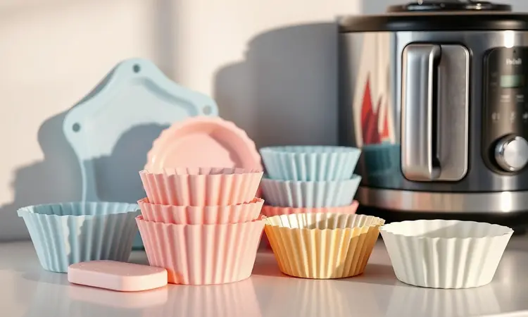
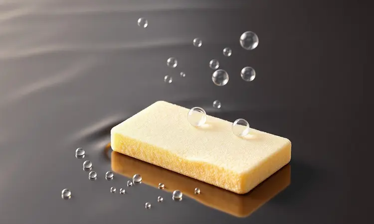

Você comprou uma Air Fryer imaginando refeições rápidas e sem stress, mas agora enfrenta uma batalha épica toda vez que tenta descolar aquele frango assado do fundo do cesto?

Aquela sensação de ver o revestimento que você tanto cuidou começando a falhar não precisa ser o fim da linha. Com os cuidados certos e alguns aliados estratégicos, é possível devolver à sua fritadeira a glória dos primeiros dias.

Este guia vai transformar sua frustração em expertise, mostrando desde o ritual secreto de 'cura' até os acessórios que farão você se perguntar por que não os comprou antes.

<SummaryList products={frontmatter.top_products} />

## Por que a comida gruda na Air Fryer? Entenda o desgaste do antiaderente

A verdade é que seu cesto não está tentando sabotar suas refeições. O que parece teimosia é, na maioria das vezes, um pedido de socorro do revestimento antiaderente.

Com o tempo, o ciclo constante de calor intenso e limpeza (às vezes com as ferramentas erradas) vai desgastando essa camada protetora. É como uma pintura que perde o brilho: ela ainda funciona, mas com menos eficiência.

Sem essa barreira lisa, os alimentos encontram micro-ranhuras para se agarrar. O resultado? Aquele ovo mexedo que vira parte integrante do utensílio. Mas entender o problema é o primeiro passo para dominar a solução.

## O Truque de Mestre: Como fazer a Cura da Air Fryer (Passo a Passo)

Se o seu cesto já mostra sinais de cansaço, existe um processo quase mágico para revitalizá-lo: a cura. Não se preocupe, não envolve velas ou cantos gregorianos, apenas um pouco de óleo e paciência.

Comece lavando bem a cesta e a gaveta com água morna e detergente neutro, e seque com um pano macio até não restar uma gota de umidade.

O segredo está no próximo passo: com um papel toalha, aplique uma camada finíssima de óleo vegetal em toda a superfície interna, como se estivesse dando um hidratante profundo para a sua air fryer.

Agora, a parte que transforma óleo em proteção. Ligue o aparelho vazio a 200°C por 30 minutos. Durante esse tempo, o calor fará o óleo se impregnar no revestimento, preenchendo microfissuras e criando uma nova camada de defesa.

Depois que esfriar completamente, passe um pano seco para remover qualquer excesso. O resultado? Uma superfície renovada que receberá seus alimentos com muito mais gentileza.

## 8 Dicas Práticas para evitar que alimentos grudem no cesto

A cura é um ótimo recomeço, mas a verdadeira magia está nos hábitos do dia a dia. Estas oito práticas são o que separa uma air fryer grudenta de uma que funciona como um sonho.

### 1. Pré-aqueça sempre antes de colocar o alimento

Pense no pré-aquecimento como acordar o aparelho gentilmente antes do trabalho pesado. Esse minuto extra a 180°C faz com que a superfície atinja a temperatura ideal antes do contato com a comida.

Quando você coloca o alimento em uma superfície já quente, ele forma uma crosta rapidamente, criando uma barreira natural que impede que grude. É a diferença entre um frango que se solta inteiro e aquele que deixa metade da pele para trás.

### 2. Não sobrecarregue o cesto: Deixe o ar circular

A tentação de encher o cesto para economizar tempo é grande, mas o resultado costuma ser o oposto. Quando você amontoa os alimentos, o ar quente fica preso, criando zonas de umidade onde a comida cozinha no vapor em vez de fritar.

Isso não só deixa tudo emborrachado como faz com que os pedaços se colem uns nos outros e no fundo do cesto. Cozinhar em lotes menores garante que cada nugget, batata ou brócolis tenha seu espaço pessoal para ficar crocante e soltinho.

### 3. Agite o cesto na metade do tempo de preparo

Essa é a dica mais subestimada, mas com o maior retorno em praticidade. Na metade do tempo de cozimento, puxe rapidamente o cesto e dê uma boa chacoalhada.

Essa simples ação redistribui os alimentos, expõe todos os lados ao calor e, mais importante, libera qualquer pedacinho que esteja começando a se apegar à superfície.

Para batatas fritas e vegetais, esse movimento é a garantia de uma crocância uniforme e de uma limpeza que leva segundos.

### 4. Ajuste a temperatura correta para alimentos gordurosos

Alimentos naturalmente gordurosos, como coxinhas ou queijos, podem ser traiçoeiros. Colocá-los em temperatura muito alta faz a gordura derreter violentamente, criando uma superfície grudenta instantânea.

O segredo é usar uma temperatura moderada (em torno de 180°C) que permite que a gordura seja liberada gradualmente, enquanto o exterior doura sem queimar.

Combinado com uma leve borrifada de óleo, esse controle térmico evita que você precise lutar para desgrudar o que deveria ser um lanche fácil.

## Melhores Acessórios para facilitar a limpeza e proteger o cesto

Se as dicas são a estratégia, os acessórios certos são o seu armamento de elite. Estes itens foram projetados para fazer o trabalho sujo por você, transformando a limpeza de uma tarefa penosa em uma rápida passada de pano.

### Formas de Silicone: A solução definitiva para não sujar nada

<ProductBox 
  title={frontmatter.top_products[0].title} 
  image={frontmatter.top_products[0].image} 
  link={frontmatter.top_products[0].link} 
/>

Imagine cozinhar pão de queijo, almôndegas ou até um bolo sem que uma migalha sequer toque no cesto da sua air fryer. As formas de silicone tornam isso realidade. Elas funcionam como um escudo removível, pegando toda a sujeira, respingos e queimaduras para si.

Como são naturalmente antiaderentes, os alimentos simplesmente escorregam para o prato, e a forma vai direto para a pia. A limpeza? Normalmente, uma esponja com sabão e água corrente resolvem em menos de um minuto.

É a liberdade de experimentar receitas ousadas sem o medo da faxina épica depois.

### Papel Manteiga Perfurado: Praticidade sem bloquear o ar

<ProductBox 
  title={frontmatter.top_products[1].title} 
  image={frontmatter.top_products[1].image} 
  link={frontmatter.top_products[1].link} 
/>

Para os dias de pressa ou para receitas especialmente pegajosas (olá, queijo derretido), o papel manteiga perfurado é seu melhor amigo.

Ele cria uma barreira física entre a comida e o cesto, mas, ao contrário do papel alumínio, seus furinhos permitem que o ar quente circule livremente. O resultado é que você mantém a crocância enquanto protege o revestimento original.

É perfeito para fritar bacon, fazer vegetais com melado ou qualquer coisa que tenda a caramelizar e grudar. Depois do uso, basta enrolar o papel com os restos e jogar fora. Zero esforço.

### Pulverizador de Azeite: O segredo para untar sem excessos

<ProductBox 
  title={frontmatter.top_products[2].title} 
  image={frontmatter.top_products[2].image} 
  link={frontmatter.top_products[2].link} 
/>

A diferença entre uma camada protetora e uma poça gordurosa está na aplicação. Usar um pulverizador dedicado para óleos (não aquele de produtos de limpeza) garante que você distribua uma névoa fina e uniforme sobre os alimentos e o cesto.

Isso significa crocância perfeita sem excesso de gordura que pinga, queima no fundo e vira uma crosta impossível de remover. Além de ser mais saudável, essa precisão economiza óleo e protege seu aparelho.

É um investimento mínimo que paga seu valor toda vez que você evita uma limpeza complicada.

## Guia de Limpeza Segura: Como lavar sem destruir o antiaderente

A maneira como você limpa seu cesto é tão importante quanto a forma como cozinha nele. Adotar os métodos corretos é a garantia de que o revestimento antiaderente será seu aliado por anos, não seu inimigo após alguns meses.

### O que NUNCA usar: Esponja de aço e produtos abrasivos

Esta é a regra de ouro: trate o revestimento da sua air fryer como se fosse a tela do seu celular. Esponjas de aço, palhas de aço, ou mesmo o lado verde áspero de algumas esponjas são equivalentes a lixar a superfície com uma lixa fina.

Cada passada remove um pouco do antiaderente, criando caminhos para a comida grudar na próxima vez. Produtos de limpeza com cloro ou abrasivos químicos também atacam essa camada protetora.

A memória desses danos é permanente, então a primeira escorregada pode custar caro.

### Use a Esponja Anti-Risco correta para fritadeiras

<ProductBox 
  title={frontmatter.top_products[3].title} 
  image={frontmatter.top_products[3].image} 
  link={frontmatter.top_products[3].link} 
/>

O herói anônimo da sua cozinha deve ser uma esponja macia de microfibra ou uma bucha de nylon suave. Para resíduos mais teimosos (mas não queimados), esponjas de melamina podem ser usadas com muita delicadeza, pois limpam por abrasão finíssima sem arranhar.

A verdadeira estrela, porém, são as esponjas de silicone. Elas são projetadas para arrastar a sujeira sem riscar, são resistentes ao calor e muitas têm propriedades antiaderentes que fazem com que a gordura nem grude nelas.

Escolher a ferramenta certa é metade do trabalho da limpeza.

## Dúvidas Frequentes sobre Manutenção

Mesmo com todos os cuidados, algumas situações específicas deixam qualquer um em dúvida. Reunimos aqui as perguntas que mais tiram o sono dos donos de air fryer, com respostas claras para você tomar as melhores decisões.

### Pode colocar o cesto da Air Fryer na lava-louças?

Geralmente, sim, mas com um grande "depende". A maioria dos fabricantes aprova a lava-louças, mas isso vem com ressalvas importantes. Coloque sempre na prateleira superior, longe do elemento aquecedor, e use o ciclo mais suave (econômico/delicado).

Detergentes muito agressivos e altas temperaturas prolongadas podem, com o tempo, acelerar o desgaste do revestimento. Se você notar que o antiaderente está ficando fosco ou áspero após algumas lavagens na máquina, volte para a limpeza manual.

A conveniência não deve custar a durabilidade do seu aparelho.

### Air Fryer descascando é perigoso para a saúde?

Ver lascas do revestimento se soltando é um sinal de alerta que não deve ser ignorado. O principal risco é a ingestão acidental dessas partículas, que não são feitas para consumo.

Além disso, uma vez que o revestimento começa a descascar, a degradação tende a acelerar, expondo a base de metal do cesto, que pode oxidar ou liberar outros componentes.

Se o dano for pequeno e localizado (uma lasca pontual), ainda é possível usar formas de silicone para isolar completamente o alimento da área danificada. Mas se for um descascamento generalizado, a substituição do cesto (ou do aparelho) é o caminho mais seguro.

### Como remover gordura queimada sem riscar o cesto?

Para aquela crosta escura de gordura carbonizada que resiste ao sabão, a paciência é uma ferramenta melhor que a força. Deixe o cesto de molho em água quente (não fervente) com algumas gotas de detergente por uma hora. Isso amolecerá a gordura.

Se restarem manchas, faça uma pasta com bicarbonato de sódio e um pouco de água, aplique sobre a área e deixe agir por 15 minutos. O bicarbonato age como um abrasivo natural muito suave.

Esfregue com uma esponja macia de microfibra, sempre com movimentos circulares leves. Nunca use lâminas ou objetos pontiagudos. A gordura vai ceder, e seu cesto ficará intacto.

## Conclusão

Manter sua air fryer funcionando como nova não é sobre seguir um manual complexo de engenharia, mas sobre adotar uma relação de cuidado.

É entender que aquele revestimento antiaderente é um aliado frágil que pede gentileza: óleo na medida certa, calor controlado e, acima de tudo, uma limpeza que protege em vez de punir.

As dicas práticas que você aprendeu aqui, do pré-aquecimento ao uso estratégico de acessórios, são o antídoto contra a frustração diária.

Elas transformam a rotina de cozinhar de um combate contra alimentos grudados em uma experiência fluida, onde o resultado é sempre crocante e a limpeza, uma tarefa de minutos.

Quando você integra o ritual da cura periódica e escolhe as ferramentas certas (as esponjas macias, as formas de silicone), está fazendo um investimento no seu tempo futuro.

Cada refeição preparada sem stress, cada cesto que se limpa com um simples enxágue, é o retorno desse cuidado. Sua air fryer pode durar muitos anos, mas apenas se você tratá-la não como um eletrodoméstico, mas como o parceiro de cozinha que ela realmente é.

Comece hoje mesmo com uma das dicas mais simples, como o pré-aquecimento ou a compra de um papel perfurado, e sinta a diferença imediata. Sua cozinha, e seu humor na hora de lavar a louça, agradecem.