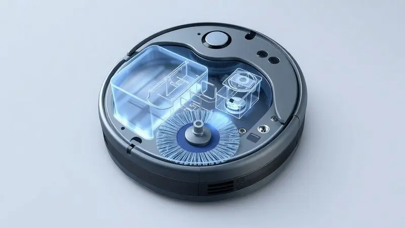
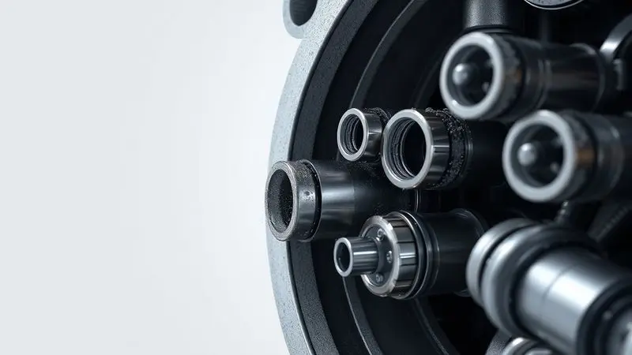
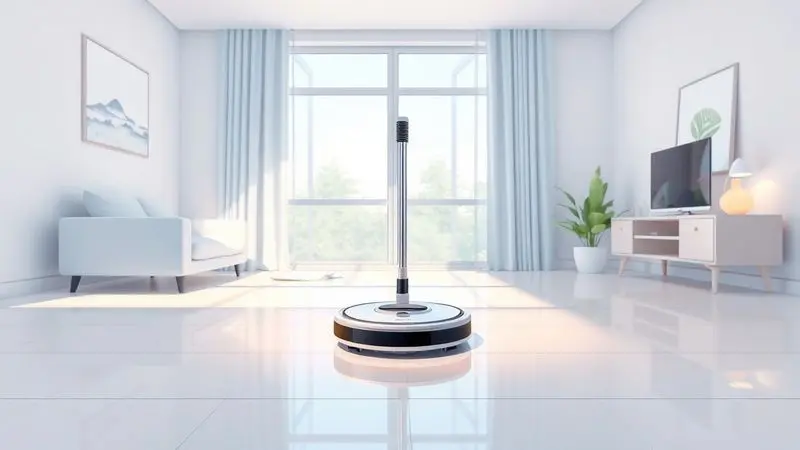

Ter um robô aspirador que passa pano é o sonho de consumo de quem busca praticidade. Imagine sair de casa pela manhã e voltar à noite para pisos limpos e brilhantes.

Mas logo surge aquela dúvida tentadora: será que posso potencializar essa limpeza adicionando desinfetante ou outros produtos aromatizantes ao tanque de água?

Entendemos perfeitamente o desejo de transformar a casa em um refúgio não apenas limpo, mas também perfumado. No entanto, essa pequena tentação pode custar caro. O uso de substâncias inadequadas é como dar veneno para seu aliado doméstico.

Vamos explorar juntos o que realmente funciona, os riscos escondidos nos produtos químicos e, o mais importante, as alternativas seguras para manter seu piso impecável sem comprometer seu investimento.

<SummaryList products={frontmatter.top_products} />

## Como funciona o sistema de reservatório de água (Mop) dos robôs?

Imagine um sistema de irrigação em miniatura, projetado com precisão cirúrgica para seu piso. O reservatório de água, popularmente chamado de Mop, é justamente essa engenharia inteligente.

Um compartimento armazena água limpa, que é liberada gota a gota durante o percurso do robô.

Essa água não encharca seu piso, apenas umedece suavemente o pano de microfibra acoplado na base do aparelho.

A mágica acontece quando o movimento circular do robô, combinado com a leve pressão exercida, faz com que o pano úmido capture sujeiras que a simples [aspiração](/robo-aspirador-de-po-karcher-rcv-1-e-bom/) deixaria para trás. Manchas de café, pegadas de areia, poeira fina... tudo isso encontra seu fim.

É importante lembrar que essa funcionalidade não é universal. Antes de se encantar com a ideia, confirme se [seu modelo possui essa capacidade](/melhores-robo-aspirador-2024/). Caso contrário, você pode estar apenas umidificando seu piso sem o benefício real da limpeza.

## Pode colocar produto de limpeza no robô aspirador? A resposta definitiva

Vamos direto ao ponto: a resposta é não. E não se trata apenas de uma recomendação burocrática. Existe uma razão técnica e de segurança que transforma esse 'não' em uma proteção para seu bolso.

A maioria absoluta dos fabricantes proíbe expressamente o uso de detergentes, desinfetantes ou qualquer produto químico no reservatório. Por quê? Porque esses robôs são projetados como sistemas fechados de circulação de água pura.

Quando você introduz substâncias estranhas, está criando uma reação em cadeia de problemas potenciais.

Mas não se preocupe, essa limitação não significa renunciar à limpeza profunda. Muitos modelos são tão eficientes com água pura que surpreendem.

E para quem deseja desinfetar, existem métodos alternativos que vamos explorar mais adiante, que respeitam a integridade do aparelho.

## Riscos de usar produtos químicos: Por que o aparelho pode estragar?

Pense no seu robô como um atleta de alta performance. Ele foi treinado para funcionar com hidratação pura. Dar a ele um 'suplemento' químico inadequado não melhora seu desempenho, apenas sobrecarrega seus órgãos vitais. Os riscos são reais e caros.

### Entupimento dos bicos injetores e corrosão da bomba interna

Aqui está o cenário: após algumas semanas usando um produto 'inocente', você percebe que o robô está deixando o piso mais seco que o normal. Depois, para completamente. O diagnóstico? Bicos injetores entupidos com resíduos químicos que solidificaram. 

A bomba interna, projetada para mover água pura, começa a sofrer corrosão pelos componentes ácidos ou alcalinos do produto. É um desgaste silencioso que, quando se manifesta, já causou danos irreparáveis.

O conserto muitas vezes custa uma fração significativa do valor do aparelho novo.

### Ressecamento de mangueiras e danos aos vedantes de borracha

Imagine as mangueiras internas, flexíveis e vedadas, que garantem que a água siga seu caminho correto. Produtos químicos, especialmente os com álcool ou solventes, agem como um processo de envelhecimento acelerado. Elas perdem elasticidade, tornam-se quebradiças.

Os vedantes de borracha, aqueles anéis invisíveis que impedem vazamentos, sofrem o mesmo destino. Começam a apresentar microfissuras, e logo você tem um vazamento interno que molha componentes eletrônicos. O resultado é previsível: pane total.

## O que as fabricantes (Xiaomi, iRobot, WAP, Samsung) recomendam oficialmente?

A linguagem dos manuais é unânime e clara. Xiaomi, iRobot, [WAP](/robo-aspirador-wap-w96-30w-e-bom/) e Samsung repetem o mesmo mantra: use apenas água limpa. Algumas, como a iRobot, vão além e oferecem soluções próprias, especialmente formuladas e testadas para não agredir seus sistemas. 

Essa recomendação não é capricho. É fruto de milhares de horas de teste em laboratório. Eles sabem exatamente como cada molécula de seus componentes reage a diferentes substâncias.

Quando dizem 'apenas água', estão protegendo o resultado de todo esse investimento em pesquisa e desenvolvimento. Seguir essa orientação é alinhar-se com a ciência por trás do produto que você comprou.

## A questão da Garantia: O perigo de usar produtos não autorizados

Aqui está o risco mais tangível e imediato: a anulação da garantia. Fabricantes possuem métodos forenses para detectar o uso de produtos não autorizados. Resíduos químicos deixam assinaturas específicas nos componentes internos.

Quando você leva o aparelho para reparo sob garantia e o técnico identifica esses resíduos, a cobertura simplesmente desaparece. De repente, aquele conserto que seria gratuito se transforma em uma conta de centenas de reais. 

É uma situação frustrante: você tentou melhorar a limpeza, mas acabou pagando caro por isso. A garantia é seu seguro contra defeitos de fabricação. Não a perca por um experimento caseiro.

## Lista de produtos terminantemente proibidos no reservatório

Vamos ser específicos para evitar qualquer tentação. Nunca, sob nenhuma circunstância, adicione ao reservatório:

- Água sanitária ou alvejantes (corrosão instantânea)

- Detergentes comuns, especialmente em gel (formam espuma que entope o sistema)

- Amaciante de roupas (deixa filme pegajoso)

- Produtos à base de óleo ou ceras (colam poeira e criam resíduos insolúveis)

- Vinagre (embora natural, sua acidez corrói metais)

- Perfumes ou óleos essenciais puros (não se diluem adequadamente e danificam plásticos)

O manual do seu modelo específico é a fonte definitiva. Consulte-o antes de qualquer experimentação.

## Como deixar a casa cheirosa usando o robô aspirador com segurança

A boa notícia é que você pode ter um ambiente perfumado sem arriscar seu robô. A chave está em aplicar o produto no ambiente, não dentro da máquina.

### Técnica de borrifar o produto diretamente no pano mop

Esta é a técnica mais eficaz e segura. Antes de acoplar o pano limpo e úmido (apenas com água) no robô, borrife levemente uma solução de limpeza aprovada para pisos diretamente sobre o tecido. Espere 30 segundos para que o produto seja absorvido.

Assim, quando o robô começar a trabalhar, o pano já estará 'carregado' com o agente de limpeza e perfume, realizando uma limpeza ativa sem que uma gota sequer passe pelo sistema hidráulico do aparelho. É engenhoso e totalmente seguro.

### Uso de soluções de limpeza específicas e homologadas para robôs

<ProductBox 
  title={frontmatter.top_products[0].title} 
  image={frontmatter.top_products[0].image} 
  link={frontmatter.top_products[0].link} 
/>

Algumas marcas desenvolveram seus próprios ecossistemas. A iRobot, por exemplo, oferece a linha 'Braava Jet Cleaning Solution'. A Samsung tem fluidos específicos para seus modelos. 

Esses produtos não são apenas marketing. Eles passaram por testes rigorosos de compatibilidade, pH balanceado e fórmula não espumante. Quando o fabricante oferece uma solução própria, ela é a única verdadeiramente 'blindada' contra danos.

O investimento nesses fluidos oficiais é insignificante comparado ao custo de um reparo.

Para modelos que não possuem fluidos específicos, a água desmineralizada ou filtrada é a opção mais segura. Ela não deixa resíduos de minerais que, em longo prazo, também podem causar incrustações.

## Xiaomi Mi Robot Vacuum-Mop 2: Eficiência com sistema de controle de água

<ProductBox 
  title={frontmatter.top_products[1].title} 
  image={frontmatter.top_products[1].image} 
  link={frontmatter.top_products[1].link} 
/>

Este modelo representa a filosofia da limpeza inteligente. Com seu motor de 2700Pa, ele não aspira, ele 'engole' a sujeira.

Mas o verdadeiro destaque é o [módulo de esfregão pressurizado](/como-funciona-o-robo-aspirador-xiaomi/), que literalmente pressiona o reservatório de 250ml contra o piso, garantindo que cada centímetro do pano úmido trabalhe com máxima eficiência.

Imagine cobrir 150m² de piso sem precisar reabastecer. Essa é a autonomia que o Mi Robot Vacuum-Mop 2 oferece. Sua navegação visual é tão precisa que ele evita obstáculos com uma consciência espacial impressionante.

Claro, como todo sistema óptico, prefere ambientes bem iluminados. Mas para quem busca tecnologia aliada à praticidade, ele é um companheiro de alto nível.

## iRobot Braava Jet m6: O especialista em passar pano pesado

<ProductBox 
  title={frontmatter.top_products[2].title} 
  image={frontmatter.top_products[2].image} 
  link={frontmatter.top_products[2].link} 
/>

Enquanto outros robôs 'também passam pano', o Braava Jet m6 nasceu para essa missão específica. Ele é o especialista, o cirurgião dos pisos sujos.

Seu sistema de pulverização de precisão não apenas umedece, ele dosa a quantidade exata de solução para cada tipo de sujeira.

A integração com os aspiradores Roomba é poesia doméstica: assim que o aspirador termina, o Braava inicia automaticamente, completando o serviço. Você pode até definir 'áreas proibidas' no mapa digital, protegendo tapetes valiosos ou áreas sensíveis.

Ele funciona melhor com as soluções oficiais iRobot, que foram molecularmente desenhadas para seu sistema. Tentar economizar com alternativas genéricas aqui é como colocar combustível comum em um carro de fórmula 1.

## WAP Robot W90: Ótimo custo-benefício para limpeza úmida diária

<ProductBox 
  title={frontmatter.top_products[3].title} 
  image={frontmatter.top_products[3].image} 
  link={frontmatter.top_products[3].link} 
/>

Para quem busca um aliado confiável sem o investimento premium, o [WAP Robot W90](/robo-aspirador-wap-w90-e-bom/) é a resposta. Sua abordagem é pragmática: oferecer as três funções essenciais (varrer, aspirar, [passar pano](/como-passar-pano-com-robo-aspirador-wap/)) em um pacote acessível.

Em lares com animais, sua capacidade de lidar com [pelos e poeira leve](/melhor-robo-aspirador-para-quem-tem-pet/) faz dele um herói discreto. A autonomia de 1h40 cobre bem a maioria dos apartamentos e casas médias.

A navegação aleatória, embora menos sofisticada que os sistemas de mapeamento, é surpreendentemente eficiente em ambientes de layout simples.

O tempo de recarga de 4 horas pode parecer longo, mas planejando seu uso (como programar para limpar enquanto você trabalha), essa característica torna-se irrelevante. É o robô que prova que tecnologia útil não precisa custar uma fortuna.

## Dicas de manutenção: Como limpar o reservatório e o pano após o uso

O segredo da longevidade está no ritual pós-limpeza. Após cada uso, transforme esses 2 minutos em um hábito que poupará horas de frustração no futuro:

1. Esvazie completamente o reservatório. Não deixe água parada, que pode criar limo.

2. Lave-o com água corrente morna. Para manchas persistentes, uma escova de dentes macia com sabão neutro resolve.

3. O pano de microfibra deve ser removido e lavado separadamente. Siga as instruções do fabricante: alguns aceitam máquina (sem amaciante!), outros exigem lavagem manual.

4. A secagem completa é não negociável. Reservatório e pano totalmente secos antes do próximo uso previnem mofo e odores.

Este ritual simples é o equivalente a trocar o óleo do seu carro. Previne problemas maiores e garante que seu robô opere no auge de suas capacidades por anos.

## Perguntas Frequentes (FAQ) sobre produtos em robôs aspiradores

Posso usar vinagre diluído para desinfetar?
Não recomendamos. Apesar de ser natural, a acidez do vinagre pode corroer componentes metálicos internos ao longo do tempo.

E se usar apenas uma gotinha de detergente?
Mesmo quantidades mínimas podem formar espuma que interfere nos sensores e mecanismos de bombeamento.

Posso usar água com amaciante para deixar o pano mais macio?
Absolutamente não. Amaciante deixa um filme residual que reduz a capacidade de absorção do pano e pode obstruir o sistema.

Existe algum produto 'caseiro' seguro?
Água. Apenas água. Qualquer aditivo, por mais natural que pareça, introduz riscos.

Como sei se já causei danos?
Sinais de alerta: redução na umidificação do pano, ruídos estranhos na bomba d'água, vazamentos ou cheiro de queimado. Se notar algum desses, pare imediatamente e consulte o suporte técnico.

Meu manual é genérico e não especifica. O que faço?
Na dúvida, opte pelo conservadorismo: use apenas água limpa. É sempre a opção mais segura.

## Conclusão

A jornada de ter um robô aspirador que também passa pano é maravilhosa. Ele devolve horas da sua semana, oferecendo aquele piso impecável que parece saído de revista. Proteger esse investimento é mais simples do que parece: respeite sua engenharia.

Lembre-se: esses aparelhos são projetados como sistemas fechados de água pura. Cada produto químico adicionado é uma agressão a componentes delicados que trabalham em harmonia. A garantia que acompanha seu robô é um seguro precioso.

Não a jogue fora por um experimento que promete pouco e arrisca muito.

As alternativas seguras existem e são eficientes. Desde borrifar produtos diretamente no pano até usar soluções homologadas pelos fabricantes, você pode ter sua casa limpa e cheirosa sem comprometer a máquina.

O verdadeiro luxo da automação doméstica não é apenas ter a tecnologia, mas mantê-la funcionando perfeitamente por anos.

Seu robô é mais que um eletrodoméstico. É um parceiro no cuidado do seu lar. Trate-o com o respeito que sua inteligência merece, e ele retribuirá com anos de serviço silencioso e eficiente. A limpeza profunda começa com o cuidado inteligente.