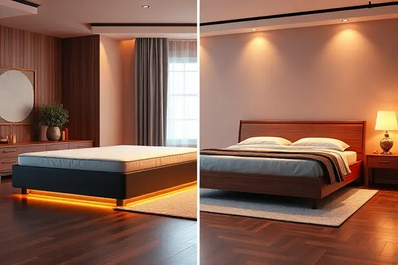

Imagine transformar a simples tarefa de dormir em uma experiência que revitaliza corpo e mente. Essa busca pelo sono perfeito está redefinindo como escolhemos o centro do nosso quarto.

O que antes era um móvel básico se tornou uma peça-chave para nosso bem-estar diário, e é justamente nessa transformação que a cama box conquistou seu espaço.

<SummaryList products={frontmatter.top_products} />

## O que é Cama Box e Por que Ela é Tão Popular?

Mais do que uma tendência passageira, a cama box representa uma mudança fundamental na forma como entendemos o descanso. Ela nasce da união perfeita entre estrado firme e colchão, criando uma base única que elimina complicações.

Seu perfil mais baixo não é apenas estético. Pense na facilidade de se deitar após um longo dia, ou na segurança para crianças e idosos. Essa altura reduzida se traduz em acessibilidade pura.

A verdadeira magia, porém, está na simplicidade inteligente. Ao remover a necessidade de cabeceiras complexas e estruturas volumosas, a cama box oferece algo precioso: espaço visual e praticidade.

A ventilação aprimorada para o colchão não é um detalhe técnico, é a garantia de que cada noite começa com frescor, não com umidade retida.

Em um mundo onde agilidade é valorizada, a facilidade de transporte e montagem se torna um alívio concreto, especialmente para quem muda com frequência ou busca renovar o ambiente sem complicação.

## Cama Box vs. Cama Tradicional: Qual a Melhor Escolha?

Mas será que essa preferência moderna significa que a cama tradicional perdeu seu charme? A resposta não é sobre qual é melhor, mas sim sobre qual dialoga com seu momento de vida. A cama tradicional carrega a força da narrativa.

Suas cabeceiras ornamentadas, os pés trabalhados, a presença imponente no quarto contam uma história de permanência, de raízes. É para quem vê o quarto como um retrato pessoal, onde cada detalhe decorativo é uma assinatura.

A cama box, por sua vez, fala a língua do cotidiano contemporâneo. Seu design limpo não compete com a decoração, ele a potencializa. Em ambientes compactos de apartamentos urbanos, essa economia de espaço visível é um superpoder.

A ausência de elementos sob a estrutura transforma a limpeza de uma tarefa árdua em um rápido passeio com o aspirador. A escolha, portanto, se desenha entre a emoção da tradição aconchegante e a inteligência da funcionalidade descomplicada.

## As Principais Vantagens de Investir em uma Cama Box

Decidir por uma cama box é optar por uma série de melhorias silenciosas que impactam seu dia a dia. A base sólida é o alicerce do sono reparador.

Ela distribui o peso do corpo e do colchão de maneira uniforme, evitando pontos de pressão que podem causar desconforto e até dores matinais. Você não está comprando apenas uma estrutura, está adquirindo suporte que respeita sua anatomia.

A leveza relativa do conjunto revela sua vantagem na hora de uma reforma ou mudança. Rearranjar o quarto deixa de ser um projeto de engenharia para se tornar uma possibilidade real. Muitos modelos trazem ainda a genialidade do armazenamento embutido.

São gavetas discretas ou compartimentos baú que devoram a bagunça, transformando cobertores, travesseiros extras e roupas de cama de sazonais em elementos invisíveis. O quarto ganha uma aura de organização que, psicologicamente, convida ao relaxamento.

## Conheça os Diferentes Tipos de Cama Box

O universo da cama box não é uniforme. Dependendo do seu espaço, estilo de vida e necessidades de organização, existem três caminhos principais que oferecem soluções distintas.

Cada um resolve uma dor específica, transformando um problema de espaço ou praticidade em uma vantagem elegante.

### Cama Box Baú: A Solução Inteligente para Quartos Pequenos

<ProductBox 
  title={frontmatter.top_products[0].title} 
  image={frontmatter.top_products[0].image} 
  link={frontmatter.top_products[0].link} 
/>

Para quem vive a realidade dos metros quadrados valiosos, a cama box baú é uma revelação. Ela resolve o dilema clássico do armazenamento em ambientes compactos sem sacrificar um centímetro do chão livre.

O compartimento interno generoso é como ter um armário extra, mas escondido sob o conforto. Roupas de inverno volumosas, edredons, malas e até livros encontram um lar discreto, liberando closets e prateleiras para o que é usado diariamente.

A sensação ao abrir o baú com mecanismo de elevação assistida é de descoberta e praticidade. Sim, o conjunto pode ser mais pesado, mas esse peso é o preço da robustez e da durabilidade que garantem anos de uso tranquilo.

É a escolha perfeita para o dormitório que precisa ser multitarefa: local de descanso, refúgio e, secretamente, um organizador mestre.

### Cama Box Conjugada: Vale a Pena o Custo-Benefício?

<ProductBox 
  title={frontmatter.top_products[1].title} 
  image={frontmatter.top_products[1].image} 
  link={frontmatter.top_products[1].link} 
/>

Se a simplicidade absoluta é sua prioridade, a cama box conjugada apresenta um argumento convincente. Aqui, base e colchão formam uma unidade indissociável, oferecendo uma solução completa em uma única compra.

O custo-benefício salta aos olhos, pois você evita a complexidade de combinar peças separadas e frequentemente paga menos pelo conjunto do que pagaria pelos itens avulsos.

A praticidade é rainha. A montagem se simplifica, e o visual é sempre coeso, como se tivesse saído de uma revista de decoração.

É verdade que você perde a flexibilidade de virar apenas o colchão para aumentar sua vida útil, e uma eventual avaria em um componente pode exigir a troca do todo. No entanto, marcas consolidadas investem justamente na qualidade integrada para mitigar esses riscos.

Para o primeiro apartamento, o quarto de hóspedes ou para quem ama uma solução "pronta para usar", ela é uma candidata poderosa.

### Cama Box com Gavetas: Organização Extra no Dia a Dia

<ProductBox 
  title={frontmatter.top_products[2].title} 
  image={frontmatter.top_products[2].image} 
  link={frontmatter.top_products[2].link} 
/>

Imagine poder acessar suas coisas sem se curvar ou levantar pesos. A cama box com gavetas traz o armazenamento para o nível mais conveniente possível.

As gavetas deslizam suavemente, oferecendo acesso rápido a itens de uso frequente como pijamas, meias, ou até os sapatos do dia seguinte. Diferente do baú, não é necessário remover travesseiros e colcha, tornando a organização parte do fluxo natural da rotina.

A limitação do espaço interno em alguns modelos é real, mas funciona como um filtro benéfico. Ela incentiva uma organização mais criteriosa, mantendo apenas o essencial ao alcance imediato.

Esteticamente, as gavetas embutidas mantêm as linhas limpas da cama box, muitas vezes disfarçadas de forma tão harmoniosa que só quem sabe percebe sua função. É a escolha para quem deseja ordem sem esforço, integrada à beleza do móvel.

## Guia Completo de Tamanhos e Medidas (Padrão Brasileiro)

Escolher o tamanho correto vai além de medir o quarto. É sobre entender o espaço que seu corpo e sua mente precisam para realmente desconectar. Das medidas compactas do solteiro à amplitude real do king size, cada formato oferece uma experiência de sono diferente.

Vamos decifrar essa numeração para que sua escolha seja de conforto, não de ajuste.

### Cama Box Solteiro e Solteiro Americano

<ProductBox 
  title={frontmatter.top_products[3].title} 
  image={frontmatter.top_products[3].image} 
  link={frontmatter.top_products[3].link} 
/>

O solteiro tradicional, com seus 88 cm de largura por 188 cm de comprimento, é o clássico eficiente. É espaço suficiente para uma noite de sono individual, ideal para quartos compactos ou para quem prefere um ambiente mais aconchegante.

Já o solteiro americano (96 cm x 203 cm) é um upgrade sutil que faz toda a diferença. Esses centímetros extras de largura significam liberdade para se mover sem sentir as bordas, e o comprimento maior acolhe com conforto pessoas mais altas.

A busca pela versão americana pode ser um pouco mais dedicada, mas a recompensa é uma sensação generosa de espaço pessoal. Muitos modelos nessa medida já incorporam a funcionalidade do baú, provando que otimização e conforto podem, sim, andar juntos.

### Cama Box Viúva e Casal Padrão

<ProductBox 
  title={frontmatter.top_products[4].title} 
  image={frontmatter.top_products[4].image} 
  link={frontmatter.top_products[4].link} 
/>

Aqui, a decisão é sobre a dinâmica do espaço compartilhado. O casal padrão (1,38m x 1,88m) é o equilíbrio perfeito para a maioria dos lares brasileiros. Oferece um território confortável para dois, sem demandar um quarto de dimensões palacianas.

É a medida da convivência harmoniosa, onde há proximidade mas também autonomia.

A viúva (ou meio casal), com 1,28m de largura, é uma opção interessante. Perfeita para quem dorme sozinho e ama se esticar, ou para casais que genuinamente preferem uma proximidade maior durante o sono.

Para dois adultos que se movimentam muito à noite, pode parecer um pouco justa. Conhecer suas próprias dinâmicas de sono é a chave para decidir entre o padrão confortável e o compacto aconchegante.

### Cama Box Queen Size: O Equilíbrio entre Espaço e Conforto

<ProductBox 
  title={frontmatter.top_products[5].title} 
  image={frontmatter.top_products[5].image} 
  link={frontmatter.top_products[5].link} 
/>

A rainha (queen size) reina soberana no território do equilíbrio. Com 1,58m de largura por 1,98m de comprimento, ela é o meio-termo ideal. Para o casal que deseja mais espaço pessoal sem migrar para as dimensões majestosas do king, ela é a resposta.

Para quem dorme sozinho, é um convite ao luxo do espaço abundante.

Ela se adapta com elegância à maioria dos quartos principais, oferecendo um salto significativo de conforto em relação ao casal padrão. A tecnologia a acompanha.

Sistemas de molas ensacadas, comuns nessa categoria, garantem que um movimento de um lado não vire um terremoto do outro.

Sim, lençóis queen exigem um cuidado na compra, mas a vasta oferta no mercado transforma esse pequeno detalhe em uma etapa simples para alcançar noites verdadeiramente revigorantes.

### Cama Box King Size: Luxo e Amplitude Máxima

<ProductBox 
  title={frontmatter.top_products[6].title} 
  image={frontmatter.top_products[6].image} 
  link={frontmatter.top_products[6].link} 
/>

O king size é a declaração final. Com aproximadamente 1,93m de largura por 2,03m de comprimento, ele não é apenas uma cama, é um domínio pessoal. É a escolha para quem não negocia o conforto e vê o sono como um ritual de regeneração que merece o melhor palco possível.

A amplitude permite que duas pessoas durmam com a sensação de estarem em camas individuais, mas compartilhando o mesmo espaço íntimo.

Essa experiência premium é frequentemente completada com colchões de altíssima tecnologia, onde cada mola trabalha de forma independente para anular totalmente a transferência de movimento.

A exigência é clara: seu quarto precisa abraçar essas dimensões sem se tornar apenas um corredor para a cama. Mas se o espaço permite, a recompensa é a sensação inigualável de dormir envolvido pelo luxo do espaço ilimitado.

## Passo a Passo: Como Escolher a Cama Box Ideal para Você

Com tantas opções, a escolha pode parecer complexa, mas basta seguir uma lógica simples que parte de você para o produto. Esqueça temporariamente as especificações técnicas e comece com uma pergunta: como você quer se sentir ao deitar e ao acordar?

A resposta guiará todo o resto.

### Verifique a Resistência da Estrutura e dos Pés

A beleza é superficial se a fundação é frágil. Antes do revestimento estofado ou do acabamento em madeira, investigue o que está por dentro. Estruturas de madeira maciça de boa espessura ou de metal robusto são sinônimos de silêncio e estabilidade ao longo dos anos.

Os pés merecem atenção especial. Eles são os guardiões que sustentam centenas de quilos, noite após noite. Devem ser largos, bem fixados à estrutura e preferencialmente com ponteiras que protejam seu piso.

Pressione levemente a estrutura montada na loja. Observe se há rangidos ou flexões indevidas. Uma cama box de qualidade transmite uma sensação de solidez absoluta, a promessa tátil de que nada vai perturbar seu descanso.

### Molas Ensacadas ou Espuma: O que Considerar?

Essa é a decisão que define o abraço da sua cama. As molas ensacadas individuais são como uma rede de suporte personalizado. Cada uma responde apenas ao peso que recebe, garantindo que o movimento de um lado não cause ondulações no outro.

É a tecnologia ideal para casais com diferenças significativas de peso ou para quem é sensível aos movimentos do parceiro.

A espuma, especialmente a memória, oferece uma experiência de aconchego profundo. Ela molda-se ao contorno do seu corpo, aliviando pontos de pressão. A sensação é de being enveloped. A consideração crucial aqui é a termorregulação.

Algumas espumas tradicionais retêm calor, enquanto versões modernas com gel ou infusões especiais oferecem frescor. Pense no seu perfil de dormidor. Você busca suporte firme e independente ou o conforto adaptativo de um material que "esquece" sua forma?

## Cuidados e Manutenção para sua Cama Box Durar Anos

Um investimento desses merece cuidados que garantam sua longevidade. A limpeza regular é o primeiro ritual. Passe o aspirador de pô nas laterais e na base para evitar o acúmulo de poeira e ácaros.

Para a superfície estofada, um pano levemente umedecido com água e sabão neutro resolve, sempre seguido de um pano seco. Proteja sua cama da luz solar direta e constante, que pode ressecar e desbotar os materiais.

A cada três meses, faça uma rotação de 180 graus do colchão (se o modelo permitir). Isso garante um desgaste uniforme, evitando que o corpo crie "valas" no local preferido.

Periodicamente, verifique se todos os parafusos da estrutura estão apertados e se os pés mantêm sua estabilidade. São minutos de atenção que se traduzem em anos de conforto ininterrupto.

## Tendências 2025: A Cama Box está Saindo de Moda?

A cama box não está saindo de cena, está evoluindo. O que vemos para 2025 não é o desaparecimento, mas a sofisticação. O conceito de base integrada e funcional é mais relevante do que nunca, mas os materiais e tecnologias estão se transformando.

A demanda por sustentabilidade impulsiona o uso de madeiras de reflorestamento certificado, espumas à base de plantas e tecidos orgânicos.

A personalização ganha força. Já imaginou uma base com ajuste de inclinação para leitura, integrada a sistemas de luz indireta ou até com funções de aquecimento suave para os pés no inverno? A tecnologia vestível chega ao quarto.

O foco continua no bem-estar holístico, e a cama box, em sua essência prática, é a plataforma perfeita para essas inovações. Ela se afasta do "modismo" para se consolidar como um móvel inteligente, adaptável às necessidades do corpo moderno.

## Perguntas Frequentes (FAQ)

Qual o tamanho ideal para meu quarto?
A regra de ouro é deixar pelo menos 60 cm de espaço livre para circulação em cada lado e na frente da cama. Meça seu quarto, desenhe o layout no papel e visualize a movimentação.

As camas box são realmente confortáveis?
O conforto está 70% no colchão e 30% na base. Uma cama box de qualidade com um colchão adequado ao seu biótipo e preferência de firmeza oferece um suporte superior ao de muitas camas tradicionais com estrados frágeis.

Quanto tempo dura uma cama box?
Com materiais de qualidade e os cuidados básicos de manutenção, você pode esperar de 8 a 12 anos de uso excelente. A estrutura tende a durar mais que o colchão, que normalmente tem vida útil recomendada de 7 a 10 anos.

## Conclusão

Escolher uma cama box é muito mais do que selecionar um móvel. É fazer uma escolha consciente sobre a qualidade do seu descanso, sobre a organização do seu espaço sagrado e sobre como você inicia e finaliza cada dia.

Dos modelos baú que escondem a bagunça com elegância às bases king size que oferecem o luxo do espaço ilimitado, existe uma solução que dialoga diretamente com sua realidade e seus desejos.

A jornada percorre desde a avaliação honesta do seu quarto até a compreensão das tecnologias de suporte que farão você acordar revigorado. Lembre-se que você não está comprando apenas madeira, tecido e molas.

Está investindo em noites de sono profundas, em acordar sem dores, na praticidade de um ambiente organizado e na estética de um quarto que reflete um estilo de vida descomplicado.

Permita-se ir além da primeira impressão. Toque os materiais, pergunte sobre a estrutura interna, imagine a cama no seu espaço. Quando você encontrar aquele modelo que parece feito sob medida para suas necessidades, terá descoberto muito mais que uma peça de mobiliário.

Terá encontrado a base para incontáveis noites de descanso verdadeiramente transformador.