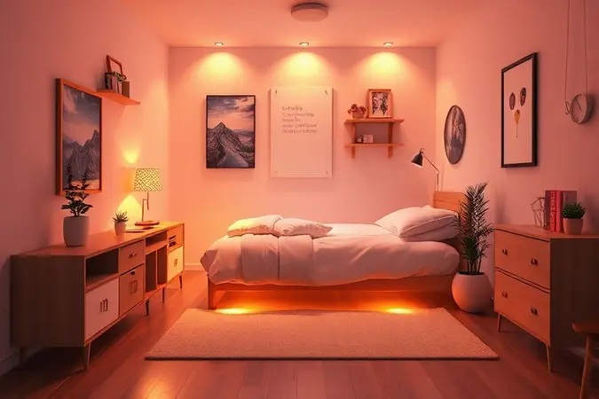

Escolher o tamanho de cama ideal é como encontrar aquele par de jeans perfeito: precisa caber no seu espaço, acompanhar seu estilo e, acima de tudo, não criar ansiedades na hora de dormir.

Se você já se perguntou se uma cama twin é a resposta para seu quarto, seja ele minúsculo, compartilhado ou de hóspedes,  este guia vai além das medidas frias. Vamos conversar sobre como ela se encaixa no seu dia a dia, nas suas noites e na sua decoração.

<SummaryList products={frontmatter.top_products} />

## O que é uma Cama Twin? Significado e Origem do Termo

Imagine duas camas tão parecidas que poderiam ser gêmeas. É dessa ideia que vem o nome 'twin', não à toa, você as encontra frequentemente lado a lado em dormitórios ou quartos de hotéis.

Com cerca de 96 cm de largura por 190 cm de comprimento, elas surgiram como uma solução prática para acomodar mais pessoas no mesmo ambiente sem invadir o espaço de ninguém.

Mais do que apenas um móvel, a cama twin representa uma filosofia: simplicidade que funciona, compactação inteligente e adaptabilidade para diferentes fases da vida.

## Medidas da Cama Twin: Qual a Diferença para a Cama de Solteiro Comum?

Aqui está onde muita gente se perde: twin e solteiro parecem irmãs, mas não são idênticas.

Enquanto a solteiro tradicional oscila entre 88 cm e 100 cm de largura, a twin se posiciona confortavelmente nos 96 cm, aqueles 8 centímetros a mais fazem toda diferença quando você vira de lado à noite.

O comprimento, porém, é quase sempre o mesmo: cerca de 190 cm, espaço suficiente para a maioria das pessoas se esticar sem que os pés fiquem 'suspensos'. A escolha entre uma e outra se resume a uma pergunta: você prefere o 'café com leite' ou o 'capuccino'?

Ambos resolvem a sede, mas um deles tem um toque extra de aconchego.

## 5 Vantagens de Escolher uma Cama Twin para o seu Dormitório

Pense na cama twin como aquela amiga que cabe em qualquer programa: vai ao cinema no sábado, à praia no domingo e ainda tem espaço na agenda para um jantar improvisado. Suas vantagens vão muito além de economizar alguns centímetros quadrados.

### Otimização de Espaço em Ambientes Pequenos

Quando cada centímetro conta, a twin brilha. Com suas dimensões compactas, ela deixa o quarto respirar, criando corredores invisíveis por onde você circula sem precisar fazer manobras dignas de estacionamento em vaga apertada.

É a cama que entende que seu quarto também é seu escritório, seu cantinho de leitura, seu refúgio.

E para quem realmente precisa espremer o máximo de funcionalidade, ela aceita de bom grado gavetões embaixo, prateleiras laterais ou até a companhia de uma cama gêmea em formato de beliche.

### Versatilidade para Quartos de Hóspedes e Infantis

A cama twin é a polivalente do mundo do mobiliário. No quarto de hóspedes, ela recebe sua tia com a mesma dignidade com que abraça seu amigo de 1,90m.

No quarto infantil, cresce junto com a criança: hoje é o reino do herói favorito, amanhã pode virar a base para uma decoração adolescente, depois se transformar na cama de estudo na república.

Ela não se apega a uma única identidade, e é justamente essa falta de compromisso com um único propósito que a torna tão valiosa.

## Melhores Estruturas e Bases para Cama Twin

<ProductBox 
  title={frontmatter.top_products[0].title} 
  image={frontmatter.top_products[0].image} 
  link={frontmatter.top_products[0].link} 
/>

A escolha da estrutura é onde a cama ganha personalidade. Estrados de ripas são como aquela camiseta de algodão egípcio: respiráveis, confiáveis, sempre uma boa ideia.

Já os articulados oferecem o luxo de ajustar sua posição, perfeito para quem gosta de ler na cama sem transformar o travesseiro em uma fortaleza de apoio.

As platform beds de metal dispensam firulas (e box springs), enquanto as de madeira trazem aquela sensação de aconchego atemporal.

E se o espaço for realmente um desafio, opções com gavetas embutidas resolvem o dilema 'onde guardar os edredons de verão?' de forma elegante.

## Como Escolher o Colchão Twin Ideal: Densidade e Conforto

<ProductBox 
  title={frontmatter.top_products[1].title} 
  image={frontmatter.top_products[1].image} 
  link={frontmatter.top_products[1].link} 
/>

Aqui a conversa fica pessoal: seu colchão twin deve ser escolhado como você escolhe um sapato, considerando o peso que ele vai carregar.

A densidade (aquele 'D' seguido de número) é o seu guia: para até 60 kg, um D23 oferece suporte gentil; entre 61 e 80 kg, procure algo entre D28 e D33; acima disso, densidades como D45 garantem que você acorde renovado, não dolorido.

Mas densidade não é sinônimo de dureza, pense nela como a 'memória' do material.

O colchão twin da Gazin, por exemplo, mistura tecnologias para oferecer o abraço firme da espuma com a respiração das molas, como um cobertor que sabe exatamente onde você precisa de mais aconchego.

## Roupa de Cama Twin: Onde Encontrar e Como Medir o Enxoval

<ProductBox 
  title={frontmatter.top_products[2].title} 
  image={frontmatter.top_products[2].image} 
  link={frontmatter.top_products[2].link} 
/>

Encontrar lençóis para uma twin é mais fácil do que encontrar estacionamento no centro aos sábados, grandes varejistas, lojas especializadas em cama-mesa-banho e até marcas de colchões oferecem opções.

O segredo está na medida exata: aproximadamente 96,5 cm de largura por 190,5 cm de comprimento. Atenção redobrada se sua cama for a Twin XL (203 cm de comprimento), o lençol comum vai ficar 'curto' como aquela camiseta que encolheu na lavagem.

Antes de comprar, tire a fita métrica e meça seu colchão destampado: é a diferença entre um lençol que veste bem e um que fica fazendo bundinha o tempo todo.

## Layout e Decoração: Como Usar Duas Camas Twin no Mesmo Quarto

Duas camas twin no mesmo quarto não precisam parecer uma enfermaria militar. Posicione-as em paralelo para criar um corredor central convidativo, ou em L para aproveitar cantos esquecidos.

O truque está na unidade visual: cabeceiras iguais, colchas com padrões complementares, uma paleta de cores que converse entre os dois lados.

Deixe espaço suficiente entre elas para que ninguém precise escalar a cama do outro, cerca de 60 cm já criam uma sensação de privacidade sem isolamento. O resultado é um quarto que diz 'bem-vindo' para duas pessoas, mas mantém a individualidade de cada uma.

## Comparativo: Cama Twin vs. Solteiro vs. Viúva vs. Casal

Vamos colocar todas na mesma sala: a twin (96 cm) é a econômica, perfeita para quem valoriza espaço livre; a solteiro (até 100 cm) é a confortável, para quem quer um pouco mais de 'espaço de rolagem'; a viúva (140 cm) é a generosa, quase um convite para noites de filmes e pipoca; a casal (150 cm ou mais) é o território compartilhado, onde cada um tem seu lado mas os pés se encontram no meio.

A escolha não é sobre qual é melhor, mas sobre qual se harmoniza com seu ritmo de vida, seu espaço disponível e como você gosta de acordar pela manhã.

## Dicas de Manutenção para Prolongar a Vida Útil do seu Móvel

Sua cama twin merece o mesmo cuidado que você dedica ao seu par de sapatos favorito. Limpeza regular com pano úmido e produtos suaves mantém o acabamento como novo.

Proteja-a do sol direto, madeiras e tecidos desbotam tão rápido quanto nossa disposição numa segunda-feira de manhã. Gire o colchão a cada três meses, como quem vira um bolo no forno para assar por igual.

Aperte parafusos periodicamente, especialmente se houver crianças pulando (ou adultos com dias estressantes).

E considere um protetor de colchão: ele é o seguro contra acidentes, suor e o desgaste natural do tempo, mantendo seu refúgio sempre pronto para mais uma noite de descanso.

## Conclusão

A cama twin é muito mais que um conjunto de medidas, é uma filosofia de vida que equilibra praticidade com conforto, economia de espaço com personalidade.

Ela não tenta ser tudo para todos, mas sabe ser exatamente o que você precisa quando precisa: uma solução elegante para quartos pequenos, uma hospedeira atenciosa para visitas, uma companheira que cresce junto com seus filhos.

Se seu quarto pede por respiração, se seu orçamento agradece intelligent design, ou se você simplesmente valoriza a liberdade de reorganizar seu espaço quando a vida mudar, a twin não é apenas uma opção, é um convite para viver com mais leveza.

A pergunta final não é se ela cabe no seu quarto, mas se você está pronto para abraçar a simplicidade inteligente que ela oferece todas as noites, quando as luzes se apagam e o descanso finalmente chega.