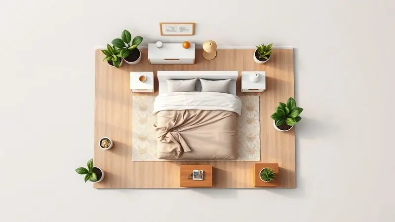
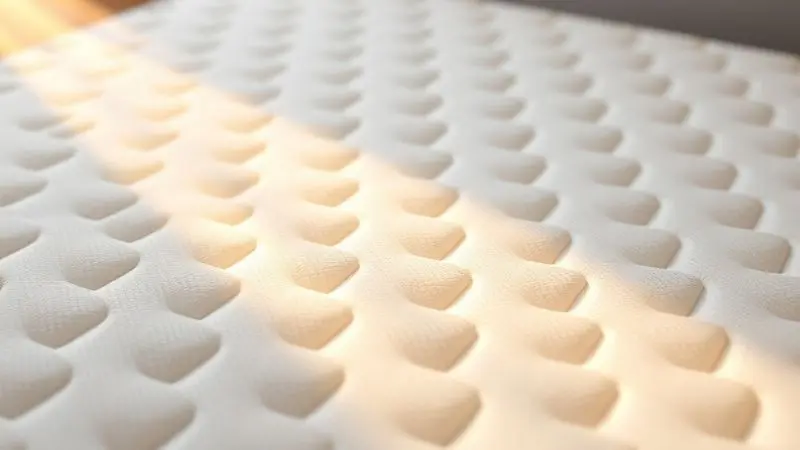

Imagine acordar depois de uma noite de sono perfeito. Suas costas não doem, você não se sentiu apertado e o espaço da cama permitiu que você e seu parceiro dormissem sem tocar um no outro sequer uma vez.

Essa experiência transformadora é o que um colchão king size promete - e entrega. Mas investir nessa peça majestosa vai além de escolher o maior tamanho disponível.

Você está prestes a descobrir como transformar seu quarto em um verdadeiro santuário do descanso, onde cada detalhe, desde as medidas exatas até a tecnologia de suporte, foi pensado para fazer seus sonhos valerem a pena.

<SummaryList products={frontmatter.top_products} />

## O que é um Colchão King Size e Quais as Suas Medidas Reais?

Pense no colchão king size como seu espaço pessoal ampliado para dormir. Enquanto uma cama comum pede que você se acomode, a king size convida você a se espalhar. No Brasil, suas medidas padrão são 193 cm de largura por 203 cm de comprimento.

Isso significa quase dois metros de liberdade lateral - espaço suficiente para você dormir de conchinha, de estrela-do-mar ou até dar uma cambalhota sem risco de queda.

Para casais, essa generosidade de espaço significa que cada um mantém seu território de conforto, mesmo quando compartilham a cama. E para quem tem filhos que adoram invadir a cama dos pais de madrugada, é a garantia de que todos cabem com conforto genuíno.

## Diferença entre Colchão Queen, King e Super King Size

Compreender essa hierarquia de tamanhos é essencial para não se enganar nas expectativas de espaço.

Pense assim: o queen (1,58m de largura) é como ter um tapete de ioga pessoal, o king (1,93m) é o tapete de yoga duplo, e o super king (2,03m+) é a área de meditação completa.

A diferença entre queen e king não é apenas técnica - são 35 centímetros que mudam completamente a experiência de compartilhar a cama. Enquanto no queen você sabe que seu parceiro está ali do lado, no king você pode literalmente esquecer.

O super king então é o território de quem valoriza o espaço pessoal acima de tudo.

### Colchão King Size de Molas Ensacadas: O Favorito dos Casais

<ProductBox 
  title={frontmatter.top_products[0].title} 
  image={frontmatter.top_products[0].image} 
  link={frontmatter.top_products[0].link} 
/>

Se você já acordou porque seu parceiro virou na cama, essa tecnologia foi feita para você. As molas ensacadas funcionam como pequenos sistemas de suporte independentes, cada uma respondendo apenas ao peso que recebe. O resultado prático?

Quando um se mexe, o outro não sente. Essa independência de movimento transforma dividir a cama de uma concessão em uma experiência individual. Marcas como Ortobom e Probel dominam esse segmento com camadas de espuma que equilibram maciez e firmeza.

Um detalhe prático: alguns modelos são realmente altos. Antes de escolher, meça a altura da sua cama atual e imagine adicionar esses centímetros extras - vale a pena verificar se você precisará de um banquinho para subir na cama.

### Colchão King Size de Espuma: Densidade e Firmeza na Medida Certa

<ProductBox 
  title={frontmatter.top_products[1].title} 
  image={frontmatter.top_products[1].image} 
  link={frontmatter.top_products[1].link} 
/>

Escolher um colchão de espuma king size é como encontrar o equilíbrio perfeito entre abraço e suporte. A densidade (medida em kg/m³) determina quanto tempo ele manterá essa qualidade.

Uma espuma D28 acolhe bem quem pesa entre 60 e 80 kg, enquanto a D45 oferece estrutura robusta para pesos acima de 100 kg. Para casais, a regra é simples: escolha baseado na pessoa mais pesada.

A firmeza é onde seu corpo conversa com o colchão. Se você dorme de lado, um modelo macio envolve seus ombros e quadris como um cobertor quente. Se acorda com dores nas costas, o firme trabalha como um terapeuta noturno, realinhando sua postura enquanto você sonha.

O segredo está em ouvir o que seu corpo precisa, não apenas o que sua mente deseja.

### Tecnologia Viscoelástica (NASA): Alívio de Pressão e Conforto Térmico

<ProductBox 
  title={frontmatter.top_products[2].title} 
  image={frontmatter.top_products[2].image} 
  link={frontmatter.top_products[2].link} 
/>

Essa espuma de memória que nasceu para proteger astronautas agora protege seu sono. Ela não apenas molda ao seu corpo, mas distribui o peso com uma precisão cirúrgica, dissipando pontos de pressão nos ombros e quadris.

Imagine deitar em uma nuvem que memoriza exatamente como você gosta de dormir.

A evolução mais inteligente são as tecnologias de controle térmico. Partículas de gel incorporadas à espuma absorvem seu calor corporal e o liberam gradualmente, mantendo uma temperatura constante durante a noite.

Sim, esses colchões podem ser mais pesados e exigir lençóis com cantos mais profundos, mas acordar sem suar vale cada grama extra. É o investimento que torna cada manhã mais renovadora.

### Colchão King Size Ortopédico: Suporte Extra para a Coluna

<ProductBox 
  title={frontmatter.top_products[3].title} 
  image={frontmatter.top_products[3].image} 
  link={frontmatter.top_products[3].link} 
/>

Para quem busca não apenas conforto, mas terapia noturna, o ortopédico king size é o aliado ideal. Sua firmeza controlada funciona como uma segunda coluna, mantendo sua postura alinhada enquanto seu corpo relaxa completamente.

Feito com espumas densas (D33 ou D45), ele suporta pesos até 150 kg por pessoa com a mesma estabilidade.

Essa robustez tem um preço prático - são colchões que exigem mais força para virar e podem limitar suas opções de cabeceira.

Mas pense nisso como a diferença entre um sofá bonito e uma poltrona ergonômica: um é esteticamente agradável, o outro transforma sua qualidade de vida.

## Como Saber se a Cama King Size Cabe no seu Quarto? (Dicas de Layout)

Antes de se apaixonar por um modelo específico, faça um exercício simples: pegue uma fita métrica e marque no chão os 193 x 203 cm que seu futuro colchão ocupará. Agora caminhe ao redor dessa área imaginária. Você consegue abrir gavetas? Chegar até a janela?

Faltam pelo menos 60 centímetros de espaço livre em todos os lados?

Esses 60 cm não são uma sugestão decorativa - são sua garantia de que você não viverá em um quarto que se tornou apenas uma cama gigante. Considere também a altura do teto: uma cama king size alta em um ambiente baixo pode criar uma sensação claustrofóbica.

O planejamento espacial é o que transforma uma cama grande em um refúgio, não em um obstáculo.

## 5 Critérios Cruciais para Avaliar Antes de Comprar sua King Size

Conhecer as opções é apenas o primeiro passo. Agora, como traduzir esse conhecimento em uma escolha que realmente funcione para você? Esses cinco pontos são seu guia de decisão.

### 1. Suporte de Peso e Biotipo Adequado

Seu colchão precisa entender seu corpo, não apenas suportá-lo. Pessoas mais leves realmente se beneficiam da maciez que os acolhe sem pressionar muito, enquanto corpos mais pesados necessitam da firminess que impede que afundem descontroladamente.

A magia acontece quando você encontra o ponto onde suporte e conforto se casam - onde seu quadril encontra apoio sem que seus ombros sintam-se comprimidos.

Experimentar diferentes modelos é conversar com seu corpo sobre o que ele realmente precisa, não o que você acha que ele quer.

### 2. Nível de Conforto: Macio, Intermediário ou Firme?

Essa escolha define como você acorda todas as manhãs. Um colchão macio é aquele abraço que você sente falta quando viaja, envolvendo seus pontos de pressão em uma nuvem personalizada.

O intermediário é o diplomata perfeito - oferece estrutura sem rigidez, adaptando-se às suas mudanças de posição durante a noite. Já o firme é a mão amiga nas costas, corrigindo suavemente sua postura enquanto você dorme.

Sua posição de dormir conta mais do que você imagina. Dormidores de lado geralmente abraçam a maciez, os de barriga para cima flertam com o intermediário, e os de bruços celebram a firmeza.

### 3. Tratamentos Antialérgicos, Antiácaros e Antifúngicos

Essa não é apenas uma característica técnica - é sua garantia de respirar melhor enquanto dorme.

Esses tratamentos criam uma barreira invisível contra os desencadeadores mais comuns de alergias noturnas: ácaros que se escondem nas fibras, fungos que amam a umidade, e poeira que se acumula silenciosamente. O benefício vai além da saúde respiratória.

Colchões com essas proteções mantêm-se limpos por mais tempo, sua estrutura interna permanece intacta por mais anos, e a sensação ao deitar é consistentemente fresca. É o investimento que protege tanto seu sono quanto sua saúde a longo prazo.

## Acessórios Indispensáveis: Capas, Protetores e Saias para King Size

<ProductBox 
  title={frontmatter.top_products[4].title} 
  image={frontmatter.top_products[4].image} 
  link={frontmatter.top_products[4].link} 
/>

Os acessórios certos transformam um bom colchão em uma experiência completa de conforto. As capas protetoras com tecnologias como TPU ou microfibra com gel não apenas defendem contra acidentes noturnos, mas criam uma segunda pele que regula temperatura e suavidade.

Pense nelas como o seguro do seu investimento - por uma fração do valor do colchão, você adiciona anos à sua vida útil.

As saias para camas king size são o detalhe que eleva sua cama de peça funcional a elemento central da decoração. Mais do que esconder a base, elas criam uma linha limpa que integra a cama ao ambiente.

E quando você encontrar aquela saia perfeita que combina exatamente com o tom da sua parede, entenderá como esses centímetros de tecido podem mudar completamente a atmosfera do quarto.

## Cabeceira para Cama King: Como Unir Estética e Funcionalidade

<ProductBox 
  title={frontmatter.top_products[5].title} 
  image={frontmatter.top_products[5].image} 
  link={frontmatter.top_products[5].link} 
/>

Uma cabeceira king size faz mais do que apenas proteger sua parede dos travesseiros - ela define a personalidade do seu santuário.

As opções estofadas oferecem aquele apoio acolhedor para ler antes de dormir, enquanto as de madeira ou MDF trazem uma elegância estrutural que fala mais alto que palavras.

Alguns modelos até incorporam prateleiras ou nichos, resolvendo o eterno dilema do 'onde colocar meu livro, meu celular e meus óculos'.

Mas a funcionalidade invisível é igualmente valiosa. Uma cabeceira bem instalada adiciona isolamento acústico, transformando seu quarto em uma bolha contra o barulho externo, e serve como uma barreira térmica adicional.

A instalação requer atenção - essa peça vai acompanhar você por anos, então vale a pena garantir que cada parafuso esteja no lugar certo.

## Roupas de Cama King Size: O Desafio de Encontrar as Peças Certas

<ProductBox 
  title={frontmatter.top_products[6].title} 
  image={frontmatter.top_products[6].image} 
  link={frontmatter.top_products[6].link} 
/>

Vestir uma cama king size é uma arte de precisão. Os 193 x 203 cm padrão exigem lençóis com elástico que realmente abracem essas dimensões - alguns chegam a 198 cm para acomodar colchões mais altos.

O caimento perfeito não é apenas estético: é o que impede que os lençóis se soltem quando você se vira à noite.

Os edredons (geralmente entre 260x280 cm) devem ser suficientemente grandes para que você e seu parceiro puxem para seu lado sem deixar ninguém descoberto. E as fronhas? Elas revelam se você realmente se importa com os detalhes.

Encontrar o conjunto perfeito pode exigir um pouco mais de busca, mas a sensação de deslizar para debaixo de lençóis que cobrem exatamente todo o espaço da sua cama é a recompensa que justifica a busca.

## Manutenção: Dicas para Fazer seu Investimento Durar 10 Anos ou Mais

Um colchão king size é um relacionamento de longo prazo, não um caso de uma noite. E como todo relacionamento duradouro, exige cuidado consistente. Girá-lo a cada três meses previne que seu corpo crie uma 'memória' permanente no mesmo lugar.

Um protetor qualidade não apenas defende contra manchas, mas cria uma barreira respirável que permite que a espuma mantenha sua elasticidade.

Aspirar regularmente é sua defesa contra os micro-inquilinos que tentam se instalar. E a dica mais simples é muitas vezes a mais negligenciada: deixe sua cama 'respirar' por algumas horas antes de fazer.

Essa ventilação natural combate a umidade que enfraquece as fibras ao longo do tempo. Esses poucos minutos de cuidado semanal são o que garantem que seu colchão ainda será seu refúgio perfeito em uma década.

## Conclusão

Escolher um colchão king size é uma jornada que começa com medidas técnicas e termina com a transformação da sua qualidade de vida noturna. Mais do que espaço físico, ele oferece espaço emocional - a liberdade para dormir em paz, sem concessões, sem adaptações.

Desde as molas ensacadas que respeitam seu movimento individual até a espuma viscoelástica que molda ao seu corpo como uma segunda pele, cada tecnologia existe para servir a um propósito simples: fazer você esquecer completamente da cama enquanto dorme nela.

Lembre-se que as dimensões do seu quarto ditam os limites, mas seus hábitos de sono ditam as possibilidades.

O colchão ideal não é o mais caro, nem o mais tecnológico - é aquele que desaparece no fundo da sua consciência quando você fecha os olhos, reaparecendo apenas como a sensação de 'que bom que dormi' ao acordar.

Seu próximo passo? Experimente. Deite-se em diferentes modelos, sinta como seu corpo responde, imagine acordar assim todos os dias pelos próximos dez anos.

Porque esse não é um móvel que você compra - é um investimento em milhares de noites de descanso que ainda estão por vir.