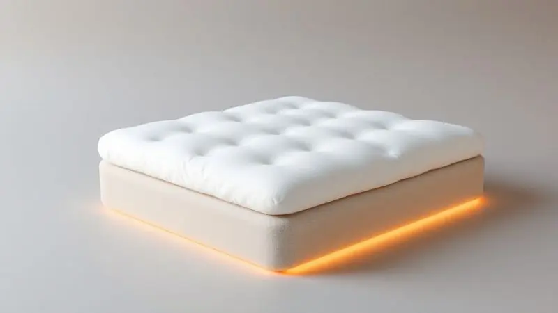
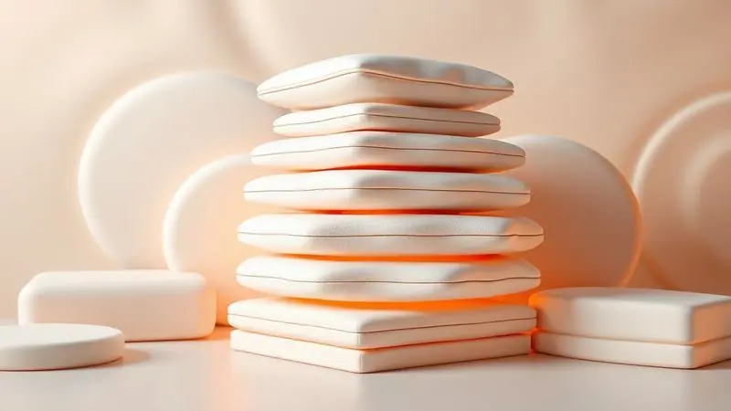

Você já sentiu que seu colchão, embora novo, não oferece aquele conforto de hotel que você tanto deseja? Ou talvez ele esteja um pouco firme demais para o seu gosto?

Se você busca uma solução prática para transformar suas noites sem precisar investir em um colchão novo, o pillow top pode ser a resposta.

Neste guia completo, você vai descobrir exatamente o que é esse acessório, as diferenças cruciais entre os tipos disponíveis e como escolher o modelo ideal para garantir o descanso que você merece.

<SummaryList products={frontmatter.top_products} />

## O que é Pillow Top e para que serve realmente?

Imagine deitar em uma cama que parece um abraço macio, adaptando-se perfeitamente ao seu corpo. É exatamente essa sensação que o pillow top oferece.

Esta camada adicional de acolchoado é costurada na parte superior do colchão, criando uma experiência de sono que alivia a pressão nos pontos críticos como ombros e quadris.

Em vez de apenas suportar seu corpo, ele o acolhe, transformando seu colchão atual em um verdadeiro refúgio noturno.

## Diferença entre Pillow Top e Pillow In: Qual a melhor escolha?

A escolha entre pillow top e pillow in vai além da aparência, e direto para como você quer sentir seu colchão. O pillow top coloca a maciez na superfície, oferecendo aquela sensação de nuvem que você sente imediatamente ao se deitar.

Já o pillow in embute essa camada, criando uma experiência mais integrada e firme. Pense assim: se você busca aquele toque suave e envolvente que convida ao relaxamento total, o pillow top é seu companheiro ideal.

Se prefere um suporte mais consistente que ainda oferece conforto sem tanto volume, o pillow in pode ser a escolha certa.

## Principais Benefícios de Usar um Pillow Top no seu Colchão

Adicionar um pillow top ao seu colchão não é apenas um upgrade estético, é uma transformação na qualidade do seu descanso. Ele age como uma barreira protetora contra o desgaste natural do colchão, enquanto oferece benefícios que você sente a cada noite.

### Conforto e Maciez de Hotel em Casa

Há algo mágico em dormir em um hotel luxuoso, e o segredo muitas vezes está no pillow top. Essa camada extra não apenas adiciona maciez, mas cria um ambiente de sono personalizado que se adapta ao seu corpo. O resultado?

A sensação de que seus ombros e quadris estão flutuando, não pressionados. É como transformar seu quarto em um spa particular, onde cada noite se torna uma experiência de relaxamento profundo.

### Alívio de Pontos de Pressão e Dores nas Costas

Para quem acorda com aquela dor incômoda nas costas ou sente que certas posições simplesmente não funcionam, o pillow top oferece um alívio real.

Ao distribuir seu peso de forma inteligente, ele elimina os pontos de pressão que forçam sua coluna fora do alinhamento natural. O resultado é um sono que não apenas descansa seu corpo, mas o repara.

Você acorda sentindo que realmente descansou, não que brigou com o colchão a noite toda.

### Preservação e Aumento da Vida Útil do Colchão

Seu colchão é um investimento, e o pillow top funciona como um seguro de longevidade. Ele absorve o impacto do uso diário, protegendo o núcleo do colchão do desgaste prematuro.

Pense nele como uma capa de alta performance que mantém seu colchão como novo por muito mais tempo, enquanto oferece benefícios imediatos de conforto. É a solução inteligente para quem quer prolongar a vida de um bom colchão sem abrir mão do conforto extra.

## Conheça os Diferentes Tipos de Materiais de Pillow Top

Agora que você entende como o pillow top pode transformar seu sono, é hora de explorar os materiais que fazem essa magia acontecer. Cada um oferece uma experiência única, adaptando-se a diferentes necessidades e preferências.

### Pillow Top de Espuma Viscoelástica (Tecnologia NASA)

<ProductBox 
  title={frontmatter.top_products[0].title} 
  image={frontmatter.top_products[0].image} 
  link={frontmatter.top_products[0].link} 
/>

Imagine um material que literalmente se molda ao seu corpo, como uma impressão personalizada do seu contorno. A espuma viscoelástica, originalmente desenvolvida pela NASA, oferece exatamente isso.

Ela distribui seu peso de forma perfeita, eliminando pontos de pressão enquanto proporciona um suporte que parece feito sob medida. Uma vantagem muitas vezes esquecida: ela absorve movimentos, então se seu parceiro se vira durante a noite, você continua em paz.

Alguns modelos podem ser mais pesados, mas essa pequena consideração é facilmente compensada pela qualidade do descanso que proporcionam.

### Pillow Top de Látex: Durabilidade e Frescor

<ProductBox 
  title={frontmatter.top_products[1].title} 
  image={frontmatter.top_products[1].image} 
  link={frontmatter.top_products[1].link} 
/>

Para quem valoriza frescor e resiliência, o pillow top de látex é uma escolha que dura. O material natural se adapta aos seus movimentos durante a noite, retornando à forma original com uma elasticidade que mantém o conforto consistente ano após ano.

Sua estrutura de células abertas age como um sistema de ventilação natural, mantendo você fresco mesmo nas noites mais quentes.

Embora o investimento inicial possa ser maior, a durabilidade excepcional (até três vezes mais que outros materiais) transforma esse pillow top em um companheiro de longo prazo para noites de sono revitalizantes.

### Pillow Top de Fibras Siliconadas ou Toque de Pluma

<ProductBox 
  title={frontmatter.top_products[2].title} 
  image={frontmatter.top_products[2].image} 
  link={frontmatter.top_products[2].link} 
/>

Na busca por maciez luxuosa com praticidade, essas duas opções oferecem caminhos distintos. As fibras siliconadas entregam um toque consistentemente macio que resiste ao tempo, além de serem naturalmente hipoalergênicas, um alívio para quem sofre com alergias.

Já o toque de pluma, especialmente nas versões naturais, oferece aquela sensação de nuvem que afunda delicadamente. A escolha aqui é entre a praticidade de manutenção fácil das siliconadas e o luxo aconchegante da pluma.

Para a maioria das pessoas, as fibras siliconadas oferecem o melhor equilíbrio entre conforto duradouro e cuidados simples.

### Pillow Top com Gel: Ideal para Quem Sente Muito Calor

<ProductBox 
  title={frontmatter.top_products[3].title} 
  image={frontmatter.top_products[3].image} 
  link={frontmatter.top_products[3].link} 
/>

Se você é daqueles que acorda no meio da noite sentindo calor, mesmo com o ar condicionado ligado, esta é a tecnologia que procura.

O pillow top com gel incorpora partículas refrigerantes na espuma viscoelástica, criando uma superfície que dissipa o calor do seu corpo de forma ativa. O resultado é uma sensação refrescante constante, não apenas no início da noite.

Você dorme profundamente sem aqueles despertares causados pelo desconforto térmico, acordando verdadeiramente revigorado.

## Pillow Top é Mesmo Necessário? Veja para Quem é Indicado

O pillow top não é um acessório supérfluo, mas uma solução direcionada para necessidades específicas de sono. Ele se torna essencial se você dorme de lado e sente que seus ombros e quadris merecem mais acolhimento.

É igualmente valioso para quem lida com dores nas costas ou articulações, oferecendo a adaptabilidade que mantém sua coluna no alinhamento correto durante toda a noite.

Se você simplesmente anseia por aquela sensação de luxo ao deitar, como se estivesse em uma suíte de hotel, o pillow top transforma essa fantasia em realidade diária.

Para quem prefere firmeza extrema, outras opções podem ser mais adequadas, mas para a maioria das pessoas que buscam conforto verdadeiro, ele faz toda a diferença.

## Como Escolher o Pillow Top Ideal: O Que Você Precisa Observar?

Escolher o pillow top perfeito é como encontrar o par de sapatos ideal: precisa se ajustar perfeitamente ao seu corpo e ao seu estilo de vida. Mais do que especificações técnicas, você deve buscar a sensação que ele proporciona.

### Medidas Corretas (Solteiro, Casal, Queen e King)

Um pillow top mal dimensionado é como um lençol curto, sempre escapando ou criando rugas desconfortáveis.

Para camas solteiro (88x188 cm), casal (138x188 cm), queen (158x198 cm) ou king (193x203 cm), a regra é simples: ele deve cobrir toda a superfície do colchão sem sobras ou faltas.

Essa cobertura completa não é apenas estética, garante que todo o seu corpo receba o mesmo nível de conforto, sem bordas duras ou transições abruptas.

### Espessura e Densidade Recomendadas

Aqui está onde a ciência encontra o conforto. Uma espessura entre 5 a 10 cm oferece aquele abraço macio sem fazer você afundar demais, mantendo o suporte necessário. Já a densidade, medida em kg/m³, determina por quanto tempo esse abraço permanece firme.

Valores entre 30 e 50 garantem que seu pillow top mantém a forma e o conforto por anos, não apenas por meses. Pense nisso como investir em uma durabilidade que acompanha seu compromisso com um sono de qualidade.

## Passo a Passo: Como Instalar e Fixar o Pillow Top Corretamente

A instalação adequada é o segredo para aproveitar todo o potencial do seu pillow top. Comece escolhendo uma base estável, como seu colchão atual ou cama box. Posicione-o centralizado, como se estivesse vestindo seu colchão com uma segunda pele.

Use as fitas de fixação (geralmente incluídas) para garantir que ele permaneça no lugar, especialmente importante se você se mexe bastante durante o sono. Elimine qualquer ruga ou bolha de ar passando a mão sobre a superfície. O teste final?

Deite-se e sinta: ele deve parecer uma extensão natural do seu colchão, não algo colocado por cima.

## Cuidados e Manutenção para o seu Acessório Durar Mais

Um pillow top bem cuidado é um pillow top que continua a cuidar de você. A capa protetora é sua melhor aliada, pois permite lavagens regulares sem danificar o material principal.

Gire-o a cada três meses, assim como faria com seu colchão, para garantir um desgaste uniforme. Evite a umidade excessiva e a luz solar direta, que podem comprometer a integridade dos materiais.

Esses pequenos gestos garantem que seu investimento continue proporcionando noites perfeitas por muito mais tempo.

## Perguntas Frequentes sobre Pillow Top (FAQ)

### O pillow top pode ser lavado na máquina?

A maioria dos pillow tops não foi projetada para a agitação da máquina de lavar. Em vez disso, use uma capa protetora lavável que preserve o material principal. Para limpezas pontuais, um pano úmido com sabão neutro resolve a maioria das situações.

Essa abordagem protege a estrutura do pillow top enquanto mantém a higiene que seu sono merece.

### De quanto em quanto tempo devo trocar o pillow top?

Um pillow top de qualidade dura entre 5 a 7 anos, mas seus sentidos são o melhor guia. Quando ele não oferecer mais o mesmo conforto, apresentar afundamentos visíveis ou simplesmente não conseguir mais mantê-lo limpo, é hora da substituição. A boa notícia?

Um novo pillow top pode revitalizar seu colchão existente por uma fração do custo de um colchão novo.

## Conclusão

Transformar suas noites de sono não precisa significar trocar todo o seu colchão. O pillow top oferece um caminho inteligente e acessível para alcançar aquele conforto de hotel que parece tão distante.

Ele é mais do que uma simples camada de espuma, é uma solução que entende seu corpo, alivia suas dores e transforma seu quarto em um santuário de descanso.

Desde o abraço personalizado da espuma viscoelástica até o frescor constante do gel, existe um pillow top perfeito para sua necessidade específica. O primeiro passo para noites verdadeiramente revigorantes começa com reconhecer que seu sono merece mais cuidado.

Experimente a sensação e descubra como pequenas mudanças podem criar grandes transformações na qualidade do seu descanso.