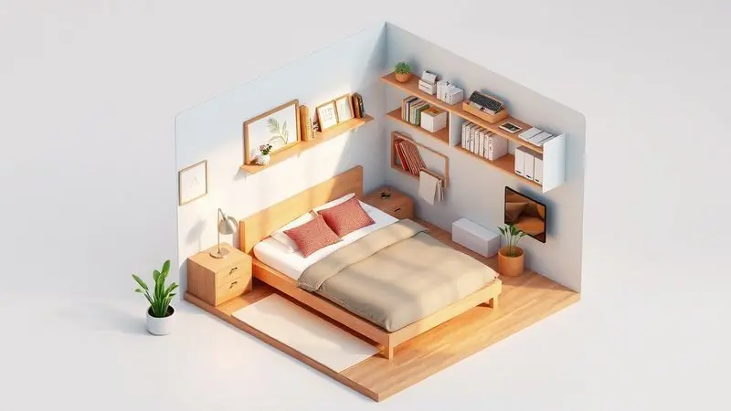

Você já sentiu que o colchão de solteiro é apertado demais, mas o de casal ocuparia todo o espaço do seu quarto? Existe um tamanho intermediário perfeito para seu descanso, e ele tem um nome peculiar: colchão de viúva.

Neste guia completo, você vai entender exatamente quais são as medidas desse modelo quase secreto, para quem ele foi feito e como escolher o melhor material para garantir noites de sono verdadeiramente revigorantes.

Prepare-se para descobrir por que esse tamanho "secreto" está ganhando cada vez mais adeptos no Brasil.

<SummaryList products={frontmatter.top_products} />

## O que é um colchão de viúva e por que ele tem esse nome?

Imagine um colchão que oferece mais conforto que um solteiro, mas sem a amplitude de um casal. Esse é o colchão de viúva, geralmente medindo 138 cm de largura por 188 cm de comprimento.

O nome "viúva" vem da ideia de que ele é ideal para quem dorme sozinho, especialmente em camas que eram originalmente destinadas a casais. Não é sobre solidão, mas sobre espaço pessoal bem aproveitado.

Ele oferece aquela área extra que você sempre quis, mas sem dominar o ambiente inteiro. Isso faz dele uma opção prática para quartos pequenos ou como cama extra para visitas, mas principalmente para pessoas que valorizam seu próprio espaço ao dormir.

## Qual o tamanho real do colchão de viúva? Entenda as medidas padrão

O colchão de viúva possui medidas padrão que variam entre 78 cm de largura e 188 cm de comprimento, sendo comumente chamado também de "colchão de solteiro largo". Essas dimensões são ideais para camas individuais ou espaços menores onde cada centimetro conta.

Mas dentro desse padrão existe uma escolha sutil que define sua experiência.

### A diferença entre o padrão 1,20m e 1,28m de largura

Aqui reside o detalhe que transforma o conforto: a diferença entre os colchões de viúva com 1,20m e 1,28m de largura está no espaço disponível para você se mover. O padrão de 1,20m é ideal para ambientes compactos ou para quem aprecia um aconchego mais definido.

O modelo de 1,28m, por outro lado, oferece aqueles 8cm extra que significam liberdade para se espreguiçar sem sentir limites.

Essa diferença pode ser crucial para quem se mexe bastante durante a noite ou para aqueles que simplesmente desejam a sensação de amplitude sem comprometer o quarto.

Para visualizar melhor como esse tamanho se posiciona no universo dos colchões:

- **Colchão Solteiro:** Geralmente 88 cm x 188 cm, ideal para crianças ou espaços muito limitados.

- **Colchão Viúva:** Aproximadamente 1,30 m x 1,90 m, oferece o equilíbrio perfeito entre espaço individual e economia de área.

- **Colchão Casal Padrão:** 1,38 m x 1,88 m, é o território do compartilhamento, perfeito para casais que buscam espaço total.

Esses tamanhos atendem a diferentes necessidades e preferências, mas o viúva se destaca como o nicho de conforto pessoal ampliado.

## Para quem o colchão de viúva é a escolha ideal?

O colchão de viúva é a resposta para várias situações que vão além do nome. Ele se encaixa magicamente em quartos menores, onde o espaço é limitado mas o desejo de conforto é grande, permitindo uma configuração prática e ainda aconchegante.

É o companheiro perfeito para solteiros ou pessoas que desejam mais área útil do que um solteiro oferece, sem precisar adotar um colchão de casal que dominaria o ambiente.

Também se torna uma escolha astuta para quem frequentemente recebe visitas, ofereciendo conforto extra sem comprometer a atmosfera do quarto. Sua versatilidade faz dele uma aposta segura para quem valoriza a funcionalidade sem abrir mão do bem-estar.

## Tipos de Colchão de Viúva: Molas Ensacadas ou Espuma?

Aqui você encontra duas filosofias de sono diferentes, cada uma com sua personalidade. Os colchões de viúva podem ser construídos com molas ensacadas ou com espuma, e a escolha define como sua noite será.

### Colchão de Viúva com Molas Ensacadas: Conforto e Individualidade

<ProductBox 
  title={frontmatter.top_products[0].title} 
  image={frontmatter.top_products[0].image} 
  link={frontmatter.top_products[0].link} 
/>

O colchão de viúva com molas ensacadas é uma declaração de independência para seu sono. Com medidas que variam de 1,20m a 1,28m de largura, ele se adapta elegantemente a quartos menores.

A grande vantagem das molas ensacadas é que elas oferecem suporte individual para cada parte do seu corpo, se adaptando às suas curvas de maneira quase personalizada.

Isso significa que cada movimento é respeitado pelo sistema, uma característica especialmente valorizada por quem se mexe bastante durante o sono. Essa robustez está diretamente relacionada à durabilidade e à qualidade do conforto oferecido.

Se você busca um equilíbrio entre espaço ocupado e experiência de descanso, essa pode ser sua opção ideal.

### Colchão de Viúva em Espuma (D33 ou D45): Firmeza e Suporte

<ProductBox 
  title={frontmatter.top_products[1].title} 
  image={frontmatter.top_products[1].image} 
  link={frontmatter.top_products[1].link} 
/>

Os colchões de viúva em espuma, especialmente nas densidades D33 e D45, são abraços calculados para seu corpo. O modelo D33 oferece um equilíbrio perfeito entre conforto e firmeza, tornando-se ideal para pessoas com peso entre 70 e 100 kg.

Ele proporciona um suporte consciente para sua coluna, prevenindo dores e oferecendo adaptabilidade tanto para uso individual quanto compartilhado.

Por outro lado, o colchão D45 é mais firme e suporta com mais autoridade pesos acima de 100 kg, sendo ideal para quem precisa de um apoio adicional e definitivo.

Embora tenha maior durabilidade devido à sua densidade elevada, essa característica também pode refletir em um investimento mais significativo.

Essa diferença de densidade impacta diretamente em como cada modelo acompanha seu corpo ao longo dos anos, então vale considerar seu estilo de vida e expectativas ao escolher entre eles.

## Cama Box de Viúva: Como escolher a base correta para o seu colchão

<ProductBox 
  title={frontmatter.top_products[2].title} 
  image={frontmatter.top_products[2].image} 
  link={frontmatter.top_products[2].link} 
/>

Escolher a cama box de viúva é completar a fundação do seu refúgio. É essencial garantir que as medidas da base sejam compatíveis com o colchão, que geralmente varia entre 1,20m x 2,03m e 1,28m x 2,00m.

Você pode optar por uma base box tradicional, que oferece suporte firme e é ideal se você não precisa de espaço extra de armazenamento.

Alternativamente, uma base baú é uma escolha inteligente se você busca aproveitar cada centimetro do quarto, oferecendo compartimentos adicionais. Outro ponto a ser considerado é o material da base; opções em madeira ou MDF são comuns e oferecem boa durabilidade.

Vale observar que algumas bases já incluem cabeceira integrada, adicionando um toque estético ao ambiente. Cuidado com a altura da base: ela deve ser confortável para facilitar sua entrada e saída da cama, evitando desconfortos.

Com essas diretrizes em mente, você poderá fazer uma escolha que une conforto, praticidade e estilo para seu espaço pessoal.

## O desafio do enxoval: Onde encontrar lençol para cama de viúva?

<ProductBox 
  title={frontmatter.top_products[3].title} 
  image={frontmatter.top_products[3].image} 
  link={frontmatter.top_products[3].link} 
/>

Encontrar lençóis para cama de viúva pode ser a última fronteira para personalizar totalmente seu refúgio, já que essa medida não é tão comum.

Você pode começar sua busca em lojas especializadas em enxovais, como Trousseau e Thais Enxovais, que costumam ter opções específicas nessa categoria.

Outra alternativa são as grandes plataformas de varejo online, como Mercado Livre e Shopee, que oferecem uma variedade impressionante de jogos de lençóis de diferentes marcas e materiais.

Além disso, lojas de móveis e decoração, como Westwing e Estrela Móveis, frequentemente têm enxovais que podem incluir opções adequadas para camas de viúva. Magazine Luiza também é uma boa aposta, pois eles costumam ter listas variadas de produtos.

Lembre-se que as medidas podem variar, então é sempre recomendável conferir as dimensões do seu colchão para garantir o ajuste perfeito. Assim, você encontra a combinação ideal para completar sua experiência de sono.

## Como organizar um quarto pequeno com uma cama de viúva

Organizar um quarto pequeno com uma cama de viúva é um exercício de inteligência espacial que resulta em conforto ampliado.

Comece escolhendo móveis multifuncionais, como uma cabeceira que possua prateleiras embutidas ou uma cama com gavetas que aproveite o volume inferior. Utilize espelhos estrategicamente nas paredes para criar a ilusão de um ambiente mais amplo e aberto.

O uso de cores claras nas paredes e na decoração também contribui decisivamente para essa sensação de amplitude. Além disso, aproveite as paredes para instalar prateleiras e armários altos, liberando o chão e mantendo a organização do espaço fluida.

Com essas estratégias, seu quarto se transformará em um ambiente aconchegante, funcional e pessoal.

## 5 Dicas fundamentais para não errar na compra do seu colchão de viúva

Na hora de escolher um colchão de viúva, alguns segredos garantem uma compra inteligente e satisfatória. Primeiro, verifique com precisão as medidas do colchão para garantir que ele se adequa ao seu espaço físico e às suas necessidades de movimento.

Experimente sempre o colchão pessoalmente, se possível, para sentir o conforto e o suporte que ele oferece ao seu corpo específico.

Considere também o tipo de material, como espuma ou mola, pois isso afeta diretamente a durabilidade e a sensação de conforto ao longo dos anos.

Pesquise sobre a reputação da marca e leia avaliações de outros consumidores para ter uma noção real da qualidade e da satisfação geral. Por último, não se esqueça de verificar as políticas de troca ou devolução, garantindo paz em sua decisão.

## Perguntas Frequentes (FAQ) sobre Colchão de Viúva

O colchão de viúva é uma opção popular e versátil, mas algumas dúvidas persistentes merecem clarificação. Muitos se perguntam sobre as medidas exatas desse colchão.

Ele geralmente possui dimensões de 1,38 m x 1,88 m, sendo ideal para quem busca mais espaço do que um colchão de solteiro oferece, sem ocupar a área extensa de um modelo de casal. Outro questionamento frequente é sobre sua durabilidade.

A qualidade do material escolhido influencia decisivamente nesse aspecto, e é essencial selecionar um modelo que atenda suas necessidades específicas de conforto e resistência.

Além disso, a escolha entre espuma ou molas também deve ser considerada com cuidado para garantir que sua noite de sono seja verdadeiramente reparadora.

## Conclusão

O colchão de viúva emerge como a solução inteligente para quem busca equilíbrio: mais espaço pessoal sem a ocupação total do ambiente.

Seja para quartos compactos, para solteiros que valorizam seu território de descanso, ou como opção hospitaleira para visitas, ele oferece uma dimensão de conforto que muitos desconhecem.

Entre as medidas precisas, os tipos de construção (molas ensacadas ou espuma D33/D45) e os detalhes complementares como a base e o enxoval, cada escolha permite personalizar sua experiência de sono.

Organizar o quarto para acomodar essa cama torna-se um desafio gratificante, maximizando funcionalidade e estilo. Ao seguir as dicas fundamentais de compra, você investe não apenas em um produto, mas em um refúgio personalizado.

O colchão de viúva não é apenas um tamanho, é uma filosofia de espaço pessoal bem aproveitado, onde cada centimetro conta para suas noites revigorantes.