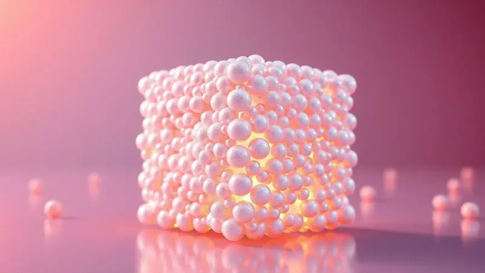
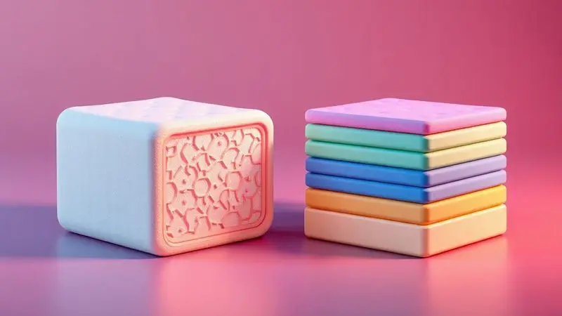
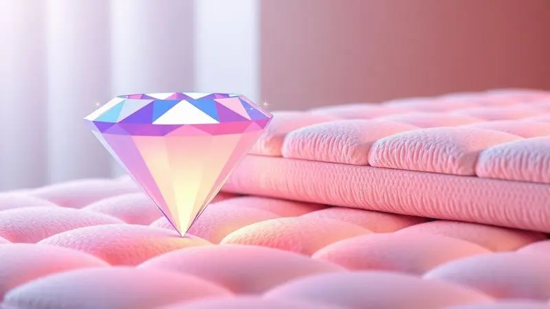

Muitas pessoas se surpreendem ao descobrir que o seu colchão novo pode conter placas de isopor em seu interior, o que gera uma dúvida imediata: será que o colchão com EPS é bom ou uma economia que não vale a pena?

Se você está confuso com as promessas dos vendedores e quer entender a realidade por trás desse material, você está no lugar certo.

Neste guia definitivo, vamos desmistificar o uso do poliestireno expandido na indústria do sono, revelando as vantagens ocultas e os riscos para a sua coluna.

Você aprenderá a ler etiquetas como um especialista e descobrirá quais são as melhores alternativas para garantir noites de sono reparadoras e duradouras.

<SummaryList products={frontmatter.top_products} />

## O que é EPS no colchão e qual sua real função na estrutura?

EPS, ou Poliestireno Expandido, é um material leve e isolante que tem ganhado espaço na fabricação de colchões. Sua principal função é proporcionar suporte e conforto, servindo como uma camada que ajuda a distribuir o peso do corpo de maneira uniforme.

Isso contribui para uma boa postura durante o sono e pode reduzir pontos de pressão, favorecendo um descanso mais reparador.

Além desses benefícios ergonômicos, o EPS possui propriedades térmicas interessantes, ajudando a regular a temperatura do colchão e criando um ambiente de sono mais agradável.

## Colchão com Isopor é bom? Analisando os Prós e Contras de forma honesta

Imagine levantar um canto do colchão para trocar o lençol e sentir quase nenhum peso. Essa é a experiência prática dos colchões com EPS. Mas essa leveza tem uma contrapartida que precisamos analisar com franqueza.

### Vantagens: Leveza, isolamento térmico e preço reduzido

A primeira vantagem que você nota é justamente a facilidade no dia a dia. Virar o colchão sozinho naquela faxina de fim de semana deixa de ser um exercício olímpico.

O EPS também funciona como uma barreira térmica inteligente, mantendo o calor do seu corpo em noites frias e ajudando a dissipá-lo no verão.

E o que atrai muitos compradores é o preço acessível, uma porta de entrada para quem busca conforto sem comprometer o orçamento familiar.

### Desvantagens: Baixa durabilidade e o problema dos ruídos no sono

Essa leveza tem um preço. Enquanto um colchão de espuma densa ou látex pode acompanhar você por uma década, o EPS tende a perder sua resiliência mais rapidamente. Pense em uma almofada de sofá que lentamente perde o volume.

Além disso, alguns modelos podem produzir ruídos sutis a cada movimento, o que pode transformar uma noite tranquila em uma sinfonia de estalos para quem tem o sono leve.

## O uso de EPS no colchão oferece riscos à saúde ou à coluna?

Aqui está o ponto que mais preocupa os dorminhocos conscientes. O EPS não é inerentemente prejudicial, mas sua capacidade de suporte é limitada.

Se você já acorda com aquela dorzinha nas costas que parece um lembrete matinal, pode ser sinal de que seu corpo precisa de algo mais estruturado.

O material funciona bem para quem dorme de barriga para cima e tem peso mais leve, mas para quem tem problemas ortopédicos preexistentes ou precisa de um alinhamento mais preciso da coluna, pode ficar devendo.

## Colchão com EPS vs. Colchão 100% Espuma: Principais diferenças práticas

Parece um combate entre dois estilos de abraço. O EPS oferece um aconchego mais firme e definido, como um abraço rápido e direto. Já a espuma 100% é aquele abraço que se molda ao seu corpo, acolhendo cada curva e contorno.

A diferença prática é que enquanto o EPS mantém sua forma inalterada, a espura de alta densidade vai ceder levemente exatamente onde você precisa, redistribuindo a pressão de maneira inteligente.

## 3 Alternativas Superiores ao EPS para quem busca qualidade de vida

Se você chegou até aqui pensando 'existem opções melhores', acertou. Estas são as três experiências de sono que realmente transformam seu descanso em um investimento em saúde.

### Colchão de Látex Natural: Alta durabilidade e suporte ergonômico

<ProductBox 
  title={frontmatter.top_products[0].title} 
  image={frontmatter.top_products[0].image} 
  link={frontmatter.top_products[0].link} 
/>

O látex natural é o sábio da família dos materiais de sono. Ele não apenas se adapta ao seu corpo, mas o faz com uma memória impressionante, retornando à forma original ano após ano.

Imagine deitar e sentir o colchão afundar levemente nos seus ombros e quadris, aliviando a pressão exatamente onde seu corpo mais precisa. Para quem sofre com alergias, é um aliado silencioso, resistindo naturalmente a ácaros e mofo.

### Colchão de Molas Ensacadas: Conforto individualizado sem isopor

<ProductBox 
  title={frontmatter.top_products[1].title} 
  image={frontmatter.top_products[1].image} 
  link={frontmatter.top_products[1].link} 
/>

Cada mola ensacada trabalha como um pequeno pilar independente, sustentando apenas a área sobre ela. O resultado prático? Você vira para o lado e seu parceiro nem percebe. O movimento não se propaga. É como se cada um tivesse seu território de sono demarcado.

E para a coluna, cada vértebra recebe o suporte exato que precisa, sem comprometer as regiões vizinhas.

### Colchão de Espuma D33 ou D45: Densidade real para maior vida útil

<ProductBox 
  title={frontmatter.top_products[2].title} 
  image={frontmatter.top_products[2].image} 
  link={frontmatter.top_products[2].link} 
/>

Aqui os números falam por si, mas vamos traduzi-los para a sua experiência: o D33 (33 kg/m³) é aquele abraço firme e confiável, perfeito para a maioria dos corpos.

Já o D45 (45 kg/m³) é o suporte que não negocia, ideal para quem precisa sentir que o colchão não cede um milímetro. É a diferença entre afundar levemente e sentir-se sustentado por uma superfície que responde à sua presença sem se render completamente.

## Guia Prático: Como identificar se o colchão tem EPS antes da compra

Você não precisa ser um especialista em materiais. Comece virando o colchão e lendo a etiqueta com atenção criminal. Procure por 'EPS', 'Poliestireno Expandido' ou até mesmo 'isopor'.

Na loja, pressione com as mãos e perceba se a superfície tem uma leveza diferente, menos densa.

E jamais tenha vergonha de perguntar ao vendedor: 'Quais camadas tem por dentro e qual a função de cada uma?' A resposta dele pode revelar mais do que qualquer especificação técnica.

## Por que colchões sem EPS são mais caros (e por que o investimento compensa)?

O preço mais elevado não é um capricho da indústria, é a matemática da qualidade. Materiais como látex natural, espumas de alta densidade e molas ensacadas têm processos de produção mais complexos e duram significativamente mais.

Pense assim: um colchão com EPS pode custar R$800 e durar 3 anos, enquanto um de látex custa R$2.500 mas acompanha você por 12 anos. Divida o valor pela quantidade de noites de sono, e de repente o 'caro' se torna a opção mais econômica da sua vida.

## Conclusão

O colchão com EPS é como aquele amigo prático que resolve problemas imediatos, mas não necessariamente para a vida toda.

Sua leveza e preço acessível fazem sentido para situações temporárias, quartos de hóspedes, ou quem está começando a vida sozinho e precisa de uma solução rápida.

Mas quando pensamos em sono como parte fundamental da nossa saúde, em noites que se acumulam ano após ano, investir em materiais mais estruturados não é luxo, é inteligência.

Seu corpo passa um terço da vida sobre um colchão. Ele merece mais do que um material que apenas cumpre tabela. Merece um aliado que entende suas curvas, respeita sua coluna e promete estar lá, firme e confiável, por todas as noites que virão.

A escolha, como sempre, começa com um simples questionamento: como você quer acordar amanhã?

## Perguntas Frequentes (FAQ) sobre Colchões com EPS

Os colchões com EPS (poliestireno expandido, também conhecido como isopor) têm ganhado atenção por suas propriedades de leveza e resistência à umidade. Uma dúvida comum é sobre a durabilidade desses colchões.

Em geral, eles oferecem uma vida útil considerável, mas pode variar conforme o uso e a qualidade do material. Muitas pessoas questionam se o EPS é confortável.

Essa questão depende das preferências individuais; enquanto alguns acham a firmeza do material agradável, outros podem preferir opções mais macias. Além disso, a ventilação é uma preocupação frequente.

Embora o EPS não retenha calor, é essencial garantir que o colchão tenha uma boa camada de revestimento para conforto térmico.