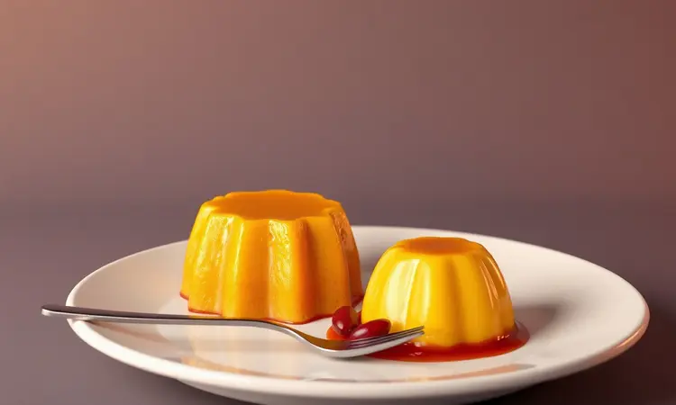
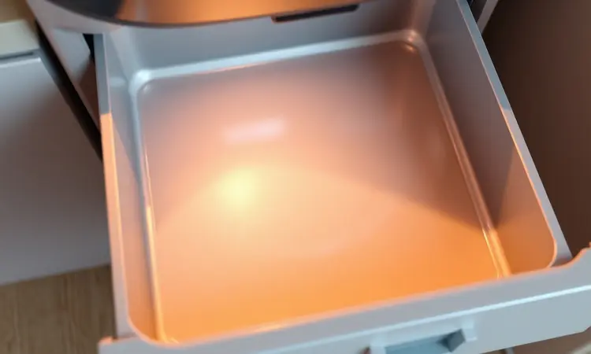

Você já sentiu que sua air fryer poderia fazer muito mais do que apenas requentar comida ou fritar batatas congeladas?

A verdade é que este eletrodoméstico é uma das ferramentas mais versáteis da cozinha moderna, mas a maioria das pessoas utiliza apenas uma fração do seu potencial.

Neste guia definitivo, eu vou te mostrar como transformar sua rotina com 101 receitas que vão do café da manhã sofisticado ao jantar prático em família.

Você vai descobrir desde o ponto perfeito da picanha até sobremesas surpreendentes, além de dicas de mestre para garantir que tudo saia sempre crocante e suculento.

<SummaryList products={frontmatter.top_products} />

## Por que a Air Fryer é a Melhor Aliada da Cozinha Saudável?

Imagine preparar aquelas receitas que você sempre associou à 'fritura pesada' sem aquele sentimento de culpa depois da refeição.

Isso é o que a tecnologia de circulação de ar quente oferece: um calor inteligente que envolve seus alimentos, garantindo que cada pedaço tenha a mesma textura crocante perfeita.

O resultado não é apenas menos óleo na comida, mas também aquela liberdade para experimentar coisas novas sabendo que você está fazendo algo mais saudável sem sentir que está fazendo dieta.

E essa versatilidade vai além. Você pode preparar desde vegetais que ficam tão irresistíveis que seus filhos começam a pedir mais, até carnes que mantêm toda sua suculência natural.

É como ter um pequeno chef dedicado na sua cozinha, incentivando um estilo de vida mais equilibrado sem abrir mão do prazer de comer bem.

## Melhores Fritadeiras Elétricas do Mercado: Qual Escolher?

<ProductBox 
  title={frontmatter.top_products[0].title} 
  image={frontmatter.top_products[0].image} 
  link={frontmatter.top_products[0].link} 
/>

Em 2023, escolher sua air fryer é quase como encontrar o parceiro perfeito para suas aventuras na cozinha.

Se você tem uma família maior, modelos como a Mondial Grand Family com capacidades de 8L e 12L oferecem espaço suficiente para preparar o almoço completo sem ter que fazer em etapas, com potência de até 2000W que garante rapidez.

Para quem ama tecnologia, a Philips Walita com a linha Airfryer Essential XL Conectada traz recursos inteligentes que podem transformar seu preparo, mas pode ser um pouco mais complexa se você busca algo simples.

A Philco Jumbo Gourmet combina fritura e assado em um mesmo aparelho, dando aquela sensação de 'duas ferramentas em uma', embora alguns usuários relatem preocupações sobre a durabilidade do cesto.

A Arno Air Fryer Ultra também é bem reconhecida por seu cozimento uniforme, quase como um calor que sabe exatamente onde precisa trabalhar.

É importante considerar, especialmente se você tem uma cozinha pequena, que muitas fritadeiras têm tamanhos compactos, então verificar as dimensões antes da compra pode evitar aquela frustração de 'não cabe no meu espaço'.

## Carnes Vermelhas e Suínas: Suculência e Sabor

Se você pensava que a air fryer era apenas para snacks rápidos, prepare-se para redefinir seus conceitos.

Carnes vermelhas e suínas ganham uma nova vida dentro dessa cesta: imagine aquela picanha que sempre exigia atenção constante no grill agora cozinhando uniformemente, com texturas crocantes por fora e macias por dentro, tudo enquanto você prepara os acompanhamentos sem pressa.

### Picanha na Air Fryer com Sal Grosso: O Segredo do Ponto Perfeito

O aroma da picanha com sal grosso perfumando sua sala enquanto você prepara o resto do jantar... essa experiência começa com um tempero que realça o sabor da carne e ajuda a manter a umidade. O segredo está em deixar a carne descansar antes de cozinhar.

A configuração ideal geralmente varia entre 200°C e 220°C por cerca de 20 a 30 minutos, dependendo da espessura do corte. Não se esqueça de virar a picanha na metade do tempo para garantir que cada lado receba a mesma atenção do calor inteligente!

### Costelinha de Porco e Panceta: Como Conseguir a Pururuca Perfeita

Aquela pururuca que faz todos pararem para olhar quando você serve a costelinha começa com um tempero cuidadoso. Use sal grosso, pimenta e ervas a gosto, mas o verdadeiro segredo está em deixar a pele da carne bem seca.

Na air fryer, ajuste a temperatura para 200°C e cozinhe inicialmente por cerca de 25 minutos. Depois disso, aumente a temperatura para 220°C e deixe por mais 10 minutos ou até que a pele fique dourada e crocante.

É quase como ter um controle preciso sobre cada etapa, garantindo uma delícia suculenta por dentro e crocante por fora.

### Hambúrguer Caseiro e Almôndegas: Praticidade sem Sujeira

Preparar hambúrgueres e almôndegas em casa pode ser uma atividade divertida que antes parecia bagunça inevitável. Com a Air Fryer, você evita o uso excessivo de óleo, resultando em pratos mais leves onde você pode sentir o verdadeiro sabor dos ingredientes.

Basta moldar as porções e deixá-las na Air Fryer por um tempo controlado. Em pouco tempo, você terá deliciosos hambúrgueres e almôndegas prontinhos para saborear, ideal para aquela refeição rápida durante a semana ou para impressionar amigos numa reunião.

## Aves: Do Frango Inteiro ao Petisco Crocante

E quando você quer algo ainda mais rápido? Aves na air fryer entregam aquela praticidade que transforma o preparo de frango em algo quase automático.

Desde frangos inteiros que surpreendem com sua suculência até petiscos como asas e coxinhas que ficam perfeitos para compartilhar, a versatilidade é impressionante.

### Frango a Passarinho e Tulipas: O Petisco Ideal para o Final de Semana

Imagine reunir amigos e servir frango a passarinho e tulipas com aquela crocância que faz todos comentar 'como você fez isso?' A marinada é essencial: uma mistura de temperos como alho, limão e ervas proporciona um sabor que parece ter horas de preparo, mas na verdade foi quase instantâneo.

As tulipas, por sua vez, podem ser temperadas com uma combinação de especiarias que agrada ao paladar desde o primeiro contato. Sirva com um molho de sua preferência e tenha um final de semana gostoso onde você é o chef sem o trabalho de chef.

### Filé de Frango Empanado e Cordon Bleu na Air Fryer

Aqueles dias onde você precisa de uma refeição rápida mas não quer cair na rotina do 'mesmo prato sempre'... o filé de frango empanado na Air Fryer é a resposta.

O preparo é simples: basta temperar os filés, empaná-los com farinha de rosca e a Air Fryer faz o trabalho de deixá-los crocantes por fora e suculentos por dentro, utilizando bem menos óleo do que a fritura tradicional.

O Cordon Bleu, que é uma variação do filé empanado, combina o sabor do frango com queijo e presunto, resultando em um prato que parece gourmet mas sai da sua kitchen em minutos.

## Peixes e Frutos do Mar: Leveza e Rapidez

Para quem busca opções ainda mais leves, peixes e frutos do mar na air fryer oferecem aquela sensação de 'refeição saudável' sem o trabalho complexo de preparação.

Esses alimentos ficam macios e saborosos, preservando seus nutrientes enquanto oferecem uma textura crocante por fora que normalmente exigia muito mais atenção.

### Salmão com Crosta de Ervas e Postas de Tilápia

O salmão com crosta de ervas é aquela opção que parece de restaurante mas você faz em casa: basta temperar o salmão com uma mistura de ervas frescas, como alecrim, tomilho e salsinha, além de um toque de limão.

Na air fryer, ele fica perfeitamente suculento por dentro e crocante por fora, quase como um controle de temperatura perfeito que você não precisa monitorar.

As postas de tilápia são uma alternativa leve e igualmente saborosa que podem ser temperadas com limão e coentro, oferecendo um prato rico em sabor e nutrientes que transforma qualquer dia comum em algo especial.

### Camarão Crocante e Bolinho de Bacalhau

Aqueles aperitivos que normalmente fazem você pensar 'muita bagunça para preparar' agora se tornam simples. Camarão crocante e bolinho de bacalhau são irresistíveis especialmente quando preparados na air fryer.

O camarão é temperado com ervas e empanado, resultando em uma textura crocante por fora e suculenta por dentro, enquanto o bolinho de bacalhau combina a leveza da batata com o sabor marcante do peixe.

Cozinhar esses petiscos na air fryer oferece a vantagem de serem mais saudáveis, já que utilizam menos óleo, e a praticidade garante que você possa saborear essas delícias em pouco tempo, perfeitas para aquela reunião onde você quer impressionar sem estresse.

## Legumes e Acompanhamentos que Surpreendem

E os acompanhamentos? Os legumes preparados na air fryer ganham uma crocância deliciosa que normalmente só conseguíamos com muito óleo.

Experimente beterrabas, abobrinhas e aspargos como acompanhamentos saudáveis que encantam em qualquer refeição, quase como descobrir que vegetais podem ser a parte mais pedida do prato.

### Batata Frita, Rústica e Chips: Como Deixar Ultra Crocante

Para preparar batatas fritas, rústicas ou chips ultra crocantes na air fryer, comece escolhendo batatas de boa qualidade, como a Asterix ou a Yukon Gold. Corte-as em tiras ou rodelas finas e mergulhe-as em água com um pouco de sal por cerca de 30 minutos.

Isso ajuda a remover o amosto e garante aquela crocância que faz diferença. Seque bem antes de temperar com azeite, sal e especiarias a gosto. A temperatura ideal para fritar varia entre 180°C a 200°C, dependendo da espessura.

Com cuidado e tempo, você terá um acompanhamento delicioso que faz qualquer prato principal parecer ainda melhor.

### Vegetais Assados: Couve-flor Gratinada, Abobrinha e Tomate Confit

Vegetais assados na air fryer são aquela maneira de adicionar sabor e saúde às suas refeições sem complicação.

A couve-flor gratinada, por exemplo, combina perfeitamente a crocância externa com o cremoso do queijo, proporcionando um prato reconfortante que parece ter horas de preparo.

A abobrinha assada fica irresistivelmente suculenta e pode ser temperada com ervas para dar um toque especial. O tomate confit, por sua vez, se transforma em uma explosão de sabor enquanto mantém sua textura macia.

Essas opções não apenas são fáceis de preparar, mas também trazem benefícios nutricionais significativos, tornando-se ideais para qualquer dieta onde você não quer sentir que está sacrificando o prazer.

## Lanches, Pães e Salgados Rápidos

E para aqueles momentos entre refeições? Nesta seção, você encontrará uma variedade de receitas práticas para lanches, pães e salgados que podem ser preparados rapidamente na air fryer.

Essas opções são perfeitas para quem busca uma alimentação saudável sem abrir mão do sabor, quase como ter uma pequena lanchonete saudável dentro de casa.

### Pão de Queijo (Tradicional e Fit) e Dadinho de Tapioca

O pão de queijo é um clássico da culinária brasileira, sendo amado por sua crocância e sabor inconfundível. Na versão fit, a receita pode incluir ingredientes como batata-doce ou farinha de aveia, mantendo o sabor, mas reduzindo calorias sem perder a experiência.

O dadinho de tapioca é uma opção deliciosa e versátil, ideal como petisco ou acompanhamento que surpreende quem experimenta.

Prepará-los na air fryer garante uma textura irresistível, com menos gordura do que as versões fritas, dando aquela sensação de 'fiz algo especial' sem o trabalho especial.

### Pizza, Pastel e Coxinha: Versões Sem Óleo

A Air Fryer revolucionou a forma como preparamos comidas que normalmente eram associadas à fritura pesada. Pratos saborosos como pizza, pastel e coxinha agora podem ser feitos de maneira saudável, sem a necessidade de óleo.

Usando a circulação de ar quente, esses alimentos ficam crocantes por fora e macios por dentro, mantendo o sabor autêntico que você ama. Além disso, você pode personalizar os recheios e massas conforme seu gosto, tornando cada receita única.

Essa é uma ótima maneira de desfrutar de delícias que geralmente são consideradas menos saudáveis, agora de uma forma que você pode sentir mais liberdade.

## Doces e Sobremesas: O que Você Não Sabia que Dava para Fazer

E quando você pensa em sobremesa? A air fryer é uma aliada versátil que permite preparar doces e sobremesas de forma prática.

Você pode fazer bolos, brownies e até frutas caramelizadas, tudo com menos gordura e em menos tempo do que no forno tradicional, quase como ter um especialista em doces que trabalha rápido.

### Pudim de Leite Condensado e Brownie de Chocolate na Air Fryer

Preparar sobremesas na air fryer pode ser aquela experiência deliciosa que transforma um dia comum.

Para o pudim de leite condensado, a combinação de ingredientes simples como leite, açúcar e ovos resulta em uma textura cremosa, enquanto o uso da air fryer proporciona um cozimento uniforme que elimina aquela ansiedade de 'vai ficar igual?'.

O brownie de chocolate é perfeito para quem busca um doce mais indulgente. A air fryer garante uma crosta crocante por fora, mantendo o interior molhadinho como aqueles brownies que parecem profissional.

Ambas as receitas são rápidas e trazem um toque especial às suas refeições, permitindo que você desfrute de sobremesas irresistíveis sem muito esforço.

### Frutas Assadas: Banana com Canela e Maçã com Sorvete

Frutas assadas na air fryer são aquela opção deliciosa e saudável para uma sobremesa rápida que parece gourmet. A banana com canela é uma combinação clássica: basta cortar a banana ao meio, polvilhar canela e deixar na air fryer até que fique macia e caramelizada.

A maçã com sorvete é perfeita para dias quentes: basta cortar a maçã em gomos, adicionar um toque de açúcar e canela, e assar até que fique dourada.

Servir essa maçã quentinha com uma bola de sorvete vai elevar a experiência, equilibrando o quente e o frio de maneira irresistível que faz qualquer ocasião parecer especial.

## Acessórios Indispensáveis para turbinar sua Air Fryer

<ProductBox 
  title={frontmatter.top_products[1].title} 
  image={frontmatter.top_products[1].image} 
  link={frontmatter.top_products[1].link} 
/>

Para maximizar o uso da sua Air Fryer e diversificar as receitas, alguns acessórios são essenciais. Por exemplo, formas de silicone são ótimas para bolos e tortas, pois evitam que os alimentos grudem e são fáceis de limpar.

Também é interessante ter tapetes de silicone ou papel antiaderente para proteger o revestimento da cesta e facilitar a limpeza após o uso.

Grelhas empilháveis podem dobrar a capacidade de preparo, permitindo cozinhar diferentes pratos ao mesmo tempo.

Um pincel de silicone é uma boa adição para aplicar óleos ou marinadas uniformemente, enquanto um borrifador de óleo ajuda a controlar a quantidade utilizada nos alimentos.

É importante considerar, no entanto, que a compra de diversos acessórios pode aumentar o investimento inicial. Mas, pensando na versatilidade e praticidade que oferecem, muitos usuários acham que realmente vale a pena.

## 5 Dicas de Ouro para sua Air Fryer Durar Mais e Cozinhar Melhor

Para garantir que sua air fryer tenha uma longa vida útil e ofereça sempre o melhor desempenho, siga estas dicas valiosas. Primeiro, faça sempre a limpeza após cada uso, removendo resíduos de alimentos e gordura, o que evita odores e prolonga a vida do aparelho.

Segundo, evite sobrecarregar a cesta. Isso pode prejudicar a circulação de ar e afetar a cocção. Também é essencial pré-aquecer a air fryer quando indicado, garantindo que seus pratos cozinhem uniformemente.

Além disso, use utensílios adequados, como silicone ou madeira, para não arranhar o revestimento. Por último, siga as instruções do fabricante para a manutenção correta e maximize a durabilidade do seu equipamento.

## Como Limpar sua Air Fryer Corretamente (Sem Estragar o Antiaderente)

Limpar a air fryer corretamente é essencial para garantir sua durabilidade e manter a qualidade da comida. Comece desconectando o aparelho e deixando esfriar. Remova a cesta e a bandeja, que geralmente podem ser lavadas na água morna com detergente neutro.

Use uma esponja macia para evitar arranhar o revestimento antiaderente. Além disso, evite produtos abrasivos ou palhas de aço. Para a parte interna, um pano úmido é suficiente para limpar os resíduos de gordura.

Manter a air fryer limpa não só melhora o sabor das receitas, mas também ajuda a evitar odores desagradáveis.

## Perguntas Frequentes (FAQ)

A Air Fryer tem ganhado cada vez mais espaço nas cozinhas, mas muitas pessoas ainda têm dúvidas sobre seu uso. Uma das perguntas mais comuns é se a Air Fryer realmente é saudável.

A resposta é sim, pois ela utiliza ar quente para cozinhar os alimentos, o que geralmente resulta em pratos mais leves e com menos gordura do que os fritos em óleo. Outra dúvida frequente é sobre o tempo de cozimento.

Na maioria das vezes, os pratos ficam prontos mais rapidamente do que em métodos tradicionais. Além disso, muitas receitas podem ser adaptadas para essa tecnologia, tornando-a versátil e prática para o dia a dia.

## Conclusão

Você começou este artigo pensando que sua air fryer era apenas para requentar comida ou fritar batatas congeladas. Agora, você tem um mapa completo para transformar essa ferramenta em sua aliada mais versátil na cozinha.

De carnes suculentas que parecem ter horas de preparo a sobremesas que surpreendem qualquer convidado, cada seção revelou que esse eletrodoméstico é mais que um utensílio: é um portal para explorar novas habilidades sem complicação.

Aquelas características técnicas que antes pareciam apenas números - circulação de ar quente, menos óleo, versatilidade - agora se traduzem em experiências vividas: o calor inteligente que cozinha tudo sem excesso, a liberdade para experimentar receitas que você evitava, e a emoção de descobrir uma nova habilidade cada semana.

Com as dicas de cuidados e os acessórios recomendados, sua air fryer não apenas durará mais, mas também se tornará parte fundamental da sua rotina alimentar.

Você já não é alguém que apenas usa uma air fryer - você é alguém que sabe como fazer dela seu parceiro para criar momentos especial em cada refeição. Que comece sua próxima aventura na cozinha!