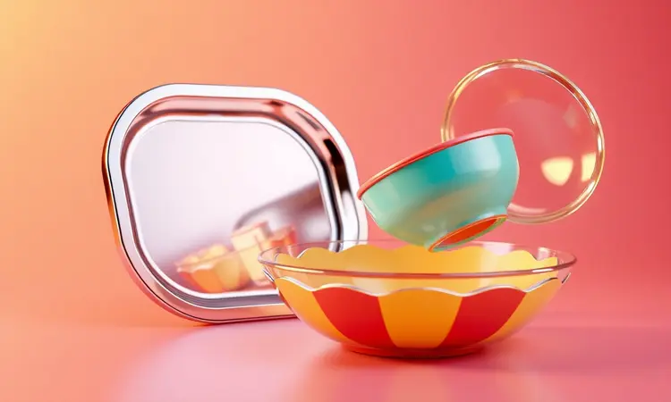

Você finalmente adquiriu sua fritadeira elétrica, mas agora surge a dúvida: será que esse pote de vidro pode ir lá dentro? Ou será que o papel alumínio vai estragar o aparelho?

Entender exatamente o que pode e o que não pode na AirFryer é o segredo para garantir receitas perfeitas, evitar acidentes domésticos e fazer seu eletrodoméstico durar muito mais anos.

Neste guia definitivo, vamos detalhar quais materiais são seguros, quais alimentos devem passar longe da cesta e como escolher os acessórios ideais para turbinar sua cozinha.

<SummaryList products={frontmatter.top_products} />

## Como a AirFryer funciona e por que o material escolhido importa?

Imagine um miniforno com superpoderes. A AirFryer não frita no sentido tradicional, ela faz algo quase mágico: usa um ventilador potente para fazer o ar quente dançar uniformemente em torno dos alimentos.

Esse movimento constante cria aquela crocância irresistível que tanto amamos, mas usando até 80% menos óleo. O resultado? Batatas douradas e frangos suculentos que parecem ter saído de uma fritadeira profissional.

Mas aqui está o pulo do gato: para que essa dança do ar aconteça com perfeição, o material dos seus acessórios precisa ser um bom parceiro de dança. Escolher o errado não só estraga a receita, como pode transformar seu jantar em uma experiência preocupante.

É como tentar dançar tango com alguém que não sabe o passo básico. Pensa nisso: o material certo não apenas resiste ao calor, ele conversa com o ar quente, garantindo que cada pedaço de alimento receba exatamente a quantidade de calor que precisa.

E é justamente por entender essa dança que conseguimos escolher os materiais perfeitos. Vamos conhecer os que são convidados especiais para essa festa.

## Materiais Permitidos: O que você pode usar com segurança

Chegou a hora de abrir seu armário de cozinha com confiança. Existem materiais que foram literalmente feitos para esse calor intenso, e conhecê-los é como ter um passe livre para a criatividade culinária.

A regra de ouro é simples: se suporta forno convencional, provavelmente é bem-vindo na sua AirFryer.

### Alumínio e Aço Inox: Podem ir na AirFryer?

<ProductBox 
  title={frontmatter.top_products[0].title} 
  image={frontmatter.top_products[0].image} 
  link={frontmatter.top_products[0].link} 
/>

Sem dúvida! O alumínio é como aquele amigo versátil que se adapta a qualquer situação. Formas e panelinhas de alumínio resistem bravamente ao calor e distribuem as temperaturas de maneira uniforme, garantindo que seus legumes fiquem dourados por igual.

O único cuidado é com o papel alumínio solto: ele pode ser usado, mas precisa estar bem preso sob os alimentos, nunca flutuando livremente onde possa encostar na resistência.

Já o aço inox é o clássico atemporal. Durável, não reage com alimentos ácidos e transmite calor de maneira eficiente. Sim, algumas peças podem ser mais pesadas, mas pense nelas como investimentos de longo prazo.

Um conjunto de formas de aço inox específico para AirFryer pode durar mais que o próprio aparelho.

### Vidros e Cerâmicas: Atenção ao selo "Refratário"

<ProductBox 
  title={frontmatter.top_products[1].title} 
  image={frontmatter.top_products[1].image} 
  link={frontmatter.top_products[1].link} 
/>

Aqui mora o segredo que poucos conhecem: nem todo vidro é igual. Aquele potinho de geleia vazio? Melhor deixar na prateleira. Os verdadeiros heróis são os vidros refratários, aqueles que já enfrentaram fornos a 200°C sem nem piscar.

Marcas como Marinex e Lumina costumam trazer essa informação claramente na embalagem.

Com cerâmicas, a história é parecida. Aquela xícara decorativa que sua avó lhe deu? Provavelmente não sobreviveria ao calor intenso. Já as cerâmicas refratárias, especialmente as sem pinturas ou detalhes metálicos, podem ser ótimas aliadas.

Lembre-se sempre do ritual básico: nunca coloque um recipiente gelado direto no calor. Deixe-o chegar à temperatura ambiente primeiro, como um mergulhador que se aclimata antes de pular na água fria.

### Silicone: A solução prática para não grudar

<ProductBox 
  title={frontmatter.top_products[2].title} 
  image={frontmatter.top_products[2].image} 
  link={frontmatter.top_products[2].link} 
/>

Se existe um material que parece ter sido inventado pensando na AirFryer, é o silicone. Imagine preparar um bolo de cenoura e ele simplesmente descolar inteiro da forma, sem aquela batalha épica com espátulas.

Isso é o que as formas de silicone oferecem: praticidade pura.

Elas são flexíveis, resistem a temperaturas altíssimas sem derreter ou liberar cheiros estranhos, e a maioria ainda é lavável na máquina.

O único detalhe importante é o tamanho: escolha formas que se encaixem confortavelmente na sua cesta, deixando espaço para o ar circular. Um silicone apertado é como tentar respirar em um elevador lotado.

### Papel Manteiga e Formas de Papel: Como usar sem risco de incêndio

<ProductBox 
  title={frontmatter.top_products[3].title} 
  image={frontmatter.top_products[3].image} 
  link={frontmatter.top_products[3].link} 
/>

O papel manteiga pode ser um aliado, mas exige respeito. O grande perigo não está no papel em si, mas no que pode acontecer se ele ficar solto. Um pedaço leve, levado pelo fluxo de ar direto para a resistência, pode iniciar chamas em segundos.

A regra é clara: sempre pese o papel com alimentos, ou melhor ainda, use aqueles específicos para AirFryer que já vêm perfurados para permitir a circulação. Formas de papel para cupcakes também podem funcionar, desde que estejam bem cheias e acomodadas.

Mas sinceramente? Para tarefas frequentes, as formas de silicone são investimentos mais inteligentes e seguros.

Agora que você conhece os convidados VIPs da festa, é igualmente importante saber quem deve ficar do lado de fora. Alguns materiais simplesmente não combinam com o calor intenso.

## Materiais Proibidos: O que NUNCA deve entrar na sua AirFryer

Assim como existem materiais que são bem-vindos, outros devem ser mantidos longe da sua AirFryer. Conhecer essa lista não é apenas sobre evitar danos ao aparelho, é sobre proteger sua saúde e garantir que cada refeição seja segura.

### Plásticos e Tupperwares: O risco de derretimento e toxinas

Imagine colocar um recipiente de plástico comum no calor intenso da AirFryer. Em minutos, ele começa a amolecer, deformar e, nos piores casos, liberar substâncias que você não quer perto da sua comida.

A verdade é dura: a maioria dos plásticos domésticos não foi feita para esse tipo de desafio.

Exceção existem, sim. Alguns plásticos são especificamente rotulados como 'seguros para forno' ou 'resistentes a altas temperaturas'. Se você tiver certeza absoluta sobre as especificações do fabricante, talvez. Mas a pergunta que fica é: vale o risco?

Para maior tranquilidade, opte por alternativas comprovadamente seguras.

### Papel Comum, Papelão e Papel Filme

Papel sulfite da impressora, caixas de papelão ou aquele plástico filme que você usa para cobrir alimentos na geladeira: todos são grandes não.

O papel comum queima rápido e cria fumaça, o papelão pode literalmente pegar fogo, e o plástico filme derrete em contato com o calor, grudando em tudo e liberando componentes indesejados.

Esses materiais pertencem ao mundo da temperatura ambiente, não ao ambiente intenso da AirFryer. Se precisar cobrir algo, existem acessórios específicos de silicone ou use papel alumínio com sabedoria, como já aprendemos.

### Madeira e Bambu: Por que evitar esses utensílios?

Colheres de pau, tábuas de corte de bambu, espátulas de madeira: esses queridos utensílios da cozinha tradicional encontram seu limite na AirFryer.

O problema triplo: eles absorvem umidade (e com ela, odores), podem rachar sob o calor intenso e, em casos extremos, soltar farpas que vão parar na sua comida.

Pense na madeira como um material vivo que reage às condições. Na AirFryer, ela seca, resseca e perde suas qualidades. Para mexer ou servir alimentos quentes direto do aparelho, prefira sempre utensílios de silicone ou metal.

Conhecer os materiais é metade do caminho. A outra metade está em entender como certos alimentos se comportam nesse ambiente de calor intenso e circulação constante.

## Alimentos Proibidos ou que Exigem Cuidado Redobrado

Alguns ingredientes parecem feitos para a AirFryer, enquanto outros exigem um cuidado especial ou simplesmente não combinam com a tecnologia. Conhecer essa diferença pode evitar desde pequenas frustrações até verdadeiros desastres culinários.

### Folhas Leves e Pipoca: O perigo da resistência elétrica

Folhas de espinafre, alface ou salsinha podem transformar-se em cinzas em questão de minutos se colocadas diretamente na cesta. O ar quente e constante as desidrata rapidamente, criando pequenas folhas carbonizadas que podem voar até a resistência.

Já a pipoca apresenta um desafio interessante: precisa de umidade controlada para estourar. Na AirFryer, alguns grãos podem simplesmente queimar enquanto outros ficam crus. Se quiser tentar, use potes específicos para pipoca na AirFryer e nunca deixe de supervisionar.

### Queijos e Massas Líquidas: Como evitar a sujeira excessiva

Queijo derretendo é uma delícia até escorrer por todos os buracos da cesta e grudar no fundo do aparelho. A solução está na contenção: use formas de silicone pequenas, potinhos de cerâmica refratária ou até papel alumínio moldado em 'barquinhas'.

Massas líquidas para panquecas ou waffles seguem a mesma lógica. O segredo está em não encher demais e em usar recipientes com bordas altas. Lembre-se: na AirFryer, o movimento do ar pode fazer líquidos respingarem mais do que no forno tradicional.

### Ovos Inteiros com Casca: O risco de explosão

Esta é uma das dúvidas mais comuns e uma das práticas mais arriscadas. Cozinhar um ovo com casca na AirFryer é como colocar uma pequena panela de pressão sem válvula de segurança. O calor rápido aumenta a pressão dentro da casca até... pop!

A explosão não só suja todo o aparelho, como pode danificar componentes internos. Se quer ovos na AirFryer, prefira fazer ovos mexidos em uma forminha, ou o clássico 'ovo no pão', onde você abre um buraco no pão e quebra o ovo dentro. Delícia garantida, risco zero.

Agora que você já conhece os materiais e alimentos, vamos para o toque final que transforma receitas boas em memoráveis: a técnica.

## Dicas de Especialista para Maximizar a Circulação de Ar

<ProductBox 
  title={frontmatter.top_products[4].title} 
  image={frontmatter.top_products[4].image} 
  link={frontmatter.top_products[4].link} 
/>

Dominar a AirFryer vai além de saber o que colocar dentro. É sobre entender como o ar se move e como você pode trabalhar com ele, não contra ele. São pequenos ajustes que fazem toda a diferença entre um alimento crocante e outro apenas seco.

Primeiro, pense na cesta como uma pista de dança, não como um depósito. Encher demais é como colocar muita gente em uma pista pequena: ninguém consegue se mover direito.

Organize os alimentos em uma única camada sempre que possível, dando espaço para o ar circular entre eles.

O pré-aquecimento de 3 a 5 minutos não é frescura. É como aquecer o forno antes de assar um bolo. Isso garante que, ao colocar os alimentos, eles já encontrem o ambiente ideal, criando uma crocância instantânea na superfície que sela os sucos internos.

Durante o cozimento, mexa ou vire os alimentos na metade do tempo. É como virar um bife na churrasqueira: garante que todos os lados recebam a mesma atenção do calor.

E falando em calor, manter cerca de 15 cm de espaço ao redor do aparelho permite que ele respire melhor, trabalhando com mais eficiência.

### O uso correto de óleos e azeites na fritadeira sem óleo

<ProductBox 
  title={frontmatter.top_products[5].title} 
  image={frontmatter.top_products[5].image} 
  link={frontmatter.top_products[5].link} 
/>

Pode parecer contraditório, mas um pouco de óleo na AirFryer pode elevar seus pratos a outro nível. A chave está em escolher óleos com alto ponto de fumaça, como óleo de abacate ou amendoim, que mantêm a calma sob fogo cerrado.

Quantidade é tudo aqui. Em vez de regar, pense em um leve beijo de óleo. Um borrifador é seu melhor amigo, permitindo uma cobertura uniforme e mínima.

Aplicar diretamente nos alimentos, não na cesta, evita aquela fumaça desagradável quando o óleo cai direto no fundo quente.

Óleos prensados a frio, como alguns azeites extra virgem, são delicados demais para esse ambiente. Guarde-os para finalizar pratos já prontos. Para cozinhar, prefira versões refinadas que aguentam o tranco.

## FAQ: Dúvidas frequentes sobre o uso da AirFryer

Com tanta informação, é natural que algumas dúvidas persistam. Vamos direto ao ponto nas perguntas que mais aparecem na cabeça dos usuários.

Posso usar papel alumínio? Sim, desde que bem preso sob os alimentos e nunca solto onde possa voar até a resistência. Deixe sempre espaço nas bordas para o ar circular.

E papel toalha? Melhor não. Pode pegar fogo facilmente se encostar na resistência.

Qual temperatura ideal? A maioria das receitas funciona bem entre 160°C e 200°C, mas sempre comece seguindo as orientações específicas de cada receita. Cada AirFryer tem sua personalidade.

Preciso limpar depois de cada uso? Sim, principalmente a cesta. Resíduos de alimentos queimam no próximo uso, liberando fumaça e sabores indesejados.

Posso fazer comida congelada direto do freezer? Pode, mas adicione alguns minutos ao tempo de cozimento e mexa na metade do processo para garantir uniformidade.

## Conclusão

Dominar sua AirFryer não é sobre decorar uma lista de regras, é sobre entender uma nova linguagem culinária.

Começamos com aquela ansiedade inicial - "será que posso colocar isso lá dentro?" - e chegamos a um lugar de confiança, onde você sabe não apenas o que funciona, mas por que funciona.

Lembre-se que cada material, cada alimento, cada técnica conversa com o ar quente de maneira única. O alumínio distribui calor uniformemente, o silicone libera sem grudar, os vidros refratários encaram o calor sem piscar.

Alguns alimentos, como folhas leves ou ovos com casca, pedem cuidado redobrado ou simplesmente ficam melhor em outros métodos.

As dimas finais são as que transformam o bom no excelente: não sobrecarregue a cesta, pré-aqueça, dê espaço para o aparelho respirar e use óleos inteligentes. São pequenos rituais que, uma vez incorporados à sua rotina, tornam-se automáticos.

Sua AirFryer não é apenas um eletrodoméstico, é um atalho para receitas mais saudáveis, crocantes e cheias de sabor, sem a bagunça da fritura tradicional.

Agora que você conhece seus segredos, desde os materiais permitidos até as técnicas dos especialistas, cada refeição será uma oportunidade de criar algo especial. Que tal começar hoje mesmo com aquela receita que você estava adiando? A cesta está esperando.