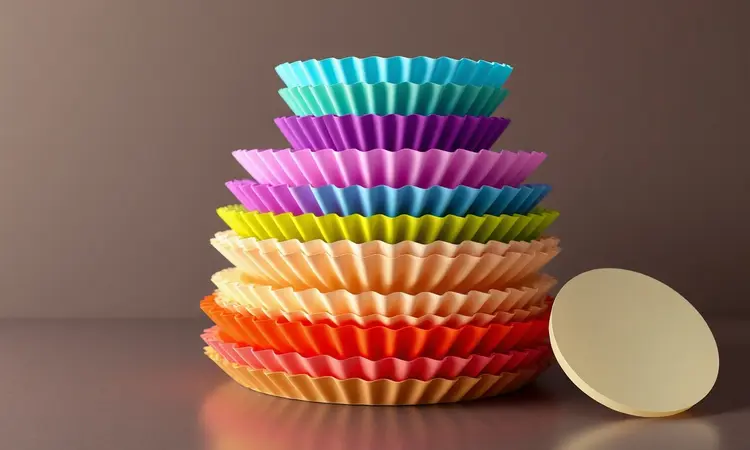
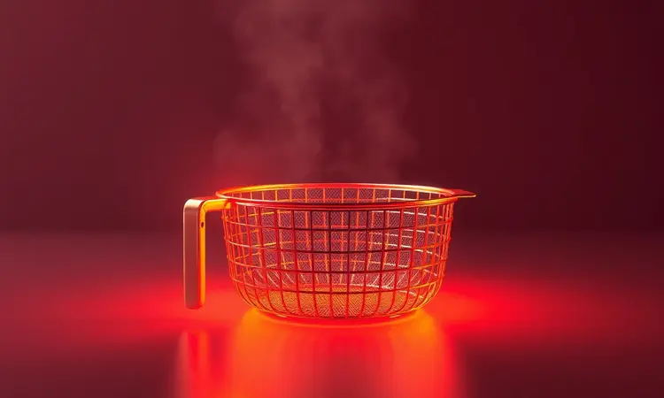
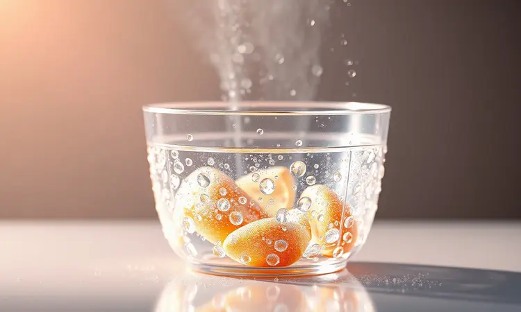

Limpar a air fryer depois de preparar uma receita suculenta é, sem dúvida, a parte mais trabalhosa de ter esse eletrodoméstico em casa. Você concorda que a praticidade de cozinhar se perde um pouco quando passamos minutos esfregando gordura incrustada no cesto?

A boa notícia é que existem formas seguras e baratas de forrar o aparelho e manter tudo brilhando.

Neste artigo, você vai descobrir o que colocar na air fryer para não sujar, conhecendo os 7 melhores acessórios do mercado e aprendendo os cuidados essenciais para não comprometer a vida útil do seu equipamento.

Mas antes de explorarmos as soluções, vamos entender por que essa limpeza é tão crítica não só para a aparência, mas para o próprio funcionamento do seu aparelho.

<SummaryList products={frontmatter.top_products} />

## Por que evitar o acúmulo de sujeira na Air Fryer é fundamental?

Imagine preparar batatas fritas e metade sair crocante enquanto a outra fica mole. Esse cozimento desigual muitas vezes tem culpada: a sujeira acumulada que bloqueia a circulação do ar quente.

Quando resíduos de alimentos se acumulam, seu aparelho precisa trabalhar mais para atingir a temperatura ideal, aumentando o consumo de energia e encurtando sua vida útil.

Além disso, há uma questão de saúde que vai além do sabor. Restos de comida esquecidos não só atraem bactérias como criam aqueles odores persistentes que grudam nos alimentos.

Manter sua air fryer limpa significa garantir não apenas batatas perfeitas, mas também paz de espírito sabendo que cada refeição está sendo preparada em um ambiente seguro para sua família.

## Pode forrar a Air Fryer? Entenda a regra de ouro do fluxo de ar

A resposta é sim, mas com um segredo: o fluxo de ar precisa continuar circulando livremente. Pense no ar quente como o maestro da sua orquestra culinária.

Se você bloquear sua passagem com materiais inadequados, o resultado será uma sinfonia desafinada de alimentos mal cozidos.

A regra é simples: qualquer material que você usar precisa ser compatível com altas temperaturas e, mais importante, precisa permitir que o ar passe através dele.

É como usar uma camada protetora inteligente que cuida da limpeza sem sabotar o crocante que faz a air fryer ser tão especial. Esse equilíbrio entre proteção e performance é o que transforma uma tarefa chata em uma experiência prática.

## 7 Acessórios Indispensáveis para Manter sua Air Fryer Sempre Limpa

Montar seu kit de sobrevivência para a limpeza é mais simples do que parece. Vamos explorar cada opção como peças de um quebra-cabeça que, quando encaixadas, transformam sua relação com a air fryer.

### 1. Forma de Silicone Reutilizável: A queridinha da praticidade

<ProductBox 
  title={frontmatter.top_products[0].title} 
  image={frontmatter.top_products[0].image} 
  link={frontmatter.top_products[0].link} 
/>

Imagine acordar, preparar o café da manhã e simplesmente enxaguar a forma debaixo da torneira. É essa a magia da forma de silicone reutilizável.

Feita com material de grau alimentício que suporta altas temperaturas, ela cria uma barreira invisível entre seu alimento e o cesto.

O verdadeiro encanto está na superfície antiaderente que praticamente entrega a comida pronta para servir. Nada gruda, nada quebra, nada exige esforço. E o melhor: enquanto economiza em descartáveis, você está criando uma cozinha mais sustentável.

Descobrir o formato ideal para seu modelo específico pode exigir uma breve pesquisa, mas a recompensa é anos de praticidade.

### 2. Forro de Papel Descartável: Praticidade máxima para o dia a dia

<ProductBox 
  title={frontmatter.top_products[1].title} 
  image={frontmatter.top_products[1].image} 
  link={frontmatter.top_products[1].link} 
/>

Se o reutilizável não é sua prioridade no momento, os forros de papel descartáveis oferecem praticidade instantânea. Coloque, use, descarte. Simples assim.

Essas folhas resistentes ao calor criam uma barreira eficaz contra gordura e resíduos, praticamente eliminando a necessidade de esfregar após cada uso.

Mas atenção: nunca pré-aqueça sua air fryer com o forro já dentro. Esse pequeno detalhe evita queimaduras e fumaça, garantindo segurança. Embora não sejam reutilizáveis, eles estendem a vida útil do seu cesto de maneira impressionante.

Para aqueles dias corridos onde cada minuto conta, essa pode ser sua melhor aliada.

### 3. Papel Alumínio: Pode usar? Veja os cuidados necessários

Sim, você pode usar papel alumínio, mas pense nele como um ingrediente secreto que exige técnica. A chave está na moderação: pequenas tiras para embrulhar alimentos, forminhas improvisadas para evitar que grudem, nunca uma cobertura completa que sufocaria o fluxo de ar.

O cuidado principal é evitar contato prolongado com os elementos mais quentes. Quando usado com sabedoria, o alumínio se torna um aliado para receitas específicas, oferecendo uma proteção extra sem comprometer o resultado final.

É sobre usar as ferramentas certas, no momento certo.

### 4. Papel Manteiga Perfurado: Econômico e eficiente

<ProductBox 
  title={frontmatter.top_products[2].title} 
  image={frontmatter.top_products[2].image} 
  link={frontmatter.top_products[2].link} 
/>

Para quem busca o equilíbrio perfeito entre economia e eficiência, o papel manteiga perfurado é como encontrar o ponto exato entre proteção e rendimento.

Seus pequenos furos são estrategicamente posicionados para permitir que o ar quente circule enquanto protege contra respingos e grude.

Imagine preparar um peixe delicado sem se preocupar com pedaços colados no fundo, ou uma sobremesa com queijo sem o drama da limpeza posterior. O segredo está no posicionamento correto: alimentos sobre o papel, nunca debaixo.

Essa simples inversão garante o crocante que você ama, com a limpeza que você merece.

### 5. Formas de Metal ou Alumínio: O que você já tem em casa

Olhe ao redor da sua cozinha. Aquela forma de torta, aquela assadeira de bolo. Esses velhos conhecidos podem ser heróis inesperados na sua jornada com a air fryer. Muitas já estão preparadas para altas temperaturas e distribuem calor com uma uniformidade impressionante.

O que muda quando você as usa? Basicamente tudo na hora da limpeza. Em vez de resíduos espalhados pelo cesto, tudo fica contido em uma superfície única e fácil de lavar.

É sobre descobrir soluções dentro do que você já possui, transformando objetos comuns em ferramentas extraordinárias de praticidade.

### 6. Travessas de Vidro Temperado: Segurança e versatilidade

Há uma certa magia em acompanhar o processo de cozimento, ver as cores mudarem, as bordas dourarem. As travessas de vidro temperado oferecem essa experiência cinematográfica enquanto garantem segurança absoluta.

Projetadas para suportar o calor intenso da air fryer, elas se tornam seus olhos dentro do aparelho.

Além do espetáculo visual, a superfície lisa do vidro praticamente repele resíduos. Terminou de usar? Uma passada rápida com água e sabão resolve.

Para quem valoriza controle preciso sobre o ponto dos alimentos e abomina a ideia de contaminações cruzadas, essa é uma escolha que une beleza e funcionalidade.

### 7. Sacos para Assar (Poliéster): Ideal para carnes suculentas

<ProductBox 
  title={frontmatter.top_products[3].title} 
  image={frontmatter.top_products[3].image} 
  link={frontmatter.top_products[3].link} 
/>

Prepare-se para descobrir o segredo das carnes que mantêm cada gota de suco, sem transformar sua air fryer em uma cena de crime culinário. Os sacos de poliéster são como pequenas tendas que protegem seus alimentos, concentrando sabores enquanto contêm a bagunça.

Aqui, a verificação de compatibilidade é sua melhor amiga. Um saco adequado evita surpresas durante o cozimento. E quando aquele vapor perfumado escapar ao abrir o saco, você saberá que escolheu bem.

É a solução definitiva para quem quer suculência sem sujeira, sabor sem trabalho extra.

Agora que você conhece seus aliados na limpeza, é hora de conhecer os verdadeiros vilões, aqueles itens que podem transformar sua experiência prática em um pesadelo culinário.

## O que NUNCA colocar dentro da sua Air Fryer (Perigo!)

Alguns alimentos e recipientes são como convidados indesejados na festa da sua air fryer. Sopas e molhos líquidos, por exemplo, não apenas respingam por toda parte como podem danificar componentes sensíveis.

Imagine o desastre de líquidos quentes atingindo o mecanismo de aquecimento.

Alimentos empanados que soltam muito farelo atuam como minas terrestres para o fluxo de ar, entupindo passagens essenciais. E itens como queijos cremosos ou chocolate? Eles se transformam em lagos derretidos que grudam em cada superfície.

Conhecer esses inimigos é sua primeira linha de defesa para uma experiência limpa e segura.

## Como higienizar seus acessórios de silicone e metal corretamente

Ter os acessórios certos é metade da batalha. A outra metade é saber cuidar deles para que continuem cuidando de você. Para suas formas de silicone, pense em carinho: água morna, detergente neutro e uma esponja suave.

Se quiser praticidade extra, muitas são amigas da lava-louças.

Já os acessórios de metal pedem um olho mais atento. A lavagem segue similar, mas a atenção à ferrugem é crucial. Uma mancha enferrujada é sinal de aposentadoria. E nunca subestime o poder da secagem completa antes do armazenamento.

Esse simples passo previne mofo, odores e garante que cada uso comece com um aparelho realmente limpo.

## Truques extras para uma limpeza rápida sem esforço

Vamos além dos acessórios e mergulhar nos pequenos rituais que transformam a limpeza de um fardo em um gesto rápido. Comece estrategicamente: forre antes de cozinhar, não depois de lamentar a sujeira.

Quando terminar, dê ao cesto alguns minutos de molho em água morna. Esse tempo de repouso solta até os resíduos mais teimosos. Na hora de esfregar, escolha esponjas macias que limpam sem arranhar. O toque final? Secagem completa.

Essa é a diferença entre um aparelho que dura anos e um que precisa de substituição prematura.

## Perguntas Frequentes (FAQ)

Diante de tantas opções, algumas dúvidas são inevitáveis. Vamos responder às mais comuns para que você possa tomar decisões com confiança.

### Posso usar papel toalha na air fryer?

Imagine colocar um pedaço de papel comum em um forno quente. O papel toalha na air fryer tem um destino similar: pode obstruir o fluxo de ar, queimar e, em casos extremos, criar situações de risco. Se precisa absorver gordura, o papel manteiga é seu aliado seguro.

Ele resiste ao calor enquanto mantém o ar circulando, protegendo seus alimentos e sua tranquilidade.

### O uso de formas aumenta o tempo de cozimento?

Pense nas formas como pequenos escudos. Eles protegem, mas também criam uma barreira sutil que o ar quente precisa contornar. Materiais como vidro ou cerâmica, por exemplo, demoram mais para aquecer, então seu frango pode precisar de alguns minutos extras.

Isso não é um problema, apenas um ajuste. Quando usar formas, fique atento ao ponto dos alimentos, não apenas ao relógio. Essa atenção extra garante que cada receita saia perfeita, independentemente do acessório escolhido.

## Conclusão

No final, a escolha dos acessórios certos para sua air fryer é sobre criar uma rotina que funcione para você, não contra você.

Seja a praticidade imediata dos descartáveis, a sustentabilidade das formas reutilizáveis ou a versatilidade dos itens que já possui, cada opção é um passo em direção a uma cozinha mais eficiente e menos estressante.

Lembre-se que o verdadeiro objetivo vai além da limpeza fácil. É sobre recuperar o tempo que antes era gasto esfregando, transformando-o em momentos à mesa com quem você ama. É sobre a satisfação de saber que seu investimento no aparelho será preservado por anos.

E, acima de tudo, é sobre transformar o ato de cozinhar de uma obrigação em um prazer genuíno.

Experimente diferentes combinações, descubra o que se adapta ao seu ritmo e observe como essas pequenas mudanças criam grandes transformações na sua rotina culinária. Sua air fryer está pronta para ser mais do que um eletrodoméstico.

Está pronta para ser seu parceiro na criação de memórias saborosas, sem deixar rastros de trabalho extra.