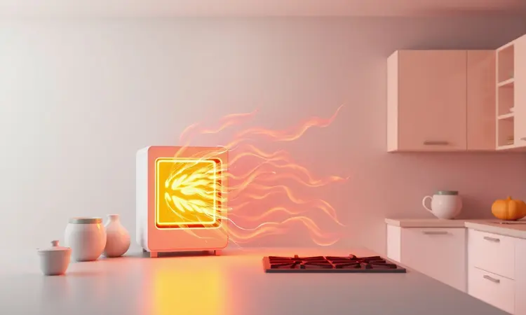
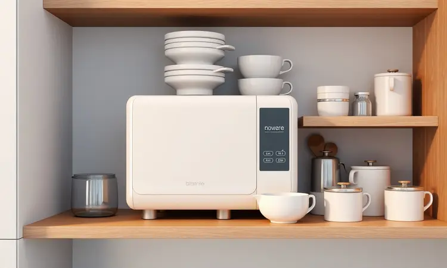

Você provavelmente já percebeu que a Air Fryer se tornou o braço direito na cozinha moderna, mas será que você está usando o aparelho no local correto?

Muita gente ignora que o posicionamento inadequado pode não apenas comprometer a crocância dos alimentos, como também causar acidentes domésticos e reduzir drasticamente a vida útil da fritadeira.

Neste guia, você aprenderá exatamente onde colocar sua Air Fryer para garantir máxima eficiência, segurança total e como organizar sua bancada de forma inteligente.

<SummaryList products={frontmatter.top_products} />

## Por que o posicionamento da Air Fryer é vital para sua segurança?

Imagine preparar aquele frango crocante que todos amam, mas quando você se vira por um instante, o aparelho começou a soltar um cheiro estranho de queimado. Isso acontece justamente quando ele não 'respira' direito.

A Air Fryer precisa de espaço, uma superfície estável que não trema, e distância segura de panos de prato ou cortinas que possam causar um susto. O cabo elétrico também merece atenção, pois ficar exposto no caminho é convite para tropeços.

São detalhes que passam batido, mas fazem toda diferença entre uma cozinha que funciona e uma que traz preocupações.

## Os 5 Melhores Lugares para Colocar sua Air Fryer

Agora que você entende os riscos, vamos para a parte boa, descobrindo os cantinhos perfeitos da sua cozinha que transformam o uso da Air Fryer em uma experiência segura e prazerosa.

### 1. Bancada de apoio com superfície resistente ao calor

<ProductBox 
  title={frontmatter.top_products[0].title} 
  image={frontmatter.top_products[0].image} 
  link={frontmatter.top_products[0].link} 
/>

O primeiro passo é escolher uma bancada que não tenha medo do calor. Materias como granito, quartzo e Dekton são campeões nessa missão, porque aguentam a temperatura alta sem manchar ou danificar.

Só tome cuidado com o granito, que precisa de uma proteção extra (impermeabilização) de vez em quando.

A grande vantagem aqui é a durabilidade, sua bancada continua bonita e o aparelho opera sobre uma base firme que evita aqueles balanços perigosos na hora de agitar os alimentos.

### 2. Sob a coifa ou depurador de ar

<ProductBox 
  title={frontmatter.top_products[1].title} 
  image={frontmatter.top_products[1].image} 
  link={frontmatter.top_products[1].link} 
/>

Parece uma ideia prática, mas colocar a Air Fryer debaixo da coifa pode ser um tiro pela culatra. O problema é o espaço fechado, que abafa o calor e o vapor.

Isso pode danificar tanto os móveis em volta quanto o próprio funcionamento do aparelho, que precisa de pelo menos 10 cm livres nas laterais e atrás para ventilar corretamente. O resultado? Sua Air Fryer vive mais e sua cozinha não vira uma sauna improvisada.

### 3. Próximo a tomadas de 20A exclusivas

Esse é um segredo que pouca gente conhece. A Air Fryer demanda uma boa dose de energia, e plugá-la em uma tomada comum pode sobrecarregar o circuito da sua casa. A solução?

Procurar aquelas tomadas de 20A (geralmente com um entalhe diferente no plugue) que são feitas exatamente para eletrodomésticos famintos por energia.

Além de evitar aquele desligamento misterioso no meio do preparo, você elimina o risco de cheiro de fiação queimada que tira qualquer um do sério.

### 4. Ilha central ou península de cozinha

Se sua cozinha tem uma ilha ou península, você tem um trunfo na manga. Esses espaços são amplos, evitam a bagunça na bancada principal e ainda deixam tudo mais estiloso.

A dica de ouro é garantir que haja uma tomada por perto e que o aparelho tenha espaço para 'respirar'. Feito isso, você ganha um cantinho de preparo que facilita o fluxo enquanto cozinha, sem ter que dar voltas pela cozinha toda.

### 5. Carrinho auxiliar de cozinha reforçado

<ProductBox 
  title={frontmatter.top_products[2].title} 
  image={frontmatter.top_products[2].image} 
  link={frontmatter.top_products[2].link} 
/>

Para quem tem espaço limitado ou adora flexibilidade, um carrinho de aço inox com rodízios é um aliado e tanto. Ele serve como uma bancada móvel e resistente, que você pode levar para perto da tomada e depois guardar em um canto.

A estrutura tubular reforçada dá estabilidade, e os rodízios permitem que ele seja seu ajudante de cozinha, levando ingredientes e o aparelho para onde você precisar. Só confira as dimensões antes para não comprar algo que não caiba no seu espaço.

## 7 Lugares Onde Você NUNCA Deve Deixar sua Fritadeira Elétrica

Agora, os lugares que são verdadeiras armadilhas. Conhecê-los é tão importante quanto saber onde colocar.

### Nichos ou armários fechados: O perigo do superaquecimento

Parece uma ótima ideia para esconder o aparelho, mas nichos e armários são como um cobertor abafando a Air Fryer. Sem ventilação, o calor se acumula até níveis perigosos, criando risco real de incêndio e danificando o móvel por dentro.

O aparelho precisa de espaço aberto para funcionar direito, não de um esconderijo.

### Proximidade com fontes de água e pias

Água e eletricidade nunca foram bons amigos. Deixar a Air Fryer perto da pia ou de onde há respingos constantes pode causar curtos-circuitos ou reduzir a vida útil do aparelho. Além do risco, a umidade dificulta a limpeza e cria um ambiente propício para acidentes.

Mantenha-a em um lugar seco, onde você possa operá-la com as mãos tranquilas.

### Perto de cortinas, panos de prato e materiais inflamáveis

O calor que sai pelas aberturas da Air Fryer é suficiente para secar um pano de prato pendurado perto demais, imagine o que pode fazer com uma cortina.

Mantenha uma zona de segurança ao redor do aparelho, livre de qualquer tecido ou material que possa pegar fogo com uma faísca de calor. É uma regra simples que evita sustos grandes.

### Superfícies instáveis ou muito altas (risco de queda)

Colocar a Air Fryer em uma mesa que balança ou em um móvel alto demais é pedir para ela dar um mergulho. A queda não só quebra o aparelho, como pode espalhar comida quente por todo o chão.

O ideal é uma superfície na altura da sua cintura, robusta e plana, que permita que você mexa na cesta com segurança, sem se contorcer.

### Diretamente sobre o fogão ou perto de bocas acesas

Jamais use a Air Fryer sobre o fogão, mesmo que ele esteja desligado. Além de bloquear a circulação de ar quente (essencial para o funcionamento), você está criando um ponto de calor duplo que sobrecarrega o ambiente.

Fogão e Air Fryer são parceiros na cozinha, mas precisam de seu próprio espaço para não competirem pelo ar da sala.

## Checklist Técnico: Regras de Ouro para Instalação

Depois de escolher o lugar, vem a parte técnica, aqueles detalhes que fazem a instalação ser impecável.

### Distância mínima da parede: Por que os 15cm são obrigatórios?

Pense nos 15cm como o espaço pessoal da sua Air Fryer. É a distância que permite que o ar circule livremente, dissipando o calor e evitando que a parede fique com aquela marca escura de superaquecimento que estraga a pintura.

Mais do que uma recomendação, é uma medida de segurança que previne incêndios e garante que o aparelho trabalhe na temperatura certa, sem sufocar.

### Uso de tapetes de silicone e protetores de bancada

<ProductBox 
  title={frontmatter.top_products[3].title} 
  image={frontmatter.top_products[3].image} 
  link={frontmatter.top_products[3].link} 
/>

Esses acessórios são os guardiões da sua bancada. Um tapete de silicone antiaderente protege a superfície de riscos e calor excessivo, além de facilitar a limpeza daqueles respingos de gordura.

Já os protetores específicos para bancada criam uma barreira extra, mas atenção, verifique se são resistentes ao calor da Air Fryer antes de comprar.

Eles não só preservam o visual da sua cozinha, como também dão aquela sensação de organização que faz tudo parecer mais fácil.

## Como guardar a Air Fryer após o uso (Dicas de Organização)

O ritual após o uso é tão importante quanto a instalação. Deixe o aparelho esfriar completamente antes de pensar em guardá-lo. Uma limpeza rápida nas partes removíveis com um pano úmido evita que restos de comida se acumulem.

Na hora de armazenar, escolha um local seco, longe do fogão ou da pia, e enrolar o cabo com cuidado, sem torcer os fios. Esses minutos extras de cuidado garantem que sua Air Fryer esteja sempre pronta para a próxima receita, sem surpresas desagradáveis.

## Perguntas Frequentes (FAQ)

Para esclarecer as dúvidas mais comuns que ainda podem ficar no ar.

### Pode colocar Air Fryer em cima do mármore?

Pode, sim! O mármore é resistente ao calor, mas ele precisa de 'companhia'. Certifique-se de que há ventilação adequada ao redor do aparelho e considere usar uma base de silicone ou um pano para evitar arranhões na superfície polida.

O mármore é bonito, mas também é sensível, então esse cuidado extra mantém tanto o aparelho quanto a bancada em perfeito estado.

### Qual a altura ideal para usar o aparelho com conforto?

A magia acontece entre 90 e 100 cm do chão, que é a altura padrão da maioria das bancadas. Essa medida permite que você opere a Air Fryer sem se curvar ou esticar os braços, transformando o ato de cozinhar em algo natural e sem esforço.

Se você é mais alto ou mais baixo, ajuste um pouco a posição, o importante é que o botão de timer fique na linha dos seus olhos quando você está em pé, relaxado.

### Posso usar extensão ou adaptador 'T' na Air Fryer?

Melhor não arriscar. Extensões e adaptadores 'T' são a receita para sobrecarga elétrica, porque a Air Fryer já consome energia considerável. Se o cabo não alcança a tomada, a solução segura é instalar uma tomada adicional no local desejado.

Pode parecer trabalho extra, mas é um investimento na segurança da sua casa e no desempenho constante do aparelho, sem aquelas oscilações de energia que estragam o ponto dos alimentos.

## Conclusão

Colocar sua Air Fryer no lugar certo vai muito além da praticidade. É sobre criar um espaço na sua cozinha onde segurança e eficiência andam de mãos dadas.

Desde escolher uma bancada que não tem medo do calor, até respeitar aquele espaço vital de 15cm da parede, cada detalhe contribui para uma experiência tranquila.

Você deixa de lado a preocupação com acidentes e ganha a confiança de quem sabe que está usando o aparelho da melhor forma possível. O resultado? Refeições mais crocantes, uma cozinha organizada e aquele sossego de saber que tudo está no seu devido lugar.

Agora é só ligar, ajustar o timer e aproveitar cada mordida, com a certeza de que sua Air Fryer está tão bem cuidada quanto a comida que ela prepara.