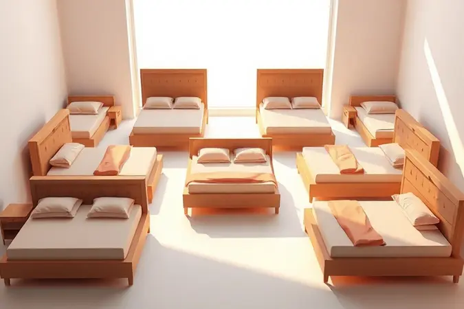
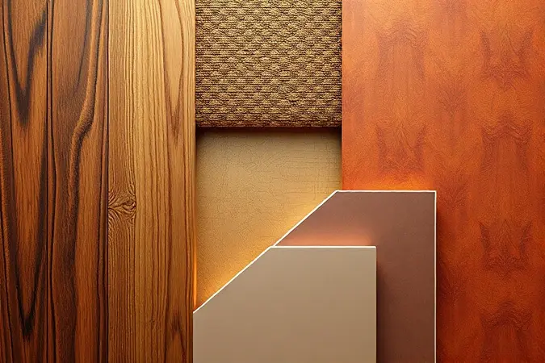
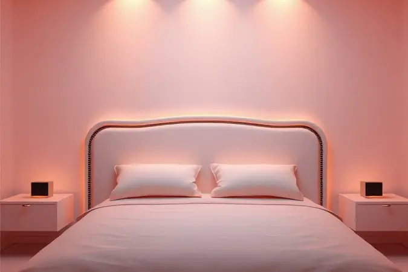
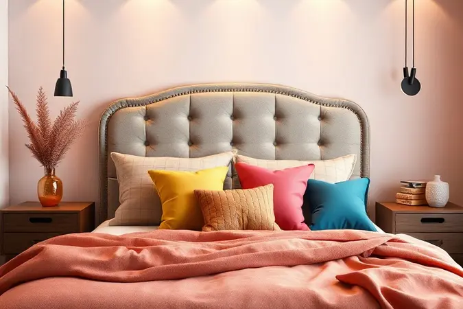

Você já sentiu que falta algo para o seu quarto parecer realmente completo e aconchegante? A cabeceira de cama é muito mais do que um simples acessório decorativo; ela é a moldura do seu descanso e a peça-chave para elevar o design do ambiente.

Neste guia, você vai descobrir como transformar seu dormitório, garantindo não apenas beleza, mas também conforto térmico e funcionalidade. Prepare-se para aprender tudo sobre tamanhos, materiais e as tendências que estão dominando as mostras de decoração.

<SummaryList products={frontmatter.top_products} />

## O que é uma cabeceira de cama e por que ela é essencial?

Imagine despertar todas as manhãs com um apoio perfeito para suas costas, enquanto seu olhar encontra uma peça que reflete exatamente seu estilo pessoal. Esse é o poder de uma cabeceira bem escolhida.

Ela vai além da estética, protegendo sua parede dos desgastes do dia a dia e oferecendo aquele apoio reconfortante para momentos de leitura ou simples relaxamento na cama.

### Além da estética: Os benefícios funcionais da cabeceira

Quando você se apoia para ler aquele livro que não consegue largar, percebe como a cabeceira transforma a experiência. Ela absorve ruídos externos, criando uma bolha de tranquilidade no seu quarto.

Muitos modelos trazem ainda prateleiras ou nichos que mantêm seus livros, óculos e controle remoto sempre ao alcance da mão, sem bagunçar o ambiente. É a praticidade que você nem sabia que estava faltando.

## Guia de Tamanhos: Acerte na medida para cada tipo de cama

Escolher o tamanho certo é como encontrar o par perfeito de sapatos: precisa ser exato para o conforto total. A harmonia visual e o apoio adequado dependem dessa escolha fundamental. Vamos explorar as medidas que fazem toda diferença.

### Cabeceira para Cama de Solteiro (88 a 96 cm)

<ProductBox 
  title={frontmatter.top_products[0].title} 
  image={frontmatter.top_products[0].image} 
  link={frontmatter.top_products[0].link} 
/>

Para seu cantinho pessoal, você pode optar por cabeceiras que se adaptam perfeitamente às camas box, geralmente com 88 ou 90 cm de largura.

Se busca um impacto visual maior, modelos mais amplos, a partir de 120 cm, criam um efeito de painel decorativo que transforma o ambiente.

Lembre-se de verificar as dimensões exatas antes de decidir, garantindo que sua escolha converse harmoniosamente com as cores e texturas do seu quarto.

### Cabeceira para Cama de Casal (138 a 140 cm)

<ProductBox 
  title={frontmatter.top_products[1].title} 
  image={frontmatter.top_products[1].image} 
  link={frontmatter.top_products[1].link} 
/>

Aqui, o convívio ganha um aliado. As opções estofadas em suede, veludo ou couro sintético, muitas vezes com detalhes em capitonê, oferecem o toque aconchegante que um casal merece.

As cabeceiras painel, que se fixam na parede, trazem modernidade, enquanto as versões com criado-mudo integrado resolvem a questão do espaço com elegância. Antes de finalizar sua compra, confira sempre as medidas específicas, evitando surpresas durante a instalação.

### Cabeceira para Cama Queen (158 a 160 cm)

<ProductBox 
  title={frontmatter.top_products[2].title} 
  image={frontmatter.top_products[2].image} 
  link={frontmatter.top_products[2].link} 
/>

Este é o espaço perfeito para dois se aconchegarem sem se sentir apertado ou distante. As cabeceiras estofadas em tecidos como suede ou veludo criam um refúgio acolhedor, enquanto as versões em madeira oferecem um visual rústico que nunca sai de moda.

Alguns modelos vêm com funcionalidades extras, como nichos ou prateleiras, que tornam seus objetos essenciais sempre acessíveis. Observe o tipo de fixação que melhor se adapta ao seu quarto, algumas precisam de montagem na parede, outras apenas se apoiam no box.

### Cabeceira para Cama King e King Extra Size (193 a 198 cm)

<ProductBox 
  title={frontmatter.top_products[3].title} 
  image={frontmatter.top_products[3].image} 
  link={frontmatter.top_products[3].link} 
/>

Para quartos que respiram amplitude, uma cabeceira de aproximadamente 200 cm proporciona o acabamento equilibrado que você procura. A altura ideal varia entre 130 e 150 cm, criando uma presença marcante no ambiente.

Se seu pé-direito é mais elevado, opções de até 160 cm completam o visual com sofisticação. Ainda que a variedade para essas medidas possa parecer limitada, muitos fabricantes oferecem soluções personalizadas que atendem exatamente ao que você precisa.

## Modelos e Estilos: Qual combina com a sua personalidade?

Agora que você já domina as medidas, chegou a hora do que realmente faz seu coração bater mais forte, o estilo que conta sua história. Cada material e design carrega uma personalidade única, pronta para conversar com a sua.

### Cabeceira Estofada: Conforto em Bouclé, Linho e Veludo

<ProductBox 
  title={frontmatter.top_products[4].title} 
  image={frontmatter.top_products[4].image} 
  link={frontmatter.top_products[4].link} 
/>

Sinta a textura macia do bouclé aconchegando seus momentos de descanso, especialmente em versões com LED embutido que iluminam seus serões com charme discreto. O linho traz durabilidade e neutralidade perfeita para quem ama cortes limpos que combinam com tudo.

Já o veludo é para quem deseja um toque de luxo, embora exija cuidados especiais na limpeza. A beleza está justamente na possibilidade de misturar esses tecidos, criando uma peça que é verdadeiramente sua.

### Cabeceira Ripada: A tendência moderna e atemporal

<ProductBox 
  title={frontmatter.top_products[5].title} 
  image={frontmatter.top_products[5].image} 
  link={frontmatter.top_products[5].link} 
/>

As ripas alinhadas de madeira trazem uma elegância que flutua entre o rústico e o contemporâneo, aumentando visualmente o espaço do seu quarto.

Sua instalação pode demandar atenção extra, principalmente nos modelos que precisam de fixação na parede, mas o resultado compensa cada esforço com uma beleza que permanece intacta com mínima manutenção.

### Cabeceira com Criado-Mudo Integrado: Funcionalidade máxima

<ProductBox 
  title={frontmatter.top_products[6].title} 
  image={frontmatter.top_products[6].image} 
  link={frontmatter.top_products[6].link} 
/>

Para quem valoriza organização sem abrir mão do estilo, essa combinação inteligente oferece suporte e espaço para livros e abajures em uma única peça. Disponíveis em MDF de alta qualidade ou tecidos estofados, elas se adaptam a diferentes decorações.

Em quartos menores, essa solução multifuncional revela sua genialidade, otimizando cada centímetro disponível.

### Tecnologia no Quarto: Cabeceiras com LED e USB integrados

<ProductBox 
  title={frontmatter.top_products[7].title} 
  image={frontmatter.top_products[7].image} 
  link={frontmatter.top_products[7].link} 
/>

Imagine ajustar a iluminação do seu quarto com um toque suave, criando atmosferas que vão do relaxamento profundo ao momento de leitura perfeito. As portas USB integradas eliminam a bagunça de cabos, mantendo seus dispositivos carregados e acessíveis.

Sim, essa conveniência moderna pode significar um investimento maior, mas a organização e o design futurístico transformam seu quarto em um verdadeiro santuário tecnológico.

## Materiais e Acabamentos: Durabilidade e Sofisticação

A escolha do material não é apenas sobre aparência, é sobre a relação que você construirá com essa peça ao longo dos anos. Cada opção carrega uma promessa diferente de durabilidade e sensação.

### MDF e MDP: Pintura e texturas de alta qualidade

Ao passar a mão pela superfície lisa de um MDF bem trabalhado, você sente o cuidado do acabamento que aceita pinturas e vernizes com refinamento surpreendente. O MDP oferece texturas que brincam com a luz, imitando elegantemente a madeira natural.

Essa versatilidade permite personalizações que transformam sua cabeceira em uma obra de arte exclusiva.

## Passo a Passo: Como instalar sua cabeceira corretamente

A instalação é mais simples do que parece, bastando seguir alguns cuidados básicos. Comece garantindo que sua parede está limpa e nivelada, usando sempre os parafusos recomendados pelo fabricante para assegurar estabilidade e segurança.

### Fixação na parede vs. Fixação na Cama Box

Cabeceiras fixadas na parede criam uma integração visual perfeita, permitindo ajustes de altura que se moldam ao seu conforto. Essa opção exige um trabalho mais cuidadoso na instalação.

Já as fixadas na cama box oferecem praticidade imediata e facilidade para futuras trocas, embora possam transmitir uma sensação menos permanente. Avalie qual solução se encaixa melhor na dinâmica do seu espaço e na sua relação com mudanças.

### Altura ideal: Como evitar erros comuns na montagem

Nada pior do que se sentar na cama e sentir que o apoio está faltando ou sobrando. Para acertar, meça a altura do seu colchão até o topo do travesseiro e escolha uma cabeceira que fique entre 10 e 15 cm acima desse ponto.

Esse detalhe aparentemente simples é o que garante que suas costas recebam o apoio perfeito durante seus momentos de relaxamento.

## Manutenção: Como limpar e conservar sua cabeceira

Manter sua cabeceira bonita é mais fácil do que você imagina. Para tecidos, aspire regularmente e, em caso de manchas, use um pano úmido com detergente suave, testando antes em uma área discreta.

Madeiras pedem apenas um pano seco ou levemente umedecido, longe de produtos químicos agressivos. Independente do material, evite exposição direta ao sol para preservar cores e texturas intactas por anos.

## Perguntas Frequentes sobre Cabeceiras de Cama (FAQ)

Algumas dúvidas surgem naturalmente durante o processo de escolha. Vamos esclarecer as mais comuns para que você tome sua decisão com total confiança.

### Qual o melhor tecido para quem tem pets ou alergias?

Quando seus companheiros de quatro patas dividem o quarto, ou quando alergias são uma preocupação, a microfibra se torna sua aliada perfeita. Resistente a manchas e fácil de limpar, ela não acumula poeira.

O algodão orgânico e o poliéster também são excelentes alternativas, especialmente versões com tratamento antiácaro que garantem noites tranquilas em um ambiente saudável.

### É possível instalar cabeceira em parede de drywall?

Sim, completamente possível, com os cuidados certos. Use ancoragens específicas para drywall que distribuem o peso adequadamente. Procurar pelos montantes da parede, onde a estrutura é mais resistente, oferece segurança adicional.

Com essas precauções, você instala sua cabeceira com a tranquilidade de saber que tudo está perfeitamente seguro.

### Como combinar a cor da cabeceira com o restante do quarto?

Pense na cabeceira como o ponto focal que harmoniza todo o ambiente. Se suas paredes são neutras, uma cor mais intensa cria um contraste elegante. Se o quarto já tem elementos coloridos, um tom suave equilibra o visual.

Observe os tecidos e padrões dos outros móveis, criando uma conversa visual onde cada peça complementa a outra, resultando em um espaço coerente e pessoal.

## Conclusão

Escolher a cabeceira perfeita é muito mais do que resolver uma questão decorativa, é sobre criar um refúgio que abraça sua personalidade e transforma seu descanso em uma experiência completa.

Das medidas precisas que garantem conforto aos materiais que conversam com sua história, cada detalhe conta. Lembre-se que essa peza será testemunha silenciosa de seus melhores sonhos e momentos de renovação.

Agora, com todas as informações em mãos, você está pronto para fazer uma escolha que não apenas embeleza seu quarto, mas que principalmente reflete quem você é e como deseja viver seus momentos de descanso. Permita-se criar o santuário pessoal que você sempre imaginou.