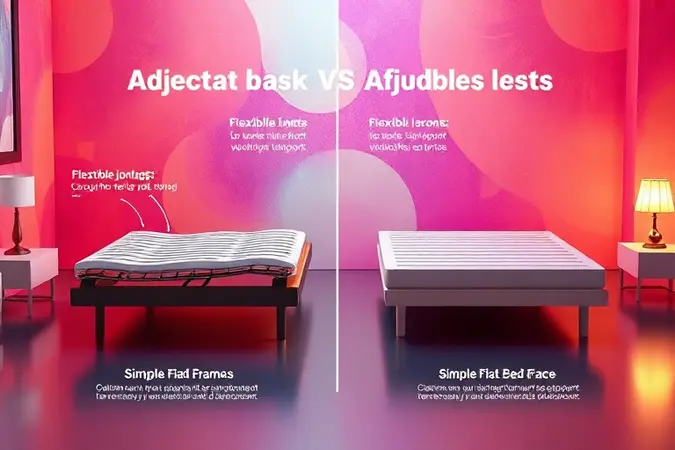

Imagine o cuidado diário como uma tarefa de precisão, onde cada pequeno ajuste é um ato de amor. Você, cuidador, sabe que um ambiente acolhedor e seguro é o primeiro passo para uma recuperação mais tranquila e digna.

Mas você já reparou como uma cama comum pode se tornar um obstáculo, dificultando desde a simples mudança de posição até a prevenção de complicações? Este guia foi feito para responder essa questão.

Vamos explorar juntos como escolher a cama hospitalar ideal, entendendo não apenas as especificações técnicas, mas como cada função pode transformar as rotinas de cuidado, oferecendo conforto para quem você ama e alívio para suas costas.

<SummaryList products={frontmatter.top_products} />

## O que é uma cama hospitalar e por que ela é essencial para o cuidado domiciliar?

Mais do que um móvel, uma cama hospitalar residencial é uma ferramenta de cuidado ativo e uma promessa de dignidade. Pense nela como uma plataforma que se adapta, que responde.

Sua capacidade de ajustar altura e inclinação com facilidade tem um impacto direto e profundo: para o paciente, significa poder sentar-se para almoçar com independência e encontrar a posição exata para uma respiração mais confortável; para você, significa acessar o leito sem se curvar, protegendo sua coluna durante os cuidados diários.

Este suporte é fundamental para prevenir úlceras por pressão e transformar o ambiente do quarto em um espaço de recuperação profissional, mantendo a qualidade de vida e o bem-estar no lar.

## Cama Hospitalar vs. Cama Comum: As diferenças que impactam a saúde

Entender essa essência nos leva diretamente a um contraste inevitável: a cama comum. Enquanto ela oferece repouso estático, a cama hospitalar oferece conforto dinâmico.

A diferença não está apenas no preço ou na aparência, mas numa série de funcionalidades que respondem a necessidades específicas de saúde.

Grades laterais que funcionam como um abraço de segurança durante a noite, uma base articulada que permite posicionar o corpo de forma a aliviar a pressão sobre áreas vulneráveis, e uma altura ajustável que convida o cuidador a realizar sua tarefa com mais ergonomia.

É a diferença entre simplesmente dormir e se recuperar com conforto e segurança.

## Os principais benefícios para o paciente e para o cuidador

Quando você investe numa cama hospitalar, está investindo num equilíbrio duplo de benefícios.

Para o paciente, é sinônimo de autonomia reconquistada e bem-estar físico, permitindo mudar de posição para aliviar dores e facilitar funções básicas como a respiração e a digestão. Cada ajuste é um passo em direção ao conforto verdadeiro.

Para você, cuidador, representa ergonomia e praticidade. Esqueça o esforço descomunal para ajudar a pessoa amada a sentar.

Com a simples pressão de um botão ou giro de uma manivela, as tarefas diárias se tornam mais leves, protegendo sua saúde e transformando a assistência num ato menos desgastante e mais humano.

### 1. Cama Hospitalar Manual: Economia e funcionalidade básica

<ProductBox 
  title={frontmatter.top_products[0].title} 
  image={frontmatter.top_products[0].image} 
  link={frontmatter.top_products[0].link} 
/>

Se você busca uma solução robusta, confiável e de excelente custo-benefício, a versão manual é um ponto de partida sólido. Operada por manivelas, ela entrega os ajustes essenciais de elevação da cabeceira e dos pés com simplicidade.

Sua construção em aço carbono promete durabilidade e as grades laterais oferecem a tranquilidade necessária.

O ajuste manual exige um leve esforço físico, mas essa característica traz uma vantagem duradoura: independência total da eletricidade, funcionando perfeitamente mesmo durante uma queda de energia.

É a escolha para quem valoriza solidez, facilidade de manutenção e um investimento inicial mais acessível.

### 2. Cama Hospitalar Motorizada/Elétrica: Autonomia e tecnologia de ponta

<ProductBox 
  title={frontmatter.top_products[1].title} 
  image={frontmatter.top_products[1].image} 
  link={frontmatter.top_products[1].link} 
/>

Agora, imagine conceder o controle total ao seu ente querido, com a promessa de conforto na ponta dos dedos. A cama motorizada transforma essa ideia em realidade.

Controlada por um discreto controle remoto, ela realiza ajustes precisos de altura e inclinação sem esforço algum. Modelos mais completos oferecem até 10 movimentos diferentes, alcançando posições terapêuticas que favorecem a circulação e o relaxamento.

A curva de aprendizado inicial com o controle é rapidamente superada pela praticidade absoluta que ela oferece.

É o padrão ouro em termos de conforto e autonomia, incorporando recursos como grades retráteis e sistemas anti-escaras para uma segurança integrada e completa.

### 3. Cama Hospitalar para Obesos: Suporte e estrutura reforçada

<ProductBox 
  title={frontmatter.top_products[2].title} 
  image={frontmatter.top_products[2].image} 
  link={frontmatter.top_products[2].link} 
/>

Cada corpo tem necessidades únicas, e oferecer suporte adequado é uma expressão máxima de cuidado. As camas especializadas para obesos são concebidas com essa missão.

Com estruturas reforçadas em aço de alta resistência, suportam desde 200kg até impressionantes 400kg com total estabilidade.

Elas mantêm toda a funcionalidade dos modelos articulares, permitindo ajustes de posição fundamentais para o conforto, enquanto suas dimensões ampliadas garantem o espaço necessário.

Sim, o peso extra da estrutura exige posicionamento cuidadoso, mas essa robustez é justamente a garantia de segurança e bem-estar, oferecendo a paz de espírito de que a solução foi projetada para durar e proteger.

## Entendendo as Posições: Fowler, Semi-Fowler e Trendelenburg

O verdadeiro poder de uma cama hospitalar vai além do mover. Está no posicionar. Posições como Fowler, Semi-Fowler e Trendelenburg não são termos técnicos complexos; são, na verdade, os seus aliados secretos para o conforto e a recuperação.

A posição Semi-Fowler, por exemplo, é aquele leve apoio nas costas que facilita a respiração e a digestão pós-refeições.

Dominar esses ajustes significa saber oferecer alívio imediato para dores, melhorar a circulação sanguínea e promover a autonomia do paciente em atividades simples, mas essenciais. É a tradução da tecnologia em cuidado tangível e humanizado.

### Colchão Hospitalar: O complemento obrigatório para a cama

<ProductBox 
  title={frontmatter.top_products[3].title} 
  image={frontmatter.top_products[3].image} 
  link={frontmatter.top_products[3].link} 
/>

De nada adianta uma base que se move com perfeição se o suporte superior não acompanha essa missão. O colchão hospitalar é o parceiro indispensável da cama, trabalhando em conjunto para aliviar a pressão e prevenir lesões.

Mais do que uma superfície para deitar, ele é uma barreira ativa contra as escaras, oferecendo alívio específico para áreas críticas como calcanhares e quadris.

A escolha certa depende do perfil do paciente: desde as espumas de alta densidade que oferecem suporte robusto, até os modelos pneumáticos inteligentes, que alternam a pressão automaticamente.

Esse complemento transforma o leito em um verdadeiro santuário de repouso e recuperação.

### Colchão Pneumático: Como prevenir escaras em pacientes acamados

<ProductBox 
  title={frontmatter.top_products[4].title} 
  image={frontmatter.top_products[4].image} 
  link={frontmatter.top_products[4].link} 
/>

O colchão pneumático é o herói silencioso na prevenção de úlceras. Seu funcionamento é elegante e eficaz: células de ar alternam a pressão de forma constante, como se estivessem fazendo uma massagem suave e contínua.

Isso evita que uma mesma área do corpo, especialmente os pontos ósseos, sofra pressão constante, melhorando significativamente a circulação e a oxigenação dos tecidos.

É claro que ele não substitui a movimentação periódica do paciente (ainda fundamental), mas funciona como uma rede de proteção 24 horas, reduzindo drasticamente a carga sobre o cuidador e oferecendo um conforto terapêutico superior.

### Mesa de Refeição e Escadas: Acessórios que facilitam o dia a dia

<ProductBox 
  title={frontmatter.top_products[5].title} 
  image={frontmatter.top_products[5].image} 
  link={frontmatter.top_products[5].link} 
/>

Os detalhes são os responsáveis por transformar uma rotina de cuidados em um cotidiano digno e prático. Uma mesa de refeição ajustável permite que almoçar na cama seja um momento de independência e não de dependência, chegando na altura perfeita com facilidade.

Já as escadas, com seus degraus antiderrapantes, são um convite seguro à mobilidade, ajudando o paciente a sair do leito com mais confiança e reduzindo o risco de quedas.

Esses acessórios, aparentemente simples, são ferramentas de empoderamento, que completam o ecossistema de cuidado com funcionalidade e respeito pela individualidade.

### Grades de Segurança: Proteção essencial contra quedas

<ProductBox 
  title={frontmatter.top_products[6].title} 
  image={frontmatter.top_products[6].image} 
  link={frontmatter.top_products[6].link} 
/>

O sono de uma pessoa com mobilidade reduzida pode ser interrompido por um movimento involuntário. As grades de segurança existem para garantir que esse despertar seja apenas um ajuste de posição, e não uma queda.

Mais do que uma barreira física, elas são um dispositivo de tranquilidade para toda a família.

Disponível em materiais duráveis como aço ou mais leves como ABS, e com sistemas rebatíveis que facilitam o acesso, sua presença deve seguir normas rigorosas, como a NBR IEC 60601-2-52, para garantir máxima segurança.

É a certeza de que seu ente querido está protegido, permitindo que todos na casa possam descansar mais tranquilos.

## Alugar ou comprar uma cama hospitalar: O que vale mais a pena?

Essa não é apenas uma pergunta financeira, mas sobre duração e profundidade da necessidade. A locação brilha em cenários de recuperação temporária ou para testar um modelo, oferecendo flexibilidade e custo inicial reduzido, sem preocupações com manutenção futura.

A compra, por outro lado, é um investimento que se paga com o tempo em casos de uso prolongado ou crônico. Representa a segurança de ter um equipamento personalizado, sempre disponível, transformando-se num pilar do ambiente doméstico de cuidado.

Avaliar o quadro de saúde, o orçamento e o espaço disponível com um profissional ajudará você a tomar a decisão que trará mais paz de espírito e conforto no longo prazo.

## Como saber se a cama hospitalar cabe em quartos pequenos?

Transformar um quarto compacto em um ambiente de cuidado é um exercício de planejamento inteligente. Comece medindo o espaço disponível com precisão: as camas geralmente têm entre 80cm e 90cm de largura e 190cm a 210cm de comprimento.

O segredo não está apenas no tamanho da cama, mas no espaço ao redor dela. Reserve pelo menos 60cm em cada lado e na parte dos pés para a circulação segura do cuidador e para a movimentação de equipamentos.

Não se esqueça de considerar a projeção das grades laterais quando levantadas, que podem adicionar alguns centímetros cruciais à largura total. Esse mapeamento cuidadoso garante um ambiente funcional, seguro e aconchegante.

## Dicas de manutenção e higienização para prolongar a vida útil da cama

Uma cama hospitalar bem cuidada é sinônimo de segurança duradoura. A rotina de manutenção é simples, mas poderosa. Para limpeza, prefira um pano úmido com produtos neutros, evitando químicos agressivos que podem deteriorar superfícies e componentes.

Periodicamente, verifique as partes móveis (articulações, mecanismos de elevação) em busca de poeira ou obstruções que possam comprometer o funcionamento suave.

A atenção deve se estender ao colchão e à roupa de cama: lave-os com frequência e substitua-os seguindo as recomendações do fabricante.

São práticas mínimas que preservam a funcionalidade do equipamento e, acima de tudo, asseguram um ambiente higiênico e confortável para quem mais importa.

## Conclusão

Escolher a cama hospitalar certa vai muito além de comparar especificações ou preços. É sobre traduzir tecnologia em cuidado palpável, transformando um equipamento em uma extensão segura e amorosa do seu carinho por quem precisa de você.

Cada ajuste motorizado, cada grade de segurança, cada posição terapêutica representa uma oportunidade de oferecer mais dignidade, mais conforto e mais autonomia.

Representa, para você, cuidador, a chance de preservar sua própria saúde enquanto exerce um papel tão fundamental.

Esperamos que este guia tenha iluminado o caminho, mostrando que com a informação certa e o equipamento adequado, cuidar em casa deixa de ser um fardo para se tornar um ato de profunda conexão e competência.

Está pronto para dar o próximo passo e transformar o espaço do seu ente querido? Comece observando as necessidades, medindo o espaço e conversando com profissionais. A decisão certa está ali, esperando para trazer tranquilidade e bem-estar para toda a família.