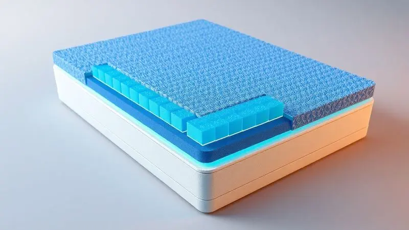

Imagine cuidar de alguém que depende completamente de você para o conforto. Cada detalhe conta, mas nenhum é mais crítico do que o colchão onde essa pessoa passa horas a fio.

A escolha errada pode transformar o repouso em tortura, acelerando o surgimento de escaras e comprometendo a recuperação.

Este guia vai revelar como transformar esse item essencial em seu maior aliado, garantindo que cada noite de sono seja um passo firme em direção ao bem-estar.

<SummaryList products={frontmatter.top_products} />

## O que é um Colchão Hospitalar e por que ele é essencial?

Pense no colchão hospitalar como um parceiro silencioso na recuperação. Não se trata apenas de uma superfície para deitar, mas de uma tecnologia projetada para proteger quem mais precisa.

Enquanto você dorme, ele trabalha redistribuindo o peso do corpo de forma inteligente, aliviando pontos de pressão que, com o tempo, podem evoluir para úlceras dolorosas. Mas sua função vai além da prevenção.

Cada material, cada camada, cada sistema de ventilação foi pensado para criar um ambiente onde o corpo pode se recuperar com dignidade, mantendo a pele respirando e livre de irritações. É a diferença entre um simples descanso e um verdadeiro cuidado terapêutico.

## Principais Diferenças entre o Colchão Comum e o Hospitalar

Você já notou como seu colchão comum parece perfeito até precisar dele para algo mais do que uma noite de sono? Enquanto os modelos residenciais buscam conforto imediato e estética, os hospitalares são engenhados para resistência e funcionalidade profunda.

Eles nascem da necessidade de sobreviver a limpezas rigorosas diárias, de suportar pesos variados sem perder a forma, e de oferecer ajustes que transformam uma cama em uma estação de cuidados.

Enquanto um colchão comum te convida a relaxar, o hospitalar assume a responsabilidade de proteger sua saúde quando você está mais vulnerável.

## Tipos de Colchão Hospitalar: Qual o melhor para cada caso?

Assim como cada pessoa tem necessidades únicas, existem soluções diferentes para momentos distintos da recuperação. A magia está em encontrar a combinação perfeita entre suporte, conforto e funcionalidade.

### 1. Colchão de Espuma (Densidades D28, D33 e D45)

<ProductBox 
  title={frontmatter.top_products[0].title} 
  image={frontmatter.top_products[0].image} 
  link={frontmatter.top_products[0].link} 
/>

Para quem sente aquela dor nas costas ao virar na cama, as densidades da espuma fazem toda a diferença. Imagine o D28 como um abraço suave e acolhedor, ideal para quem pesa entre 61kg e 70kg e busca equilíbrio sem rigidez excessiva.

Já o D33 é como ter um fisioterapeuta invisível trabalhando a noite toda, mantendo sua coluna perfeitamente alinhada mesmo durante o sono mais profundo, perfeito para quem chega aos 100kg. E quando o suporte precisa ser inabalável, o D45 entra em cena.

Sua firmeza quase cirúrgica sustenta com segurança pesos acima de 100kg, garantindo que cada parte do corpo receba exatamente o apoio necessário. Não se trata apenas de números, mas de encontrar a densidade que conversa com o seu corpo.

### 2. Colchão Piramidal (Famosa 'Casca de Ovo')

<ProductBox 
  title={frontmatter.top_products[1].title} 
  image={frontmatter.top_products[1].image} 
  link={frontmatter.top_products[1].link} 
/>

Visualize milhares de pequenas pirâmides trabalhando em conjunto para criar uma superfície que se adapta ao seu corpo como uma segunda pele.

Essa textura única não é apenas confortável, é estrategicamente projetada para permitir que o ar circule livremente entre os picos, reduzindo a umidade e mantendo a temperatura ideal.

Para quem passa longas horas na mesma posição, essa microcirculação constante pode ser a barreira que impede o surgimento das temidas escaras. É como ter um colchão que respira junto com você, ajustando-se a cada movimento quase imperceptível.

### 3. Colchão Pneumático ou de Ar (Sistema de Alívio de Pressão)

<ProductBox 
  title={frontmatter.top_products[2].title} 
  image={frontmatter.top_products[2].image} 
  link={frontmatter.top_products[2].link} 
/>

Aqui está onde a tecnologia mostra sua força transformadora. Imagine células de ar que se inflam e desinflam em um ritmo cuidadosamente calibrado, como se o próprio colchão estivesse ajudando você a mudar de posição sem que você precise se mover.

Esse movimento contínuo faz mais do que prevenir escaras, ele mantém a circulação sanguínea ativa nas áreas mais vulneráveis.

A necessidade de uma fonte elétrica se transforma em um pequeno preço a pagar pela garantia de que, mesmo imóvel, o corpo continua recebendo o cuidado ativo que precisa para se recuperar.

## Guia de Densidades: Como escolher conforme o peso do paciente

Escolher a densidade correta é como afinar um instrumento musical: quando está perfeito, tudo funciona em harmonia. Pense no peso do paciente como a partitura que guia essa escolha.

Para quem está nos extremos da balança, seja muito leve ou com peso mais elevado, a densidade se torna uma questão de segurança. Um colchão muito macio para alguém mais pesado pode causar afundamento excessivo, comprometendo o alinhamento da coluna.

Já uma superfície muito firme para uma pessoa leve pode criar pontos de pressão desconfortáveis. O segredo está em encontrar o ponto de equilíbrio onde o suporte encontra o conforto, criando uma base que sustenta sem oprimir, que acolhe sem afundar.

## Revestimentos e Capas Impermeáveis: Higiene e Durabilidade

<ProductBox 
  title={frontmatter.top_products[3].title} 
  image={frontmatter.top_products[3].image} 
  link={frontmatter.top_products[3].link} 
/>

A verdadeira proteção acontece na superfície.

Um revestimento impermeável de qualidade é como ter um guarda-costas invisível para o seu colchão, criando uma barreira impenetrável contra líquidos que poderiam comprometer não apenas o material, mas a saúde de quem está deitado.

Materiais como a napa hospitalar ou tecidos com tratamento de silicone não apenas repelem a umidade, mas também respiram, evitando aquela sensação abafada que tanto incomoda durante a noite.

E quando falamos de ambientes que exigem higiene máxima, alguns vão além com tratamentos antimicrobianos que trabalham silenciosamente para manter o ambiente seguro.

É a diferença entre limpar um acidente e simplesmente passar um pano, mantendo a tranquilidade de saber que o cuidado está presente em cada camada.

## Dimensões Padrão: Como medir para a cama hospitalar

Antes de pensar em conforto, precisamos garantir o encaixe perfeito. Medir uma cama hospitalar é como preparar o palco para um ato de cuidado contínuo. Comece pela largura, geralmente entre 80cm e 90cm, e pelo comprimento, que pode variar de 1,90m a 2,10m.

Mas os números sozinhos não contam toda a história. É sobre garantir que haja espaço suficiente para movimentação, para acessórios, para que o cuidador possa trabalhar com facilidade.

A altura certa pode significar a diferença entre uma transferência segura e um risco desnecessário. E sempre confirme com as especificações do fabricante, pois alguns modelos têm personalidades próprias que exigem atenção aos detalhes.

## O Papel do Colchão na Prevenção de Escaras (Úlceras de Pressão)

As escaras não surgem do nada. Elas são o resultado silencioso da pressão constante sobre os mesmos pontos do corpo, cortando a circulação e sufocando os tecidos aos poucos. É aqui que um bom colchão hospitalar se transforma em escudo protetor.

Ao redistribuir o peso de forma inteligente, ele garante que nenhuma área fique sobrecarregada por muito tempo.

Seja através da adaptação suave da viscoelástica ou do movimento programado do sistema pneumático, o objetivo é sempre o mesmo: manter a pele viva, respirando, com sangue circulando livremente.

Não se trata apenas de prevenir lesões, mas de preservar a dignidade de quem está em recuperação.

## Acessórios Indispensáveis: Travesseiros e Posicionadores

<ProductBox 
  title={frontmatter.top_products[4].title} 
  image={frontmatter.top_products[4].image} 
  link={frontmatter.top_products[4].link} 
/>

O colchão é a base, mas os acessórios são os ajustes finais que transformam o bom em excelente. Um travesseiro viscoelástico não apenas acomoda a cabeça, ele memoriza o formato do seu pescoço, aliviando tensões que você nem sabia que existiam.

Já os posicionadores de gel são como mãos invisíveis que ajudam a manter o corpo na posição ideal, especialmente importante para quem tem mobilidade reduzida.

Cada peça complementar trabalha em conjunto com o colchão, criando um ecossistema de suporte onde cada parte do corpo encontra exatamente o que precisa. Não são meros adicionais, são ferramentas essenciais no processo de recuperação.

## Como Limpar e Conservar seu Colchão Hospitalar

O cuidado com o colchão começa no primeiro dia e nunca realmente termina. Limpar a superfície com um pano úmido e detergente neutro é apenas o início.

O verdadeiro segredo está na consistência: secar completamente após cada limpeza para evitar que a umidade se torne um convite para fungos, evitar exposição direta ao sol que pode ressecar os materiais, e fazer verificações regulares como quem cuida de um investimento precioso.

Porque é exatamente isso que um bom colchão hospitalar representa: um investimento na qualidade de vida de quem você ama. Com atenção aos detalhes, ele pode oferecer anos de suporte confiável.

## Perguntas Frequentes (FAQ)

As dúvidas mais comuns geralmente giram em torno de durabilidade e diferenças entre os tipos. Um colchão hospitalar bem cuidado pode acompanhar você por cinco a dez anos, dependendo do uso e manutenção.

A escolha entre espuma, ar ou outros sistemas não é sobre qual é melhor em absoluto, mas sobre qual é melhor para uma situação específica.

Enquanto os modelos de ar oferecem ajuste personalizado quase cirúrgico, as espumas trazem uma relação custo-benefício que faz sentido para muitas famílias.

A pergunta final nunca deve ser apenas sobre conforto, mas sobre como cada característica contribui para a saúde e recuperação de quem vai usar.

## Conclusão

Escolher o colchão hospitalar certo é mais do que uma decisão de compra, é um ato de cuidado que reverbera em cada noite de sono, em cada momento de repouso, em cada passo da recuperação.

Desde a densidade que abraça sem sufocar até o sistema que mantém a circulação ativa, cada detalhe trabalha em conjunto para criar um ambiente onde o corpo pode se curar com dignidade.

Lembre-se que você não está apenas comprando um produto, está investindo em conforto, em prevenção, em qualidade de vida.

Quando cada componente está alinhado com as necessidades reais do paciente, o colchão deixa de ser um simples móvel e se transforma em um parceiro essencial na jornada de recuperação. A decisão que você toma hoje vai ecoar por anos no bem-estar de quem importa.

Comece pelo básico, mas pense sempre no impacto completo que essa escolha terá no dia a dia de quem precisa do seu cuidado mais do que nunca.