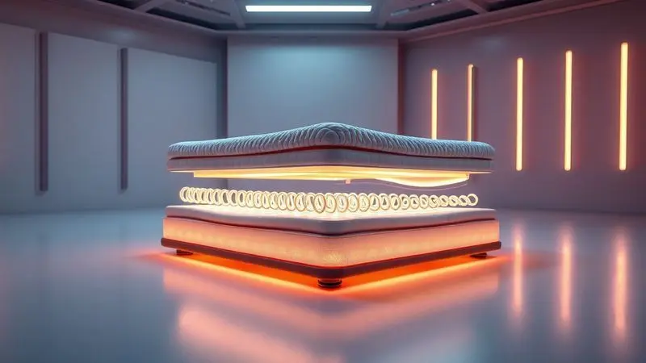

A escolha do colchão certo é aquele momento decisivo que define como você vai acordar pelos próximos anos. Mais do que um móvel, ele é o palco do seu descanso, do seu rejuvenescimento.

Se você está pesquisando colchões no Brasil, certamente cruzou com a marca Castor - uma presença que atravessa décadas no mercado. Mas será que essa tradição se traduz em conforto?

Neste guia, vamos além das especificações técnicas: vamos descobrir se um colchão Castor pode realmente transformar suas noites e entender como escolher o modelo ideal para o seu corpo e seu estilo de vida.

<SummaryList products={frontmatter.top_products} />

## Colchão Castor é bom? História e tradição no mercado brasileiro

Imagine uma empresa que nasceu em 1964 e desde então acompanha a evolução do sono dos brasileiros. A Castor não chegou ontem; ela cresceu junto com gerações que buscavam descanso de qualidade.

Essa longa trajetória não é apenas uma linha do tempo, é a prova de uma adaptação constante. Enquanto algumas marcas surgem e desaparecem, a Castor entendeu cedo que o segredo está em ouvir o que os corpos precisam.

Hoje, essa tradição se traduz em uma expertise que vai além do produto. É o conhecimento acumulado de décadas sobre como o brasileiro dorme, quais são suas dores (literalmente) e como criar soluções que realmente funcionam.

Quando você escolhe um Castor, está escolhendo uma herança de pesquisa, desenvolvimento e um compromisso com a sustentabilidade que utiliza materiais recicláveis sem abrir mão do conforto.

## Principais diferenciais tecnológicos dos colchões Castor

Mas tradição sem inovação é museu. A grande sacada da Castor foi transformar décadas de experiência em tecnologias que resolvem problemas reais do seu sono. Sabe aquela sensação de ficar virando na cama porque não encontra a posição certa?

Ou acordar suando no meio da noite? As soluções estão aqui.

### Tecnologia Vitagel: O conforto térmico das células de gel

Para quem já acordou sentindo que dormiu em uma sauna, o Vitagel é quase milagroso. Imagine células de gel estrategicamente posicionadas que fazem muito mais do que simplesmente esfriar.

Elas criam um sistema inteligente de regulação térmica, dissipando o calor do seu corpo antes que ele se acumule e perturbe seu sono.

O resultado é uma sensação de frescor que persiste durante a noite toda, mas sem aquele choque gelado desagradável.

E o melhor: enquanto cuida da sua temperatura, o Vitagel também abraça seu corpo com um suporte que se adapta aos seus contornos, ajudando a manter sua coluna no lugar certo. Dormir bem passa a ser fresco e confortável ao mesmo tempo.

### Molas Pocket vs. Molas Tecnopedic: Qual a diferença?

Escolher entre estas tecnologias é como escolher entre dois tipos de abraço. As molas pocket são como dedos individuais que se ajustam exatamente onde você precisa de apoio.

Cada mola, ensacada separadamente, responde apenas ao peso que recebe, criando uma superfície que parece ter sido moldada sob medida para seu corpo.

Já as molas tecnopedic oferecem um abraço mais uniforme, combinando materiais diferentes para um equilíbrio cuidadoso entre firmeza e acolhimento.

A escolha depende do que seu corpo pede: se você precisa de um suporte ultra-personalizado que isola cada movimento (ideal para casais), as pocket são suas aliadas. Se busca uma sensação mais consistente em toda a superfície, a tecnopedic pode ser a resposta.

### Sistema Double Face: Maior durabilidade para o seu colchão

Quem nunca pensou "que pena que só tem um lado bom"? A Castor resolveu isso com elegância. O sistema Double Face é aquela ideia tão simples que a gente se pergunta por que não pensou antes: dois lados utilizáveis que transformam um investimento em dois.

Mas vai além da economia. Ao alternar os lados periodicamente, você evita que o desgaste se concentre em apenas uma área, mantendo a estrutura do colchão uniforme por muito mais tempo.

É como ter um renovo de conforto a cada virada, além de facilitar absurdamente a limpeza e manutenção. Durabilidade nunca foi tão prática.

## Como escolher a densidade ideal (D28, D33, D45) do seu Castor de Espuma

A densidade não é apenas um número técnico, é o segredo para encontrar o nível certo de firmeza para seu corpo. Pense assim: seu peso precisa de um suporte proporcional, como uma cadeira que não pode ser nem muito mole nem muito rígida.

Para quem pesa até 70 kg, a densidade D28 oferece aquele aconchego macio que abraça sem afundar. Entre 70 e 90 kg, a D33 se apresenta como a opção equilibrada, firme o suficiente para sustentar, mas maleável para acolher.

Acima de 90 kg, a D45 é a base sólida que oferece a resistência necessária para manter sua coluna alinhada a noite toda.

A escolha certa aqui evita aquela sensação de estar dormindo em um pântano ou em uma tábua. É encontrar o ponto exato onde conforto e suporte se encontram.

## Os Melhores Modelos de Colchão Castor em 2024

Diante de tantas opções, como saber qual modelo realmente merece seu investimento? Separamos os que se destacam não apenas por especificações, mas pela experiência que oferecem.

### 1. Colchão Castor Silver Star Air (Molas Ensacadas)

<ProductBox 
  title={frontmatter.top_products[0].title} 
  image={frontmatter.top_products[0].image} 
  link={frontmatter.top_products[0].link} 
/>

Para quem compartilha a cama e está cansado de acordar com cada movimento do parceiro, o Silver Star Air é um divisor de águas. Suas molas pocket trabalham como indivíduos independentes, garantindo que sua parte da cama seja só sua.

Mas o verdadeiro alívio vem da tecnologia Aria 3D, que cria uma respiração constante no colchão, mantendo o frescor mesmo nas noites mais abafadas.

As espumas de diferentes densidades criam um equilíbrio inteligente: macias onde você precisa de aconchego, firmes onde seu corpo pede apoio. A única consideração é sua altura generosa, que pode exigir uma atenção especial na escolha da cama box.

Para casais que buscam harmonia no sono, é uma escolha que silencia os conflitos noturnos.

### 2. Colchão Castor Sleep Max (Espuma D33)

<ProductBox 
  title={frontmatter.top_products[1].title} 
  image={frontmatter.top_products[1].image} 
  link={frontmatter.top_products[1].link} 
/>

Sente suas costas reclamando ao acordar? O Sleep Max entende essa dor literalmente. Com densidade D33, ele oferece aquele suporte firme que parece segurar sua coluna no lugar certo, especialmente para quem pesa entre 70 e 90 kg.

O tratamento contra ácaros, fungos e bactérias transforma o colchão em um santuário de saúde, enquanto a superfície em poliéster torna a limpeza algo simples e rápido.

É verdade que sua firmeza pode não agradar quem busca afundar em uma nuvem, mas para quem precisa acordar sem dores, essa característica é uma bênção. E com a possibilidade de usar ambos os lados, você ganha praticamente dois colchões em um só investimento.

### 3. Colchão Castor Black White Air (Molas e Espuma D45)

<ProductBox 
  title={frontmatter.top_products[2].title} 
  image={frontmatter.top_products[2].image} 
  link={frontmatter.top_products[2].link} 
/>

Para pessoas acima de 90 kg que já experimentaram colchões que cedem rapidamente, o Black White Air é a resposta para uma noite de sono realmente reparadora.

A densidade D45 oferece a resistência necessária para distribuir o peso uniformemente, enquanto o sistema Air garante que o calor não se acumule, mantendo a frescura durante toda a noite.

O pillow top adiciona um toque de suavidade que quebra a firmeza excessiva, criando um equilíbrio perfeito. E com o sistema double face, você tem a garantia de que esse investimento vai acompanhar você por muitos anos.

É para quem não aceita meio-termo quando o assunto é suporte.

### 4. Colchão Castor Gold Star Vitagel (Premium)

<ProductBox 
  title={frontmatter.top_products[3].title} 
  image={frontmatter.top_products[3].image} 
  link={frontmatter.top_products[3].link} 
/>

Imagine dormir em uma cama que parece ter ar condicionado embutido. O Gold Star Vitagel transforma essa fantasia em realidade, especialmente para quem sofre com o calor noturno.

As células de gel da espuma Fresh Comfort dissipam o calor antes que ele perturbe seu sono, enquanto as molas ensacadas garantem que nenhum movimento do parceiro chegue até você.

O tratamento hipoalergênico é um alívio para quem acorda com espirros, criando uma barreira invisível contra ácaros.

A altura pode ser um fator a considerar dependendo da sua preferência, mas quando o assunto é combinar tecnologia de ponta com conforto extremo, este modelo mostra porque está na categoria premium.

### 5. Colchão Castor D18 Castorzinho (Linha Infantil)

<ProductBox 
  title={frontmatter.top_products[4].title} 
  image={frontmatter.top_products[4].image} 
  link={frontmatter.top_products[4].link} 
/>

O sono do seu filho merece o mesmo cuidado que o seu, mas com necessidades específicas. O Castorzinho foi pensado para corpos em desenvolvimento, com uma densidade D18 que oferece suporte sem ser muito rígido para ossos ainda em crescimento.

Os tecidos macios e impermeáveis são uma dádiva para os acidentes inevitáveis da infância, enquanto os tratamentos antiácaro e antifungo criam um ambiente seguro para pulmões sensíveis.

Com capacidade para até 40 kg, ele acompanha a criança em boa parte da jornada, e quando for hora de trocar, você terá a tranquilidade de saber que ofereceu o melhor suporte possível para essa fase tão importante.

## Conjunto Cama Box e Cama Box Baú Castor: Vale a pena?

<ProductBox 
  title={frontmatter.top_products[5].title} 
  image={frontmatter.top_products[5].image} 
  link={frontmatter.top_products[5].link} 
/>

Em quartos onde cada centímetro conta, a pergunta não é se você precisa de uma cama box, mas que tipo de solução ela pode oferecer além do óbvio. Os conjuntos Castor transformam essa escolha em um upgrade multifuncional.

Os modelos com molas Pocket® e Tecnopedic® mantêm o mesmo compromisso com a qualidade do sono, mas quando você opta pelo baú, algo mágico acontece: a cama deixa de ser apenas um lugar para dormir e se torna um organizador silencioso.

Roupas de cama, cobertores, até aquelas malas que nunca sabemos onde guardar encontram um lar discreto.

A variedade de modelos pode parecer desafiadora inicialmente, mas é justamente essa diversidade que garante que você encontrará a combinação perfeita para seu espaço e suas necessidades.

É a diferença entre comprar uma cama e investir em uma solução inteligente para seu quarto.

## Dicas essenciais para cuidar e higienizar seu Colchão Castor

Um bom colchão é um relacionamento de longo prazo, e como todo bom relacionamento, precisa de cuidados. Comece estabelecendo o hábito simples de aspirar a superfície regularmente, removendo a poeira invisível que se acumula.

Para acidentes com líquidos, a regra é ouro: seque imediatamente com um pano, nunca deixe a umidade penetrar.

A capa protetora lavável é seu maior aliado, uma barreira fácil de manter que previne manchas e desgaste. E a cada três meses, faça uma pequena revolução: gire o colchão 180 graus.

Esse ritual simples distribui o desgaste uniformemente, prolongando a vida do seu investimento e garantindo que o conforto permaneça consistente em toda a superfície.

## Perguntas Frequentes (FAQ) sobre Colchões Castor

Por quanto tempo posso esperar que meu colchão Castor dure?

Em condições normais de uso e com os cuidados básicos, você pode esperar entre 7 e 10 anos de conforto consistente. É claro que modelos mais premium tendem a estender ainda mais essa jornada, mas pense nisso como uma relação de década.

Como faço para limpar sem estragar o material?

Simplicidade é a chave. Um pano levemente úmido resolve a maioria das situações, sempre evitando produtos químicos agressivos. Para manchas mais persistentes, uma mistura suave de água e sabão neutro geralmente funciona. A grande dica é: nunca encharcar.

Vou me adaptar imediatamente ao novo colchão?

Seu corpo precisa de um período de ajuste, especialmente se vinha de um colchão muito diferente. Dê pelo menos 30 noites para uma adaptação completa. Muitas vezes, aquela sensação estranha inicial dá lugar a um conforto que você nem imaginava possível.

É como conhecer alguém novo: as primeiras impressões podem não revelar toda a compatibilidade.

E se eu errar na escolha da densidade?

A Castor geralmente oferece períodos de teste ou troca em muitas revendas. Mas para minimizar o risco, seja honesto sobre seu peso e prefira errar para o lado de uma densidade ligeiramente maior se estiver entre duas opções.

É mais fácil adaptar-se a algo um pouco mais firme do que lidar com um colchão que já começa cedendo.

## Conclusão

Escolher um colchão Castor vai além de comparar especificações técnicas. É abraçar uma tradição brasileira que aprendeu, ao longo de décadas, como oferecer descanso de verdade.

Das tecnologias que resolvem problemas reais (como o calor noturno ou a perturbação entre casais) às densidades que conversam com seu peso específico, cada detalhe foi pensado para transformar horas na cama em verdadeira recuperação.

Seja você quem busca o suporte firme para acordar sem dores, o casal que precisa de harmonia no sono ou quem simplesmente quer investir em anos de noites bem dormidas, há um modelo Castor que fala sua língua.

A jornada para um sono melhor começa com uma escolha consciente, e agora você tem todas as informações para fazer essa escolha com confiança. Seu corpo, amanhã de manhã, vai agradecer.