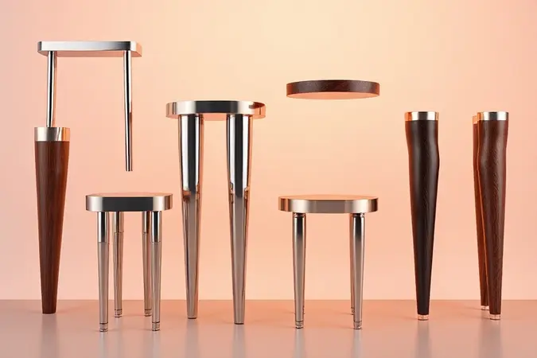
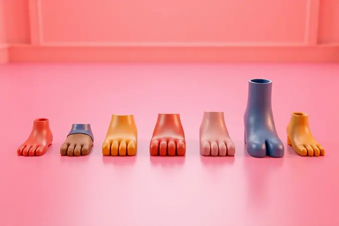
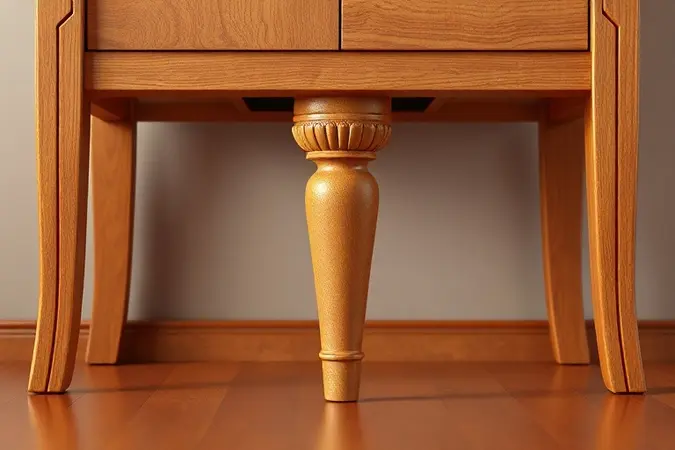

Você já acordou no meio da noite com aquele balanço incômodo? Ou se abaixa com dificuldade para sair da cama, sentindo que a altura está errada para seu corpo? O que parece um problema complexo pode ter uma solução surpreendentemente simples: os pés da sua cama box.

Esses pequenos componentes, muitas vezes ignorados, são os verdadeiros guardiões do seu sono tranquilo.

Neste guia, você vai descobrir não apenas como escolher os pés ideais, mas entender como essa decisão transforma seu descanso em algo mais seguro, confortável e duradouro.

<SummaryList products={frontmatter.top_products} />

## O que são e qual a importância dos pés para cama box?

Imagine o alicerce de uma casa. Assim funcionam os pés para sua cama box: não são apenas suportes que elevam o colchão, mas sim o sistema de equilíbrio que mantém tudo firme e estável.

A verdadeira magia acontece naquilo que você não vê: eles permitem que o ar circule sob o colchão, criando uma barreira invisível contra a umidade que, com o tempo, poderia arruinar seu investimento.

Além do aspecto prático, esses pés definem a altura ideal para que você entre e saia da cama sem esforço, transformando um movimento simples em uma experiência natural e sem dores.

O impacto vai além da funcionalidade. A escolha certa dos pés acrescenta personalidade ao seu quarto, complementando sua decoração com detalhes que parecem ter sido pensados especialmente para seu espaço.

Eles são a conexão silenciosa entre o design do ambiente e a qualidade do seu descanso.

## Principais benefícios de escolher pés de alta qualidade

Quando você investe em pés de qualidade, está comprando muito mais do que peças de mobiliário. Está adquirindo a tranquilidade de noites sem sustos inesperados, a confiança de que seu colchão será protegido por anos e a ergonomia que seu corpo merece.

Pés bem escolhidos eliminam aqueles ruídos misteriosos que parecem surgir do nada e garantem que o suporte do colchão se mantenha perfeito, sem deformações que afetam seu conforto.

### Pés de Madeira: Durabilidade e Estética Clássica

<ProductBox 
  title={frontmatter.top_products[0].title} 
  image={frontmatter.top_products[0].image} 
  link={frontmatter.top_products[0].link} 
/>

Há algo intemporal em um pé de madeira bem trabalhado. Mais do que resistência, eles carregam uma sensação de solidez que você sente imediatamente.

Madeiras nobres como eucalipto ou angelim não apenas suportam peso com elegância, mas também envelhecem com dignidade, tornando-se parte da história do seu descanso.

Os sistemas de fixação robustos garantem que essa estabilidade seja permanente, transformando seu ambiente em um refúgio verdadeiramente confiável.

Visualmente, a madeira oferece uma versatilidade encantadora. Desde acabamentos rústicos que contam histórias até linhas modernas que dialogam com decorações contemporâneas, há sempre uma opção que parece ter sido feita para seu quarto.

Tons naturais como mel e tabaco criam uma atmosfera acolhedora que convida ao relaxamento. Embora exijam atenção extra em ambientes úmidos, sua combinação de beleza e resistência faz com que cada cuidado seja recompensado pela durabilidade e estilo que oferecem.

### Pés de Plástico Reforçado: Custo-Benefício e Resistência à Umidade

<ProductBox 
  title={frontmatter.top_products[1].title} 
  image={frontmatter.top_products[1].image} 
  link={frontmatter.top_products[1].link} 
/>

Se você busca inteligência prática na escolha dos pés, o plástico reforçado é um aliado que entende suas prioridades. Leve mas surpreendentemente robusto, ele cumpre sua função com eficiência admirável.

Sua verdadeira superpotência, porém, está na resistência à umidade: ambientes costeiros, banheiros próximos ou simplesmente o vapor do dia-a-dia não são ameaças para essa escolha.

A variedade de modelos disponíveis é impressionante, incluindo opções com rodízios que facilitam completamente a rotina de limpeza. Embora possam não conquistar pelo mesmo apelo estético da madeira, seu compromisso com a funcionalidade é absoluto.

Para quem valoriza praticidade sem comprometer o orçamento, essa opção entrega exatamente o que promete: suporte confiável e adaptabilidade.

### Pés de Alumínio ou Aço Cromado: Modernidade e Suporte Extra

<ProductBox 
  title={frontmatter.top_products[2].title} 
  image={frontmatter.top_products[2].image} 
  link={frontmatter.top_products[2].link} 
/>

Para quartos que respiram modernidade, o alumínio e o aço cromado são declarações de design. O alumínio seduz pela leveza inesperada e pela imune resistência à oxidação, perfeito para quem vive em regiões litorâneas ou simplesmente aprecia a facilidade na instalação.

Sua presença é discreta mas sofisticada, complementando estilos minimalistas sem sobrecarregar o visual.

Já o aço cromado é a escolha para quem não negocia estabilidade. Seu peso maior não é um acidente: é um compromisso com firmeza absoluta. O acabamento brilhante reflete luz de maneira inteligente, criando ilusões de amplitude mesmo em espaços menores.

A escolha entre os dois se resume à sua relação particular com estilo versus suporte máximo, mas ambas garantem que sua cama tenha a presença que merece.

### Pés com Rodízios (Rodinhas): Praticidade para Limpeza e Movimentação

<ProductBox 
  title={frontmatter.top_products[3].title} 
  image={frontmatter.top_products[3].image} 
  link={frontmatter.top_products[3].link} 
/>

Algumas soluções transformam completamente sua relação com o espaço, e os pés com rodízios são uma delas. Imagine reorganizar todo o quarto para uma faxina profunda sem precisar pedir ajuda nem enfrentar esforços desnecessários.

Essa é a realidade que esses pés oferecem. Os modelos giratórios de 360 graus tornam cada movimento uma experiência fluida, enquanto as travas garantem estabilidade total quando você deseja permanência.

Os materiais inteligentes como silicone protegem seu piso contra marcas indesejadas, provando que funcionalidade e cuidado podem caminhar juntos.

Embora em pisos muito lisos possa haver pequenos deslocamentos, o benefício de transformar uma tarefa árdua em algo simples e eficiente compensa qualquer ajuste necessário.

## Como escolher o kit de pés ideal para cada tamanho de cama?

Escolher os pés certos é como encontrar sapatos que caibam perfeitamente: depende das medidas exatas e do peso que precisam suportar.

Cada tamanho de cama tem necessidades específicas de distribuição, e entender isso é a diferença entre uma cama estável e aquela sensação incômoda de insegurança.

### Kit para Cama de Solteiro: Quantidade e Distribuição de Peso

<ProductBox 
  title={frontmatter.top_products[4].title} 
  image={frontmatter.top_products[4].image} 
  link={frontmatter.top_products[4].link} 
/>

Para uma cama de solteiro, a lógica é de suporte concentrado. Os pés precisam estar posicionados estrategicamente para equilibrar o peso sem sobrecarregar pontos específicos.

Com medidas padrão em torno de 88 cm por 188 cm, a distribuição parece simples, mas é exatamente essa simplicidade que exige atenção.

Pés posicionados corretamente garantem que cada movimento seja absorvido de maneira uniforme, eliminando pontos de tensão que poderiam comprometer a estrutura ao longo do tempo.

### Kit para Cama de Casal e Viúvo: Estabilidade Centralizada

<ProductBox 
  title={frontmatter.top_products[5].title} 
  image={frontmatter.top_products[5].image} 
  link={frontmatter.top_products[5].link} 
/>

Quando o espaço precisa acomodar duas pessoas (ou a generosidade de uma cama de viúvo), a estratégia muda completamente. Aqui, os pés trabalham em equipe, criando uma rede de suporte que mantém o equilíbrio mesmo com movimentos independentes.

A centralização do suporte é fundamental, funcionando como um eixo invisível que mantém tudo firme independentemente de como o peso se distribui durante a noite.

Essa abordagem elimina aquela sensação de "ladeira" que acontece quando um lado da cama parece ceder mais que o outro, garantindo que ambos os lados ofereçam o mesmo nível de conforto e estabilidade.

### Kit para Cama Queen e King: O Reforço Necessário para Grandes Estruturas

<ProductBox 
  title={frontmatter.top_products[6].title} 
  image={frontmatter.top_products[6].image} 
  link={frontmatter.top_products[6].link} 
/>

Camas queen e king são majestosas em seus espaços, exigindo pés que compreendam a responsabilidade de suportar grandes dimensões sem vacilar.

O segredo está no reforço estratégico: mais pontos de apoio distribuídos de maneira inteligente para que nenhuma área fique sem o suporte necessário.

Esses kits são projetados para entender que uma estrutura maior não significa apenas mais peso, mas sim diferentes dinâmicas de distribuição.

Cada pé sabe exatamente qual é sua função no conjunto, trabalhando em harmonia para que a imensidão do colchão seja sinônimo de conforto total, não de preocupação estrutural.

## Altura dos pés: Como definir a medida ideal para o seu conforto?

A altura dos pés é a conversa silenciosa entre seu corpo e seu descanso. Entre 10 e 30 cm de variação, existe um ponto perfeito que faz você se sentir em casa.

Camas mais baixas têm uma intimidade especial, facilitando aquela transição suave entre estar deitado e levantar pela manhã, especialmente valiosa para quem busca praticidade ou tem mobilidade reduzida.

Pés mais altos, por outro lado, abrem o ambiente de maneira surpreendente. Além de facilitarem a limpeza, criam uma sensação de amplitude que transforma o quarto.

A combinação com a altura do colchão é matematicamente simples, mas emocionalmente profunda: quando soma, você obtém não apenas uma medida, mas a ergonomia exata que seu corpo procura a cada noite.

## Passo a passo: Como instalar ou substituir os pés da cama box sozinho

Transformar sua cama é mais simples do que parece. Comece virando-a cuidadosamente de lado, como se estivesse preparando-a para um pequeno procedimento de rejuvenescimento.

Com uma chave de fenda, libere os pés antigos com movimentos firmes mas delicados, agradecendo pelo serviço prestado.

Os novos pés chegam com promessas de estabilidade. Posicione cada um com atenção, sentindo o encaixe perfeito antes de apertar as porcas até alcançar aquela firmeza que inspira confiança, sem exageros que possam prejudicar o material.

Devolva a cama à posição vertical com cuidado, como quem apresenta uma nova versão de si mesma. O teste final é simples: uma leve pressão nas extremidades confirma que tudo está como deveria, pronto para noites inteiras de descanso ininterrupto.

## Sinais de alerta: Quando é hora de trocar os pés da sua cama?

Seu corpo sabe antes de sua mente consciente. Aquele balanço sutil que parecia acidente começa a se repetir. Ruídos noturnos surgem como sussurros de algo que precisa de atenção. A altura que antes era natural agora exige um ajuste na forma como você se levanta.

Estes não são caprichos do mobiliário: são avisos claros de que os pés precisam de renovação.

Desgastes visíveis, pequenas rachaduras ou simplesmente a sensação de que a estabilidade já não é mais a mesma são convites para agir antes que o conforto se torne comprometido.

Trocar os pés não é uma despesa: é um investimento na continuidade do seu descanso de qualidade.

## Dúvidas Frequentes sobre Pés para Cama (FAQ)

A compatibilidade é a primeira preocupação natural. Nem todos os pés conversam com todas as camas, por isso verificar o tipo de encaixe específico do seu modelo é o primeiro passo para um casamento bem-sucedido entre peças.

As medidas de encaixe variam, e essa atenção inicial poupa frustrações na hora da instalação.

Sobre altura, a verdade é que cada opção atende a diferentes necessidades. Pés mais altos criam espaços para armazenamento e ventilação, enquanto versões mais baixas oferecem uma estética compacta que alguns ambientes preferem.

A instalação geralmente é intuitiva, mas respeitar as orientações do fabricante é a garantia de que segurança e durabilidade andarão juntas.

## Conclusão

Os pés da sua cama box são muito mais do que apoios funcionais: são os silenciosos guardiões do seu sono tranquilo.

Desde a escolha do material que combina com seu estilo de vida até a altura perfeita que respeita seu corpo, cada decisão nesse processo se transforma em conforto concreto todas as noites.

Madeira que conta histórias, plástico que desafia a umidade, metal que abraça a modernidade ou rodízios que entendem praticidade: cada opção é um caminho diferente para o mesmo destino: noites de descanso verdadeiramente restauradoras.

Quando você compreende como esses pequenos componentes influenciam sua qualidade de vida, percebe que investir neles é investir em si mesmo.

Não espere pelos sinais de alerta: dê à sua cama a base sólida que ela merece e transforme cada despertar em um momento de renovação, não de ajustes. Seu descanso de hoje agradece pelas escolhes inteligentes de amanhã.