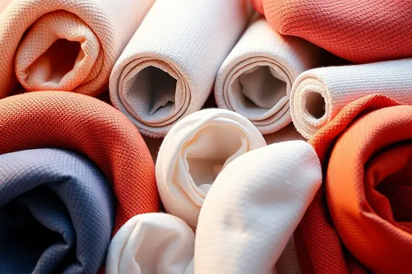
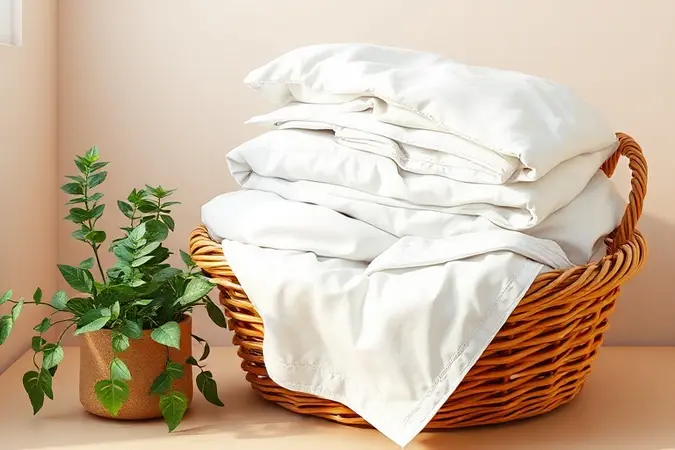

Montar um enxoval de qualidade sem estourar o orçamento parece um desafio impossível, mas a verdade é que você não precisa gastar uma fortuna para ter noites de sono dignas de hotel.

Muitas vezes, pagamos caro por marcas ou contagem de fios desnecessária, enquanto opções acessíveis oferecem o mesmo conforto e durabilidade.

Neste guia definitivo, você vai descobrir como identificar os melhores tecidos, entender o que realmente importa na hora da compra e aprender estratégias práticas para encontrar roupa de cama barata e de alta performance para sua casa.

<SummaryList products={frontmatter.top_products} />

## Como Escolher Roupa de Cama Barata e de Qualidade: O Guia Definitivo

Escolher roupa de cama que equilibre economia e qualidade exige uma visão prática. Você precisa considerar três pilares fundamentais: o material certo para suas necessidades, a gramatura que garante durabilidade sem peso excessivo, e onde encontrar ofertas genuínas.

Imagine abrir a gaveta e sempre encontrar peças que parecem novas, mesmo depois de meses de uso frequente. Essa é a verdadeira economia inteligente que vamos explorar juntos.

### Por que o Equilíbrio entre Preço e Conforto é Essencial?

Pense na última vez que você comprou algo barato que se desfez rapidamente. A frustração de ver um lençol desbotar após algumas lavagens ou sentir aquele tecido áspero contra sua pele transforma a economia inicial em um gasto duplo.

O equilíbrio entre preço e conforto não é apenas sobre números, é sobre valor real. Quando você investe em peças que duram, cada noite se torna um retorno desse investimento.

A sensação de deitar em lençóis macios, respiráveis e bem ajustados é incomparável e, felizmente, não requer que você comprometa todo o seu orçamento mensal.

## Entendendo os Tecidos: Qual o Melhor Custo-Benefício?

O segredo para não pagar caro pelo nome da marca está em entender o que cada tecido oferece. Algodão, microfibra e percal são os três grandes protagonistas, cada um com seu superpoder.

A escolha certa depende do que você valoriza mais: a praticidade absoluta do dia a dia, a respirabilidade natural que regula sua temperatura, ou a durabilidade que resiste ao tempo.

### 1. Microfibra: A Opção Mais Econômica e Prática

<ProductBox 
  title={frontmatter.top_products[0].title} 
  image={frontmatter.top_products[0].image} 
  link={frontmatter.top_products[0].link} 
/>

Se o seu dia a dia é corrido e você não tem tempo para passar ferro, a microfibra é sua melhor amiga. Imagine lençóis que secam em tempo recorde, não amassam e oferecem uma maciez que desafia o preço acessível.

O material é tão fácil de cuidar que você quase não percebe que está lavando roupa de cama. Para quem tem alergias, a característica hipoalergênica significa noites tranquilas sem espirros ou coceiras.

Sim, em noites muito quentes ela pode reter um pouco mais de calor que tecidos naturais, mas para a maioria das pessoas, a praticidade e o custo-benefício superam essa consideração.

### 2. Algodão: O Conforto Térmico que Vale o Investimento

<ProductBox 
  title={frontmatter.top_products[1].title} 
  image={frontmatter.top_products[1].image} 
  link={frontmatter.top_products[1].link} 
/>

Há algo quase mágico na forma como o algodão regula a temperatura corporal. Nos dias quentes, ele permite que sua pele respire, evitando aquela sensação abafada que rouba o sono. Nos frios, ele retém calor sem superaquecer.

Para peles sensíveis, a hipoalergenicidade natural significa conforto sem irritações. Você encontrará variações como o algodão egípcio e Pima, conhecidos pelo luxo de seu toque, mas também opções mais acessíveis como o Upland, perfeito para uso diário.

A exigência de cuidados um pouco mais específicos na lavagem é compensada pela durabilidade que mantém a peça como nova por anos.

### 3. Percal: Durabilidade para Quem Busca um Enxoval Duradouro

<ProductBox 
  title={frontmatter.top_products[2].title} 
  image={frontmatter.top_products[2].image} 
  link={frontmatter.top_products[2].link} 
/>

Quando você quer aquela sensação de hotel em casa sem o preço de resort, o percal é a resposta. Com contagens de fio que variam de 180 a 400, esse tecido oferece resistência que resiste ao tempo.

Um percal de 200 fios já proporciona durabilidade impressionante para o uso diário, enquanto versões com 300 fios ou mais entregam um toque suave e luxuoso.

A respirabilidade do algodão puro é incomparável, mas se a praticidade é sua prioridade, os percals mistos secam mais rápido e amassam menos, mantendo a elegância sem complicações.

## A Verdade sobre a Quantidade de Fios: Mais é Sempre Melhor?

Aqui está um segredo que a indústria não quer que você saiba: mais fios nem sempre significam melhor qualidade.

A contagem de fios refere-se ao número de fios verticais e horizontais em uma polegada quadrada, mas um número exagerado pode transformar seus lençóis em cobertores pesados e pouco respiráveis.

O verdadeiro diferencial está no equilíbrio entre a contagem e a qualidade das fibras. Tecidos com menos fios, mas feitos de algodão premium, podem oferecer conforto e durabilidade superiores a opções com alta contagem e fibras inferiores.

Pense em suavidade que acaricia sua pele, não em números que pesam seu orçamento.

## Guia de Tamanhos: Não Erre na Hora de Comprar seu Jogo de Cama

Nada frustra mais do que desembrulhar um jogo de cama novo e descobrir que não cobre o colchão adequadamente. Medir antes de comprar é o passo mais simples e mais negligenciado.

Cada tamanho tem suas especificações, e entender essas diferenças é a chave para um encaixe perfeito que transforma sua cama em um santuário do descanso.

### Roupa de Cama Solteiro: Praticidade para o Dia a Dia

<ProductBox 
  title={frontmatter.top_products[3].title} 
  image={frontmatter.top_products[3].image} 
  link={frontmatter.top_products[3].link} 
/>

Para camas solteiras, a funcionalidade reina. Lençóis de percal com 200 fios oferecem o equilíbrio ideal entre conforto e durabilidade, com um toque suave que convida ao descanso.

A magia está nos detalhes: lençóis com elástico nas bordas garantem que nada saia do lugar durante a noite, eliminando aquele ajuste constante às 3 da manhã. Edredons leves de algodão proporcionam aconchego nas noites frias sem comprometer a respirabilidade.

O segredo é buscar peças que mantenham sua qualidade após múltiplas lavagens, transformando o investimento inicial em economia de longo prazo.

### Roupa de Cama Casal e Queen: Conforto para Dois

<ProductBox 
  title={frontmatter.top_products[4].title} 
  image={frontmatter.top_products[4].image} 
  link={frontmatter.top_products[4].link} 
/>

Quando o espaço é compartilhado, o conforto precisa ser democratizado. Para camas de casal (geralmente 1,40m x 2,00m) e queen (mínimo de 1,60m x 2,10m), a escolha do tecido se torna ainda mais crucial.

Algodão garante respirabilidade para dois corpos, enquanto microfibra oferece secagem rápida para quem divide as tarefas domésticas. A contagem de fios entre 200 e 800 cria um equilíbrio que agrada a diferentes sensibilidades táteis.

Marcas consolidadas podem ter um investimento inicial mais alto, mas a durabilidade se traduz em noites harmoniosas de sono compartilhado.

### Roupa de Cama King: O Máximo de Espaço e Sofisticação

<ProductBox 
  title={frontmatter.top_products[5].title} 
  image={frontmatter.top_products[5].image} 
  link={frontmatter.top_products[5].link} 
/>

Uma cama king é uma declaração de espaço e conforto, e sua roupa de cama deve refletir essa grandiosidade sem exigir um orçamento real.

Percal de algodão com 400 a 600 fios oferece a maciez luxuosa que esse tamanho merece, enquanto o cetim de algodão adiciona brilho e sofisticação ao ambiente (com a ressalva de cuidados mais delicados).

A verificação precisa das medidas do colchão é fundamental aqui, pois os tamanhos podem variar. Investir em qualidade para tamanhos maiores é especialmente inteligente, já que substituir peças king sai consideravelmente mais caro.

## Dicas Estratégicas para Comprar em Promoção e Economizar Realmente

Comprar em promoção é uma arte, não um acidente.

As datas sazonais como Black Friday ou finais de estação são suas aliadas, mas a verdadeira estratégia começa antes: cadastre-se em newsletters das lojas que você admira e siga suas redes sociais para acessar ofertas exclusivas.

A comparação de preços entre diferentes plataformas leva minutos e pode economizar centenas. Lembre-se que a maior economia não está no produto mais barato, mas naquele que não precisará ser substituído em seis meses. Qualidade em promoção é o verdadeiro achado.

## Melhores Itens para Montar seu Enxoval Básico Agora

<ProductBox 
  title={frontmatter.top_products[6].title} 
  image={frontmatter.top_products[6].image} 
  link={frontmatter.top_products[6].link} 
/>

Montar um enxoval eficiente é sobre priorizar o essencial sem cair no excesso. Comece com 2 a 3 lençóis com elástico, que são a base do seu sistema de sono.

Protetores de colchão impermeáveis são investimentos que multiplicam a vida útil do seu maior investimento no quarto. Mantas leves oferecem versatilidade para diferentes temperaturas.

A tentação de comprar tudo muito barato é grande, mas priorizar qualidade nas peças fundamentais garante conforto que dura, transformando sua cama em um refúgio confiável noite após noite.

### Protetores de Colchão: O Segredo para a Durabilidade do seu Enxoval

<ProductBox 
  title={frontmatter.top_products[7].title} 
  image={frontmatter.top_products[7].image} 
  link={frontmatter.top_products[7].link} 
/>

Seu colchão é o investimento mais caro do seu quarto, e protegê-lo é pura inteligência financeira. Protetores de algodão oferecem respirabilidade e conforto, enquanto versões em poliéster equilibram qualidade e preço acessível.

Os modelos impermeáveis são os verdadeiros heróis desconhecidos: eles defendem contra derramamentos acidentais, umidade e manchas, estendendo a vida do colchão por anos além do esperado.

Alguns podem produzir um leve ruído ao movimento, mas muitos fabricantes já desenvolveram tecnologias que minimizam esse efeito. Considerar um protetor não é um gasto extra, é um seguro para seu sono.

### Travesseiros e Fronhas: Itens Essenciais em Oferta

<ProductBox 
  title={frontmatter.top_products[8].title} 
  image={frontmatter.top_products[8].image} 
  link={frontmatter.top_products[8].link} 
/>

O contato direto com seu rosto merece atenção especial, e encontrar fronhas de qualidade em oferta é mais comum do que você imagina. Lojas especializadas frequentemente oferecem promoções em capas de travesseiro com parcelamento facilitado.

Plataformas como Shopee apresentam variedade impressionante a preços acessíveis, muitas vezes com frete grátis. O segredo está em buscar materiais como algodão com contagens de fio entre 200 e 400, que oferecem suavidade sem exagerar no preço.

Magazine Luiza e Mercado Livre também são fontes constantes de ofertas válidas. Pesquisar com calma nessas plataformas pode revelar verdadeiras joias para completar seu enxoval.

## Como Lavar e Conservar suas Roupas de Cama para Elas Durarem Anos

O cuidado adequado é o que separa um enxoval que dura uma estação daquele que acompanha você por anos. Comece sempre pela etiqueta: água fria ou morna com detergentes suaves preserva cores e fibras. Evite alvejantes agressivos que desgastam o tecido prematuramente.

Ciclos delicados na máquina e secagem à sombra mantêm a integridade das peças. No armazenamento, escolha locais frescos e secos, longe da umidade e da luz solar direta que desbotam até os tecidos mais resistentes.

Esses simples hábitos transformam sua roupa de cama em um patrimônio que se renova a cada lavagem.

## Perguntas Frequentes sobre Roupa de Cama Barata (FAQ)

É possível encontrar roupa de cama barata que realmente dure? Absolutamente. O segredo está em focar na composição do tecido mais que na marca. Algodão e microfibra de boa procedência oferecem durabilidade impressionante por preços acessíveis.

Ler avaliações de outros compradores é sua melhor ferramenta para identificar essas joias.

Roupas de cama mais baratas resistem a lavagens frequentes? Depende do material. Microfibra e percals mistos são campeões em resistência à lavagem.

A chave está nos cuidados: seguir instruções de lavagem e evitar produtos agressivos pode estender a vida útil de qualquer peça, independente do preço inicial.

Como identificar qualidade em tecidos sem pagar por marcas caras? Toque e peso são seus melhores indicadores. Um bom algodão tem uma maciez natural, não artificial. Percal de qualidade tem um peso substantivo sem ser pesado.

E sempre verifique a composição: 100% algodão geralmente vale mais que misturas quando se busca durabilidade.

O que priorizar quando o orçamento é limitado?
Invista em lençóis de baixo com elástico e um protetor de colchão bom. São as peças que mais usamos e que mais impactam no conforto diário. Fronhas podem ser adquiridas gradualmente em promoções.

## Conclusão

Montar um enxoval que transforme seu quarto em um santuário do descanso não precisa ser um projeto que esgote suas finanças.

Como descobrimos, a verdadeira economia está na inteligência da escolha: entender que mais fios nem sempre significam melhor qualidade, que cada tecido tem seu superpoder específico, e que o cuidado adequado multiplica a vida útil de qualquer investimento.

Você agora tem o mapa para navegar entre promoções genuínas e armadilhas de marketing, para escolher tamanhos que se ajustam perfeitamente, e para construir um sistema de sono que honra suas noites sem desrespeitar seu orçamento.

Lembre-se: o melhor enxoval não é o mais caro, é aquele que faz você suspirar de satisfação ao deitar, noite após noite, sabendo que fez uma escolha inteligente que continuará a retribuir seu investimento em conforto e tranquilidade.

Sua cama merece essa atenção, e você merece esse descanso.