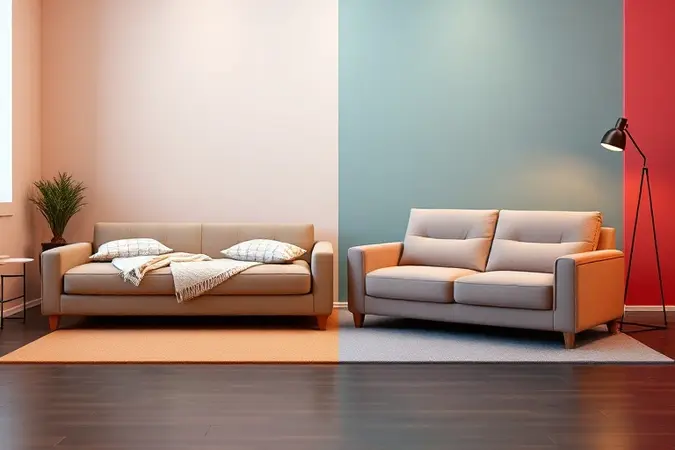
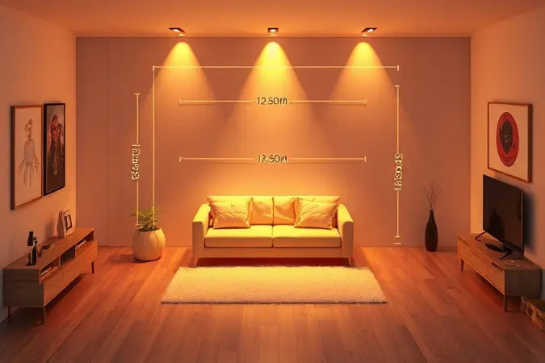

Encontrar o equilíbrio entre um sofá confortável para o dia a dia e uma cama aconchegante para as visitas parece um desafio impossível. Você já se sentiu frustrado ao comprar um móvel que parecia perfeito na loja, mas que se revelou duro ou pequeno demais em casa?

Nós entendemos sua dor. Neste guia completo, você vai descobrir exatamente o que analisar, da densidade da espuma ao tipo de mecanismo, para garantir que seu investimento traga descanso real e durabilidade.

Prepare-se para transformar sua sala com as melhores escolhas do mercado.

<SummaryList products={frontmatter.top_products} />

## Sofá-Cama vs. Sofá Retrátil e Reclinável: Qual a Diferença Real?

A escolha não é apenas estética, é sobre como você realmente vive. Você precisa de um lugar para visitas dormirem ou busca o máximo de conforto para suas maratonas de filmes? Essa resposta define tudo.

### Quando escolher o sofá-cama tradicional?

Pense no apartamento pequeno onde cada espaço precisa ser aproveitado ao máximo, ou naquela sala extra que às vezes vira quarto de hóspedes. O sofá-cama tradicional surge como herói nesses cenários, oferecendo uma solução elegante que não grita "cama improvisada".

Seu design clássico se integra naturalmente à sua decoração, enquanto o mecanismo discreto abre espaço para noites confortáveis sempre que necessário.

### As vantagens do sofá retrátil e reclinável para Home Theater

Imagine ajustar sua posição com um simples toque, os apoios para pés subindo suavemente enquanto você mergulha naquele filme que tanto esperava. Isso é o que os sofás retráteis oferecem, uma experiência de cinema personalizada na sua sala.

Eles se transformam num santuário de relaxamento, perfeito para quem valoriza momentos de entretenimento em casa acima de dormir visitas ocasionais.

## Critérios de Qualidade: O que Observar na Estrutura e Espuma

Agora que você sabe qual tipo se encaixa no seu estilo de vida, vamos ao que realmente importa, a qualidade por dentro. Afinal, não adianta ter a aparência perfeita se a estrutura vai ceder em um ano.

### Densidade da Espuma (D28, D33 ou D45): Qual a ideal para dormir?

Pense na sua última noite de sono. Você acordou renovado ou com dores nas costas? A densidade D28 é como um abraço macio, perfeita para quem raramente dorme no sofá.

Já a D33 oferece um equilíbrio sábio entre conforto e firmeza, ideal para visitas frequentes ou quem tem um sono mais agitado. E a D45? Essa é para quem leva o assunto a sério, oferecendo suporte sólido que mantém sua coluna alinhada noite após noite.

### Sofá com molas ensacadas: Vale a pena o investimento?

Você conhece aquela sensação de se mexer e fazer o parceiro ir junto num colchão comum? As molas ensacadas eliminam isso. Cada mola age independentemente, criando uma superfície inteligente que se adapta ao seu corpo sem transferir movimento.

Se você ou seu cônjuge se movimentam muito à noite, esse investimento pode ser a diferença entre acordar revigorado ou rolando noite adentro.

## Melhores Modelos de Sofá-Cama para Espaços Reduzidos

Espaço apertado não precisa significar desconforto. A arte está em escolher peças que se expandem magicamente quando necessário, sem transformar sua sala num campo de batalha diário.

### Sofá-Cama Casal 3 Lugares Premium em Suede

<ProductBox 
  title={frontmatter.top_products[0].title} 
  image={frontmatter.top_products[0].image} 
  link={frontmatter.top_products[0].link} 
/>

Quando você toca o revestimento suede, sente imediatamente que está diante de algo especial. Esse material traz instantaneamente aconchego e sofisticação, mas o verdadeiro segredo está por dentro.

Com madeira tratada e espumas de alta densidade, esse modelo promete não apenas boa aparência, mas suporte real quando transformado em cama.

É verdade que seu peso pode exigir algum esforço para movimentar, mas essa robustez é exatamente o que garante estabilidade ano após ano.

### Sofá-Cama Solteiro Compacto com Design Moderno

<ProductBox 
  title={frontmatter.top_products[1].title} 
  image={frontmatter.top_products[1].image} 
  link={frontmatter.top_products[1].link} 
/>

Para aquele cantinho que precisa ser polivalente, seja um studio pequeno ou um home office que às vezes vira quarto de hóspedes. O segredo está no mecanismo: escolha opções retráteis que deslizam suavemente, sem exigir força desproporcional.

Apesar de não oferecer armazenamento extra, essa simplicidade mantém linhas limpas que encaixam perfeitamente em ambientes contemporâneos. E quando a noite chega, ele se transforma silenciosamente em um refúgio perfeito para uma pessoa.

## Guia de Tecidos: Durabilidade, Pets e Limpeza

O tecido que reveste seu sofá-cama é como sua pele, ele precisa aguentar o desgaste do dia a dia enquanto mantém a beleza. Mas qual material sobrevive às rotinas reais?

### Suede, Linho ou Veludo: Qual o mais resistente?

Se sua casa tem crianças correndo ou pets que adoram um pulinho inesperado no sofá, o suede é seu aliado invisível. Esconde marcas como mágico e limpa com simplicidade que parece injusta para tão boa aparência.

Já o linho traz aquele charme natural perfeito para ambientes minimalistas, mas exige um cuidado mais atento. E o veludo?

Ah, esse é para os momentos de luxo, quando você quer transformar seu espaço em algo realmente especial, mesmo sabendo que pede carinho extra na manutenção.

### Capa Protetora Impermeável para Sofá

<ProductBox 
  title={frontmatter.top_products[2].title} 
  image={frontmatter.top_products[2].image} 
  link={frontmatter.top_products[2].link} 
/>

Essa é a armadura invisível que pode salvar seu investimento de desastres cotidianos. Desde a xícara derrubada na manhã com sono até o gato que decidiu testar suas garras.

A instalação exige paciência para um ajuste perfeito, mas essa hora de esforço vale anos de tranquilidade. Lavar na máquina e simplesmente recolocar, sem dramas, sem sustos. É a garantia de que seu sofá-cama sobreviverá aos momentos mais intensos da vida familiar.

## Como Medir sua Sala para Não Errar no Tamanho

O maior erro não é matemático, é imaginativo. Você precisa ver além do sofá fechado e visualizar a cama aberta, com espaço para circular, respirar, viver.

### O erro comum: Esquecer o espaço do sofá aberto

Visualize essa cena: você finalmente consegue abrir o sofá para o primo que veio visitar, mas ele bate na mesinha de centro, obrigando uma remodelagem completa do ambiente às 10 da noite.

Para evitar esse pesadelo logístico, meça o espaço liberando espaço equivalente ao tamanho da cama aberta, mais uma margem para movimento. Seu conforto noturno começa no centímetro bem calculado durante o dia.

## Manutenção e Conservação: Faça seu Sofá Durar 10 Anos

Um sofá-cama premium merece cuidados premium. E não estamos falando de rotinas complexas, mas de atenção inteligente que mantém o móvel como novo.

### Kit de Limpeza a Seco para Estofados

<ProductBox 
  title={frontmatter.top_products[3].title} 
  image={frontmatter.top_products[3].image} 
  link={frontmatter.top_products[3].link} 
/>

É como ter um spa day para seu sofá, sem bagunça ou excesso de água. Esses kits trazem soluções especializadas que penetram profundamente sem encharcar, removendo manchas que pareciam eternas e restaurando o frescor original.

Sim, alguns podem ser mais simples que outros, mas mesmo as versões básicas oferecem uma proteção poderosa contra o desgaste invisível do dia a dia. É um pequeno investimento que estende dramaticamente a vida útil do seu móvel.

## FAQ: Perguntas Frequentes sobre Sofás-Cama e Retráteis

As dúvidas que surgem na hora da compra revelam o que realmente importa. Vamos esclarecer esses pontos que podem fazer toda diferença.

### Sofá retrátil substitui uma cama de verdade?

Pense assim: um sofá retrátil é um excelente ator que pode interpretar uma cama quando necessário, especialmente para noites ocasionais.

Mas se você pretende fazer desse seu leito principal, está pedindo que um ator realize um papel para o qual não foi totalmente treinado. Mesmo os melhores modelos não oferecem o suporte integral de um colchão projetado especificamente para horas consecutivas de sono.

### Qual a melhor marca de sofá-cama atualmente?

Marcas como Americanas, Móveis Brasil e Tok&Stok construíram reputação por uma razão simples: entendem que sofá-cama precisa ser duas coisas ao mesmo tempo com excelência. Não basta ser um bom sofá ou uma cama aceitável, precisa ser ambos.

Ao escolher entre elas, vá além do nome e examine a garantia, o detalhamento do mecanismo e, mais importante, como cada modelo responde ao peso e movimento real.

## Conclusão

Escolher o sofá-cama perfeito é como encontrar aquele parceiro que se adapta a todos os seus momentos, do relaxamento diário às emergências noturnas.

Você agora tem o mapa completo: entende a diferença entre modelos, sabe o que esconder sob o tecido, conhece os materiais que sobrevivem à sua rotina e aprendeu a medir não apenas centímetros, mas experiências.

Lembre-se, um bom sofá-cama não é apenas móvel, é promessa: promessa de conforto quando você precisa descansar sozinho, e de acolhimento quando sua casa recebe quem você ama.

Antes de finalizar sua compra, respire, visualize seu espaço com o móvel aberto naquela noite especial, e pergunte-se: essa escolha me oferece paz ou preocupação? A resposta certa transformará não apenas sua sala, mas a forma como você vive cada momento dentro dela.