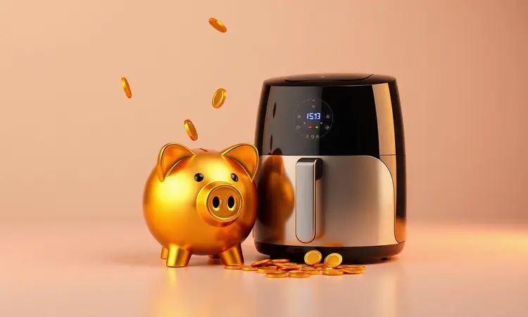

Você já passou pela seção de eletrodomésticos, viu aquela air fryer que promete frituras mais saudáveis e pensou: "Eu queria, mas o orçamento deste mês não dá"? Saiba que a cozinha prática e saudável pode estar mais próxima do que imagina.

Com o mercado mais competitivo que nunca, encontrar um modelo eficiente sem gastar uma fortuna se tornou realidade.

Neste guia, vamos descobrir juntos qual é a air fryer mais acessível do mercado, comparar os 10 melhores em custo-benefício para 2024 e, o mais importante, te dar o caminho das pedras para escolher a sua companheira de cozinha sem pesar no bolso.

<SummaryList products={frontmatter.top_products} />

## Vale a pena comprar uma air fryer barata? Entenda o custo-benefício

Imagine ter na sua cozinha aquela ajuda extra que transforma batatas congeladas em fritas crocantes em minutos, sem aquele óleo que deixa tudo pesado. É exatamente isso que uma air fryer acessível pode oferecer.

Sim, modelos mais econômicos focam no essencial: a capacidade de aquecer rápido, distribuir o calor de maneira uniforme e te entregar resultados consistentes.

Claro, você não vai encontrar funções de toque na tela ou programas superespecializados, mas para o dia a dia de quem quer praticidade e saúde, elas são mais que suficientes.

O segredo está em entender que 'barato' não precisa ser sinônimo de 'ruim'. A tecnologia de circulação de ar quente já se popularizou, o que significa que mesmo os modelos mais acessíveis hoje entregam um desempenho que surpreende.

O que muda realmente é a durabilidade dos materiais e alguns recursos extras. Se você busca uma aliada para preparar refeições mais leves sem complicação, uma air fryer econômica pode ser a jogada certa.

## Como escolher a melhor air fryer barata sem errar na compra

Antes de clicar no 'comprar', alguns detalhes fazem toda a diferença entre uma compra satisfatória e um eletrodoméstico que vira enfeite. Vamos descomplicar o que realmente importa.

### Capacidade: Qual o tamanho ideal para sua família?

Pense na sua rotina: você cozinha para quantas pessoas com frequência? Uma capacidade de 1,5 a 3 litros é perfeita para casais ou quem vive sozinho, ideal para preparar aquela porção de batata frita para o filme da noite ou legumes para o almoço.

Agora, se a casa tem mais bocas para alimentar ou você gosta de preparar marmitas para a semana, modelos entre 4 e 6 litros são os heróis.

Eles permitem assar um frango inteiro ou fazer batatas suficientes para todos de uma só vez, economizando seu tempo e energia (a sua e a elétrica).

### Potência e eficiência energética: O barato que não sai caro na conta de luz

Aqui está um equilíbrio delicado. Potências entre 1.200W e 1.800W são as mais comuns e garantem que seus alimentos fiquem dourados por fora e cozidos por dentro rapidamente.

Mas atenção: mais watts não significam necessariamente melhor desempenho, só um consumo maior se o aparelho não for eficiente. Procure por selos de eficiência energética (geralmente classificação A).

Um modelo que aquece rápido e mantém a temperatura estável consome menos energia no geral, porque fica menos tempo ligado. É o clássico caso do investimento inteligente que se paga ao longo do tempo, evitando sustos na conta de luz.

### Revestimento antiaderente e facilidade de limpeza

Este é o verdadeiro teste da felicidade pós-jantar. Um bom revestimento antiaderente significa que a batata sai inteira da grelha, que o queijo derretido não vira uma missão impossível de limpar e que você passa apenas um pano úmido e pronto.

Componentes removíveis e que vão à lava-louças são um bônus que vale seu peso em ouro nos dias mais corridos.

Além da praticidade, um revestimento de qualidade protege o aparelho contra arranhões e desgaste, garantindo que sua air fryer tenha uma vida longa e produtiva na sua cozinha.

## As 10 Air Fryers mais baratas e bem avaliadas do mercado

Chegou a hora do desfile das candidatas. Reunimos aqui as opções que unem preço justo e avaliações positivas de quem já levou para casa. Cada uma tem sua personalidade.

### 1. Air Fryer Cadence Pratic Fryer FRT515 3L

<ProductBox 
  title={frontmatter.top_products[0].title} 
  image={frontmatter.top_products[0].image} 
  link={frontmatter.top_products[0].link} 
/>

A praticante da cozinha compacta. Com seus 3 litros e 1250W de potência, ela é a companheira ideal para quem mora sozinho ou em casal. A temperatura ajustável (90°C a 200°C) dá liberdade para assar, fritar e até desidratar frutas.

A limpeza é descomplicada graças à grelha removível e ao revestimento que não deixa nada grudar.

Alguns usuários mencionam que ela não é a mais silenciosa do pedaço, mas para quem valoriza simplicidade e resultados consistentes sem gastar muito, ela cumpre muito bem o papel.

### 2. Air Fryer Britânia BFR25P 3,5L

<ProductBox 
  title={frontmatter.top_products[1].title} 
  image={frontmatter.top_products[1].image} 
  link={frontmatter.top_products[1].link} 
/>

A equilibrista que entrega crocância em 360 graus. A tecnologia Air Flow 360° desta Britânia de 3,5 litros promete (e entrega) alimentos crocantes por todos os lados com seus 1500W de potência.

O timer de 60 minutos com desligamento automático te permite cuidar de outras coisas enquanto o jantar fica pronto. Um ponto de atenção: ela não é bivolt, então na hora da compra você precisa escolher entre 127V ou 220V.

Mas se a voltagem da sua casa é compatível, ela se torna uma excelente opção de custo-benefício.

### 3. Air Fryer Mondial Family AF-30 3,5L

<ProductBox 
  title={frontmatter.top_products[2].title} 
  image={frontmatter.top_products[2].image} 
  link={frontmatter.top_products[2].link} 
/>

A clássica que conquistou a confiança dos brasileiros. A Mondial traz um modelo de 3,5 litros com a potência robusta de 1500W e aquele timer de 60 minutos que avisa quando tudo está no ponto.

O revestimento Duraflon no cesto é a garantia de que a limpabilidade será alta.

Assim como a anterior, ela não é bivolt (disponível em 110V e 220V), um detalhe que exige verificação na compra, mas que não diminui sua fama de aparelho durável e eficiente para famílias pequenas.

### 4. Air Fryer Philco PFR15PG Gourmet 4,4L

<ProductBox 
  title={frontmatter.top_products[3].title} 
  image={frontmatter.top_products[3].image} 
  link={frontmatter.top_products[3].link} 
/>

A generosa da família. Com 4,4 litros de capacidade, esta Philco é para quem não quer fazer várias levas de batata frita. Os 1500W de potência e o revestimento antiaderente "Maxx Gold" são o casamento perfeito entre desempenho e facilidade de limpeza.

O controle de temperatura vai de 80°C a 200°C, abrindo um leque grande de receitas. Novamente, a atenção vai para a voltagem (110V ou 220V), mas se isso não for um problema, você terá uma fritadeira espaçosa e confiável.

### 5. Air Fryer WAP Family WAFF2-P 4L

<ProductBox 
  title={frontmatter.top_products[4].title} 
  image={frontmatter.top_products[4].image} 
  link={frontmatter.top_products[4].link} 
/>

A versátil de design quadrado. O formato diferente desta WAP de 4 litros não é só estética: ele melhora a circulação do ar. A tecnologia de ar 360° funciona bem, entregando alimentos crocantes de maneira uniforme.

O timer com desligamento automático oferece segurança, e a faixa de temperatura (80°C a 200°C) é completa.

Ela não tem pré-aquecimento automático, então você precisa colocar os alimentos e ligar, um pequeno passo a mais que não atrapalha sua experiência com um aparelho moderno e eficiente.

### 6. Air Fryer Elgin Start Fry 3,5L

<ProductBox 
  title={frontmatter.top_products[5].title} 
  image={frontmatter.top_products[5].image} 
  link={frontmatter.top_products[5].link} 
/>

A eficiente da tecnologia em espiral. A Elgin utiliza circulação de ar quente em espiral para garantir que o calor envolva os alimentos por igual. Com 3,5 litros e 1400W, ela é uma opção sólida e acessível.

O controle de temperatura e o timer de 60 minutos atendem bem a maioria das receitas. Um detalhe prático: o cabo de energia é um pouco curto, então pense no lugar onde ela vai ficar na sua bancada.

Fora isso, suas partes removíveis facilitam muito a vida na hora de lavar.

### 7. Air Fryer EOS Premium EAF40P 4L

<ProductBox 
  title={frontmatter.top_products[6].title} 
  image={frontmatter.top_products[6].image} 
  link={frontmatter.top_products[6].link} 
/>

A ágil da tecnologia Turbo Twist. Este modelo de 4 litros promete cozimento mais rápido, economizando seus minutos preciosos. O sistema MaxxiClean é outro destaque, tornando a limpeza algo realmente simples.

Ela não é bivolt (atenção à voltagem), mas compensa com um design elegante e um detalhe de segurança interessante: o cesto tem proteção contra quedas acidentais. Para quem prepara refeições para a família e valoriza agilidade, é uma candidata forte.

### 8. Air Fryer Gaabor 1,4L - A melhor opção compacta

<ProductBox 
  title={frontmatter.top_products[7].title} 
  image={frontmatter.top_products[7].image} 
  link={frontmatter.top_products[7].link} 
/>

A mini que cabe em qualquer cantinho. Perfeita para quem vive sozinho, em casal ou tem uma cozinha pequena. Com apenas 1,4 litros e 900W, ela usa a tecnologia Cyclone Air 360º para fritar com até 80% menos óleo. O controle é analógico, super simples de usar.

A limitação é clara: ela não serve para uma família, mas para porções individuais ou pequenos lanches a dois, é uma maravilha. A temperatura é fixa em 200ºC, o que pode limitar algumas receitas específicas, mas para o básico do dia a dia, ela é prática e estilosa.

### 9. Air Fryer HQ HF2055 2,8L

<ProductBox 
  title={frontmatter.top_products[8].title} 
  image={frontmatter.top_products[8].image} 
  link={frontmatter.top_products[8].link} 
/>

A intermediária que equilibra tamanho e preço. Com 2,8 litros e 1000W, ela é uma opção para quem acha os modelos de 3 litros muito grandes e os compactos muito pequenos. O controle de temperatura vai até 200°C e o timer marca 30 minutos.

A limpeza é facilitada pelo cesto removível com antiaderente. O ponto de atenção segue o padrão das mais acessíveis: não é bivolt (110V ou 220V). Para quem busca simplicidade e um desempenho honesto por um preço muito camarada, ela é uma ótima aposta.

### 10. Air Fryer Britânia Bella Cuccina BCFR04 3,5L

<ProductBox 
  title={frontmatter.top_products[9].title} 
  image={frontmatter.top_products[9].image} 
  link={frontmatter.top_products[9].link} 
/>

A segura da proteção extra. Esta Britânia traz a confiabilidade da marca em um modelo de 3,5 litros e 1500W. A tecnologia Air Flow garante o cozimento uniforme, e os controles de tempo e temperatura são completos.

Além do revestimento antiaderente para facilitar a limpeza, ela conta com sistema de proteção contra sobreaquecimento, um detalhe de segurança que traz tranquilidade, especialmente para quem tem crianças em casa.

Seu design compacto também ajuda a não ocupar muito espaço na bancada.

## Onde não colocar sua Air Fryer? Dicas de segurança e conservação

Seu novo aliado da cozinha precisa de um bom lugar para viver. Nunca a posicione sobre superfícies que possam pegar fogo, como toalhas de pano ou próximo a cortinas.

Ela precisa respirar: deixe pelo menos 10cm de espaço livre nas laterais e atrás para o ar circular e evitar que o motor superaqueça. Mantenha-a longe do fogão, porque o calor extra pode danificar seus componentes.

E, claro, fora do alcance de crianças curiosas e pets que podem derrubar o cabo. Escolher o lugar certo é o primeiro passo para uma longa e feliz convivência.

## 3 Erros comuns ao comprar uma air fryer econômica que você deve evitar

O entusiasmo por uma boa oferta pode levar a decisões apressadas. O primeiro erro é ignorar a capacidade. Comprar uma mini para uma família de quatro vai significar fazer várias levas e perder a praticidade.

O segundo é olhar só o preço da etiqueta e esquecer a potência. Um modelo muito fraco vai deixar suas batatas murchas e demorar uma eternidade, anulando a vantagem da rapidez. Por último, não ler as avaliações de quem já comprou.

Experiências reais revelam se o barulho é tolerável, se o antiaderente dura ou se o timer realmente funciona. Desviar dessas armadilhas garante que seu dinheiro será bem investido.

## Perguntas Frequentes (FAQ) sobre Air Fryers Baratas

### Qual a marca de air fryer mais durável entre as baratas?

Durabilidade em modelos econômicos está muito ligada à reputação da marca e aos materiais usados. A Mondial construiu uma legião de fãs justamente pela resistência de seus produtos a um preço acessível.

A Britânia também se destaca, com modelos que aguentam o tranco do uso diário. A Philco, em uma faixa de preço um pouco acima, é conhecida pela longevidade e acabamento.

A dica é: dentro do orçamento, priorize marcas com histórico no mercado de eletrodomésticos e leia avaliações que mencionem o uso após alguns meses.

### Air fryer barata consome muita energia elétrica?

É um equilíbrio interessante. Sim, a potência nominal (entre 1.200W e 1.800W) parece alta, mas o consumo real é moderado pelo tempo de uso. Um forno elétrico convencional fica ligado por 30-40 minutos para assar batatas. Uma air fryer faz o mesmo em 15-20 minutos.

Como ela aquece rapidamente e cozinha mais veloz, o tempo total com o aparelho ligado é menor, o que frequentemente resulta em um consumo de energia similar ou até menor no final do mês. A eficiência está na agilidade.

## Conclusão

Encontrar a air fryer ideal para seu bolso é mais sobre fazer as perguntas certas do que sobre gastar mais. Qual é o tamanho da sua família? Com que frequência você vai usá-la? Qual espaço você tem na bancada?

As opções acessíveis de hoje entregam o essencial com qualidade: cozimento saudável, rapidez e facilidade de limpeza.

Desde a compacta Gaabor, perfeita para o solteiro apressado, até a generosa Philco Gourmet, que alimenta uma família pequena com tranquilidade, há uma opção para cada realidade.

O segredo da satisfação está em combinar suas necessidades reais com as características do aparelho, sem se deixar levar apenas pelo preço mais baixo. Leia as experiências de outros usuários, compare as capacidades e imagine o aparelho na sua rotina.

Com as informações deste guia na mão, você está pronto para escolher a parceira de cozinha que vai trazer mais praticidade e sabor para seus dias, sem pesar no orçamento. Boas compras e bom apetite!