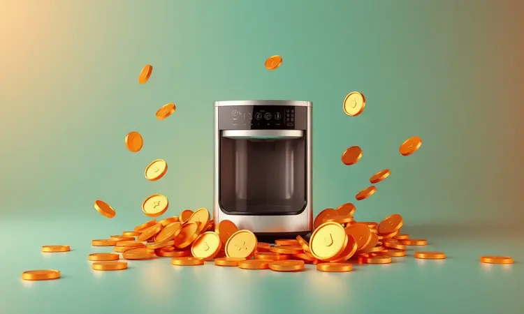
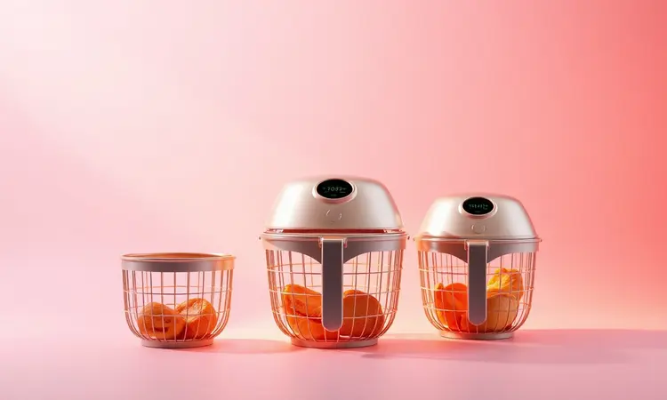
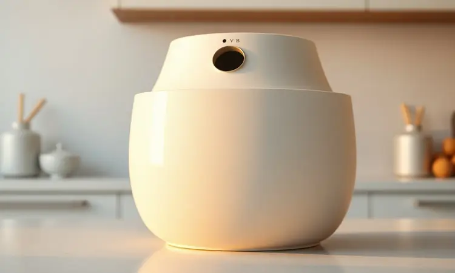
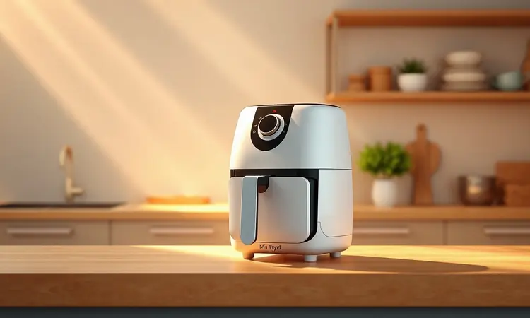

Ter uma alimentação mais saudável sem gastar muito tempo ou dinheiro é o desejo de quase todo mundo. Encontrar uma air fryer barata e boa de verdade pode parecer um desafio diante de tantas opções que prometem muito e entregam pouco.

Neste guia definitivo, selecionamos os 10 modelos mais bem avaliados de 2026, analisamos o custo-benefício real de cada um e preparamos dicas exclusivas para você escolher o aparelho ideal para a sua rotina sem desperdiçar um centavo.

<SummaryList products={frontmatter.top_products} />

## O que define uma Air Fryer "Barata e Boa" em 2026?

Uma Air Fryer "barata e boa" em 2026 se destaca por oferecer um equilíbrio entre preço acessível e funcionalidades essenciais. Os modelos ideais possuem uma boa capacidade de cesto, permitindo preparar porções consideráveis de alimentos de uma vez.

Além disso, a eficiência energética é um fator importante, já que equipamentos mais econômicos ajudam a reduzir custos na conta de luz.

A facilidade de limpeza também não pode ser esquecida, peças removíveis e revestimentos antiaderentes tornam a experiência mais prática.

Por fim, um design intuitivo com controles simples garante que até os iniciantes na cozinha possam utilizar o aparelho sem dificuldades.

## Ranking das 10 Melhores Air Fryers Baratas e Boas para Comprar

Ao escolher uma air fryer, é fundamental considerar não apenas o preço, mas também a eficiência e a qualidade do cozimento. Neste ranking, apresentamos as melhores opções que equilibram custo e performance para facilitar sua decisão.

### 1. Air Fryer Cadence FRT515 3 L: Compacta e Eficiente

<ProductBox 
  title={frontmatter.top_products[0].title} 
  image={frontmatter.top_products[0].image} 
  link={frontmatter.top_products[0].link} 
/>

Imagine ter uma cozinha organizada, sem eletrodomésticos ocupando espaço desnecessário. A Air Fryer Cadence FRT515 3 L, também conhecida como Pratic Fryer, traz exatamente essa sensação de praticidade.

Com capacidade de 3 litros e potência de 1250W, ela oferece controles de temperatura ajustáveis entre 90°C e 200°C e timer de até 60 minutos, perfeita para fritar, assar e descongelar alimentos de maneira prática.

Para quem vive sozinho ou em casal, essa compacta é uma aliada poderosa. Seu design minimalista não apenas facilita o armazenamento, mas transforma a limpeza em algo quase automático, graças ao cesto removível e antiaderente. A única ressalva?

Se você costuma cozinhar para muitas pessoas ao mesmo tempo, talvez precise fazer em duas etapas. Mas para o dia a dia, ela entrega crocância e saúde sem complicações.

### 2. Air Fryer HQ 2,8 L Hf 2055: A Opção Mais Econômica

<ProductBox 
  title={frontmatter.top_products[1].title} 
  image={frontmatter.top_products[1].image} 
  link={frontmatter.top_products[1].link} 
/>

Quando cada centavo conta, encontrar um equilíbrio entre economia e funcionalidade se torna essencial. A Air Fryer HQ 2,8 L HF 2055 entra em cena como aquela parceira que não pesa no bolso, mas cumpre promessas.

Com capacidade de 2,8 litros e potência de 1000W, ela ajusta temperatura de 80°C a 200°C e avisa com um sinal sonoro quando sua refeição está perfeita.

Pense nela como a companheira ideal para solteiros ou casais que querem explorar receitas sem óleo. Seu design compacto cabe em qualquer cantinho, e a limpeza é tão simples quanto deveria ser.

Apenas atenção à voltagem (127V ou 220V), mas isso não diminui seu brilho como uma escolha inteligente para quem busca eficiência sem estourar o orçamento.

### 3. Air Fryer EOS EAF40P 4 L: Espaço de sobra com Baixo Custo

<ProductBox 
  title={frontmatter.top_products[2].title} 
  image={frontmatter.top_products[2].image} 
  link={frontmatter.top_products[2].link} 
/>

Você já imaginou preparar um jantar completo para a família sem precisar usar o forno convencional? A Air Fryer EOS EAF40P torna isso realidade com seus 4 litros totais (3,5L úteis), oferecendo espaço suficiente para quem gosta de cozinhar com folga.

A tecnologia Turbo Twist AirFryer circula o ar quente de forma inteligente, garantindo que cada pedaço fique igualmente crocante.

Com 1.500W de potência, timer de 30 minutos e temperatura que chega a 200°C, ela é rápida e eficiente. O sistema MaxxiClean de limpeza fácil e a proteção contra queda do cesto são detalhes que mostram cuidado com sua experiência.

Verifique apenas a voltagem (110V ou 127V) antes de comprar, e terá em mãos uma ferramenta que equilibra desempenho e custo-benefício com maestria.

### 4. Air Fryer Gaabor 1,4 L: Ideal para quem Mora Sozinho

<ProductBox 
  title={frontmatter.top_products[3].title} 
  image={frontmatter.top_products[3].image} 
  link={frontmatter.top_products[3].link} 
/>

Para quem acorda sozinho e prepara suas próprias refeições, a praticidade não é apenas conveniente, é uma necessidade. A Air Fryer Gaabor de 1,4 L, ou Mini Air Fryer Gaabor Pocket, foi feita para caber na sua rotina individual.

Com 900W e tecnologia Cyclone Air 360º, ela transforma ingredientes simples em refeições crocantes por fora e macias por dentro em poucos minutos.

Sua capacidade limitada é justamente seu ponto forte, ocupando pouco espaço na bancada e sendo fácil de guardar.

O design elegante com opções de cores adiciona um toque de personalidade à sua cozinha, enquanto o cesto removível e antiaderente faz da limpeza algo que você nem precisa pensar. É a escolha perfeita para quem valoriza autonomia culinária sem bagunça.

### 5. Air Fryer Britânia Bfr25p 3,5 L: Equilíbrio e Tradição

<ProductBox 
  title={frontmatter.top_products[4].title} 
  image={frontmatter.top_products[4].image} 
  link={frontmatter.top_products[4].link} 
/>

Às vezes, o que buscamos em um eletrodoméstico é confiança. A sensação de que ele funcionará sempre que precisarmos. A Air Fryer Britânia BFR25P de 3,5 L traz esse sentimento através da tradição de uma marca conhecida.

Com 1500W e tecnologia Air Flow 360º, ela promete (e cumpre) frituras rápidas que mantêm os alimentos suculentos por dentro.

Para casais ou pessoas que vivem sozinhas, seus 3,5 litros são a medida certa. Ela não vai impressionar com recursos extravagantes, mas entrega exatamente o que promete: praticidade no uso e limpeza rápida.

É aquela air fryer que você compra hoje e ainda estará usando anos depois, sem surpresas.

### 6. Air Fryer Elgin Start Fry 3 L: Design e Praticidade

<ProductBox 
  title={frontmatter.top_products[5].title} 
  image={frontmatter.top_products[5].image} 
  link={frontmatter.top_products[5].link} 
/>

Alguns aparelhos não apenas executam funções, mas também embelezam o ambiente. A Air Fryer Elgin Start Fry 3 L é uma dessas peças, com design compacto e acabamento em preto que conversa com qualquer estilo de decoração.

Mas não se engane pela aparência, ela trabalha duro: capacidade de 3 litros, tecnologia Air Circuit 360° e controle de temperatura de 80°C a 200°C.

A grelha removível torna a limpeza algo que você resolve em segundos, e algumas partes podem até ir à máquina de lavar louças. Sim, ela é mais básica que modelos premium, mas essa simplicidade é justamente seu charme.

Para quem busca eficiência sem firulas, ela entrega performance com elegância.

### 7. Air Fryer Britânia Bella Cuccina 3,5 L: Potência no Ponto Certo

<ProductBox 
  title={frontmatter.top_products[6].title} 
  image={frontmatter.top_products[6].image} 
  link={frontmatter.top_products[6].link} 
/>

Quando você precisa de resultados consistentes, potência bem distribuída faz toda diferença. A Air Fryer Britânia Bella Cuccina 3,5 L oferece exatamente isso com seus 1500W e tecnologia Air Flow 360°, garantindo que o ar quente alcance cada canto dos alimentos.

O resultado são pratos crocantes e saborosos que fazem você esquecer que usou pouco ou nenhum óleo.

Com capacidade de 3,5 litros, timer de até 60 minutos e desligamento automático, ela é prática para refeições generosas. O design moderno e a facilidade de limpeza completam o pacote.

Para grupos maiores, o cesto pode pedir um pouco de planejamento, mas para o uso cotidiano, ela se mostra uma investimento que vale cada centavo.

### 8. Air Fryer WAP Family WAFF2-P 4 L: Robustez para a Família

<ProductBox 
  title={frontmatter.top_products[7].title} 
  image={frontmatter.top_products[7].image} 
  link={frontmatter.top_products[7].link} 
/>

Alimentar uma família requer não apenas espaço, mas também versatilidade. A Air Fryer WAP Family WAFF2-P 4L entende essa necessidade, com capacidade para quatro pessoas e 1500W de potência que aquecem rapidamente.

Imagine preparar batatas, frango e legumes ao mesmo tempo, tudo ficando crocante por fora e macio por dentro, sem óleo.

A tecnologia de circulação de ar em 360° cuida da uniformidade, enquanto o revestimento antiaderente e grelha removível (até lavável na máquina) transformam a limpeza em algo quase terapêutico.

Seu design quadrado otimiza o espaço interno, mas exige um pouco mais da bancada. Para quem busca robustez que acompanha o ritmo familiar, ela é uma escolha certeira.

### 9. Air Fryer Mondial AF-30 3,5 L: A Favorita dos Consumidores

<ProductBox 
  title={frontmatter.top_products[8].title} 
  image={frontmatter.top_products[8].image} 
  link={frontmatter.top_products[8].link} 
/>

Às vezes, a sabedoria coletiva aponta o caminho certo. A Air Fryer Mondial AF-30 de 3,5 litros conquistou popularidade por um motivo simples: funciona bem.

Com 1500W e controle de temperatura até 200°C, ela utiliza circulação de ar quente para cozinhar e assar sem óleo, preservando sabor e textura.

O cesto antiaderente é aquele amigo que facilita tanto o preparo quanto a limpeza. Para famílias de até três pessoas, ela é generosa.

Sua versatilidade vai de batatas fritas a sobremesas, abrindo um mundo de possibilidades para quem quer explorar novas receitas de maneira descomplicada.

### 10. Air Fryer Philco Pfr15pg 4,4 L: Alta Capacidade com Preço Acessível

<ProductBox 
  title={frontmatter.top_products[9].title} 
  image={frontmatter.top_products[9].image} 
  link={frontmatter.top_products[9].link} 
/>

Quando você precisa de espaço sem pagar fortunas, o equilíbrio entre capacidade e custo se torna crucial. A Air Fryer Philco PFR15PG oferece 4,4 litros e 1500W de potência, com controle de temperatura entre 80°C e 200°C e timer de 60 minutos.

O cesto removível com antiaderente faz a limpeza ser algo que você resolve em instantes.

Atenção apenas à temperatura externa (cerca de 52°C), que pede cuidado ao manusear. Mas seu design moderno e controles analógicos giratórios criam uma experiência de uso simples e durável. É a prova de que alta capacidade e preço acessível podem, sim, andar juntos.

Agora que conhece os modelos, vamos entender os critérios que tornaram essa seleção possível. Essas escolhas não foram aleatórias, mas baseadas em características que realmente impactam sua experiência na cozinha.

## Guia de Compra: Como não errar na escolha da sua fritadeira de entrada

Escolher sua primeira air fryer é como encontrar a parceira perfeita para a cozinha. Ela precisa se encaixar no seu espaço, acompanhar seu ritmo e tornar suas refeições mais práticas. Vamos desvendar o que realmente importa nessa decisão.

### Capacidade em Litros: Quanto você realmente precisa?

Pense na liberdade de preparar uma refeição completa sem precisar fazer em etapas. A capacidade determina exatamente isso. Para quem vive sozinho ou em casal, modelos entre 2 e 4 litros oferecem porções suficientes sem ocupar espaço desnecessário.

Já famílias maiores ou quem gosta de cozinhar em lote encontram em capacidades de 5 litros ou mais a possibilidade de reunir todos à mesa com uma única preparação. Reflita sobre sua rotina, quantas pessoas você costuma alimentar e como organiza suas refeições.

A resposta está no seu dia a dia.

### Potência e Consumo de Energia: O impacto na sua conta de luz

Imagine o prazer de ver sua comida ficar pronta rapidamente enquanto você organiza a mesa. A potência (geralmente entre 800 a 2000 watts) influencia diretamente essa velocidade. Modelos mais potentes aceleram o cozimento, mas também consomem mais energia.

O segredo está no equilíbrio: escolha eficiência e maximize cada uso, preparando quantidades maiores de uma vez. Dessa forma, você otimiza não apenas o tempo, mas também o impacto na sua conta de luz.

### Qualidade do Antiaderente: O segredo da durabilidade do cesto

A paz de espírito ao limpar em segundos, sem esfregar ou se frustrar, vem diretamente da qualidade do antiaderente. Um bom revestimento não apenas impede que os alimentos grudem, garantindo cozimento uniforme, mas também resiste ao tempo e às temperaturas.

Ao escolher, observe esse detalhe, pois ele fará diferença toda vez que você terminar de cozinhar e pensar na limpeza. Durabilidade e facilidade andam juntas aqui.

## Segurança na Cozinha: Onde NÃO colocar sua Air Fryer

Cuidar da sua air fryer também significa cuidar de quem está ao redor. Evite colocá-la perto de materiais inflamáveis como toalhas ou plásticos, pois o calor gerado pode representar riscos. Superfícies instáveis ou próximas a bordas de mesas são convites para acidentes.

E nunca a guarde em espaços fechados enquanto estiver em uso, ela precisa respirar para evitar superaquecimento. Manter sua cozinha organizada e segura transforma cada uso em uma experiência tranquila.

## 5 Erros Comuns ao Comprar Modelos Mais Baratos e Como Evitá-los

Economizar não significa aceitar qualquer coisa. O primeiro erro é ignorar a capacidade, comprando um modelo que não atende suas necessidades. O segundo: subestimar a potência, resultando em tempos de cozimento frustrantes.

Terceiro, não ler avaliações de quem já comprou, perdendo alertas sobre durabilidade. Quarto, fazer uma pesquisa superficial sobre materiais e acabamentos. E quinto, esquecer da assistência técnica, que pode ser crucial no futuro. A solução?

Pesquisa, reflexão e atenção aos detalhes que realmente importam para você.

## Dicas de Manutenção para sua Air Fryer Durar Anos

Para prolongar a vida útil do seu aparelho, siga alguns cuidados simples. Sempre espere esfriar completamente antes de limpar, protegendo tanto você quanto o equipamento. Use pano úmido e detergente suave nas partes externas e removíveis.

Mantenha a cesta livre de acumulo de gordura com limpezas frequentes. E evite utensílios de metal, que podem arranhar o precioso antiaderente. Com esses gestos, sua air fryer continuará entregando desempenho ideal por muito tempo, tornando cada refeição especial.

## Conclusão

Encontrar a air fryer barata e boa para o seu perfil é mais sobre autoconhecimento do que sobre especificações técnicas. Se você cozinha para uma família grande, priorize capacidade sem esquecer do espaço disponível.

Para quem vive sozinho ou em casal, modelos compactos oferecem economia de energia e funcionalidade completa. Avalie funções adicionais como grelhar ou assar, que podem agregar valor ao seu dia a dia.

O verdadeiro custo-benefício não está apenas no preço da etiqueta, mas na transformação que o aparelho traz para sua rotina. Uma air fryer que facilita suas manhãs, agiliza seus jantares e torna a alimentação saudável algo natural, isso sim é investimento.

Escolha aquela que conversa com seu estilo de vida, que cabe no seu espaço e no seu bolso, e descubra como pequenas mudanças na cozinha podem criar grandes impactos no seu bem-estar. Comece hoje a transformar suas refeições.

## Perguntas Frequentes (FAQ) sobre Air Fryers de Custo-Benefício

Muitas dúvidas surgem quando buscamos o equilíbrio entre qualidade e preço. Sobre eficiência energética, a maioria dos modelos consome menos que um forno convencional, uma economia perceptível na conta de luz.

Quanto à capacidade, varie conforme suas necessidades familiares, escolhendo o tamanho que atende sua realidade. O tempo de cozimento geralmente é mais rápido, mas varia com o alimento. Pesquisar sempre ajuda a fazer escolhas mais informadas e seguras para sua rotina.