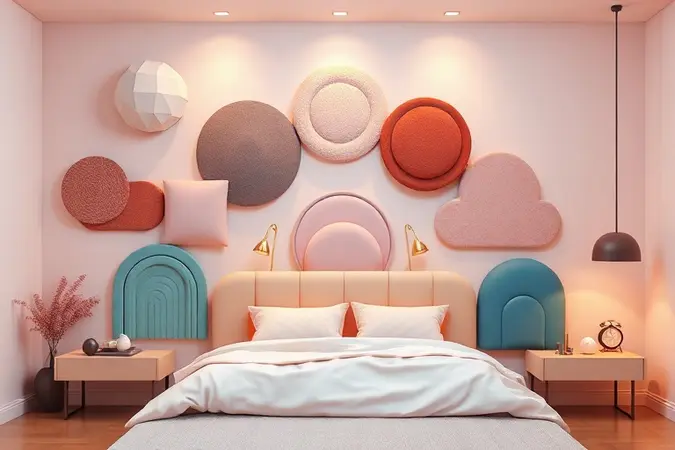
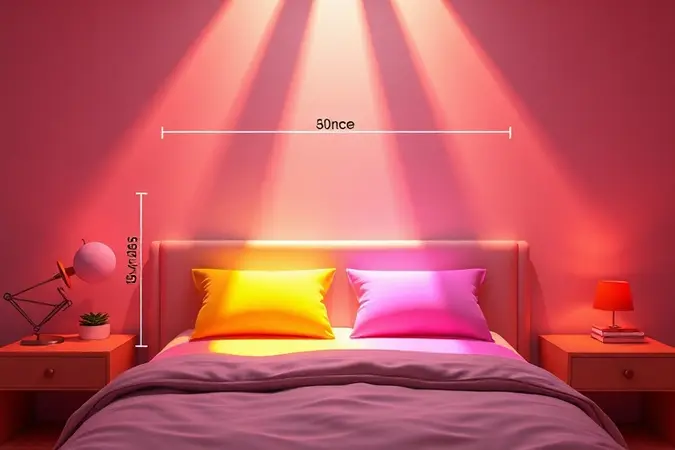
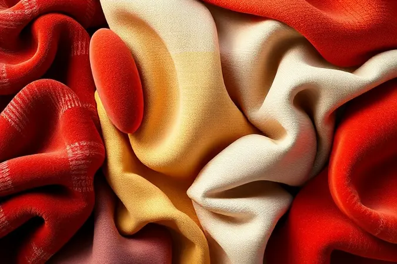
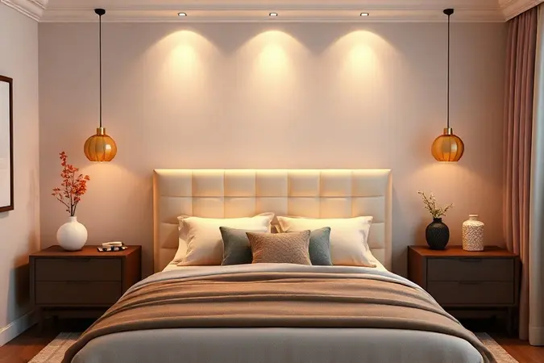

Você já sentiu que falta algo no seu quarto para torná-lo realmente acolhedor? Muitas vezes, a resposta está na cabeceira.

Mais do que um simples acessório estético, ela é como o abraço que sua cama precisava: oferece conforto térmico, protege a parede e, acima de tudo, define a personalidade do seu refúgio pessoal.

Mas diante de tantas opções de materiais, cores e tamanhos, como saber o que realmente combina com você?

Neste guia, você não vai apenas aprender medidas e materiais, vai descobrir como transformar seu quarto naquele espaço onde os dias começam bem e as noites terminam em paz total.

<SummaryList products={frontmatter.top_products} />

## Por Que a Cabeceira é Essencial? (Além da Decoração)

Pense na cabeceira como o melhor amigo do seu quarto. Enquanto você mergulha num livro ou relaxa assistindo algo, ela está ali, firme, oferecendo o apoio perfeito para suas costas. Mas sua função vai além do conforto imediato.

Ela protege delicadamente suas paredes de manchas e desgastes, mantendo o ambiente sempre impecável. Funciona ainda como um isolante natural, criando uma barreira acolhedora contra paredes frias.

E o melhor: através da escolha certa de estilo e material, ela se torna a assinatura visual do espaço, contando quem você é sem precisar de uma única palavra.

## Principais Tipos de Cabeceira para se Inspirar

Cada material traz uma personalidade diferente para o quarto. Madeira sussurra tradição e calor, estofados oferecem um abraço de conforto, metálicas trazem elegância industrial.

A escolha certa não é apenas sobre estética, é sobre qual dessas personalidades melhor conversa com a sua rotina e seus momentos de descanso.

### Cabeceira Estofada: Máximo Conforto e Sofisticação

<ProductBox 
  title={frontmatter.top_products[0].title} 
  image={frontmatter.top_products[0].image} 
  link={frontmatter.top_products[0].link} 
/>

Imagine acordar apoiado numa superfície macia que parece ter sido feita sob medida para o seu corpo. É essa sensação que uma cabeceira estofada entrega todas as manhãs.

Além do conforto óbvio para ler ou assistir TV na cama, seu acolchoamento faz uma mágica silenciosa: isola ruídos e mantém a temperatura ambiente estável, transformando suas noites em verdadeiros retiros de paz.

A variedade de tecidos, do veludo sedoso ao linho rústico, permite que você escolha não apenas uma cor, mas uma textura que converse com sua pele.

Sim, ela pede um cuidado extra na limpeza, especialmente se sua casa tem crianças ou pets, mas essa pequena atenção é recompensada toda vez que você se apoia e sente aquele abraço suave que só o estofado sabe dar.

### Cabeceira de Madeira: Versatilidade do Rústico ao Moderno

<ProductBox 
  title={frontmatter.top_products[1].title} 
  image={frontmatter.top_products[1].image} 
  link={frontmatter.top_products[1].link} 
/>

Se você busca um elemento que conte uma história, a madeira é sua narradora perfeita. Uma cabeceira de madeira natural, especialmente de demolição, traz para o seu quarto a autenticidade marcada pelo tempo, cada nó e veio contando uma história diferente.

Já numa versão laqueada com design limpo, ela se transforma num elemento contemporâneo que organiza o espaço visual sem esforço. Alguns modelos ainda vêm com surpresas funcionais, como prateleiras discretas onde você pode deixar seu livro favorito ou um copo d'água.

A instalação pode exigir um pouco mais de atenção em alguns casos, mas pensar que você está montando não apenas um móvel, mas a moldura dos seus momentos de descanso, transforma o processo num ritual gratificante.

### Cabeceira Ripada: A Grande Tendência de Design Atual

<ProductBox 
  title={frontmatter.top_products[2].title} 
  image={frontmatter.top_products[2].image} 
  link={frontmatter.top_products[2].link} 
/>

Quem procura uma solução que une modernidade com textura aconchegante encontra nas cabeceiras ripadas seu match perfeito.

As ripas, dispostas vertical ou horizontalmente, criam um jogo de luz e sombras que dá profundidade à parede, como se o quarto ganhasse uma nova dimensão. Do minimalismo absoluto a projetos que cobrem toda a parede atrás da cama, a versatilidade é impressionante.

Se você tem pulso para o DIY, montar sua própria versão pode ser uma experiência criativa que deixa sua marca pessoal em cada detalhe.

Modelos modulares com módulos autocolantes facilitam o processo, mas mesmo as versões mais elaboradas compensam o cuidado na instalação com o visual sofisticado que trazem.

### Cabeceira de Ferro: O Charme do Estilo Vintage e Industrial

<ProductBox 
  title={frontmatter.top_products[3].title} 
  image={frontmatter.top_products[3].image} 
  link={frontmatter.top_products[3].link} 
/>

Para quem quer um toque de personalidade marcante, o ferro oferece uma solução que une robustez com charme atemporal.

Sua estética que flerta entre o vintage e o industrial cria contrastes interessantes, especialmente quando combinada com móveis de madeira que suavizam sua presença.

Este é um investimento para durar: resistente a impactos e, com os cuidados certos, mantendo-se impecável por anos.

Em ambientes úmidos, a atenção com a limpeza regular evita preocupações com ferrugem, um cuidado simples que preserva não apenas o material, mas a narrativa visual que você criou.

## Como Escolher o Tamanho Ideal da Cabeceira

O tamanho da cabeceira é como o ajuste perfeito de uma roupa: quando encaixa bem, você nem percebe que está ali, mas quando está errado, incomoda o tempo todo.

A proporção certa traz harmonia visual e funcionalidade prática, fazendo com que o quarto respire tranquilidade.

### Modelos para Cama de Solteiro

<ProductBox 
  title={frontmatter.top_products[4].title} 
  image={frontmatter.top_products[4].image} 
  link={frontmatter.top_products[4].link} 
/>

Para camas de solteiro, a cabeceira pode ser tanto um elemento discreto quanto uma peça de destaque.

As opções estofadas trazem aquele acolhimento extra para noites de leitura, disponíveis em tecidos como suede e veludo em cores que vão dos neutros serenos aos tons vibrantes que dão personalidade.

Já a madeira oferece a solidez clássica, perfeita para quem busca raízes visuais. Modelos em "L" que se estendem pelas laterais criam uma sensação de aconchego ampliado, como se a cama abraçasse quem está nela.

Algumas versões inovadoras ainda incorporam funcionalidades surpreendentes: prateleiras integradas para seus livros ou luzes de LED que criam a atmosfera perfeita para relaxar.

A instalação de modelos modulados pode pedir um pouco mais de cuidado inicial, mas recompensa com um visual moderno que parece ter saído das páginas de uma revista de design.

### Dimensões para Casal, Queen e King Size

<ProductBox 
  title={frontmatter.top_products[5].title} 
  image={frontmatter.top_products[5].image} 
  link={frontmatter.top_products[5].link} 
/>

Medir antes de escolher é o segredo para evitar surpresas desagradáveis. Para uma cama casal padrão (colchão de 1,38m x 1,88m), busque uma cabeceira entre 1,48m e 1,58m de largura, com altura variando de 1,10m a 1,30m.

Na queen size (colchão 1,58m x 1,98m), a proporção ideal fica entre 1,60m e 1,70m de largura, podendo alcançar até 1,50m de altura para um visual mais imponente.

Já na king size (colchão 1,93m x 2,03m), a cabeceira pode chegar a 2,15m de largura, criando uma presença majestosa no ambiente.

Espaços com pé-direito alto ou paredes livres aproveitam melhor essas dimensões generosas, transformando a cabeceira não apenas num complemento, mas num elemento arquitetônico que define todo o quarto.

## Materiais e Revestimentos: Qual Escolher?

Escolher o material da sua cabeceira é como escolher a personalidade do seu descanso: cada opção traz uma experiência sensorial única, influenciando não apenas como o quarto se parece, mas como você se sente nele.

### Corino vs. Tecido: Praticidade ou Aconchego?

Esta escolha reflete seu estilo de vida mais do que qualquer outra. O corino oferece uma praticidade libertadora: resistente, fácil de limpar e quase indiferente a pequenos acidentes, é a opção para quem valoriza a paz mental acima de tudo.

Já o tecido é um convite ao aconchego, oferecendo uma paleta infinita de texturas e padrões que transformam a cabeceira num elemento tátil.

Sim, ele pede cuidados especiais e uma relação mais atenta, mas recompensa com aquele abraço macio que faz toda diferença ao final de um dia cansativo.

Pense em como você vive seu quarto: é um espaço de relaxamento absoluto ou precisa ser prático para uma rotina agitada? Sua resposta guiará essa decisão.

## Dicas de Especialista: Como Combinar a Cabeceira com a Decoração do Quarto

Combinar a cabeceira com o restante da decoração é onde a mágica realmente acontece.

Comece observando qual material dialoga melhor com os móveis já existentes: a madeira conversa com outros elementos naturais, o estofado cria pontes com estofados maiores, o metal oferece contraste elegante.

Cores neutras funcionam como uma tela em branco, permitindo que outros elementos brilhem, enquanto tons vibrantes transformam a cabeceira na protagonista do espaço.

A textura adiciona camadas sensoriais: uma superfície macia convida ao toque, uma ripada brinca com luzes e sombras.

Por fim, almofadas e colchas que ecoam elementos da cabeceira criam uma narrativa visual coesa, como se todo o quarto contasse a mesma história aconchegante.

## Instalação: Cabeceira de Fixar na Parede ou Apoiada no Chão?

Esta decisão define não apenas como a cabeceira fica no espaço, mas como ela se relaciona com sua rotina. Fixar na parede cria um visual limpo e integrado, como se a cabeceira tivesse nascido ali, eliminando qualquer preocupação com movimentação.

É ideal para quem busca eficiência visual máxima. Já as opções apoiadas no chão oferecem flexibilidade: você pode reposicioná-las conforme o humor ou a estação, e a instalação costuma ser mais direta.

Ambas têm seu charme, então pense se você é alguém que gosta de mudanças frequentes ou prefere soluções definitivas que se tornam parte da arquitetura do espaço.

## Erros Comuns ao Comprar uma Cabeceira e Como Evitá-los

O erro mais comum é subestimar as medidas. Uma cabeceira muito alta bloqueia a visão e desconversa com o espaço, enquanto uma muito baixa parece perdida. Meça não apenas a cama, mas a parede e a altura do seu campo de visão quando estiver sentado.

Outro deslize frequente é escolher materiais que brigam com a decoração existente, criando ruído visual em vez de harmonia. E não ignore o fator conforto: se seu ritual noturno inclui ler na cama, a estética precisa conviver com a funcionalidade.

Pense na cabeceira como um convidado especial no seu quarto: ela deve complementar o ambiente, não dominá-lo.

## Perguntas Frequentes sobre Cabeceiras (FAQ)

Algumas dúvidas aparecem com tanta frequência que merecem destaque especial. Sobre manutenção, cabeceiras estofadas realmente exigem atenção extra para evitar manchas, mas protetores específicos podem facilitar muito essa rotina.

Quanto à altura, modelos mais altos criam um ar de sofisticação e presença, perfeitos para espaços generosos, enquanto os baixos são ideais para quartos compactos onde cada centímetro conta.

A instalação varia conforme seu estilo de vida: fixas para quem busca permanência, independentes para quem valoriza flexibilidade.

## Conclusão

Escolher a cabeceira certa vai além de decidir entre madeira ou estofado, grande ou pequena. É sobre entender qual peça melhor traduz sua personalidade em formas, texturas e cores.

É sobre transformar um simples elemento funcional no coração visual do seu refúgio, criando não apenas um quarto bonito, mas um espaço que realmente sente como seu.

Cada detalhe, da altura perfeita ao toque do material, contribui para aquela sensação de "chegar em casa" que faz toda a diferença depois de um dia longo.

Permita-se experimentar mentalmente cada opção: visualize como você se sentiria apoiando-se nela para ler, como ela conversaria com a luz da manhã, que atmosfera criaria ao anoitecer.

Quando encontrar aquela que parece feita sob medida não apenas para suas medidas, mas para seu estilo de vida, você saberá. E seu quarto nunca mais será o mesmo lugar.