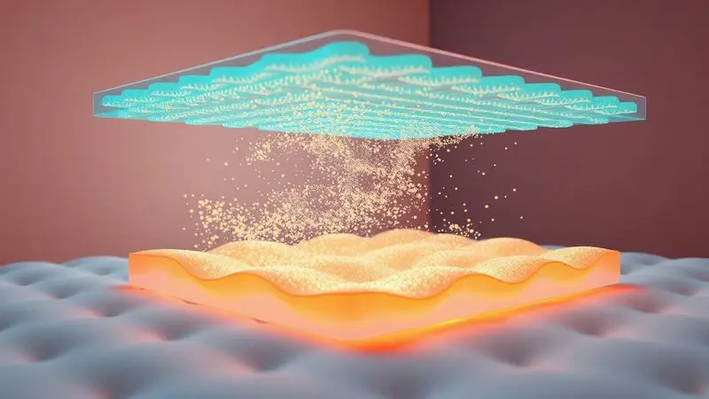
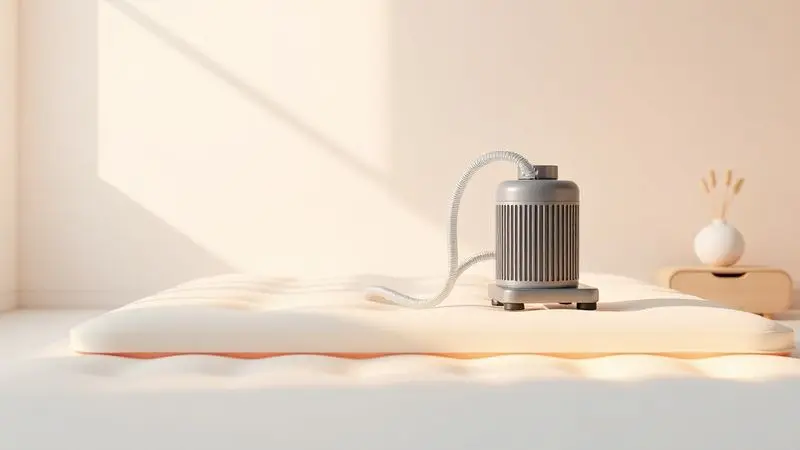

Imagine aquele momento em que você ajusta o travesseiro, tenta encontrar uma posição confortável, mas sabe que a pessoa que cuida passa horas na mesma posição. Cada minuto imóvel é um convite para que a pele, tão delicada, sofra.

Escaras não são apenas feridas, são marcas da imobilidade que trazem dor, custam tempo de recuperação e, acima de tudo, testam sua capacidade de garantir o máximo bem-estar. Esse é o desafio silencioso de quem cuida de alguém acamado.

Mas existe uma resposta tecnológica que transforma essa realidade: o colchão pneumático. Mais do que um equipamento, ele é um aliado que trabalha enquanto todos dormem, oferecendo proteção ativa e conforto digno.

Ao longo deste guia, você vai descobrir não apenas como ele funciona, mas como pode trazer paz de espírito e qualidade de sono de volta para o quarto.

<SummaryList products={frontmatter.top_products} />

## O que é um colchão pneumático e qual sua função principal?

Pense em um colchão que respira e se ajusta. Em vez de espuma ou molas, ele é preenchido com ar, o que permite um controle preciso sobre a firmeza.

Imagine poder ajustar o suporte conforme as necessidades do dia, mais macio para aliviar uma dor, mais firme para oferecer estabilidade. Sua função principal vai muito além do conforto.

Ele existe para ser uma barreira ativa contra as lesões por pressão, aquelas escaras que tanto preocupam.

Ao redistribuir constantemente o peso do corpo, ele impede que pontos de pressão específicos, como os calcanhares e a região sacral, sofram por tanto tempo a mesma carga. É como ter um assistente 24 horas dedicado a preservar a integridade da pele.

## Como funciona o sistema de alívio de pressão alternada?

Mas como essa tecnologia realmente consegue proteger a pele de alguém que não se mexe? O segredo está no coração do colchão: o sistema de alívio de pressão alternada.

Visualize o colchão dividido em dezenas de pequenas câmaras de ar, como um conjunto de almofadas inteligentes. Um pequeno motor (a bomba) controla esse sistema com precisão cirúrgica.

Em ciclos programados, algumas câmaras se esvaziam suavemente, enquanto as adjacentes se enchem. O corpo, então, afunda ligeiramente nas áreas que perderam pressão, e o peso é transferido para as câmaras vizinhas que estão cheias.

Esse movimento contínuo e suave, que o paciente nem percebe durante o sono, é a chave. Ele simula uma mudança de posição passiva. A circulação sanguínea, que poderia ficar comprometida em uma área sob pressão constante, é restabelecida.

A pele recebe oxigênio e nutrientes novamente, e o risco de formação de feridas diminui drasticamente. Não é mágica, é engenharia a serviço do cuidado humano.

## Principais indicações: Quem realmente precisa de um colchão pneumático?

Esta tecnologia é um divisor de águas para situações onde a imobilidade é uma realidade diária. Seu uso é crucial para:

*   **Pacientes acamados por longo prazo:** Seja por condições degenerativas, pós-cirurgias complexas ou estados de saúde que impedem a movimentação.

*   **Pessoas com mobilidade severamente reduzida:** Indivíduos com quadros de paraplegia, tetraplegia ou doenças que limitam drasticamente a capacidade de mudar de posição sozinhos.

*   **Idosos frágeis e com pele muito sensível:** A pele com o avançar da idade perde elasticidade e resistência, tornando-se mais vulnerável a lesões por pressão, mesmo em períodos menores de imobilidade.

*   **Pacientes em recuperação de feridas ou escaras existentes:** O colchão pneumático não só previne novas lesões como cria o ambiente ideal para a cicatrização das já existentes, aliviando a pressão exatamente sobre a área afetada.

Em resumo, sempre que houver um risco elevado de desenvolver escaras devido à pressão prolongada sobre a pele, o colchão pneumático deixa de ser um acessório e se torna um equipamento essencial de saúde.

## 5 Benefícios vitais do uso do colchão pneumático para acamados

### 1. Prevenção e tratamento de escaras (Lesões por Pressão)

Este é o benefício central, a razão de ser do equipamento. Enquanto um colchão comum exerce pressão estática, o pneumático atua dinamicamente. Ao variar constantemente os pontos de apoio, ele elimina a principal causa das escaras: a pressão ininterrupta.

Para quem já possui uma lesão, o sistema permite que a área afetada "descanse" durante os ciclos de alívio, promovendo fluxo sanguíneo e criando condições muito mais favoráveis para a cicatrização.

É a diferença entre gerenciar um risco diário e praticamente neutralizá-lo.

### 2. Estímulo à circulação sanguínea periférica

A má circulação é uma companheira indesejada da imobilidade. Quando o sangue não flui bem, os tecidos ficam mal oxigenados e nutriídos, enfraquecendo a pele e retardando a recuperação.

O movimento alternado das câmaras do colchão age como uma massagem vascular muito suave. Esse estímulo mecânico ajuda a "empurrar" o sangue pelos pequenos vasos das áreas de apoio, combatendo o estase sanguínea.

O resultado é uma pele mais saudável, com melhor capacidade de se defender e se regenerar.

### 3. Alívio de dores musculares e pontos de pressão

Ficar na mesma posição por horas não só prejudica a pele como sobrecarrega músculos e articulações, causando dores e contraturas. O colchão pneumático, ao se moldar de forma mais uniforme ao contorno do corpo, distribui o peso de maneira otimizada.

Pontos críticos como os ombros, quadril e cóccix deixam de suportar carga excessiva. Essa distribuição inteligente alivia a tensão muscular e o desconforto articular, contribuindo para um repouso verdadeiramente reparador e para a manutenção do conforto geral.

### 4. Praticidade para o cuidador e higiene facilitada

O cuidado diário já é desgastante. Um colchão que simplifica a rotina é um alívio direto para o cuidador.

A maioria dos modelos possui capas de tecido impermeável e respirável, que podem ser rapidamente removidas e higienizadas com um pano úmido, um combate eficaz contra umidade, bactérias e odores.

Além disso, a superfície lisa e firme facilita a realização de mudanças posturais e a troca de lençóis. Menos tempo em tarefas de limpeza complicadas significa mais tempo e energia para o cuidado humano e afetivo.

### 5. Conforto térmico e ventilação da pele

O conforto não é só sobre apoio, é também sobre temperatura. Permanecer deitado sobre uma superfície quente e úmida é desconfortável e prejudicial para a pele.

Os materiais dos colchões pneumáticos, especialmente as capas, são desenvolvidos para permitir a passagem de ar. Essa ventilação constante mantém a pele mais seca e na temperatura ideal, prevenindo assaduras e o superaquecimento.

O paciente descansa em um ambiente mais fresco e agradável, o que por si só melhora significativamente a qualidade do sono e a sensação de bem-estar.

## Colchão Pneumático Air Plus Dellamed: O modelo mais recomendado?

<ProductBox 
  title={frontmatter.top_products[0].title} 
  image={frontmatter.top_products[0].image} 
  link={frontmatter.top_products[0].link} 
/>

O Air Plus da Dellamed é frequentemente apontado como referência em lares e instituições. Seu grande trunfo é a eficácia comprovada no manejo de escaras, graças a um sistema de alternância de pressão com ciclos bem calibrados.

A sua construção prioriza a higiene, com materiais que não retêm odores e são de limpeza simples, um ponto crucial para o ambiente do cuidado. A durabilidade é outro forte atrativo.

Uma consideração prática é o espaço: por ser um equipamento robusto, requer uma área adequada ao redor da cama para a bomba e as mangueiras.

No entanto, esse aspecto é amplamente compensado pela segurança que oferece, sendo compatível com a maioria dos dispositivos médicos eletrônicos.

Para quem busca uma solução consolidada, de performance confiável e baixa manutenção, o Air Plus é uma escolha extremamente sólida.

## Colchão Pneumático Anti-Escaras Bio Land: Durabilidade e Eficiência

<ProductBox 
  title={frontmatter.top_products[1].title} 
  image={frontmatter.top_products[1].image} 
  link={frontmatter.top_products[1].link} 
/>

O Bio Land CP100 fala a linguagem da resistência. Construído com PVC de alta espessura (0,3 mm), ele foi feito para durar em uso contínuo. Sua bomba de ar em alumínio reforça essa proposta de longevidade, com uma garantia estendida que transmite confiança.

Em termos técnicos, suas 130 células proporcionam um suporte uniforme para pesos de até 135 kg, e o ciclo de operação de aproximadamente 6 minutos demonstra eficiência na redistribuição da pressão.

Como dispositivo eletromédico certificado, entrega segurança técnica inquestionável. Um ponto de atenção é o nível de ruído da bomba, que pode ser perceptível em ambientes muito silenciosos.

Se a sua prioridade é um equipamento durável, de bom custo-benefício e com suporte de peso generoso para uso intensivo, o Bio Land se apresenta como uma opção muito competente.

## Colchão Pneumático de Células: Quando o modelo 'Ovo' não é suficiente?

<ProductBox 
  title={frontmatter.top_products[2].title} 
  image={frontmatter.top_products[2].image} 
  link={frontmatter.top_products[2].link} 
/>

O popular modelo de células tipo "ovo" é uma excelente solução de entrada e para muitos casos de risco moderado. Sua estrutura com câmaras de ar individuais proporciona um alívio eficaz da pressão.

No entanto, existem cenários onde essa configuração pode encontrar seus limites.

Pacientes com peso corporal mais elevado (acima de 110-120 kg) ou aqueles que necessitam de um suporte muito firme e específico, muitas vezes se beneficiam mais de modelos com células de maior diâmetro ou de tecnologias híbridas que combinam diferentes tipos de espuma.

Da mesma forma, para o tratamento de escaras em estágios mais avançados, pode ser necessária a precisão de sistemas com maior número de células ou com ciclos de alternância mais personalizáveis.

A regra é clara: o modelo "ovo" resolve a maioria dos problemas, mas uma avaliação individual das necessidades do paciente é sempre o melhor caminho para a escolha definitiva.

## Guia Prático: Como usar e instalar o colchão pneumático corretamente?

A instalação é um processo simples, mas seguir os passos certos garante o melhor desempenho e durabilidade. Primeiro, posicione o colchão vazio sobre o estrado da cama, certificando-se de que está centralizado e sem dobras.

Conecte as mangueiras do colchão à bomba de ar, firmemente. Só então ligue a bomba na tomada. Inicie a inflagem, acompanhando a firmeza.

A meta não é deixar o colchão "duro como uma pedra", mas sim com uma firmeza que ofereça suporte adequado, permitindo que o corpo afunde levemente. Consulte o manual para a pressão recomendada para o peso do usuário.

Após o uso, para guardar, esvazie completamente o colchão, dobre-o sem forçar as emendas internas e armazene em local seco. Essa atenção inicial poupa muitos aborrecimentos depois.

## Cuidados e Manutenção: Como higienizar e prolongar a vida útil do motor

O motor é o cérebro do sistema, e alguns cuidados básicos garantem anos de funcionamento. Para limpeza externa da bomba, desconecte-a e use um pano levemente umedecido com água e sabão neutro.

Nunca use álcool, solventes ou produtos abrasivos que possam danificar o plástico ou a pintura. Regularmente, verifique visualmente as mangueiras e conexões.

Se notar que o colchão perde ar mais rápido que o normal, uma solução de água com sabão aplicada sobre as mangueiras e válvulas ajudará a identificar vazamentos (formação de bolhas). Mantenha a bomba em um local arejado, longe do chão úmido e da exposição direta ao sol.

Seguir essas orientações assegura que seu investimento trabalhe por muito tempo, com a mesma eficiência do primeiro dia.

## Comprar ou Alugar: Qual a melhor opção para o seu caso?

Esta decisão se resume ao horizonte de uso. Comprar é uma decisão financeiramente mais inteligente quando o uso é de longo prazo, superior a seis meses.

Você adquire um patrimônio, tem total controle sobre a manutenção e não fica refém de prazos ou disponibilidade de locadoras. Para cuidados domiciliares permanentes ou quadros de saúde que demandarão o equipamento indefinidamente, a compra é o caminho.

Alugar faz sentido para situações transitórias: períodos pós-operatórios definidos (um a três meses), cuidados paliativos de curta duração ou como um período de teste antes do investimento definitivo.

A locação elimina o custo inicial alto e a preocupação com armazenamento futuro. Avalie a previsibilidade da necessidade e o impacto no orçamento familiar para tomar a decisão mais tranquila.

## Perguntas Frequentes sobre Colchões Pneumáticos

### É necessário substituir o colchão comum pelo pneumático?

Necessário é uma palavra forte, mas altamente recomendável se existir risco de escaras. Um colchão comum, mesmo os ortopédicos de alta qualidade, não possui a tecnologia ativa de alternância de pressão.

Eles distribuem o peso, mas não o redistribuem dinamicamente ao longo do tempo. Para uma pessoa com mobilidade zero, a substituição não é um upgrade de conforto, é uma medida ativa de prevenção de um problema de saúde grave.

Pense não em substituir, mas em equipar a cama com a proteção adequada para a condição específica.

### O motor faz muito barulho durante a noite?

Os motores modernos são projetados para serem silenciosos, operando em um ruído comparável a um computador ligado ou a um pequeno ventilador em velocidade mínima. Na maioria dos casos, o som é ofuscado pelo ambiente noturno normal da casa.

O que pode ocorrer é um ruído mais perceptível no momento exato da alternância das câmaras, um leve "sussurro" do ar sendo movimentado.

Para quartos extremamente silenciosos ou pessoas com sono muito leve, modelos com bombas destacáveis permitem posicioná-las mais longe da cabeceira da cama, minimizando qualquer interferência.

### O colchão pneumático gasta muita energia elétrica?

Muito pouco. A bomba não fica ligada constantemente. Ela trabalha em pulsos curtos apenas para repor minúsculas perdas de ar e para realizar os ciclos de alternância. O consumo é similar ao de uma pequena lâmpada LED deixada acesa.

Em média, o custo mensal na conta de luz é irrisório, muitas vezes inferior a alguns reais. A economia que ele proporciona em termos de prevenção de tratamentos médicos complexos para escaras é infinitamente maior do que qualquer consumo elétrico.

## Conclusão

Escolher um colchão pneumático vai além de selecionar um produto. É uma decisão que impacta diretamente a qualidade de vida, a dignidade e a saúde de quem você cuida. É optar pela prevenção em vez da reação, pelo conforto ativo em vez do desconforto passivo.

Cada um dos benefícios, da prevenção de escaras ao alívio para o cuidador, se entrelaça para criar um ecossistema de cuidado mais seguro e menos desgastante.

Entre os modelos disponíveis, desde o robusto Air Plus até o durável Bio Land, existe uma solução técnica para cada necessidade e realidade.

A pergunta final não é se você pode arcar com esse investimento, mas se pode arcar com as consequências de não tê-lo quando necessário.

Ao final do dia, o que está em jogo é a possibilidade de oferecer não apenas um lugar para deitar, mas um verdadeiro porto seguro para o corpo e para a pele, onde o repouso é sinônimo de cura e bem-estar. Comece hoje mesmo a transformar a rotina de cuidados na sua casa.