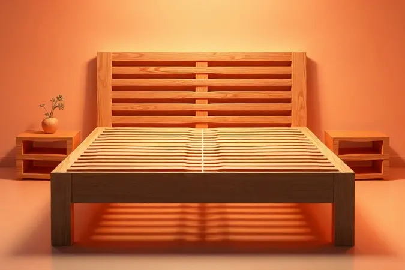

Imagine a cena: você está imerso no CodyCross, quase completando o Grupo 25, quando trava naquela definição sobre parte da cama. A frustração de uma palavra faltando pode ser maior do que parece, porque revela quanto desconhecemos sobre itens que usamos todos os dias.

Essa peça que você procura não é apenas uma resposta de jogo - ela é o guardião silencioso do seu sono, o que separa noites revigorantes de manhãs cheias de dores.

<SummaryList products={frontmatter.top_products} />

## Resposta para CodyCross: Parte da cama onde se coloca o colchão

A resposta é "estrado". Mas essa palavra simples esconde uma revolução no seu descanso. Pense no estrado como o co-piloto do seu colchão, aquele parceiro que garante que ele desempenhe seu papel com excelência durante anos.

Sem esse apoio estratégico, o melhor colchão do mundo perde sua magia, como um violino afinado tocado sobre uma superfície irregular.

## O que é o Estrado e qual sua função real na cama?

Vamos além da definição técnica. O estrado é o sistema de suporte que decide se seu colchão vai durar cinco anos ou quinze. Sua função principal parece simples: sustentar.

Mas na prática, ele é um equilibrista que distribui seu peso de forma inteligente, um climatizador que mantém o ambiente respirável para o colchão, e um terapeuta que ajuda sua coluna a manter o alinhamento natural durante o sono.

Quando você escolhe bem essa peça, está investindo na longevidade do seu investimento maior (o colchão) e, consequentemente, na qualidade das suas noites.

## Os Principais Tipos de Estrados e Bases Disponíveis no Mercado

<ProductBox 
  title={frontmatter.top_products[0].title} 
  image={frontmatter.top_products[0].image} 
  link={frontmatter.top_products[0].link} 
/>

Entrar em uma loja de móveis pode parecer desorientador quando você descobre quantas opções existem. Cada tipo de estrado fala uma linguagem diferente com seu corpo e com seu colchão.

Alguns abraçam seus movimentos, outros oferecem firmeza terapêutica, e há até os que transformam seu quarto em um espaço multifuncional.

A escolha certa não é sobre qual é "melhor" no geral, mas sobre qual conversa melhor com suas necessidades particulares, seu tipo de colchão e a dinâmica do seu espaço.

### 1. Estrado de Madeira Tradicional (Ripas)

<ProductBox 
  title={frontmatter.top_products[1].title} 
  image={frontmatter.top_products[1].image} 
  link={frontmatter.top_products[1].link} 
/>

O clássico que conquistou gerações. As ripas de madeira não são apenas pedaços de árvore dispostos horizontalmente; elas são um sistema de mola natural que responde aos seus movimentos durante a noite.

Quando você vira de lado para encontrar aquela posição perfeita, as ripas cedem levemente, distribuindo a pressão como um abraço que se ajusta. Esse jogo de flexibilidade é o que torna essa opção tão confortável para muitos. E o espaço entre as ripas?

É a respiração do seu colchão, impedindo que a umidade do seu corpo vire uma incubadora para ácaros e fungos.

Um detalhe crucial: esse diálogo entre ripas e colchão precisa ser harmonioso. Colchões muito delicados podem não gostar da pressão pontual das ripas, então a compatibilidade é chave.

Para quem busca a sensação tradicional com um toque de adaptabilidade natural, as ripas oferecem um equilíbrio histórico entre suporte e conforto.

### 2. Base Box ou Sommier: A evolução do suporte

<ProductBox 
  title={frontmatter.top_products[2].title} 
  image={frontmatter.top_products[2].image} 
  link={frontmatter.top_products[2].link} 
/>

Aqui, funcionalidade e estética se dão as mãos. A Base Box é a praticidade personificada - muitas vezes com rodízios que transformam a limpeza debaixo da cama de um martírio em um gesto simples.

Já imaginou mover toda a cama para pegar aquela meia que rolou para o fundo, com o esforço de empurrar uma cadeira?

As versões com baú fazem ainda mais: resolvem o dilema do armazenamento em quartos compactos, guardando edredons, roupas de cama ou até malas sem ocupar um centímetro a mais do seu precioso espaço.

O Sommier eleva a proposta para um patamar de design integrado. Não é apenas suporte; é parte da decoração, uma peça que completa o visual do quarto. As gavetas embutidas são como segredos elegantes, espaços ocultos que organizam sua vida sem comprometer a estética.

Sim, essa sofisticação tem um custo maior, mas quando você valoriza tanto o conforto quanto a harmonia visual do seu refúgio pessoal, esse investimento faz todo o sentido.

### 3. Estrados Articulados e Motorizados

<ProductBox 
  title={frontmatter.top_products[3].title} 
  image={frontmatter.top_products[3].image} 
  link={frontmatter.top_products[3].link} 
/>

Bem-vindo ao futuro do descanso personalizado. Esses estrados transformam sua cama em um ambiente terapêutico sob demanda. Acordou com aquela tosse chata que piora deitado? Um toque no controle eleva sua cabeça para a posição ideal.

Voltou da corrida com as pernas pesadas? Elevá-las levemente melhora a circulação como uma massagem suave.

Para quem lida com refluxo, problemas respiratórios ou simplesmente adora ler na cama na posição perfeita, essa tecnologia não é luxo - é qualidade de vida mensurável.

O investimento é significativo, e é verdade, mas quando você considera que passa aproximadamente um terço da vida dormindo, equipar esse tempo com soluções que respondem às necessidades do seu corpo pode ser uma das decisões mais inteligentes para seu bem-estar a longo prazo.

## Por que o Estrado é fundamental para a saúde do seu colchão?

Pense no seu colchão como um atleta de elite e no estrado como o personal trainer que o mantém em forma. Sem o treinador adequado, mesmo o atleta mais talentoso desenvolve vícios de postura, desgastes assimétricos e perde performance.

O estrado faz exatamente esse trabalho preventivo: distribui as cargas uniformemente, evitando que certas áreas do colchão trabalhem horas extras enquanto outras quase não são acionadas.

Mas há uma função ainda mais crucial: a respiração. Durante a noite, seu corpo elimina umidade através da respiração e transpiração.

Sem ventilação adequada, toda essa umidade fica presa, criando o ambiente perfeito para ácaros, fungos e aquela sensação abafada que ninguém merece.

Um bom estrado mantém o ar circulando, como se seu colchão respirasse junto com você, garantindo que cada manhã você acorde em um ambiente seco e saudável.

## Sinais de que está na hora de trocar o suporte do seu colchão

Seu corpo é o melhor detector de problemas com o estrado. Acordar com aquela dor nas costas que some durante o dia não é normal - é um sinal de alerta. O ranger ao se virar na cama não é característica de móvel vintage; é o grito de ajuda de uma estrutura cansada.

Quando você sente que está "afundando" mais em certas áreas, como se a cama tivese desenvolvido uma cratera personalizada para seu corpo, isso significa que o suporte perdeu sua capacidade de distribuição.

Outro teste simples: coloque um nível sobre o colchão. Se ele não ficar plano, seu estrado pode estar deformado. Esses sinais não são apenas sobre conforto; são sobre economia.

Um estrado comprometido acelera o desgaste do colchão, fazendo com que você precise trocar ambos muito antes do previsto. Reconhecer esses alertas cedo pode economizar centenas ou milhares de reais.

## Como escolher o estrado ideal para o seu peso e tipo de colchão

A combinação perfeita segue uma lógica simples: o estrado e o colchão devem ser parceiros, não adversários. Comece pelo seu peso - não como uma questão estética, mas de física pura.

Pessoas com mais massa corporal precisam de estruturas mais robustas, com maior capacidade de carga e distribuição. O inverso também é verdadeiro: estruturas muito rígidas para corpos mais leves podem criar pontos de pressão desconfortáveis.

Agora, observe o diálogo com seu colchão. Colchões de espuma densa preferem bases mais sólidas para evitar deformações por pontos de pressão.

Colchões de molas, especialmente os mais tradicionais, anseiam por ventilação abundante para manter suas estruturas metálicas livres da oxidação que a umidade traz.

Sempre verifique as recomendações do fabricante - eles sabem como sua criação deve conversar com diferentes tipos de suporte.

## FAQ: Outras dúvidas comuns sobre o CodyCross Grupo 25 e Mobiliário

O valor do estrado realmente influencia tanto na qualidade do sono? Absolutamente. A diferença entre um estrado básico e um de qualidade superior não está apenas na durabilidade, mas na precisão do suporte.

Estruturas mais bem elaboradas distribuem peso de forma mais inteligente, criando uma base verdadeiramente plana para o colchão trabalhar.

Preciso trocar o estrado quando troco de colchão? Nem sempre, mas é o momento ideal para avaliar.

Se seu estrado atual tem mais de 7 anos, sobreviveu a um colchão inteiro e mostra sinais de desgaste, investir no conjunto novo garante que seu colchão recém-chegado terá o parceiro ideal desde o primeiro dia.

Posso usar qualquer estrado com colchão de casal? Aqui, a uniformidade é crucial. Estrados de casal precisam ter suporte central adicional para evitar que o "vale" se forme no meio da cama, aquela tendência de ambos rolaram para o centro.

Verifique se o modelo escolhido tem reforço adequado para o tamanho.

Quanto tempo dura um bom estrado? Com cuidados adequados (limpeza regular, evitar umidade excessiva e sobrecarga), um estrado de qualidade pode durar de 10 a 15 anos, acompanhando dois ou até três colchões ao longo de sua vida útil.

## Conclusão

Da busca por uma resposta no CodyCross à descoberta de como transformar suas noites de sono, você percorreu um caminho que vai muito além do mobiliário.

O estrado deixou de ser apenas uma palavra cruzada para se revelar como o arquiteto secreto do seu descanso, a peça que decide se suas horas na cama serão de recuperação ou de compensação por um suporte inadequado.

Escolher o estrado certo não é sobre seguir tendências ou optar pelo mais caro. É sobre escutar seu corpo, entender as necessidades do seu colchão e reconhecer que o conforto verdadeiro vem de uma base sólida - literalmente.

Cada detalhe, da ventilação entre as ripas à firmeza da base, contribui para um ecossistema de descanso onde seu corpo pode realmente desligar, reparar e renovar.

Agora que você domina não apenas a resposta do jogo, mas a ciência por trás dela, sua próxima decisão de mobiliário será diferente. Você não estará apenas comprando um suporte para colchão; estará investindo na qualidade das suas próximas milhares de noites de sono.

E isso, definitivamente, não é apenas mais uma peça do quebra-cabeça - é o alicerce do seu bem-estar diário.