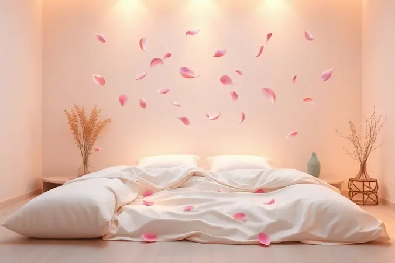

Você abre os olhos e o dia já começa a correr na sua mente: compromissos, prazos, aquela mensagem que precisa responder. Enquanto isso, sua cama está ali, desarrumada, um pequeno caos que testemunhou sua noite.

Muitos pensam que arrumá-la é perda de tempo, já que será desfeita novamente. Mas e se eu te disser que esses dois minutos podem ser o segredo para transformar seu dia inteiro?

Este hábito minúsculo é mais que organização, é a sua primeira vitória, um ato de disciplina silenciosa que prepara sua mente para conquistas maiores.

Vamos descobrir como essa rotina simples se torna um divisor de águas para sua saúde mental, produtividade e até mesmo para a qualidade do seu sono.

<SummaryList products={frontmatter.top_products} />

## O Poder da Primeira Vitória: A Psicologia por Trás de Arrumar a Cama

Arrumar a cama ao acordar não é apenas uma tarefa doméstica, é um ritual poderoso que programa seu cérebro para o sucesso. Imagine: você mal saiu do quarto e já completou algo.

Essa sensação de realização imediata funciona como um gatilho mental, criando um impulso positivo que se espalha para outras áreas do seu dia.

Quando seu ambiente começa organizado, sua mente tende a seguir o mesmo caminho, encontrando mais clareza para tomar decisões e focar nas tarefas importantes.

Esse pequeno gesto se torna a âncora da sua rotina matinal, uma afirmação silenciosa de que você está no controle, influenciando seu humor e disposição muito além das paredes do quarto.

## 8 Motivos Irrefutáveis para Arrumar a Cama Todos os Dias

Essa prática diária vai muito além da estética. Ela é um investimento em você mesmo, com retornos que se manifestam ao longo de todo o dia. Vamos explorar os benefícios que transformam minutos em mudanças reais.

### 1. Estimula a Autodisciplina e Cria Hábitos Positivos

Como você começa o dia geralmente define seu tom. Ao arrumar a cama, você não está apenas organizando lençóis, está exercitando seu músculo da disciplina antes mesmo do café. Essa pequena vitória matinal cria um efeito dominó.

Seu cérebro registra: "consegui cumprir isso, posso cumprir o próximo". Essa rotina transforma uma simples ação em um hábito estrutural, construindo uma base de consistência que se reflete em projetos maiores, prazos e metas pessoais.

É a sua versão mais disciplinada se manifestando primeiro no quarto, para depois conquistar o mundo.

### 2. Reduz o Estresse e a Ansiedade Visual no Quarto

Seu cérebro processa constantemente o ambiente ao seu redor. Um quarto desorganizado, com a cama desfeita, envia sinais sutis de caos e tarefas incompletas. Ao arrumá-la, você dá um presente ao seu sistema nervoso: ordem.

Seus olhos encontram linhas retas, superfícies alinhadas, e isso traduz em uma sensação de calma. Esse espaço organizado se torna um refúgio visual, diminuindo a bagagem mental antes mesmo de você enfrentar o trânsito ou a caixa de entrada do e-mail.

É como permitir que seu cérebro respire fundo antes do dia começar de verdade.

### 3. Melhora Imediatamente a Sua Produtividade Diária

A produtividade não começa na sua mesa de trabalho, começa na sua mentalidade. Aquele senso de realização que você sente após arrumar a cama é combustível psicológico. Ele prepara sua mente para o modo "fazer", criando um momentum que você leva para outras tarefas.

Além do benefício mental, o ambiente organizado elimina uma distração visual. Em vez de olhar para uma cama desarrumada e sentir aquela pontada sutil de "preciso resolver isso", sua atenção fica livre para focar no que realmente importa.

Você está literalmente preparando o palco para um dia mais focado.

### 4. Melhora a Qualidade do Sono e o Relaxamento Noturno

O ritual noturno começa à tarde. Quando você volta para casa e encontra a cama arrumada, seu cérebro já começa a associar aquele espaço com descanso e ordem. À noite, deitar em lençóis esticados, sem rugas ou cobertores embolados, é um convite físico para o relaxamento.

Cria uma transição clara entre a agitação do dia e a paz da noite. Seu subconsciente entende a mensagem: aqui é um local de repouso, não de trabalho ou preocupações.

Essa associação mental pode ser a diferença entre uma noite de reviravoltas e um sono profundo e reparador.

### 5. Higiene e Saúde: Como Evitar o Acúmulo de Ácaros e Alergias

<ProductBox 
  title={frontmatter.top_products[0].title} 
  image={frontmatter.top_products[0].image} 
  link={frontmatter.top_products[0].link} 
/>

Seu colchão e lençóis acumulam naturalmente umidade do seu corpo durante a noite. Embora exista o argumento de "ventilar" a cama deixando-a desarrumada por um tempo, arrumá-la regularmente (especialmente com lençóis limpos) é uma barreira poderosa contra ácaros.

Esses micro-organismos adoram ambientes quentes e úmidos para se proliferar. Manter a cama arrumada, combinado com a lavagem semanal dos lençóis em água quente, transforma seu quarto em um território hostil para os alérgenos.

É uma defesa silenciosa contra espirros, coceiras e noites mal dormidas por conta de alergias.

### 6. Transforma a Estética do Quarto em um Refúgio Agradável

<ProductBox 
  title={frontmatter.top_products[1].title} 
  image={frontmatter.top_products[1].image} 
  link={frontmatter.top_products[1].link} 
/>

Seu quarto deve ser seu santuário, não um depósito. Uma cama arrumada é a peça central que define todo o espaço. Instantaneamente, o ambiente ganha uma aura de cuidado e tranquilidade.

Tornase um local para o qual você quer voltar, um canto visualmente pacífico em meio ao caos da vida. Esse refúgio estético tem um poder terapêutico.

Investir em um enxoval que você ama ver (lençóis com textura agradável, uma colcha bonita) torna a prática da arrumação não uma obrigação, mas um cuidado consigo mesmo, um ato de criar beleza no seu próprio espaço.

### 7. Preserva a Durabilidade do Colchão e da Roupa de Cama

Seu investimento em um bom colchão e roupas de cama de qualidade merece proteção. A arrumação diária, ao manter os lençóis esticados e organizados, previne o desgaste prematuro por fricção e emaranhamento. Ajuda a distribuir a tensão de forma mais uniforme.

Além disso, reduz a acumulação de partículas de poeira e sujeira que, a longo prazo, podem degradar os tecidos. São apenas alguns minutos por dia que podem adicionar anos à vida útil desses itens essenciais, garantindo que seu conforto não se deteriore rapidamente.

### 8. Proporciona a Sensação de Acolhimento ao Voltar para Casa

Após um dia cheio de demandas, reuniões e imprevistos, chegar em casa é um momento sagrado. Agora, imagine abrir a porta do quarto e encontrar um espaço ordenado, com a cama perfeitamente feita. É um abraço visual. Instantaneamente, a atmosfera muda.

A bagagem mental do dia começa a se dissipar porque o ambiente comunica paz, controle e cuidado. Essa sensação de acolhimento prepara o terreno para uma noite verdadeiramente relaxante. É o seu futuro eu agradecendo ao seu eu matinal por ter preparado esse porto seguro.

## Guia Prático: Como Arrumar a Cama em Menos de 2 Minutos

Agora que você está convencido dos "porquês", vamos ao "como" que não toma seu tempo. Esqueça procedimentos complexos. Em menos de dois minutos, você transforma o caos em ordem: (1) Estique o lençol de baixo, puxando bem as pontas para que fique justo.

(2) Jogue o lençol de cima ou a colcha, alisando com as mãos para eliminar rugas grandes. (3) Organize as almofadas decorativas (se tiver) de forma simples. (4) Dê um último ajuste para que tudo pareça alinhado. Pronto.

A mágica não está na perfeição, está na ação consistente. Esse ritual rápido é o segredo para colher todos os benefícios que acabamos de explorar.

## Itens Essenciais para uma Cama Confortável e Fácil de Arrumar

<ProductBox 
  title={frontmatter.top_products[2].title} 
  image={frontmatter.top_products[2].image} 
  link={frontmatter.top_products[2].link} 
/>

A facilidade da arrumação começa com os elementos certos. Um bom colchão (seja de espuma ou molas) é sua base fundamental. Sobre ele, um protetor impermeável não só defende contra acidentes e ácaros como cria uma superfície mais fácil de limpar.

Os travesseiros merecem atenção especial. Escolha modelos que apoiem seu pescoço de acordo com sua posição de dormir (de lado, barriga para cima).

Para os lençóis, o algodão é rei pela respirabilidade, mas blends com um pouco de poliéster podem ser mais resistentes às rugas e secarem mais rápido. O truque é montar uma cama com peças que você ama tocar, porque isso transforma a arrumação de tarefa em prazer.

### O Papel dos Travesseiros na Organização e no Conforto

<ProductBox 
  title={frontmatter.top_products[3].title} 
  image={frontmatter.top_products[3].image} 
  link={frontmatter.top_products[3].link} 
/>

Mais do que apoio para a cabeça, travesseiros são elementos de design e conforto que definem o visual da cama arrumada. Eles garantem o alinhamento da sua coluna, prevenindo aquela rigidez matinal no pescoço.

Um travesseiro de espuma viscoelástica, por exemplo, se molda à sua forma, oferecendo suporte personalizado. Enquanto isso, modelos de poliéster são práticos e hipoalergênicos.

Organizá-los de forma harmoniosa ao fazer a cama (um na frente do outro, inclinados) dá aquele toque final de hotel que convida ao descanso, fechando o ciclo visual que começou com os lençóis esticados.

## Mitos e Verdades sobre Arrumar a Cama Imediatamente ao Acordar

É comum ouvir que deixar a cama desfeita ajuda a "arejar" os lençóis. Embora deixar a cama aberta por meia hora possa ajudar na evaporação da umidade, a arrumação posterior continua sendo crucial para o controle de ácaros e para a organização mental.

Outro mito persistente é: "Para que arrumar se vou deitar nela de novo?" Essa lógica ignora o poder psicológico do ambiente. Você não toma banho pensando "vou me sujar de novo", você toma para se sentir renovado.

Da mesma forma, arrumar a cama renova seu espaço e sua mentalidade para as horas de vigília, independentemente do que a noite trará.

## Perguntas Frequentes sobre Hábitos de Organização no Quarto

"Isso realmente faz tanta diferença?" Faz. A diferença é psicológica e ambiental. É um sinal claro que você manda a si mesmo sobre quem está no comando do seu dia.

"Com que frequência devo fazer uma limpeza mais profunda?" Além da arrumação diária da cama, reserve 15 minutos por semana para uma organização geral do quarto (passar um pano, aspirar, reorganizar a mesa de cabeceira). "E se eu não tiver tempo?" Você tem dois minutos.

O desafio não é tempo, é prioridade. Quando você entende que esses dois minutos são um investimento no seu bemestar diário, eles deixam de ser "mais uma coisa" e se tornam a primeira coisa.

## Conclusão

Arrumar a cama é muito mais do que uma tarefa doméstica. É um ato de autocuidado, uma declaração de intenções para o dia que se inicia e um presente de tranquilidade para a noite que virá.

Começa como um hábito pequeno, quase insignificante, mas seu poder está justamente nisso: na consistência das pequenas vitórias.

Esses dois minutos matinais são o alicerce sobre o qual você pode construir dias mais focados, noites mais tranquilas e uma sensação duradoura de controle sobre seu ambiente e, por extensão, sobre sua vida.

A jornada para uma rotina mais produtiva e uma mente mais organizada não exige mudanças radicais. Ela começa com um gesto simples: esticar os lençóis, alisar a colcha e conquistar sua primeira vitória do dia. Experimente por uma semana e sinta a transformação.

Seu futuro eu, mais tranquilo e produtivo, já está agradecendo.