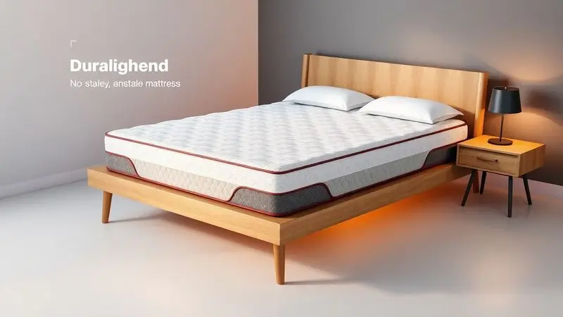

Encontrar o colchão ideal é o primeiro passo para garantir noites de sono reparadoras e mais qualidade de vida.

Se você está pesquisando sobre o Colchão Ouro Spring da Ortobom, sabe que ele é um dos modelos mais comentados do mercado brasileiro, mas será que ele realmente se adapta às suas necessidades?

Neste guia completo, vamos analisar detalhadamente as tecnologias, o nível de conforto e a durabilidade deste modelo premiado.

Você vai descobrir exatamente o que as molas Superpocket podem fazer pela sua coluna e se o investimento neste colchão vale a pena para o seu perfil.

<SummaryList products={frontmatter.top_products} />

## O que é o Colchão Ouro Spring da Ortobom?

Quando você se deita após um dia cansativo, o que mais deseja é um abraço que alinha sua coluna e dissolve as tensões acumuladas. O Colchão Ouro Spring oferece precisamente isso através de seu sistema de molas ensacadas individualmente.

Cada uma dessas molas trabalha como um pequeno profissional de fisioterapia, adaptando-se aos contornos do seu corpo para oferecer o suporte ideal.

Não é apenas uma estrutura física, mas uma experiência de cuidado que se prolonga por todas as camadas de espuma, criando um acolhimento que minimiza qualquer transferência de movimento.

Para quem dorme de lado, de costas, ou alterna entre posições, essa flexibilidade promete transformar suas noites em verdadeiros retiros de recuperação.

## Análise Detalhada: Colchão Ortobom Ouro Spring Pocket

<ProductBox 
  title={frontmatter.top_products[0].title} 
  image={frontmatter.top_products[0].image} 
  link={frontmatter.top_products[0].link} 
/>

O verdadeiro diferencial deste modelo está em casar tecnologia inteligente com o conforto que você sente na pele.

As molas ensacadas individualmente garantem que, mesmo quando seu parceiro se levanta às 5h para trabalhar, você continua imerso em seu próprio universo de sono, sem perturbações.

O sistema "No Turn" é um presente para quem sempre procrastinou a tarefa de virar o colchão, simplificando os cuidados diários.

Vale observar que alguns consumidores relataram insatisfações, especialmente em relação ao afundamento na região lombar após pouco tempo de uso. A marca oferece uma garantia de 5 anos, mas alguns casos revelaram dificuldades na efetivação desse suporte.

Mesmo considerando esses pontos, a Ortobom mantém sua reputação pela qualidade, tornando este colchão uma opção válida se você busca uma fusão entre tecnologia avançada e o design que transforma seu quarto em um santuário do repouso.

### Tecnologia de Molas Superpocket (Ensacadas Individualmente)

Imagine um sistema onde cada mola possui sua própria cápsula de independência. Isso é precisamente o que a tecnologia Superpocket oferece: liberdade de movimento personalizada.

Quando você se acomoda, elas respondem como um coletivo de profissionais, distribuindo o peso de forma inteligente para manter sua coluna no perfeito alinhamento anatômico.

O resultado é uma sensação de suporte que parece conversar com seu corpo, adaptando-se a cada curva e contorno. Para casais, essa independência se traduz em paz: você não sente aqueles micro-movimentos que costumam interromper o sono profundo.

### Revestimento em Malha Belga e Fibras de Bambu

O toque inicial já revela o cuidado: a malha belga oferece uma maciez que parece um convite ao relaxamento. Sua durabilidade não é apenas uma promessa técnica, mas uma garantia de que esse convite se repetirá por anos.

As fibras de bambu, por sua vez, trabalham como um sistema de climatização pessoal. Em vez de enfrentar aquela sensação de calor que sufoca seu sono, elas regulam a temperatura mantendo um frescor constante.

Isso não é apenas respirabilidade, é a liberdade de dormir sem aquela necessidade constante de ajustar o cobertor.

### Tratamento Antiacaro, Antifungo e Antialérgico

Para quem convive com alergias respiratórias, esta tecnologia é um escudo invisível. O material utilizado cria um ambiente onde ácaros e fungos encontram resistência, reduzindo aqueles sintomas que muitas vezes roubam o sono reparador.

Não mais aquela tosse seca que te acorda às 3h da madrugada, nem aquela congestão que transforma a noite em um desafio.

Além do benefício direto para sua saúde, essa proteção prolonga a vida útil do colchão, defendendo suas camadas internas contra a degradação que a umidade e microorganismos podem causar.

## Benefícios da Certificação Inmetro e Selos de Qualidade

Quando você investe em um colchão, não está apenas comprando um produto, está adquirindo uma promessa de segurança e conforto que deve durar anos. A certificação Inmetro e os selos de qualidade funcionam como testemunhas dessa promessa.

Eles confirmam que cada componente passou por testes rigorosos de resistência, durabilidade e características físicas, transformando sua decisão em uma escolha fundamentada.

Além da confiança imediata, esses certificados frequentemente acompanham garantias estendidas, oferecendo uma tranquilidade que vai além da primeira noite de uso.

## Para quem o Ouro Spring é indicado? (Peso e Firmeza)

Versatilidade é a palavra que define este modelo. Ele se adapta como um parceiro de sono que compreende suas necessidades específicas.

Para pessoas com peso entre 70 e 120 kg, o colchão distribui a carga com inteligência, evitando pontos de pressão que podem transformar o descanso em desconforto.

Sua firmeza intermediária oferece o equilíbrio perfeito: suporte suficiente para manter sua coluna alinhada sem sacrificar a suavidade que permite o relaxamento muscular. Não é um colchão que impõe uma experiência, mas um que se ajusta à sua.

## Guia de Tamanhos: Do Solteiro ao King Size

<ProductBox 
  title={frontmatter.top_products[1].title} 
  image={frontmatter.top_products[1].image} 
  link={frontmatter.top_products[1].link} 
/>

Seu espaço pessoal merece um companheiro proporcional. O Ouro Spring oferece essa personalização através de uma variedade que começa no solteiro (88x188 cm), passa pelo casal (138x188 cm), expande-se no queen (158x198 cm) e culmina no king (193x203 cm).

A altura padrão de 31 cm (com versões que chegam a 35 cm) garante a presença visual adequada para qualquer ambiente.

Embora as opções sob medida possam ser limitadas, essa flexibilidade permite que você escolha não apenas um colchão, mas uma dimensão que harmoniza com seu espaço e estilo de vida.

## Vantagens e Desvantagens: O que esperar na prática?

O conforto e suporte são os protagonistas desta experiência. A combinação de firmeza e maciez cria um ambiente onde seu corpo encontra tanto estabilidade quanto acolhimento.

As tecnologias de ventilação trabalham para manter o frescor, permitindo que você mergulhe no sono sem interferências térmicas. Contudo, alguns usuários relatam que, em climas particularmente quentes, a sensação de calor pode persistir.

A durabilidade também pode variar dependendo dos cuidados e do uso específico. No panorama geral, ele se apresenta como uma escolha sólida para quem valoriza qualidade, especialmente quando combinado com condições de uso adequadas.

## Tecnologia No Turn: Dicas de Manutenção e Durabilidade

A tecnologia No Turn transforma a manutenção em uma tarefa quase inexistente. Para garantir que essa facilidade se prolongue por anos, alguns cuidados simples fazem toda diferença.

Mantenha o colchão sobre uma base adequada e permita que ele se areje regularmente, facilitando a evaporação da umidade. Evite pressionar excessivamente as bordas ou criar pontos de impacto constante.

Proteger o colchão com capas específicas não apenas previne manchas, mas cria uma barreira adicional contra agentes externos. Com essa atenção mínima, você prolonga a vida do seu investimento e mantém a qualidade do sono que escolheu.

## Vale a pena comprar o Colchão Ouro Spring? Veredito Final

A resposta depende de como você define "valer a pena". Se busca uma fusão entre tecnologia contemporânea e o conforto que se traduz em noites realmente reparadoras, o Ouro Spring apresenta argumentos sólidos.

Sua capacidade de oferecer estabilidade para a coluna pode ser transformadora para quem enfrenta desconfortos dorsais. A durabilidade prometida pelas tecnologias e materiais sugere um retorno sobre o investimento que se manifesta ao longo dos anos.

Como qualquer decisão relacionada ao conforto pessoal, experimentar antes de comprometer-se é sempre recomendado.

Para quem prioriza qualidade e uma experiência de sono que respeita tanto sua anatomia quanto suas preferências subjetivas, este modelo pode ser o ponto de início de uma nova relação com o descanso.

## Conclusão

Escolher um colchão nunca é apenas sobre comprar um produto; é sobre selecionar o companheiro que vai acompanhar suas horas mais vulneráveis, aquelas onde você se reconstrói após cada dia.

O Colchão Ouro Spring da Ortobom se apresenta como esse potencial companheiro, oferecendo não apenas molas ensacadas e revestimentos tecnológicos, mas uma experiência que conversa diretamente com suas necessidades físicas e emocionais.

Das fibras de bambu que combatem o calor ao tratamento que protege contra alergias, cada elemento trabalha para criar um ambiente onde o sono se torna verdadeiramente reparador.

Se você busca equilíbrio entre firmeza e acolhimento, independência de movimento e adaptação personalizada, este modelo merece sua consideração.

O veredito final, como sempre, reside na combinação entre suas expectativas e a experiência prática, mas como ponto de partida, o Ouro Spring oferece um diálogo tecnológico que vale ser ouvido.

## Perguntas Frequentes sobre o Colchão Ouro Spring Ortobom

A popularidade deste modelo gera naturalmente dúvidas que merecem clarificação. Sua tecnologia de molas ensacadas não apenas oferece firmeza, mas uma adaptação inteligente que distribui o peso de forma equilibrada, como um sistema que compreende sua anatomia.

O revestimento antiderrapante e respirável não é apenas um detalhe técnico, mas um facilitador que mantém o frescor constante durante sua noite.

Quando questionado sobre durabilidade, os materiais escolhidos prometem resistência, mas essa promessa se fortifica quando acompanhada pelos cuidados recomendados.

Cada dúvida reflete uma preocupação legítima sobre um investimento que vai além do financeiro, atingindo diretamente sua qualidade de vida.