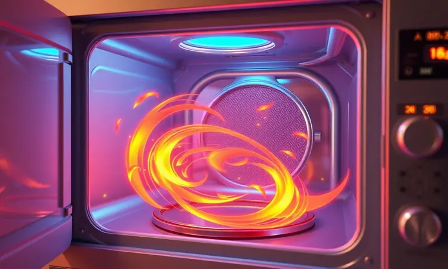
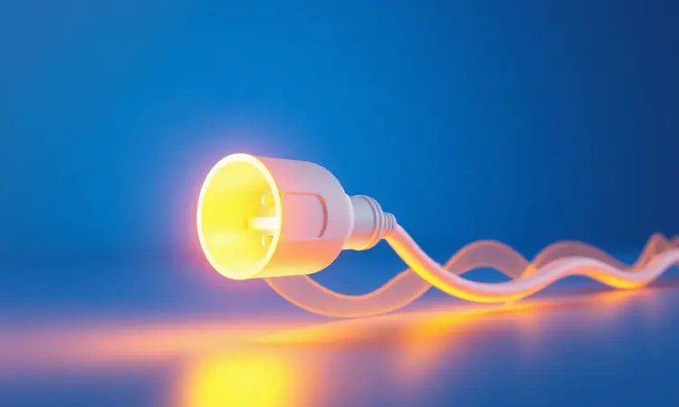

Você já abriu a geladeira, decidiu fazer aquelas batatas crocantes, mas na hora de escolher entre a Air Fryer e o forno elétrico, bateu uma dúvida real: qual deles realmente faz jus à expectativa? A verdade é que essa decisão vai muito além da bancada.

Ela envolve sua rotina, seu bolso e até a textura perfeita que você tanto busca. Vamos mergulhar nessa comparação para que, ao final, você saiba exatamente onde investir seu espaço e sua energia.

<SummaryList products={frontmatter.top_products} />

## Entendendo a Tecnologia: Como funciona a Air Fryer e o Forno Elétrico?

Imagine o funcionamento de uma Air Fryer como um pequeno tornado de calor. O ar quente, gerado por resistências e distribuído por um ventilador poderoso, circula rapidamente ao redor dos alimentos.

Esse movimento intenso é o segredo para cozinhar com pouco óleo, criando aquela crocância que parece ser fritura, mas sem a gordura.

Agora, pense no forno elétrico como um ambiente controlado, onde o calor se expande mais lentamente, aquecendo todo o espaço interno de maneira estável. É como comparar um jato de ar direcionado a um ambiente climatizado.

Ambos têm seu lugar na cozinha, mas a diferença está na velocidade e no resultado final. Um é o especialista em agilidade, o outro, no preparo meticuloso de grandes porções.

## Air Fryer vs. Forno Elétrico: As 7 principais diferenças

Separamos esses dois aparelhos em sete pontos cruciais que vão muito além das especificações técnicas. São experiências que se traduzem em minutos economizados, texturas conquistadas e rotinas transformadas.

### 1. Velocidade de Aquecimento e Tempo de Preparo

Quanto tempo você está disposto a esperar pela sua refeição? Enquanto o forno elétrico precisa de um período de aquecimento que pode testar sua paciência (especialmente em dias de fome urgente), a Air Fryer é como um sprint culinário.

Sua chave é o design compacto: menos espaço para aquecer significa chegar à temperatura ideal em minutos. O resultado? Batatas fritas prontas enquanto você ainda está arrumando a mesa, ou frango assado sem aquela espera que parece eterna.

Essa agilidade transforma a Air Fryer na aliada perfeita para pausas de almoço apertadas ou para quando os filhos chegam famintos da escola.

### 2. Distribuição de Calor e Convecção

Aqui está onde a ciência encontra o sabor. O sistema de convecção da Air Fryer não apenas aquece mais rápido, mas também envolve cada pedaço de comida em calor uniforme.

É como ter um assistente pessoal girando seu alimento continuamente, garantindo que cada lado receba atenção igual. Já no forno elétrico tradicional, o calor vem de cima e de baixo, criando zonas variáveis dentro da câmara.

É preciso rodar a assadeira para evitar que um lado queime enquanto o outro mal esquenta. Essa diferença é palpável quando você morde um alimento crocante por completo, sem encontrar aquela parte mole que sempre frustra.

### 3. Textura, Sabor e Crocância dos Alimentos

Fechar os olhos e ouvir o som de algo crocante sendo partido, essa é a magia que a Air Fryer entrega com consistência. Sua circulação intensa de ar remove a umidade superficial rapidamente, criando uma camada externa dourada que protege o interior suculento.

Já experimentou cenouras que parecem chips, mas ainda mantêm seu sabor doce? Ou frango com pele tão crocante que parece ter sido frito?

O forno elétrico também alcança texturas maravilhosas, especialmente em assados lentos onde os sabores têm tempo para se desenvolver profundamente. Mas para aquela crocância imediata e satisfatória, a Air Fryer é imbatível.

### 4. Capacidade Interna: O dilema do espaço

Este é o momento de honestidade sobre seus hábitos culinários. A Air Fryer é a companheira perfeita para famílias pequenas, solteiros ou casais que valorizam refeições rápidas e porções individuais.

Ela cabe em qualquer canto da bancada e não exige planejamento elaborado.

Agora, se sua casa vive cheia nos finais de semana, com crianças que sempre trazem amigos, ou se você adora preparar um jantar especial para muitos convidados, o forno elétrico é o seu espaço seguro.

Imagine assar um pernil inteiro, várias batatas ao mesmo tempo e ainda um pão de alho para acompanhar. São cenas possíveis apenas com a capacidade generosa de um forno tradicional.

### 5. Versatilidade de Receitas e Utensílios Permitidos

Ambos abrem portas culinárias, mas para universos diferentes. A Air Fryer domina o território das preparações rápidas e saudáveis: desde snacks crocantes até legumes grelhados que mantêm suas cores vibrantes. Ela transforma o simples em especial com facilidade.

Já o forno elétrico é o palco para produções mais elaboradas. Bolos que crescem uniformemente, pães com casca perfeita, lasanhas gratinadas que alimentam uma multidão, ele aceita todas as suas formas, assadeiras e panelas favoritas.

É sobre escolher entre a espontaneidade do dia a dia e a celebração de momentos especiais.

### 6. Precisão de Temperatura e Manutenção do Calor

Você já ajustou o forno para 180°C, mas sentiu que algo não estava certo? A Air Fryer oferece um controle preciso que elimina essas dúvidas. Seu termostato responde rapidamente, mantendo a temperatura estável durante todo o cozimento.

É a diferença entre confiar que seu alimento está sendo preparado exatamente como programado e torcer para que dê certo. O forno elétrico, por outro lado, brilha em receitas de longa duração que precisam de calor constante por horas.

É onde se fazem os cozidos lentos, os pães de fermentação longa e os assados que transformam cortes mais duros em refeições macias e saborosas.

### 7. Facilidade de Limpeza e Manutenção Diária

Após uma refeição deliciosa, ninguém quer encarar uma grande limpeza. A Air Fryer entende essa realidade. Suas partes removíveis vão direto para a máquina de lavar louça ou são enxaguadas rapidamente na pia.

Não há cantos difíceis, nem restos queimados grudados nas paredes. É praticidade que incentiva o uso diário. Os fornos modernos também evoluíram nesse aspecto, com revestimentos antiaderentes e até funções de autolimpeza.

Mas a verdade é que um derramamento de molho ou gordura respingada ainda exige mais atenção. Pense em quantos minutos por semana você está disposto a dedicar à limpeza, essa resposta pode definir sua escolha.

## Qual gasta mais energia: Air Fryer ou Forno Elétrico?

A resposta direta favorece a Air Fryer, mas vamos entender por quê. Enquanto você lê este parágrafo, uma Air Fryer já teria pré-aquecido completamente. Essa rapidez é seu segredo econômico: menos tempo ligada significa menos energia consumida.

### Comparativo de Consumo em kWh e Impacto na Conta de Luz

Vamos aos números: uma Air Fryer média consome entre 0,8 a 1,5 kWh por hora de uso. Um forno elétrico convencional pode variar de 1,5 a 2,5 kWh na mesma hora. Agora, traduza isso para sua rotina.

Se você usa o aparelho três vezes por semana para preparar jantares rápidos, a Air Fryer pode significar uma economia mensal perceptível na conta de luz. A chave está na combinação de menor potência com tempo reduzido de uso.

É como trocar uma lâmpada incandescente por uma LED: você continua iluminando sua cozinha, mas paga menos por isso.

## A Ascensão da Air Fryer Oven: O melhor dos dois mundos?

<ProductBox 
  title={frontmatter.top_products[0].title} 
  image={frontmatter.top_products[0].image} 
  link={frontmatter.top_products[0].link} 
/>

E se você não precisasse escolher? A Air Fryer Oven surgiu exatamente para responder essa pergunta. Imagine ter a crocância característica da Air Fryer com o espaço interno de um forno compacto.

Esses aparelhos híbridos permitem que você assade um frango inteiro enquanto prepara batatas crocantes nas prateleiras superiores. Sim, eles podem levar alguns minutos a mais para pré-aquecer comparados às Air Fryers tradicionais, mas compensam com versatilidade.

A limpeza permanece prática (graças às partes removíveis) e a economia de energia ainda é significativa frente aos fornos tradicionais. Para quem busca um único aparelho que cubra a maioria das necessidades, essa pode ser a solução mais inteligente.

## Qual aparelho escolher de acordo com seu perfil?

A melhor escolha não está nas especificações técnicas, mas na harmonia com seu estilo de vida. Vamos encontrar o aparelho que se adapta à sua realidade.

### Melhor escolha para quem mora sozinho ou casais

Solteiros e casais encontram na Air Fryer um companheiro culinário ideal. Ela responde à agilidade que rotinas corridas exigem: em 20 minutos você tem uma refeição completa, crocante e saudável.

Ocupa o espaço de uma panela média na bancada, facilitando a organização em cozinhas compactas. E quando se trata de limpeza, é tão prática quanto lavar alguns pratos. Você economiza tempo, energia e ainda reduz o consumo de óleo nas preparações.

O forno elétrico, nesse cenário, pode parecer excessivo, como usar um caminhão para ir à padaria da esquina.

### Melhor escolha para famílias grandes (4 ou mais pessoas)

Famílias numerosas vivem em outra escala culinária. Aqui, o forno elétrico se torna indispensável. Imagine preparar o jantar para quatro pessoas ou mais: é preciso capacidade para assar proteínas maiores, acompanhamentos generosos e talvez até uma sobremesa.

O forno permite essa sinfonia de preparações simultâneas. Enquanto o frango assa por baixo, as batatas gratinam por cima e um pão esquenta na prateleira do meio.

A Air Fryer, por mais eficiente que seja, exigiria rodadas sucessivas de preparo, transformando a hora do jantar em uma maratona logística.

### Melhor escolha para quem busca uma alimentação mais saudável

Se sua busca é por refeições mais leves sem abrir mão do sabor, a Air Fryer é sua aliada natural. Ela transforma o conceito de 'fritar' ao usar apenas o ar quente para criar texturas crocantes. Isso significa até 80% menos óleo comparado à fritura tradicional.

O resultado? Alimentos que mantêm seus nutrientes, sem aquele peso no estômago após a refeição. Além da redução de gordura, o tempo reduzido de cozimento também preserva vitaminas que se perdem em preparações prolongadas.

O forno elétrico também permite cozimentos saudáveis, mas a Air Fryer coloca a saúde como prioridade no seu design fundamental.

## Melhores Modelos de Air Fryer para comprar em 2024

<ProductBox 
  title={frontmatter.top_products[1].title} 
  image={frontmatter.top_products[1].image} 
  link={frontmatter.top_products[1].link} 
/>

Com tantas opções no mercado, destacamos aquelas que realmente fazem diferença na prática:

*   **WAP Grand Family 5,2L** - Para quem precisa de espaço sem comprometer a praticidade, seu cesto e grelha removíveis são um convite ao uso diário.

*   **Philips Walita Airfryer Série 2000 XL Digital 6,2L** - A tecnologia Rapid Air garante resultados consistentes, perfeita para quem não aceita meio termo na crocância.

*   **Oster OFRT520 4,6L** - Simplicidade que funciona: timer intuitivo e potência que entrega o prometido sem complicações.

*   **Cosori CP158-AF** - Treze programas pré-definidos que transformam até iniciantes em chefs de Air Fryer.

*   **Mondial AFO-12L** - Para quem quer experimentar a versatilidade híbrida antes de se comprometer com um forno tradicional.

## Melhores Modelos de Forno Elétrico de Bancada e Embutir

<ProductBox 
  title={frontmatter.top_products[2].title} 
  image={frontmatter.top_products[2].image} 
  link={frontmatter.top_products[2].link} 
/>

Se sua decisão pende para o forno, estes modelos merecem sua atenção:

*   **Electrolux 80L Efficient com PerfectCook360** - Para cozinhas que são palco de grandes jantares, sua capacidade generosa e cozimento uniforme justificam o espaço que ocupa.

*   **Fischer Fit Line Embutir 44L** - Prova de que tamanho não é tudo: compacto o suficiente para cozinhas menores, mas eficiente como modelos maiores.

*   **Philco PFE44P** - Bancada versátil que não exige obra, perfeito para quem aluga ou prefere flexibilidade na disposição da cozinha.

*   **Mondial Grand Family II 52L** - Nome que entrega o prometido: espaço para reunir a família inteira ao redor de refeições caseiras.

## FAQ: Perguntas frequentes sobre Air Fryer e Forno

Perguntas práticas que surgem quando a teoria encontra a realidade da sua cozinha.

### Air fryer pode substituir o forno elétrico totalmente?

Depende do que 'totalmente' significa para você. Se suas refeições giram em torno de porções individuais, preparações rápidas e a crocância é prioridade, a Air Fryer pode sim ser sua única fonte de calor.

Agora, se seus domingos envolvem assar um bolo para a família, preparar lasanha para congelar ou receber amigos para um jantar especial, você sentirá falta do espaço e versatilidade do forno.

A verdade é que eles se complementam mais do que competem, cada um excelente em seu território.

### Pode colocar papel alumínio ou vidro na Air Fryer?

Sim, mas com atenção aos detalhes. O papel alumínio pode ser usado para forrar o fundo da cesta ou embrulhar alimentos que soltam líquidos, desde que você evite bloquear as aberturas de circulação de ar (essenciais para o funcionamento correto).

Vidro refratário é seguro, mas deve ser específico para altas temperaturas. A regra de ouro: sempre deixe espaço para o ar circular livremente. É como usar um guarda-chuva em um dia ventoso, você precisa posicioná-lo corretamente para que funcione.

## Conclusão

Ao final desta jornada, você percebe que a escolha entre Air Fryer e forno elétrico é muito mais pessoal do que técnica. Não se trata apenas de watts ou litros, mas de como esses números se traduzem na sua rotina.

A Air Fryer é a resposta para agilidade, saúde e praticidade em espaços compactos. Ela transforma o cozinhar em um ato rápido e satisfatório, especialmente quando o tempo é seu bem mais precioso.

O forno elétrico, por sua vez, é o palco para momentos que merecem tempo de preparo, capacidade para compartilhar e versatilidade para criar memórias ao redor da mesa.

Pense na sua cozinha como um estúdio e nos aparelhos como suas ferramentas. Qual deles vai permitir que você crie as experiências culinárias que realmente importam para seu estilo de vida? Se sua resposta envolve velocidade e crocância diária, siga para a Air Fryer.

Se envolve capacidade para reunir pessoas e preparar refeições completas, o forno elétrico espera por você. E se você busca um equilíbrio entre os dois mundos, a Air Fryer Oven pode ser justamente o ponto médio que sua cozinha precisa.

Agora, com clareza sobre o que cada um oferece, sua próxima refeição já começa com a certeza de estar usando a ferramenta certa para o resultado desejado.