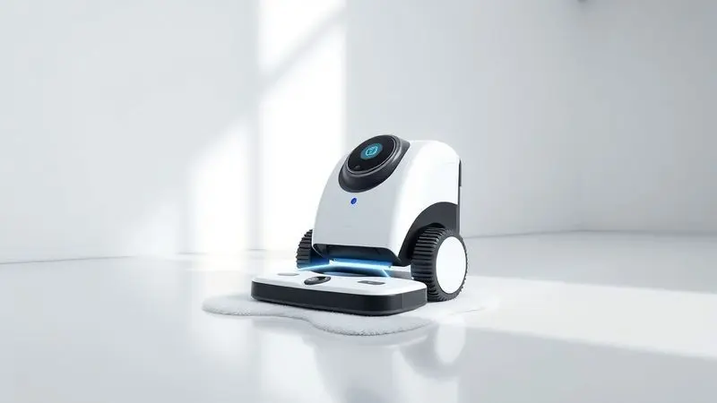
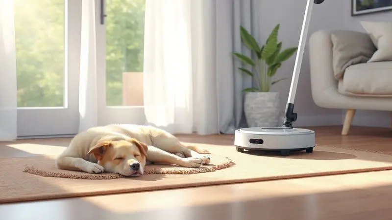
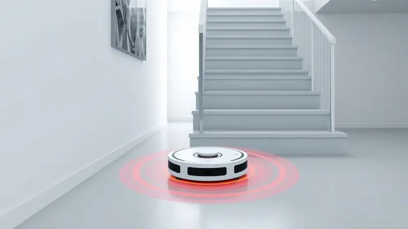

Manter a casa limpa não precisa ser um sacrifício diário, e os robôs aspiradores da WAP se tornaram os favoritos de quem busca praticidade sem gastar uma fortuna.

Mas com modelos tão parecidos visualmente, surge aquela dúvida que tira o sono: qual a real diferença entre o W90 e o W100? Você está prestes a descobrir não apenas números e especificações, mas como cada detalhe técnico se traduz no seu dia a dia.

Vamos analisar desde a autonomia da bateria até o desempenho em diferentes pisos, para que [sua escolha](/como-escolher-robo-aspirador/) seja tão inteligente quanto a tecnologia que está avaliando.

<SummaryList products={frontmatter.top_products} />

## WAP W90 vs W100: Qual o Melhor Robô Aspirador para Sua Casa?

Imagine chegar em casa após um dia cansativo e encontrar seus pisos impecáveis, sem ter levantado um dedo. Essa é a promessa que ambos os modelos entregam, mas de maneiras distintas.

O W90 é como aquele amigo confiável que chega, faz seu trabalho com eficiência em espaços compactos e sai discretamente. Perfeito para quem busca praticidade sem complicações.

Já o W100 é o assistente pessoal que aprende seus hábitos. Com [programação de limpeza](/como-usar-o-aspirador-robo-wap/) e potência extra, ele transforma a tarefa doméstica em uma rotina autônoma.

A escolha se resume a uma questão simples: você quer um ajudante funcional ou um parceiro de limpeza que antecipe suas necessidades?

## Introdução aos Modelos de Entrada da WAP: O que eles têm em comum?

Antes de mergulharmos nas diferenças, vamos reconhecer o terreno comum. Ambos os modelos nasceram da mesma filosofia: democratizar a automação doméstica.

Eles compartilham sensores inteligentes que mapeam seu ambiente, evitam tombos em degraus e navegam por diferentes superfícies com a confiança de quem conhece cada canto da casa.

Pense neles como duas versões do mesmo sonho: liberdade da faxina diária. Seja em pisos duros ou carpetes, ambos garantem que você recupere tempo precioso, horas que antes eram dedicadas a vassouras e rodos agora podem ser investidas no que realmente importa.

## Ficha Técnica Comparativa: WAP W90 vs WAP W100 lado a lado

Os números contam uma história, mas não toda a história. Vamos decifrar o que cada especificação significa na prática, transformando dados técnicos em experiências reais.

### WAP Robot W90: Design, Altura e Alcance sob Móveis

<ProductBox 
  title={frontmatter.top_products[0].title} 
  image={frontmatter.top_products[0].image} 
  link={frontmatter.top_products[0].link} 
/>

Com apenas 8cm de altura, o W90 é o especialista em espaços apertados. Ele desliza sob seu sofá como uma sombra silenciosa, alcançando aquelas migalhas esquecidas que se acumulam nos cantos mais inacessíveis.

Seu design funcional prioriza a eficiência sobre a estética, mas há beleza na simplicidade de um aparelho que cumpre sua promessa sem alarde.

A compactidade também significa economia de espaço. Ele some discretamente em um canto qualquer quando não está em ação, sem exigir um lugar de destaque. É a solução perfeita para quem valoriza resultados acima de aparências.

### WAP Robot W100: Evolução e Diferenciais Estéticos

<ProductBox 
  title={frontmatter.top_products[1].title} 
  image={frontmatter.top_products[1].image} 
  link={frontmatter.top_products[1].link} 
/>

O W100 reduz a altura para 7,5cm, uma diferença que parece pequena no papel mas é gigante na prática. Esse meio centímetro extra de agilidade significa acesso a móveis ainda mais baixos, aqueles que acumulam poeira há meses sem que você percebesse.

Aqui a evolução é visível. Duas escovas laterais giratórias trabalham em conjunto, como mãos que varrem os cantos com precisão cirúrgica.

As rodas emborrachadas são um toque de gentileza com seu piso, protegendo superfícies delicadas enquanto transpondem pequenos obstáculos.

Embora não tenha base de carregamento automático, ele compensa com dupla funcionalidade: aspira e passa pano simultaneamente, como um verdadeiro multitarefas doméstico.

Em preto ou cinza, ele é elegante o suficiente para não precisar se esconder quando os visitantes chegam.

## Modos de Limpeza: Como funcionam as funções Varrer, Aspirar e Passar Pano

Pense nos modos de limpeza como as ferramentas de um artesão, cada uma com seu propósito específico. A função varrer é o preparo do terreno, aquelas escovas rotativas levantando poeira e detritos como um sopro cuidadoso antes da limpeza profunda.

O modo aspirar é o trabalho pesado. É quando partículas invisíveis desaparecem, aqueles fios de cabelo que teimam em aparecer e os grãos de areia que seus pets trazem da rua são sugados com determinação.

Já a [função passar pano](/como-passar-pano-com-robo-aspirador-wap/) é o acabamento perfeito, aquele pano úmido que remove manchas secas e deixa um brilho saudável no piso.

Essa combinação inteligente significa que seu chão recebe atenção personalizada. Cada tipo de sujeira encontra seu tratamento ideal, resultando não apenas em limpeza, mas em cuidado genuíno com seu espaço.

## Autonomia da Bateria: Qual modelo limpa por mais tempo?

Aqui está um dos divisores de águas entre os modelos. O W90 oferece 90 minutos de trabalho contínuo, tempo suficiente para uma limpeza completa de apartamentos compactos ou sessões focadas em áreas específicas.

É a duração ideal para quem mora sozinho ou em espaços menores.

O W100 amplia essa liberdade para 120 minutos. São duas horas ininterruptas de faxina automática, cobrindo casas maiores sem pausas desnecessárias.

Imagine acordar em um sábado de manhã, colocar o robô para trabalhar e, quando voltar do mercado, encontrar toda a casa impecável, sem que ele tenha precisado recarregar no meio do processo.

Essa diferença de 30 minutos pode ser a linha que separa uma limpeza parcial de uma completa. Avalie seu espaço: você precisa de um ajudante para manutenção diária ou de um parceiro para transformações semanais?

## Capacidade de Armazenamento e Sistema de Filtragem HEPA

Quanto maior a casa, mais sujeira acumulada. O W90 possui um reservatório adequado para limpezas regulares, perfeito para quem mantém a casa organizada e precisa apenas de manutenção constante.

O W100 amplia essa capacidade, permitindo sessões mais longas sem a interrupção do esvaziamento. É como comparar uma bolsa de mão com uma mochila de viagem: ambos carregam o essencial, mas um deles está preparado para jornadas mais extensas.

Agora, o verdadeiro tesouro escondido: o filtro HEPA em ambos os modelos. Essa tecnologia captura 99,97% das partículas microscópicas, incluindo ácaros, pólen e outros alérgenos que afetam sua qualidade de vida.

É limpeza que você vê e ar puro que você respira, uma combinação que transforma o ambiente doméstico em um refúgio saudável.

## Nível de Ruído: Conforto para você e seus Pets durante a faxina

O silêncio é um luxo, especialmente quando você está trabalhando em casa ou seu pet está descansando. Ambos os modelos operam em volumes que respeitam sua paz.

Não é o silêncio absoluto, mas sim um zumbido discreto que se mistura ao som ambiente, como um ventilador distante em um dia quente.

Você consegue assistir seu seriado favorito sem aumentar o volume, conversar ao telefone sem repetir frases e, mais importante, seus animais de estimação não ficam ansiosos com barulhos estridentes. É automação que se integra à sua rotina, não que a interrompe.

## Sensores Antiqueda e Anticolisão: Segurança em escadas e degraus

Esses sensores são os guardiões invisíveis do seu investimento. Imagine ter uma casa com vários níveis ou uma escada interna. Sem essa tecnologia, cada limpeza seria um jogo de azar. Com ela, seu robô reconhece bordas com a precisão de um equilibrista experiente.

Os sensores anticolisão funcionam como reflexos rápidos, evitando batidas em móveis queridos e paredes recém-pintadas. É como ter um motorista defensivo para sua faxina: ele previne acidentes antes que aconteçam.

Para quem tem crianças pequenas ou animais curiosos, essa segurança extra traz tranquilidade que não tem preço.

## Manutenção e Acessórios: Facilidade de encontrar peças de reposição

<ProductBox 
  title={frontmatter.top_products[2].title} 
  image={frontmatter.top_products[2].image} 
  link={frontmatter.top_products[2].link} 
/>

Um bom relacionamento com sua tecnologia doméstica depende da disponibilidade de cuidados. Felizmente, ambos os modelos são acompanhados por uma rede de suporte robusta.

Kits de manutenção completos, com escovas, filtros e refis de pano MOP, estão disponíveis tanto em lojas físicas quanto online.

A verdadeira conveniência está na simplicidade da reposição. Quando as escovas começam a mostrar desgaste (geralmente após meses de uso intenso), você não precisa caçar peças raras ou esperar semanas por uma importação.

É manutenção previsível para um serviço consistente, garantindo que seu investimento continue valendo a pena ano após ano.

## Custo-Benefício: O WAP W100 vale o investimento adicional?

Essa pergunta ressoa diferente para cada realidade. O W90 é a solução inteligente para necessidades básicas: ele limpa, funciona bem e cumpre sua função sem extravagâncias. É o [custo-benefício](/robo-aspirador-mondial-rb-09-e-bom/) puro, sem adereços desnecessários.

O W100, por outro lado, é um upgrade que se paga em conveniência. A conectividade via aplicativo significa programação inteligente, a potência extra lida com sujeiras mais persistentes e a autonomia estendida cobre mais terreno.

Se você valoriza integração tecnológica e busca uma solução que evolua com seu estilo de vida, o investimento extra se justifica como um atalho para mais tempo livre.

Pergunte a si mesmo: você está comprando um eletrodoméstico ou transformando um hábito doméstico?

## Veredito: Qual robô escolher para apartamentos e casas grandes?

Para apartamentos e ambientes compactos, [o W90 é o companheiro perfeito](/robo-aspirador-wap-w90-e-bom/). Sua eficiência em espaços reduzidos, combinada com autonomia adequada, cria uma solução proporcional ao tamanho do desafio.

Ele não promete mais do que pode entregar, e essa honestidade funcional é seu maior trunfo.

Casas maiores, com múltiplos cômodos e diferentes tipos de piso, [exigem o W100](/aspirador-de-po-robo-wap-robot-w100-e-bom/). Sua bateria estendida, maior capacidade de armazenamento e sistema de navegação avançado transformam a limpeza de um grande espaço de um desafio em uma rotina simples.

É a diferença entre ter um ajudante e ter um gestor doméstico.

## Perguntas Frequentes (FAQ) sobre os Robôs Aspiradores WAP

Quanto tempo dura a bateria na prática?
O W90 oferece cerca de 90 minutos, ideal para apartamentos. O W100 alcança até 120 minutos, perfeito para casas maiores. Ambos retornam automaticamente para recarregar quando necessário.

Eles realmente funcionam com pelos de animais?
Sim, ambos possuem escovas específicas que capturam pelos eficientemente. Para quem convive com pets, são aliados que reduzem significativamente a poeira e os fios soltos.

Posso controlar via aplicativo?
O W100 oferece conectividade completa via app, permitindo programação remota e monitoramento. O W90 opera de forma mais tradicional, com controles no próprio aparelho.

E a manutenção é complicada?
Pelo contrário. Limpeza semanal das escovas e troca mensal dos filtros mantêm ambos funcionando perfeitamente. Peças de reposição são amplamente disponíveis.

## Conclusão

A escolha entre [o WAP W90 e W100](/robo-aspirador-wap-qual-o-melhor/) é menos sobre especificações técnicas e mais sobre o estilo de vida que você deseja construir. Ambos oferecem liberdade da faxina manual, mas caminham em direções diferentes.

O W90 é a porta de entrada perfeita para a automação doméstica, um investimento sensato que entrega exatamente o que promete: limpeza eficiente sem complicações.

O W100 é o próximo nível, uma experiência integrada que transforma a manutenção doméstica em um hábito quase invisível. Suas funcionalidades extras não são luxos, mas ferramentas que amplificam sua liberdade.

No final, a pergunta decisiva é simples: quantas horas da sua semana você está disposto a recuperar? Cada minuto que seu robô aspirador trabalha é um minuto que você ganha para viver melhor.

Seja qual for sua escolha, você estará investindo não apenas em um eletrodoméstico, mas em tempo de qualidade para o que realmente importa.