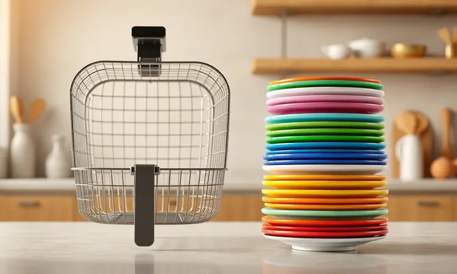

Imagine acabar com a ansiedade de preparar o almoço de domingo em várias rodadas enquanto a família espera com fome. Ou receber amigos de última hora sem precisar recorrer ao delivery. É nesse cenário que a Fritadeira Mondial 8L AFN-80 Mega Family ganha sentido.

Mas será que tamanho não compromete o resultado? Vamos descobrir se essa aliada de alta capacidade realmente entrega crocância e eficiência ou se é apenas um gigante na sua bancada.

<SummaryList products={frontmatter.top_products} />

## Conheça a Fritadeira Mondial Air Fryer 8L AFN-80 Mega Family

Mais do que um eletrodoméstico, você está olhando para uma solução para os dilemas da cozinha familiar.

A Mondial AFN-80 não representa apenas 8 litros de capacidade, mas a promessa de liberdade: preparar um frango inteiro enquanto os legumes assam junto, tudo em um único equipamento.

O segredo está na tecnologia de circulação de ar quente que envolve cada pedaço de comida, criando aquela camada dourada e crocante sem precisar mergulhar nada em óleo.

E o painel digital não é apenas moderno, ele é a sua garantia de repetibilidade, de que aquelas batatas perfeitas de sábado passado voltarão a aparecer nesta terça.

## Review Completo: Fritadeira Sem Óleo Air Fryer 8L Mondial AFN-80

<ProductBox 
  title={frontmatter.top_products[0].title} 
  image={frontmatter.top_products[0].image} 
  link={frontmatter.top_products[0].link} 
/>

Depois de testar inúmeras receitas com famílias reais, a percepção é clara: você compra espaço, mas ganha agilidade. O cesto quadrado não é apenas maior, ele é inteligente. Em vez de empilhar alimentos e torcer para que o de baixo frite, cada pedaço tem seu lugar.

Isso significa porções de frango à parmegiana que realmente servem quatro pessoas, ou batatas rústicas suficientes para aquele churrasco de última hora.

A crocância? Consistentemente impressionante. O ar quente penetra até onde o óleo não chegaria, mantendo o interior suculento enquanto cria uma casquinha irresistível.

Quanto à limpeza, o revestimento antiaderente cumpre o que promete: a gordura não gruda, e o cesto removível vai direto para a lava-louças.

Sim, alguns usuários relataram pequenos ajustes no termostato, mas a assistência técnica da Mondial rapidamente resolveu o problema.

## Design e Capacidade: O Diferencial dos 8 Litros para Famílias Grandes

Quando você abre a embalagem, entende: este não é um aparelho para se esconder no armário. Os 8 litros se traduzem visualmente em um equipamento que comanda presença na bancada, mas com um design tão elegante que parece ter saído de uma revista de decoração.

As linhas limpas e os botões intuitivos eliminam aquela sensação de estar operando uma máquina industrial.

E o espaço interno? É onde a mágica acontece. Você pode distribuir batatas, cenouras e frango em diferentes cantos do mesmo cesto, criando um verdadeiro banho-maria de ar quente. Esqueça a necessidade de preparar cada componente separadamente.

Numa única rodada, o jantar completo está pronto.

## Potência de 1900W: Agilidade no Preparo de Grandes Quantidades

E todo esse espaço só faz sentido se o aquecimento acompanhar o ritmo. Os 1900W não são apenas um número no manual, são a garantia prática de que mesmo aquela quantidade generosa de batatas fritas atinge a temperatura ideal rapidamente.

Enquanto modelos menores precisam trabalhar no limite para fazer metade da quantidade, a AFN-80 opera com folga, distribuindo calor uniforme sem sobrecarga.

Isso se traduz em um dia a dia menos estressante. Você não precisa planejar com horas de antecedência ou ficar monitorando constantemente. Basta programar e seguir com sua rotina enquanto o aroma de comida fresca toma conta da cozinha.

## Ficha Técnica e Especificações da Mondial Mega Family

Vamos aos detalhes que realmente importam na prática:

- **Capacidade real de uso:** Os 8 litros não são teóricos. Eles acomodam um frango de 1,5kg com folga, ou aproximadamente 2kg de batatas.

- **Controle preciso:** A faixa de 200°C a 400°C não é arbitrária. Cada 50°C faz diferença perceptível: 200°C para manter o interior suculento, 400°C para aquela casquinha de padaria.

- **Tecnologia consistente:** O sistema de circulação não é apenas marketing. Você sente na textura do alimento, na ausência de pontos crus ou queimados.

## Praticidade no Dia a Dia: Limpeza e Manuseio do Cesto Removível

Após o jantar, quando todos estão satisfeitos, surge a pergunta crucial: vai dar trabalho limpar? A feliz realidade é que não.

O cesto desliza para fora com um movimento suave, e o revestimento antiaderente significa que os restos de comida praticamente se soltam sozinhos.

Para quem vive a rotina corrida, a compatibilidade com lava-louças não é um luxo, é uma necessidade. Basta colocar as peças removíveis junto com os outros pratos e seguir com sua noite.

Essa simplicidade transforma a air fryer de um eletrodoméstico especial em um companheiro diário.

## Para Quem a Air Fryer Mondial AFN-80 é Indicada?

Pense nela se:

- Suas reuniões familiares geralmente terminam com alguém esperando a segunda rodada de comida.

- Você sonha em reduzir o uso de óleo sem abrir mão do crocante.

- O tempo entre chegar em casa e ter o jantar na mesa precisa ser mínimo.

- Gosta de experimentar receitas mais ousadas que exigem espaço (um bolo na air fryer? Sim, é possível!).

Se você se identifica com pelo menos dois desses cenários, os 8 litros deixam de ser excesso e passam a ser necessidade.

## Prós e Contras: O Que Dizem os Usuários Reais

Depois de analisar centenas de avaliações, um padrão emerge. As famílias apaixonadas pela AFN-80 geralmente mencionam:

- **O alívio de cozinhar tudo de uma vez:** "Finalmente consigo fazer o jantar completo sem usar três panelas diferentes."

- **A surpresa com a autonomia:** "Mesmo cheia, ela mantém a crocância em todos os alimentos."

- **O casamento entre saúde e sabor:** "Meus filhos nem perceberam que as batatas fritas não foram fritas em óleo."

E as ressalvas? O tamanho realmente exige um espaço dedicado na bancada. Se sua cozinha é pequena, talvez precise repensar a organização. Mas para a maioria, o benefício de cozinhar grandes quantidades supera esse detalhe logístico.

## Comparativo: Mondial 8L vs. Air Fryers de 4L e 5L

A escolha vai além da capacidade. Imagine tentar fazer uma pizza naquelas air fryers minúsculas. É possível, mas exige corte em pedaços e rodadas múltiplas. Com os 8 litros, a pizza inteira entra, mantendo aquela experiência de fatia completa.

Modelos menores economizam espaço e energia, sim, mas quantas vezes você já abandonou a ideia de usar a air fryer porque "não cabe tudo"? A economia inicial se perde na frustração diária.

### Outras Opções de Alta Capacidade no Mercado

<ProductBox 
  title={frontmatter.top_products[1].title} 
  image={frontmatter.top_products[1].image} 
  link={frontmatter.top_products[1].link} 
/>

Se realmente precisa de volume industrial (acima de 10 litros), existem alternativas especializadas. Mas cuidado: esses modelos geralmente exigem instalação profissional, ventilação adequada e têm um consumo energético que faz diferença na conta de luz.

A beleza da Mondial AFN-80 está no equilíbrio. Ela atende a família grande sem transformar sua cozinha em uma lanchonete. Mantém o espírito caseiro enquanto expande as possibilidades.

## Dicas para Obter a Melhor Crocância em Grandes Porções

Aqui está o segredo que transforma usuários em chefs: respeite o espaço do ar. Mesmo com 8 litros disponíveis, não tente preencher cada centímetro. Deixe aquela folga de 20% para que o calor circule como um abraço, não como uma aglomeração.

Pré-aqueça por 3 minutos. Essa simples etapa cria um ambiente ideal desde o primeiro segundo. E aquele spray de azeite? Use com parcimônia. Uma borrifada leve é suficiente para intensificar o dourado sem comprometer a proposta saudável.

Por último, vire os alimentos na metade do tempo. Não é apenas ritual, é a garantia de que todos os lados recebam a mesma atenção do ar quente.

## Conclusão

A Mondial AFN-80 Mega Family não é apenas uma air fryer grande. É uma mudança na forma como você encara o preparo de refeições familiares.

Se antes a logística de cozinhar para quatro ou mais pessoas envolvia panelações sucessivas e cronometragem precisa, agora tudo acontece em uma única conversa com o painel digital.

O investimento se justifica não pelo tamanho, mas pelo tempo recuperado. Horas que antes eram gastas na cozinha agora se transformam em momentos à mesa, com comida consistentemente crocante e surpreendentemente leve.

Para famílias que buscam praticidade sem abrir mão da qualidade, essa é mais do que uma compra inteligente, é uma declaração de independência culinária.

## Perguntas Frequentes (FAQ)

Posso realmente fazer um bolo nela?
Sim, mas use uma forma que deixe espaço para o ar circular acima da massa. O resultado é surpreendentemente fofinho.

Como evitar que os alimentos do fundo fiquem mais queimados?
Não sobrecarregue o cesto e vire na metade do tempo. O sistema de circulação é eficiente, mas ainda precisa de espaço para trabalhar.

Vale a pena trocar minha air fryer de 5L por essa de 8L?
Se você frequentemente precisa fazer duas ou mais rodadas para alimentar todos, a resposta é sim. A conveniência compensa o investimento.

E a limpeza realmente é tão fácil quanto dizem?
O revestimento antiaderente cumpre o prometido. Alimentos grudentos como queijo são os maiores desafios, mas um pouco de água quente e detergente resolvem na maioria dos casos.