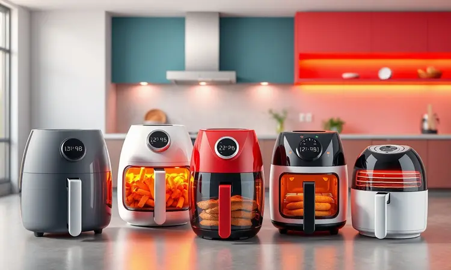
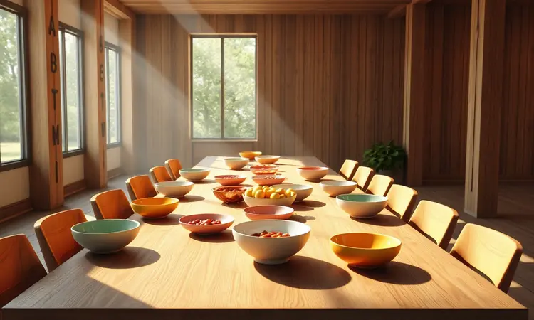
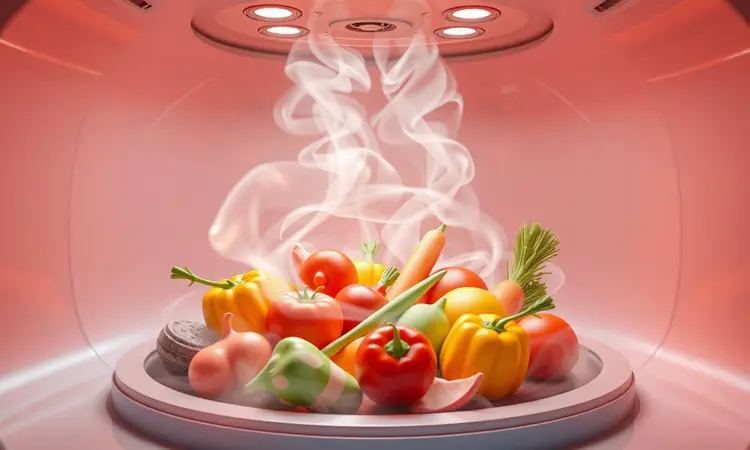

Preparar comida para muitas pessoas em uma air fryer pequena pode ser frustrante e demorado, exigindo várias rodadas de cozimento. Se você tem uma família grande ou gosta de receber amigos, precisa de espaço real para ganhar tempo e eficiência.

Neste guia completo, revelamos qual a maior air fryer do mercado em 2024, comparando desde os cestos "Mega Family" até os modelos Oven de 25 litros.

Você vai descobrir exatamente qual o tamanho ideal para sua rotina e quais modelos oferecem o melhor custo-benefício para quem não quer perder tempo na cozinha.

<SummaryList products={frontmatter.top_products} />

## O que define uma Air Fryer "Tamanho Família"?

Quando você imagina reunir todo mundo em volta da mesa, o que vem à mente? Provavelmente não várias rodadas de cozimento enquanto os primeiros convidados já estão com fome.

Uma Air Fryer é considerada "Tamanho Família" quando sua capacidade varia entre 8 e 25 litros, transformando a hora do jantar de uma logística complicada em um momento simples e prazeroso.

Esse tipo de aparelho vai além de apenas números. Pense na possibilidade de assar um frango inteiro enquanto os legumes ficam crocantes ao lado, tudo ao mesmo tempo. Ou então preparar pães de queijo para a turma inteira de uma só vez.

A mágica está na combinação certa: capacidade generosa, potência que não deixa ninguém esperando e um design que entende que cozinha não é só sobre cozinhar, mas sobre criar memórias.

## Tipos de Air Fryer Gigantes: Cesto vs. Oven vs. Dual

Antes de mergulhar nos modelos específicos, vamos entender as três personalidades diferentes que você encontra no mundo das air fryers grandes. Imagine que cada tipo resolve um problema específico do seu dia a dia.

As de cesto são como aquela amiga prática e direta: fáceis de limpar, sem firulas, perfeitas para quem quer resultados consistentes sem complicação.

As ovens são as artistas versáteis da família: funcionam como fornos completos, com múltiplas funções que transformam qualquer bancada em uma mini-cozinha profissional.

Já as dual são as mestras da multitarefa: permitem cozinhar dois pratos diferentes simultaneneamente, ideal para quem tem filhos com preferências distintas ou quer separar doces de salgados.

### 1. Air Fryer Forno Oven Mondial 25L: A recordista de espaço

<ProductBox 
  title={frontmatter.top_products[0].title} 
  image={frontmatter.top_products[0].image} 
  link={frontmatter.top_products[0].link} 
/>

Imagine conseguir colocar uma pizza de 30 cm inteira ou um pernil completo de uma só vez. A Mondial 25L não é apenas grande, ela é generosa. Com 25 litros de capacidade e 2000W de potência, ela transforma qualquer reunião familiar em um banquete sem estresse.

O controle de temperatura vai até 220°C com timer de 90 minutos, dando a flexibilidade de preparar desde assados lentos até grelhados rápidos.

É verdade que ela pede espaço na bancada, mas pense nisso como um investimento: em vez de várias panelas e assadeiras ocupando a pia, você tem um único equipamento que faz tudo.

Para quem costuma receber ou tem uma família realmente numerosa, essa versatilidade se paga na primeira festa de aniversário.

### 2. Air Fryer Oven Oster 15L: Potência e versatilidade profissional

<ProductBox 
  title={frontmatter.top_products[1].title} 
  image={frontmatter.top_products[1].image} 
  link={frontmatter.top_products[1].link} 
/>

Às vezes, 15 litros são exatamente o que você precisa: espaço suficiente para uma refeição completa, mas sem a sensação de estar cozinhando em uma fábrica. A Oster 15L com seus 1600W equilibra potência e praticidade de forma impressionante.

Ela desidrata, assa, grelha e frita sem óleo, tudo com um display digital que parece saído de uma cozinha de restaurante. O acabamento em aço inoxidável não é apenas estético: fala de durabilidade e de um aparelho feito para durar.

Se você valoriza ter opções na hora de cozinhar, mas não quer algo tão grande que assuste na bancada, essa é a medida perfeita entre ambição culinária e realidade do espaço.

### 3. Air Fryer Oven Electrolux 12L: Design e tecnologia premium

<ProductBox 
  title={frontmatter.top_products[2].title} 
  image={frontmatter.top_products[2].image} 
  link={frontmatter.top_products[2].link} 
/>

Algumas air fryers você compra pelo que fazem. A Electrolux 12L você também compra pela experiência que proporciona.

Com painel touch screen e iluminação interna que permite ver o cozimento sem abrir a porta, ela transforma o ato de preparar comida em algo quase terapêutico.

Os 1700W garantem que tudo fique pronto rapidamente, enquanto as funções pré-programadas tiram o trabalho de adivinhar temperaturas e tempos.

Mesmo com acabamento que simula aço escovado em vez de metal sólido, o visual é sofisticado e combina com qualquer cozinha moderna. É para quem acredita que eletrodomésticos podem ser tanto funcionais quanto objetos de desejo.

### 4. Air Fryer Mondial Mega Family 8L: A maior com cesto único plano

<ProductBox 
  title={frontmatter.top_products[3].title} 
  image={frontmatter.top_products[3].image} 
  link={frontmatter.top_products[3].link} 
/>

Há uma beleza na simplicidade. A Mondial Mega Family 8L tem um cesto quadrado de 700cm² que elimina a necessidade de empilhar alimentos. Pense nisso: você coloca tudo de uma vez e tudo cozinha uniformemente.

São 1900W de potência que significam menos tempo esperando e mais tempo comendo.

O revestimento antiaderente faz a limpeza ser questão de minutos, e o timer de 60 minutos com controle até 200°C cobre praticamente qualquer receita do dia a dia.

Para famílias que não querem o volume de uma oven mas precisam de mais espaço que os modelos convencionais, essa é a ponte perfeita entre praticidade e capacidade.

### 5. Air Fryer Arno Mega Digital 7,5L: Praticidade e alta performance

<ProductBox 
  title={frontmatter.top_products[4].title} 
  image={frontmatter.top_products[4].image} 
  link={frontmatter.top_products[4].link} 
/>

Às vezes, o segredo não está apenas no tamanho, mas na inteligência do design. A Arno Mega Digital 7,5L com sua tecnologia Hot Air promete até 70% de economia de energia comparada a fornos tradicionais, enquanto entrega crocância perfeita sem óleo.

Com 8 programas pré-definidos no painel digital, ela tira a complexidade de preparar pratos diferentes. Os 1700W são suficientes para alimentar até 8 pessoas de forma eficiente.

Sim, ela ocupa espaço, mas pense nesse espaço como o lugar onde você ganha tempo: em vez de ficar monitorando várias coisas ao mesmo tempo, você confia no aparelho e foca no que realmente importa, que é aproveitar a companhia de quem está à mesa.

### 6. Air Fryer Oven Philco 12L: Ótimo custo-benefício para grandes porções

<ProductBox 
  title={frontmatter.top_products[5].title} 
  image={frontmatter.top_products[5].image} 
  link={frontmatter.top_products[5].link} 
/>

Quando você precisa de versatilidade sem pagar preço de importado, a Philco 12L entra em cena. Com seus 1800W e 12 litros, ela frita, assa, grelha e desidrata com uma naturalidade que engana pelo preço acessível.

O controle de temperatura vai de 80°C a 200°C, perfeito para tudo, desde desidratar frutas até dourar um frango. É verdade que ela ocupa mais bancada que modelos menores, mas essa é uma troca consciente: um pouco de espaço físico por muito mais liberdade culinária.

Para quem está começando a explorar o mundo das air fryers grandes, mas não quer comprometer o orçamento, ela é uma porta de entrada inteligente.

### 7. Air Fryer Oven Britânia 12L: Espaço de sobra para assados inteiros

<ProductBox 
  title={frontmatter.top_products[6].title} 
  image={frontmatter.top_products[6].image} 
  link={frontmatter.top_products[6].link} 
/>

A Britânia 12L entende que às vezes você quer simplesmente colocar um frango inteiro e esquecer. Com circulação de ar quente em 360°, ela garante que cada pedaço fique igualmente crocante por fora e suculento por dentro.

Como equipamento 4 em 1, ela assa, frita sem óleo, desidrata e reaquece com uma naturalidade que torna a cozinha quase intuitiva. A potência de 1800W significa rapidez, e as duas assadeiras inclusas permitem preparar prato principal e acompanhamentos simultaneamente.

Sim, alguns acessórios podem exigir atenção na limpeza, mas isso é o preço de versatilidade: quando um único aparelho faz o trabalho de quatro, vale a pena dar aquela atenção extra na lavagem.

### 8. Air Fryer Dual Cesto 9L: Para quem quer cozinhar dois pratos ao mesmo tempo

<ProductBox 
  title={frontmatter.top_products[7].title} 
  image={frontmatter.top_products[7].image} 
  link={frontmatter.top_products[7].link} 
/>

Algumas famílias são um mosaico de gostos: uma criança só come batata, outra adora frango, os pais preferem legumes. A Dual Cesto 9L com suas duas cestas de 4,5 litros resolve essa equação com elegância.

A função Dual Cook/Zone permite tempos e temperaturas diferentes para cada lado, enquanto a Sync Function garante que tudo fique pronto exatamente na mesma hora.

Com potência que varia entre 1700W e 2400W dependendo do modelo, ela tem força para lidar com a dupla demanda. É maior que air fryers convencionais? Sim.

Mas quando você vê todos na mesa felizes com suas preferências atendidas simultaneamente, entende que algumas conveniências valem cada centímetro quadrado da bancada.

## Área Útil vs. Volume em Litros: Por que o formato do cesto importa?

Você já comprou um armário que parecia enorme nas medidas, mas na prática não cabia nada do jeito certo? Com air fryers acontece algo similar. Os litros indicam capacidade, mas o formato do cesto define a experiência real.

Um cesto quadrado e raso como o da Mondial Mega Family oferece uma superfície ampla perfeita para espalhar batatas ou preparar uma torta. Já um formato mais profundo pode ser ideal para frangos inteiros, mas limitar quanto você consegue colocar de uma vez.

Antes de escolher apenas pelo número de litros, pergunte-se: você costuma preparar alimentos largos e chatos, ou altos e volumosos? Essa resposta vai guiá-lo melhor que qualquer especificação técnica.

## Como escolher a capacidade ideal baseada no número de pessoas?

Escolher a air fryer certa é como escolher um carro: precisa servir seu estilo de vida real, não a fantasia do que você gostaria que fosse. Para 1 a 3 pessoas, modelos de 2 a 4 litros resolvem o dia a dia.

De 4 a 6 pessoas, já vale pular para os 5 a 8 litros, que permitem preparar refeições completas sem rodadas extras.

Agora, se sua casa é ponto de encontro, se você adora receber ou simplesmente detesta ficar cozinhando em etapas, os 10 litros ou mais não são luxo, são necessidade. Pense nisso: quantas vezes na semana você prepara comida para o número exato de pessoas da casa?

E quantas vezes surpreende com visitas ou decide fazer uma receita especial? A air fryer ideal é aquela que atende não apenas sua realidade atual, mas também suas ambições culinárias.

## 5 Dicas para cozinhar grandes volumes na Air Fryer com eficiência

Com grande capacidade vem grande responsabilidade culinária. Para extrair o máximo desses aparelhos generosos:

Primeiro, resista à tentação de encher demais a cesta. Ar precisa circular, e comida empilhada vira comida cozida pela metade. Em segundo lugar, corte ingredientes em tamanhos consistentes: pedaços iguais significam cozimento igual.

Terceiro, mexa ou vire na metade do tempo. Essa simples ação garante que cada lado ganhe aquela crocância dourada que faz toda a diferença. Quarto, explore as camadas: coloque na parte inferior o que precisa de mais tempo, e na superior o que só precisa dourar.

Por último, mas crucial: sempre preaqueça. São apenas poucos minutos que fazem o aparelho trabalhar na temperatura ideal desde o primeiro segundo, economizando tempo total e garantindo resultados perfeitos.

## Perguntas Frequentes sobre Air Fryers Grandes (FAQ)

### Uma Air Fryer de 12 litros gasta muita energia?

Surpreendentemente, não. A maioria opera entre 1500W e 1800W, mas o segredo está no tempo reduzido de cozimento.

Enquanto um forno convencional precisa de 15-20 minutos para preaquecer e depois mais tempo para cozinhar, a air fryer começa na temperatura certa e termina mais rápido.

O consumo acaba sendo inteligente: mais potência concentrada por menos tempo, resultando em eficiência energética real.

### Cabe um frango inteiro em uma Air Fryer de 8 litros?

Perfeitamente. Frangos de pequeno a médio porte se acomodam com folga, e muitas vezes ainda sobra espaço para alguns legumes ao redor.

A beleza dos 8 litros está nesse equilíbrio: espaço suficiente para refeições impressionantes, mas não tão gigante que pareça excessivo para o dia a dia comum.

### Qual a melhor marca de Air Fryer para famílias grandes?

Marcas como Philips, Multilaser e Cadence se destacam pela combinação certa: capacidade generosa (8L a 25L), tecnologia que garante cozimento uniforme, e funções que vão além da fritura básica.

Mas mais importante que a marca é entender qual modelo dentro da linha se encaixa no seu ritmo. Algumas famílias precisam da versatilidade completa das ovens, outras preferem a simplicidade eficiente dos cestos grandes.

A melhor marca é aquela cujo modelo específico conversa com seu jeito de cozinhar.

## Conclusão

Escolher a maior air fryer ideal para você não é sobre comprar o aparelho com mais litros, mas sobre entender qual capacidade transforma sua cozinha em um lugar de praticidade e prazer.

Se sua casa é ponto de encontro frequente, se as refeições familiares são eventos que merecem espaço, ou se você simplesmente cansou de cozinhar em rodadas, os modelos de 8L a 25L oferecem uma liberdade que vai além das especificações técnicas.

Lembre-se: o tamanho certo é aquele que permite preparar a refeição completa de uma vez, sem sacrificar uniformidade no cozimento ou sua sanidade na organização.

Seja a Mondial 25L abrindo espaço para festas inteiras, a Dual Cesto 9L harmonizando gostos diferentes, ou a Electrolux 12L trazendo sofisticação ao processo, cada uma dessas opções representa uma decisão inteligente para quem entende que cozinhar para muitos não precisa ser complicado.

No final, a maior air fryer ideal é aquela que some à sua rotina sem subtrair espaço do convívio. Que permite que você esteja mais presente à mesa e menos preso ao fogão.

Que transforma a obrigação de alimentar a família no prazer de reunir todos em torno de uma refeição feita com carinho e, acima de tudo, com praticidade que deixa tempo para o que realmente importa.