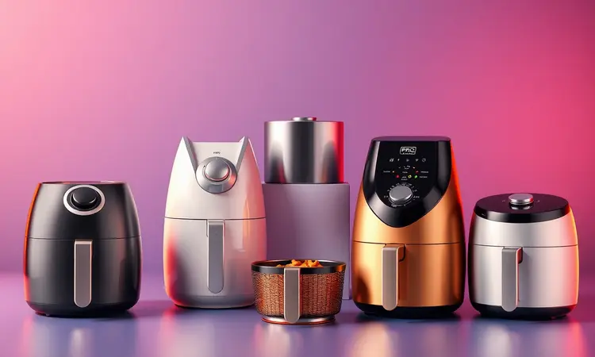
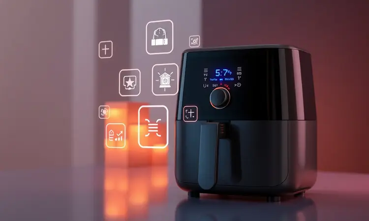

Escolher entre uma Air Fryer Mondial ou Britânia é o dilema de muitos brasileiros que buscam praticidade e alimentação saudável na cozinha.

Ambas as marcas dominam o mercado com modelos que prometem crocância sem óleo, mas as diferenças técnicas, durabilidade e o volume do cesto podem ser decisivos na hora da compra.

Neste guia completo, analisamos os principais critérios, desde a eficiência energética até o atendimento pós-venda, além de listar os modelos mais bem avaliados de cada fabricante.

Confira nosso comparativo detalhado e descubra qual dessas gigantes oferece o melhor custo-benefício para a sua rotina doméstica em 2025.

<SummaryList products={frontmatter.top_products} />

## As 5 Melhores Opções de Air Fryer Mondial e Britânia

Se você está procurando uma fritadeira sem óleo para transformar sua cozinha, tanto a Mondial quanto a Britânia oferecem opções que vão desde modelos compactos até verdadeiras estações de trabalho culinárias.

Vamos explorar as cinco melhores opções do mercado, mostrando como cada uma pode se encaixar na sua rotina.

### 1. Mondial Fritadeira Air Fryer Forno Oven 12L AFON-12L

<ProductBox 
  title={frontmatter.top_products[0].title} 
  image={frontmatter.top_products[0].image} 
  link={frontmatter.top_products[0].link} 
/>

Imagine preparar um jantar completo para a família sem usar uma única gota de óleo. A Mondial AFON-12L oferece exatamente isso, com seus 12 litros de espaço que permitem desde um frango assado inteiro até uma bandeja de batatas fritas para todos.

A sensação de liberdade vem junto com o painel digital que, com apenas um toque, ativa uma das 10 funções pré-programadas. Você simplesmente escolhe "frango", "peixe" ou até "bolo" e deixa a tecnologia fazer o resto.

Com potência que varia entre 2000W e 2200W, ela aquece rapidamente e mantém a temperatura constante durante todo o processo. O timer de 90 minutos com desligamento automático significa que você pode preparar aquela receita que demora mais sem ficar vigiando.

A circulação de ar quente em 360° garante que cada pedaço fique igualmente crocante, sem aqueles pontos crus que frustram qualquer cozinheiro.

<CaixaProsContras>

**Prós:**

- Grande capacidade de 12 litros, ideal para famílias.

- Cozinha sem óleo, promovendo refeições mais saudáveis.

- Várias funções pré-programadas, aumentando a versatilidade.

- Painel digital que facilita a operação.

**Contras:**

- O painel pode demorar a responder em algumas situações.

- Alguns modelos não acompanham cesto, o que pode ser um inconveniente.

</CaixaProsContras>

### 2. Mondial Fritadeira Sem Óleo Air Fryer 8L AFN-80-BI

<ProductBox 
  title={frontmatter.top_products[1].title} 
  image={frontmatter.top_products[1].image} 
  link={frontmatter.top_products[1].link} 
/>

Para quem tem uma família maior mas não precisa dos 12 litros, a Mondial AFN-80-BI de 8 litros oferece o equilíbrio perfeito.

Seu cesto quadrado é um diferencial inteligente, maximizando o espaço interno de forma que você consegue organizar os alimentos com mais eficiência.

Pense em preparar batatas fritas, nuggets e legumes ao mesmo tempo, tudo sem a bagunça do óleo quente espirrando pela cozinha.

O controle de temperatura vai até 200°C, permitindo desde desidratar frutas em fogo baixo até deixar aquele bacon bem crocante em alta temperatura.

O timer com desligamento automático oferece segurança, especialmente se você precisa sair da cozinha enquanto o alimento está preparando. A limpeza é facilitada pelo cesto antiaderente removível, que sai facilmente para ser lavado.

<CaixaProsContras>

**Prós:**

- Capacidade grande de 8 litros para porções generosas.

- Tecnologia de circulação de ar para cozimento uniforme.

- Cesto quadrado que otimiza o uso do espaço.

- Fácil limpeza com cesto antiaderente removível.

**Contras:**

- A parte externa pode arranhar facilmente.

- É fundamental escolher a voltagem correta no momento da compra.

</CaixaProsContras>

### 3. Britânia Fritadeira Air Fry Oven BFR2100P 12L

<ProductBox 
  title={frontmatter.top_products[2].title} 
  image={frontmatter.top_products[2].image} 
  link={frontmatter.top_products[2].link} 
/>

A Britânia BFR2100P não é apenas uma air fryer, é uma verdadeira cozinheira auxiliar. Imagine ter um único aparelho que frita, assa, desidrata e reaquece, tudo com a mesma facilidade de um forno tradicional.

Os 12 litros de capacidade permitem preparar múltiplas camadas de alimentos simultaneamente, perfeito para quando você quer servir diferentes acompanhamentos.

A iluminação interna é um detalhe que faz toda diferença no dia a dia. Em vez de abrir a porta e perder calor, você consegue acompanhar o ponto dos alimentos através da janela iluminada.

As nove funções pré-programadas são como ter um chef particular, guiando você no preparo desde carnes até sobremesas. A base antiderrapante garante estabilidade mesmo sobre bancadas de mármore ou granito.

<CaixaProsContras>

**Prós:**

- Várias funções em um só aparelho (fritar, assar, desidratar e reaquecer).

- Grande capacidade de 12 litros.

- Painel digital com diversas opções práticas.

- Design moderno em inox e base antiderrapante.

**Contras:**

- Não é bivolt, exigindo atenção à voltagem.

- Pode ser um pouco volumoso para cozinhas pequenas.

</CaixaProsContras>

### 4. Mondial Fritadeira Sem Óleo Family 4L AF-30-BI

<ProductBox 
  title={frontmatter.top_products[3].title} 
  image={frontmatter.top_products[3].image} 
  link={frontmatter.top_products[3].link} 
/>

Para famílias que querem começar no mundo das frituras saudáveis sem investir muito, a Mondial Family 4L é a porta de entrada perfeita.

Seus 4 litros são ideais para preparar porções que alimentam de 2 a 4 pessoas, como um filé de frango com batatas ou uma porção generosa de salgadinhos para o fim de semana.

A sensação de autonomia vem com o controle simples de temperatura (80°C a 200°C) e timer de até 60 minutos.

Com 1500W de potência, ela aquece rapidamente e mantém o ritmo durante todo o cozimento. O cesto removível com revestimento antiaderente transforma a limpeza em uma tarefa de segundos, basta enxaguar sob a torneira.

É o tipo de eletrodoméstico que você usa diariamente sem pensar duas vezes, pela praticidade e pelos resultados consistentes.

<CaixaProsContras>

**Prós:**

- Capacidade ideal para porções familiares.

- Tecnologia Air Fryer que reduz a necessidade de óleo.

- Timer e controle de temperatura são bastante práticos.

- Cesto removível facilita a limpeza.

**Contras:**

- Design pode não agradar a todos.

- Pode ser necessário pré-aquecer antes do uso, o que pode exigir um pouco mais de planejamento.

</CaixaProsContras>

### 5. Britânia Fritadeira Sem Óleo Air Fry BFR15P

<ProductBox 
  title={frontmatter.top_products[4].title} 
  image={frontmatter.top_products[4].image} 
  link={frontmatter.top_products[4].link} 
/>

A Britânia BFR15P oferece 6 litros de capacidade com uma proposta clara: simplicidade que funciona. Sua tecnologia Air Flow circula o ar quente de forma tão eficiente que você quase não acredita que não usou óleo.

O cesto antiaderente é projetado para ser lavado na lava-louças, eliminando uma das maiores dores de cabeça após cozinhar.

O timer mecânico tem aquela satisfação tátil de girar o botão e ouvir o clique, com a segurança adicional do desligamento automático.

Para quem valoriza funcionalidades básicas bem executadas, este modelo entrega exatamente o prometido: alimentos crocantes por fora e macios por dentro, sem complicações desnecessárias.

<CaixaProsContras>

**Prós:**

- Alta capacidade de 6 litros para grandes porções.

- Tecnologia Air Flow para fritura saudável e uniforme.

- Cesto removível e fácil de limpar.

- Equipado com timer mecânico e desligamento automático para segurança.

**Contras:**

- Modelo não é bivolt, requer atenção à voltagem.

- Pode ser considerado mais pesado em comparação com outras opções no mercado.

</CaixaProsContras>

## Air Fryer Mondial ou Britânia: qual é melhor?

A resposta não é simples como escolher entre A ou B, mas sim entender qual marca conversa melhor com seu estilo de vida. A Mondial geralmente aposta na versatilidade e na facilidade de uso, como se dissesse "vamos simplificar sua rotina".

Já a Britânia costuma focar na multifuncionalidade e na durabilidade, transmitindo a mensagem "investimento para longo prazo".

Antes de decidir, faça três perguntas para si mesmo: Quantas pessoas você costuma cozinhar? Com que frequência usa eletrodomésticos na cozinha? E o mais importante, que tipo de experiência você quer ter ao preparar suas refeições?

As respostas vão naturalmente apontar para uma direção. Vamos explorar agora os critérios específicos que vão te ajudar a tomar essa decisão.

## 1. Design e variedade

Enquanto a Mondial flerta com cores vibrantes e linhas contemporâneas que parecem feitas para cozinhas modernas, a Britânia prefere a sobriedade do inox e designs que se camuflam entre outros eletrodomésticos premium.

A variedade da Mondial é impressionante, com opções que vão desde os compactos 4 litros até os robustos 12 litros, quase sempre com algum detalhe de cor que quebra a monotonia dos eletrodomésticos tradicionais.

A Britânia, por outro lado, aposta em uma linha mais coesa visualmente, onde os modelos parecem conversar entre si. Se você valoriza uma cozinha visualmente harmônica, pode preferir essa abordagem.

O importante é que o design não seja apenas estético, mas também funcional, facilitando o manuseio e a limpeza no seu dia a dia.

## 2. Tecnologia e inovação

Ambas as marcas evoluíram muito além da simples circulação de ar quente. A Mondial se destaca nas interfaces intuitivas, onde o painel digital parece antecipar o que você precisa.

Já a Britânia brilha nas multifunções integradas, transformando uma air fryer em verdadeiro centro culinário.

Pense na tecnologia não como especificações técnicas, mas como facilitadores da sua vida. Um timer preciso significa poder colocar os alimentos e cuidar de outras tarefas sem preocupação.

Funções pré-programadas são como ter receitas embutidas que garantem resultados consistentes. E quando uma marca oferece até iluminação interna, está pensando na experiência completa, não apenas no resultado final.

## 3. Custo-benefício

O preço é apenas uma parte da equação. A Mondial geralmente oferece mais funções pelo mesmo investimento, perfeito para quem quer experimentar diversas possibilidades culinárias.

Já a Britânia costuma justificar seu preço com uma construção robusta que promete durar anos, ideal para quem não gosta de trocar eletrodomésticos frequentemente.

Mas o verdadeiro custo-benefício se mede na cozinha, no dia a dia. Quantas vezes você vai usar todas as funções? Quanto tempo o aparelho vai durar com seu ritmo de uso? E talvez o mais importante, quanto você economiza em óleo e energia elétrica ao longo do tempo?

Essas respostas transformam um simples preço de etiqueta em um cálculo muito mais significativo.

## 4. Eficiência energética

Quando uma air fryer aquece rapidamente e mantém a temperatura constante, ela não está apenas preparando sua comida mais rápido, está também consumindo energia de forma mais inteligente.

A Mondial geralmente otimiza esse processo com sistemas de aquecimento que distribuem o calor de forma mais uniforme, reduzindo o tempo total de funcionamento.

A Britânia, por sua vez, aposta em funções programáveis que permitem ajustes precisos de temperatura e tempo, evitando que o aparelho trabalhe mais do que o necessário.

Em ambos os casos, o resultado é um eletrodoméstico que, apesar da potência elevada, pode ser mais econômico do que métodos tradicionais de fritura a longo prazo.

## 5. Atendimento e pós-venda

Uma air fryer é um investimento, e como todo investimento, precisa de suporte. A Mondial construiu uma reputação sólida em atendimento rápido e eficiente, com canais de contato que realmente funcionam quando você precisa.

Já a Britânia oferece uma rede de assistência técnica ampla, embora a experiência possa variar dependendo da sua região.

Pergunte-se: você prefere uma marca com respostas rápidas via chat online, ou valoriza mais ter uma assistência técnica física perto de casa?

E quanto à garantia, ambas oferecem cobertura similar, mas a forma como lidam com eventuais problemas pode fazer toda diferença na sua satisfação futura.

## Critérios Essenciais para Escolher sua Air Fryer

Mais do que comparar marcas, é fundamental olhar para suas próprias necessidades. A capacidade ideal não é a maior disponível, mas aquela que corresponde ao tamanho das suas refeições habituais.

Uma família de quatro pessoas pode ser perfeitamente atendida por 6 a 8 litros, enquanto quem recebe visitas frequentemente pode precisar dos 12 litros.

A potência influencia diretamente no tempo de preparo, mas também na conta de luz. Modelos entre 1500W e 1800W geralmente oferecem o equilíbrio ideal entre velocidade e eficiência energética.

Quanto à limpeza, prefira sempre modelos com cestos removíveis e antiaderentes, que transformam uma tarefa chata em algo que leva menos de dois minutos.

## Mondial vs Britânia: O Duelo das Gigantes

No final das contas, a escolha entre Mondial e Britânia se resume ao que você valoriza mais na sua cozinha. A Mondial parece sussurrar "experimente, arrisque, crie", com suas múltiplas funções e interfaces amigáveis.

A Britânia, por outro lado, transmite confiança e permanência, como se dissesse "estarei aqui por anos, funcionando perfeitamente".

Ambas entregam o essencial: alimentos crocantes sem óleo, economia no longo prazo e praticidade no dia a dia. A diferença está nos detalhes, na personalidade do produto, e principalmente, em como essa personalidade se alinha com a sua.

## Capacidade e Potência: O que Observar?

Pense na capacidade não como números em uma ficha técnica, mas como liberdade na cozinha. Um cesto de 4 litros é perfeito para um casal ou pequena família que não quer comprometer espaço no armário.

Já os 12 litros são para quem encara a cozinha como espaço de convivência, onde preparar uma refeição completa é parte do prazer de receber.

A potência, medida em watts, determina quanto tempo você passa esperando. Modelos acima de 1800W aquecem quase instantaneamente, ideal para quem tem pressa no almoço do dia a dia. Já os entre 1500W e 1700W oferecem economia sem sacrificar muito o tempo de preparo.

O segredo está em encontrar o ponto ideal entre velocidade e consumo consciente.

## Recursos Extras que Fazem a Diferença

Alguns detalhes parecem pequenos até você experimentá-los. A função de desidratação transforma frutas da estação em snacks saudáveis que duram semanas. O pré-aquecimento automático elimina aqueles minutos de espera antes de começar a cozinhar.

E os cestos com divisórias internas permitem preparar proteínas e acompanhamentos simultaneamente, sem misturar sabores.

Mas o verdadeiro recurso extra é aquele que se adapta ao seu estilo de vida. Se você vive na correria, timer preciso e funções pré-programadas são essenciais. Se valoriza sustentabilidade, modelos com materiais duráveis e fácil limpeza fazem diferença.

E se a cozinha é seu espaço de terapia, a iluminação interna e o design cuidado podem transformar o ato de cozinhar em uma experiência.

## Perguntas Frequentes

A dúvida mais comum é realmente: Mondial ou Britânia? A resposta honesta é que ambas são excelentes, mas atendem a perfis diferentes. Quem busca versatilidade e experimentação geralmente se identifica mais com a Mondial.

Quem prioriza durabilidade e uma estética mais sóbria tende a preferir a Britânia.

Outra pergunta frequente é sobre o consumo de energia. Embora pareçam potentes, as air fryers costumam ser mais econômicas que fornos tradicionais pelo tempo reduzido de preparo.

E quanto à limpeza, a maioria dos modelos modernos tem cestos removíveis que vão direto para a pia ou até para a lava-louças, eliminando o trabalho braçal.

## Conclusão

Escolher entre uma Air Fryer Mondial ou Britânia é muito mais do que comparar especificações técnicas. É sobre entender qual marca conversa com seu estilo de vida, suas prioridades na cozinha e sua visão sobre praticidade no dia a dia.

A Mondial te convida a experimentar, a descobrir novas possibilidades culinárias com uma interface que parece feita para quem não tem tempo a perder.

A Britânia oferece a segurança de um investimento duradouro, com uma construção robusta que promete anos de serviço fiel.

Independente da escolha, você estará levando para casa mais do que um eletrodoméstico. Estará adotando uma forma mais saudável de cozinhar, economizando tempo na limpeza e descobrindo que alimentos crocantes não precisam vir acompanhados de culpa.

O verdadeiro vencedor deste comparativo será sua rotina na cozinha, transformada pela praticidade das frituras sem óleo. Agora que você já conhece os detalhes de cada marca, qual delas vai conquistar um espaço permanente na sua bancada?