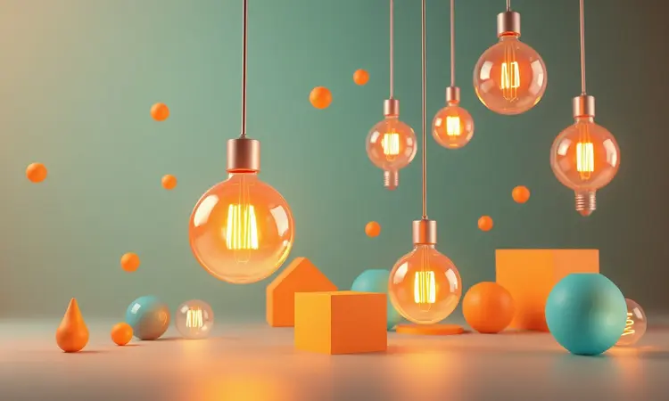

Pense na última vez que você fez batatas fritas para toda a família e teve que fazer rodízios no forno tradicional. Agora imagine ter todo esse espaço em um único aparelho que cabe na sua bancada.

É exatamente essa praticidade que as air fryers grandes, especialmente os modelos 'Oven' de 12 litros ou mais, oferecem. Neste guia, analisamos 13 opções que vão além da simples fritura, funcionando como verdadeiros fornos elétricos de convecção para sua cozinha.

Desde a capacidade generosa da EOS até a tecnologia avançada da Electrolux, descobriremos qual modelo se encaixa perfeitamente na sua rotina e espaço disponível.

<SummaryList products={frontmatter.top_products} />

## Melhor air fryer grande: veja opções

Escolher uma air fryer grande transforma sua relação com a cozinha. Você ganha um aliado para preparar jantares inteiros, lanches para visitas e até sobremesas, tudo com uma redução impressionante de óleo.

Vamos explorar as diferentes personalidades desses aparelhos, cada um com seu toque especial para atender às suas necessidades específicas.

### 1. Air Fryer Oven EOS EAF15IP 15 L

<ProductBox 
  title={frontmatter.top_products[0].title} 
  image={frontmatter.top_products[0].image} 
  link={frontmatter.top_products[0].link} 
/>

Imagine receber amigos e preparar batatas fritas para todos simultaneamente. A Air Fryer Oven EOS EAF15IP transforma essa visão em realidade com seus 15 litros de capacidade.

O que realmente conquista é a sensação de ter um mini-forno profissional na sua bancada, pronto para fritar, desidratar, descongelar e manter alimentos aquecidos com um simples toque no painel digital.

Sua tecnologia de circulação de ar quente age como uma mão invisível que distribui calor uniformemente, garantindo que cada porção fique igualmente crocante.

E embora suas dimensões sejam similares a modelos menores (o que pode causar uma surpresa positiva no espaço ocupado), a experiência de preparar grandes quantidades sem fazer rodízios compensa qualquer ajuste de bancada.

<CaixaProsContras>

**Prós:**

- Capacidade de 15 litros ideal para grandes porções.

- Multifuncionalidade que permite várias formas de preparo.

- Design moderno e fácil de limpar.

- Painel digital intuitivo.

**Contras:**

- Dimensões similares a modelos menores, o que pode gerar confusão.

- Algumas partes plásticas podem parecer frágeis.

</CaixaProsContras>

### 2. Air Fryer Oven Elgin AFO00 12L

<ProductBox 
  title={frontmatter.top_products[1].title} 
  image={frontmatter.top_products[1].image} 
  link={frontmatter.top_products[1].link} 
/>

Você já colocou alimentos na fritadeira e percebeu que alguns pedaços ficaram mais dourados que outros? A tecnologia Air Circuit 360º da Elgin AFO00 promete acabar com essa desigualdade culinária.

Com seus 12 litros e 1800W de potência, ela envolve cada pedaço de alimento em um abraço de ar quente que circula uniformemente, criando uma crocância consistente em toda a bandeja.

E quando você descobre que pode usar o mesmo aparelho para desidratar frutas para lanches saudáveis e reaquecer sobras do jantar, percebe que está diante de um verdadeiro centro de alimentação.

Sim, ela exige seu espaço na bancada, mas em troca oferece a liberdade de experimentar receitas que antes exigiam vários eletrodomésticos.

<CaixaProsContras>

**Prós:**

- Capacidade grande de 12 litros, ideal para famílias.

- Multifuncional: frita, assa, desidrata e reaquece.

- Tecnologia que garante cozimento uniforme.

- Fácil limpeza com acessórios removíveis.

**Contras:**

- Pode ocupar um espaço considerável na cozinha.

- O preço pode ser mais elevado em comparação a modelos menores.

</CaixaProsContras>

### 3. Air Fryer Oven Britânia BFR2100 12L

<ProductBox 
  title={frontmatter.top_products[2].title} 
  image={frontmatter.top_products[2].image} 
  link={frontmatter.top_products[2].link} 
/>

Há algo profundamente satisfatório em ver alimentos dourando uniformemente através de uma janela iluminada. A Britânia BFR2100 entrega essa experiência cinematográfica enquanto prepara porções generosas para sua família.

Com 9 funções pré-programadas no painel touch, você sente que tem um chef eletrônico guiando cada preparação.

E embora algumas versões tragam um cesto com capacidade de cerca de 3,5 litros - informação importante para suas expectativas -, o aparelho compensa com uma eficiência que transforma horas na cozinha em minutos de preparo.

É aquele tipo de investimento que você agradece toda vez que prepara um jantar completo sem precisar acender o forno tradicional.

<CaixaProsContras>

**Prós:**

- Capacidade generosa de 12 litros, ideal para grandes porções.

- Múltiplas funções que permitem uma variedade de preparações.

- Painel digital intuitivo com 9 funções pré-programadas.

- Design moderno e fácil de limpar.

**Contras:**

- A capacidade do cesto pode ser um pouco menor do que o esperado em algumas versões.

- O produto exige uma tomada específica devido à sua potência.

</CaixaProsContras>

### 4. Air Fryer Oven Mondial AFON 12L

<ProductBox 
  title={frontmatter.top_products[3].title} 
  image={frontmatter.top_products[3].image} 
  link={frontmatter.top_products[3].link} 
/>

Algumas air fryers fazem você pensar duas vezes sobre qual receita preparar. A Mondial AFON com seus 10 programas pré-definidos praticamente decide por você, sugerindo desde batatas fritas crocantes até bolos fofos.

Com 2.200W de potência, ela atinge temperaturas rapidamente, reduzindo aquele tempo de espera que tira o ânimo de cozinhar.

Seu visor amplo com iluminação interna funciona como uma vitrine onde você acompanha a transformação dos alimentos em tempo real.

E embora não seja a opção mais discreta da bancada, compensa com resultados que fazem parecer que você passou horas preparando algo que levou minutos.

<CaixaProsContras>

**Prós:**

- Versatilidade como fritadeira e forno

- Capacidade grande de 12 litros

- Painel digital com funções pré-definidas

- Facilidade na limpeza com partes removíveis

**Contras:**

- Ocupa mais espaço na bancada

- Potência pode ser excessiva para receitas simples

</CaixaProsContras>

### 5. Air Fryer Oven Veronna Splendore VAF1800D 12 L

<ProductBox 
  title={frontmatter.top_products[4].title} 
  image={frontmatter.top_products[4].image} 
  link={frontmatter.top_products[4].link} 
/>

Há uma sensação libertadora em preparar alimentos crocantes usando até 80% menos gordura. A Veronna Splendore transforma essa experiência em rotina com seu design 4 em 1 que vai da fritura à desidratação.

Imagine transformar excesso de frutas da feira em lanches saudáveis para a semana, tudo no mesmo aparelho que faz batatas fritas perfeitas.

Com temperatura ajustável de 30°C a 200°C, você tem controle fino sobre cada preparação, como um maestro da crocância.

E sim, seus 6,8 kg podem exigir um planejamento de onde ela vai ficar permanentemente, mas pense nisso como estabilizar um aliado culinário que não balança ao abrir a porta.

<CaixaProsContras>

**Prós:**

- Capacidade generosa para grandes porções.

- Versatilidade com funções variadas (fritar, assar, etc.).

- Painel digital fácil de usar.

- Design moderno e fácil de limpar.

**Contras:**

- Peso considerável para movimentar.

- Pode ocupar bastante espaço na cozinha.

</CaixaProsContras>

### 6. Air Fryer Oven Wap WAOD2 12 L

<ProductBox 
  title={frontmatter.top_products[5].title} 
  image={frontmatter.top_products[5].image} 
  link={frontmatter.top_products[5].link} 
/>

A tecnologia de circulação de ar 360° da Wap WAOD2 funciona como um sistema de aquecimento inteligente que envolve cada alimento individualmente.

É como se cada batata recebesse atenção personalizada, garantindo aquela crocância perfeita por fora e maciez por dentro que faz todos pedirem a receita.

Com timer programável até 90 minutos e 10 funções pré-programadas, você praticamente tem um livro de receiras digital na sua bancada.

E embora seu espaço na cozinha precise ser negociado com outros eletrodomésticos, a multifuncionalidade que oferece, assar, cozinhar, reaquecer, justifica cada centímetro quadrado ocupado.

<CaixaProsContras>

**Prós:**

- Capacidade de 12 litros, ideal para famílias.

- Multifuncionalidade: assa, cozinha, reaquece e frita.

- Tecnologia de Circulação de Ar 360° para cozimento uniforme.

- Painel digital com múltiplas funções pré-programadas.

**Contras:**

- Ocupa um espaço considerável na bancada.

- Pode ser complicado de limpar se não forem usados os acessórios antiaderentes.

</CaixaProsContras>

### 7. Air Fryer Oven Oster OFRT780 12 L

<ProductBox 
  title={frontmatter.top_products[6].title} 
  image={frontmatter.top_products[6].image} 
  link={frontmatter.top_products[6].link} 
/>

Quando um aparelho oferece 9 funções incluindo desidratação, ele deixa de ser uma simples fritadeira e se torna um estúdio de experimentação culinária.

A Oster OFRT780 com seus 1800W de potência e iluminação interna cria uma experiência onde você não apenas cozinha, mas também observa a transformação dos alimentos em tempo real.

É aquele tipo de eletrodoméstico que faz você repensar receitas tradicionais, perguntando-se: "será que ficaria melhor na air fryer?" E apesar de exigir seu próprio território na bancada, cada função adicional - assar carnes, fazer vegetais crocantes, desidratar frutas - representa uma economizada de tempo e de ter que limpar outros aparelhos.

<CaixaProsContras>

**Prós:**

1. Multifuncional: frita, assa e desidrata.

1. Grande capacidade de 12 litros.

1. Operação eficiente com controle de temperatura.

1. Design moderno e fácil de usar.

**Contras:**

1. Tamanho considerável que pode ocupar espaço.

1. Um pouco pesado, o que pode dificultar a movimentação.

</CaixaProsContras>

### 8. Air Fryer Oven EOS EAF12I 12L

<ProductBox 
  title={frontmatter.top_products[7].title} 
  image={frontmatter.top_products[7].image} 
  link={frontmatter.top_products[7].link} 
/>

Imagine preparar uma pizza de 30 cm inteira em um aparelho que também faz batatas fritas crocantes. A EOS EAF12I com seus 1800W transforma refeições completas em processos simples, onde a única limitação é sua criatividade.

O painel digital touch responde aos seus comandos com precisão, ajustando temperaturas e funções como um assistente culinário digital.

E quando você descobre que as superfícies antiaderentes permitem limpeza rápida - muitas partes até na máquina de lavar louça -, percebe que está investindo não apenas em um eletrodoméstico, mas em tempo livre.

Sim, o investimento inicial pode fazer pensar duas vezes, mas dividido pelo número de jantares fáceis e saudáveis, cada real se justifica.

<CaixaProsContras>

**Prós:**

- Grande capacidade de 12 litros para preparar porções generosas.

- Multifuncionalidade: além de air fryer, também atua como forno e desidratador.

- Painel digital touch intuitivo e fácil de usar.

- Superfícies antiaderentes que facilitam a limpeza.

**Contras:**

- Ocupa um espaço considerável na bancada da cozinha.

- Pode ter um custo mais elevado em comparação com modelos básicos.

</CaixaProsContras>

### 9. Air Fryer Oven Oster OFOR160 15 L

<ProductBox 
  title={frontmatter.top_products[8].title} 
  image={frontmatter.top_products[8].image} 
  link={frontmatter.top_products[8].link} 
/>

Com 21 funções de cozimento incluindo pré-configurações específicas para carnes e frutos do mar, a Oster OFOR160 senta na mesa como um sommelier de temperaturas.

Sua tecnologia Turbo Convection não apenas cozinha rapidamente, mas o faz com uma uniformidade que elimina aqueles pontos queimados que arruínam uma refeição.

Os 15 litros são o ponto ideal para quem quer capacidade sem transformar a cozinha em um laboratório industrial.

E embora famílias maiores possem achar limitado para preparações monumentais, para o dia a dia de quem valoriza eficiência e sofisticação (aquele acabamento em aço inoxidável faz diferença), ela é como ter um chef compacto sempre disponível.

<CaixaProsContras>

**Prós:**

- Versatilidade com 21 funções de cozimento

- Tecnologia Turbo Convection para cozimento uniforme

- Design moderno e compacto

- Fácil de usar com tela digital

**Contras:**

- Capacidade pode ser limitada para famílias maiores

- Pode não ter tantas opções avançadas como modelos maiores

</CaixaProsContras>

### 10. Air Fryer Oven Electrolux EAF90 12 L

<ProductBox 
  title={frontmatter.top_products[9].title} 
  image={frontmatter.top_products[9].image} 
  link={frontmatter.top_products[9].link} 
/>

Quando um aparelho promete cozinhar com até 90% menos gordura, ele não está apenas vendendo uma função, está oferecendo uma nova relação com a alimentação.

A Electrolux EAF90 com suas 5 funções em 1 transforma cada preparação em uma escolha consciente, onde o sabor não precisa negociar com a saúde.

O timer extensível para desidratação por até 24 horas é a cereja do bolo para quem quer experimentar preservação caseira de alimentos.

E embora ela conquiste seu espaço na bancada com determinação, cada centímetro ocupado representa uma função que antes exigiria um eletrodoméstico separado.

<CaixaProsContras>

**Prós:**

- Versatilidade como aparelho 5 em 1.

- Cozinha com até 90% menos gordura.

- Grande capacidade adequada para famílias.

- Painel digital intuitivo e fácil de usar.

**Contras:**

- Ocupa bastante espaço na bancada.

- Pode ser considerada pesada para manusear.

</CaixaProsContras>

### 11. Air Fryer Oven Electrolux EAF85 12L

<ProductBox 
  title={frontmatter.top_products[10].title} 
  image={frontmatter.top_products[10].image} 
  link={frontmatter.top_products[10].link} 
/>

Há uma confiança especial em usar um aparelho que inclui receitas pré-programadas no painel digital. A Electrolux EAF85 não apenas possui 5 modos de preparo, mas também guia iniciantes com sugestões que eliminam aquela ansiedade de "será que está na temperatura certa?".

Com seus 12 litros e tecnologia que reduz gordura em 90%, ela funciona como um portal para uma cozinha mais leve sem abrir mão do prazer crocante.

E sim, seu tamanho exige um planejamento de espaço, mas pense nisso como acomodar um novo membro da família que vai facilitar dezenas de refeições por semana.

<CaixaProsContras>

**Prós:**

- Capacidade de 12 litros ideal para grandes porções.

- Tecnologia Air Fry que reduz gordura significativamente.

- Painel digital intuitivo com receitas programadas.

- Versatilidade com cinco modos de preparo diferentes.

**Contras:**

- Pode ocupar bastante espaço na cozinha.

- O peso pode ser um pouco elevado ao mover.

</CaixaProsContras>

### 12. Air Fryer Oven Philips Walita Série 5000 AI551/09

<ProductBox 
  title={frontmatter.top_products[11].title} 
  image={frontmatter.top_products[11].image} 
  link={frontmatter.top_products[11].link} 
/>

Algumas air fryers fazem você se sentir em um restaurante gourmet na sua própria cozinha.

A Philips Walita com seu revestimento antiaderente que vai à lava-louças e a janela transparente para visualização do preparo, transforma o ato de cozinhar em uma experiência, não apenas uma tarefa.

O design em aço inoxidável não é apenas estético, é uma promessa de durabilidade que acompanha o investimento.

E embora o preço possa fazer piscar os olhos inicialmente, divida pelas inúmeras refeições saudáveis e pelo tempo economizado em limpeza, e perceberá que está comprando praticidade em formato de aço.

<CaixaProsContras>

**Prós:**

- Grande capacidade de 12 litros

- Funções multifuncionais (assar, grelhar, fritar)

- Limpeza fácil com peças removíveis e compatíveis com lava-louças

- Design moderno em aço inoxidável

**Contras:**

- Tamanho volumoso pode ocupar bastante espaço

- Preço pode ser considerado um investimento maior

</CaixaProsContras>

### 13. Air Fryer Oven Philco Air Fryer Oven PFR2200P

<ProductBox 
  title={frontmatter.top_products[12].title} 
  image={frontmatter.top_products[12].image} 
  link={frontmatter.top_products[12].link} 
/>

Quando um painel digital oferece 9 funções pré-programadas, ele está basicamente dizendo: "relaxe, eu sei o que estou fazendo".

A Philco PFR2200P com temperatura ajustável de 80°C a 200°C oferece controle preciso para quem gosta de replicar receitas perfeitas repetidamente.

E embora a porta não removível exija um cuidado extra na limpeza, compensa com um desempenho que cria pratos tão crocantes por fora e suculentos por dentro que fazem esquecer qualquer trabalho de manutenção.

É aquele tipo de aparelho que, depois de experimentado, faz você se perguntar como vivia sem ele.

<CaixaProsContras>

**Prós:**

- Capacidade generosa de 12 litros.

- Multifuncionalidade com várias opções de cozimento.

- Facilidade de uso com painel digital intuitivo.

- Bom desempenho na fritura e assados.

**Contras:**

- Limpeza pode ser mais difícil devido à porta não removível.

- Capacidade ainda pode ser limitada para assadeiras grandes.

</CaixaProsContras>

## Vai comprar air fryer? 6 dicas para não errar na escolha

Escolher uma air fryer é como encontrar um parceiro culinário: precisa combinar com seu estilo de vida. Comece visualizando suas refeições típicas - se frequentemente cozinha para grupos, os 12 litros não são luxo, são necessidade.

A potência determina a rapidez, mas também a conta de luz, então busque equilíbrio.

Funções extras como grelhar e desidratar podem parecer extravagantes até você descobrir que pode fazer chips de batata-doce saudáveis ou reaquecer pizza sem deixar a massa mole.

E sobre limpeza: as peças removíveis e antiaderentes não são detalhes, são determinantes para que o aparelho seja usado frequentemente, não apenas nas primeiras semanas de entusiasmo.

## O que preciso saber antes de comprar uma air fryer 12 litros?

Antes de trazer essa companheira culinária para casa, faça um exercício mental: onde ela vai morar? As dimensões no site parecem inocentes até você colocá-las ao lado do micro-ondas e da cafeteira.

Considere também a potência não apenas como número, mas como tradução do tempo que você economizará em cada preparação.

E sobre funcionalidades extras: elas são realmente extras ou vão se tornar parte do seu dia a dia? Desidratar frutas pode soar como projeto de fim de semana até você descobrir o prazer de lanches saudáveis caseiros.

### Tamanho e Espaço Disponível

Essa é a conversa mais importante que você terá com sua bancada. As air fryers de 12 litros não são discretas - elas chegam anunciando sua presença. Meça não apenas o espaço onde ficará, mas também a distância até armários superiores quando a porta abrir.

Pense também na ventilação: esses aparelhos respiram calor e precisam de espaço ao redor para não sufocar. É como acomodar um novo membro na família que precisa de seu próprio quarto para se sentir confortável e trabalhar bem.

### Potência e Eficiência Energética

A potência entre 1500 e 2000 watts funciona como o motor do aparelho: determina quão rapidamente ele atinge a temperatura ideal. Mas o verdadeiro segredo está na eficiência com que mantém esse calor, circulando-o de forma inteligente para não desperdiçar energia.

Pense nisso como contratar um assistente rápido e organizado versus um apressado e desorganizado. O primeiro termina o trabalho com economia de recursos, o segundo gasta mais para chegar ao mesmo resultado.

### Recursos e Funcionalidades

Os recursos das air fryers modernas lembram aqueles canivetes suíços que seu avô tinha: uma ferramenta para cada situação. Controles digitais oferecem a precisão de um laboratório, enquanto acessórios como grelhas expandem suas possibilidades culinárias.

A tecnologia de circulação de ar quente é o coração do sistema - ela garante que nenhum alimento fique esquecido em um canto frio. É a diferença entre uma refeição uniformemente dourada e aquela frustração de encontrar pedaços crus no meio.

### Facilidade de Limpeza

Um eletrodoméstico difícil de limpar é como um livro empoeirado na estante: você sabe que está lá, mas evita usar. As peças removíveis com revestimento antiaderente transformam a tarefa de cinco minutos em um ritual de trinta segundos.

E quando algumas partes podem ir à lava-louças, você ganha além de tempo, a certeza de que vai querer usar o aparelho novamente amanhã, não daqui a uma semana quando finalmente se animar para a limpeza.

### Qualidade e Durabilidade

O aço inoxidável não é apenas uma escolha estética - é um compromisso com os anos de serviço que você espera do aparelho. Um revestimento antiaderente de qualidade é aquele que resiste às esponjas do dia a dia sem descascar, mantendo sua função intacta.

Escolher uma marca reconhecida é como ter um endereço conhecido para bater à porta se algo der errado. É a segurança de saber que seu investimento tem um sobrenome responsável por trás.

### Preço e Custo-Benefício

O preço de uma air fryer grande é um investimento na sua saúde e tempo. Calcule quantos litros de óleo você deixará de comprar, quantas horas não passará em frente ao fogão, quantas refeições prontas não pedirá por cansaço.

As funções extras que parecem supérfluas inicialmente podem se revelar as mais valiosas quando você começa a experimentar novas receitas. É como comprar uma passagem para um destino culinário que você nem sabia que existia.

## Mito ou verdade? 8 curiosidades sobre air fryer que você ainda não sabe

A air fryer não frita no sentido tradicional - ela assa com ar tão quente e em movimento que simula a fritura, criando aquela capa dourada que tanto amamos. É verdade que você pode fazer de sobremesas a pães, expandindo muito além do conceito inicial.

Mas cuidado com o mito de que tudo fica melhor nela. Alguns alimentos, especialmente os muito úmidos, podem não atingir a textura perfeita. O segredo está em conhecer seu aparelho como um músico conhece seu instrumento - cada um tem sua personalidade.

## Onde não colocar a Air Fryer na cozinha? Conheça os lugares proibidos

Colocar sua air fryer perto da pia é como dar um smartphone para nadar - a umidade é inimiga mortal dos componentes elétricos. Mantenha-a distante também de fogões e fornos, pois o calor excessivo de outras fontes pode confundir seus sensores internos.

Superfícies instáveis são convites para acidentes, especialmente ao abrir a porta com alimentos quentes. E nunca a guarde ainda quente em armários fechados - dê a ela o mesmo respeito que dá a um forno tradicional, espaço para respirar enquanto esfria.

## Air Fryer de 12 litros gasta muita energia?

Comparada a uma fritadeira tradicional cheia de óleo que precisa ser aquecido por mais tempo, a air fryer é uma economizadora nata. Seu consumo varia entre 1 a 2 kWh por uso, dependendo do tempo e temperatura.

Pense nisso como trocar um carro beberrão por um econômico: ambos te levam ao destino, mas um faz o caminho com muito mais eficiência. Se usada com inteligência - pré-aquecimento só quando necessário, não sobrecarregando - ela se paga na conta de luz.

## Como usar Air Fryer: 10 dicas importantes

Comece sempre pelo pré-aquecimento - são dois minutos que fazem toda a diferença na uniformidade do cozimento. Não acumule alimentos na cesta como se fosse uma competição; o ar precisa circular livremente para criar aquela crocância perfeita.

O óleo em spray é seu melhor amigo para texturas impecáveis, mas use com moderação. Virar os alimentos na metade do tempo não é opcional, é mandatório para resultados profissionais. Consulte tabelas de tempo inicialmente, mas logo você desenvolverá seu próprio instinto.

## Como limpar uma air fryer de 12 litros?

Espere pacientemente até esfriar completamente - o calor residual pode queimar seus dedos e criar vapores com o detergente. A cesta e bandeja coletora saem facilmente para uma lavagem rápida com água morna e sabão neutro.

Para resíduos teimosos, uma mistura de água e vinagre funciona como um amaciante natural que solta até as grudências mais persistentes. E a etapa mais importante: secar completamente antes de guardar, prevenindo odor e mofo.

## Qual air fryer 12 Litros mais potente?

As potências variam de 1.800 a incríveis 2.400 watts, mas números altos não garantem resultados melhores se a tecnologia de circulação não for eficiente. O verdadeiro poder está em como o calor é distribuído, não apenas em quanto é gerado.

Modelos com múltiplas funções e circulação de ar avançada oferecem uma versatilidade que transforma potência bruta em inteligência culinária. É a diferença entre ter um motor potente e um carro bem projetado que usa essa potência com sabedoria.

## Benefícios de air fryer oven

As air fryers oven oferecem o melhor dos dois mundos: a crocância da fritura com a saúde do assado. Reduzir até 90% do óleo não é apenas números, é sentir-se mais leve após as refeições.

A versatilidade de assar e grelhar no mesmo aparelho que fritou as batatas transforma o planejamento de refeições. E a economia de tempo? É real quando você não precisa esperar um forno tradicional aquecer ou limpar múltiplas panelas.

A facilidade de limpeza com peças laváveis na máquina é o presente que você se dá após cada refeição fácil.

## Tipos de air fryer oven

As tradicionais com design compacto são excelentes para quem tem espaço limitado e foco em frituras rápidas. Já as oven, com seu espaço interno ampliado, se comportam como mini-fornos que desafiam sua criatividade culinária.

Algumas com múltiplos níveis permitem preparar diferentes alimentos simultaneamente, como ter várias prateleiras de um forno tradicional. Esses modelos são para quem enxerga a air fryer não como um eletrodoméstico, mas como um centro de operações culinárias.

## Conclusão

Escolher a air fryer grande certa é sobre encontrar um equilíbrio entre suas necessidades atuais e aspirações culinárias futuras.

Os 12 litros não são apenas uma medida de capacidade, são uma declaração de intenções: você quer liberdade para cozinhar para quem ama, experimentar novas receitas, e fazer tudo isso sem sacrificar saúde ou tempo.

Cada modelo que analisamos tem sua personalidade - algumas brilham na precisão digital, outras na robustez do aço inoxidável, outras ainda na multiplicidade de funções.

O que realmente importa é como essa ferramenta se encaixará na sua rotina, transformando tarefas em prazeres culinários.

Antes de decidir, imagine sua vida com ela: as manhãs de sábado com pães caseiros, as noites de semana com jantares rápidos e saudáveis, os encontros com amigos onde você serve aperitivos crocantes sem passar horas na cozinha.

Essa visão, mais do que qualquer especificação técnica, deve guiar sua escolha final.