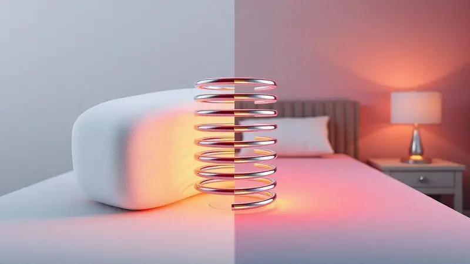
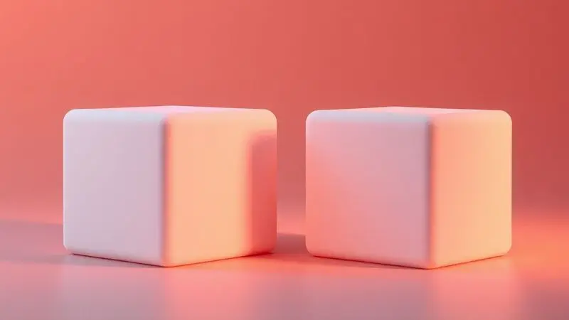

Imagine acordar mais uma vez com aquela pontada incômoda nas costas, sentindo que dormiu menos do que realmente passou na cama. Você já parou para pensar que a raiz desse problema pode estar literalmente debaixo de você?

A escolha da densidade certa do colchão não é apenas uma decisão técnica, é o fator mais crítico para transformar suas noites em verdadeiros momentos de renovação física e mental.

Neste guia, vamos descomplicar as siglas que parecem saídas de um laboratório (D23, D28, D33, D45) e traduzi-las para a linguagem do seu corpo.

Você vai descobrir qual densidade conversa melhor com seu peso, sua altura e seu jeito de dormir, garantindo que sua coluna receba o abraço perfeito todas as noites.

<SummaryList products={frontmatter.top_products} />

### 1. Espuma D23

<ProductBox 
  title={frontmatter.top_products[0].title} 
  image={frontmatter.top_products[0].image} 
  link={frontmatter.top_products[0].link} 
/>

Pense na D23 como aquela primeira bicicleta com rodinhas: perfeita para iniciar a jornada do sono, especialmente se você pesa até 60 kg.

Com 23 kg por metro cúbico, ela oferece uma maciez acolhedora que parece feita sob medida para crianças ou para quem busca um colchão econômico sem abrir mão do conforto básico.

O que você precisa saber é que essa leveza tem um preço na durabilidade. Em média, um colchão D23 te acompanha por 3 a 5 anos de sono tranquilo, tempo suficiente para uma fase da vida, mas talvez não para o longo prazo.

Se você está montando um quarto de visitas ou procurando uma opção temporária que não pese no bolso, ela pode ser sua aliada.

<CaixaProsContras>

**Prós:**

- Bom equilíbrio entre conforto e custo.

- Adequada para usuários leves (até 60 kg).

- Leve e macia, ideal para crianças.

- Boa opção para colchões de berço ou uso temporário.

**Contras:**

- Menos durável que espumas de maior densidade.

- Pode afundar rapidamente sob pesos maiores.

</CaixaProsContras>

### 2. Espuma D28

<ProductBox 
  title={frontmatter.top_products[1].title} 
  image={frontmatter.top_products[1].image} 
  link={frontmatter.top_products[1].link} 
/>

Agora imagine subir um degrau na escada do conforto. A D28, com seus 28 kg/m³, é aquele amigo que sabe ser suave sem deixar de te dar suporte.

Ela foi feita especialmente para quem pesa até 80 kg (ou até 90 kg se você for mais alto) e adora a sensação de afundar levemente ao deitar.

Seu toque é como um convite para relaxar profundamente, mas com uma ressalva: esse abraço macio pode cansar com o tempo se usado intensamente. Para o dia a dia pesado, você talvez queira considerar opções mais resistentes.

Porém, para camas de visita ou quartos infantis, onde o uso não é tão constante, ela brilha como uma estrela do conforto imediato.

<CaixaProsContras>

**Prós:**

- Conforto macio e agradável ao toque.

- Ideal para pessoas até 80 kg.

- Versátil, podendo ser usada em diferentes tipos de colchões e estofados.

- Ótima escolha para camas de visitas ou quartos infantis.

**Contras:**

- Menor durabilidade, podendo ceder mais rapidamente.

- Não é a melhor opção para pessoas mais pesadas ou que buscam firmeza.

</CaixaProsContras>

### 3. Espuma D33

<ProductBox 
  title={frontmatter.top_products[2].title} 
  image={frontmatter.top_products[2].image} 
  link={frontmatter.top_products[2].link} 
/>

Chegamos ao ponto de equilíbrio que a maioria das pessoas procura. A D33 é como aquele parceiro que sabe quando te aconchegar e quando te dar estrutura, firme o suficiente para manter sua coluna alinhada, mas flexível para se moldar aos seus contornos.

Com 33 kg/m³, ela conversa especialmente bem com pesos entre 70 e 100 kg.

Sua magia está na versatilidade: atende casais com perfis diferentes sem fazer concessões na qualidade do sono.

Sim, alguns podem achar que ela puxa mais para o lado firme, mas é exatamente essa característica que previne dores matinais e garante que você acorde verdadeiramente descansado.

<CaixaProsContras>

**Prós:**

- Boa combinação entre firmeza e conforto.

- Alta durabilidade e resistência ao uso.

- Versátil, atendendo a diferentes biotipos.

- Ajuda a manter a coluna alinhada.

**Contras:**

- Pode ser considerado um pouco firme para alguns usuários.

- Não é a melhor opção para quem busca um colchão muito macio.

</CaixaProsContras>

### 4. Espuma D45

<ProductBox 
  title={frontmatter.top_products[3].title} 
  image={frontmatter.top_products[3].image} 
  link={frontmatter.top_products[3].link} 
/>

Para quem precisa de um suporte que não negocia com a postura, a D45 é a escolha definitiva. Com impressionantes 45 kg/m³, ela é a espinha dorsal do mundo dos colchões, literalmente.

Se você lida com problemas de coluna, prefere superfícies firmes ou precisa suportar até 150 kg por pessoa, essa é sua aliada de ferro.

Pense nela como um investimento a longo prazo na saúde da sua coluna. A adaptação pode exigir alguns dias se você vem de colchões mais macios, mas o resultado é noites de sono onde seu corpo finalmente encontra o suporte que sempre desejou, sem meio-termo.

<CaixaProsContras>

**Prós:**

- Altamente durável, prolongando a vida útil do colchão.

- Oferece excelente suporte para posturas corretas durante o sono.

- Ideal para pessoas com problemas de coluna.

- Suporta pesos elevados sem deformar.

**Contras:**

- Pode ser muito firme para quem gosta de colchões mais macios.

- Necessita de tempo para adaptação caso você esteja acostumado a opções mais suaves.

</CaixaProsContras>

## Entendendo a Densidade de Colchões

Agora que você conhece as principais opções, vamos desvendar o que realmente significa essa tal de densidade. Pense nela como a personalidade do seu colchão, quanto mais denso, mais ele vai lembrar da sua forma e oferecer suporte consistente.

### Classificação da Densidade dos Colchões

Os colchões dançam em uma escala que vai do suave ao firme. Nas densidades mais baixas (abaixo de 20 kg/m³), você encontra a maciez que acolhe, perfeita para quem é leve e busca conforto imediato.

Conforme sobe a escada, entre 20 e 30 kg/m³, o equilíbrio entre aconchego e suporte se torna mais evidente. E quando ultrapassa os 30 kg/m³, entra no território da sustentação robusta, ideal para quem precisa que o colchão seja um verdadeiro aliado postural.

O segredo não está em escolher o mais macio ou o mais firme, mas em encontrar o ponto onde seu corpo diz 'sim, é exatamente isso que eu precisava'.

## Qual a Melhor Densidade para Colchão Segundo o seu Biotipo

Seu corpo tem uma linguagem própria, e a densidade certa é quem vai traduzi-la para noites de sono perfeitas.

### Biotipos e a Escolha da Densidade Ideal

Imagine que cada biotipo conversa com uma densidade específica. Se você pesa até 70 kg, densidades entre 20 e 26 kg/m³ vão te envolver sem sufocar. Entre 70 e 90 kg, a zona dos 28 a 33 kg/m³ oferece aquela combinação mágica de conforto que acolhe e suporte que sustenta.

Acima de 90 kg, densidades a partir de 33 kg/m³ se tornam suas guardiãs noturnas, garantindo que cada quilo do seu corpo seja respeitado com a sustentação adequada.

### Tabela de Densidade por Peso e Altura

Uma pessoa mais alta pode precisar que o colchão pense em comprimento, não apenas em densidade. Em geral, para pesos até 80 kg, densidades de 26 a 33 kg/m³ criam o cenário ideal.

Acima disso, o intervalo sobe para 33 a 40 kg/m³, assegurando que cada centímetro do seu corpo receba a atenção que merece.

## Tipos de Colchões e suas Densidades

A densidade é uma parte da história, mas o material conta outra. Espumas, molas, látex, cada um tem seu jeito de conversar com sua densidade ideal.

### Comparativo Entre Colchões de Espuma e Molas

Enquanto a espuma te abraça com uma adaptação personalizada, aliviando pontos de pressão como um massageador noturno, as molas oferecem a sensação de flutuar com uma ventilação que refresca a noite toda.

Sua escolha depende de qual conversa seu corpo prefere ter ao deitar: a do aconchego íntimo ou a do suporte arejado.

### A Importância da Resiliência e Suporte

Resiliência é a memória do seu colchão, a capacidade de lembrar sua forma original depois de te abraçar a noite toda. Já o suporte é como ele distribui seu peso, evitando que alguns pontos do seu corpo carreguem todo o fardo sozinhos.

Juntas, essas duas qualidades transformam dormir de uma necessidade em uma experiência de renovação profunda.

## Qual espuma é melhor D28 ou D33?

Entre a maciez convidativa da D28 e o suporte estruturado da D33, qual escolher? A resposta está na sua relação com a cama. Se você busca um colchão que seja um refúgio imediato de conforto, a D28 estende seus braços.

Mas se precisa de um parceiro que te ajude a manter a postura enquanto dorme, investindo em anos de saúde vertebral, a D33 mostra sua força. A durabilidade maior da D33 transforma a compra em um investimento que retorna em bem-estar todas as manhãs.

## Espuma D28 vs D33 vs D45: diferenças na prática

Coloque as três lado a lado e você verá uma progressão natural do conforto para a sustentação. A D28 é o tapete vermelho do sono, macia, acolhedora, perfeita para quem é leve ou moderado.

A D33 é o equilíbrio personificado, atendendo à maioria com uma versatilidade impressionante. Já a D45 é a fundação sólida, para quem precisa que o colchão seja uma extensão da própria disciplina postural.

Seu peso e sua relação com a firmeza ditam qual dessas personalidades vai ser sua companheira noturna.

## Espuma D28 vs D33 vs D45 para casal com pesos diferentes

Quando dois corpos com pesos distintos dividem a mesma cama, a densidade precisa ser uma diplomata. A D28 pode seduzir com sua maciez, mas talvez não tenha a resistência para o relacionamento diário.

A D33 emerge como a mediadora ideal, encontrando um ponto comum entre conforto e durabilidade que agrada a ambos. E a D45, com sua firmeza inegociável, pode ser a solução quando um dos parceiros precisa de suporte especializado.

O segredo está em ouvir o que cada corpo pede e encontrar a densidade que faça os dois acordarem felizes.

## FAQ: Perguntas Frequentes

### 1. Qual densidade é ideal para quem tem dor nas costas?

Para quem convive com dores nas costas, a zona dos 28 a 33 kg/m³ costuma ser o sweet spot. É como encontrar a mão que segura sua coluna sem apertar demais, firmeza suficiente para alinhar, flexibilidade para acomodar suas curvas naturais.

Colchões muito duros podem criar novos pontos de tensão, enquanto os excessivamente macios deixam sua coluna à deriva. Nesse meio-termo é que seu corpo encontra o repouso que realmente repara.

### 2. Quem dorme de lado deve usar colchão mais firme ou mais macio?

Se você dorme de lado, imagine que seus ombros e quadris são pontos de ancoragem que precisam de um colchão que os abrace sem pressionar. A maciez moderada permite que essas áreas afundem suavemente, mantendo sua coluna em uma linha reta e feliz.

Firmeza demais empurra essas articulações para cima, criando tensão. Maciez excessiva deixa sua coluna curvada. O equilíbrio é a chave para acordar sem sentir que passou a noite em uma batalha postural.

### 3. Um colchão de densidade alta é sempre mais duro?

Não necessariamente. A densidade alta significa mais material por metro cúbico, mas como esse material se comporta depende da tecnologia por trás dele.

Espumas viscoelásticas de alta densidade podem se moldar ao seu corpo como um cobertor inteligente, oferecendo suporte sem rigidez.

Pense na densidade como a quantidade de memória que o colchão tem do seu corpo, quanto maior, mais ele se lembra de você, não necessariamente mais duro ele é.

### 4. Como saber se estou usando a densidade errada?

Seu corpo é o melhor detector de densidade inadequada. Acordar com dores persistentes é seu sinal vermelho. Sentir que afunda até sentir o fundo da cama ou, ao contrário, deitar sobre uma superfície que não cede um milímetro são pistas claras.

A densidade certa é aquela que faz você esquecer que está em um colchão, você simplesmente dorme. Se você pensa na cama enquanto tenta descansar, é hora de reconsiderar sua escolha.

## Conclusão

Escolher a densidade perfeita para seu colchão vai além de comparar números em uma tabela. É sobre entender o diálogo silencioso entre seu corpo e a superfície que o acolhe todas as noites.

É reconhecer que cada quilo do seu peso merece respeito, cada centímetro da sua altura pede atenção, cada curva da sua coluna clama por suporte inteligente.

Quando você encontra a densidade que fala a língua do seu corpo, algo mágico acontece: dormir deixa de ser uma pausa obrigatória e se transforma em um ritual de renovação. Você para de contar horas de sono e começa a vivenciar qualidade de descanso.

As manhãs ganham uma leveza diferente, as dores ficam no passado, e seu colchão se torna não um móvel, mas um parceiro dedicado ao seu bem-estar.

Pense nesta escolha como o investimento mais importante que você faz em si mesmo, um que retorna dividendos todas as manhãs na forma de energia, disposição e saúde. Sua coluna agradece, suas noites se transformam, e você redescobre o verdadeiro significado de descansar.