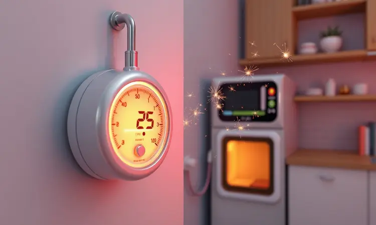
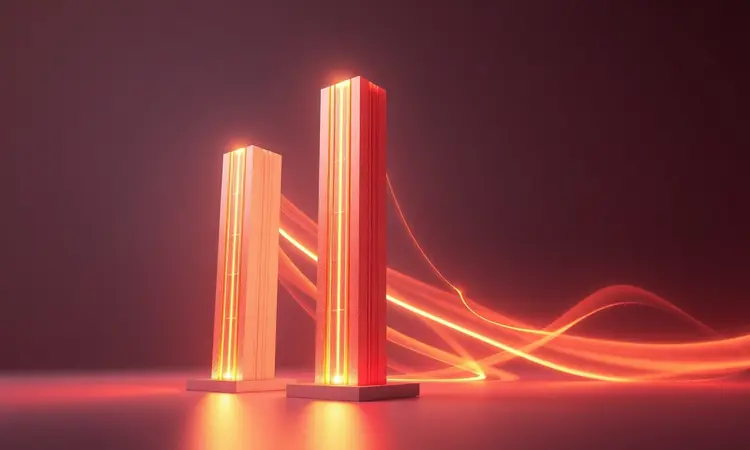
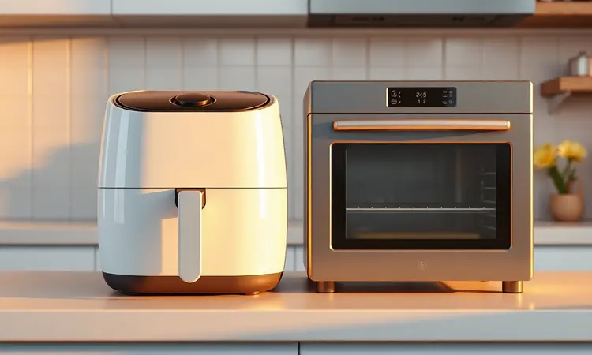

Você comprou uma air fryer com a promessa de uma alimentação mais saudável, mas agora sente um frio na barriga toda vez que olha para a conta de luz? Essa preocupação é mais comum do que você imagina.

A verdade é que, quando escolhida e usada com inteligência, sua fritadeira pode ser sua maior aliada na economia, transformando sua cozinha sem pesar no bolso.

Neste guia, vamos desvendar quais modelos realmente economizam energia em 2024 e, mais importante, como você pode aproveitar todas as vantagens sem sustos no final do mês.

<SummaryList products={frontmatter.top_products} />

## Air Fryer Gasta Muita Energia? Entenda o Impacto na Conta de Luz

Pense na última vez que você ligou o forno convencional. Aquele aquecimento lento, a sensação de que a energia está literalmente escapando pelo ar. Agora imagine um aparelho que atinge a temperatura ideal em minutos e cozinha sua refeição em metade do tempo.

Essa é a diferença prática entre o consumo das air fryers e os métodos tradicionais.

Enquanto um forno pode deixar você esperando 20 minutos só para pré-aquecer, sua air fryer já está trabalhando desde o primeiro minuto, usando sua eficiência para transformar energia em comida, não em calor perdido.

## Como Calcular o Consumo de Energia da sua Air Fryer (Fórmula Simples)

Deixe-me tornar essa matemática menos assustadora. Tudo que você precisa saber está no próprio aparelho: a potência em watts. É como saber quantos cavalos tem o carro antes de comprar. Pegue esse número, multiplique pelas horas que usa por dia e divida por 1000.

Pronto, você tem o consumo em quilowatt-hora.

Vamos criar um cenário real: se sua air fryer de 1500W cozinha sua batata doce em 20 minutos (0,33 horas), ela consome apenas 0,5 kWh.

Multiplique isso pelos dias que realmente usa no mês e você terá um número que, contra todas as suas expectivas, provavelmente vai fazer você sorrir. Essa simplicidade é o primeiro passo para transformar preocupação em controle.

## Potência vs. Eficiência: Por que a Menor Potência nem Sempre Economiza Mais?

Aqui está um segredo que poucos contam: escolher uma air fryer apenas pela potência mais baixa é como comprar um carro pelo menor motor, sem considerar que ele vai passar mais tempo na estrada.

Um modelo de 1800W que cozinha em 15 minutos pode ser mais econômico que um de 1200W que leva 25 minutos, porque o tempo de uso compensa a potência extra.

O que realmente importa é como a tecnologia trabalha para você. Algumas air fryers distribuem calor de forma mais inteligente, outras mantêm a temperatura constante sem oscilações que gastam energia extra.

E lembre-se: aquecer rapidamente e manter a temperatura é mais eficiente do que ficar ligando e desligando para compensar perdas de calor. É sobre trabalho inteligente, não trabalho forçado.

## As Melhores Air Fryers que Gastam Menos Energia em 2024

Depois de entender a teoria, vamos para a prática. Escolher a air fryer certa é como encontrar o parceiro perfeito para sua cozinha: precisa combinar com seu estilo de vida, seus hábitos e, claro, seu espaço.

Estas são as que realmente entendem o valor do seu dinheiro e do seu tempo.

### 1. Air Fryer Arno Compacta (PFRY) - Eficiência para Quem Mora Só

<ProductBox 
  title={frontmatter.top_products[0].title} 
  image={frontmatter.top_products[0].image} 
  link={frontmatter.top_products[0].link} 
/>

Imagine aqueles dias em que você chega em casa cansado e só quer algo rápido, saudável e sem complicações. A Arno Compacta foi feita para esses momentos.

Com seus 1030W, ela não vai dominar sua tomada, mas vai oferecer aquele preparo rápido que transforma um filé de frango e alguns legumes em uma refeição digna de restaurante em minutos.

Para quem vive solo, sua capacidade de 1,6 litros é a medida perfeita: nada de sobras que viram esquecimento na geladeira. O controle de temperatura de 80°C a 200°C significa que você pode desde descongelar delicadamente até criar aquela crocância perfeita nas batatas.

E o melhor: ela entende que economia de energia começa com eficiência de espaço, cabendo até na menor bancada sem dominar sua cozinha.

### 2. Air Fryer Mondial Family 4L - O Equilíbrio entre Tamanho e Consumo

<ProductBox 
  title={frontmatter.top_products[1].title} 
  image={frontmatter.top_products[1].image} 
  link={frontmatter.top_products[1].link} 
/>

Quando a família inteira espera o jantar, você precisa de um aliado que não traga surpresas na conta no final do mês.

A Mondial Family encontra esse equilíbrio delicado: 4 litros de capacidade para atender a todos, com um consumo que fica em apenas 0,67 kWh por uso normal.

Seu cesto quadrado não é apenas uma questão de design; é sobre distribuição uniforme de calor que cozinha tudo ao mesmo tempo, sem precisar virar ou reorganizar.

E quando você programa os 60 minutos de timer, pode cuidar das crianças, ajudar com a lição de casa ou simplesmente relaxar sabendo que nada vai queimar ou ficar ligado além do necessário. É a praticidade que respeita seu orçamento.

### 3. Air Fryer Electrolux Efficient 5L (EAF51) - Tecnologia que Otimiza o Tempo

<ProductBox 
  title={frontmatter.top_products[2].title} 
  image={frontmatter.top_products[2].image} 
  link={frontmatter.top_products[2].link} 
/>

Para famílias que não abrem mão da variedade no cardápio, a Electrolux Efficient entrega oito receitas pré-programadas que eliminam adivinhações. Você seleciona o que vai preparar, e ela ajusta temperatura e tempo automaticamente.

São 1700W trabalhando com inteligência, não com força bruta, resultando em consumo aproximado de 1,01 kWh que se traduz em menos tempo na cozinha e mais tempo juntos.

O revestimento antiaderente não é apenas um detalhe de limpeza fácil; é sobre eficiência energética. Sem resíduos grudados, o calor circula melhor, os alimentos cozinham mais rápido e você usa menos energia ciclo após ciclo.

É tecnologia que pensa no futuro, tanto do seu paladar quanto da sua conta de luz.

### 4. Air Fryer Philco Digital Inox - Controle Preciso de Temperatura

<ProductBox 
  title={frontmatter.top_products[3].title} 
  image={frontmatter.top_products[3].image} 
  link={frontmatter.top_products[3].link} 
/>

Algumas pessoas gostam de arte na cozinha, de ajustar nuances que transformam o comum em especial. Para esses chefs domésticos, a Philco Digital Inox oferece o controle de temperatura de 80°C a 200°C com precisão de grau em grau.

É a diferença entre um frango apenas cozido e um frango dourado perfeitamente.

Das versões compactas de 3,2L para experimentos solitários até os 12L para grandes celebrações, ela entende que economia não é sobre tamanho, mas sobre usar exatamente o que você precisa.

O display digital não é apenas moderno; é sobre clareza que elimina erros, e erros em temperatura significam tempo extra de cozimento, que significa energia desperdiçada.

### 5. Air Fryer Britânia BFR31 - Opção Econômica e Compacta

<ProductBox 
  title={frontmatter.top_products[4].title} 
  image={frontmatter.top_products[4].image} 
  link={frontmatter.top_products[4].link} 
/>

Às vezes, simplicidade é a sofisticação máxima. A Britânia BFR31 aceita essa filosofia com seus 1300W que trabalham de forma tão eficiente que você quase esquece que ela está ligada.

Para casais ou solteiros urbanos, seus 3 litros são o espaço ideal: suficiente para uma refeição completa, mas não tanto que incentive o desperdício.

Seu sistema Air Flow 360° é a promessa cumprida de que cada watt será usado para criar crocância, não apenas gerar calor.

E quando o timer de 60 minutos desliga automaticamente, você tem a segurança de saber que nada ficará ligado desnecessariamente enquanto você se distrai com uma série ou uma ligação importante. É contenção inteligente, não limitação.

### 6. Air Fryer Oster Compact - Performance com Menor Gasto por Ciclo

<ProductBox 
  title={frontmatter.top_products[5].title} 
  image={frontmatter.top_products[5].image} 
  link={frontmatter.top_products[5].link} 
/>

A Oster Compact entende algo fundamental: economia de energia começa na eficiência de cada ciclo, não apenas na potência nominal. Sua tecnologia de convecção turbo significa que o ar circula com propósito, cozinhando uniformemente em menos tempo.

Os 1500W a 1800W podem parecer altos até você perceber que terminou em 15 minutos o que levaria 30 em outros modelos.

E aqui está o segredo que os usuários descobrem: substituir múltiplos eletrodomésticos por uma única air fryer que faz tudo bem significa menos dispositivos ligados, menos tomadas ocupadas e uma eficiência que se multiplica.

É sobre pensar na cozinha como um sistema, não como uma coleção de aparelhos isolados.

## Air Fryer vs. Forno Elétrico: Qual é a Opção Mais Barata?

Pense em uma analogia: seu forno elétrico é como aquecer uma sala inteira para sentar em uma única cadeira. Sua air fryer é como um aquecedor pessoal direcionado exatamente onde você precisa. A diferença não está apenas nos números, mas na filosofia de uso.

Enquanto o forno precisa pré-aquecer grandes espaços vazios, a air fryer começa a trabalhar imediatamente no volume exato de comida.

Para o dia a dia, para aquelas refeições rápidas, para quando você quer algo crocante sem ligar todo um forno, a escolha se torna óbvia. Mas reconhecemos: para grandes assados familiares, para pizzas grandes, o forno ainda tem seu lugar.

A verdadeira economia vem de saber qual ferramenta usar para qual trabalho.

## 7 Dicas Práticas para Economizar Energia ao Usar sua Fritadeira Elétrica

1. Esqueça o pré-aquecimento automático: muitos modelos modernos aquecem tão rápido que você pode colocar os alimentos direto e economizar esses minutos preciosos

2. Preencha, mas não sobrecarregue: a quantidade ideal permite que o ar circule livremente, cozinhando tudo uniformemente em menos tempo

3. Conheça as temperaturas das suas receitas preferidas: ajustes constantes consomem mais energia do que manter uma temperatura estável

4. Programe como um profissional: usar o timer não é apenas segurança, é garantir que não ficará ligada um minuto além do necessário

5. Limpeza é economia: um cesto limpo significa melhor circulação de ar, que significa cozimento mais rápido

6. Agende seus preparos: se possível, use em horários de menor custo energético (consulte sua concessionária)

7. Aproveite o calor residual: muitos alimentos continuam cozinhando por um minuto após desligar, use isso a seu favor

## Conclusão

No início deste guia, você pode ter visto sua air fryer com certa desconfiança financeira. Agora espero que veja ela como o que realmente é: uma ferramenta de transformação não apenas alimentar, mas também econômica.

A verdadeira economia não está apenas no aparelho que você compra, mas em como você o integra à sua vida.

Cada uma das opções que apresentamos oferece uma abordagem diferente para o mesmo objetivo: comer melhor, gastando menos energia.

Seja na praticidade da Arno Compacta para quem vive solo, na capacidade familiar da Electrolux, ou na precisão artesanal da Philco, o que une todas elas é a compreensão de que eficiência energética não é um detalhe técnico, é uma experiência.

Quando você escolhe o modelo certo para seu perfil e adota os hábitos inteligentes que compartilhamos, algo mágico acontece: a preocupação com a conta de luz dá lugar à satisfação de ver alimentos deliciosos surgirem de forma rápida, saudável e, sim, econômica.

Sua air fryer deixa de ser mais um eletrodoméstico para se tornar seu parceiro em uma jornada de alimentação consciente e financeiramente inteligente. E no final, é essa transformação que realmente importa.

## Perguntas Frequentes sobre Consumo de Air Fryer

Elas realmente economizam comparadas aos fornos? Absolutamente. A chave está na eficiência: menos espaço para aquecer, menos tempo para cozinhar, menos energia desperdiçada.

Mas a verdadeira economia vem do uso inteligente, saber que potência não é inimiga quando acompanhada de tecnologia eficiente.

E sobre os watts? Eles são apenas parte da história. 1500W em um modelo que cozinha em 15 minutos podem ser mais econômicos que 1200W em 25. O que realmente importa é o resultado final: comida pronta, saborosa e com o menor impacto possível na sua conta.

Porque no final, você não está comprando watts, está comprando tempo de qualidade na cozinha e tranquilidade no final do mês.