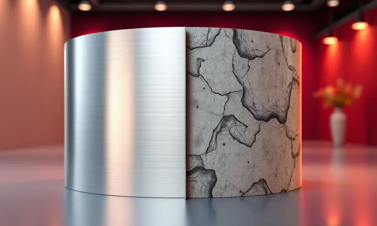
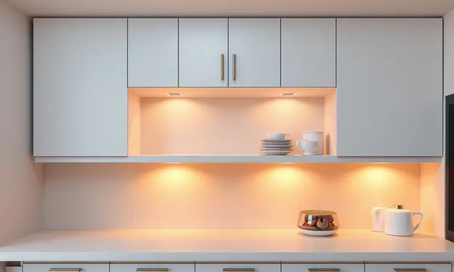

Você já sentiu aquela pontada de frustração ao ver os primeiros pontos marrons surgindo no cesto da sua fritadeira? Ou a decepção quando o revestimento começa a descascar, deixando marcas na sua comida?

Essas cenas são lamentavelmente comuns, mas a boa notícia é que elas não precisam fazer parte da sua rotina culinária. Existem air fryers projetadas para resistir não apenas ao tempo, mas também aos nossos hábitos mais descuidados.

Ao longo deste guia, vamos desconstruir mitos, entender o que realmente causa a ferrugem e descobrir modelos que mantêm sua aparência de nova por muito mais tempo.

<SummaryList products={frontmatter.top_products} />

## Por que a Air Fryer enferruja? Entenda as causas principais

Imagine o ambiente dentro da sua air fryer durante o uso: calor intenso, vapor subindo dos alimentos, partículas de gordura e sal em suspensão. Esta combinação é o cenário perfeito para a corrosão quando encontra materiais de baixa qualidade.

A ferrugem não é simplesmente "azar" - ela é o resultado previsível dessa exposição constante a condições adversas.

### 1. Umidade e resíduos de sal: Os inimigos invisíveis

Você lava o cesto rapidamente após usar e o guarda ainda úmido? Esse simples gesto pode estar comprometendo sua fritadeira. A umidade residual penetra nas microfissuras do revestimento, iniciando um processo silencioso de oxidação.

O sal, por sua vez, age como um catalisador, acelerando a corrosão de forma quase imperceptível até que apareçam os primeiros sinais visíveis.

A solução está na mudança de um hábito aparentemente inocente: garantir que cada componente esteja completamente seco antes de ser guardado.

### 2. Uso de esponjas abrasivas e produtos químicos

Na pressa do dia a dia, é tentador pegar aquela esponja de aço para remover a gordura mais teimosa.

Mas esse atalho tem um preço caro: cada movimento abrasivo cria microarranhões que vão além da superfície antiaderente, expondo o metal subjacente à umidade e aos resíduos.

Produtos químicos agressivos, por sua vez, deterioram a composição do revestimento, deixando-o mais vulnerável. A paciência com panos macios e detergentes suaves é o investimento que mantém seu aparelho funcionando como novo.

## Como escolher uma Air Fryer resistente à corrosão

Entendendo essas causas, fica claro que o material de fabricação não é apenas um detalhe estético ou de marketing. É a barreira fundamental entre sua comida e os elementos que causam deterioração.

Ao avaliar opções, preste atenção não apenas ao que está na embalagem, mas ao que está por trás dela.

### O diferencial do Inox vs. Antiaderente de baixa qualidade

Enquanto alguns revestimentos antiaderentes prometem facilidade de limpeza mas escondem uma fragilidade estrutural, o aço inoxidável traz uma proposta diferente: durabilidade inerente.

Essa resistência não significa apenas que seu aparelho vai durar mais anos, mas que ele não liberará partículas indesejadas na sua comida conforme o tempo passa.

A escolha pelo inox é, em essência, uma decisão pela tranquilidade - saber que o material permanecerá estável e seguro independentemente da frequência de uso.

### Air Fryer tipo Gaveta vs. Modelo Oven: Qual dura mais?

Se você prioriza simplicidade mecânica e menos partes que podem falhar, as air fryers tipo gaveta oferecem uma vantagem estrutural. Com menos componentes móveis e um design mais direto, elas apresentam menos oportunidades para que a umidade encontre pontos de entrada.

Os modelos oven, por outro lado, ampliam suas possibilidades culinárias com a adição de funções extras, mas essa complexidade adicional traz mais juntas, mais partes removíveis e mais áreas onde a manutenção da vedação se torna crítica.

Sua escolha deve equilibrar a versatilidade desejada com a consciência de que cada função extra é também um ponto potencial de atenção.

O segredo está em identificar qual combinação de materiais e design se adapta não apenas ao seu orçamento, mas à sua rotina real de uso e limpeza. E é com esse critério em mente que exploramos os modelos que realmente fazem diferença.

## As 7 Melhores Air Fryers que Não Enferrujam em 2024

Selecionamos não apenas as air fryers mais bem avaliadas, mas aquelas cuja construção demonstra entendimento das ameaças reais à durabilidade. Estes são modelos que transformam especificações técnicas em experiência duradoura.

### 1. Mondial Air Fryer Forno Oven 12L (AFON-12L-BI)

<ProductBox 
  title={frontmatter.top_products[0].title} 
  image={frontmatter.top_products[0].image} 
  link={frontmatter.top_products[0].link} 
/>

Para quem imagina domingos com assados para a família toda, a Mondial oferece uma experiência generosa. Seus 12 litros não são apenas um número na ficha técnica - são o espaço necessário para preparar desde batatas rústicas até um frango inteiro.

O revestimento Duraflon cumpre o que promete: após assar queijos derretidos ou preparar alimentos mais aderentes, você percebe como os resíduos se soltam com muito menos esforço.

Sim, em troca dessa capacidade ampla, você precisará estar atento à distribuição do calor entre as diferentes prateleiras, mas essa pequena atenção é recompensada com a liberdade de cozinhar em escala familiar.

### 2. Arno Airfryer Oven & Grill Expert 11L

<ProductBox 
  title={frontmatter.top_products[1].title} 
  image={frontmatter.top_products[1].image} 
  link={frontmatter.top_products[1].link} 
/>

A Arno entende que cozinha moderna precisa de múltiplas soluções em um só aparelho. Imagine preparar legumes assados na prateleira superior enquanto grelha frango na intermediária e mantém pães aquecidos na inferior - tudo simultaneamente.

A tecnologia Hot Air não é apenas uma expressão de marketing: você realmente percebe como o alimento doura de maneira uniforme, sem aqueles pontos mais escuros que denunciam falhas de circulação.

A compatibilidade com lava-louças transforma o pós-preparo em algo quase despreocupado, enquanto o design em inox mantém sua elegância mesmo após meses de uso intenso.

### 3. Electrolux Experience EAF90 com Tecnologia Inox

<ProductBox 
  title={frontmatter.top_products[2].title} 
  image={frontmatter.top_products[2].image} 
  link={frontmatter.top_products[2].link} 
/>

Quando a preocupação com materiais duradouros guia sua escolha, a Electrolux oferece resposta concreta. O inox não está aqui apenas como detalhe estético - é uma declaração sobre como o produto foi concebido para resistir.

Você percebe essa diferença na limpeza: onde outros modelos acumulam manchas persistentes de gordura, uma passada de pano recupera o brilho original.

Os 3,5 litros do cesto interno podem parecer modestos frente aos 12 litros totais, mas essa configuração inteligente permite que você prepare pequenas porções sem desperdiçar energia ou espaço. É a escolha racional para quem valoriza permanência.

### 4. Oster Super Fryer 10L - Alta resistência

<ProductBox 
  title={frontmatter.top_products[3].title} 
  image={frontmatter.top_products[3].image} 
  link={frontmatter.top_products[3].link} 
/>

A sensação de robustez é imediata ao manusear a Oster Super Fryer. Este não é um aparelho que parece frágil - a construção transmite solidez.

Sua tecnologia 3 em 1 entrega exatamente o que muitos buscam: a transição suave entre fritar batatas palha, assar legumes crocantes e desidratar frutas sem necessidade de equipamentos adicionais.

O consumo de energia reflete sua potência, mas também significa que seu jantar estará pronto enquanto você ainda está escolhendo o vinho.

Para quem tem espaço na bancada e não quer ficar trocando de aparelho conforme muda o cardápio, ela representa uma central culinária compacta.

### 5. Philco Air Fryer Oven PFR2200P

<ProductBox 
  title={frontmatter.top_products[4].title} 
  image={frontmatter.top_products[4].image} 
  link={frontmatter.top_products[4].link} 
/>

Há um prazer particular em descobrir que seu equipamento pode fazer mais do que o esperado.

Com a Philco, a função "desidratar" deixa de ser um recurso exótico e se torna parte da rotina - imagine ter tomates secos ou chips de vegetais sem precisar de equipamento especializado.

O revestimento cerâmico antiaderente demonstra sua qualidade quando alimentos normalmente grudentos, como queijo ou massas com molho, se soltam inteiros. Ela requer espaço, sim, mas em compensação reduz a necessidade de múltiplos eletrodomésticos ocupando sua cozinha.

### 6. Britânia Air Fry Oven BFR2100P

<ProductBox 
  title={frontmatter.top_products[5].title} 
  image={frontmatter.top_products[5].image} 
  link={frontmatter.top_products[5].link} 
/>

Precisa de uma fritadeira que entenda desde o café da manhã com pães crocantes até o jantar com peixes assados? A Britânia estabelece um diálogo intuitivo através de seu painel touch. Ajustar temperatura e tempo se torna gestos naturais, não uma decifração de manuais.

O cuidado necessário com o visor de acrílico é o preço dessa interface amigável - um pequena compensação pela facilidade com que você programa receitas complexas.

Quem valoriza a relação direta com o eletrodoméstico encontrará aqui um parceiro culinário que não exige constante consulta a instruções.

### 7. Philips Walita Digital Série 3000 (Starfish)

<ProductBox 
  title={frontmatter.top_products[6].title} 
  image={frontmatter.top_products[6].image} 
  link={frontmatter.top_products[6].link} 
/>

Às vezes, menos é mais - especialmente quando o "menos" vem com a precisão da Philips. A tecnologia Starfish não é um nome bonito: você vê seu efeito na crocância uniforme das batatas, sem aquelas extremidades queimadas enquanto o centro ainda está mole.

Para o cotidiano de casais ou pequenas famílias, seus 4,1 litros representam a medida exata entre capacidade suficiente e economia de espaço. Ela faz uma declaração silenciosa: eficiência não precisa vir acompanhada de excessos.

Sua potência moderada de 1400W traduz-se em contas de energia que não surpreendem negativamente.

## O Segredo da Longevidade: Como evitar a ferrugem na sua fritadeira

Depois de investir em um modelo com construção adequada, a verdadeira diferença surge nos cuidados diários. Estes não são rituais complexos, mas sim uma nova relação com seu eletrodoméstico.

### O Passo a Passo da 'Cura' do Antiaderente

Pense na cura do antiaderente não como uma exigência tediosa, mas como um ritual de apresentação entre você e seu novo equipamento. Comece com uma limpeza profunda que remove todos os resíduos de fabricação.

A aplicação da fina camada de óleo pode parecer contra intuitiva após lavar, mas é exatamente essa película que vai selar as microporosidades do material.

Os 15 minutos a 180°C não são apenas um tempo de espera - são o processo onde o óleo se polimeriza, criando uma barreira quase invisível mas extraordinariamente eficiente. Ao final, você não terá apenas um cesto limpo, mas um cesto preparado para anos de uso.

### Dicas de Limpeza: O que nunca usar no cesto e na grade

A mentalidade aqui é simples: trate o revestimento como você trataria uma boa panela antiaderente - porque é exatamente isso que ele é. As esponjas abrasivas são tão inadequadas quanto usar uma lixa em um móvel envernizado.

Produtos químicos agressivos não apenas removem a sujeira, mas também as camadas protetoras que foram cuidadosamente aplicadas na fábrica. E quanto à imersão prolongada?

Imagine deixar um livro aberto sob a chuva - as páginas não secam uniformemente, criando ondulações permanentes. Com o cesto, a água estagnada nos cantos inacessíveis inicia pontos de oxidação que você só descobrirá meses depois.

### Onde guardar sua Air Fryer para evitar a maresia e umidade

O local de armazenamento ideal não é necessariamente o mais conveniente, mas o mais seco.

Se sua cozinha tem aquela parede que sempre parece fria ou um armário próximo à janela que embaça no inverno, estes são ambientes que silenciosamente trabalham contra a durabilidade do seu aparelho.

A capa protetora não é acessório supérfluo - é o equivalente a um casaco para dias chuvosos, impedindo que a poeira (que retém umidade) se acumule nas entradas de ar.

E nunca subestime o poder da secagem completa: aquelas gotículas quase invisíveis na grelha inferior podem ser suficientes para iniciar o processo que você tanto quer evitar.

## Perguntas Frequentes (FAQ)

### Air fryer com cesto de inox é realmente melhor?

O que define "melhor" aqui? Se seu critério é durabilidade extrema e eliminação completa da preocupação com descascamento do revestimento, então sim, o inox oferece vantagens tangíveis.

Ele não desenvolve camadas de desgaste visual que muitas vezes são confundidas com problemas de higiene. A limpeza se torna mais previsível - não há camadas sensíveis que possam ser danificadas por variações de temperatura ou produtos de limpeza.

O peso adicional não é apenas consequência do material, mas também do fato de que essas estruturas são geralmente mais espessas, mais resistentes. Para quem planeja usar a fritadeira diariamente por anos, essa robustez se traduz em economia a longo prazo.

### O que fazer se a minha air fryer já começou a enferrujar?

Primeiro, mantenha a calma: pontos iniciais de ferrugem nem sempre significam aposentadoria imediata do aparelho. A mistura de vinagre e bicarbonato funciona como um tratamento localizado, removendo a oxidação sem agredir o material circundante.

O que importa após essa limpeza é a honestidade na avaliação: o dano é superficial, apenas na superfície, ou há espessura comprometida?

Se ao passar a unha você sente que o material está afrouxado ou escamando, pode ser sinal de que a corrosão avançou além da camada superficial.

Nesses casos, a substituição da peça específica (muitas vezes disponível separadamente) pode ser mais sensata que insistir em um componente já comprometido estruturalmente.

### Posso usar papel alumínio para proteger o cesto?

Pode, mas com a sabedoria de quem conhece os limites dessa proteção. O alumínio é excelente para conter derramamentos ou para alimentos que liberam líquidos em excesso, mas ele altera fundamentalmente a aerodinâmica do ar quente dentro da câmara.

Pense como usar guarda-chuva em ventania forte: oferece proteção direta, mas muda completamente como você se move no ambiente.

Para alimentos que dependem da circulação de ar para obter crocância uniforme (como batatas fritas ou empanados), o alumínio pode criar bolsões de vapor que amolecem justamente a textura que você mais deseja.

Use-o estrategicamente, nunca como solução permanente para evitar limpeza.

## Conclusão

A escolha da air fryer ideal vai além da comparação de especificações técnicas - é sobre encontrar o equilíbrio entre as necessidades da sua cozinha e a realidade da sua rotina. Os materiais resistentes à corrosão não são um luxo, mas uma proteção ao seu investimento.

A tecnologia inox, os revestimentos de alta qualidade e os designs que consideram a manutenção não apenas prolongam a vida útil do aparelho, mas transformam sua experiência diária: menos tempo esfregando, menos preocupação com deterioração precoce, mais confiança na segurança dos alimentos preparados.

Observe que os modelos mais duráveis não necessariamente são os mais caros, mas aqueles cuja construção demonstra entendimento das condições reais de uso.

A Philips Walita oferece precisão em escala compacta, a Electrolux aposta na solidez do inox, a Mondial entrega capacidade generosa para celebrações familiares - cada uma responde a diferentes prioridades com a mesma preocupação com longevidade.

A chave final está em reconhecer que a durabilidade é uma parceria: o fabricante fornece os materiais e a engenharia adequados, e você complementa com os cuidados simples mas consistentes no dia a dia.

Quando essa combinação acontece, sua air fryer deixa de ser um eletrodoméstico com data de validade presumida e se torna um companheiro culinário para os próximos anos.

Qual desses modelos parece entender melhor como você cozinha - e como você quer continuar cozinhando daqui a três anos?